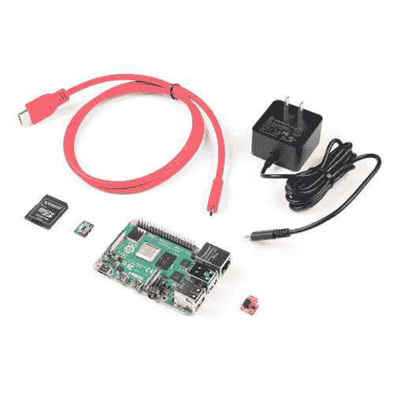

# 用于 Raspberry Pi 连接指南的 Qwiic 垫片套件

> 原文：<https://learn.sparkfun.com/tutorials/qwiic-shim-kit-for-raspberry-pi-hookup-guide>

## 介绍

用于 Raspberry Pi 的 Qwiic SHIM Kit 让你从围绕 I ² C 和 Python 的一些基础知识开始。本教程将介绍如何连接支持 Qwiic 的设备，安装它们的 Python 包，并运行示例代码。

[](https://www.sparkfun.com/products/16987) 

将**添加到您的[购物车](https://www.sparkfun.com/cart)中！**

 **### [树莓派 SparkFun Qwiic 垫片套件](https://www.sparkfun.com/products/16987)

[In stock](https://learn.sparkfun.com/static/bubbles/ "in stock") KIT-16987

spark fun Qwiic SHIM Kit for Raspberry Pi 提供了将您的 Raspberry Pi 变成 Qwiic 使能设备所需的一切

$32.50[Favorited Favorite](# "Add to favorites") 10[Wish List](# "Add to wish list")** **[https://www.youtube.com/embed/iaJzgP0qUeQ/?autohide=1&border=0&wmode=opaque&enablejsapi=1](https://www.youtube.com/embed/iaJzgP0qUeQ/?autohide=1&border=0&wmode=opaque&enablejsapi=1)

### 所需材料

按照本教程，你还需要一些硬件。带有 Raspberry Pi 40 针 GPIO 标准接头的单板计算机也可以工作。我们将在整个教程中使用树莓 Pi。如果您没有使用过 Raspberry Pi，我们建议您将 Qwiic 垫片套件与 Raspberry Pi 4 套件配对使用。至少，你需要一个基本的工具包。但是，如果您需要键盘和鼠标组合，我们建议您购买桌面套件。

[](https://www.sparkfun.com/products/16384) 

### [SparkFun 树莓 Pi 4 基础套装- 4GB](https://www.sparkfun.com/products/16384)

[Out of stock](https://learn.sparkfun.com/static/bubbles/ "out of stock") KIT-16384

Raspberry Pi 4 基本套件包括启动和运行 Raspberry Pi 4 4GB 所需的一切。

6[Favorited Favorite](# "Add to favorites") 21[Wish List](# "Add to wish list")[](https://www.sparkfun.com/products/16386) 

### [SparkFun 树莓 Pi 4 桌面套装- 4GB](https://www.sparkfun.com/products/16386)

[Out of stock](https://learn.sparkfun.com/static/bubbles/ "out of stock") KIT-16386

SparkFun Raspberry Pi 4 桌面套件(4GB)包括将任何带 HDMI 端口的显示器变成桌面所需的一切

[Favorited Favorite](# "Add to favorites") 10[Wish List](# "Add to wish list")

#### 可选材料

当涉及到使用树莓派时，您有几种选择。最常见的是，Pi 被用作一台独立的计算机，它需要一台显示器。如果您选择小显示器，以下部件可用于 Pi 4。为了节省成本，Pi 还可以用作 [*无头*电脑](https://learn.sparkfun.com/tutorials/headless-raspberry-pi-setup/all)(没有显示器、键盘和鼠标)。这种设置有一个稍微难一点的学习曲线，因为你需要从另一台计算机上使用*命令行界面* (CLI)。

[](https://www.sparkfun.com/products/13733) 

将**添加到您的[购物车](https://www.sparkfun.com/cart)中！**

 **### [【树莓派 LCD - 7】触摸屏](https://www.sparkfun.com/products/13733)

[In stock](https://learn.sparkfun.com/static/bubbles/ "in stock") LCD-13733

这款 7 英寸的 Raspberry Pi 触摸屏液晶显示器让您能够创建一个独立的设备，可以用作一个触摸屏

$60.0051[Favorited Favorite](# "Add to favorites") 150[Wish List](# "Add to wish list")****[](https://www.sparkfun.com/products/retired/16302) 

### [SmartiPi Touch 2](https://www.sparkfun.com/products/retired/16302)

[Retired](https://learn.sparkfun.com/static/bubbles/ "Retired") PRT-16302

SmartiPi Touch 2 是用于官方 Raspberry Pi 显示器、Raspberry Pi 和 Raspberry Pi 相机的外壳。

1 **Retired**[Favorited Favorite](# "Add to favorites") 18[Wish List](# "Add to wish list")** **### 推荐阅读

如果你不熟悉 Qwiic，我们推荐你在这里阅读[以获得](https://www.sparkfun.com/qwiic)的概述。

| [](https://www.sparkfun.com/qwiic) |
| *[Qwiic 连接系统](https://www.sparkfun.com/qwiic)* |

我们还建议您看一看我们的其他教程，并熟悉其中的一些主题和部分。我们将最终使用 Raspberry Pi 和 Python 编程语言。

[](https://learn.sparkfun.com/tutorials/raspberry-pi-4-kit-hookup-guide) [### Raspberry Pi 4 套件连接指南

#### 2020 年 3 月 14 日](https://learn.sparkfun.com/tutorials/raspberry-pi-4-kit-hookup-guide) Guide for hooking up your Raspberry Pi 4 Model B basic, desktop, or hardware starter kit together.[Favorited Favorite](# "Add to favorites") 2[](https://learn.sparkfun.com/tutorials/python-programming-tutorial-getting-started-with-the-raspberry-pi) [### Python 编程教程:Raspberry Pi 入门

#### 2018 年 6 月 27 日](https://learn.sparkfun.com/tutorials/python-programming-tutorial-getting-started-with-the-raspberry-pi) This guide will show you how to write programs on your Raspberry Pi using Python to control hardware.[Favorited Favorite](# "Add to favorites") 27[](https://learn.sparkfun.com/tutorials/i2c) [### I2C](https://learn.sparkfun.com/tutorials/i2c) An introduction to I2C, one of the main embedded communications protocols in use today.[Favorited Favorite](# "Add to favorites") 128[](https://learn.sparkfun.com/tutorials/terminal-basics) [### 串行终端基础知识](https://learn.sparkfun.com/tutorials/terminal-basics) This tutorial will show you how to communicate with your serial devices using a variety of terminal emulator applications.[Favorited Favorite](# "Add to favorites") 46[](https://learn.sparkfun.com/tutorials/avr-based-serial-enabled-lcds-hookup-guide) [### 基于 AVR 的串行 LCD 连接指南](https://learn.sparkfun.com/tutorials/avr-based-serial-enabled-lcds-hookup-guide) The AVR-based Qwiic Serial Enabled LCDs are a simple and cost effective solution to include in your project. These screens are based on the HD44780 controller, and include ATmega328P with an Arduino compatible bootloader. They accept control commands via Serial, SPI and I2C (via PTH headers or Qwiic connector). In this tutorial, we will show examples of a simple setup and go through each communication option.[Favorited Favorite](# "Add to favorites") 13[](https://learn.sparkfun.com/tutorials/sparkfun-9dof-imu-icm-20948-breakout-hookup-guide) [### SparkFun 9DoF IMU (ICM-20948)分线连接指南](https://learn.sparkfun.com/tutorials/sparkfun-9dof-imu-icm-20948-breakout-hookup-guide) How to use the SparkFun 9DoF ICM-20948 breakout board for your motion sensing projects. This breakout is ideal for wearable sensors and IoT applications.[Favorited Favorite](# "Add to favorites") 1[](https://learn.sparkfun.com/tutorials/qwiic-shim-for-raspberry-pi-hookup-guide) [### 用于 Raspberry Pi 连接指南的 Qwiic 垫片](https://learn.sparkfun.com/tutorials/qwiic-shim-for-raspberry-pi-hookup-guide) Ever wanted to prototype I2C components on a Pi? Now you can 2

## 硬件装配

该套件中包含的硬件是一个 16x2 SerLCD，带有 RGB 背光、9DoF IMU (ICM-20948)、Qwiic 垫片和 Qwiic 电缆。Qwiic 连接器颜色可能会有所不同。这不会影响主板的整体功能。

[](https://cdn.sparkfun.com/assets/learn_tutorials/1/4/6/2/16987-SparkFun_Qwiic_SHIM_Kit_for_Raspberry_Pi-01a.jpg)

将 Qwiic 设备连接到 Raspberry Pi 使得使用 Qwiic SHIM 变得更加容易。将 Qwiic 垫片滑入 Raspberry Pi 的头部，使方形 PTH 焊盘与引脚 1 对齐。

[](https://cdn.sparkfun.com/assets/learn_tutorials/1/4/6/2/Qwiic_SHIM_Raspberry_Pi_GPIO.jpg)

此时，连接两块板之间的 Qwiic 电缆。将较短的 Qwiic 电缆插入 Qwiic 垫片和 9DoF 的 Qwiic 连接器之间。然后将较长的 qw IC 电缆插入 9DoF 和 qw IC 垫片之间。电路板之间的电缆长度并不重要，因此您也可以按照自己喜欢的方式插入电缆。

[](https://cdn.sparkfun.com/assets/learn_tutorials/1/4/6/2/Qwiic_SHIM_Kit_Connected.jpg)

然后将所有必要的外围设备连接到您的 Raspberry Pi。在这种情况下，我们连接了键盘、鼠标、HDMI 显示器和电源。

[](https://cdn.sparkfun.com/assets/learn_tutorials/1/4/6/2/Qwiic_SHIM_Kit_Raspberry_Pi_Powered.jpg)

## 配置您的 Pi

我们假设您已经有了一个 Raspberry Pi，并且正在运行 Raspbian。我们还假设它连接到互联网。如果没有，请查看我们的初学者工具包和设置树莓 Pi 的教程。

[](https://learn.sparkfun.com/tutorials/raspberry-pi-4-kit-hookup-guide) [### Raspberry Pi 4 套件连接指南

#### 2020 年 3 月 14 日](https://learn.sparkfun.com/tutorials/raspberry-pi-4-kit-hookup-guide) Guide for hooking up your Raspberry Pi 4 Model B basic, desktop, or hardware starter kit together.[Favorited Favorite](# "Add to favorites") 2

请确保更新图像，以便我们有最新的发行版。在[命令行](https://learn.sparkfun.com/tutorials/terminal-basics/command-line-windows-mac-linux)中分别输入以下命令来更新您的图像。

```
language:bash
sudo apt-get update
sudo apt-get dist-upgrade 
```

**Note:** sudo stands for "Super User Do", it is a way to give you superuser powers from the command line. Be careful whenever using `sudo`.

### 用户配置设置

一旦你设置好了，我强烈建议你更改密码。在这一点上，我们不希望令人讨厌的角色使用默认登录潜入您的系统:(**用户名** : pi，**密码** : raspberry)。

#### 通过桌面 GUI 进行 Raspberry Pi 配置

 要使用桌面 GUI 更改密码，请前往**树莓开始菜单** > **偏好设置** > **树莓配置** > **系统** > **更改密码...**

[](https://cdn.sparkfun.com/assets/learn_tutorials/1/1/3/1/Preferences_Raspberry_Pi.png)

此时，您也可以转到**接口**选项卡，将 I2C 设置为**启用**。一旦设置被更改，点击**确定**。

[](https://cdn.sparkfun.com/assets/learn_tutorials/1/4/6/2/Raspberry_Pi_Interface_Peripherals.png)

您需要重新启动 Pi，设置才能生效。前往**树莓派开始菜单** > **注销** > **重启**

[](https://cdn.sparkfun.com/assets/learn_tutorials/1/4/6/2/Raspberry_Pi_Desktop_Logout.png)

#### raspi-配置工具通过终端

raspi-config 工具是一种快速更改密码以及设置网络、语言、键盘等的方法。使用[命令行](https://learn.sparkfun.com/tutorials/terminal-basics/command-line-windows-mac-linux)键入以下命令，然后浏览菜单更新您的信息。

```
language:bash
sudo raspi-config 
```

您将需要使用工具启用 [I ² C](https://learn.sparkfun.com/tutorials/raspberry-pi-spi-and-i2c-tutorial/all#i2c-on-pi) 引脚来读取 I ² C 总线上的传感器。

[](https://cdn.sparkfun.com/assets/learn_tutorials/4/4/9/i2c-menu2.png)*Raspi-config for I²C*

您需要重新启动 Pi，设置才能生效。退出 raspi-config 后，让我们用下面的命令重新启动您的 pi。

```
language:bash
sudo reboot 
```

**Note:** Here are some more resources on setting up a Raspberry Pi including how to connect to the Pi through a serial connection as well as VNC into the Pi remotely. This can be handy if you want to update things in the future without having to lug out an extra monitor, keyboard, and mouse.

[](https://learn.sparkfun.com/tutorials/sd-cards-and-writing-images) [### SD 卡和书写图像](https://learn.sparkfun.com/tutorials/sd-cards-and-writing-images) How to upload images to an SD card for Raspberry Pi, PCDuino, or your favorite SBC.[Favorited Favorite](# "Add to favorites") 19[](https://learn.sparkfun.com/tutorials/getting-started-with-the-raspberry-pi-zero-wireless) [### Raspberry Pi Zero Wireless 入门](https://learn.sparkfun.com/tutorials/getting-started-with-the-raspberry-pi-zero-wireless) Learn how to setup, configure and use the smallest Raspberry Pi yet, the Raspberry Pi Zero - Wireless.[Favorited Favorite](# "Add to favorites") 17[](https://learn.sparkfun.com/tutorials/headless-raspberry-pi-setup) [### 无头 Raspberry Pi 设置](https://learn.sparkfun.com/tutorials/headless-raspberry-pi-setup) Configure a Raspberry Pi without a keyboard, mouse, or monitor.[Favorited Favorite](# "Add to favorites") 16[](https://learn.sparkfun.com/tutorials/how-to-use-remote-desktop-on-the-raspberry-pi-with-vnc) [### 如何用 VNC 在树莓 Pi 上使用远程桌面](https://learn.sparkfun.com/tutorials/how-to-use-remote-desktop-on-the-raspberry-pi-with-vnc) Use RealVNC to connect to your Raspberry Pi to control the graphical desktop remotely across the network.[Favorited Favorite](# "Add to favorites") 8

## 计算机编程语言

**Notice:** This tutorial was written with the following software versions.

*   Raspbian Pi 操作系统完整版(32 位)版本 10，内核版本 5.4(2020 年 12 月 2 日发布)
*   Python 版本 3.7.3
*   Python 3.7 的 pip 20.3.3

Other versions may affect how some of the steps in this guide are performed.

### 刻痕

在许多编程语言中，我们缩进内容以使内容更容易阅读。在 Python 中，这些缩进是代码的一部分。不用在你的循环或`if()`语句上加括号，你只需[用前导空格缩进整个块](https://learn.sparkfun.com/tutorials/python-programming-tutorial-getting-started-with-the-raspberry-pi/programming-in-python#indent)。换句话说，你必须确保你的缩进是正确的。我也建议不要使用键盘上的`TAB`按钮来缩进，因为不同的程序会有不同的读取方式(通常是不正确的)。

### 评论

另一件要记住的事情是注释。在 Python 中，符号“`#`”用于表示该行是注释。不像其他语言，T2 没有官方的多行注释。所以当你写大的注释时，你必须习惯于在每一行输入`#`。

### Python 版本和安装 PIP

还有 2 个[常用的 Python 版本](https://wiki.python.org/moin/Python2orPython3)。即使在 Python 3 问世之后，许多人仍然继续使用 2.7 很多年。部分原因是 Python 3 改进了一些东西，并在这个过程中使它不向后兼容。自[2020 年 1 月 1 日起，不再支持 Python 2](https://www.python.org/doc/sunset-python-2/)。对于我们的例子，我们将使用 Python 3.7。要查看您的 Pi 使用的是哪个版本的 Python，打开一个[命令行](https://learn.sparkfun.com/tutorials/terminal-basics/command-line-windows-mac-linux)并分别键入以下命令进行检查。

```
language:bash
python --version
python -m pip --version 
```

如果你没有使用 Python 3，那么我们需要打开 ***/。bashrc** 文件并添加一个别名。

首先，您需要通过运行以下命令来更新 python 安装包，以便为 Python 3 安装 pip。执行以下命令。

```
language:bash
sudo apt-get install python3-pip 
```

键入以下命令打开文件。

```
language:bash
nano ~/.bashrc 
```

然后在末尾添加以下几行。每当你想运行`python`来寻找位于`/usr/bin/python3`的文件时，这将告诉计算机。

```
language:bash
alias python='/usr/bin/python3'
alias pip=pip3 
```

[](https://cdn.sparkfun.com/assets/learn_tutorials/7/9/8/screen_01.png)

要退出 nano，请键入`CTRL` + `X`，然后在询问您是否要保存时点击`Y`，然后点击`ENTER`。您现在可以重新启动或者键入以下命令来强制 Pi 运行 ***。bashrc** 文件又来了。

```
language:bash
source ~/.bashrc 
```

调整后，键入以下命令以确保 pip 是最新的。

```
language:bash
python -m pip install --upgrade pip 
```

## Python 库

我们还需要安装 Qwiic Python 库。这将自动下载一个包含所有 **Qwiic_Py** 文件和依赖关系的文件夹到你的 Raspberry Pi。运行以下命令[自动安装](https://github.com/sparkfun/qwiic_py#installation)qw IIC 传感器和 SerLCD 的模块。为了确保安装到 Python 3 的正确路径，请确保使用了`pip3`。

```
language:bash
sudo pip3 install sparkfun_qwiic 
```

**Tip:** If you need to uninstall the library and start from scratch, simply use the `uninstall` with the command:

```
sudo pip3 uninstall sparkfun_qwiic
```

## 示例:ICM-20948 读数

首先，有一些用 Python 为 ICM-20948 和 SerLCD 编写的基本示例。我们将逐一检查，看看支持 Qwiic 的设备是否如预期那样工作。

### 使用 ICM-20948 读取数据

在您的终端窗口中，键入以下内容，从 [GitHub 存储库](https://github.com/sparkfun/Qwiic_9DoF_IMU_ICM20948_Py)下载基本示例代码。否则，您可以手动下载示例代码。

```
language:bash
git clone https://github.com/sparkfun/Qwiic_9DoF_IMU_ICM20948_Py 
```

然后通过输入以下命令导航到 examples 文件夹。

```
language:bash
cd Qwiic_9DoF_IMU_ICM20948_Py/examples 
```

使用`ls`命令将列出文件夹中的示例。在撰写本教程时，只有一个例子，所以我们将输入以下命令来运行这个例子。

```
language:bash
python ex1_qwiic_ICM20948.py 
```

您应该会看到类似下图的输出。根据传感器的方向，数值可能会有所不同。移动传感器会改变终端窗口中的原始值。窗口可能太小，会绕到下一行。要降低输出速度，通过键入`CTRL` + `C`停止代码，并在`print()`功能后将延迟值调整为一个更大的数字，此时显示为`time.sleep(0.03)`。调整代码后，再次尝试运行代码。

[](https://cdn.sparkfun.com/assets/learn_tutorials/1/4/6/2/Terminal_Python_9DoF_ICM-20948_readings.png)

您还可以导航到 example 文件夹，在 Thonny 中打开示例，然后点击 Run 按钮。读数会显示在外壳上。

[](https://cdn.sparkfun.com/assets/learn_tutorials/1/4/6/2/Thonny_Python_9DoF_ICM-20948_readings.png)

## 例如:SerLCD - Hello World！

### SerLCD:你好世界！

在您的终端窗口中，键入以下内容，从 [GitHub 存储库](https://github.com/sparkfun/Qwiic_SerLCD_Py)下载基本示例代码。

```
language:bash
git clone https://github.com/sparkfun/Qwiic_SerLCD_Py 
```

然后通过输入以下命令导航到 examples 文件夹。

```
language:bash
cd Qwiic_SerLCD_Py/examples 
```

使用`ls`命令将列出文件夹中的示例。文件夹中有几个例子，但我们感兴趣的只是查看“Hello World！”举例。输入以下命令运行该示例。

```
language:bash
python ex1_qwiic_serlcd_hello_world.py 
```

你应该看到那个熟悉的短语“你好，世界！”显示在终端窗口中，计数器递增。

[](https://cdn.sparkfun.com/assets/learn_tutorials/1/4/6/2/Terminal_Python_SerLCD_Hello_World.png)

如果您使用 Thonny，您应该在 Shell 中看到相同的输出。

[](https://cdn.sparkfun.com/assets/learn_tutorials/1/4/6/2/Thonny_Python_SerLCD_Hello_World.png)

您应该在 SerLCD 上看到相同的消息，下一行的计数器也在增加。

[](https://cdn.sparkfun.com/assets/learn_tutorials/1/4/6/2/Qwiic_SHIM_Kit_SerLCD_Hello_World_Raspberry_Pi.jpg)

太棒了。Qwiic_SerLCD_Py 库中还有其他几个例子。通过使用后跟 python 文件名称的`python`命令，尝试运行 examples 文件夹中列出的其他示例进行测试。

[GitHub: Qwiic_SerLCD_Py > examples](https://github.com/sparkfun/Qwiic_SerLCD_Py/tree/main/examples)

## 示例:SerLCD 和 ICM-20948 的组合

### 组合示例

这段代码将几个例子结合在一起。9DoF 的方向将控制 RGB 背光。为了简单起见，我们将只显示颜色的名称。在屏幕上打印加速度计读数之前，尝试按比例缩小读数。

在您的终端窗口中，键入以下内容，从 [GitHub 存储库](https://github.com/sparkfun/Qwiic_SHIM_Kit)下载组合示例代码。

```
language:bash
git clone https://github.com/sparkfun/Qwiic_SHIM_Kit 
```

然后通过输入以下命令导航到 examples 文件夹。

```
language:bash
cd Qwiic_SHIM_Kit/examples 
```

输入以下命令运行组合示例。

```
language:bash
python combined1_RGB_SerLCD_ICM20948.py 
```

你也可以复制下面的例子。

```
language:python
#!/usr/bin/env python3
#-----------------------------------------------------------------------------
# combined1_RGB_SerLCD_ICM20948.py
#
# Combined example to control the RGB LED on the SerLCD
# based on the accelerometer readings on the ICM20948.
#------------------------------------------------------------------------
#
# Written by  SparkFun Electronics, March 2020
# 
# This python library supports the SparkFun Electroncis qwiic 
# qwiic sensor/board ecosystem on a Raspberry Pi (and compatible) single
# board computers. 
#
# More information on qwiic is at https://www.sparkfun.com/qwiic
#
# Do you like this library? Help support SparkFun. Buy a board!
#
#==================================================================================
# Copyright (c) 2019 SparkFun Electronics
#
# Permission is hereby granted, free of charge, to any person obtaining a copy 
# of this software and associated documentation files (the "Software"), to deal 
# in the Software without restriction, including without limitation the rights 
# to use, copy, modify, merge, publish, distribute, sublicense, and/or sell 
# copies of the Software, and to permit persons to whom the Software is 
# furnished to do so, subject to the following conditions:
#
# The above copyright notice and this permission notice shall be included in all 
# copies or substantial portions of the Software.
#
# THE SOFTWARE IS PROVIDED "AS IS", WITHOUT WARRANTY OF ANY KIND, EXPRESS OR 
# IMPLIED, INCLUDING BUT NOT LIMITED TO THE WARRANTIES OF MERCHANTABILITY, 
# FITNESS FOR A PARTICULAR PURPOSE AND NONINFRINGEMENT. IN NO EVENT SHALL THE 
# AUTHORS OR COPYRIGHT HOLDERS BE LIABLE FOR ANY CLAIM, DAMAGES OR OTHER 
# LIABILITY, WHETHER IN AN ACTION OF CONTRACT, TORT OR OTHERWISE, ARISING FROM, 
# OUT OF OR IN CONNECTION WITH THE SOFTWARE OR THE USE OR OTHER DEALINGS IN THE 
# SOFTWARE.
#==================================================================================

from __future__ import print_function
import qwiic_serlcd
import qwiic_icm20948
import time
import sys

#create global variable to keep track of color when debugging
ledColor = 1

def runExample():

    print("\nSparkFun SerLCD and 9DoF ICM-20948 Sensor Example\n")
    myLCD = qwiic_serlcd.QwiicSerlcd()
    IMU = qwiic_icm20948.QwiicIcm20948()

    if myLCD.connected == False:
        print("The Qwiic SerLCD device isn't connected to the system. Please check your connection", \
            file=sys.stderr)
        return

    if IMU.connected == False:
        print("The Qwiic ICM20948 device isn't connected to the system. Please check your connection", \
              file=sys.stderr)
        return

    myLCD.setBacklight(255, 255, 255) # Set backlight to bright white
    myLCD.setContrast(5)  # Set contrast. Lower to 0 for higher contrast.
    myLCD.clearScreen()   # Clear Screen - this moves the cursor to the home position as well
    myLCD.print("white")  # Write to color name to SerLCD

    time.sleep(0.5) # give a sec for system messages to complete

    IMU.begin()

    while True:
        #declare ledColor a global variable inside here to access it 
        global ledColor

        if IMU.dataReady():
            IMU.getAgmt() # read all axis and temp from sensor, note this also updates all instance variables

            #the following are the threshold values for each axis is pointing right-side up

            # anything above IMU.azRaw > 16000 is red
            # ledColor = 1
            aZPos = 16000

            # anything below IMU.azRaw < -16000 is blue
            # ledColor = 2
            aZNeg = -16000

            # anything above IMU.ayRaw > 16100 is green
            # ledColor = 3
            ayPos = 16100

            # anything below IMU.ayRaw < -16000 is green
            # ledColor = 4
            ayNeg = -16000

            # anything above IMU.axRaw > 16000 is magenta
            # ledColor = 5
            axPos = 16000

            # anything below IMU.axRaw < -16400 is cyan
            # ledColor = 6
            axNeg = -16400

            #adjust color of the LED based on the accelerometer's reading
            if IMU.azRaw > aZPos:
                # Set LED red
                myLCD.setBacklight(255, 0, 0) # Set backlight to bright white
                ledColor = 1
                myLCD.clearScreen()
                myLCD.print("red")

            elif IMU.azRaw < aZNeg:
                # Set LED blue
                myLCD.setBacklight(0, 0, 255) # Set backlight to bright white
                ledColor = 2
                myLCD.clearScreen()
                myLCD.print("blue")

            elif IMU.ayRaw > ayPos:
                # Set LED yellow
                myLCD.setBacklight(255, 255, 0) # Set backlight to bright white
                ledColor = 3
                myLCD.clearScreen()
                myLCD.print("yellow")

            elif IMU.ayRaw < ayNeg:
                # Set LED green
                myLCD.setBacklight(0, 255, 0) # Set backlight to bright white
                ledColor = 4
                myLCD.clearScreen()
                myLCD.print("green")

            elif IMU.axRaw > axPos:
                # Set LED magenta
                myLCD.setBacklight(255, 0, 255) # Set backlight to bright white
                ledColor = 5
                myLCD.clearScreen()
                myLCD.print("magenta")

            elif IMU.axRaw < axNeg:
                # Set LED cyan
                myLCD.setBacklight(0, 255, 255) # Set backlight to bright white
                ledColor = 6
                myLCD.clearScreen()
                myLCD.print("cyan")

            if ledColor == 1:
                print("ledColor = red" ,'\n', '\n')
            elif ledColor == 2:
                print("ledColor = blue" ,'\n', '\n')
            elif ledColor == 3:
                print("ledColor = yellow" ,'\n', '\n')
            elif ledColor == 4:
                print("ledColor = green" ,'\n', '\n')
            elif ledColor == 5:
                print("ledColor = magenta" ,'\n', '\n')
            elif ledColor == 6:
                print("ledColor = cyan" ,'\n', '\n')

            aX = IMU.axRaw
            aY = IMU.ayRaw
            aZ = IMU.azRaw
            gX = IMU.gxRaw
            gY = IMU.gyRaw
            gZ = IMU.gzRaw
            mX = IMU.mxRaw
            mY = IMU.myRaw
            mZ = IMU.mzRaw

            # Remove the `#` for the following lines to 
            # display accelerometer readings on SerLCD

            #myLCD.setCursor(8,0)
            #myLCD.print("aX")
            #myLCD.print(str(aX))

            #myLCD.setCursor(0,1)
            #myLCD.print("aY")
            #myLCD.print(str(aY))

            #myLCD.setCursor(8,1)
            #myLCD.print("aZ")
            #myLCD.print(str(aZ))

            print(\
             ' aX:', '{: 4.1f}'.format(aX)\
            , ' \t, aY:', '{: 4.1f}'.format(aY)\
            , '\t, aZ:', '{: 4.1f}'.format(aZ)\
            , '\n gX:', '{: 4.1f}'.format(gX)\
            , '\t, gY:', '{: 4.1f}'.format(gY)\
            , '\t, gZ:', '{: 4.1f}'.format(gZ)\
            , '\n mX:', '{: 4.1f}'.format(mX)\
            , '\t, mY:', '{: 4.1f}'.format(mY)\
            , '\t, mZ:', '{: 4.1f}'.format(mZ)\
            , '\n'\
            )

            time.sleep(1) # small delay so that the screen doesn't flicker
        else:
            print("Waiting for data")
            time.sleep(0.5)

if __name__ == '__main__':
    try:
        runExample()
    except (KeyboardInterrupt, SystemExit) as exErr:
        print("\nEnding Combined Example")
        sys.exit(0) 
```

终端将开始显示当前颜色和传感器读数。

[](https://cdn.sparkfun.com/assets/learn_tutorials/1/4/6/2/Terminal_Python_SerLCD_RGB_9DoF_ICM-20948.png)

如果您使用 Thonny，您将在 Shell 中看到相同的输出。

[](https://cdn.sparkfun.com/assets/learn_tutorials/1/4/6/2/Thonny_Python_SerLCD_RGB_9DoF_ICM-20948.png)

如果您检查带有 RGB 背光的 SerLCD，屏幕将根据加速度计读数显示颜色名称和颜色背光。颜色会根据哪个轴朝上而变化。根据 Qwiic 电缆的连接方式，您的设置可能会略有不同，因此请务必参考加速度计的丝网印刷。

[](https://cdn.sparkfun.com/assets/learn_tutorials/1/4/6/2/Qwiic_SHIM_Kit_RGB_LED_Serial_LCD_9DoF_ICM20948_Raspberry_Pi.jpg)

## 资源和更进一步

有关更多信息，请查看以下资源:

*   开源代码库
    *   Python 模块(即库)
        *   [Qwiic_I2C_Py](https://github.com/sparkfun/Qwiic_I2C_Py)
        *   [Qwiic_Py](https://github.com/sparkfun/Qwiic_Py)
        *   [9 自由度](https://github.com/sparkfun/Qwiic_9DoF_IMU_ICM20948_Py)
        *   [SerLCD](https://github.com/sparkfun/Qwiic_SerLCD_Py)
*   [用于 Pi 演示代码的 Qwiic 垫片套件](https://github.com/sparkfun/Qwiic_SHIM_Kit)


寻找更多灵感？查看这些其他的 Raspberry Pi 项目和 Python 教程。：

[](https://learn.sparkfun.com/tutorials/graph-sensor-data-with-python-and-matplotlib) [### 用 Python 和 Matplotlib 绘制传感器数据](https://learn.sparkfun.com/tutorials/graph-sensor-data-with-python-and-matplotlib) Use matplotlib to create a real-time plot of temperature data collected from a TMP102 sensor connected to a Raspberry Pi.[Favorited Favorite](# "Add to favorites") 14[](https://learn.sparkfun.com/tutorials/python-gui-guide-introduction-to-tkinter) [### Python GUI 指南:Tkinter 简介](https://learn.sparkfun.com/tutorials/python-gui-guide-introduction-to-tkinter) Tkinter is the standard graphical user interface package that comes with Python. This tutorial will show you how to create basic windowed applications as well as complete full-screen dashboard examples complete with live graph updates from matplotlib.[Favorited Favorite](# "Add to favorites") 24[](https://learn.sparkfun.com/tutorials/how-to-run-a-raspberry-pi-program-on-startup) [### 如何在启动时运行 Raspberry Pi 程序](https://learn.sparkfun.com/tutorials/how-to-run-a-raspberry-pi-program-on-startup) In this tutorial, we look at various methods for running a script or program automatically whenever your Raspberry Pi (or other Linux computer) boots up.[Favorited Favorite](# "Add to favorites") 19[](https://learn.sparkfun.com/tutorials/setting-up-the-pi-zero-wireless-pan-tilt-camera) [### 设置 Pi Zero 无线云台摄像机](https://learn.sparkfun.com/tutorials/setting-up-the-pi-zero-wireless-pan-tilt-camera) This tutorial will show you how to assemble, program, and access the Raspberry Pi Zero as a headless wireless pan-tilt camera.[Favorited Favorite](# "Add to favorites") 12[](https://learn.sparkfun.com/tutorials/computer-vision-and-projection-mapping-in-python) [### Python 中的计算机视觉和投影映射](https://learn.sparkfun.com/tutorials/computer-vision-and-projection-mapping-in-python) Use computer vision to detect faces and project images on top of them.[Favorited Favorite](# "Add to favorites") 8[](https://learn.sparkfun.com/tutorials/sparkfun-auto-phat-hookup-guide) [### SparkFun Auto pHAT 连接指南](https://learn.sparkfun.com/tutorials/sparkfun-auto-phat-hookup-guide) The pHAT to get your projects moving. This guide will help you get started using the Auto pHAT.[Favorited Favorite](# "Add to favorites") 0[](https://learn.sparkfun.com/tutorials/sparkfun-qwiic-dual-solid-state-relay-hookup-guide) [### SparkFun Qwiic 双固态继电器连接指南](https://learn.sparkfun.com/tutorials/sparkfun-qwiic-dual-solid-state-relay-hookup-guide) A Hookup Guide to get you started with the SparkFun Qwiic Dual Solid State Relay.[Favorited Favorite](# "Add to favorites") 1

或者看看下面的一些博客帖子来寻找灵感:

[](https://www.sparkfun.com/news/2706 "June 12, 2018: A quick look at the default IDEs that come with the Raspbian for developing Python applications.") [### Raspberry Pi Python IDE 比较

June 12, 2018](https://www.sparkfun.com/news/2706 "June 12, 2018: A quick look at the default IDEs that come with the Raspbian for developing Python applications.")[Favorited Favorite](# "Add to favorites") 0[](https://www.sparkfun.com/news/2958 "July 9, 2019: A new package is available that incorporates all Qwiic modules capable of Python.") [### SparkFun 的 Qwiic 连接系统的 Python

July 9, 2019](https://www.sparkfun.com/news/2958 "July 9, 2019: A new package is available that incorporates all Qwiic modules capable of Python.")[Favorited Favorite](# "Add to favorites") 2****