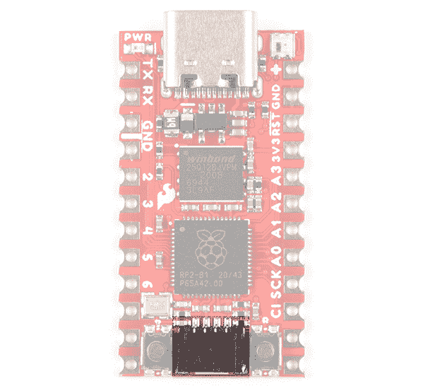
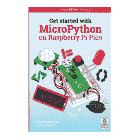
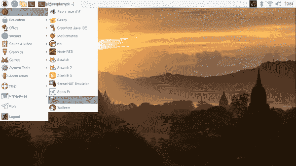
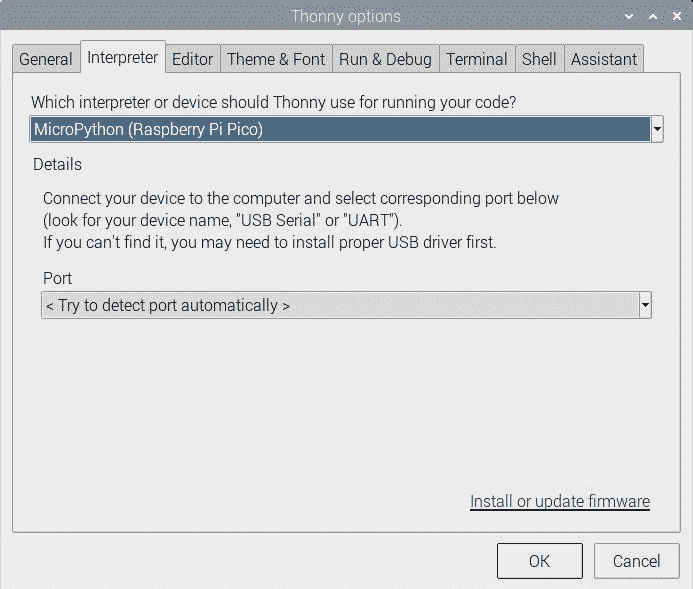
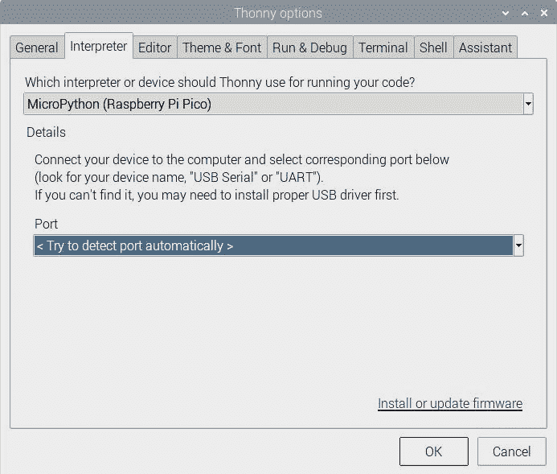
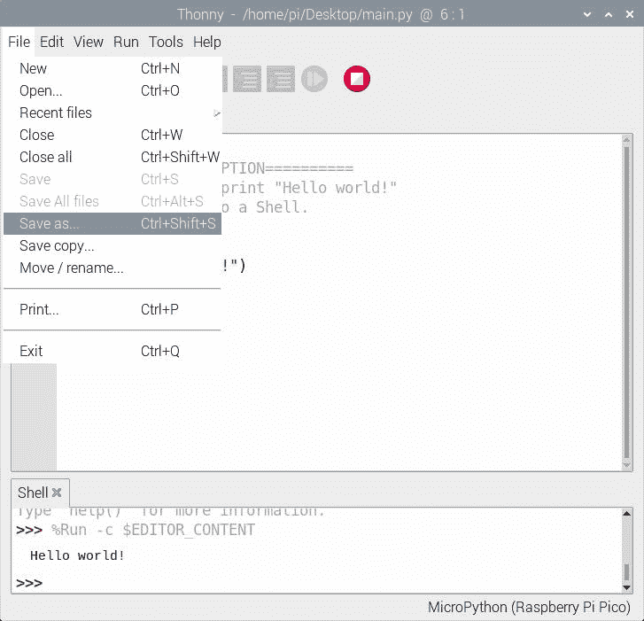
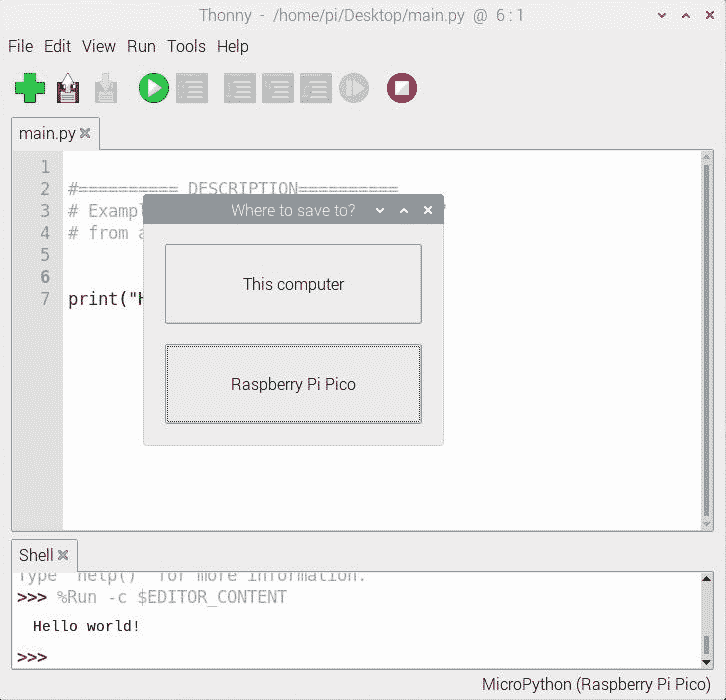

# Pro Micro RP2040 连接指南

> 原文：<https://learn.sparkfun.com/tutorials/pro-micro-rp2040-hookup-guide>

## 介绍

[Pro Micro RP2040](https://www.sparkfun.com/products/17717) 是一款低成本、高性能的主板，具有灵活的数字接口，采用 Raspberry Pi Foundation 的 RP2040 微控制器。该板采用众所周知的 Pro 微型封装，带有城堡形安装孔。

[](https://www.sparkfun.com/products/18288) 

将**添加到您的[购物车](https://www.sparkfun.com/cart)中！**

 **### [SparkFun Pro 微 RP2040](https://www.sparkfun.com/products/18288)

[In stock](https://learn.sparkfun.com/static/bubbles/ "in stock") DEV-18288

SparkFun Pro Micro RP2040 是一款低成本、高性能的板，具有灵活的数字接口，具有覆盆子…

$10.952[Favorited Favorite](# "Add to favorites") 15[Wish List](# "Add to wish list")** **### 所需材料

要跟随本教程，您将需要以下材料。你可能不需要所有的东西，这取决于你拥有什么。将它添加到您的购物车，通读指南，并根据需要调整购物车。

[](https://www.sparkfun.com/products/18288) 

将**添加到您的[购物车](https://www.sparkfun.com/cart)中！**

 **### [SparkFun Pro 微 RP2040](https://www.sparkfun.com/products/18288)

[In stock](https://learn.sparkfun.com/static/bubbles/ "in stock") DEV-18288

SparkFun Pro Micro RP2040 是一款低成本、高性能的板，具有灵活的数字接口，具有覆盆子…

$10.952[Favorited Favorite](# "Add to favorites") 15[Wish List](# "Add to wish list")****[](https://www.sparkfun.com/products/14743) 

将**添加到您的[购物车](https://www.sparkfun.com/cart)中！**

 **### [USB 3.1 线 A 到 C - 3 脚](https://www.sparkfun.com/products/14743)

[In stock](https://learn.sparkfun.com/static/bubbles/ "in stock") CAB-14743

USB C 棒极了。但是，在我们将所有的集线器、充电器和端口转换为 USB C 之前，这是您要使用的电缆…

$5.504[Favorited Favorite](# "Add to favorites") 9[Wish List](# "Add to wish list")**** ****### 工具

当使用电镀通孔焊盘时，您需要一个烙铁、焊料和[通用焊接附件](https://www.sparkfun.com/categories/49)来实现安全连接。

[](https://www.sparkfun.com/products/14456) 

将**添加到您的[购物车](https://www.sparkfun.com/cart)中！**

 **### [【烙铁- 60W(可调温度)](https://www.sparkfun.com/products/14456)

[In stock](https://learn.sparkfun.com/static/bubbles/ "in stock") TOL-14456

当你不想倾家荡产，但又需要一个可靠的烙铁时，这个可调节温度的烙铁是一个很好的工具…

$16.5016[Favorited Favorite](# "Add to favorites") 43[Wish List](# "Add to wish list")****[](https://www.sparkfun.com/products/9163) 

将**添加到您的[购物车](https://www.sparkfun.com/cart)中！**

 **### [无铅焊料- 15 克管](https://www.sparkfun.com/products/9163)

[In stock](https://learn.sparkfun.com/static/bubbles/ "in stock") TOL-09163

这是你的无铅焊料的基本管，带有不干净的水溶性树脂芯。0.031 英寸规格，15 克

$3.954[Favorited Favorite](# "Add to favorites") 14[Wish List](# "Add to wish list")**** ****#### 原型配件

根据您的设置，您可能希望使用 IC 挂钩进行临时连接。但是，您可能需要焊接接头引脚，将器件连接到电镀通孔，以实现安全连接。

[](https://www.sparkfun.com/products/12002) 

将**添加到您的[购物车](https://www.sparkfun.com/cart)中！**

 **### [【试验板-不干胶(白色)](https://www.sparkfun.com/products/12002)

[In stock](https://learn.sparkfun.com/static/bubbles/ "in stock") PRT-12002

这是你的尝试和真正的白色无焊试验板。它有 2 条电源总线，10 列，30 行，总共 400 个连接…

$5.5048[Favorited Favorite](# "Add to favorites") 93[Wish List](# "Add to wish list")****[](https://www.sparkfun.com/products/116) 

将**添加到您的[购物车](https://www.sparkfun.com/cart)中！**

 **### [破开头球——直击](https://www.sparkfun.com/products/116)

[In stock](https://learn.sparkfun.com/static/bubbles/ "in stock") PRT-00116

一排标题-打破适应。40 个引脚，可切割成任何尺寸。用于定制 PCB 或通用定制接头。

$1.7520[Favorited Favorite](# "Add to favorites") 133[Wish List](# "Add to wish list")****[](https://www.sparkfun.com/products/9741) 

将**添加到您的[购物车](https://www.sparkfun.com/cart)中！**

 **### [带猪尾的 IC 钩](https://www.sparkfun.com/products/9741)

[In stock](https://learn.sparkfun.com/static/bubbles/ "in stock") CAB-09741

这些是高质量的 IC 测试钩，带有一根公连接线。这些有两个挂钩，而不是一个挂钩…

$5.5010[Favorited Favorite](# "Add to favorites") 30[Wish List](# "Add to wish list")****[](https://www.sparkfun.com/products/14322) 

将**添加到您的[购物车](https://www.sparkfun.com/cart)中！**

 **### [光子可堆叠接头- 12 针](https://www.sparkfun.com/products/14322)

[In stock](https://learn.sparkfun.com/static/bubbles/ "in stock") PRT-14322

这些可堆叠的头部可以与粒子光子和光子原盾板一起工作。每个标题增加了一个伟大的数据…

$0.75[Favorited Favorite](# "Add to favorites") 5[Wish List](# "Add to wish list")******** ********对于那些想利用 Qwiic 功能设备的人来说，你需要一根 Qwiic 电缆。

[](https://www.sparkfun.com/products/15081) 

将**添加到您的[购物车](https://www.sparkfun.com/cart)中！**

 **### [SparkFun Qwiic 线缆套件](https://www.sparkfun.com/products/15081)

[In stock](https://learn.sparkfun.com/static/bubbles/ "in stock") KIT-15081

为了更容易上手，我们用 50 毫米到 500 毫米的各种 Qwiic 电缆组装了 Qwiic 电缆套件…

$8.9516[Favorited Favorite](# "Add to favorites") 58[Wish List](# "Add to wish list")****[](https://www.sparkfun.com/products/14427) 

将**添加到您的[购物车](https://www.sparkfun.com/cart)中！**

 **### [Qwiic 线缆- 100mm](https://www.sparkfun.com/products/14427)

[In stock](https://learn.sparkfun.com/static/bubbles/ "in stock") PRT-14427

这是一条 100 毫米长的 4 芯电缆，带有 1 毫米 JST 端接。它旨在将支持 Qwiic 的组件连接在一起…

$1.50[Favorited Favorite](# "Add to favorites") 32[Wish List](# "Add to wish list")****[](https://www.sparkfun.com/products/14429) 

将**添加到您的[购物车](https://www.sparkfun.com/cart)中！**

 **### [Qwiic 线缆- 500mm](https://www.sparkfun.com/products/14429)

[In stock](https://learn.sparkfun.com/static/bubbles/ "in stock") PRT-14429

这是一根 500mm 长的 4 芯电缆，带有 1mm JST 端接。它旨在将支持 Qwiic 的组件连接在一起…

$1.951[Favorited Favorite](# "Add to favorites") 25[Wish List](# "Add to wish list")****[](https://www.sparkfun.com/products/14425) 

将**添加到您的[购物车](https://www.sparkfun.com/cart)中！**

 **### [Qwiic 电缆-试验板跳线(4 针)](https://www.sparkfun.com/products/14425)

[In stock](https://learn.sparkfun.com/static/bubbles/ "in stock") PRT-14425

这是一根跳线适配器电缆，一端带有一个 Qwiic JST 母接头，另一端带有一个试验板连接…

$1.50[Favorited Favorite](# "Add to favorites") 34[Wish List](# "Add to wish list")******** ********### 推荐阅读

如果您不熟悉 Qwiic 系统，我们建议您阅读此处的[以了解概述](https://www.sparkfun.com/qwiic)，如果您决定利用 Qwiic 连接器。

| [](https://www.sparkfun.com/qwiic) |
| *[Qwiic 连接系统](https://www.sparkfun.com/qwiic)* |

如果你不熟悉下面的教程，我们也建议你看一看。

[](https://learn.sparkfun.com/tutorials/how-to-solder-through-hole-soldering) [### 如何焊接:通孔焊接](https://learn.sparkfun.com/tutorials/how-to-solder-through-hole-soldering) This tutorial covers everything you need to know about through-hole soldering.[Favorited Favorite](# "Add to favorites") 70[](https://learn.sparkfun.com/tutorials/serial-communication) [### 串行通信](https://learn.sparkfun.com/tutorials/serial-communication) Asynchronous serial communication concepts: packets, signal levels, baud rates, UARTs and more 100[](https://learn.sparkfun.com/tutorials/serial-peripheral-interface-spi) [### 串行外设接口(SPI)](https://learn.sparkfun.com/tutorials/serial-peripheral-interface-spi) SPI is commonly used to connect microcontrollers to peripherals such as sensors, shift registers, and SD cards.[Favorited Favorite](# "Add to favorites") 91[](https://learn.sparkfun.com/tutorials/pulse-width-modulation) [### 脉宽灯](https://learn.sparkfun.com/tutorials/pulse-width-modulation) An introduction to the concept of Pulse Width Modulation.[Favorited Favorite](# "Add to favorites") 46[](https://learn.sparkfun.com/tutorials/logic-levels) [### 逻辑电平](https://learn.sparkfun.com/tutorials/logic-levels) Learn the difference between 3.3V and 5V devices and logic levels.[Favorited Favorite](# "Add to favorites") 82[](https://learn.sparkfun.com/tutorials/i2c) [### I2C](https://learn.sparkfun.com/tutorials/i2c) An introduction to I2C, one of the main embedded communications protocols in use today.[Favorited Favorite](# "Add to favorites") 128[](https://learn.sparkfun.com/tutorials/analog-vs-digital) [### 模拟与数字](https://learn.sparkfun.com/tutorials/analog-vs-digital) This tutorial covers the concept of analog and digital signals, as they relate to electronics.[Favorited Favorite](# "Add to favorites") 66

## 硬件概述

### 旧学校到新学校

Pro Micro RP2040 的设计采用了原来的 Pro Micro 和 Qwiic Pro Micro USB C 的占地面积。

| [](https://www.sparkfun.com/products/12640) | [](https://www.sparkfun.com/products/17717) |
| *老款 Pro Micro
配 ATmega32U4* | *更新的 Qwiic Pro Micro USB C
带 RP2040* |

### 引脚排列

Pro Micro RP2040 的所有 GPIO 和电源引脚都被分成两个平行的接头。一些引脚用于电源输入或输出，其他引脚是专用的 GPIO 引脚。此外，GPIO 引脚可以有特殊功能，这取决于它们的多路复用方式。这里有一张地图，显示了哪个引脚在哪里，以及它可能具有哪些特殊的硬件功能。

[](https://cdn.sparkfun.com/assets/e/2/7/6/b/ProMicroRP2040_Graphical_Datasheet.pdf)*Click on image for a closer view.***Note:** For more information on the multiplexed pins, check out "section 1.4.3 GPIO Functions"of the RP2040 datasheet.

[RP2040 Datasheet (31.2MB)](https://datasheets.raspberrypi.org/rp2040/rp2040_datasheet.pdf)

### 力量

有多种电源和电源相关的网络连接到连接器和通孔焊盘。每个衬垫具有齿形边缘。主板的背面也有用于供电的 USB 引脚

| [](https://cdn.sparkfun.com/assets/learn_tutorials/1/5/6/0/17717-SparkFun_Pro_Micro_RP2040_Power_Nets-Top.jpg) | [](https://cdn.sparkfun.com/assets/learn_tutorials/1/5/6/0/17717-SparkFun_Pro_Micro_RP2040_Power_Nets-Bottom.jpg) |

这些蚊帐包括以下内容:

*   **V** 是 USB 连接器提供的电压。
*   **+** 是 Pro Micro RP2040 的原始未调节电压输入。如果电路板通过 USB 供电(即 **V** ，此引脚的电压约为 4.8V (USB 的 5V 减去肖特基二极管压降)。另一方面，如果电路板由外部供电，通过此引脚，施加的电压最高可达 **5.3V** 。
*   **3.3V** 是提供给板载 RP2040 的电压。连接到此引脚时，我们建议使用 3.3V 稳压电源。如果电路板通过 raw“+”引脚供电，此引脚可用作**输出**，为其他器件提供 3.3V 电压。
*   可以用来**重启**Pro Micro RP 2040。有一个内置的复位按钮来复位板。但是，如果您需要从外部访问该 pin，则该 pin 已断开。此引脚被一个 10k &欧姆拉高；电路板上的电阻，并且**为低电平有效**，因此它必须接地才能启动复位。Qwiic Pro Micro 将保持“关闭”状态，直到 reset 线被拉回到高电平。
*   **GND** 当然是系统的公共地电压(0V 基准电压)。

### USB 引脚

在主板背面，您可以访问 USB 1.1 主机或设备的 USB 数据引脚和电源。

[](https://cdn.sparkfun.com/assets/learn_tutorials/1/5/6/0/17717-SparkFun_Pro_Micro_RP2040_USB_Pads.jpg)

### GPIO 引脚

Pro Micro RP2040 将 GPIO 引脚连接到电路板边缘的电镀通孔焊盘。每个焊盘也是城堡形的。

| [](https://cdn.sparkfun.com/assets/learn_tutorials/1/5/6/0/17717-SparkFun_Pro_Micro_RP2040_Castellated_PTH_Pins.jpg) | [](https://cdn.sparkfun.com/assets/learn_tutorials/1/5/6/0/17717-SparkFun_Pro_Micro_RP2040_Castellated_PTH_Pins_Back.jpg) |
| *带边缘 PTH 焊盘的电路板顶部*  | *带边缘 PTH 焊盘的电路板底部*  |

Pro Micro 的 GPIO 引脚——总共 20 个——(如果你把 Qwiic 连接器上的两个引脚也包括在内的话)是多才多艺的。每个引脚都可以用作**数字输入或输出**，用于闪烁 led 或读取按钮按压。这些引脚通过 0 到 29 之间的整数值引用。

四个引脚以[模数转换器(ADC)](https://learn.sparkfun.com/tutorials/analog-to-digital-conversion)为特色，可用作**模拟输入**。这对于读取电位计或其它模拟器件非常有用。

**Note:** There is an additional ADC pin that is not broken out on the RP2040\. It is connected to the internal temperature sensor. While it is not broken out on the board, you can access the temperature sensor readings using examples from either the C/C++ or MicroPython SDK.

所有引脚都可以设置[脉宽调制(PWM)](https://learn.sparkfun.com/tutorials/pulse-width-modulation) 功能，这允许一种形式的**模拟输出**。RP2040 最多只能提供 16 个可控 PWM 输出。

还有硬件 [UART(串行)](https://learn.sparkfun.com/tutorials/serial-communication)、 [I ² C](https://learn.sparkfun.com/tutorials/i2c) 和 [SPI](https://learn.sparkfun.com/tutorials/serial-peripheral-interface-spi) 引脚可用。这些器件可用于与数字器件接口，如串行 LCD、XBees、IMU 和其它串行传感器。

RP2040 有 26 个外部中断，允许您在引脚变为高电平、低电平或改变状态时立即触发一个功能。

### Qwiic 连接器

该板包括一个 Qwiic 连接器，可轻松将 Qwiic 使能的 I ² C 设备连接到板上。SCL 连接到`GPIO17`而 SDA 连接到`GPIO16`

[](https://cdn.sparkfun.com/assets/learn_tutorials/1/5/6/0/17717-SparkFun_Pro_Micro_RP2040_Qwiic_Connector.jpg)**Note:** If you decide not to use the I²C port with a Qwiic-enabled device, you can technically use the Qwiic cable with either male or female jumpers as GPIO pins.

[](https://www.sparkfun.com/products/17261) 

将**添加到您的[购物车](https://www.sparkfun.com/cart)中！**

 **### [](https://www.sparkfun.com/products/17261)

[In stock](https://learn.sparkfun.com/static/bubbles/ "in stock") CAB-17261

这种极化 I2C 电缆绝缘是由硅制成的，比我们原来的 Qwiic 电缆更灵活，特别是在

$1.60[Favorited Favorite](# "Add to favorites") 5[Wish List](# "Add to wish list")****[](https://www.sparkfun.com/products/14425) 

将**添加到您的[购物车](https://www.sparkfun.com/cart)中！**

 **### [Qwiic 电缆-试验板跳线(4 针)](https://www.sparkfun.com/products/14425)

[In stock](https://learn.sparkfun.com/static/bubbles/ "in stock") PRT-14425

这是一根跳线适配器电缆，一端带有一个 Qwiic JST 母接头，另一端带有一个试验板连接…

$1.50[Favorited Favorite](# "Add to favorites") 34[Wish List](# "Add to wish list")****[](https://www.sparkfun.com/products/retired/14988) 

### [Qwiic 线缆-母跳线(4 针)](https://www.sparkfun.com/products/retired/14988)

[Retired](https://learn.sparkfun.com/static/bubbles/ "Retired") CAB-14988

这是一种跳线适配器电缆，一端预端接一个母 Qwiic JST 连接器，另一端预端接一个母连接器

**Retired**[Favorited Favorite](# "Add to favorites") 10[Wish List](# "Add to wish list")**** ****### 板载 led

Pro Micro RP2040 上有两个指示灯。红色 LED 指示**电源**是否存在。另一个是可寻址的 WS2812 RGB LED。可寻址 LED 连接到`GPIO25`。您需要定义函数或使用 WS2812 库来控制 LED。

[](https://cdn.sparkfun.com/assets/learn_tutorials/1/5/6/0/17717-SparkFun_Pro_Micro_RP2040_Power_LED_Addressable_WS2812_LED.jpg)

电路板背面有一个焊盘连接到 WS2812 的 DO 引脚。如果你决定菊花链更多的 led，你会想要焊接到这个垫。

[](https://cdn.sparkfun.com/assets/learn_tutorials/1/5/6/0/17717-SparkFun_Pro_Micro_RP2040_Addressable_WS2812_LED_Data_Out.jpg)

### 外部闪存

Pro Micro RP2040 包括一个 W25Q128JVPIM，它外部增加了 128Mb (16MB)的闪存。

[](https://cdn.sparkfun.com/assets/learn_tutorials/1/5/6/0/17717-SparkFun_Pro_Micro_RP2040_External_Flash_Memory.jpg)

### 启动按钮

启动按钮连接到外部闪存。按下此按钮会强制进入 USB 启动模式，使主板显示为 USB 大容量存储设备。

[](https://cdn.sparkfun.com/assets/learn_tutorials/1/5/6/0/17717-SparkFun_Pro_Micro_RP2040_Boot_Button.jpg)

### 复原按钮

如前所述，有一个复位按钮可以复位 RP2040。这增加了强制 RP2040 进入引导加载程序模式的选项，而无需将板拔下/重新插回 USB 端口。为了保持电路板尺寸最小，按钮没有标记。要区分这两个按钮，只需记住复位按钮与复位引脚在电路板的同一侧。

[](https://cdn.sparkfun.com/assets/learn_tutorials/1/5/6/0/17717-SparkFun_Pro_Micro_RP2040_Reset_Button.jpg)

### SWD 引脚

对于高级用户，电路板背面有两个引脚(即用于数据/SWDIO 的 **D** 和用于时钟/SWCLK 的 **C** )用于 SWD 编程。你需要焊接电线来连接这些插脚。

[](https://cdn.sparkfun.com/assets/learn_tutorials/1/5/6/0/17717-SparkFun_Pro_Micro_RP2040_SWD_Pins.jpg)

### 电路板尺寸

该板的尺寸为 **1.3 英寸 x 0.7 英寸**。请记住，USB-C 连接器不与主板齐平，将从主板边缘伸出约 0.05 英寸。下图中没有包括 PCB 厚度，为 **0.8mm** 。这比大多数用于 SparkFun 原创设计的多氯联苯还要薄。

[](https://cdn.sparkfun.com/assets/learn_tutorials/1/5/6/0/SparkFun_Pro_Micro_RP2040_Board_Dimensions.png)

## 硬件连接

Pro Micro RP2040 去掉了接头引脚，允许用户灵活地将任何类型的 0.1 英寸接头连接到电路板。对于 I/O 引脚的临时连接，您可以使用 IC 挂钩来测试引脚。然而，你需要[将你选择的接头或电线焊接到电路板](https://learn.sparkfun.com/tutorials/how-to-solder-through-hole-soldering)上，以实现安全连接。对于高级用户来说，你也可以设计一个 PCB，利用[齿形边缘](https://learn.sparkfun.com/tutorials/how-to-solder-castellated-mounting-holes/all#introduction)来降低外形。根据您的个人喜好，这里有几个连接到 pad 的教程。

[](https://learn.sparkfun.com/tutorials/how-to-solder-through-hole-soldering) [### 如何焊接:通孔焊接

#### 2013 年 9 月 19 日](https://learn.sparkfun.com/tutorials/how-to-solder-through-hole-soldering) This tutorial covers everything you need to know about through-hole soldering.[Favorited Favorite](# "Add to favorites") 70[](https://learn.sparkfun.com/tutorials/working-with-wire) [### 使用导线

#### 2013 年 2 月 8 日](https://learn.sparkfun.com/tutorials/working-with-wire) How to strip, crimp, and work with wire.[Favorited Favorite](# "Add to favorites") 50[](https://learn.sparkfun.com/tutorials/how-to-solder-castellated-mounting-holes) [### 如何焊接:堞形安装孔

#### 2015 年 5 月 12 日](https://learn.sparkfun.com/tutorials/how-to-solder-castellated-mounting-holes) Tutorial showing how to solder castellated holes (or castellations). This might come in handy if you need to solder a module or PCB to another PCB. These castellations are becoming popular with integrated WiFi and Bluetooth modules.[Favorited Favorite](# "Add to favorites") 19**Note:** For advanced users taking advantage of the castellated edges, you can design a board with the Qwiic Pro Micro Eagle footprint.

[GitHub SparkFun Eagle Library: SparkFun-Boards.lbr](https://github.com/sparkfun/SparkFun-Eagle-Libraries)

为了给主板供电和上传，你只需要一根 USB C 线连接到你的电脑上。

[](https://cdn.sparkfun.com/assets/learn_tutorials/1/5/6/0/Raspberry_Pi_Programming_Pro_Micro_RP2040.jpg)

### 连接到 GPIO

有几种连接 GPIO 的方法。对于原型制作时的临时连接，可以使用 IC 挂钩将电路连接到试验板。下面是一个连接到试验板上 330 &ohm;限流电阻的基本 5 毫米 LED 的例子。

[](https://cdn.sparkfun.com/assets/learn_tutorials/1/5/6/0/Pro_Micro_RP2040_IC_Hooks_LED_Breadboard.jpg)

为了安全连接到 Pro Micro RP2040 的 GPIO，建议使用[焊接接头引脚](https://learn.sparkfun.com/tutorials/how-to-solder-through-hole-soldering)。如果您使用封装设计电路板，也可以使用齿形接头焊接电路板。在这种情况下，两个 1x12 插头引脚在试验板的帮助下焊接到电路板上。

[](https://cdn.sparkfun.com/assets/learn_tutorials/1/5/6/0/Pro_Micro_RP2040_Soldering_Headers.jpg)

虽然最初是为了连接支持 Qwiic 的器件，但您也可以使用 SDA 和 SCL 引脚作为快速、可视的测试，查看电路板是否正常工作。在这种情况下，SCL 引脚被用作 GPIO 引脚。与带有 IC 挂钩的电路类似，该引脚连接到一个基本的 5 毫米 LED 和一个试验板上的 330 &ohm;限流电阻。

[](https://cdn.sparkfun.com/assets/learn_tutorials/1/5/6/0/Pro_Micro_RP2040_Breadboard_LED.jpg)

### 支持 Qwiic 的设备

您也可以轻松地将支持 qw IC 的设备连接到 qw IC 连接器。下面是连接到 Qwiic Pro Micro 的 Qwiic VL53L1X 距离传感器和 Qwiic Micro 有机发光二极管的示例。

[](https://cdn.sparkfun.com/assets/learn_tutorials/1/5/6/0/Pro_Micro_RP2040_Qwiic_MicroOLED_Distance_Sensor.jpg)

## UF2 引导程序

Pro Micro 2040 很容易编程，感谢 UF2 引导加载程序。有了这个引导程序，主板就可以作为 USB 存储设备**出现在你的电脑上，而无需安装 Windows 10、Mac 和 Linux 的驱动程序**！

### UF2 是什么？

UF2 代表 USB 闪存格式，由微软为 PXT(现在称为 MakeCode)开发，用于在海量存储类(MSC)上闪存微控制器，就像可移动闪存驱动器一样。文件格式是独一无二的，所以不幸的是，您不能简单地将编译好的二进制或十六进制文件拖放到板上。相反，除了数据本身之外，文件的格式还有额外的信息告诉处理器数据去了哪里。关于 UF2 的更多信息，你可以从 [MakeCode 博客](https://makecode.com/blog/one-chip-to-flash-them-all)以及 [UF2 文件格式规范](https://github.com/Microsoft/uf2)中了解更多。

## 软件概述

RP2040 有两种编程方法。您可以根据个人喜好使用 [MicroPython 或 C/C++](https://www.raspberrypi.org/documentation/pico/getting-started/) 。该文档是为 Raspberry Pi 的 Pico 开发板编写的，但也适用于任何带有 RP2040 的开发板。只要确保根据 GPIO 的类型来调整管脚定义就行了。

[Getting Started with the Raspberry Pi Pico](https://www.raspberrypi.org/documentation/pico/getting-started/)

## 示例(MicroPython)

Raspberry Pi foundation 提供了必要的工具、文档和示例来开始使用 RP2040。如果您还没有，请查看 Pico 上的文档。在本教程中，当我们在其他开发板上使用芯片来满足您的需求时，我们将以此为参考。

[Raspberry Pi: Pico Python SDK (PDF)](https://datasheets.raspberrypi.org/pico/sdk/pico_python_sdk.pdf)

我们将使用 Thonny IDE 使用本报告中的 MicroPython 示例。

[GitHub: raspberrypi/pico-micropython-examples](https://github.com/raspberrypi/pico-micropython-examples)

### 在 RP2040 上安装 MicroPython

**Note:** Interested in going further? The Raspberry Pi Foundation also released a book to get started with the Pico's RP2040: "Get Started with MicroPython on Raspberry Pi Pico."

[](https://www.sparkfun.com/products/retired/17835) 

### [树莓派 Pico 上的 MicroPython 入门](https://www.sparkfun.com/products/retired/17835)

[Retired](https://learn.sparkfun.com/static/bubbles/ "Retired") BOK-17835

Raspberry Pi Pico 代表了一些人对微控制器世界和 MicroPython 世界的初步了解…

**Retired**[Favorited Favorite](# "Add to favorites") 7[Wish List](# "Add to wish list")

要在 RP2040 上安装 MicroPython，您需要从 Raspberry Pi 下载固件。点击以下链接，查看 Raspberry Pi Foundation 针对 RP2040 的 MicroPython UF2 文件。点击“**入门 MicroPython** 选项卡和**下载 UF2 文件**按钮。

[Click to Download the MicroPython UF2 File](https://www.raspberrypi.org/documentation/pico/getting-started/)

用一只手按住启动按钮。

[](https://cdn.sparkfun.com/assets/learn_tutorials/1/5/6/0/Pro_Micro_RP2040_Boot.jpg)

暂时按下复位按钮。

| [](https://cdn.sparkfun.com/assets/learn_tutorials/1/5/6/0/Pro_Micro_RP2040_Boot_Reset.jpg) | [](https://cdn.sparkfun.com/assets/learn_tutorials/1/5/6/0/Pro_Micro_RP2040_Release_Reset.jpg) |
|  |  |

松开启动按钮。该板应该显示为一个名为 **RPI-RP2** 的可移动驱动器。

[](https://cdn.sparkfun.com/assets/learn_tutorials/1/5/6/0/Pro_Micro_RP2040_Release_Boot_Button.jpg)

将 UF2 文件拖放到“可移动驱动器”中。主板会自动重启。下图突出显示了 UF2 文件被移动到 Raspberry Pi 上的可移动驱动器。

[](https://cdn.sparkfun.com/assets/learn_tutorials/1/5/6/0/Raspberry_PiRP2040_Drag_and_Drop_UF2.jpg)

### 配置 Thonny IDE

**Note:** If you are using a Raspberry Pi, make sure that you are using the latest Raspberry Pi image. Enter the following command in the LXTerminal to download and install the the latest packages. The `&&` combines the two commands into a single line and the `-y` answers "yes" to any prompts.

```
sudo apt update && sudo apt full-upgrade -y 
```

Check to make sure that you are using Thonny v3.3.3 and above. If you are using a Raspberry Pi, type the following command to check the version:

```
thonny -v

```

You should get a result similar to the output below. If you have a version that is equal or higher, you should be good to go!

```
INFO    thonny:Thonny version: 3.3.3

```

If you are using a different operating system, you can also [download the Thonny IDE](https://thonny.org/).

从开始菜单打开 Thonny up:**树莓 Pi 开始菜单** > **编程** > **Thonny Python IDE**

[](https://cdn.sparkfun.com/assets/learn_tutorials/1/5/6/0/Open_Thonny_IDE.jpg)

为 RP2040 设置 Thonny 的解释器。“Raspberry Pi Pico”将适用于 RP2040。进入菜单，选择**>**选择翻译...**。**

**[](https://cdn.sparkfun.com/assets/learn_tutorials/1/5/6/0/Thonny_Select_Python_Interpreter.jpg)

这将为 Thonny 选项打开一个新窗口。在**解释器**选项卡中，选择**MicroPython(Raspberry Pi Pico)**作为解释器。

[](https://cdn.sparkfun.com/assets/learn_tutorials/1/5/6/0/Thonny_RP2040_MicroPython_Interpreter.jpg)**Note:** You can also click on the bottom right to **Configure Interpreter...** and follow the same steps outlined above.

[](https://cdn.sparkfun.com/assets/learn_tutorials/1/5/6/0/Thonny_Shortcut_Select_Python_Interpreter.jpg)

在同一个窗口中，确保选择选项让 Thonny 自动检测板卡的 COM 端口:**端口** > **<尝试自动检测端口>**

[](https://cdn.sparkfun.com/assets/learn_tutorials/1/5/6/0/Thonny_Select_COM_Port.jpg)**Note:** If you are on Linux based OS like the Raspberry Pi, the COM port may show up as `tty(AMA0 (/dev/ttyAMA0)`.

### 你好世界！

要检查这是否有效，请打开 Thonny IDE，在编辑器中键入以下内容。你可以根据自己的喜好随意调整信息。

```
language:python
print("Hello world!") 
```

点击“运行当前脚本”按钮。在 Shell 中，您将看到以下输出。太棒了。

```
language:bash
>>> %Run -c %EDITOR_CONTENT
Hello world! 
```

[](https://cdn.sparkfun.com/assets/learn_tutorials/1/5/6/0/Thonny_RP2040_Hello_World.jpg)[**Note:**](https://learn.sparkfun.com/tutorials/pro-micro-rp2040-hookup-guide#running-on-start) To save the file and have it run every time the board is powered up, simply select **File** > **Save As...** from the menu.

[](https://cdn.sparkfun.com/assets/learn_tutorials/1/5/6/0/Thonny_RP2040_Run_on_Startup.jpg)
When a window pops up, select **Raspberry Pi Pico**.

[](https://cdn.sparkfun.com/assets/learn_tutorials/1/5/6/0/Thonny_RP2040_Run_on_Startup_Select_Pico.jpg)
Then save the file as **main.py**

[](https://cdn.sparkfun.com/assets/learn_tutorials/1/5/6/0/Thonny_RP2040_Run_on_Startup_Main_Python_File.jpg)
Just make sure to save any code that was edited on your computer (e.g. **Save as...** > **This computer**) before closing Thonny.

[](https://cdn.sparkfun.com/assets/learn_tutorials/1/5/6/0/Thonny_RP2040_Save_As_This_Computer.jpg)
**Note:** If you are using a terminal window and REPL, you will need to type the functions into the terminal window. While you can copy and paste, the terminal window will not recognize indents for loops or custom defined subroutines. As a result, the pasted code will not be interpreted correctly by REPL. You'll want to make sure that you are using the Thonny editor to avoid this error.

### 眨眼

如果您已经保存了 MicroPython 示例，请转到下载中的以下文件夹**...**/**pico-micropython-examples**/**blink**/**blink . py**。您的代码应该如下所示。当然，您也可以复制并粘贴下一段之后提供的代码。

一旦您在 Thonny 中打开它，请将 pin 号调整到 LED 所连接的 GPIO。因为我们使用的例子是专门为 Pico 而不是 Pro Micro RP2040 编写的，所以我们需要调整引脚。在这种情况下，我们将使用连接到 Qwiic 连接器的 RP2040 的 **GPIO17** ，这样我们就不必将引脚焊接到电路板上。这是假设我们在 **GPIO17** 和 **GND** 之间连接一个限流电阻和一个 LED。

```
language:python
# ========== DESCRIPTION==========
# The following code was originally written by 
# the Raspberry Pi Foundation. You can find this
# example on GitHub.
#
#     https://github.com/raspberrypi/pico-micropython-examples/blob/master/blink/blink.py
#
# Note that the GPIO for the LED was adjusted
# for the Pro Micro RP2040\. Make sure to use 
# a current limiting resistor with the LED.

from machine import Pin, Timer

led = Pin(17, Pin.OUT)
tim = Timer()
def tick(timer):
    global led
    led.toggle()

tim.init(freq=2.5, mode=Timer.PERIODIC, callback=tick) 
```

点击“运行当前脚本”按钮。一旦代码运行，您将看到 LED 闪烁。如果您希望电路板在每次上电时都闪烁，只需遵循上一示例末尾提供的[注释。](https://learn.sparkfun.com/tutorials/pro-micro-rp2040-hookup-guide#running-on-start)

[](https://cdn.sparkfun.com/assets/learn_tutorials/1/5/6/0/Pro_Micro_RP2040_Blink.jpg)

### WS2812

如果您已经保存了 MicroPython 示例，请转到下载中的以下文件夹**...**/**pico-micropython-examples**/**Pio**/**neo pixel _ ring**/**neo pixel _ ring . py**。您的代码应该如下所示。当然，您也可以复制并粘贴下一段之后提供的代码。

一旦在 Thonny 中打开，将管脚号调整到 LED 与`PIN_NUM`连接的 GPIO。因为我们使用的是专门为 Pico 而不是 Pro Micro 2040 编写的示例，所以我们需要调整 pin。在这种情况下，我们将使用连接到 WS2812 的 RP2040 的 **GPIO25** 。我们还会将 NUM_LEDs 调整为`1`。

```
language:python
# ========== DESCRIPTION==========
# Example using PIO to drive a set of WS2812 LEDs.
#
# The following code was originally written by
# the Raspberry Pi Foundation. You can find this 
# example on GitHub.
#
#    https://github.com/raspberrypi/pico-micropython-examples/blob/master/pio/neopixel_ring/neopixel_ring.py
#
# Note that the 'NUM_LEDs' was adjusted to 1\. Also
# the GPIO for the addressable WS2812 RGB LED called
# `PIN_NUM` was adjusted for the Pro Micro RP2040\. 

import array, time
from machine import Pin
import rp2

# Configure the number of WS2812 LEDs.
NUM_LEDS = 1
PIN_NUM = 25
brightness = 0.2

@rp2.asm_pio(sideset_init=rp2.PIO.OUT_LOW, out_shiftdir=rp2.PIO.SHIFT_LEFT, autopull=True, pull_thresh=24)
def ws2812():
    T1 = 2
    T2 = 5
    T3 = 3
    wrap_target()
    label("bitloop")
    out(x, 1)               .side(0)    [T3 - 1]
    jmp(not_x, "do_zero")   .side(1)    [T1 - 1]
    jmp("bitloop")          .side(1)    [T2 - 1]
    label("do_zero")
    nop()                   .side(0)    [T2 - 1]
    wrap()

# Create the StateMachine with the ws2812 program, outputting on pin
sm = rp2.StateMachine(0, ws2812, freq=8_000_000, sideset_base=Pin(PIN_NUM))

# Start the StateMachine, it will wait for data on its FIFO.
sm.active(1)

# Display a pattern on the LEDs via an array of LED RGB values.
ar = array.array("I", [0 for _ in range(NUM_LEDS)])

##########################################################################
def pixels_show():
    dimmer_ar = array.array("I", [0 for _ in range(NUM_LEDS)])
    for i,c in enumerate(ar):
        r = int(((c >> 8) & 0xFF) * brightness)
        g = int(((c >> 16) & 0xFF) * brightness)
        b = int((c & 0xFF) * brightness)
        dimmer_ar[i] = (g<<16) + (r<<8) + b
    sm.put(dimmer_ar, 8)
    time.sleep_ms(10)

def pixels_set(i, color):
    ar[i] = (color[1]<<16) + (color[0]<<8) + color[2]

def pixels_fill(color):
    for i in range(len(ar)):
        pixels_set(i, color)

def color_chase(color, wait):
    for i in range(NUM_LEDS):
        pixels_set(i, color)
        time.sleep(wait)
        pixels_show()
    time.sleep(0.2)

def wheel(pos):
    # Input a value 0 to 255 to get a color value.
    # The colours are a transition r - g - b - back to r.
    if pos < 0 or pos > 255:
        return (0, 0, 0)
    if pos < 85:
        return (255 - pos * 3, pos * 3, 0)
    if pos < 170:
        pos -= 85
        return (0, 255 - pos * 3, pos * 3)
    pos -= 170
    return (pos * 3, 0, 255 - pos * 3)

def rainbow_cycle(wait):
    for j in range(255):
        for i in range(NUM_LEDS):
            rc_index = (i * 256 // NUM_LEDS) + j
            pixels_set(i, wheel(rc_index & 255))
        pixels_show()
        time.sleep(wait)

BLACK = (0, 0, 0)
RED = (255, 0, 0)
YELLOW = (255, 150, 0)
GREEN = (0, 255, 0)
CYAN = (0, 255, 255)
BLUE = (0, 0, 255)
PURPLE = (180, 0, 255)
WHITE = (255, 255, 255)
COLORS = (BLACK, RED, YELLOW, GREEN, CYAN, BLUE, PURPLE, WHITE)

print("fills")
for color in COLORS:       
    pixels_fill(color)
    pixels_show()
    time.sleep(0.2)

print("chases")
for color in COLORS:       
    color_chase(color, 0.01)

while True:
    print("rainbow")
    rainbow_cycle(0) 
```

点击“运行当前脚本”按钮。一旦代码运行，它将以“0.2”的亮度显示每种颜色。LED 随后会亮起。由于只有一个 LED 连接，它看起来会闪烁的颜色。一旦电路板进入 while 循环，LED 将开始平滑地在不同颜色之间循环。请记住，每次开发板上电时，您都可以按照前面示例中提供的[说明让开发板运行该示例。](https://learn.sparkfun.com/tutorials/pro-micro-rp2040-hookup-guide#running-on-start)

[](https://cdn.sparkfun.com/assets/learn_tutorials/1/5/6/0/Pro_Micro_RP2040_WS2812_RGB_Rainbow.gif)

如果您希望简化代码，也可以使用为 WS2812 编写的库。这将一些函数保存在一个单独的文件中。只要确保调整 GPIO 以连接到 WS2812(s)和 led 的数量。

[GitHub: pico_python_ws2812b Library](https://github.com/benevpi/pico_python_ws2812b)

## 资源和更进一步

有关更多信息，请查看以下资源:

*   [示意图(PDF)](https://cdn.sparkfun.com/assets/4/a/6/d/6/SparkFun_Pro_Micro_RP2040_Schematic.pdf)
*   [老鹰文件(ZIP)](https://cdn.sparkfun.com/assets/3/5/d/0/3/SparkFun_ProMicro-RP2040.zip)
*   [板尺寸(PNG)](https://cdn.sparkfun.com/assets/learn_tutorials/1/5/6/0/SparkFun_Pro_Micro_RP2040_Board_Dimensions.png)
*   [图形数据表(PDF)](https://cdn.sparkfun.com/assets/e/2/7/6/b/ProMicroRP2040_Graphical_Datasheet.pdf)
*   [RP2040 数据手册(PDF)](https://datasheets.raspberrypi.org/rp2040/rp2040_datasheet.pdf) (31.2 MB)
*   [Raspberry Pi Pico 数据表(PDF)](https://datasheets.raspberrypi.org/pico/pico-datasheet.pdf)(16.5 MB)——基于 RP2040 的微控制器板
*   [Raspberry Pi Pico 入门(PDF)](https://datasheets.raspberrypi.org/pico/getting-started-with-pico.pdf) (32.9MB) -使用 Raspberry Pi Pico 和其他基于 RP2040 的微控制器板进行 C/C++开发
*   [Raspberry Pi Pico C/C++ SDK(PDF)](https://datasheets.raspberrypi.org/pico/raspberry-pi-pico-c-sdk.pdf)(2.14 MB)——用于在 RP2040 微控制器上进行 C/c++开发的库和工具
*   [Raspberry Pi Pico Python SDK(PDF)](https://datasheets.raspberrypi.org/pico/raspberry-pi-pico-python-sdk.pdf)(2.66 MB)——面向 RP2040 微控制器的 MicroPython 环境
*   [RP2040 信息页面](https://www.sparkfun.com/rp2040)
*   [GitHub 回购](https://github.com/sparkfun/SparkFun_Pro_Micro-RP2040)********************************