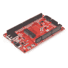
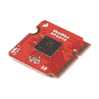

# MicroMod RP2040 处理器板连接指南

> 原文：<https://learn.sparkfun.com/tutorials/micromod-rp2040-processor-board-hookup-guide>

## 介绍

[MicroMod RP2040 处理器板](https://www.sparkfun.com/products/17720)是一款低成本、高性能的板，具有灵活的数字接口，采用 Raspberry Pi 基金会的 RP2040 微控制器。该板利用 MicroMod M.2 连接器轻松更换载板上的处理器板。

[](https://www.sparkfun.com/products/17720) 

将**添加到您的[购物车](https://www.sparkfun.com/cart)中！**

 **### [SparkFun MicroMod RP2040 处理器](https://www.sparkfun.com/products/17720)

[In stock](https://learn.sparkfun.com/static/bubbles/ "in stock") DEV-17720

SparkFun MicroMod Pi RP2040 处理器板是一款低成本、高性能的板，具有灵活的数字接口特性

$12.951[Favorited Favorite](# "Add to favorites") 12[Wish List](# "Add to wish list")** **[https://www.youtube.com/embed/N15CiFd2y_w/?autohide=1&border=0&wmode=opaque&enablejsapi=1](https://www.youtube.com/embed/N15CiFd2y_w/?autohide=1&border=0&wmode=opaque&enablejsapi=1)

### 所需材料

要跟随本教程，您将需要以下材料。你可能不需要所有的东西，这取决于你拥有什么。将它添加到您的购物车，通读指南，并根据需要调整购物车。

[](https://www.sparkfun.com/products/16885) 

将**添加到您的[购物车](https://www.sparkfun.com/cart)中！**

 **### [SparkFun MicroMod ATP 载板](https://www.sparkfun.com/products/16885)

[In stock](https://learn.sparkfun.com/static/bubbles/ "in stock") DEV-16885

如果您需要“大量”带有简单 to 编程、准备上市模块的 GPIO，ATP 是您需要的解决方案。

$19.951[Favorited Favorite](# "Add to favorites") 13[Wish List](# "Add to wish list")****[](https://www.sparkfun.com/products/17720) 

将**添加到您的[购物车](https://www.sparkfun.com/cart)中！**

 **### [SparkFun MicroMod RP2040 处理器](https://www.sparkfun.com/products/17720)

[In stock](https://learn.sparkfun.com/static/bubbles/ "in stock") DEV-17720

SparkFun MicroMod Pi RP2040 处理器板是一款低成本、高性能的板，具有灵活的数字接口特性

$12.951[Favorited Favorite](# "Add to favorites") 12[Wish List](# "Add to wish list")****[](https://www.sparkfun.com/products/14743) 

将**添加到您的[购物车](https://www.sparkfun.com/cart)中！**

 **### [USB 3.1 线 A 到 C - 3 脚](https://www.sparkfun.com/products/14743)

[In stock](https://learn.sparkfun.com/static/bubbles/ "in stock") CAB-14743

USB C 棒极了。但是，在我们将所有的集线器、充电器和端口转换为 USB C 之前，这是您要使用的电缆…

$5.504[Favorited Favorite](# "Add to favorites") 9[Wish List](# "Add to wish list")****[](https://www.sparkfun.com/products/9146) 

将**添加到您的[购物车](https://www.sparkfun.com/cart)中！**

 **### [SparkFun 迷你螺丝刀](https://www.sparkfun.com/products/9146)

[In stock](https://learn.sparkfun.com/static/bubbles/ "in stock") TOL-09146

这只是你的基本可逆螺丝刀口袋大小！有平头和十字头可供选择。配有别针和…

$1.053[Favorited Favorite](# "Add to favorites") 11[Wish List](# "Add to wish list")******** ********### 推荐阅读

如果你不熟悉 MicroMod 生态系统，我们推荐你阅读这里的[来了解](https://www.sparkfun.com/micromod)的概况。如果你决定利用 Qwiic 连接器，我们推荐阅读[这里的概述](https://www.sparkfun.com/qwiic)。

| [](https://www.sparkfun.com/micromod) | [](https://www.sparkfun.com/qwiic) |
| *[微模式生态系统](https://www.sparkfun.com/micromod)* | *[Qwiic 连接系统](https://www.sparkfun.com/qwiic)* |

如果您不熟悉以下概念，我们也建议您在继续之前查看这些教程。

[](https://learn.sparkfun.com/tutorials/serial-communication) [### 串行通信](https://learn.sparkfun.com/tutorials/serial-communication) Asynchronous serial communication concepts: packets, signal levels, baud rates, UARTs and more 100[](https://learn.sparkfun.com/tutorials/serial-peripheral-interface-spi) [### 串行外设接口(SPI)](https://learn.sparkfun.com/tutorials/serial-peripheral-interface-spi) SPI is commonly used to connect microcontrollers to peripherals such as sensors, shift registers, and SD cards.[Favorited Favorite](# "Add to favorites") 91[](https://learn.sparkfun.com/tutorials/pulse-width-modulation) [### 脉宽灯](https://learn.sparkfun.com/tutorials/pulse-width-modulation) An introduction to the concept of Pulse Width Modulation.[Favorited Favorite](# "Add to favorites") 46[](https://learn.sparkfun.com/tutorials/logic-levels) [### 逻辑电平](https://learn.sparkfun.com/tutorials/logic-levels) Learn the difference between 3.3V and 5V devices and logic levels.[Favorited Favorite](# "Add to favorites") 82[](https://learn.sparkfun.com/tutorials/i2c) [### I2C](https://learn.sparkfun.com/tutorials/i2c) An introduction to I2C, one of the main embedded communications protocols in use today.[Favorited Favorite](# "Add to favorites") 128[](https://learn.sparkfun.com/tutorials/analog-vs-digital) [### 模拟与数字](https://learn.sparkfun.com/tutorials/analog-vs-digital) This tutorial covers the concept of analog and digital signals, as they relate to electronics.[Favorited Favorite](# "Add to favorites") 66[](https://learn.sparkfun.com/tutorials/getting-started-with-micromod) [### MicroMod 入门](https://learn.sparkfun.com/tutorials/getting-started-with-micromod) Dive into the world of MicroMod - a compact interface to connect a microcontroller to various peripherals via the M.2 Connector 3

## 硬件概述

### M.2 连接器

我们所有的 MicroMod 处理器板都配备了 **M.2 MicroMod 连接器**，它利用 [M.2 标准](https://en.wikipedia.org/wiki/M.2)和规范，允许您将 MicroMod 处理器板安装在您选择的载板上。大多数引脚使用公共引脚排列，以确保跨平台兼容性。

[](https://cdn.sparkfun.com/assets/learn_tutorials/1/4/9/5/17720_MicroMod_RP2040_Processor_Board_Mdot2_Pads.jpg)**Note:** While the MicroMod RP2040 Processor Board is designed to mate with M.2 Connectors that are populated on Carrier Boards, the RP2040 is not compatible specifically with the MicroMod Machine Learning Carrier Board.

### RP2040 处理器

处理器板的大脑是 Raspberry Pi 基金会的 RP2040 ARM Cortex M0+处理器。外部 **12MHz** 晶体用作 RP2040 的时钟。RP2040 应由载板的 M.2 连接器提供 3.3V 电源。I/O 引脚的逻辑电平为 3.3V。

[](https://cdn.sparkfun.com/assets/learn_tutorials/1/4/9/5/17720_MicroMod_RP2040_Processor_Board_IC.jpg)

### 闪存

在电路板的背面是 W25Q128JVPIM，它在外部添加了 128Mb (16MB)的闪存。

[](https://cdn.sparkfun.com/assets/learn_tutorials/1/4/9/5/17720_MicroMod_RP2040_Processor_Board_external_flash_memory.jpg)

### 发光二极管

电路板的顶部添加了一个 STAT LED。这对于调试或作为状态指示器非常有用。这连接到 GPIO25。

[](https://cdn.sparkfun.com/assets/learn_tutorials/1/4/9/5/17720_MicroMod_RP2040_Processor_Board_LED.jpg)

### MicroMod RP2040 处理器引脚功能

[](https://cdn.sparkfun.com/assets/1/6/f/a/2/MicroMod_General_Pinout_v10_Graphical_Datasheet.pdf)*Click on image for a closer view of the graphical datasheet.*

完整的引脚映射可在下表中找到，或者您可以参考[原理图](https://cdn.sparkfun.com/assets/1/8/3/5/8/MicroMod-RP2040-ProcessorBoard_Schematic.pdf)。

**Heads up!** The pin table below and schematic both include the RP2040 pin associated with each MicroMod pin and this correlation can be used to identify alternate uses for pins on the RP2040 Processor Board. For many of the General Purpose I/O pins and other pins with multiple signal options, refer to your Carrier Board's Hookup Guide for information on how those pins are configured what they are used for. Not all pins are used on every Carrier Board.

根据您的窗口大小，您可能需要使用表格底部的水平滚动条来查看附加的 pin 功能。请注意，相对两侧的 M.2 连接器引脚相互偏移，如底部引脚所示(未连接)*。没有连接到带“-”的引脚。

*   [RP2040 处理器引脚表](#RP2040PB)
*   [微模块通用引脚表](#MMGen)
*   [MicroMod 通用引脚描述](#MMDescript)

| **音频** | **UART** | **GPIO/总线** | **I ² C** | **SDIO** 的缩写形式 | **SPI** | **专用** |

| 替代
功能 | 主要
功能 | RP2040 GPIO 引脚 | 底部
销 | 顶部
销 | RP2040 GPIO 引脚
 | 主要
功能 | 替代
功能 |
|  |  | (未连接)* |  |  | **75** |  | GND |  |  |
|  |  | 3.3V |  | **74** | **73** | GPIO21 |  |  |  |
|  |  | 3.3V |  | **72** | **71** | GPIO22 |  |  |  |
|  | SPI_CS1 | SDIO_DATA3 | GPIO9 | **70** | **69** | GPIO23 |  |  |  |
|  | AUD_OUT | SDIO_DATA2 | GPIO10 | **68** | **67** |  | - |  |  |
|  | 澳元 _ 美元 | SDIO_DATA1 | GPIO11 | **66** | **65** | GPIO28 | G9 |  |  |
|  | SDIO_DATA0 | 睡吧 | GPIO12 | **64** | **63** | GPIO25 | G10 |  |  |
|  | SDIO_CMD | SPI_COPI1 | GPIO15 | **62** | **61** | GPIO20 | 睡吧，婊子 | G4 |  |
|  | SDIO_SCK | SPI_SCK1 | GPIO14 | **60** | **59** | GPIO23 | SPI_COPI | 七国集团 |  |
|  | 奥地利马克 | PWM1 | GPIO24 | **58** | **57** | GPIO22 | SPI | G6 |  |
|  | AUD_OUT | sdio _ date 2 号文件 | GPIO10 | **56** | **55** | GPIO21 | SPI_ CS | G5 |  |
|  | 澳元 _ 美元 | sdio _ date 1 号文件 | GPIO11 | **54** | **53** |  | - |  |  |
|  | AUD_LRCLK | CTS1 | GPIO2 | **52** | **51** |  | - |  |  |
|  | 奥德 _BCLK | UART_RTS1 | GPIO3 | **50** | **49** |  | BATT_VIN |  |  |
|  | G4 | 睡吧，婊子 | GPIO20 | **48** | **47** | GPIO24 | PWM1 | 奥地利马克 |  |
|  |  | 自交第三代 | GPIO19 | **46** | **45** |  | GND |  |  |
|  |  | G2 Esports 电子竞技俱乐部 | GPIO18 | **44** | **43** |  | - |  |  |
|  |  | G1 | GPIO17 | **42** | **41** |  | - |  |  |
|  |  | 静止状态 | GPIO16 | **40** | **39** |  | GND |  |  |
|  |  | 一流的 | GPIO27 | **38** | **37** |  | USBHOST_D- |  |  |
|  |  | GND |  | **36** | **35** |  | USBHOST_D+ |  |  |
|  |  | A0 | GPIO26 | **34** | **33** |  | GND |  |  |
|  |  | PWM0 | GPIO13 | **32** | **31** |  | 模块密钥 |  |  |
|  |  | 模块密钥 |  | **30** | **29** |  | 模块密钥 |  |  |
|  |  | 模块密钥 |  | **28** | **27** |  | 模块密钥 |  |  |
|  |  | 模块密钥 |  | **26** | **25** |  | 模块密钥 |  |  |
|  |  | 模块密钥 |  | **24** | **23** |  | SWDIO |  |  |
|  | I2C_ INT | UART_TX2 | GPIO8 | **22** | **21** |  | SWDCK |  |  |
| SPI_ CS 1 | sdio _ date 3 号文件 | UART_RX2 | GPIO9 | **20** | **19** | GPIO1 | UART_RX1 |  |  |
|  |  | D1 | GPIO7 | **18** | **17** | GPIO0 | UART_TX1 |  |  |
|  | TX2 | I2C_ INT | GPIO8 | **16** | **15** | GPIO2 | UART_CTS1 | AUD_LRCLK |  |
|  |  | i2c _ scl | GPIO5 | **14** | **13** | GPIO3 | UART_RTS1 | 奥德 _BCLK |  |
|  |  | I2C SDA | GPIO4 | **12** | **11** |  | 靴子 |  |  |
|  |  | D0 | GPIO6 | **10** | **9** |  | USB_VIN |  |  |
|  |  | - |  | **8** | **7** |  | GND |  |  |
|  |  | 复位 |  | **6** | **5** |  | USB_D- |  |  |
|  |  | - |  | **4** | **3** |  | USB_D+ |  |  |
|  |  | 3.3V _ 英寸 |  | **2** | **1** |  | GND |  |  |

| 功能 | 底部
销 | 顶部
销 | 功能 |
|  |  |  | (未连接)* |  | **75** | GND |  |  |  |
|  |  |  | 3.3V | **74** | **73** | G5 /总线 5 |  |  |  |
|  |  |  | RTC _ 3V _ 电池 | **72** | **71** | G6 /总线 6 |  |  |  |
|  |  | SPI_CS1 | SDIO_DATA3 | **70** | **69** | G7 /总线 7 |  |  |  |
|  |  |  | SDIO_DATA2 | **68** | **67** | 八国集团(Group of Eight) |  |  |  |
|  |  |  | SDIO_DATA1 | **66** | **65** | G9 | ADC_D- | CAM_HSYNC |  |
|  |  | 睡吧 | SDIO_DATA0 | **64** | **63** | G10 | ADC_D+ | CAM_VSYNC |  |
|  |  | SPI COPI1 | SDIO_CMD | **62** | **61** | 睡吧，婊子 |  |  |  |
|  |  | SPI SCK1 | SDIO_SCK | **60** | **59** | SPI_COPI | LED_DAT |  |  |
|  |  |  | 奥地利马克 | **58** | **57** | SPI | LED |  |  |
| 凯姆 | PCM_OUT | I2S 出局 | AUD_OUT | **56** | **55** | SPI_CS |  |  |  |
| cam _ pclk | PCM_IN | I2S 因 | 澳元 _ 美元 | **54** | **53** | I2C_SCL1 号文件 |  |  |  |
| PDM_DATA | PCM_SYNC | i2s WS | AUD_LRCLK | **52** | **51** | I2C sda 1 |  |  |  |
| PDM_CLK | PCM_CLK | SCK i2s | 奥德 _BCLK | **50** | **49** | BATT_VIN / 3 (I - ADC) (0 至 3.3V) |  |  |  |
|  |  |  | G4 /总线 4 | **48** | **47** | PWM1 |  |  |  |
|  |  |  | G3 /总线 3 | **46** | **45** | GND |  |  |  |
|  |  |  | G2 /总线 2 | **44****** | **43** | CAN_TX |  |  |  |
|  |  |  | G1 /巴士 1 | **42** | **41** | CAN_RX |  |  |  |
|  |  |  | G0 /总线 0 | **40** | **39** | GND |  |  |  |
|  |  |  | 一流的 | **38** | **37** | USBHOST_D- |  |  |  |
|  |  |  | GND | **36** | **35** | USBHOST_D+ |  |  |  |
|  |  |  | A0 | **34** | **33** | GND |  |  |  |
|  |  |  | PWM0 | **32** | **31** | 模块密钥 |  |  |  |
|  |  |  | 模块密钥 | **30** | **29** | 模块密钥 |  |  |  |
|  |  |  | 模块密钥 | **28** | **27** | 模块密钥 |  |  |  |
|  |  |  | 模块密钥 | **26** | **25** | 模块密钥 |  |  |  |
|  |  |  | 模块密钥 | **24** | **23** | SWDIO |  |  |  |
|  |  |  | UART_TX2 | **22** | **21** | SWDCK |  |  |  |
|  |  |  | UART_RX2 | **20** | **19** | UART_RX1 |  |  |  |
|  |  | CAM_TRIG | D1 | **18** | **17** | UART_TX1 |  |  |  |
|  |  |  | I2C 国际机场 | **16** | **15** | UART_CTS1 |  |  |  |
|  |  |  | i2c _ scl | **14** | **13** | UART_RTS1 |  |  |  |
|  |  |  | I2C SDA | **12** | **11** | 防尘罩(开式排放) |  |  |  |
|  |  |  | D0 | **10** | **9** | USB_VIN |  |  |  |
|  |  | 浅部白色甲癣 | G11 | **8** | **7** | GND |  |  |  |
|  |  |  | 复位#(开漏) | **6** | **5** | USB_D- |  |  |  |
|  |  |  | 3.3V_EN | **4** | **3** | USB_D+ |  |  |  |
|  |  |  | 3.3V | **2** | **1** | GND |  |  |  |

| 信号群 | 信号 | 输入－输出 | 描述 | 电压 |
| 力量 | 3.3V | 我 | 3.3V 电源 | 3.3V |
| GND |  | 返回电流路径 | 0V |
| USB_VIN | 我 | USB VIN 符合 USB 2.0 规范。连接到处理器板上要求 5V USB 功能的引脚 | 4.8-5.2V |
| RTC _ 3V _ 电池 | 我 | 3V 由外部纽扣电池或迷你电池提供。最大功耗=100μA，连接到引脚，在掉电期间保持 RTC。可以左 NC。 | 3V |
| 3.3V_EN | O | 控制载板的主电压调节器。1V 以上的电压将启用 3.3V 电源路径。 | 3.3V |
| BATT_VIN/3 | 我 | 载板原始电压超过 3。1/3 电阻分压器在载板上实现。根据需要放大整个 0-3.3V 范围的模拟信号 | 3.3V |
| 重置 | 重置 | 我 | 处理器的输入。处理器板上带上拉电阻的开漏。拉低复位处理器。 | 3.3V |
| 靴子 | 我 | 处理器的输入。处理器板上带上拉电阻的开漏。拉低使处理器进入特殊启动模式。可以左 NC。 | 3.3V |
| 通用串行总线 | USB_D | 输入－输出 | USB 数据。符合 USB 2.0 规范的差分串行数据接口。如果编程需要 UART，USB 必须连接到处理器板上的 USB 转串行转换 IC。 |  |
| USB 主机 | USBHOST_D | 输入－输出 | 对于支持 USB 主机模式的处理器。USB 数据。符合 USB 2.0 规范的差分串行数据接口。可以左 NC。 |  |
| 能 | CAN_RX | 我 | CAN 总线接收数据。 | 3.3V |
| CAN_TX | O | CAN 总线传输数据。 | 3.3V |
| 通用非同步收发传输器(Universal Asynchronous Receiver/Transmitter) | UART_RX1 | 我 | UART 接收数据。 | 3.3V |
| UART_TX1 | O | UART 发送数据。 | 3.3V |
| UART_RTS1 | O | UART 准备发送。 | 3.3V |
| UART_CTS1 | 我 | UART 清零发送。 | 3.3V |
| UART_RX2 | 我 | 第二个 UART 接收数据。 | 3.3V |
| UART_TX2 | O | 第二个 UART 发送数据。 | 3.3V |
| I2C | i2c _ scl | 输入－输出 | I ² C 时钟。载板上拉的开漏。 | 3.3V |
| I2C SDA | 输入－输出 | I ² C 数据。载板上有上拉电阻的开漏 | 3.3V |
| I2C INT # | 我 | 从载板到处理器的中断通知。载板上拉的开漏。低电平有效 | 3.3V |
| I2C_SCL1 号文件 | 输入－输出 | 2nd I ² C 时钟。载板上拉的开漏。 | 3.3V |
| I2C sda 1 | 输入－输出 | 2nd I ² C 数据。载板上拉的开漏。 | 3.3V |
| 精力 | SPI_COPI | O | SPI 控制器输出/外设输入。 | 3.3V |
| 睡吧，婊子 | 我 | SPI 控制器输入/外设输出。 | 3.3V |
| SPI | O | SPI 时钟。 | 3.3V |
| SPI_CS# | O | SPI 片选。低电平有效。如果不使用硬件 CS，可以路由到 GPIO。 | 3.3V |
| SPI/SDIO | SPI_SCK1/SDIO_CLK | O | 第二个 SPI 时钟。次要用途是 SDIO 钟。 | 3.3V |
| SPI_COPI1/SDIO_CMD | 输入－输出 | 第二 SPI 控制器输出/外设输入。次要用途是 SDIO 命令界面。 | 3.3V |
| spi _ 塞浦路斯 1/SDIO_DATA0 | 输入－输出 | 第二个 SPI 外设输入/控制器输出。次要用途是 SDIO 数据交换位 0。 | 3.3V |
| SDIO_DATA1 | 输入－输出 | SDIO 数据交换位 1。 | 3.3V |
| SDIO_DATA2 | 输入－输出 | SDIO 数据交换位 2。 | 3.3V |
| SPI _ CS1/SDIO _ 数据 3 | 输入－输出 | 第二个 SPI 芯片选择。次要用途是 SDIO 数据交换位 3。 | 3.3V |
| 声音的 | 奥地利马克 | O | 音频主时钟。 | 3.3V |
| AUD _ OUT/PCM _ OUT/i2s _ OUT/CAM _ MCLK | O | 音频数据输出。PCM 同步数据输出。I2S 串行数据输出。相机主时钟。 | 3.3V |
| 澳大利亚/PCM _ IN/i2s _ IN/卡姆 _PCLK | 我 | 音频数据输入。PCM 同步数据输入。I2S 串行数据输入。照相机外围时钟。 | 3.3V |
| AUD _ LRC lk/PCM _ SYNC/i2s _ WS/PDM _ DATA | 输入－输出 | 音频左/右时钟。PCM 同步数据同步。I2S 单词精选。PDM 数据。 | 3.3V |
| 澳大利亚 BCLK/CLK PCM/CLK i2s/CLK PDM | O | 音频位时钟。PCM 时钟。I2S 连续串行时钟。PDM 时钟。 | 3.3V |
| 社署 | SWDIO | 输入－输出 | 串行线调试 I/O。如果处理器板支持 SWD，则连接。可以左 NC。 | 3.3V |
| SWDCK | 我 | 串行线调试时钟。如果处理器板支持 SWD，则连接。可以左 NC。 | 3.3V |
| 物理输出核心 | A0 | 我 | 模数转换器 0。根据需要放大模拟信号，以实现完整的 0-3.3V 范围。 | 3.3V |
| 一流的 | 我 | 模数转换器 1。根据需要放大模拟信号，以实现完整的 0-3.3V 范围。 | 3.3V |
| 脉宽调制（pulse-width modulating 的缩写） | PWM0 | O | 脉宽调制输出 0。 | 3.3V |
| PWM1 | O | 脉宽调制输出 1。 | 3.3V |
| 数字的 | D0 | 输入－输出 | 通用数字输入/输出引脚。 | 3.3V |
| D1/CAM_TRIG | 输入－输出 | 通用数字输入/输出引脚。相机触发器。 | 3.3V |
| 常规/公共汽车 | G0/总线 0 | 输入－输出 | 通用引脚。任何未使用的处理器引脚都应分配给 Gx，具有 ADC + PWM 功能的引脚优先(0、1、2 等。)岗位。目的是保证各 ADC/PWM/数字引脚上的 PWM、ADC 和数字引脚功能。Gx 引脚不保证 ADC/PWM 功能。另一种用途是引脚可以支持快速读/写 8 位或 4 位宽总线。 | 3.3V |
| G1/巴士 1 | 输入－输出 | 3.3V |
| G2/总线 2 | 输入－输出 | 3.3V |
| G3/总线 3 | 输入－输出 | 3.3V |
| G4/总线 4 | 输入－输出 | 3.3V |
| G5/总线 5 | 输入－输出 | 3.3V |
| g6/总线 6 | 输入－输出 | 3.3V |
| G7/总线 7 | 输入－输出 | 3.3V |
| 八国集团(Group of Eight) | 输入－输出 | 通用引脚 | 3.3V |
| G9/ADC_D-/CAM_HSYNC | 输入－输出 | 差分 ADC 输入(如有)。相机水平同步。 | 3.3V |
| G10/ADC_D+/CAM_VSYNC | 输入－输出 | 差分 ADC 输入(如有)。相机垂直同步。 | 3.3V |
| G11/SWO | 输入－输出 | 通用引脚。串行线输出 | 3.3V |

**Note:** There is an additional ADC pin that is not broken out on the RP2040\. It is connected to the internal temperature sensor. While it is not broken out on the board, you can access the temperature sensor readings using examples from either the C/C++ or MicroPython SDK.

### 电路板尺寸

该板采用标准 MicroMod 外形。

[](https://cdn.sparkfun.com/assets/learn_tutorials/1/4/9/5/SparkFun_MicroMod-RP2040-Processor_Board_Dimensions.png)

## 硬件装配

如果您还没有，请务必查看【MicroMod 入门:硬件连接以获取有关将处理器板插入载板的信息。

[](https://learn.sparkfun.com/tutorials/getting-started-with-micromod) [### MicroMod 入门

#### 2020 年 10 月 21 日](https://learn.sparkfun.com/tutorials/getting-started-with-micromod) Dive into the world of MicroMod - a compact interface to connect a microcontroller to various peripherals via the M.2 Connector 3**Note:** While the MicroMod RP2040 Processor Board is designed to mate with M.2 Connectors that are populated on Carrier Boards, the RP2040 is not compatible specifically with the Machine Learning Carrier Board.

为简单起见，我们将使用 MicroMod ATP 载板对电路板进行编程。对于 MicroMod RP2040 处理器板，您的设置至少看起来像下图。

[](https://cdn.sparkfun.com/assets/learn_tutorials/1/4/9/5/MicroMod_RP2040_Processor_in_Carrier.jpg)

要编程，你需要一台电脑和一根插入 MicroMod ATP 载板的 USB-C 电缆。在本教程中，我们将使用树莓派。

[](https://cdn.sparkfun.com/assets/learn_tutorials/1/4/9/5/MicroMod_RP2040_Raspberry_Pi.jpg)

### 支持 Qwiic 的设备

如果你决定使用 Qwiic 设备(因为为什么不呢？！)，只需在两个连接器之间插入一根 Qwiic 电缆。请注意，并不是所有支持 Qwiic 的设备都有 MicroPython 驱动程序。

[](https://cdn.sparkfun.com/assets/learn_tutorials/1/4/9/5/MicroMod_RP2040_Qwiic_Devices.jpg)

## UF2 引导程序

MicroMod RP2040 处理器板易于编程，这要归功于 UF2 引导程序。有了这个引导程序，主板就可以作为 USB 存储设备**出现在你的电脑上，而无需安装 Windows 10、Mac 和 Linux 的驱动程序**！

### UF2 是什么？

UF2 代表 USB 闪存格式，由微软为 PXT(现在称为 MakeCode)开发，用于在海量存储类(MSC)上闪存微控制器，就像可移动闪存驱动器一样。文件格式是独一无二的，所以不幸的是，您不能简单地将编译好的二进制或十六进制文件拖放到板上。相反，除了数据本身之外，文件的格式还有额外的信息告诉处理器数据去了哪里。关于 UF2 的更多信息，你可以从 [MakeCode 博客](https://makecode.com/blog/one-chip-to-flash-them-all)以及 [UF2 文件格式规范](https://github.com/Microsoft/uf2)中了解更多。

## 软件

RP2040 有两种编程方法。您可以根据个人喜好使用 [MicroPython 或 C/C++](https://www.raspberrypi.org/documentation/pico/getting-started/) 。该文档是为 Raspberry Pi 的 Pico 开发板编写的，但也适用于任何带有 RP2040 的开发板。只要确保根据 GPIO 的类型来调整管脚定义就行了。

[Getting Started with the Raspberry Pi Pico](https://www.raspberrypi.org/documentation/pico/getting-started/)

敬请关注更多信息！

## MicroPython 示例

Raspberry Pi foundation 提供了必要的工具、文档和示例来开始使用 RP2040。如果您还没有，请查看 Pico 上的文档。在本教程中，当我们在其他开发板上使用芯片来满足您的需求时，我们将以此为参考。

[Raspberry Pi: Pico Python SDK (PDF)](https://datasheets.raspberrypi.org/pico/sdk/pico_python_sdk.pdf)

我们将使用 Thonny IDE 的 GitHub repo 中的 MicroPython 示例。

[GitHub: raspberrypi/pico-micropython-examples](https://github.com/raspberrypi/pico-micropython-examples)

### 在 RP2040 上安装 MicroPython

**Note:** Interested in going further? The Raspberry Pi Foundation also released a book to get started with the Pico's RP2040: "[Get Started with MicroPython on Raspberry Pi Pico.](https://www.sparkfun.com/products/17835)" While it is written for the RP2040, you can use it as a guide for any boards with the RP2040\. Just make sure to

[](https://www.sparkfun.com/products/retired/17835) 

### [树莓派 Pico 上的 MicroPython 入门](https://www.sparkfun.com/products/retired/17835)

[Retired](https://learn.sparkfun.com/static/bubbles/ "Retired") BOK-17835

Raspberry Pi Pico 代表了一些人对微控制器世界和 MicroPython 世界的初步了解…

**Retired**[Favorited Favorite](# "Add to favorites") 7[Wish List](# "Add to wish list")

要在 RP2040 上安装 MicroPython，您需要从 Raspberry Pi 下载固件。点击以下链接，查看 Raspberry Pi Foundation 针对 RP2040 的 MicroPython UF2 文件。点击“**入门 MicroPython** 选项卡和**下载 UF2 文件**按钮。

[Raspberry Pi Documentation: RP2040](https://www.raspberrypi.org/documentation/rp2040/getting-started)

在你的 MicroMod 载板上，找到启动和复位按钮。用一个手指按住启动按钮。

[](https://cdn.sparkfun.com/assets/learn_tutorials/1/4/9/5/MicroMod_RP2040_Release_Reset_Button.jpg)

用另一个手指暂时按下复位按钮。

| [](https://cdn.sparkfun.com/assets/learn_tutorials/1/4/9/5/MicroMod_RP2040_Boot_Reset_Buttons.jpg) | [](https://cdn.sparkfun.com/assets/learn_tutorials/1/4/9/5/MicroMod_RP2040_Release_Reset_Button.jpg) |

松开启动按钮。该板应该作为名为 **RPI-RP2** 的可移动驱动器出现在您的计算机上。

[](https://cdn.sparkfun.com/assets/learn_tutorials/1/4/9/5/MicroMod_RP2040_Release_Boot_Button.jpg)

将 UF2 文件拖放到“可移动驱动器”中。主板会自动重启。下图突出显示了 UF2 文件被移动到 Raspberry Pi 上的可移动驱动器。

[](https://cdn.sparkfun.com/assets/learn_tutorials/1/5/6/0/Raspberry_PiRP2040_Drag_and_Drop_UF2.jpg)

### 配置 Thonny IDE

**Note:** If you are using a Raspberry Pi, make sure that you are using the latest Raspberry Pi image. Enter the following command in the LXTerminal to download and install the the latest packages. The `&&` combines the two commands into a single line and the `-y` answers "yes" to any prompts.

```
sudo apt update && sudo apt full-upgrade -y 
```

Check to make sure that you are using Thonny v3.3.3 and above. If you are using a Raspberry Pi, type the following command to check the version:

```
thonny -v

```

You should get a result similar to the output below. If you have a version that is equal or higher, you should be good to go!

```
INFO    thonny:Thonny version: 3.3.3

```

If you are using a different operating system, you can also [download the Thonny IDE](https://thonny.org/).

从开始菜单打开 Thonny up:**树莓 Pi 开始菜单** > **编程** > **Thonny Python IDE**

[](https://cdn.sparkfun.com/assets/learn_tutorials/1/5/6/0/Open_Thonny_IDE.jpg)

为 RP2040 设置 Thonny 的解释器。“Raspberry Pi Pico”将适用于 RP2040。进入菜单，选择**>**选择翻译...**。**

**[](https://cdn.sparkfun.com/assets/learn_tutorials/1/5/6/0/Thonny_Select_Python_Interpreter.jpg)

这将为 Thonny 选项打开一个新窗口。在**解释器**选项卡中，选择**MicroPython(Raspberry Pi Pico)**作为解释器。

[](https://cdn.sparkfun.com/assets/learn_tutorials/1/5/6/0/Thonny_RP2040_MicroPython_Interpreter.jpg)**Note:** You can also click on the bottom right to **Configure Interpreter...** and follow the same steps outlined above.

[](https://cdn.sparkfun.com/assets/learn_tutorials/1/5/6/0/Thonny_Shortcut_Select_Python_Interpreter.jpg)

在同一个窗口中，确保选择选项让 Thonny 自动检测板卡的 COM 端口:**端口** > **<尝试自动检测端口>**

[](https://cdn.sparkfun.com/assets/learn_tutorials/1/5/6/0/Thonny_Select_COM_Port.jpg)**Note:** If you are on Linux based OS like the Raspberry Pi, the COM port may show up as `tty(AMA0 (/dev/ttyAMA0)`.

### 你好世界！

要检查这是否有效，请打开 Thonny IDE，在编辑器中键入以下内容。你可以根据自己的喜好随意调整信息。

```
language:python
print("Hello world!") 
```

点击“运行当前脚本”按钮。在 Shell 中，您将看到以下输出。太棒了。

```
language:bash
>>> %Run -c %EDITOR_CONTENT
Hello world! 
```

[](https://cdn.sparkfun.com/assets/learn_tutorials/1/5/6/0/Thonny_RP2040_Hello_World.jpg)[**Note:**](https://learn.sparkfun.com/tutorials/micromod-rp2040-processor-board-hookup-guide#running-on-start) To save the file and have it run every time the board is powered up, simply select **File** > **Save As...** from the menu.

[](https://cdn.sparkfun.com/assets/learn_tutorials/1/5/6/0/Thonny_RP2040_Run_on_Startup.jpg)
When a window pops up, select **Raspberry Pi Pico**.

[](https://cdn.sparkfun.com/assets/learn_tutorials/1/5/6/0/Thonny_RP2040_Run_on_Startup_Select_Pico.jpg)
Then save the file as **main.py**

[](https://cdn.sparkfun.com/assets/learn_tutorials/1/5/6/0/Thonny_RP2040_Run_on_Startup_Main_Python_File.jpg)
Just make sure to save any code that was edited on your computer (e.g. **Save as...** > **This computer**) before closing Thonny.

[](https://cdn.sparkfun.com/assets/learn_tutorials/1/5/6/0/Thonny_RP2040_Save_As_This_Computer.jpg)
**Warning:** If you are using a terminal window and REPL, you will need to type the functions into the terminal window. While you can copy and paste, the terminal window will not recognize indents for loops or custom defined subroutines. As a result, the pasted code will not be interpreted correctly by REPL. You'll want to make sure that you are using the Thonny editor to avoid this error.

### 眨眼

如果您已经保存了 MicroPython 示例，请转到下载中的以下文件夹**...**/**pico-micropython-examples**/**blink**/**blink . py**。您的代码应该如下所示。当然，您也可以复制并粘贴下一段之后提供的代码。

```
language:python
# ========== DESCRIPTION==========
# The following code was originally written by 
# the Raspberry Pi Foundation. You can find this
# example on GitHub.
#
#     https://github.com/raspberrypi/pico-micropython-examples/blob/master/blink/blink.py

from machine import Pin, Timer

led = Pin(25, Pin.OUT)
tim = Timer()
def tick(timer):
    global led
    led.toggle()

tim.init(freq=2.5, mode=Timer.PERIODIC, callback=tick) 
```

点击“**运行当前脚本**按钮。一旦代码运行，您将看到 LED 闪烁。如果您想让板卡在每次上电时都闪烁，只需遵循上例末尾提供的[注释。](https://learn.sparkfun.com/tutorials/micromod-rp2040-processor-board-hookup-guide#running-on-start)

[](https://cdn.sparkfun.com/assets/learn_tutorials/1/4/9/5/MicroMod_RP2040_Blink.jpg)

## 资源和更进一步

有关更多信息，请查看以下资源:

*   [示意图](https://cdn.sparkfun.com/assets/1/8/3/5/8/MicroMod-RP2040-ProcessorBoard_Schematic.pdf)
*   [老鹰档案](https://cdn.sparkfun.com/assets/9/5/c/8/3/MicroMod-RP2040-ProcessorBoard.zip)
*   [板尺寸(PNG)](https://cdn.sparkfun.com/assets/learn_tutorials/1/4/9/5/SparkFun_MicroMod-RP2040-Processor_Board_Dimensions.png)
*   [图形数据表](https://cdn.sparkfun.com/assets/1/6/f/a/2/MicroMod_General_Pinout_v10_Graphical_Datasheet.pdf)
*   [RP2040 数据手册(PDF)](https://datasheets.raspberrypi.org/rp2040/rp2040_datasheet.pdf) (31.2 MB)
*   [Raspberry Pi Pico 数据表(PDF)](https://datasheets.raspberrypi.org/pico/pico-datasheet.pdf)(16.5 MB)——基于 RP2040 的微控制器板
*   [Raspberry Pi Pico 入门(PDF)](https://datasheets.raspberrypi.org/pico/getting-started-with-pico.pdf) (32.9MB) -使用 Raspberry Pi Pico 和其他基于 RP2040 的微控制器板进行 C/C++开发
*   [Raspberry Pi Pico C/C++ SDK(PDF)](https://datasheets.raspberrypi.org/pico/raspberry-pi-pico-c-sdk.pdf)(2.14 MB)——用于在 RP2040 微控制器上进行 C/c++开发的库和工具
*   [Raspberry Pi Pico Python SDK(PDF)](https://datasheets.raspberrypi.org/pico/raspberry-pi-pico-python-sdk.pdf)(2.66 MB)——面向 RP2040 微控制器的 MicroPython 环境
*   [RP2040 信息页面](https://www.sparkfun.com/rp2040)
*   [GitHub 回购](https://github.com/sparkfun/MicroMod_Processor-RP2040)************