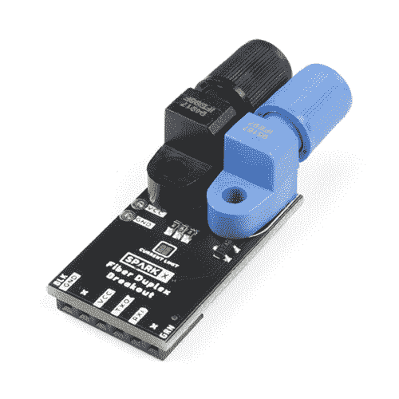

# 工业光纤连接指南

> 原文：<https://learn.sparkfun.com/tutorials/industrial-fiber-optics-hookup-guide>

## 光纤入门

*Image courtesy of [Bruno /Germany]("https://pixabay.com/users/bru-no-1161770/?utm_source=link-attribution&utm_medium=referral&utm_campaign=image&utm_content=4393369") from [Pixabay]("https://pixabay.com/?utm_source=link-attribution&utm_medium=referral&utm_campaign=image&utm_content=4393369")*

去年铜价很低。你没听说吗？所有酷小孩都在用闪光通过光纤传输他们的数据！好吧，所以光纤不会很快取代所有的铜线，但在某些情况下，它们很难被击败。例如，长光纤线路不会像天线一样给电路带来噪声。它们也不会传输来自接地故障或雷击的电涌。此外，它们不会干扰敏感的 RF 设备，否则这些设备可能会受到电信号产生的 EMF 辐射的干扰。

然而，从历史上看，纤维也有一些缺点。光纤可能易碎且昂贵。连接器很难安装，通常需要专用工具。切割和拼接光纤需要大量工作，包括抛光所有接口以实现最佳传输。最重要的是，两端的调制解调器通常都很昂贵，而且是为非常特殊的应用而设计的。但是，如果我告诉你，有一种价格合理的通用光纤解决方案，不需要专门的连接器或抛光设备，会怎么样呢？如果我告诉你，它可以在数百米的电缆上轻松实现 1Mbps 呢？这正是我要告诉你的。

I mean no disrespect when I say this is minimum viable fiber hardware

工业光纤系列发射器和检测器是迄今为止我们发现的在两个设备之间建立简单光纤连接的最经济的方法。IF-E97 发射器实际上只是一个别致的塑料模块中的超亮红色 LED，可以很容易地插入一根光纤并将其锁定在适当的位置。另一方面，IF-D96F 是一个封装相同的 5v TTL 光电晶体管。用一根光纤将两者连接起来，基本上就有了最简单的光纤链路。说到光纤，虽然您当然可以使用玻璃光纤(在适当的护套中)将这些模块连接在一起，但我们建议使用 PMMA 塑料光纤！很便宜，一点都不易碎，用剪刀就能剪。根据我们的经验，它根本不需要抛光，只需用剪刀剪开，然后塞进连接器即可。

你对工业光纤的通用接收器和发射器感兴趣吗？太好了，因为我们设计了三种不同的产品来帮助您将它们融入到您的下一个项目中…

## 串行光纤调制解调器

串行光纤调制解调器将 USB 转串行桥与光纤接收器和发射器结合在一起，是开箱即可开始使用光纤的最简单方法。

 

### [串行光纤调制解调器](https://www.sparkfun.com/products/retired/17508)

[Retired](https://learn.sparkfun.com/static/bubbles/ "Retired") SPX-17508

串行光纤调制解调器将 CH340C USB 转串行桥与来自工业光纤 Op…

**Retired**[Favorited Favorite](# "Add to favorites") 11[Wish List](# "Add to wish list")

首先，使用 USB-C 电缆将串行光纤调制解调器连接到您的电脑。它将以与我们的串行基本分线点相同的方式枚举为串行设备。该板有一个发射器和一个接收器，因此它充当全双工链路的一端。但是，如果您只想测试您的电路板，您可以通过将一根光缆插入同一电路板的发射器和接收器来创建一个简单的回环。

* * *

### 关于塑料纤维的一点注记

这些模块设计用于容纳护套直径为 2.2 毫米的单芯光缆，这种光缆通常可从几家制造商处在线购买。我们有 1 米长的塑料芯光缆供您使用。

 

### [2.2 毫米单面塑料纤维-黑色护套 960/1000um(1 米长)](https://www.sparkfun.com/products/retired/17511)

[Retired](https://learn.sparkfun.com/static/bubbles/ "Retired") CAB-17511

这种光缆是我们创造廉价光纤连接的最佳选择。它包括一个单一的 960 微米聚甲基丙烯酸甲酯核心与氟…

**Retired**[Favorited Favorite](# "Add to favorites") 2[Wish List](# "Add to wish list")

我们销售的电缆包含一根 960 米长的 PMMA 芯线和一层氟化聚合物包层，后者的长度可达 1000 米，最后是一层直径为 2.2 毫米的聚乙烯护套。用一把锋利的剪刀很容易剪下它。在大多数应用中，切割端不需要抛光。切割线缆时，尽可能垂直于末端进行切割，以形成平坦的光学表面。没有必要“剥离”外套的任何部分，只需将其与芯部平齐即可。

要将光缆插入模块，首先松开锁紧螺母，然后将光缆的切割端尽可能推入模块。插入电缆后，用手指拧紧锁紧螺母，这样电缆就不会轻易从模块中拉出。小心不要过紧，因为塑料螺纹容易损坏。

* * *

一旦接收器和发射器之间安装了一根光纤，只需打开一个串行终端并开始输入。您应该看到您的文本正在传输，然后被接收并显示在终端中。根据我们的经验，文本可以在至少 50 米的光纤上以高达 1 米的波特率无误地传输。

将两个串行光纤调制解调器相互连接时，确保将一个电路板的发射器连接到另一个电路板的接收器，反之亦然(蓝色连接到黑色，黑色连接到蓝色)

## 光纤双工转接

我们设计了光纤双工板，用于创建与嵌入式设备的简单光纤链路。该板与我们的串行分线点具有相同的引脚排列，因此它们将直接连接到许多开发板的串行接头，如 Arduino Pro 或 Pro Mini。

 

### [光纤双工转接](https://www.sparkfun.com/products/retired/17510)

[Retired](https://learn.sparkfun.com/static/bubbles/ "Retired") SPX-17510

我们设计了光纤双工板，用于创建与嵌入式设备的简单光纤链路。这款主板的引脚排列与我们的相同…

2 **Retired**[Favorited Favorite](# "Add to favorites") 8[Wish List](# "Add to wish list")

要在两块 dev 板之间创建光纤链路，只需将光纤双工分支连接到每块板，用两根光缆将它们连接起来，然后像平常一样使用串行库发送和接收数据。

该板还与串行光纤调制解调器协同工作，创建从开发板到计算机的光纤链路。我们甚至已经成功地用这种方式通过光纤加载了 Arduino 代码(尽管因为光纤不携带 DTR 信号，我们不得不在上传期间手动重置 Arduino 板)

* * *

### 什么是限流跳线？

这种跳线在光纤双工和单工转接中都可以找到。因为板将在 3.3V 和 5V 下工作，所以提供此跳线是为了将变送器 LED 的限流电阻减半。在大多数情况下，您永远不需要关闭此跳线，因为 LED 将只在 3.3V 下工作，亮度会降低。但是，如果您在 3.3V 下进行长距离传输时遇到问题，关闭此跳线将允许 LED 以其最大额定电流工作。

**BE CAREFUL!** Do not close the CURRENT LIMIT jumper and operate at 5V, this will overdrive the LED and could burn it out.

* * *

## 资源

就是这样，把你的 Arduino 放到光纤上既有趣又简单！在评论中，我想听听你对这些主板的应用有什么想法。为了方便起见，以下是我们提供的工业光纤和塑料光纤的数据表:

*   [IF-D96F 数据表](https://cdn.sparkfun.com/assets/0/c/b/6/1/ifd96f-1-20.pdf)
*   [IF-E97 数据表](https://cdn.sparkfun.com/assets/7/a/3/a/2/ife97-2-20.pdf)
*   [光缆规格表](https://cdn.sparkfun.com/assets/8/b/b/e/6/P96TB01TEBL2-2-1.pdf)

此外，如果您打算建立串行链路并对其进行故障排除，那么复习串行通信的基础知识会很有帮助。这是我们关于这个主题的教程:

 [### 串行通信

#### 2012 年 12 月 18 日](https://learn.sparkfun.com/tutorials/serial-communication) Asynchronous serial communication concepts: packets, signal levels, baud rates, UARTs and more 100

黑客快乐！