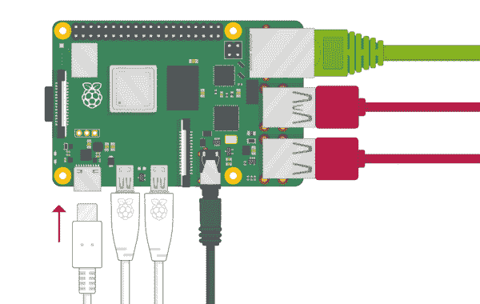
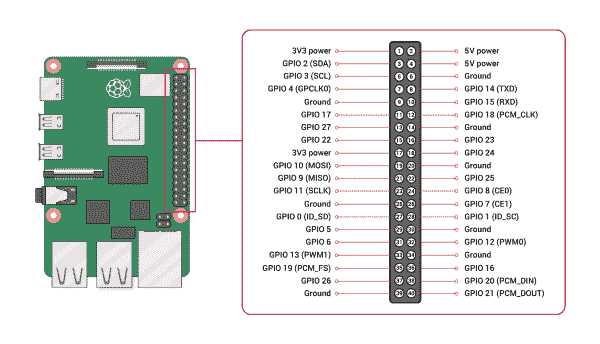

# Raspberry Pi GPIO 和物理计算简介

> 原文：<https://learn.sparkfun.com/tutorials/introduction-to-the-raspberry-pi-gpio-and-physical-computing>

## 介绍

如果你最近买了你的第一台[树莓派](https://www.sparkfun.com/raspberry_pi)，恭喜你买到了也许是你拥有过的最便宜最小的电脑！然而，它看起来肯定不像你习惯的任何电脑，所以让我们通过基础知识来让你的 Raspberry Pi 作为一个完整的桌面运行。我们还将学习与 GPIO 进行交互，并连接一个大气传感器，用 Python 读取一些数据。

[](https://cdn.sparkfun.com/assets/learn_tutorials/1/5/9/5/physical-computing.jpg)

我们将用树莓 Pi 读取大气传感器的数据。

### 推荐阅读

如果你不熟悉 Qwiic 系统，我们推荐你在这里阅读。

[](https://www.sparkfun.com/qwiic)

[qw icconnect 系统](https://www.sparkfun.com/qwiic)旨在让您的项目持续进行。

* * *

我们也建议看看下面的教程，如果你不熟悉的话。

[](https://learn.sparkfun.com/tutorials/raspberry-gpio) [### 树莓 gPIo](https://learn.sparkfun.com/tutorials/raspberry-gpio) How to use either Python or C++ to drive the I/O lines on a Raspberry Pi.[Favorited Favorite](# "Add to favorites") 17[](https://learn.sparkfun.com/tutorials/raspberry-pi-spi-and-i2c-tutorial) [### 树莓派 SPI 和 I2C 教程](https://learn.sparkfun.com/tutorials/raspberry-pi-spi-and-i2c-tutorial) Learn how to use serial I2C and SPI buses on your Raspberry Pi using the wiringPi I/O library for C/C++ and spidev/smbus for Python.[Favorited Favorite](# "Add to favorites") 24[](https://learn.sparkfun.com/tutorials/qwiic-shim-for-raspberry-pi-hookup-guide) [### 用于 Raspberry Pi 连接指南的 Qwiic 垫片](https://learn.sparkfun.com/tutorials/qwiic-shim-for-raspberry-pi-hookup-guide) Ever wanted to prototype I2C components on a Pi? Now you can 2[](https://learn.sparkfun.com/tutorials/raspberry-pi-4-kit-hookup-guide) [### Raspberry Pi 4 套件连接指南](https://learn.sparkfun.com/tutorials/raspberry-pi-4-kit-hookup-guide) Guide for hooking up your Raspberry Pi 4 Model B basic, desktop, or hardware starter kit together.[Favorited Favorite](# "Add to favorites") 2

* * *

## 硬件概述和连接

由于 Raspberry Pi 是一台全功能的计算机，它需要你可能已经习惯的计算机必须完全交互的外围设备。我们将需要六个关键组件来启动和运行 Raspberry Pi，但是我们还将了解一些经常与 Pi 一起使用的附加硬件。让我们从需要什么开始！

#### 用于安装的通用硬件

*   **监视器** -操作系统的初始设置和配置基本上需要一个监视器。如果你将使用 SSH 连接到你的 Raspberry Pi，那么在设置之后你就不需要监视器了(查看这个[教程](https://learn.sparkfun.com/tutorials/getting-started-with-the-autonomous-kit-for-the-sphero-rvr/remote-access-with-ssh)，它将带你了解 SSH 和 Pi！)确保您的显示器有 HDMI 输入。
*   **microSD 卡**-microSD 卡存储操作系统和文件。如果您购买了套件，microSD 卡可能已经格式化，可以使用。否则，您需要手动将操作系统的映像安装到 mciroSD 卡上，以便将其加载到您的 Pi 上
*   **键盘和鼠标** -你可以一起购买(鼠标是键盘的一部分)，也可以分开购买
*   HDMI 线缆 -你需要一根 HDMI 线缆将 Raspberry Pi 连接到显示器。不同的 Raspberry Pi 型号有不同的 HDMI 电缆要求，但最新型号(Raspberry Pi 4)需要 HDMI 转 Micro HDMI 电缆。
*   **电源** -不同的 Raspberry Pi 型号有不同的 USB 连接和电源要求，但最新型号(Raspberry Pi 4)需要 USB 类型 C 到 C 电缆和墙壁适配器。

#### 附加硬件

*   **散热片** -散热片对于 CPU 超频的用户来说很受欢迎，所以 Pi 运行过热。如果 CPU 的温度变得太热，散热器将被动冷却 CPU 附近的空气，以帮助冷却处理器。散热器也可以兼作保护壳。如果您认为您可能需要一个散热器，您可以在终端中使用以下命令来查看您的 Pi 的温度:`hot./opt/vc/bin/vcgencmd measure_temp`

*   **外壳** -由于树莓皮是一个裸露的电路板，你可能想用一个外壳来保护它免受灰尘和损坏。各种各样的公司都在为 Pi 辩护；也许最引人注目的例子是 [Rasberry Pi 400](https://www.sparkfun.com/products/17376) ，它基本上使用键盘作为树莓 Pi 的外壳。由 Raspberry Pi Foundation 构建，它通过键盘背面扩展了 Pi 端口，从而不会限制交互能力。

*   **以太网电缆** -根据你的 Raspberry Pi 型号，如果你想绕过无线连接，拿起一根以太网电缆插入万维网！

*   **扬声器** -如果你想播放音乐或声音，你需要一套扬声器。任何带有 3.5 毫米插孔的标准扬声器都可以...它们将连接到主板侧面的 AV 插孔。

#### 不同树莓 Pi 版本的快速说明

Raspberry Pi 有多种外形规格和代数——0 代、2 代、3 代等。-针对不同的使用案例。电路板之间的布局略有不同，但大多数连接是相同的。出于本教程的目的，我们将重点关注最新版本的[树莓 Pi 4](https://www.sparkfun.com/products/15447) 。不过，如果您使用的是另一种型号，在收集您需要的硬件时，请查阅连接指南，仔细检查所需的连接。

### 所需的特定硬件

#### [SparkFun Raspberry Pi 4 桌面套件- 4GB](https://www.sparkfun.com/products/16386)

幸运的是，SparkFun 有一个工具包，它几乎可以为您提供适当的硬件，并支持尽可能最少的令人沮丧的体验 SparkFun Raspberry Pi 4 桌面工具包包括以下内容:

*   Raspberry Pi 4 - 4GB 型号
*   罗技 K400 Plus 带触摸板的无线键盘
*   金斯顿帆布加油！带适配器的 64GB MicroSD 卡
*   USB 型到 C 型公电缆(1 米)
*   USB 型墙壁适配器
*   金属散热片盒，带隔热带-黑色
*   HDMI 转微型 HDMI 电缆
*   树莓派的 SparkFun Qwiic 垫片

这个套件的黑马是 afformented[Qwiic SHIM](https://www.sparkfun.com/products/15794)，这是一个重要的组件，我们将在本教程的后面使用它与 GPIO 进行交互。

[](https://www.sparkfun.com/products/16386) 

### [SparkFun 树莓 Pi 4 桌面套装- 4GB](https://www.sparkfun.com/products/16386)

[Out of stock](https://learn.sparkfun.com/static/bubbles/ "out of stock") KIT-16386

SparkFun Raspberry Pi 4 桌面套件(4GB)包括将任何带 HDMI 端口的显示器变成桌面所需的一切

[Favorited Favorite](# "Add to favorites") 10[Wish List](# "Add to wish list")

#### [SparkFun 大气传感器分线点- BME280](https://www.sparkfun.com/products/15440)

我们还将利用 BME280 环境突破之一，因为它有各种各样的精确数据可以提供，并可以通过 Qwiic 连接，这意味着我们不会受到焊接的影响，可以直接进入编码。

[](https://www.sparkfun.com/products/15440) 

将**添加到您的[购物车](https://www.sparkfun.com/cart)中！**

 **### [【spark fun 大气传感器 Breakout - BME280 (Qwiic)](https://www.sparkfun.com/products/15440)

[In stock](https://learn.sparkfun.com/static/bubbles/ "in stock") SEN-15440

SparkFun BME280 大气传感器 Breakout 是一种测量大气压力、湿度和温度读数的简单方法…

$16.502[Favorited Favorite](# "Add to favorites") 26[Wish List](# "Add to wish list")** **### 把所有的放在一起

幸运的是，几乎没有什么额外的知识可以把它们放在一起。只需通过 USB 连接鼠标和键盘，通过 USB-C 连接电源(不要忘记将另一端插入墙上的适配器)，将 HDMI 连接到显示器和 Pi，并将 microSD 卡装入其插槽。除了确保电线不会纵横交错，弄得乱七八糟，你已经准备好启动你的台式电脑了！

[](https://cdn.sparkfun.com/assets/learn_tutorials/1/5/9/5/setup.png)

* * *

## GPIO 引脚概述

好了，我们已经把必要的硬件连接到树莓派上，你已经迫不及待地想把它作为一台通用电脑来使用，进行网上冲浪，在 Youtube 上观看和查看猫迷因。但是 Pi *真正的亮点在于它的 40 针 GPIO(通用输入&输出)。GPIO 使您能够打开和关闭设备(输出)，或者从传感器和开关接收数据(输入)。这真正意味着，你可以将 Raspberry Pi 连接到任何东西，从智能镜子到气象站，到在网络服务器上显示其坐标的资产跟踪机器人。让我们更深入地了解一下 GPIO 头的潜力！我们可以参考下面由 Raspberry Pi 基金会提供的 GPIO 引脚排列图，作为理解引脚的直观指南:*

[](https://cdn.sparkfun.com/assets/learn_tutorials/1/5/9/5/GPIO.png)

##### 电源引脚

先说电源引脚，包括 3.3V 和 5V 两种。这些引脚将功率作为输出传输给相连的外设。

##### 地面

如果我们要在这里安装电力电路，那么我们需要一个地线。你会发现针内也有大量的接地。

##### 标准 GPIO 引脚

去掉电源和接地引脚，剩下的引脚专门用于发送输出和接收输入。所有这些都可以用于简单的输入/输出任务！

##### 健谈的凯茜·平斯

一些标准 GPIO 引脚用于通信目的。下面是这些通信协议的简要概述！

*   **SPI 引脚**–串行外设接口(SPI)是一种通信协议，用于在 Raspberry Pi 等微型计算机和外设之间传输数据。MISO 引脚接收数据，MOSI 引脚从 Raspberry Pi 发送数据。此外，串行时钟引脚以固定频率在 Raspberry Pi 和 SPI 器件之间发送脉冲，其速度与器件之间传输数据的速度相同。
*   **UART 引脚**–UART 代表通用异步收发器，这是一种用于发送和接收数据的物理电路。
*   **PWM 引脚**–PWM 的意思是“脉冲宽度调制”，这是一种最好用于移动和发光的东西的通信协议:电机、led 等等。
*   **I2C 引脚**–I²C 是内部集成电路(两个“内部”或 I“平方”C)的简称。它的工作原理与 SPI 类似，但不会强迫您使用这么多引脚。

##### 识别引脚

有两种方法可以识别 GPIO 引脚...第一个是它在棋盘上的物理位置，或者它的棋盘名称。它还有一个 Broadcom SOC 渠道(BCM)名称。通过打开终端并运行命令`pinout`,它将根据板上的 Broadcom 芯片返回 Raspberry Pi GPIO 引脚及其名称的映射。

[](https://cdn.sparkfun.com/assets/learn_tutorials/1/5/9/5/pinout.png)Map for the Raspberry Pi 4 based on the pinout command.

如果你真的想深入了解 Raspberry Pi GPIO 引脚排列，这里有一个非常全面的 [Raspberry Pi GPIO 引脚排列指南](https://pinout.xyz/)，它是交互式的，会逐步介绍每种类型的板上引脚。上面概述的这个概述应该足以让我们开始我们的项目了！

* * *

## 操作系统设置

好了，硬件设置正确！如果你像我们一样为这个项目选择了一个工具包，Raspberry Pi 操作系统映像应该安装在 microSD 卡上。如果你使用的是空白的 MicroSD 卡，你必须访问 Raspberry Pi Foundation 安装合适的镜像，或者你可以在 microSD 卡上安装不同的操作系统镜像。其他一些著名的操作系统有 [OSMC](https://osmc.tv/download/) 、 [RetroPie](https://retropie.org.uk/) 、 [Ubuntu](https://ubuntu.com/raspberry-pi) 、 [Rokos](https://rokos.space/) 以及其他几十种。

出于本教程的目的，我们将坚持使用 Raspberry Pi 官方支持的操作系统 Raspberry Pi OS(正式名称为 Raspbian)。

当 Raspberry Pi 通电并启动时，它会在桌面上加载一张缅甸蒲甘日出的绚丽壁纸。

[](https://cdn.sparkfun.com/assets/learn_tutorials/1/5/9/5/initial.png)

它会很快弹出一个窗口，指导您设置操作系统，包括设置位置、日期、时间、密码、WiFi，以及进行一些软件更新。屏幕应该像下面的图片一样进行，然后 Raspberry Pi 会更新。

##### 设置国家、语言和时区

[](https://cdn.sparkfun.com/assets/learn_tutorials/1/5/9/5/location.png)

##### 将密码更改为非密码

[](https://cdn.sparkfun.com/assets/learn_tutorials/1/5/9/5/password.png)

##### 选择您的本地 WiFi 网络

[](https://cdn.sparkfun.com/assets/learn_tutorials/1/5/9/5/wifi.png)

##### Pi 将更新软件

[](https://cdn.sparkfun.com/assets/learn_tutorials/1/5/9/5/update.png)

一旦 Pi 重新启动，它会再次将您带回到主桌面页面。左下角的主菜单包含一个轻量级的开源程序，打包在 Raspbian 中。

[](https://cdn.sparkfun.com/assets/learn_tutorials/1/5/9/5/mainMenu.png)

另外，在屏幕的右上角，您应该会看到一个 Chromium 的球形图标。这是您的 Internet 浏览器，如果您设置了网络设置，您可以在此浏览网页。接下来是文件管理器，它允许你浏览 SD 卡和外部 USB 存储上的文件。最后，黑色图标打开终端。这允许您直接键入命令，对于高级用户来说，这是执行某些任务的一种更快、更灵活的方式。

操作系统中还有其他应用程序对我们有用，特别是文本编辑器，这样我们就可以编写和运行代码。对于这个项目，我们将特别使用 Thonny，它是一个 Python(3) IDE，可以从应用程序编写和运行代码。Raspbian 中另一个值得注意的应用是 [VNC](https://www.raspberrypi.org/documentation/remote-access/vnc/) ，它允许你从另一台计算机远程控制你的 Pi 的桌面界面。

* * *

## Python 概述和传感器数据读取

Raspberry Pi Foundation 特别选择 Python 作为 Raspberry Pi 的主要语言，因为它易于使用、功能强大、功能多样，并且是开源的。Python 预装在 Raspbian 上，因此您可以加载像 Thonny 这样的 IDE 并快速开始编码。

如果你以前从未用 Python 编码过，一定要看看我们关于用 Python 编码[的教程...它会让你开始使用变量、操作符、对象、数据结构等等。为了与 GPIO 交互，对 Python 有一个基本的了解是很重要的，所以了解变量、函数、操作符和类是很好的，即使你只是在很高的层次上理解它们，而不能自己编写它们！](https://learn.sparkfun.com/tutorials/python-programming-tutorial-getting-started-with-the-raspberry-pi/programming-in-python)

#### 使用 gpiozero 与 GPIO 交互

我们想用 Raspberry Pi 的世界来探索物理计算的世界，其中一个方法就是学习与 GPIO 交互。有一个很棒的 Python 库叫做 [gpiozero](https://gpiozero.readthedocs.io/en/stable/) ，它使得与 GPIO 的交互变得非常容易，并且已经预装在 Raspbian 上。

在 Python 中，脚本中使用的库和函数必须通过文件顶部的名称导入，因此您可以导入整个库，

```
import gpiozero 
```

或者您可以只导入一两个组件:

```
from gpiozero import Button 
```

您需要将 Pi 上使用的 GPIO 管脚设置为 gpiozero 选择的相应组件。例如，如果您将一个 LED 连接到 Pi 上的第 17 号引脚，那么您可以使用这个 Python 库以多种方式引用它(还记得 GPIO 引脚可以有许多名称吗？)

```
led = LED(17)
led = LED("GPIO17")
led = LED("BOARD11") 
```

如果你想把一个 LED 接到管脚 17 和一个接地管脚(以及一个[限流](https://learn.sparkfun.com/tutorials/resistors#current-limiting)电阻)，你可以简单地用下面的代码使 LED 闪烁。它从库中导入 LED 元件，并暂停。在让电路板知道 LED 连接到哪个引脚后，它将调用该 LED 闪烁，然后暂停。

```
from gpiozero import LED
from signal import pause

red = LED(17)

red.blink()

pause() 
```

使用试验板和电线，你几乎可以将任何东西连接到 GPIO，并通过 gpiozero 与之交互。

#### 使用 Qwiic 方式与 GPIO 交互

在我们的项目中，我们想要将 Qwiic 传感器连接到 Raspberry Pi，因此我们将实际使用套件中包含的 [Qwiic 垫片](https://learn.sparkfun.com/tutorials/qwiic-shim-for-raspberry-pi-hookup-guide/all)。我们只需将 Qwiic 垫片与 GPIO 接头上的引脚 1 对齐，然后将其滑入即可。我们不需要指定我们正在使用的引脚-垫片与引脚 1 对齐-但我们需要导入附加大气传感器所需的其他库。

将 Qwiic 垫片安装在 Pi 上后，它看起来应该是这样的:

|  |  |
| 安装在桥墩 4 上的 Qwiic 垫片。 | *您的传感器在 Qwiic 电缆的另一端。* |

```
sudo pip install sparkfun-qwiic-bme280 
```

现在，我们可以导入 BME280 库，以及时间和系统库来读取一些基本温度值。我们需要确保 BME280 设置为变量，连接到系统，然后像运行 Arduino 一样运行传感器。

这里重要的库是 qwiic_bme280。如你所见，传感器本身将在功能持续期间设置为 mySensor，因此无论何时你看到 mySensor。“某物”，它调用一个对每个实例唯一的实例变量。

```
import qwiic_bme280
import time
import sys

def runExample():

    print("\nSparkFun BME280 Sensor + Raspberry Pi Example \n")
    mySensor = qwiic_bme280.QwiicBme280()

    if mySensor.isConnected() == False:
        print("The Qwiic BME280 device isn't connected to the system.", 
            file=sys.stderr)
        return

    mySensor.begin()

    while True:
        print("Humidity:\t%.3f" % mySensor.humidity)

        print("Pressure:\t%.3f" % mySensor.pressure)    

        print("Altitude:\t%.3f" % mySensor.altitude_feet)

        print("Temperature:\t%.2f" % mySensor.temperature_fahrenheit)       

        print("")

        time.sleep(1) 
```

挑战:如果温度超过华氏 80 度，你如何修改上面的代码来只打印温度？(提示:记住你的运营商！)

```
import qwiic_bme280
import time
import sys

def runExample():

    print("\nSparkFun BME280 Sensor  Example 1\n")
    mySensor = qwiic_bme280.QwiicBme280()

    if mySensor.isConnected() == False:
        print("The Qwiic BME280 device isn't connected to the system.", 
            file=sys.stderr)
        return

    mySensor.begin()

    if mySensor.temperature_fahrenheit > 80:

        print("It's hot!")       

        time.sleep(1)
```**