# MicroMod 天气载板连接指南

> 原文：<https://learn.sparkfun.com/tutorials/micromod-weather-carrier-board-hookup-guide>

## 介绍

介绍 [MicroMod 天气载板](https://www.sparkfun.com/products/16794)！这个漂亮的小气象站板与所有 SparkFun MicroMod 处理器一起工作，因此您可以定制您的气象站项目以满足您的需求。

[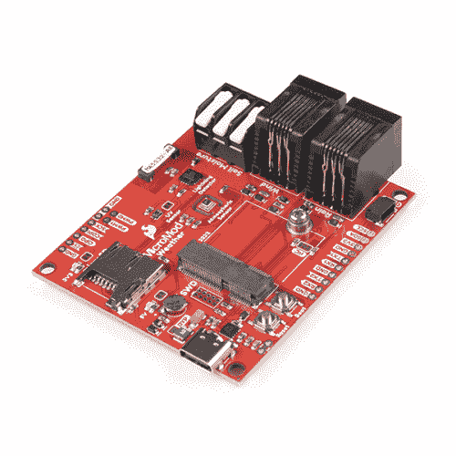](https://www.sparkfun.com/products/16794) 

将**添加到您的[购物车](https://www.sparkfun.com/cart)中！**

### [SparkFun MicroMod 天气载板](https://www.sparkfun.com/products/16794)

[In stock](https://learn.sparkfun.com/static/bubbles/ "in stock") SEN-16794

MicroMod 生态系统的 MicroMod 天气载板外围，允许您创建自己的气象站与

$44.951[Favorited Favorite](# "Add to favorites") 7[Wish List](# "Add to wish list")** **[https://www.youtube.com/embed/yy5xHNfZzyE/?autohide=1&border=0&wmode=opaque&enablejsapi=1](https://www.youtube.com/embed/yy5xHNfZzyE/?autohide=1&border=0&wmode=opaque&enablejsapi=1)

天气载板包括三个传感器:BME280 温度、压力和湿度传感器、VEML6075 紫外线传感器和 AS3935 闪电探测器。除了这些机载传感器，还有一个 3 针插销端子，用于添加外部[土壤湿度传感器](https://www.sparkfun.com/products/13637)，以及一对 RJ11 插孔，用于插入我们的[气象计套件](https://www.sparkfun.com/products/15901)中包含的风雨传感器。最重要的是，还有一个 microSD 卡插槽，这样你就可以插入 SD 卡来记录所有精彩的天气数据！

### 所需材料

像我们所有的 MicroMod 载板一样，不包含处理器，但您可以将您选择的处理器插入载体上的 MicroMod M.2 连接器。这里有几个选项可供您的处理器选择:

[](https://www.sparkfun.com/products/16791) 

将**添加到您的[购物车](https://www.sparkfun.com/cart)中！**

### [SparkFun MicroMod SAMD51 处理器](https://www.sparkfun.com/products/16791)

[Out of stock](https://learn.sparkfun.com/static/bubbles/ "out of stock") DEV-16791

SparkFun MicroMod SAMD51 处理器板采用 32 位 ARM Cortex-M4F MCU，是一款功能强大的微控制器，封装在一个

$18.951[Favorited Favorite](# "Add to favorites") 8[Wish List](# "Add to wish list")****[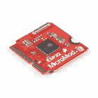](https://www.sparkfun.com/products/16781) 

将**添加到您的[购物车](https://www.sparkfun.com/cart)中！**

### [SparkFun MicroMod ESP32 处理器](https://www.sparkfun.com/products/16781)

[In stock](https://learn.sparkfun.com/static/bubbles/ "in stock") WRL-16781

该板将 Espressif 的 ESP32 与我们的 M.2 连接器接口相结合，为我们的 Micro…

$16.951[Favorited Favorite](# "Add to favorites") 6[Wish List](# "Add to wish list")****[](https://www.sparkfun.com/products/16984) 

将**添加到您的[购物车](https://www.sparkfun.com/cart)中！**

### [SparkFun micro mod NRF 52840 处理器](https://www.sparkfun.com/products/16984)

[In stock](https://learn.sparkfun.com/static/bubbles/ "in stock") WRL-16984

SparkFun MicroMod nRF52840 处理器提供了 ARM Cortex-M4 CPU 和 2.4 GHz 蓝牙收发器的强大组合…

$21.50[Favorited Favorite](# "Add to favorites") 9[Wish List](# "Add to wish list")****[](https://www.sparkfun.com/products/16401) 

将**添加到您的[购物车](https://www.sparkfun.com/cart)中！**

### [SparkFun MicroMod Artemis 处理器](https://www.sparkfun.com/products/16401)

[24 available](https://learn.sparkfun.com/static/bubbles/ "24 available") DEV-16401

该处理器具有 Artemis 模块，能够进行机器学习、蓝牙、I2C、GPIO、PWM、SPI，并打包以适应…

$14.95[Favorited Favorite](# "Add to favorites") 14[Wish List](# "Add to wish list")******** ********你还需要一根 USB-C 电缆将载板连接到你的电脑，如果你想给你的 MicroMod 项目增加一些 qw IC 分线点，你至少需要一根 qw IC 电缆将它们连接在一起。以下是这两种电缆的一些选项:

[](https://www.sparkfun.com/products/15081) 

将**添加到您的[购物车](https://www.sparkfun.com/cart)中！**

### [SparkFun Qwiic 线缆套件](https://www.sparkfun.com/products/15081)

[In stock](https://learn.sparkfun.com/static/bubbles/ "in stock") KIT-15081

为了更容易上手，我们用 50 毫米到 500 毫米的各种 Qwiic 电缆组装了 Qwiic 电缆套件…

$8.9516[Favorited Favorite](# "Add to favorites") 58[Wish List](# "Add to wish list")****[](https://www.sparkfun.com/products/17259) 

将**添加到您的[购物车](https://www.sparkfun.com/cart)中！**

### [柔性 Qwiic 线缆- 100mm](https://www.sparkfun.com/products/17259)

[In stock](https://learn.sparkfun.com/static/bubbles/ "in stock") PRT-17259

这种极化 I2C 电缆绝缘是由硅制成的，比我们原来的 Qwiic 电缆更灵活，特别是在

$1.60[Favorited Favorite](# "Add to favorites") 8[Wish List](# "Add to wish list")****[](https://www.sparkfun.com/products/15424) 

将**添加到您的[购物车](https://www.sparkfun.com/cart)中！**

### [可逆 USB A 转 C 线- 2m](https://www.sparkfun.com/products/15424)

[18 available](https://learn.sparkfun.com/static/bubbles/ "18 available") CAB-15424

这些 2 米长的电缆稍加修改后，就可以插入其端口，而不用考虑其在 U…

$8.951[Favorited Favorite](# "Add to favorites") 4[Wish List](# "Add to wish list")****[](https://www.sparkfun.com/products/14743) 

将**添加到您的[购物车](https://www.sparkfun.com/cart)中！**

### [USB 3.1 线 A 到 C - 3 脚](https://www.sparkfun.com/products/14743)

[In stock](https://learn.sparkfun.com/static/bubbles/ "in stock") CAB-14743

USB C 棒极了。但是，在我们将所有的集线器、充电器和端口转换为 USB C 之前，这是您要使用的电缆…

$5.504[Favorited Favorite](# "Add to favorites") 9[Wish List](# "Add to wish list")******** ********如果你想充分利用 Weather Carrier Board 的功能，你还需要一个 SparkFun 土壤湿度传感器、气象仪套件和一个 microSD 卡:

[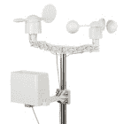](https://www.sparkfun.com/products/15901) 

将**添加到您的[购物车](https://www.sparkfun.com/cart)中！**

### [气象仪套件](https://www.sparkfun.com/products/15901)

[In stock](https://learn.sparkfun.com/static/bubbles/ "in stock") SEN-15901

无论你是在测量风速、方向还是降雨，这都是你的气象仪。

$79.959[Favorited Favorite](# "Add to favorites") 52[Wish List](# "Add to wish list")****[](https://www.sparkfun.com/products/13637) 

将**添加到您的[购物车](https://www.sparkfun.com/cart)中！**

### [【spark fun 土壤湿度传感器(带螺丝端子)](https://www.sparkfun.com/products/13637)

[In stock](https://learn.sparkfun.com/static/bubbles/ "in stock") SEN-13637

用于测量土壤和类似材料中水分的简单装置。裸露焊盘共同充当一个阀门…

$7.504[Favorited Favorite](# "Add to favorites") 37[Wish List](# "Add to wish list")****[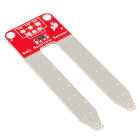](https://www.sparkfun.com/products/13322) 

将**添加到您的[购物车](https://www.sparkfun.com/cart)中！**

### [SparkFun 土壤水分传感器](https://www.sparkfun.com/products/13322)

[In stock](https://learn.sparkfun.com/static/bubbles/ "in stock") SEN-13322

用于测量土壤和类似材料中水分的简单装置。裸露焊盘共同充当一个阀门…

$6.5016[Favorited Favorite](# "Add to favorites") 74[Wish List](# "Add to wish list")****[](https://www.sparkfun.com/products/15051) 

将**添加到您的[购物车](https://www.sparkfun.com/cart)中！**

### [microSD 卡-16GB(10 类)](https://www.sparkfun.com/products/15051)

[22 available](https://learn.sparkfun.com/static/bubbles/ "22 available") COM-15051

这是一个 10 级 16GB microSD 存储卡，非常适合容纳单板计算机和多种…

$19.95[Favorited Favorite](# "Add to favorites") 4[Wish List](# "Add to wish list")******** ********### 推荐阅读

SparkFun MicroMod 生态系统提供了一种独特的方式，允许用户根据自己的需求定制他们的项目。您想通过无线信号(如蓝牙或 WiFi)发送您的天气数据吗？有一个微型处理器可以做到这一点。希望最大限度地提高效率和处理能力？你猜对了，有一个微模块处理器。

如果你不熟悉 MicroMod 生态系统，我们推荐你阅读这里的[来了解](https://www.sparkfun.com/micromod)的概况。

| [](https://www.sparkfun.com/micromod) |

在开始使用 Weather Carrier 板之前，您可能需要通读所选 [MicroMod 处理器](https://www.sparkfun.com/micromod#processor_boards)的连接指南。MicroMod 处理器连接指南可以在处理器的产品页面上找到。如果您不熟悉以下教程中的概念，我们还建议您通读这些教程:

[](https://learn.sparkfun.com/tutorials/serial-peripheral-interface-spi) [### 串行外设接口(SPI)](https://learn.sparkfun.com/tutorials/serial-peripheral-interface-spi) SPI is commonly used to connect microcontrollers to peripherals such as sensors, shift registers, and SD cards.[Favorited Favorite](# "Add to favorites") 91[](https://learn.sparkfun.com/tutorials/i2c) [### I2C](https://learn.sparkfun.com/tutorials/i2c) An introduction to I2C, one of the main embedded communications protocols in use today.[Favorited Favorite](# "Add to favorites") 128[](https://learn.sparkfun.com/tutorials/terminal-basics) [### 串行终端基础知识](https://learn.sparkfun.com/tutorials/terminal-basics) This tutorial will show you how to communicate with your serial devices using a variety of terminal emulator applications.[Favorited Favorite](# "Add to favorites") 46[](https://learn.sparkfun.com/tutorials/getting-started-with-micromod) [### MicroMod 入门](https://learn.sparkfun.com/tutorials/getting-started-with-micromod) Dive into the world of MicroMod - a compact interface to connect a microcontroller to various peripherals via the M.2 Connector 3

如果您有兴趣进一步了解 Weather Carrier 板上的每个传感器，请查看它们的专用连接指南:

[](https://learn.sparkfun.com/tutorials/qwiic-uv-sensor-veml6075-hookup-guide) [### Qwiic 紫外线传感器(VEML6075)连接指南](https://learn.sparkfun.com/tutorials/qwiic-uv-sensor-veml6075-hookup-guide) Learn how to connect your VEML6075 UV Sensor and figure out just when you should put some sunscreen on.[Favorited Favorite](# "Add to favorites") 2[](https://learn.sparkfun.com/tutorials/sparkfun-as3935-lightning-detector-hookup-guide-v20) [### SparkFun AS3935 闪电探测器连接指南(v20)](https://learn.sparkfun.com/tutorials/sparkfun-as3935-lightning-detector-hookup-guide-v20) Are you worried about the looming clouds in the distance, how far away is that storm exactly? Add lightning detection with the AS3935 to your next weather station or your next bike ride 2[](https://learn.sparkfun.com/tutorials/qwiic-atmospheric-sensor-bme280-hookup-guide) [### Qwiic 大气传感器(BME280)连接指南](https://learn.sparkfun.com/tutorials/qwiic-atmospheric-sensor-bme280-hookup-guide) Measure temperature, humidity, barometric pressure with the SparkFun Atmospheric Sensor Breakout BME280 (Qwiic).[Favorited Favorite](# "Add to favorites") 4

## 硬件概述

在本节中，我们将介绍 MicroMod Weather 载板上的各种硬件、传感器和可调焊接跳线、外部传感器连接以及载板的引脚排列，以详细了解它如何连接到您选择的 MicroMod 处理器。

### 通用组件

大多数 SparkFun MicroMod 载板都有一些通用组件，所有 MicroMod 载板都有键控 M.2 MicroMod 连接器，可以将您的处理器插入其中。下面的照片和列表概述了天气载板和大多数其他 SparkFun MicroMod 载板上的一些组件。

*   **M.2 MicroMod 连接器** -这种特殊的键控 M.2 连接器让您可以在天气载板上安装您选择的 MicroMod 处理器。
*   **USB-C 连接器** -连接到您的计算机，为您的处理器编程，也可以为您的 MicroMod 系统供电。
*   **3.3V 调节器** -提供调节后的 **3.3V** 和高达 **1A** 的电源。
*   qw IC 连接器 -标准 qw IC 连接器，因此您可以将其他 qw IC 设备添加到您的 MicroMod 系统中。
*   **启动/复位按钮** -按下按钮进入处理器的启动模式，并复位您的微模块电路。
*   **RTC 备用电池&充电电路** - **1mAh** 内置 RTC 的 MicroMod 处理器上实时时钟的备用电池。从 **3.3V** 接收充电电压。
*   **microSD 插槽** -在此插入格式化为 FAT32 的 microSD 卡，记录您的天气数据。

[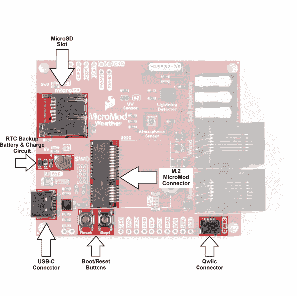](https://cdn.sparkfun.com/assets/learn_tutorials/1/1/9/3/MiroMod_Weather_CB_Common_Components.jpg)

### 气象站传感器和外部传感器连接

正如我们在简介中提到的，该板配有 BME280 温度、压力和湿度传感器、VEML6075 紫外线传感器和 AS3935 闪电探测器。除了这些机载传感器，还有一个用于土壤湿度传感器的三针插销端子，以及一对用于连接风雨仪的 RJ11 插孔。

三个机载传感器与外部传感器配合使用，提供了一个强大的可定制天气跟踪工具。

#### BME280 温度、压力和湿度传感器

博世的 BME280 大气传感器是天气载板的重型升降机。BME280 是一款高精度的数字环境传感器，可测量环境温度、相对湿度和大气压力。

[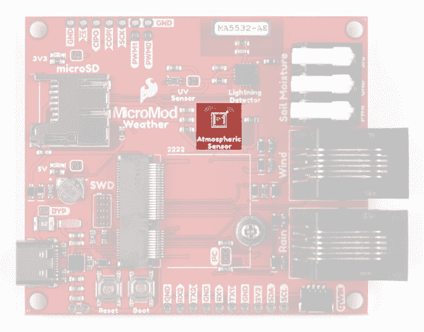](https://cdn.sparkfun.com/assets/learn_tutorials/1/1/9/3/MicroMod_Weather_CB_BME280.jpg)

BME280 测量 0 至 100%的湿度，绝对精度为 3 %RH(从 20-80%RH)，0°C 至 65°C 的温度，绝对精度为 0.5-1.5°C(全温度范围为-40°C 至 85°C)，以及 300 至 1100hPa 的大气压力，绝对精度为 1hPa(相对精度为 0.12hPa)。BME280 的 I ² C 地址为 **0x77** 。

有关传感器功能和特性的详细信息，请参考 [BME280 数据表](https://cdn.sparkfun.com/assets/e/7/3/b/1/BME280_Datasheet.pdf)或我们的 [SparkFun Qwiic 大气传感器(BME280)](https://learn.sparkfun.com/tutorials/qwiic-atmospheric-sensor-bme280-hookup-guide) 连接指南。

#### VEML6075 紫外线传感器

Vishay Semiconductors 的 VEML6075 紫外线传感器测量 UVA (320-400 纳米，峰值@ 365±10 纳米)和 UVB (228-320 纳米，峰值@ 330±10 纳米)辐照度，因此您可以在气象站计算[紫外线指数](https://en.wikipedia.org/wiki/Ultraviolet_index)。[示例 4——spark fun veml 6075 Arduino 库中的计算 UVI](https://github.com/sparkfun/SparkFun_VEML6075_Arduino_Library/blob/master/examples/Example4_Calculate_UVI/Example4_Calculate_UVI.ino) 演示了如何使用该传感器计算该指数。

[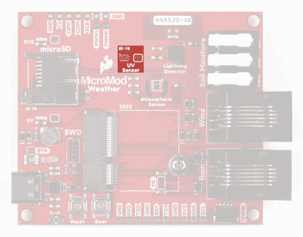](https://cdn.sparkfun.com/assets/learn_tutorials/1/1/9/3/MicroMod_Weather_CB_VEML6075.jpg)

VEML6075 的 UVA 分辨率为 0.93 计数/ W/cm ² ，UVB 分辨率为 2.1 计数/ W/cm ² 。I ² C 地址为 **0x10** 。

有关该紫外线传感器的更多信息，请参考 [VEML6075 数据表](https://cdn.sparkfun.com/assets/3/c/3/2/f/veml6075.pdf)或我们的 [SparkFun Qwiic 紫外线传感器(VEML6075)](https://learn.sparkfun.com/tutorials/qwiic-uv-sensor-veml6075-hookup-guide) 连接指南。

#### AS3935 闪电探测器

AMS 的 AS3935 闪电探测器可以探测到 40 公里以外的雷击，精确度可达风暴前沿 1 公里。经过特殊调谐的天线可以在 500kHz 频段接收闪电事件，内置算法有助于检查传入的信号模式，以抑制潜在的人为干扰，如大型电器中的 DC/DC 转换器。

[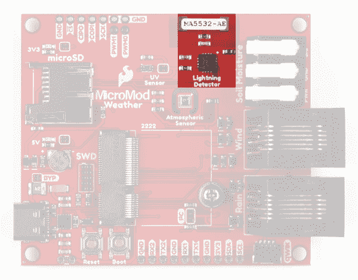](https://cdn.sparkfun.com/assets/learn_tutorials/1/1/9/3/MicroMod_Weather_CB_AS3935.jpg)

AS3935 闪电探测器连接到主 SPI 总线，AS3935 的片选(CS)连接到 G1/总线 1 (MicroMod 焊盘 42)。

有关传感器的详细信息，请参考 [AS3935 数据表](https://cdn.sparkfun.com/assets/learn_tutorials/9/2/1/AS3935_Datasheet_EN_v2.pdf)或我们的 [SparkFun 闪电探测器分线点](https://learn.sparkfun.com/tutorials/sparkfun-as3935-lightning-detector-hookup-guide-v20)连接指南。

#### 土壤湿度传感器插销端子

三针插销端子可以轻松将[土壤湿度传感器](https://www.sparkfun.com/products/13637)连接到天气载板。土壤湿度传感器是天气载体板的一个方便的附加功能，如果你在温室环境中使用它来监视你的土壤，通过一些巧妙的编码，你甚至可以根据传感器的测量结果打开或关闭灌溉系统。

[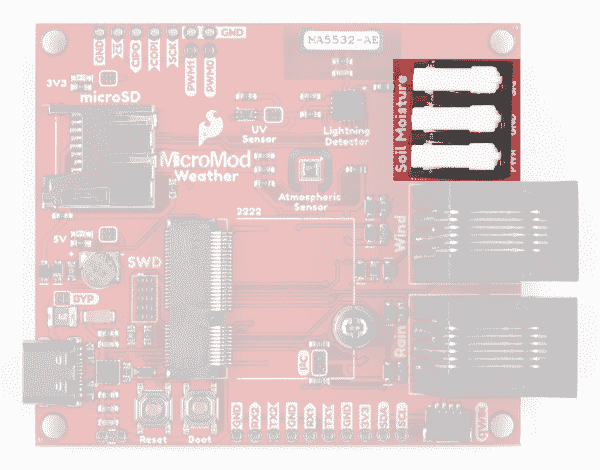](https://cdn.sparkfun.com/assets/learn_tutorials/1/1/9/3/MicroMod_Weather_CB_Soil.jpg)

土壤湿度传感器有两个大的涂层垫，作为本质上是一个大的可变电阻器的插脚。该传感器利用了潮湿土壤比干燥土壤导电性更好的简单概念，因此当更多的水加入土壤时，电路电阻下降，SIG 输出增加。

传感器的电源( **3.3V** )由 G0 (MicroMod pad 40)提供，使您可以轻松地打开和关闭它(不建议对土壤水分传感器持续供电)，信号输出连接到 A0 (MicroMod pad 34)。

如果你正在寻找自动化浇水项目的灵感，请查看我们的[产品展示视频](https://www.youtube.com/watch?v=1h6D_pkeoks)和[土壤湿度传感器连接指南](https://learn.sparkfun.com/tutorials/soil-moisture-sensor-hookup-guide)。

#### 风雨 RJ11 连接器

两个 RJ11 连接器允许您连接我们的[气象计套件](https://www.sparkfun.com/products/15901)中包含的风和雨传感器，以监控风速、风向和降雨量。这两个传感器是户外天气载板设置的重要补充，可以更全面地了解该地区的天气情况。

[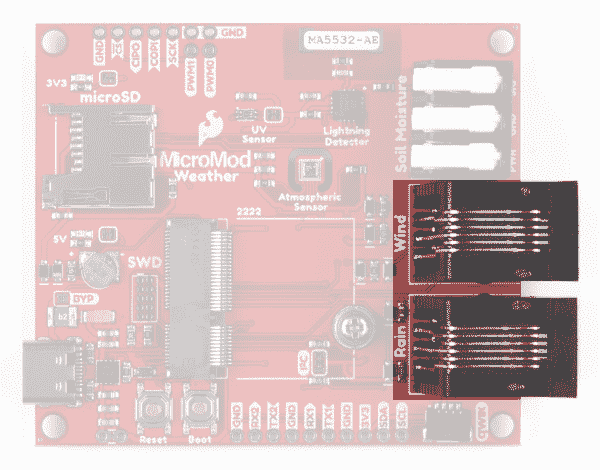](https://cdn.sparkfun.com/assets/learn_tutorials/1/1/9/3/MicroMod_Weather_CB_Wind-Rain.jpg)

气象计套件包括一个测量风速的风速计，一个确定风向的风阀和一个监测降雨量的自动排空翻斗收集器。风速计输出一个与 D0(微模块垫 10)相连的数字信号。wind vain 输出一个相对于其连接到 A1 的位置的模拟信号(微型模块焊盘 38)。雨量检测器向 D1 输出一个数字信号(微型模块垫 18)。

如需帮助组装和测试您的气象计套件，请查看我们的[气象计连接指南](https://learn.sparkfun.com/tutorials/weather-meter-hookup-guide)。

### 电镀通孔集管

Weather Carrier 板还将连接的 MicroMod 处理器的几个引脚连接到一对电镀通孔(PTH)接头。

[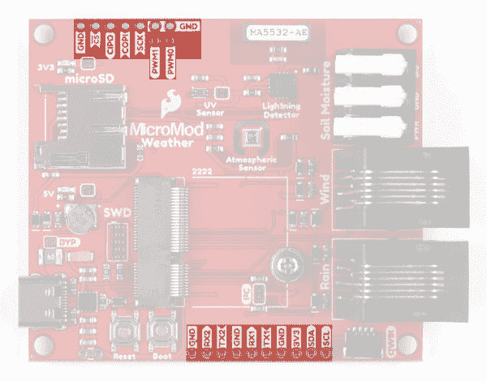](https://cdn.sparkfun.com/assets/learn_tutorials/1/1/9/3/MicroMod_Weather_CB_PTH_Headers.jpg)

在电路板的“北方”/顶部，主 SPI 总线连接到 PTH 接头(该接头上的 CS 引脚连接到 G2/BUS2)、三个接地引脚以及两个 PWM1 和 PWM0(如果用户希望焊接可以使用脉冲宽度调制的元件)。

如果用户更喜欢 I ² C 设备的焊接连接而不是 Qwiic 连接器，电路板的“南部”/底部具有串行 UART(UART 1 和 UART2)、另一对接地引脚以及来自主 I ² C 总线的 **3.3V** 和 SDA/SCL。

### 焊料跳线

If you have never worked with solder jumpers and PCB traces before or would like a quick refresher, check out our [How to Work with Solder Jumpers and PCB Traces](https://learn.sparkfun.com/tutorials/how-to-work-with-jumper-pads-and-pcb-traces) tutorial for detailed instructions and tips.

MicroMod 天气载板上共有七个可调跳线，分别标为 **I ² C** 、 **MEAS** 、 **BYP** 、 **VE** 、 **UV** 、 **5V** 和 **3V3** 。下表简要概述了它们的功能:

| **跳线名称/标签** | 描述 | **默认状态** |
| I ² C 上拉/I ² C | 通过两个 **2.2K 欧姆**电阻将 SDA/SCL 线拉至 **3.3V** | 关闭的 |
| 测量值 | 打开该跳线以探测调节器的 **3.3V** 输出端的电流消耗。为了帮助测量电流，看看我们的[如何使用万用表](https://learn.sparkfun.com/tutorials/how-to-use-a-multimeter#measuring-current)教程。 | 关闭的 |
| 旁路/BYP | “保险丝中的硬币”跳线。绕过 **6V/2A** 保险丝，并将 VIN 和 V_USB 连接在一起。**只有当你知道自己在做什么的时候才关门！** | 打开 |
| 电压调节器使能/VE | 电压调节器控制。闭合此跳线以控制低功率应用中的 VREG。 | 打开 |
| 紫外线传感器电源/紫外线 | 将 VEML6075 紫外线传感器的 VDD 连接到 **3.3V** 。打开跳线，关闭紫外线传感器的电源。 | 关闭的 |
| VIN LED 电源/VIN LED | 通过 **1K 欧姆**电阻将 5V/VIN LED 连接到 **5V** 。打开以禁用 LED。 | 关闭的 |
| 3.3V LED 电源/3V3 LED | 通过 **1K 欧姆**电阻器将 3.3V LED 连接到 **3.3V** 。打开以禁用 LED。 | 关闭的 |

| [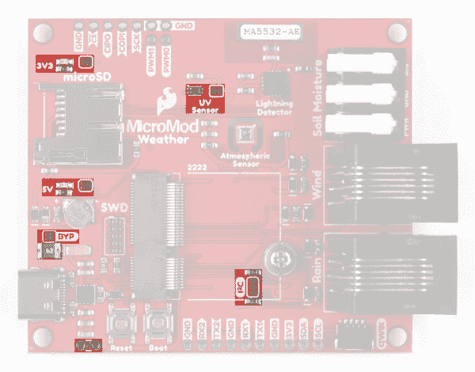](https://cdn.sparkfun.com/assets/learn_tutorials/1/1/9/3/MicroMod_Weather_CB_Jumpers_Front.jpg) | [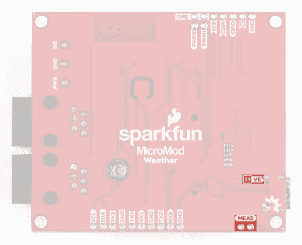](https://cdn.sparkfun.com/assets/learn_tutorials/1/1/9/3/MicroMod_Weather_CB_Jumpers_Back.jpg) |

*Having trouble viewing the detail in these photos? Click on them for a larger view.*

### 微型引脚排列

由于该载板设计用于所有的 MicroMod 处理器，我们在下表中列出了使用的引脚，因此，如果您愿意，您可以将它们与各自连接指南中的引脚表进行比较。

*   [天气载板引脚表](#WeatherCB)
*   [微模块通用引脚表](#MMGen)
*   [MicroMod 通用引脚描述](#MMDescript)

| **音频** | **UART** | **GPIO/总线** | **I ² C** | **SDIO** 的缩写形式 | **SPI** | **专用** |

| M.2 连接器针脚# | MicroMod 引脚名称 | 气象站连接 | 描述 |
| one | GND | GND | 接地层。 |
| Two | 3.3V | 3.3V | 通过 USB-C 调节 3.3V。 |
| three | USB_D+ | 机器转移归向 | 处理器板的 USB D+连接。 |
| four | 3.3V_EN | 3.3V 使能 | 稳压器使能输入。 |
| five | USB_D- | 机器转移归向 | 处理器板的 USB D 连接。 |
| six | 重置 | 复原按钮 | 连接到复位按钮。复位为低电平有效 |
| nine | USB_VIN | 车辆识别号码 | USB 输入电压。 |
| Ten | D0 | WSPEED | 风速的数字引脚。 |
| Eleven | 靴子 | 启动按钮 | 连接到启动按钮。Boot 为低电平有效。 |
| Twelve | I2C SDA | I2C SDA | BME280、VEML6075 等 Qwiic/I ² C 器件的 I ² C 数据信号。 |
| Fourteen | i2c _ scl | i2c _ scl | BME280、VEML6075 等 Qwiic/I ² C 器件的 I ² C 时钟信号。 |
| Seventeen | UART_TX1 | TX1 | UART1 数据输出。连接到 TX1 PTH 接头引脚。 |
| Eighteen | D1/CAM_TRIG | 雨 | 雨量计信号的数字引脚。 |
| Nineteen | UART_RX1 | RX1 | UART1 数据输入。连接到 RX1 PTH 接头引脚。 |
| Twenty | UART_RX2 | RX2 | UART2 数据输入。连接到 RX2 PTH 接头引脚。 |
| Twenty-one | SWDCK | SWDCK | 串行线调试时钟。 |
| Twenty-two | UART_TX2 | TX2 | UART2 数据输出。连接到 TX2 PTH 接头引脚。 |
| Twenty-three | SWDIO | SWDIO | 串行线调试输入输出 |
| Thirty-two | PWM0 | PWM0 | 专用 PWM0 引脚。断开至 PTH 接头引脚。 |
| Thirty-four | A0 | 土壤 _ 潮湿 _ 信号 | 土壤湿度传感器的模拟输入。 |
| Thirty-eight | 一流的 | WDIR .你好 | 风向模拟输入。 |
| Forty | G0/总线 0 | 土壤 _ 潮湿 _ 水 | 通用引脚配置为 3.3V 输出。 |
| forty-two | G1/巴士 1 | 闪电 _CS | AS3935 芯片选择。 |
| forty-four | G2/总线 2 | HEADER_CS | 通用片选引脚。连接到 SPI PTH 接头。 |
| Forty-six | G3/总线 3 | 闪电 _INT | AS3935 中断引脚。 |
| Forty-seven | PWM1 | PWM1 | 专用 PWM1 引脚。断开至 PTH 接头引脚。 |
| forty-nine | BATT_VIN/3 | VIN/3 | 用于监控电源的分压输入电压。 |
| Fifty-five | SPI_CS | SD_CS | 标清芯片选择。 |
| Fifty-seven | SPI | SPI | SPI 时钟信号。 |
| Fifty-nine | SPI_COPI | SPI_COPI | SPI 控制器输出/外设输入信号。 |
| Sixty-one | 睡吧，婊子 | 睡吧，婊子 | SPI 控制器输入/外设输出信号。 |
| seventy-two | RTC_3V | RTC_3V | 备用电池充电的 3V 输出。 |

| 功能 | 底部
销 | 顶部
销 | 功能 |
|  |  |  | (未连接) |  | **75** | GND |  |  |  |
|  |  |  | 3.3V | **74** | **73** | G5 /总线 5 |  |  |  |
|  |  |  | RTC _ 3V _ 电池 | **72** | **71** | G6 /总线 6 |  |  |  |
|  |  | SPI_CS1# | SDIO _ 数据 3(输入输出) | **70** | **69** | G7 /总线 7 |  |  |  |
|  |  |  | SDIO _ 数据 2(输入输出) | **68** | **67** | 八国集团(Group of Eight) |  |  |  |
|  |  |  | SDIO _ 数据 1(输入输出) | **66** | **65** | G9 | ADC_D- | CAM_HSYNC |  |
|  |  | 睡吧 | SDIO _ 数据 0(输入输出) | **64** | **63** | G10 | ADC_D+ | CAM_VSYNC |  |
|  |  | SPI COPI1 | SDIO_CMD (I/O) | **62** | **61** | 睡吧 |  |  |  |
|  |  | SPI SCK1 | SDIO_SCK(或) | **60** | **59** | SPI_COPI (O) | LED_DAT |  |  |
|  |  |  | AUD_MCLK (O) | **58** | **57** | SPI_SCK(或) | LED |  |  |
| 凯姆 | PCM_OUT | I2S 出局 | AUD_OUT | **56** | **55** | SPI_CS# |  |  |  |
| cam _ pclk | PCM_IN | I2S 因 | 澳元 _ 美元 | **54** | **53** | I2C_SCL1(输入/输出) |  |  |  |
| PDM_DATA | PCM_SYNC | i2s WS | AUD_LRCLK | **52** | **51** | I2C_SDA1(输入输出) |  |  |  |
| PDM_CLK | PCM_CLK | SCK i2s | 奥德 _BCLK | **50** | **49** | BATT_VIN / 3 (I - ADC) (0 至 3.3V) |  |  |  |
|  |  |  | G4 /总线 4 | **48** | **47** | PWM1 |  |  |  |
|  |  |  | G3 /总线 3 | **46** | **45** | GND |  |  |  |
|  |  |  | G2 /总线 2 | **44** | **43** | CAN_TX |  |  |  |
|  |  |  | G1 /巴士 1 | **42** | **41** | CAN_RX |  |  |  |
|  |  |  | G0 /总线 0 | **40** | **39** | GND |  |  |  |
|  |  |  | 一流的 | **38** | **37** | USBHOST_D- |  |  |  |
|  |  |  | GND | **36** | **35** | USBHOST_D+ |  |  |  |
|  |  |  | A0 | **34** | **33** | GND |  |  |  |
|  |  |  | PWM0 | **32** | **31** | 模块密钥 |  |  |  |
|  |  |  | 模块密钥 | **30** | **29** | 模块密钥 |  |  |  |
|  |  |  | 模块密钥 | **28** | **27** | 模块密钥 |  |  |  |
|  |  |  | 模块密钥 | **26** | **25** | 模块密钥 |  |  |  |
|  |  |  | 模块密钥 | **24** | **23** | SWDIO |  |  |  |
|  |  |  | UART_TX2 (O) | **22** | **21** | SWDCK |  |  |  |
|  |  |  | UART_RX2 (I) | **20** | **19** | UART_RX1 (I) |  |  |  |
|  |  | CAM_TRIG | D1 | **18** | **17** | UART_TX1 (0) |  |  |  |
|  |  |  | I2C INT # | **16** | **15** | UART_CTS1 (I) |  |  |  |
|  |  |  | S7-1200 可编程控制器 | **14** | **13** | UART_RTS1 (O) |  |  |  |
|  |  |  | I2C SDA(输入/输出) | **12** | **11** | 行李箱(I 型开式排放) |  |  |  |
|  |  |  | D0 | **10** | **9** | USB_VIN |  |  |  |
|  |  | 浅部白色甲癣 | G11 | **8** | **7** | GND |  |  |  |
|  |  |  | 复位# (I -开漏) | **6** | **5** | USB_D- |  |  |  |
|  |  |  | 3.3V_EN | **4** | **3** | USB_D+ |  |  |  |
|  |  |  | 3.3V | **2** | **1** | GND |  |  |  |

| 信号群 | 信号 | 输入－输出 | 描述 | 电压 |
| 力量 | 3.3V | 我 | 3.3V 电源 | 3.3V |
| GND |  | 返回电流路径 | 0V |
| USB_VIN | 我 | USB VIN 符合 USB 2.0 规范。连接到处理器板上要求 5V USB 功能的引脚 | 4.8-5.2V |
| RTC _ 3V _ 电池 | 我 | 3V 由外部纽扣电池或迷你电池提供。最大功耗=100μA，连接到引脚，在掉电期间保持 RTC。可以左 NC。 | 3V |
| 3.3V_EN | O | 控制载板的主电压调节器。1V 以上的电压将启用 3.3V 电源路径。 | 3.3V |
| BATT_VIN/3 | 我 | 载板原始电压超过 3。1/3 电阻分压器在载板上实现。根据需要放大整个 0-3.3V 范围的模拟信号 | 3.3V |
| 重置 | 重置 | 我 | 处理器的输入。处理器板上带上拉电阻的开漏。拉低复位处理器。 | 3.3V |
| 靴子 | 我 | 处理器的输入。处理器板上带上拉电阻的开漏。拉低使处理器进入特殊启动模式。可以左 NC。 | 3.3V |
| 通用串行总线 | USB_D | 输入－输出 | USB 数据。符合 USB 2.0 规范的差分串行数据接口。如果编程需要 UART，USB 必须连接到处理器板上的 USB 转串行转换 IC。 |  |
| USB 主机 | USBHOST_D | 输入－输出 | 对于支持 USB 主机模式的处理器。USB 数据。符合 USB 2.0 规范的差分串行数据接口。可以左 NC。 |  |
| 能 | CAN_RX | 我 | CAN 总线接收数据。 | 3.3V |
| CAN_TX | O | CAN 总线传输数据。 | 3.3V |
| 通用非同步收发传输器(Universal Asynchronous Receiver/Transmitter) | UART_RX1 | 我 | UART 接收数据。 | 3.3V |
| UART_TX1 | O | UART 发送数据。 | 3.3V |
| UART_RTS1 | O | UART 请求发送。 | 3.3V |
| UART_CTS1 | 我 | UART 清零发送。 | 3.3V |
| UART_RX2 | 我 | 第二个 UART 接收数据。 | 3.3V |
| UART_TX2 | O | 第二个 UART 发送数据。 | 3.3V |
| I2C | i2c _ scl | 输入－输出 | I ² C 时钟。载板上拉的开漏。 | 3.3V |
| I2C SDA | 输入－输出 | I ² C 数据。载板上有上拉电阻的开漏 | 3.3V |
| I2C INT # | 我 | 从载板到处理器的中断通知。载板上拉的开漏。低电平有效 | 3.3V |
| I2C_SCL1 号文件 | 输入－输出 | 2nd I ² C 时钟。载板上拉的开漏。 | 3.3V |
| I2C sda 1 | 输入－输出 | 2nd I ² C 数据。载板上拉的开漏。 | 3.3V |
| 精力 | SPI_COPI | O | SPI 控制器输出/外设输入。 | 3.3V |
| 睡吧，婊子 | 我 | SPI 控制器输入/外设输出。 | 3.3V |
| SPI | O | SPI 时钟。 | 3.3V |
| SPI_CS# | O | SPI 片选。低电平有效。如果不使用硬件 CS，可以路由到 GPIO。 | 3.3V |
| SPI/SDIO | SPI_SCK1/SDIO_CLK | O | 第二个 SPI 时钟。次要用途是 SDIO 钟。 | 3.3V |
| SPI_COPI1/SDIO_CMD | 输入－输出 | 第二 SPI 控制器输出/外设输入。次要用途是 SDIO 命令界面。 | 3.3V |
| spi _ 塞浦路斯 1/SDIO_DATA0 | 输入－输出 | 第二个 SPI 外设输入/控制器输出。次要用途是 SDIO 数据交换位 0。 | 3.3V |
| SDIO_DATA1 | 输入－输出 | SDIO 数据交换位 1。 | 3.3V |
| SDIO_DATA2 | 输入－输出 | SDIO 数据交换位 2。 | 3.3V |
| SPI _ CS1/SDIO _ 数据 3 | 输入－输出 | 第二个 SPI 芯片选择。次要用途是 SDIO 数据交换位 3。 | 3.3V |
| 声音的 | 奥地利马克 | O | 音频主时钟。 | 3.3V |
| AUD _ OUT/PCM _ OUT/i2s _ OUT/CAM _ MCLK | O | 音频数据输出。PCM 同步数据输出。I2S 串行数据输出。相机主时钟。 | 3.3V |
| 澳大利亚/PCM _ IN/i2s _ IN/卡姆 _PCLK | 我 | 音频数据输入。PCM 同步数据输入。I2S 串行数据输入。照相机外围时钟。 | 3.3V |
| AUD _ LRC lk/PCM _ SYNC/i2s _ WS/PDM _ DATA | 输入－输出 | 音频左/右时钟。PCM 同步数据同步。I2S 单词精选。PDM 数据。 | 3.3V |
| 澳大利亚 BCLK/CLK PCM/CLK i2s/CLK PDM | O | 音频位时钟。PCM 时钟。I2S 连续串行时钟。PDM 时钟。 | 3.3V |
| 社署 | SWDIO | 输入－输出 | 串行线调试 I/O。如果处理器板支持 SWD，则连接。可以左 NC。 | 3.3V |
| SWDCK | 我 | 串行线调试时钟。如果处理器板支持 SWD，则连接。可以左 NC。 | 3.3V |
| 物理输出核心 | A0 | 我 | 模数转换器 0。根据需要放大模拟信号，以实现完整的 0-3.3V 范围。 | 3.3V |
| 一流的 | 我 | 模数转换器 1。根据需要放大模拟信号，以实现完整的 0-3.3V 范围。 | 3.3V |
| 脉宽调制（pulse-width modulating 的缩写） | PWM0 | O | 脉宽调制输出 0。 | 3.3V |
| PWM1 | O | 脉宽调制输出 1。 | 3.3V |
| 数字的 | D0 | 输入－输出 | 通用数字输入/输出引脚。 | 3.3V |
| D1/CAM_TRIG | 输入－输出 | 通用数字输入/输出引脚。相机触发器。 | 3.3V |
| 常规/公共汽车 | G0/总线 0 | 输入－输出 | 通用引脚。任何未使用的处理器引脚都应分配给 Gx，具有 ADC + PWM 功能的引脚优先(0、1、2 等。)岗位。目的是保证各 ADC/PWM/数字引脚上的 PWM、ADC 和数字引脚功能。Gx 引脚不保证 ADC/PWM 功能。另一种用途是引脚可以支持快速读/写 8 位或 4 位宽总线。 | 3.3V |
| G1/巴士 1 | 输入－输出 | 3.3V |
| G2/总线 2 | 输入－输出 | 3.3V |
| G3/总线 3 | 输入－输出 | 3.3V |
| G4/总线 4 | 输入－输出 | 3.3V |
| G5/总线 5 | 输入－输出 | 3.3V |
| g6/总线 6 | 输入－输出 | 3.3V |
| G7/总线 7 | 输入－输出 | 3.3V |
| 八国集团(Group of Eight) | 输入－输出 | 通用引脚 | 3.3V |
| G9/ADC_D-/CAM_HSYNC | 输入－输出 | 差分 ADC 输入(如有)。相机水平同步。 | 3.3V |
| G10/ADC_D+/CAM_VSYNC | 输入－输出 | 差分 ADC 输入(如有)。相机垂直同步。 | 3.3V |
| G11/SWO | 输入－输出 | 通用引脚。串行线输出 | 3.3V |

### 电路板尺寸

天气载板的尺寸为 2.65 英寸 x 2.30 英寸(67.31 毫米 x 58.42mm 毫米)，有四个安装孔，可安装标准的 [4-40 螺钉](https://www.sparkfun.com/products/10453)。

[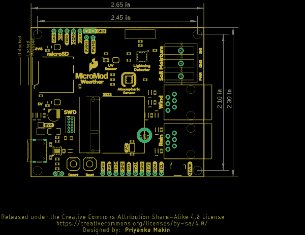](https://cdn.sparkfun.com/assets/learn_tutorials/1/1/9/3/MicroMod_Weather_CB-Dimensions.png)

## 硬件装配

现在我们已经熟悉了 Weather Carrier 板上的硬件和传感器，是时候将它与您选择的 MicroMod 处理器组装在一起，并将其连接到您的计算机上了。

### 插入您的处理器

有了 M.2 MicroMod 连接器，连接您的处理器板变得轻而易举。只需将处理器斜边连接器上的键与 M.2 连接器上的键匹配即可。以 45 度角将处理器板插入 M.2 连接器。处理器板将以如下所示的角度竖起:

[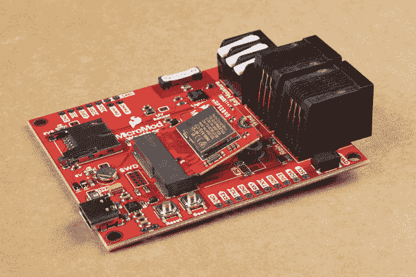](https://cdn.sparkfun.com/assets/learn_tutorials/1/4/0/1/MicroMod_nRF52840-Connected_Not_Secured.jpg)

一旦主板插入插槽，轻轻按下处理器板，抓住固定螺丝，用十字螺丝刀拧紧:

[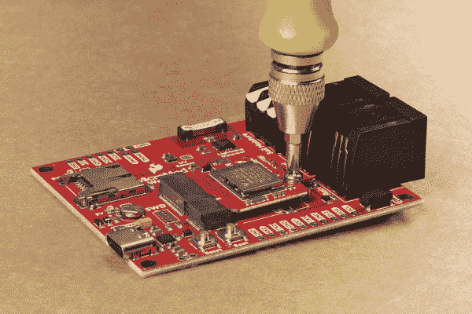](https://cdn.sparkfun.com/assets/learn_tutorials/1/4/0/1/MicroMod_nRF52840-Securing_Processor.jpg)

一旦处理器板是安全的，你组装的 MicroMod 系统应该看起来像下面的图片！

[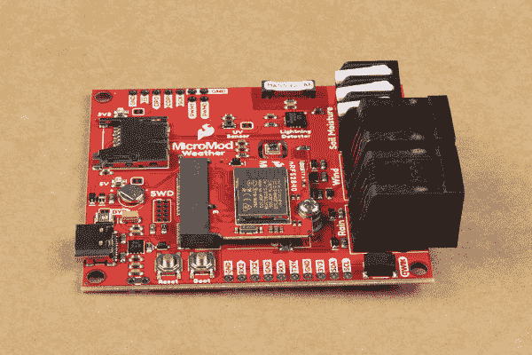](https://cdn.sparkfun.com/assets/learn_tutorials/1/4/0/1/MicroMod_nRF52840-Processor_Secured.jpg)**Note:** There is *technically* no way to insert the processor backward since the key prevents it from mating with the M.2 connector. As an extra safeguard to prevent inserting a processor improperly or with a poor connection, the mounting screw will not match up if the processor is not plugged in entirely.

### 组装外部传感器

对于使用土壤湿度传感器和/或气压计套件的用户，需要一些额外的组件。我们在这两种外设各自的连接指南中提供了详细的组装说明。您可以在这里找到它们:

[](https://learn.sparkfun.com/tutorials/soil-moisture-sensor-hookup-guide) [### 土壤湿度传感器连接指南](https://learn.sparkfun.com/tutorials/soil-moisture-sensor-hookup-guide) A quick hookup guide and project to get you started with the Soil Moisture Sensor from SparkFun.[Favorited Favorite](# "Add to favorites") 34[](https://learn.sparkfun.com/tutorials/weather-meter-hookup-guide) [### 气象计连接指南](https://learn.sparkfun.com/tutorials/weather-meter-hookup-guide) How to assemble your very own weather meter 10

一旦你的外部传感器组装好了，连接起来就是小菜一碟。要连接土壤湿度传感器，只需将三根电线插入三脚插销端子，注意信号要匹配。对于气象计，只需将风和雨信号的连接器插入气象载板上与其匹配的 RJ11 插孔即可。

### 连接一切

插入并固定好处理器后，就可以使用 USB-C 连接器将 MicroMod Weather 载板连接到计算机了。根据您选择的处理器和已经安装的驱动程序，您可能需要为您的主板安装驱动程序。有关如何安装它们的详细说明，请参阅处理器的连接指南。

[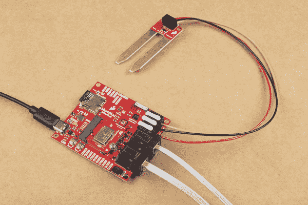](https://cdn.sparkfun.com/assets/learn_tutorials/1/1/9/3/MicroMod_Weather_CB_Assembled.jpg)

有了您的 MicroMod 天气载板、处理器板和任何外部传感器，我们现在可以上传一些代码来监控您的环境！进入下一部分，看一个测试 Weather Carrier 板所有传感器的例子。

## 气象站 Arduino 示例

**Note:**These examples assume you are using the latest version of the Arduino IDE on your desktop. If this is your first time using Arduino, please review our tutorial on [installing the Arduino IDE](https://learn.sparkfun.com/tutorials/installing-arduino-ide). If you have not previously installed an Arduino library, please check out our [installation guide](https://learn.sparkfun.com/tutorials/installing-an-arduino-library).

我们已经写了几个例子来开始使用天气预报板。它们可以在[硬件 GitHub 库](https://github.com/sparkfun/MicroMod_Weather_Carrier_Board)的“Examples”文件夹中找到，并将与您选择的任何 SparkFun MicroMod 处理器一起工作。在本节中，我们将只介绍综合气象站示例，但是您可以使用其他示例来测试 Weather Carrier 上的每个传感器以及附加的土壤湿度和气象计传感器。

**Note:** Make sure that for whichever MicroMod Processor you choose, you have the correct board definitions installed.

For this particular example, we are using the Artemis MicroMod Processor. Board definitions for this processor board can be found in the [Software Setup and Programming](https://learn.sparkfun.com/tutorials/micromod-artemis-processor-board-hookup-guide#software-setup-and-programming) section of the [Artemis MicroMod Processor Board Hookup Guide](https://learn.sparkfun.com/tutorials/micromod-artemis-processor-board-hookup-guide).

If you are using a different processor, go to our [MicroMod Processor Boards](https://www.sparkfun.com/micromod#processor_boards) landing page, find your Processor, and head on over to its tutorial for help installing your board definition.

### MicroMod 天气载板测试示例

在开始使用 Weather Carrier 板示例之前，您需要安装所选 MicroMod 处理器的板定义(如上所述)以及 [BME280](https://github.com/sparkfun/SparkFun_BME280_Arduino_Library) 、 [VEML6075](https://github.com/sparkfun/SparkFun_VEML6075_Arduino_Library) 和 [AS3935](https://github.com/sparkfun/SparkFun_AS3935_Lightning_Detector_Arduino_Library) Arduino 库。您可以使用 Arduino 库管理器并搜索' **SparkFun BME280** '、 **SparkFun VEML6075** '和' **SparkFun AS3935** '来安装它们。或者，您可以从上面链接的各自的 GitHub 库下载这些库，也可以下载。通过单击下面的按钮来压缩它们:

[SparkFun BME280 Arduino Library (ZIP)](https://github.com/sparkfun/SparkFun_BME280_Arduino_Library/archive/master.zip)[SparkFun VEML6075 Arduino Library (ZIP)](https://github.com/sparkfun/SparkFun_VEML6075_Arduino_Library/archive/master.zip)[SparkFun AS3935 Arduino Library (ZIP)](https://github.com/sparkfun/SparkFun_AS3935_Lightning_Detector_Arduino_Library/archive/master.zip)

安装了库和处理器板定义后，我们可以继续打开 MicroMod 天气示例草图，并将其上传到我们的 MicroMod 处理器。您可以打开一个新的空白草图，并从下面复制代码，或者您可以通过单击下面的按钮下载天气预报板的整个 GitHub 资源库，其中包括所有示例:

[SparkFun MicroMod Weather Carrier Board GitHub Repository (ZIP)](https://github.com/sparkfun/MicroMod_Carrier_Board-WeatherStation/archive/master.zip)

导航到存储库下载到的位置，并打开**示例**文件夹。在该文件夹中，您将找到每个传感器以及 **MM_Weather_CB_Test** 的示例。在 Arduino IDE 中打开示例或将下面代码复制到空白草图中，选择您的板和端口，然后单击“上传”。

```
language:c
/*
 * MicroMod Weather Carrier Board Example
 * 
 * This sketch tests all of the weather sensors on the carrier board:
 * atmospheric sensor - BME280, UV sensor - VEML6075, lightning detector - AS3935,
 * soil moisture sensor, wind and rain meters.
 * 
 * Priyanka Makin @ SparkX Labs
 * Original Creation Date: August 20, 2020
 * 
 * This code is Lemonadeware; if you see me (or any other SparkFun employee) at the
 * local, and you've found our code helpful, please buy us a round!
 * 
 * Hardware Connections:
 * Insert MicroMod Processor Board of your choice into the M.2 connector of the SparkFun Weather carrier
 *  Screw into place
 * Connect Weather carrier board to power useing USB-C cable
 * Connect SparkFun Soil Moisture Sensor to Weather carrier using latching terminals
 * Connect both wind and rain meters to Weather carrier using the RJ11 connectors
 */

#include <Wire.h>
#include <SPI.h>
#include "SparkFunBME280.h"
#include <SparkFun_VEML6075_Arduino_Library.h>
#include "SparkFun_AS3935.h"

BME280 tempSensor;
VEML6075 uv;
SparkFun_AS3935 lightning;

#define INDOOR 0x12 
#define OUTDOOR 0xE
#define LIGHTNING_INT 0x08
#define DISTURBER_INT 0x04
#define NOISE_INT 0x01

#if defined(ESP_PLATFORM)
int LED_BUILTIN = 5;
//int A0 = 34;
int G0 = 4;
int D0 = 23;
//int A1 = 35;
int D1 = 27;
const int G3 = 17;
int G1 = 12;
#elif defined(ARDUINO_ARCH_SAMD)
int G0 = 2;
int D0 = 0;
int D1 = 1;
//const int lightningInt = G3;  //SPI does not currently work on the SAMD51 proto
//int spiCS = G1;
#endif

int soilPin = A0;  //Pin number that measures analog moisture signal
int soilPower = G0;  //Pin number that will power the soil moisture sensor
int WSPEED = D0; //Digital I/O pin for wind speed
int WDIR = A1; //Analog pin for wind direction
int RAIN = D1;   //Digital I/O pin for rain fall
const int lightningInt = G3; // Interrupt pin for lightning detection
int spiCS = G1; //SPI chip select pin

volatile bool rainFlag = false;
volatile bool windFlag = false;

//Function is called every time the rain bucket tips
void rainIRQ()
{
  rainFlag = true;
}

//Function is called when the magnet in the anemometer is activated
void wspeedIRQ()
{
  windFlag = true;
}

// This variable holds the number representing the lightning or non-lightning
// event issued by the lightning detector. 
int intVal = 0;
int noise = 2; // Value between 1-7 
int disturber = 2; // Value between 1-10

void setup() {
  Serial.begin(115200);
  while (!Serial);

  Serial.println("MicroMod Weather Carrier Board Test");
  Serial.println();

  Wire.begin();
  SPI.begin();

  if (tempSensor.beginI2C() == false) { //Begin communication over I2C
    Serial.println("BME280 did not respond.");
    while(1); //Freeze
  }
  if (uv.begin() == false) {
    Serial.println("VEML6075 did not respond.");
    while(1);
  }

  pinMode(LED_BUILTIN, OUTPUT);
  pinMode(soilPower, OUTPUT);
  digitalWrite(soilPower, LOW);
  // When lightning is detected the interrupt pin goes HIGH.
  pinMode(lightningInt, INPUT);

  //Initialization for weather meter
  pinMode(WSPEED, INPUT_PULLUP);  //Input from wind meters windspeed sensor
  pinMode(RAIN, INPUT_PULLUP);    //Input from wind meters rain gauge sensor
  //attach external interrupt pins to IRQ functions
  attachInterrupt(digitalPinToInterrupt(RAIN), rainIRQ, FALLING);
  attachInterrupt(digitalPinToInterrupt(WSPEED), wspeedIRQ, FALLING);
  //turn on interrupts
  interrupts();

  if(lightning.beginSPI(spiCS, 2000000) == false){ 
    Serial.println ("Lightning Detector did not start up, freezing!"); 
    while(1); 
  }
  else
    Serial.println("Schmow-ZoW, Lightning Detector Ready!");

  // The lightning detector defaults to an indoor setting at 
  // the cost of less sensitivity, if you plan on using this outdoors 
  // uncomment the following line:
  lightning.setIndoorOutdoor(OUTDOOR); 
}

// the loop function runs over and over again forever
void loop() {
  digitalWrite(LED_BUILTIN, HIGH);   // turn the LED on (HIGH is the voltage level)

  Serial.println();
  Serial.print("Temperature: ");
  Serial.println(tempSensor.readTempF(), 2);
  Serial.print("Humidity: ");
  Serial.println(tempSensor.readFloatHumidity(), 0);
  Serial.print("Pressure: ");
  Serial.println(tempSensor.readFloatPressure(), 0);
  Serial.print("Altitude: ");
  Serial.println(tempSensor.readFloatAltitudeFeet(), 1);

  Serial.print("UV A, B, index: ");
  Serial.println(String(uv.uva()) + ", " + String(uv.uvb()) + ", "+ String(uv.index()));

  Serial.print("Soil Moisture = ");
  Serial.println(readSoil());

  Serial.print("Wind direction: ");
  Serial.print(getWindDirection());
  Serial.println(" degrees");
  //Check interrupt flags
  if (rainFlag == true){
    Serial.println("Rain click!");
    rainFlag = false;
  }
  if (windFlag == true){
    Serial.println("Wind click!");
    windFlag = false;
  }

  // Hardware has alerted us to an event, now we read the interrupt register
  if(digitalRead(lightningInt) == HIGH){
    intVal = lightning.readInterruptReg();
    if(intVal == NOISE_INT){
      Serial.println("Noise."); 
      // Too much noise? Uncomment the code below, a higher number means better
      // noise rejection.
      //lightning.setNoiseLevel(noise); 
    }
    else if(intVal == DISTURBER_INT){
      Serial.println("Disturber."); 
      // Too many disturbers? Uncomment the code below, a higher number means better
      // disturber rejection.
      //lightning.watchdogThreshold(disturber);  
    }
    else if(intVal == LIGHTNING_INT){
      Serial.println("Lightning Strike Detected!"); 
      // Lightning! Now how far away is it? Distance estimation takes into
      // account any previously seen events in the last 15 seconds. 
      byte distance = lightning.distanceToStorm(); 
      Serial.print("Approximately: "); 
      Serial.print(distance); 
      Serial.println("km away!"); 
    }
  }

  digitalWrite(LED_BUILTIN, LOW);    // turn the LED off by making the voltage LOW

  delay(3000);
}

int readSoil() {
  int moistVal = 0;  //Variable for storing moisture value
  //Power Senor
  digitalWrite(soilPower, HIGH);
  delay(10);
  moistVal = analogRead(soilPin);  //Read the SIG value from sensor
  digitalWrite(soilPower, LOW); //Turn the sensor off
  return moistVal; //Return current moisture value
}

int getWindDirection()
{
  unsigned int adc;
  adc = analogRead(WDIR); //get the current readings from the sensor

  if (adc < 380) return (113);
  if (adc < 393) return (68);
  if (adc < 414) return (90);
  if (adc < 456) return (158);
  if (adc < 508) return (135);
  if (adc < 551) return (203);
  if (adc < 615) return (180);
  if (adc < 680) return (23);
  if (adc < 746) return (45);
  if (adc < 801) return (248);
  if (adc < 833) return (225);
  if (adc < 878) return (338);
  if (adc < 913) return (0);
  if (adc < 940) return (293);
  if (adc < 967) return (315);
  if (adc < 990) return (270);
  return (-1);
} 
```

该代码首先检查在 Arduino 中选择了哪个 MicroMod 处理器，并相应地调整一些引脚设置，以便它可以与任何 SparkFun MicroMod 处理器一起工作。接下来，它初始化所有车载传感器，检查是否有正确的响应，并检查外部传感器(风、雨和土壤)。

一旦所有传感器初始化，代码打印出每个传感器的数据。打开你的[串行监视器](https://learn.sparkfun.com/tutorials/terminal-basics)并将波特率设置为 **115200** 以观看数据打印输出。

## 资源和更进一步

有关 MicroMod 天气载板的更多信息，请查看以下链接:

*   [老鹰文件(ZIP)](https://cdn.sparkfun.com/assets/8/b/9/7/6/MicroMod_Weather_Carrier.zip)
*   [示意图(PDF)](https://cdn.sparkfun.com/assets/6/c/2/e/2/MicroMod_Weather_CB-Schematic.pdf)
*   [尺寸图(PNG)](https://cdn.sparkfun.com/assets/learn_tutorials/1/1/9/3/MicroMod_Weather_CB-Dimensions.png)
*   [GitHub 硬件库](https://github.com/sparkfun/MicroMod_Weather_Carrier_Board)
*   [BME280 Arduino 库](https://github.com/sparkfun/SparkFun_BME280_Arduino_Library)
*   [BME280 数据表(PDF)](https://cdn.sparkfun.com/assets/e/7/3/b/1/BME280_Datasheet.pdf)
*   [VEML6075 Arduino 库](https://github.com/sparkfun/SparkFun_VEML6075_Arduino_Library)
*   [VEML6075 数据手册(PDF)](https://cdn.sparkfun.com/assets/3/c/3/2/f/veml6075.pdf)
*   [AS3935 Arduino 库](https://github.com/sparkfun/SparkFun_AS3935_Lightning_Detector_Library)
*   [AS3935 数据表(PDF)](https://cdn.sparkfun.com/assets/learn_tutorials/9/2/1/AS3935_Datasheet_EN_v2.pdf)

有关 SparkFun MicroMod 生态系统的更多信息，请查看以下链接:

*   [MicroMod 登陆页面](https://www.sparkfun.com/micromod)
*   [micro mod 入门](https://learn.sparkfun.com/tutorials/getting-started-with-micromod)
*   [用微模块设计](https://learn.sparkfun.com/tutorials/designing-with-micromod)

使用你的气象站载体寻找一些项目灵感？下面的教程可以帮你入门！

[](https://learn.sparkfun.com/tutorials/creating-a-humidor-control-box) [### 创建一个保湿盒控制盒](https://learn.sparkfun.com/tutorials/creating-a-humidor-control-box) Because some of our boards need to be re-humidified after reflow, we decided to make our own humidor. This tutorial will focus on how to model a project in 3D and then fabricate it using a CNC routing machine.[Favorited Favorite](# "Add to favorites") 5[](https://learn.sparkfun.com/tutorials/mpl3115a2-pressure-sensor-hookup-guide) [### MPL3115A2 压力传感器连接指南](https://learn.sparkfun.com/tutorials/mpl3115a2-pressure-sensor-hookup-guide) Getting started with the MPL3115A2 Pressure Sensor.[Favorited Favorite](# "Add to favorites") 5[](https://learn.sparkfun.com/tutorials/qwiic-pressure-sensor-bmp384-hookup-guide) [### Qwiic 压力传感器(BMP384)连接指南](https://learn.sparkfun.com/tutorials/qwiic-pressure-sensor-bmp384-hookup-guide) Get started with the SparkFun Pressure Sensor - BMP384 (Qwiic) following this guide.[Favorited Favorite](# "Add to favorites") 0[](https://learn.sparkfun.com/tutorials/qwiic-pressure-sensor-bmp581-hookup-guide) [### Qwiic 压力传感器(BMP581)连接指南](https://learn.sparkfun.com/tutorials/qwiic-pressure-sensor-bmp581-hookup-guide) Get started with the SparkFun Pressure Sensor - BMP581 (Qwiic) following this Hookup Guide[Favorited Favorite](# "Add to favorites") 0**************************