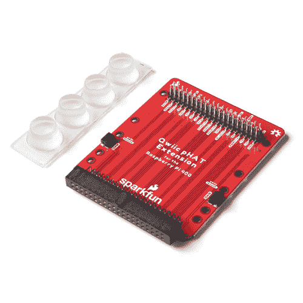

# 用于 Raspberry Pi 400 连接指南的 Qwiic pHAT 扩展

> 原文：<https://learn.sparkfun.com/tutorials/qwiic-phat-extension-for-raspberry-pi-400-hookup-guide>

## 介绍

用于 Raspberry Pi 400 的 [SparkFun Qwiic pHAT 扩展是一种快速简单的解决方案，可用于访问 GPIO、将您最喜欢的 pHAT 正面向上堆叠，或将支持 Qwiic 的设备连接到 I ² C 总线(GND、3.3V、SDA 和 SCL)。](https://www.sparkfun.com/products/17512)

 

将**添加到您的[购物车](https://www.sparkfun.com/cart)中！**

### [树莓 Pi 400 的 SparkFun Qwiic pHAT 扩展](https://www.sparkfun.com/products/17512)

[In stock](https://learn.sparkfun.com/static/bubbles/ "in stock") DEV-17512

RPi400 的 Qwiic pHAT 扩展为您提供了一种访问所有 GPIO、将您最喜爱的帽子竖直堆叠或…

$5.50[Favorited Favorite](# "Add to favorites") 14[Wish List](# "Add to wish list")** **[https://www.youtube.com/embed/EjGmLbmaQeM/?autohide=1&border=0&wmode=opaque&enablejsapi=1](https://www.youtube.com/embed/EjGmLbmaQeM/?autohide=1&border=0&wmode=opaque&enablejsapi=1)

### 所需材料

要跟随本教程，您将需要以下材料。你可能不需要所有的东西，这取决于你拥有什么。将它添加到您的购物车，通读指南，并根据需要调整购物车。

**Note:** Below is a wishlist with the minimum parts to get started. You'll still a monitor/tv with HDMI input.**