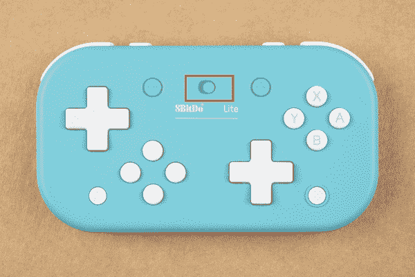

# 8BitDo 蓝牙游戏手柄入门

> 原文：<https://learn.sparkfun.com/tutorials/getting-started-with-the-8bitdo-bluetooth-gamepads>

## 介绍

这份工作最大的好处之一就是我可以接触到所有的新产品。如果你家里有游戏玩家，听好了。来自 8BitDo 的 [SN30 Pro 蓝牙游戏手柄](https://www.sparkfun.com/products/17264)和 [Lite 蓝牙游戏手柄](https://www.sparkfun.com/products/17266)(也有[黄色](https://www.sparkfun.com/products/17265))真的很酷。他们的售后市场游戏控制器可以在各种平台上工作，包括 Switch、Windows、Linux、Raspberry Pi，甚至可能在 iOS 上工作。我们去看看！

 

将**添加到您的[购物车](https://www.sparkfun.com/cart)中！**

### [8BitDo Lite 蓝牙游戏手柄-蓝色](https://www.sparkfun.com/products/17266)

[In stock](https://learn.sparkfun.com/static/bubbles/ "in stock") WIG-17266

blue 8BitDo Lite 蓝牙游戏手柄是一款专为 2D 游戏等制作的超便携控制器。

$24.95 $23.70[Favorited Favorite](# "Add to favorites") 5[Wish List](# "Add to wish list")**** 

将**添加到您的[购物车](https://www.sparkfun.com/cart)中！**

### [8BitDo Lite 蓝牙游戏手柄-黄色](https://www.sparkfun.com/products/17265)

[In stock](https://learn.sparkfun.com/static/bubbles/ "in stock") WIG-17265

黄色 8BitDo Lite 蓝牙游戏手柄是一款专为 2D 游戏及更多游戏设计的超便携控制器。

$24.95 $23.70[Favorited Favorite](# "Add to favorites") 2[Wish List](# "Add to wish list")**** 

将**添加到您的[购物车](https://www.sparkfun.com/cart)中！**

### [8BitDo SN30 Pro 蓝牙游戏手柄](https://www.sparkfun.com/products/17264)

[In stock](https://learn.sparkfun.com/static/bubbles/ "in stock") WIG-17264

8BitDo SN30 Pro 蓝牙游戏手柄是世界上第一个功能齐全的复古控制器。

$44.95 $42.701[Favorited Favorite](# "Add to favorites") 8[Wish List](# "Add to wish list")****** ******### 推荐阅读

 [### MetaWatch 拆卸和 Arduino 连接](https://learn.sparkfun.com/tutorials/metawatch-teardown-and-arduino-hookup) Tearing down the nifty Bluetooth-enabled MetaWatch. Then building an Arduino sketch to control it.[Favorited Favorite](# "Add to favorites") 4 [### 蓝牙基础知识](https://learn.sparkfun.com/tutorials/bluetooth-basics) An overview of the Bluetooth wireless technology.[Favorited Favorite](# "Add to favorites") 42 [### 物联网的连通性](https://learn.sparkfun.com/tutorials/connectivity-of-the-internet-of-things) An overview of the different protocols that can be used for the development of Internet of Things (IoT)-based projects.[Favorited Favorite](# "Add to favorites") 26

## Lite 硬件概述

8BitDo 的 Lite 控制器是一个 D-pad 盛会。谁需要额外的数字键盘？我是说，谁不是呢？他们确实有操纵杆的“按钮”功能，但你必须同时按下所有四个方向按钮，这是命中或错过。也就是说，这个控制器非常适合我的孩子——它非常低，所以它更适合他们的小手，因此他们更容易操纵。让我们来看看一些规格:

*   **兼容性:**视窗、蒸汽、开关
*   **尺寸/重量:**120*66.2*16.2 毫米/84 克
*   **特殊功能:**
    *   双 D 型焊盘
    *   方式开关
    *   可定制的 turbo 功能(X 输入)
*   **连通性:**
    *   无线蓝牙
    *   USB-C
*   **电池类型/电池寿命:**
    *   480 毫安时锂电池，可充电
    *   18 小时游戏时间，1-2 小时充电时间
*   **包括:**
    *   8BitDo Lite 蓝牙游戏手柄
    *   usb 电缆
    *   工艺规范

### 电池和充电

Lite 控制器配有标准的 USB-C 电缆，充电需要几个小时。8BitDo 的文档声称一次充电可以玩 18 个小时，虽然我没有做过任何实际的基准测试，但我会说我的孩子已经在这上面玩了一个星期了，我还没有需要充电。所以不算太寒酸。

### 骗局

所有这些低姿态和便携性都是有代价的。8BitDo Lite 控制器没有加速度计或隆隆声功能，也没有 NFC 读卡器。但是！如果你是一个喜欢老式塞尔达，马里奥等复古游戏玩家，这是你的控制器。

## 精简硬件配对

### 转换

8BitDo Lite 旨在与任天堂 Switch Lite 配合使用。事实上，这些控制器的颜色与 Switch Lite 的黄色和蓝绿色版本相匹配。如果你的颜色不协调，你还玩游戏吗，兄弟？

让我们配对。在主屏幕上，导航至“控制器”。

选择更改夹点/顺序:

您将看到以下屏幕:

确保 S/X 按钮移动到“S”位置，如下所示:

然后按下主屏幕按钮来打开控制器:

在控制器的底部，您会看到 led 亮起。一旦 led 亮起，按住控制器顶部的**配对**按钮 3 秒钟，进入配对模式。

配对时，指示灯会来回运行。配对完成后，一个 LED 将会亮起，您将会看到以下屏幕:

WOO 游戏！

### Windows 操作系统

要将 8BitDo Lite 控制器与 Windows 配对，请从 Windows“开始”菜单导航到蓝牙设置。

点击添加蓝牙或其他设备:

在此对话框中，选择蓝牙:

确保 8BitDo Lite 控制器上的选择开关设置为“X”。

按下 Lite 控制器上的主页按钮:

Lite 控制器底部的 led 将会亮起。一旦你看到这个，按下 Lite 控制器顶部的“配对”按钮。

在 Windows 中，您应该会看到 8BitDo Lite 出现。继续点击它。

配对后，游戏开始。

*WOOOOOO*

## SN30 Pro 硬件概述

有漂移吗？8BitDo SN30 Pro 控制器游戏手柄本质上是任天堂 Switch 的专业控制器。与其出去买一个新的 joycon，不如随便挑一个坏小子。让我们看看所有的功能！

*   **兼容性:** Windows，Android，macOS，Steam，Switch，树莓派
*   **控制器模式:** X 输入，D 输入，Mac 模式，开关模式
*   **特殊功能:**
    *   隆隆振动
    *   运动控制
    *   涡轮功能
    *   USB-C
*   **尺寸/重量:**144*63.5*33 毫米/114 克
*   **连通性:**
    *   无线蓝牙 4.0
    *   USB-C
*   **包括:**
    *   SN30 Pro G Classic
    *   USB-C 电缆
    *   工艺规范

### 电池和充电

像所有 8BitDo 的控制器一样，这款控制器使用通用 USB-C，几个小时就能充满电。8BitDo 提到一次充电可以玩 16 个小时，但我没有测试过。哦...我现在就去做。马上回来...

## SN30 Pro 硬件配对

### 转换

像它的 Lite 弟兄一样，8BitDo SN30 Pro 旨在与任天堂 Switch 系统配合使用。同样，配对过程也相当简单。

在主屏幕上，导航至“控制器”。

选择更改夹点/顺序，如下所示:

在 SN30 Pro 控制器上，同时按下 **Y** 和**启动**。

一旦 led 亮起，按住控制器顶部的**配对**按钮 3 秒钟，进入配对模式。

配对时，指示灯会来回运行。配对完成后，LED 将会亮起。

游戏时间！

如果你习惯了任天堂 Switch 专业无线控制器，SN30 专业需要一分钟来适应。也就是说，所有的功能都在，而且价格也很合理。

### Windows 操作系统

有温道兹·加梅兹吗？让我们配对。

进入开始菜单，导航到你的“蓝牙”对话框。

一旦你的蓝牙对话框打开，点击添加蓝牙或其他设备。

选择您的蓝牙类型(顶部选项):

在 SN30 Pro 控制器上，同时按下 **X** 和**启动**

一旦 led 亮起，按住控制器顶部的**配对**按钮 3 秒钟，进入配对模式。

在 Windows 中，您应该会看到 8BitDo 出现。继续点击它。

配对时，指示灯会来回运行。配对完成后，LED 将会亮起。

游戏开始。

### 树莓派

本教程的目的不是让你建立一个复古游戏系统。如果你还没有开始运行，RetroPie 的第一个安装网页上的文档是一个很好的开始。

以下是我在这里用过的所有物品:******