# 用 MicroMod 设计

> 原文：<https://learn.sparkfun.com/tutorials/designing-with-micromod>

## 介绍

本教程将带您了解 MicroMod 处理器和载板的规格，以及将 MicroMod 外形融入您自己的 PCB 设计的基础知识！

| [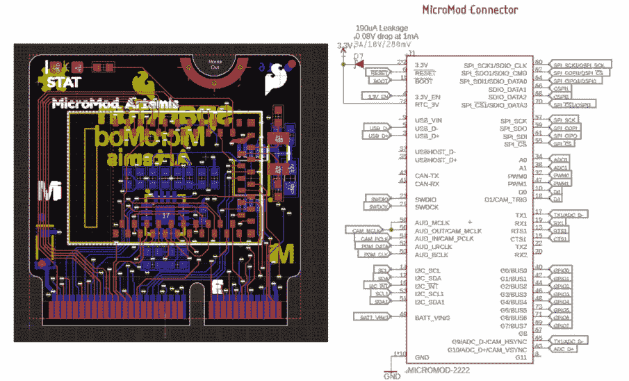](https://cdn.sparkfun.com/assets/learn_tutorials/1/2/0/6/MicroMod_Edge_Connector_and_Symbol_Artemis.jpg) | [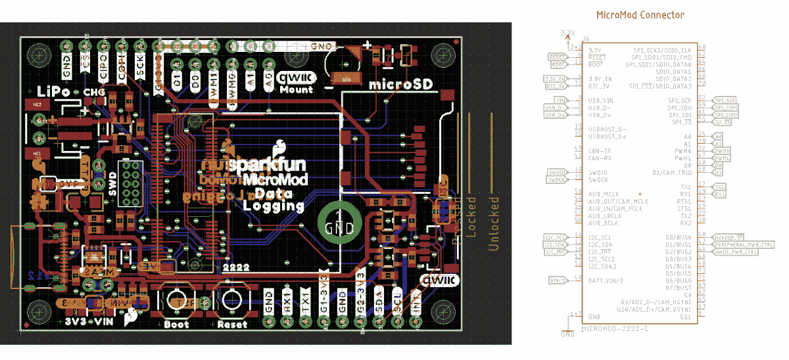](https://cdn.sparkfun.com/assets/learn_tutorials/1/1/8/9/SparkFun_MicroMod_Carrier_Board_Connector_and_Symbol.jpg) |

*The MicroMod board edge connector and the MicroMod carrier board connector*

### 推荐阅读

如果您不熟悉以下概念，我们建议您在继续之前查看这些教程。

[](https://learn.sparkfun.com/tutorials/pcb-basics) [### PCB 基础知识](https://learn.sparkfun.com/tutorials/pcb-basics) What exactly IS a PCB? This tutorial will breakdown what makes up a PCB and some of the common terms used in the PCB world.[Favorited Favorite](# "Add to favorites") 50[](https://learn.sparkfun.com/tutorials/using-eagle-board-layout) [### 使用 EAGLE:纸板布局](https://learn.sparkfun.com/tutorials/using-eagle-board-layout) Part 2 of the Using Eagle tutorials, this one covers how to lay out a board after designing a schematic.[Favorited Favorite](# "Add to favorites") 37[](https://learn.sparkfun.com/tutorials/getting-started-with-micromod) [### MicroMod 入门](https://learn.sparkfun.com/tutorials/getting-started-with-micromod) Dive into the world of MicroMod - a compact interface to connect a microcontroller to various peripherals via the M.2 Connector 3

## 如何设计 MicroMod 处理器板

我们将从一个已知良好的开发板开始，而不是从头开始。在这种情况下，我们将从开发板开始，将其转换为 MicroMod 处理器板(PB)。

### 图解的

从一个已知良好的开发板产品开始，例如 [SAMD51 和](https://www.sparkfun.com/products/14713)，并从 EAGLE 设计中删除[原理图](https://github.com/sparkfun/SAMD51_Thing_Plus/tree/master/Hardware)中不需要的所有部分:

*   USB 连接器
*   Qwiic 连接器
*   JST 连接器
*   僵局
*   头球
*   功率调节
*   重置按钮
*   丝绸
*   TX/RX led
*   电池充电

保留任何所需的外部电路，例如:

*   退耦
*   ADC 放大
*   用于 RTC 主时钟的晶体
*   支持 Python 脚本加载的外部存储器
*   1 个状态 LED(通常连接到 LED_BUILTIN)
*   USB 到串行转换 IC 和电路

仅通过 USB +/-保存设备编程所需的任何内容。这意味着您可能需要为没有内置 USB 外设的设备配备 USB 转串行 IC(建议使用 [CH340E](https://www.sparkfun.com/products/16278) )。保留任何引导控制电路(Artemis 和 ESP32 具有需要由 RTS/DTR 控制的引导引脚)。

移除将被重新定位到载板的所有 LED 指示灯。这包括发送/接收指示灯、电源指示灯、充电指示灯等。例外情况是，每个处理器板都应包括一个状态 LED，该 LED 与未连接到板边缘的引脚相连。这使得用户能够立即测试他们的处理器板，而不知道载板的能力。

查看使用该处理器的总体设计是否有任何变化或改进。举个假设的例子，用户可能会在 SAMD51 板上安装 32mbit 闪存，而不是老式的 16m 闪存。将这些改进融入设计中。

现在，您有机会清理处理器的原理图元件。将重复的 GND 管脚、VDDIO 管脚等组合成原理图元件上的单个管脚。

[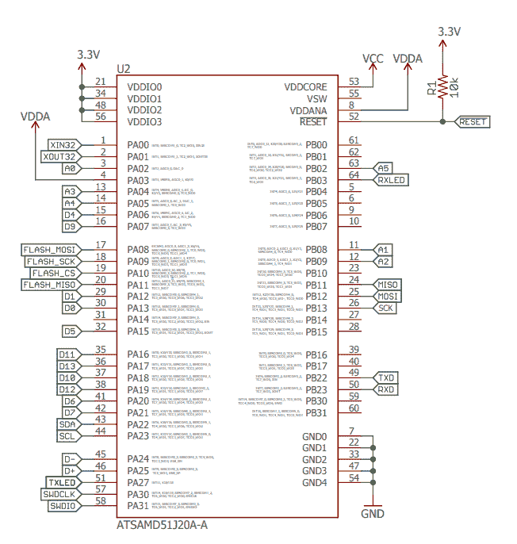](https://cdn.sparkfun.com/assets/learn_tutorials/1/2/0/6/MicroMod-Eagle-Schematic-Symbol_SAMD51.png)

从 [SparkFun Eagle 库](https://github.com/sparkfun/SparkFun-Eagle-Libraries)中拉出 MicroMod 卡边缘连接器。你会在“SparkFun-MicroMod”下找到它。

[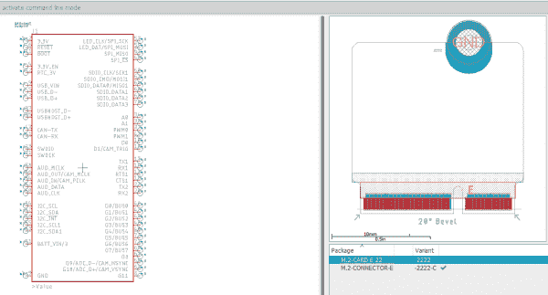](https://cdn.sparkfun.com/assets/learn_tutorials/1/2/0/6/MicroMod-Eagle-Schematic-Symbol_Card_Edge_Connector.png)[GitHub: SparkFun Eagle Library](https://github.com/sparkfun/SparkFun-Eagle-Libraries)

在原理图中，开始将微控制器上的各种专用硬件引脚连接到 MM 卡边缘。例如，在 SAMD51 上:

*   将处理器上的 USB +/-连接到毫米边缘连接器上的 USB +/-上
*   SAMD51 上的主 I2C 引脚连接到 MM 上的主 I2C 引脚
*   闪光灯引脚连接到板载闪光灯(无移动)
*   SPI 引脚连接到 MM 上的主 SPI 引脚
*   TX/RX 转到 MM 上的 TX1/RX1
*   RX LED、TX LED 连接被完全移除
*   MM 上的 reset 引脚被定义为输出开漏。CB 将有一个复位按钮。因此，务必保持 PB 上的上拉复位。
*   这个处理器需要特殊的启动引脚控制吗？Boot 引脚为开漏输入。载板可以有一个“启动”按钮，将此引脚拉低。如果需要，反转该信号和/或根据需要添加电路以与该处理器一起工作。
*   这款处理器支持 SWD 吗？根据需要连接 SWDIO 和 SWCK。
*   该处理器具有差分 ADC 功能吗？如果是，将差分 ADC 引脚连接到 ADC+/- (G9/10)。
*   该处理器上有支持 I2S、PDM、CAN 或 USB 主机的引脚吗？*确保连接这些接口，并使其优先于一般 ADC、PWM、GPIO 连接。
*   将一个支持 ADC 的引脚专用于 BATT_VIN/3。此引脚将通过位于 CB 上的⅓分压器读取 VIN 电压。
*   将一个 GPIO 专用于 3.3V_EN。这允许 PB 关闭 CB 上的主电压调节器。这是一个需要思考的冒险想法。只有能够从 RTC /低功耗备用电池中睡眠和唤醒的处理器才能关闭主 CB 电压调节器。
*   将 edge 连接器上 RTC_3V 的任何电源连接到处理器上需要纽扣电池或微型电池供电来运行 RTC 的任何引脚。
*   该处理器支持时钟输出或特殊时钟生成引脚(输出)吗？如果是，连接到 AUD_OUT/CAM_MCLK 引脚。

现在是做出一些架构决策的时候了:

*   SAMD51 上是否有其他外设可以暴露在卡边缘？例如，SAMDs 有[个灵活的 SERCOM 端口](https://learn.sparkfun.com/tutorials/adding-more-sercom-ports-for-samd-boards/all)。我们是否应该将一些未使用的 IO 专用于第二个 SPI 端口？第二 UART？第二个 I2C？
*   一旦完成专用硬件的设计和连接，就可以找到纯模拟引脚。将这些连接到 A0 和 A1。
*   接下来，找到完全支持 PWM 的引脚。将它们连接到 PWM0 和 PWM1。
*   接下来，找到完全支持 GPIO 的引脚(无 ADC 或 PWM)。把这些连接到 D0 和 D1。
*   接下来，找到支持总线的引脚，也就是“快速写入”的引脚。例如，PB00 至 PB07 可以通过单个寄存器读/写来访问。
*   任何剩余的引脚都应分配给 Gx，ADC + PWM 引脚优先(0、1、2 等)分配。目的是保证这些特定引脚(A0、D1、PWM1 等)的 PWM、ADC 和数字引脚功能。而 Gx 引脚不保证 ADC/PWM 功能。
*   任何剩余的 GPIO 都可以路由到未使用的辅助接口。例如，如果 SAMD51 没有第二个 I2C 端口，那么这些引脚可以连接到 GPIO。

### 天线

处理器板应包括任何迹线或芯片天线，以支持处理器的功能。如果应用程序有意义，请添加一个 U.FL 连接器。

### SDIO 和 SPI1 引脚

如果你的处理器支持 SDIO，把它连接到 SDIO 针上。如果 SPI1 引脚不同于 SDIO 引脚，则考虑将两个信号连接在一起。例如，在 Artemis(如下所示)上，MOSI0 引脚(引脚 D6)被用作 SPI1 的一部分。D22 引脚是 SDIO _ 数据 0。通过将 ISO0 和 D22 连接到 MicroMod 连接器上的 SDIO _ 数据 0，用户可以使用 SDIO 或 SPI(单引脚 D6/D22 为高阻抗)。真正的好处是，用户可以将完整的 SDIO 接口/引脚布线到载板上的 microSD 插座。如果 MicroMod 处理器板没有 SDIO 库支持(大多数都没有),那么用户可以使用 SPI 与 microSD 卡对话(几乎所有平台都支持这一点)

SDIO _ 数据 0 连接到两个引脚的 Artemis。

[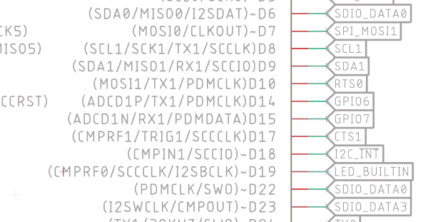](https://cdn.sparkfun.com/assets/learn_tutorials/1/2/0/6/MicroMod-Eagle-Schematic-Symbol_SDIO_Pins.png)

载板上的 MicroSD 插座，支持 SDIO 和 SPI。

[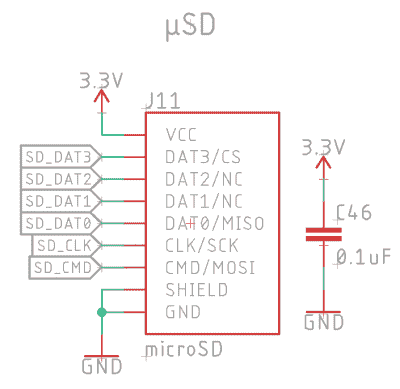](https://cdn.sparkfun.com/assets/learn_tutorials/1/2/0/6/MicroMod-Eagle-Schematic-Symbol-SDIO_SPI_Pins.png)

### 按指定路线发送

MicroMod PBs 是 4 层板，0.8 毫米厚，ENIG 抛光(用于金手指)，具有 20°边缘斜面。

| [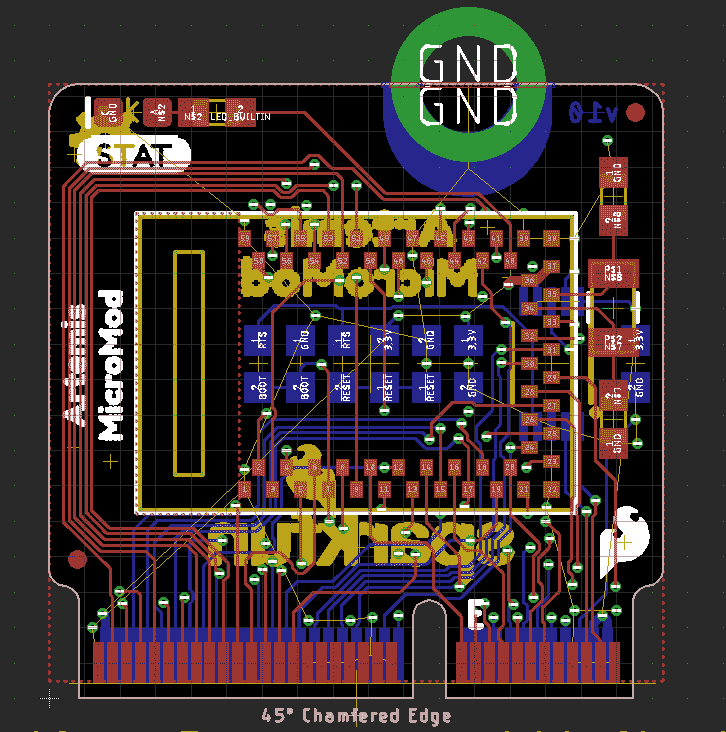](https://cdn.sparkfun.com/assets/learn_tutorials/1/2/0/6/MicroMod-Eagle-Board_Routing_1.png) | [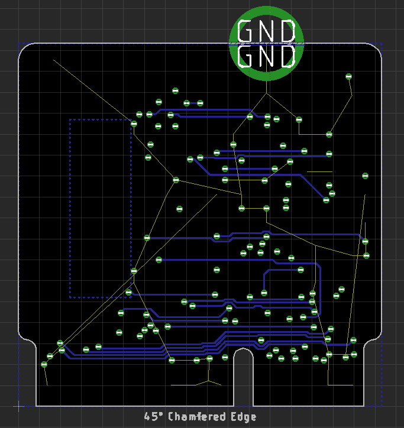](https://cdn.sparkfun.com/assets/learn_tutorials/1/2/0/6/MicroMod-Eagle-Board_Routing_2.png) | [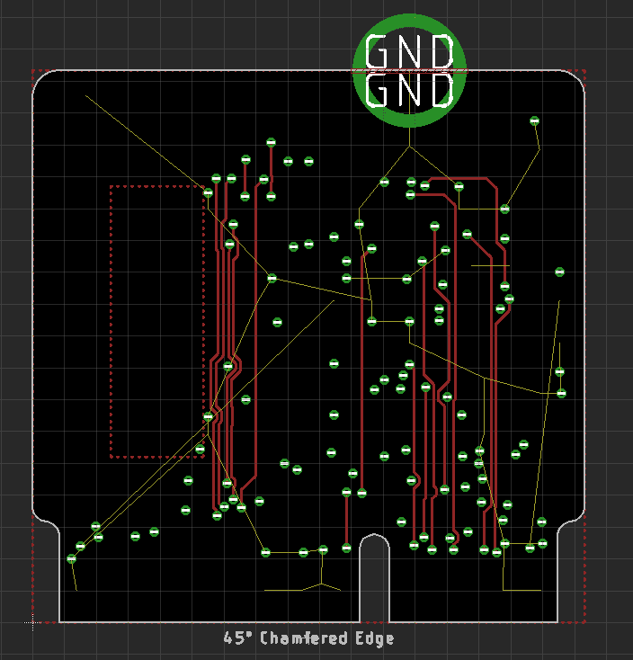](https://cdn.sparkfun.com/assets/learn_tutorials/1/2/0/6/MicroMod-Eagle-Board_Routing_3.png) |
|  |  |  |

*   将元件放置在电路板的两侧。
*   一般来说，主处理器位于“前端”。这是面向用户的一面。

#### 状态指示灯

将“STAT”LED 置于左上角或右上角。如果不可能，放在上边缘附近。

[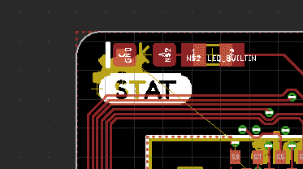](https://cdn.sparkfun.com/assets/learn_tutorials/1/2/0/6/MicroMod-Eagle-Board_LED.png)

#### M.2 边缘连接器规格的遮挡层

注意 PB 边缘附近的顶部和底部禁止区域。这些是 M.2 规范的一部分，与卡边缘如何与连接器交互有关。

[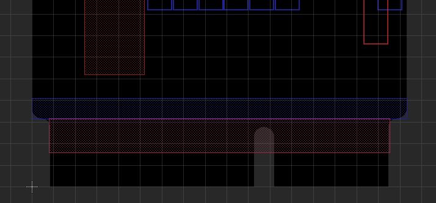](https://cdn.sparkfun.com/assets/learn_tutorials/1/2/0/6/MicroMod-Eagle-Board_Keep_Out_Layer.png)

#### Eagle 图层设置命令和热键

使用以下命令为四层设置 Eagle:

```
Set Used_Layers 1 2 15 16 17 18 19 20 21 22 23 24 25 26 27 28 29 30 31 32 33 34 35 36 37 38 39 40 41 42 43 44 45 46 47 48 49 50 51 52 91 92 93 94 95 96; 
```

如果你需要，这是如何回到 2 层:

```
Set Used_Layers 1 16 17 18 19 20 21 22 23 24 25 26 27 28 29 30 31 32 33 34 35 36 37 38 39 40 41 42 43 44 45 46 47 48 49 50 51 52 91 92 93 94 95 96; 
```

我已经编辑了我的 **eagle.scr** 可以自行快速查看内部图层。这在布线过程中很有帮助。

```
#Used for four layer routing
DISPLAY = VerticalOnly 15 17 18 19 20;
DISPLAY = HorizontalOnly 2 17 18 19 20;
Assign A+0 'display none; display VerticalOnly;'
Assign A+9 'display none; display HorizontalOnly;' 
```

这将设置一个仅查看第 15 层(上面红色显示的垂直路线)的`Alt` + `0`热键和仅查看第 2 层(上面蓝色显示的水平路线)的`Alt` + `9`热键。如果人们喜欢或者有更好的推荐，我们可以将此添加到 Eagle settings repo 中。

#### 迹线宽度、迹线间距、钻孔命中

路由处理器板是棘手的。这是没有办法的。幸运的是，我们可以使用一些非常严格的公差。使用间距为 0.0045 英寸的 0.004 英寸走线。使用 0.2 毫米的钻头。在第 15 层垂直布线，在第 2 层水平布线。这将减少高速信号中的串扰。允许小至 3.5 密耳且具有 3.5 密耳空间的迹线，并且基本上是自由的。但是走得这么小增加了串扰的机会，所以要小心。

建议将第 2 层用作接地，第 15 层用作 3.3V，这将有助于具有微带 RF 走线的 PBs，这种走线需要靠近接地层，以最大限度地减小 50 欧姆走线的宽度。

#### 微波传输带

你的 PB 有微带吗？参见 [Qwiic-GPS-RTK2 硬件报告](https://github.com/sparkfun/Qwiic_GPS-RTK2)了解 4 层微带的示例以及 JLCPCB 用于 er 和层堆叠的设置。注:RTK2 是 1.6 毫米厚的板，PBs 是 0.8 毫米，因此根据需要调整数字。

[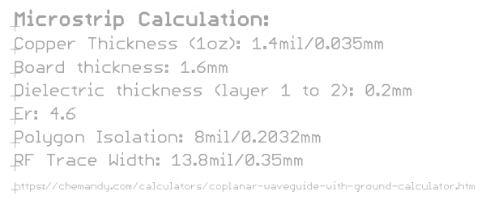](https://cdn.sparkfun.com/assets/learn_tutorials/1/2/0/6/MicroMod-Eagle-Board_Microstrip_Calculations.png)

称这个设备为“ **MicroMod Blarg** ”，而不是相反。

[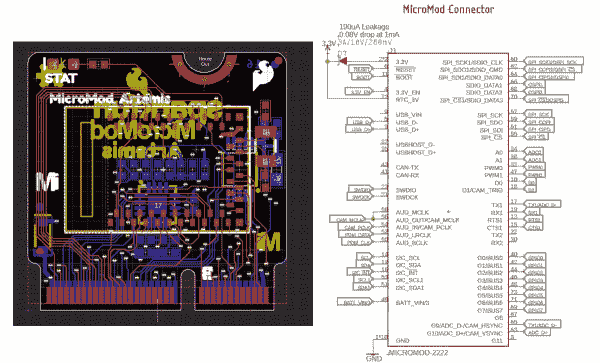](https://cdn.sparkfun.com/assets/learn_tutorials/1/2/0/6/MicroMod_Edge_Connector_and_Symbol_Artemis.jpg)

请务必在您的设计中包含特殊订购说明:

*   0.8 毫米板厚
*   45 度倒角边缘
*   四层设计

[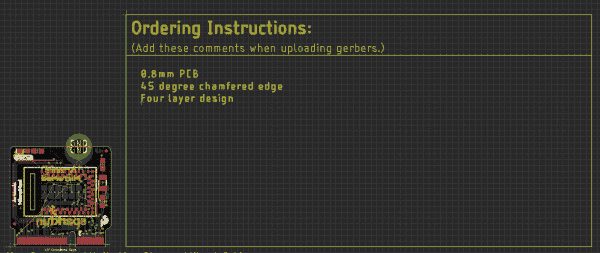](https://cdn.sparkfun.com/assets/learn_tutorials/1/2/0/6/MicroMod-Eagle-Board_Special_Ording.png)

### 制造

M.2 规范要求卡边缘有 20°的斜面。然而，似乎大多数 PCB 工厂都设置了 45°斜角，他们喜欢称之为“**倒角**”边缘。在测试了几个电路板后，45°倒角效果很好。到目前为止，我们还没有测试过*没有*在卡边缘有斜面的主板。我怀疑它仍然可以工作，但插入连接器可能会有不同的感觉。文本“倒角边”通过示意图自动添加到面板。

[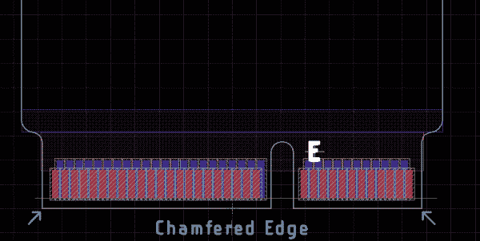](https://cdn.sparkfun.com/assets/learn_tutorials/1/2/0/6/MicroMod-Eagle-Board_Chamfered_Edges_Mdot2_Spec.png)

我们已经修改了 SparkFun panelizer(点击此处阅读更多[，点击此处](https://www.sparkfun.com/news/2601)获取最新文件[)来创建能够将边缘斜切的面板。](https://github.com/sparkfun/SparkFun_Eagle_Settings/blob/master/ulp/SparkFun-Panelizer.ulp)

[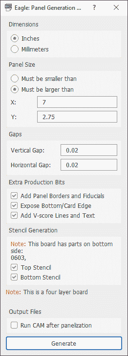](https://cdn.sparkfun.com/assets/learn_tutorials/1/2/0/6/MicroMod-Eagle-Script_Mod_Panelizer.png)

务必选择“**暴露底部/卡边缘**”。y 必须为 2.75 英寸或更大，否则 fab house 无法进行 v 评分。x 可以是 3 英寸或更大。我们发现，从 3 英寸到 7 英寸，PCB 的价格变化不大。我们的 SMD 系列可以处理高达 9 英寸的面板，所以这是我们经常使用的。注意:小组成员将复制原始设计的 DRC 设置。

准备好进行 CAM 和 fab 的面板。

[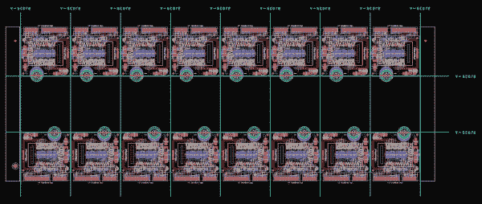](https://cdn.sparkfun.com/assets/learn_tutorials/1/2/0/6/MicroMod-Eagle-Board_Fabrication_Panel.png)

### 制造业

10 个面板、4 层、4 密耳走线/间距、金手指、ENIG 抛光、带斜边的大多数订单的价格约为 100 美元，从 [JLCPCB](https://jlcpcb.com/) 发货的价格约为 20 美元。我们发现 fab 时间大约为 8 天，但各不相同。无论哪种方式，这都是非常便宜和快速的。

对于这种规模的设计，不锈钢模板是必须的(没有聚酯薄膜)。如果你的组装过程允许使用框架模板，那就去买一个吧。对于 PBs' 0402 组件的规模和紧密的放置，手工模版印刷是困难的。

## 如何设计一个微电机载板

从已知良好的载板开始； [MicroMod 机器学习载板](https://github.com/sparkfun/MicroMod_Machine_Learning_Carrier)就是一个很好的例子。

载板的核心是 MicroMod M.2 连接器、支架和螺钉。

[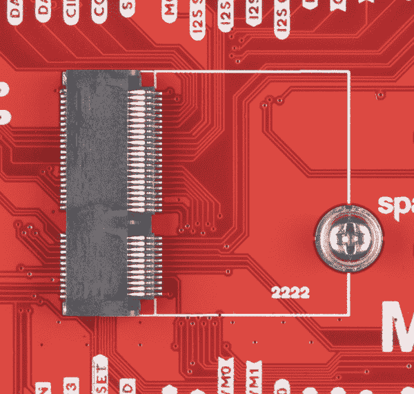](https://cdn.sparkfun.com/assets/learn_tutorials/1/2/0/6/SparkFun_MicroMod_Connector_with_Standoff_and_Screw.jpg)

我们精心设计了可回流的支架，并与 4.2 毫米高的 M.2 连接器兼容，以便载板可以在处理器板下安装有限数量的组件。此外，螺钉被选择为略大(M2.5)，带有 Phillips 头，以便用户能够获得最佳体验。我们建议您检查是否有#00、#0 或#1 Phillips 磁头驱动器可用。如果没有，我们经典的 SparkFun 可逆[迷你螺丝刀](https://www.sparkfun.com/products/9146)或更好的[袖珍螺丝刀套装](https://www.sparkfun.com/products/12891)效果很好。

对于不使用 EAGLE 的用户，包括尺寸在内的数据手册如下:

*   [M.2 微模块连接器数据表](https://cdn.sparkfun.com/assets/9/c/e/b/6/MicroMod_M.2_Connector_Datasheet_TE_2199230-4.pdf)
*   [M2.5 可回流支架数据表](https://cdn.sparkfun.com/assets/f/d/2/b/e/MicroMod_Reflowable_Standoff.pdf)

打开 [SparkFun Eagle 库](https://github.com/sparkfun/SparkFun-Eagle-Libraries)并导航至“SparkFun-MicroMod”库。SMD 可回流支架是一个独立于 MicroMod 连接器的组件(可在“SparkFun-Hardware”库中找到),因此我们可以在 spark(spark fun 的内部 ERP 系统)中正确跟踪零件。连接器有一个圆，在这个圆上需要放置支架。它需要接近，但不是微米级的完美。我们目前计划只生产 22x22mm 的 MicroMods 处理器板(请注意“2222”字样)，但这一数字将来可能会增长。

[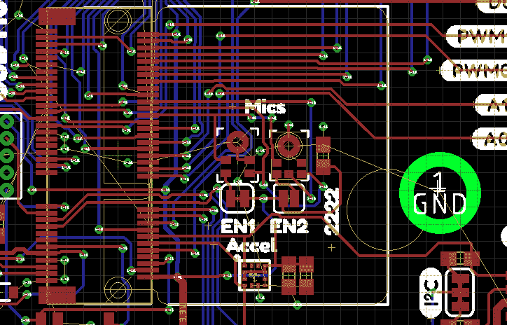](https://cdn.sparkfun.com/assets/learn_tutorials/1/2/0/6/MicroMod_Eagle_Design_Mounting_Hole_Standoffs_Key.png)

我们目前推荐使用 [AP7361C 3.3V 1A 线性稳压器](https://www.diodes.com/assets/Datasheets/AP7361C.pdf)。另外，请在使能引脚上包含齐纳和上拉。这使得 MicroMod 处理器板可以在必要时关闭主电源，从而节省大量电能。齐纳二极管保护 MicroMod 处理器板免受 VIN 对其 GPIO 的损坏。

[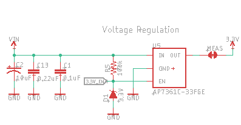](https://cdn.sparkfun.com/assets/learn_tutorials/1/2/0/6/MicroMod_Eagle_Design_3V3_Voltage_Regulator_Circuit.png)

注意下面的测量跳线。这允许切割和在线电流测量。请注意 BYP 跳线。这允许用户绕过 PTC，并在电源支持的情况下，增加电流使用，使其超过 2A PTC 切断。

[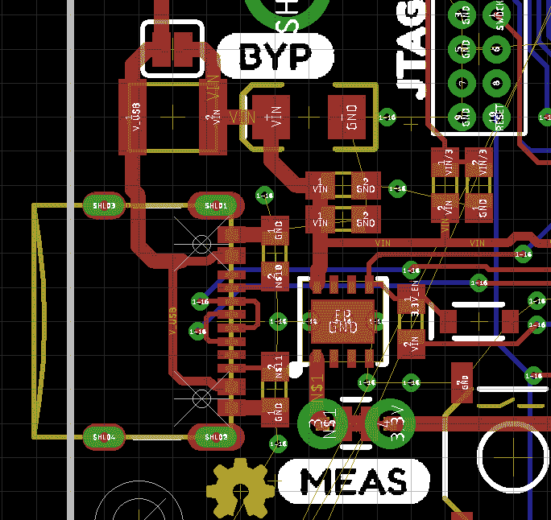](https://cdn.sparkfun.com/assets/learn_tutorials/1/2/0/6/MicroMod_Eagle_Design_MEAS_Jumper.png)

接口引脚应该组合在一起，但它们在电路板上的位置没有规定。

|  | [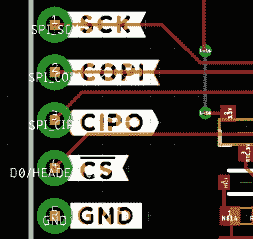](https://cdn.sparkfun.com/assets/learn_tutorials/1/2/0/6/MicroMod_SPI_interface1.jpg) |

每个载板上都应放置一个带有上拉和徽标的 Qwiic 连接器。请注意，0.022 英寸厚的 3.3V 走线可将 2A 传输至 Qwiic 总线。

[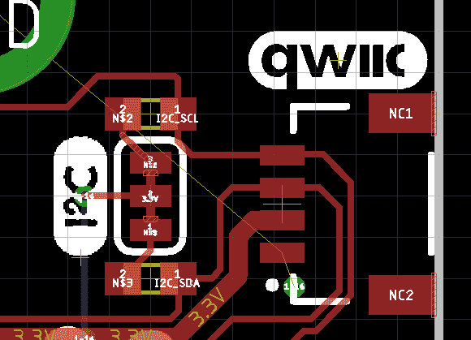](https://cdn.sparkfun.com/assets/learn_tutorials/1/2/0/6/MicroMod_Eagle_Design_Qwiic_Circuit.png)

允许使用 MicroMod 处理器板*下的组件*。注意组件高度！任何放置在带有 4.2 毫米高连接器(我们库存的标准连接器)**的 MicroMod 下的组件必须小于 1.9 毫米+/-0.1 毫米高**。没有 Artemis(太高)，有 SOT-23-5，有 CH340C/E，仔细检查所有 MicroMod 处理器板底部的元件高度。

[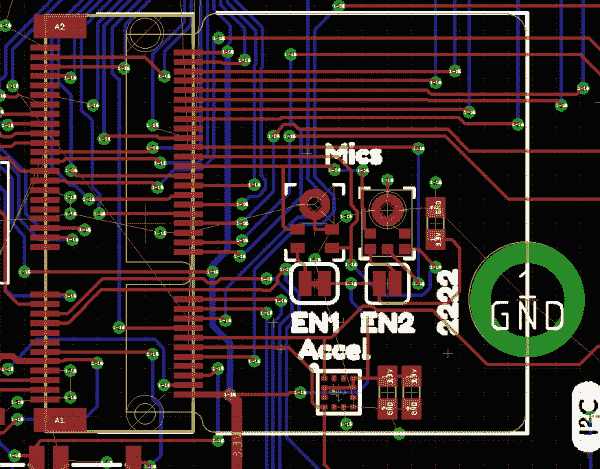](https://cdn.sparkfun.com/assets/learn_tutorials/1/2/0/6/MicroMod_Eagle_Design_Component_Height_Under_Processor.png)

所有载板都应该有一个串行线调试(SWD)端口。并非所有处理器都支持 SWD，但许多处理器都支持。

[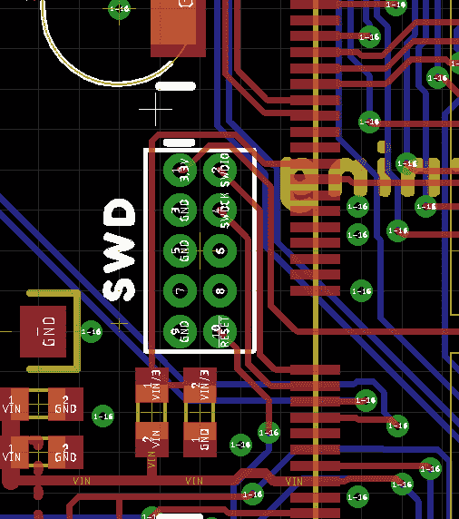](https://cdn.sparkfun.com/assets/learn_tutorials/1/2/0/6/MicroMod_SWD_Port.jpg)

加一个复位按钮，考虑加一个开机按钮。目前，引导输入在许多处理器板上不被使用，但是应该被包括在内以供将来使用。我们更喜欢带有 5.2 毫米致动器的 SMD 按钮(感觉棒极了！).

[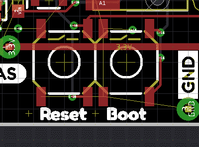](https://cdn.sparkfun.com/assets/learn_tutorials/1/2/0/6/MicroMod_Eagle_Design_Reset_Boot_Buttons.png)

考虑在您的主板上增加 RTC/低功耗备份。所示的 RTC 备用电池配置已经过很好的测试。它结构紧凑，兼容 SMD，提供 1mAh 的容量。您的应用可能是高功率(电机驱动器)，而 RTC 没有意义。停下来没关系。

[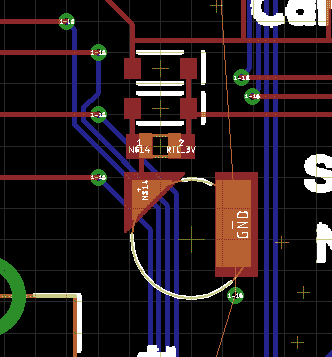](https://cdn.sparkfun.com/assets/learn_tutorials/1/2/0/6/MicroMod_Eagle_Design_RTC_Low_Power_Backup.png)

现在，根据您的具体应用，将您可能需要的任何东西添加到载板中。脂肪充电，DB9，射频识别，什么的。MicroMod 的强大功能和您面临的挑战是考虑您添加的外设将如何与各种 MicroMod 处理器板配合使用。添加串行设备很简单，大多数处理器板都有 TX/RX1。添加 PDM 麦克风或 4 位高速(四通道 SPI)显示器需要更多考虑。

路由很简单。匹配任何高速走线的长度，如 USB D+/D-，USB 主机 D+/D-。考虑对 0.012 英寸钻头使用 7 密耳轨迹/间距。高达 2A 电源总线的 Ues 0.022”迹线。允许 0.0035 密耳和 0.2 毫米钻孔的较小痕迹，但我们不太可能需要它。如今四层板很便宜，但我们不太可能需要它。载板应该不那么复杂，因为所有的复杂性都应该推到处理器板上。

片选(CS)引脚上的上拉电阻:上拉电阻与外设一起工作。因此，如果载板上有 SPI 器件(标清、传感器等)，该器件需要在 CS 引脚上有一个上拉电阻。如果 CS 线只是连接到电路板边缘的 PTH 接头，则不需要上拉电阻(该上拉电阻应位于焊接到 SPI 引脚的外设上)。尽可能使用 100k，但该值可以根据外设数据手册的规定进行更改。

## 如何设计一个功能板

### 功能板上有什么？

功能板是插入 M.2 连接器的模块化 PCB。理论上类似于处理器板(即插即用)，但目标是处理器板的外设。功能板与更大的主板上的处理器板互连。这创造了一个生态系统，其中多个嵌入式系统不需要烙铁就可以流畅高效地交互。

[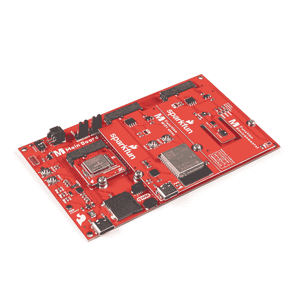](https://cdn.sparkfun.com/assets/parts/1/8/0/4/3/18576-SparkFun_MicroMod_Main_Board_-_Double-05.jpg)Left to Right: Artemis Processor Board, ESP32 Function Board, Environmental Function Board

### 物理尺寸和布局

功能板的单一尺寸为 65 毫米 X 38mm 毫米(2.56 英寸 x 1.5 英寸)。PCB 插入 M.2 连接器，因此厚度为 0.8 毫米，是标准 PCB 厚度的一半。

| [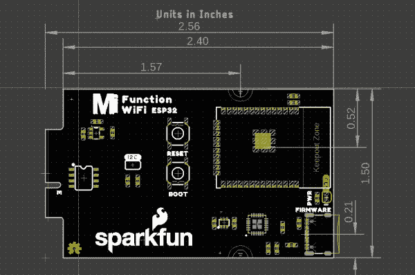](https://cdn.sparkfun.com/r/600-600/assets/learn_tutorials/1/2/0/6/Function_Board_Inches.JPG) | [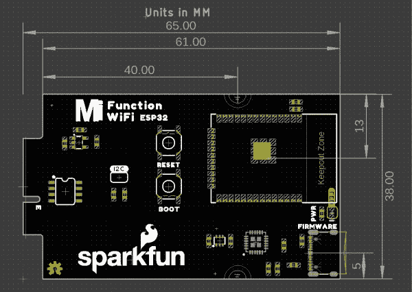](https://cdn.sparkfun.com/r/600-600/assets/learn_tutorials/1/2/0/6/Function_Board_MM.JPG) |
| *英寸尺寸* | *以毫米为单位的尺寸* |

与卡边缘相对的边缘总是包括功能板所需的任何连接器。比如 [WiFi 功能板](https://www.sparkfun.com/products/18430)包括 USB-C 接口，用于上传 AT 命令固件到 ESP32 [LoRa 板](https://www.sparkfun.com/products/18573)包括一个用于天线的 SMA 连接器。

[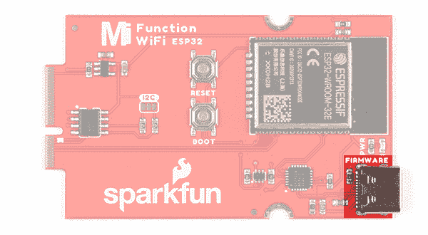](https://cdn.sparkfun.com/assets/learn_tutorials/1/9/9/8/18430-SparkFun_MicroMod_ESP32_Function_Board_USB.jpg)

这有助于简化使用，也有助于将功能放入机箱中。说到易用性，连接器应该位于功能板 PCB 内的某个测量位置，不需要精确到小数点后五位。

必须至少有两个支架来固定功能板，以防止在卡边缘插入电缆时功能板移动。

[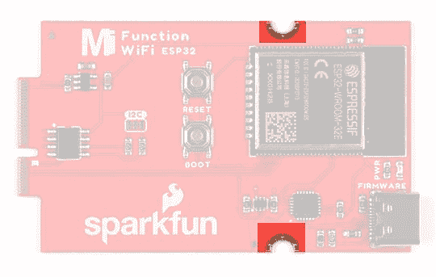](https://cdn.sparkfun.com/assets/learn_tutorials/1/2/0/6/Standoffs_Function_Board.JPG)Function Board Standoffs

您可以在[主板上看到互补的母支架，单根](https://www.sparkfun.com/products/18575)将功能板固定到 PCB 上。

[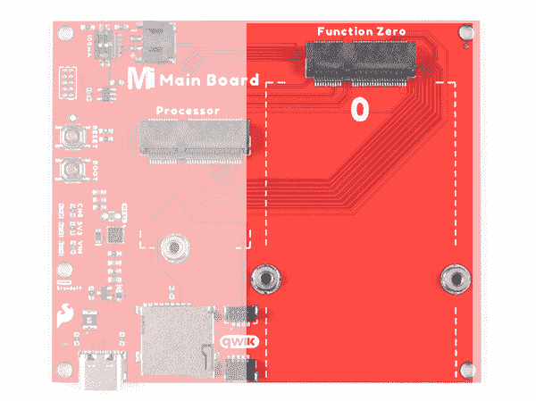](https://cdn.sparkfun.com/assets/learn_tutorials/1/9/9/4/18575-SparkFun-MicroMod_Main_Board_Single_Function_Board_Mdot2_Connector.jpg)

### M.2 卡引脚排列

M.2 引脚排列包括许多主要总线:串行外设接口(SPI)、内部集成电路(I2C)、串行、USB 主机和控制器局域网(CAN)总线。有八个数字引脚，在较低的枚举引脚数处具有许多专用的重叠功能。例如，`F0`是专用中断，`F1`包括 SPI 总线的专用片选引脚，`F2`是专用脉宽调制(PWM)引脚。除了通用引脚之外，还有一个模拟引脚`A0`，最后还有一个电源使能引脚。电源使能引脚的预期用途是允许功能板的电源轻松打开和关闭。在 SparkFun 的功能板上，我们简单地使用爆米花电压调节器来促进电源，将电源启用引脚传递到卡的边缘，使其易于关闭电源。

[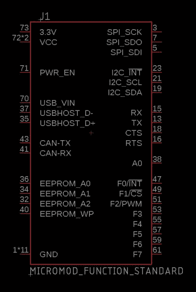](https://cdn.sparkfun.com/assets/learn_tutorials/1/2/0/6/Function_Board_Symbol.JPG)

可以在 **SparkFun-Micromod.lib** 的 [SparkFun Eagle Libraries 库](https://github.com/sparkfun/SparkFun-Eagle-Libraries)中找到 MicroMod 功能板符号和足迹。设备名称为**微型模块-功能**，包括“微型模块-功能-标准”变体下的功能板，以及“微型模块-功能-主”变体下的 M.2 连接器。

### 零件

这一点不言而喻，但功能板应该包含支持任何 IC 所需的所有器件。例如，如果打算将功能板用作数据记录器，可以考虑在其上安装 SD 卡插座。

此外，我们在每个功能板上都包括一个 EEPROM，它包含功能板的基本信息。

[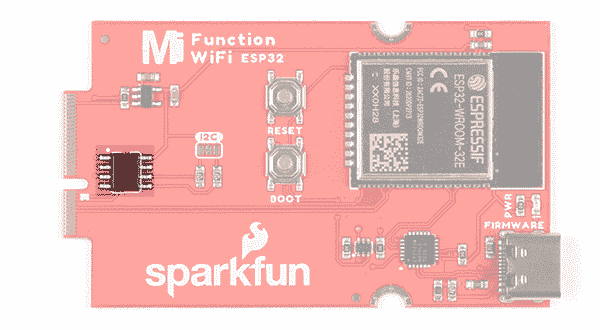](https://cdn.sparkfun.com/assets/learn_tutorials/1/9/9/8/18430-SparkFun_MicroMod_ESP32_Function_Board_EEPROM.jpg)

MicroMod 生态系统总是希望尽可能支持**低功耗**应用。如果您的功能板有任何 led，包括跳线来移除电源。

[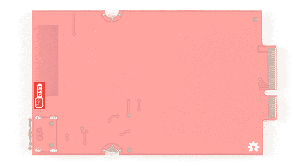](https://cdn.sparkfun.com/assets/learn_tutorials/1/9/9/8/18430-SparkFun_MicroMod_ESP32_Function_Board_Bottom_Jumper.jpg)

## 引脚规格

MicroMod 接口定义如下:

*   [SparkFun MicroMod 接口 v1.0 -引脚排列](https://cdn.sparkfun.com/assets/learn_tutorials/1/2/0/6/SparkFun_MicroMod_Interface_v1.0_-_Pinout.pdf)
*   [SparkFun MicroMod 接口 v1.0 -引脚描述](https://cdn.sparkfun.com/assets/learn_tutorials/1/2/0/6/SparkFun_MicroMod_Interface_v1.0_-_Pin_Descriptions.pdf)

有用的器件数据表:

*   [M.2 微模块连接器数据表](https://cdn.sparkfun.com/assets/9/c/e/b/6/MicroMod_M.2_Connector_Datasheet_TE_2199230-4.pdf)
*   [M2.5 可回流支架数据表](https://cdn.sparkfun.com/assets/f/d/2/b/e/MicroMod_Reflowable_Standoff.pdf)

以下是表格形式的引脚排列描述信息:

| 信号群 | 信号 | 输入－输出 | 描述 | 电压 |
| 力量 | 3.3V | 我 | 3.3V 电源 | 3.3V |
| GND |  | 返回电流路径 | 0V |
| USB_VIN | 我 | USB VIN 符合 USB 2.0 规范。连接到处理器上任何需要 5V 电压才能实现 USB 功能的引脚。 | 4.8-5.2V |
| RTC _ 3V _ 电池 | 我 | 3V 由外部纽扣电池或迷你电池提供。最大功耗= 100uA。连接到掉电时保持 RTC 的引脚。可以左 NC。 | 3V |
| 3.3V_EN | O | 控制载板的主电压调节器。1V 以上的电压将启用 3.3V 电源路径。可以左 NC。如果实施，载板必须在调节器使能引脚上提供上拉电阻和 3.3V 箝位。 | 3.3V |
| BATT_VIN/3 | 我 | 载板原始电压超过 3。1/3 电阻分压器在载板上实现。根据需要放大模拟信号，以实现完整的 0-3.3V 范围。 | 3.3V |
| 重置 | 重置 | 我 | 处理器的输入。处理器板上带上拉电阻的开漏。拉低复位处理器。 | 3.3V |
| 靴子 | 我 | 处理器的输入。处理器板上带上拉电阻的开漏。拉低使处理器进入特殊启动模式。可以左 NC。 |  |
| 通用串行总线 | USB_D+
USB_D- | 输入/输出 | 符合 USB 2.0 规范的 USB 数据差分串行数据接口。如果编程需要 UART，USB+/-必须连接到处理器板上的 USB 转串行转换 IC。 |  |
| USB _ 主机 | USB host _ d+
USB host _ d- | 输入/输出 | 对于支持 USB 主机模式的处理器。符合 USB 2.0 规范的 USB 数据差分串行数据接口。可以左 NC。 |  |
| 能 | CAN_RX | 我 | CAN 总线接收数据 | 3.3V |
| CAN_TX | O | CAN 总线传输数据 | 3.3V |
| 通用非同步收发传输器(Universal Asynchronous Receiver/Transmitter) | UART_RX1 | 我 | UART 接收数据 | 3.3V |
| UART_TX1 | O | UART 发送数据 | 3.3V |
| UART RTS1 | O | UART 准备发送 | 3.3V |
| UART CTS1 | 我 | UART 清除发送 | 3.3V |
| UART_RX2 | 我 | 第二个 UART 接收数据 | 3.3V |
| UART_TX2 | O | 第二 UART 发送数据 | 3.3V |
| 注意:UART1/2 必须无阻碍(不要连接到 USB 转串行转换 IC)。 |
| 注意:UART0 未显示。主要的串行调试通过 USB 完成。Serial.print()应该通过 USB 打印，而不是 TX1。 |
| I ² C | 我在 SCL 的第二个城市 | 输入－输出 | I ² C 时钟。载板上拉开漏极。 | 3.3V |
| I ² C_SDA | 输入－输出 | I ² C 数据。载板上拉开漏极。 | 3.3V |
| I ² C_INT# | 我 | 从载板到处理器的中断通知。载板上拉开漏极。低电平有效。 | 3.3V |
| I ² C_SCL1 | 输入－输出 | 2nd I ² C 时钟。载板上拉开漏极。 | 3.3V |
| I ² C_SDA1 | 输入－输出 | 2nd I ² C 数据。载板上拉开漏极。 | 3.3V |
| SPI/SDIO | SPI _ SCK
CLK SDIO | O | SPI 时钟。次要用途:SDIO 钟。 | 3.3V |
| SPI_COPI
SDIO_CMD | 超正析象管(Image Orthicon) | SPI 控制器输出外设输入。次要用途:SDIO 命令界面。 | 3.3V |
| SPI_CIPO
SDIO_DATA0 | 输入－输出 | SPI 控制器输入外设输出。次要用途:SDIO 数据交换位 0。 | 3.3V |
| SDIO_DATA1 | 输入－输出 | SDIO 数据交换位 1 | 3.3V |
| SDIO_DATA2 | 输入－输出 | SDIO 数据交换位 2 | 3.3V |
| SPI _ CS
SDIO _ 数据 3 | 输入－输出 | SPI 片选。低电平有效。次要用途:SDIO 数据交换位 3。 | 3.3V |
| 注意:如果线路布线正确，载板 SD 插座可以回退到 SPI。必要时连接多个引脚以获得双重功能。例如，如果 CIPO1 与处理器上的 DATA0 是不同的引脚，那么 CIPO1 和 DATA0 都应连接到电路板边缘的 SDIO _ 数据 0。 |
| 睡吧 | 我 | 第二个 SPI 控制器输入，外设输出 | 3.3V |
| SPI_COPI1 | O | 第二控制器输出，外设输入 | 3.3V |
| SPI_SCK1 | O | 第二个 SPI 时钟 | 3.3V |
| SPI_CS#1 | O | 第二个 SPI 芯片选择。低电平有效。如果不使用硬件 CS，可以路由到 GPIO。 | 3.3V |
| 声音的 | 奥地利马克 | O | 音频主时钟 | 3.3V |
| AUD _ OUT
PCM _ OUT
i2s _ OUT
CAM _ MCLK | O | 音频数据输出。PCM 同步数据输出。I2S 串行数据输出。相机主时钟。 | 3.3V |
| 奥德 _ 因
PCM _ 因
i2s _ 因
坎姆 _PCLK | 我 | 音频数据输入。PCM 同步数据输入/I2S 串行数据输入。相机外设时钟。 | 3.3V |
| AUD _ LRC lk
PCM _ SYNC
i2s _ WS
PDM _ DATA | 输入－输出 | 音频左/右时钟。PCM 同步数据同步。I2S 单词精选。PDM 数据。 | 3.3V |
| AUD _ BLCK
PCM _ CLK
i2s _ SCK
PDM _ CLK | O | 音频位时钟。PCM 时钟。I2S 连续串行时钟。PDM 时钟。 | 3.3V |
| 社署 | SWDIO | 输入－输出 | 串行线调试 I/O。如果处理器支持 SWD，则连接。可以左 NC。 | 3.3V |
| SWDCK | 我 | 串行线调试时钟。如果处理器支持 SWD，则连接。可以左 NC。 | 3.3V |
| 物理输出核心 | A0 | 我 | 模数转换器 0。根据需要放大模拟信号，以实现完整的 0-3.3V 范围。 | 3.3V |
| 一流的 | 我 | 模数转换器 1。根据需要放大模拟信号，以实现完整的 0-3.3V 范围。 | 3.3V |
| 脉宽调制（pulse-width modulating 的缩写） | PWM0 | O | 脉宽调制输出 0。 | 3.3V |
| PWM1 | O | 脉宽调制输出 1。 | 3.3V |
| 数字的 | D0 | 输入－输出 | 通用数字输入/输出引脚。 | 3.3V |
| D1
CAM_TRIG | 输入－输出 | 通用数字输入/输出引脚。相机触发器。 | 3.3V |
| GPIO/总线 | G0/总线 0 | 输入－输出 | 通用引脚。任何未使用的处理器引脚都应分配给 Gx，具有 ADC + PWM 功能的引脚被赋予优先级(0、1、2 等)位置。目的是保证 ADC/PWM/数字特定引脚上的 PWM、ADC 和数字引脚功能。而 Gx 引脚不保证 ADC/PWM 功能。或者，引脚可以用来支持快速读/写 8 位宽或 4 位宽总线。 | 3.3V |
| G1/巴士 1 | 输入－输出 | 33V |
| G2/总线 2 | 输入－输出 | 3.3V |
| G3/总线 3 | 输入－输出 | 3.3V |
| G4/总线 4 | 输入－输出 | 3.3V |
| G5/总线 5 | 输入－输出 | 3.3V |
| g6/总线 6 | 输入－输出 | 3.3V |
| G7/总线 7 | 输入－输出 | 3.3V |
| 八国集团(Group of Eight) | 输入－输出 | 通用引脚。 | 3.3V |
| G9
ADC_D-
CAM_HSYNC | 输入－输出 | 差分 ADC 输入(如有)。相机水平同步。 | 3.3V |
| G10
ADC_D+
CAM_VSYNC | 输入－输出 | 差分 ADC 输入(如有)。相机垂直同步。 | 3.3V |
| G11
SWO | 输入－输出 | 通用引脚。串行线输出。 | 3.3V |

## 资源和更进一步

有关更多信息，请查看以下资源:

*   [SparkFun MicroMod 接口 v1.0 -引脚排列](https://cdn.sparkfun.com/assets/learn_tutorials/1/2/0/6/SparkFun_MicroMod_Interface_v1.0_-_Pinout.pdf)
*   [SparkFun MicroMod 接口 v1.0 -引脚描述](https://cdn.sparkfun.com/assets/learn_tutorials/1/2/0/6/SparkFun_MicroMod_Interface_v1.0_-_Pin_Descriptions.pdf)
*   [SparkFun Eagle 库](https://github.com/sparkfun/SparkFun-Eagle-Libraries)包含 M.2 连接器和 SMD 支架的示例
*   [M.2 微模块连接器数据表](https://cdn.sparkfun.com/assets/9/c/e/b/6/MicroMod_M.2_Connector_Datasheet_TE_2199230-4.pdf)
*   [M2.5 可回流支架数据表](https://cdn.sparkfun.com/assets/f/d/2/b/e/MicroMod_Reflowable_Standoff.pdf)
*   [MicroMod 信息页面](https://www.sparkfun.com/micromod)
*   [MicroMod 论坛](https://forum.sparkfun.com/viewforum.php?f=167)

寻找更多的 MicroMod 乐趣？用 MicroMod 查看以下[教程，获取更多灵感！](https://learn.sparkfun.com/tutorials/tags/micromod)

[](https://learn.sparkfun.com/tutorials/qwiic-digital-desk-sign-with-micromod) [### Qwiic 带微型模块的数字桌面标牌](https://learn.sparkfun.com/tutorials/qwiic-digital-desk-sign-with-micromod) Make a Qwiic-enabled digital desk sign with a MicroMod SAMD51 Processor Board's USB Host and a USB keyboard 2[](https://learn.sparkfun.com/tutorials/micromod-rp2040-processor-board-hookup-guide) [### MicroMod RP2040 处理器板连接指南](https://learn.sparkfun.com/tutorials/micromod-rp2040-processor-board-hookup-guide) This tutorial covers the basic functionality of the MicroMod RP2040 Processor Board and highlights the features of the dual-core ARM Cortex-M0+ processors development board. Get started with the first microcontroller from the Raspberry Pi Foundation 0[](https://learn.sparkfun.com/tutorials/micromod-ethernet-function-board---w5500-hookup-guide) [### MicroMod 以太网功能板- W5500 连接指南](https://learn.sparkfun.com/tutorials/micromod-ethernet-function-board---w5500-hookup-guide) Add Ethernet and PoE capabilities to your MicroMod project using the Ethernet Function Board - W5500\.[Favorited Favorite](# "Add to favorites") 1[](https://learn.sparkfun.com/tutorials/micromod-alorium-sno-m2-processor-board-hookup-guide) [### MicroMod Alorium Sno M2 处理器板连接指南](https://learn.sparkfun.com/tutorials/micromod-alorium-sno-m2-processor-board-hookup-guide) Get started with the MicroMod Alorium Sno M2 Processor Board 1