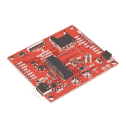
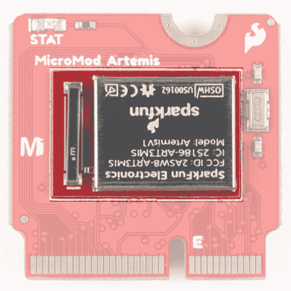
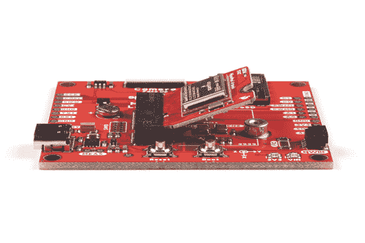
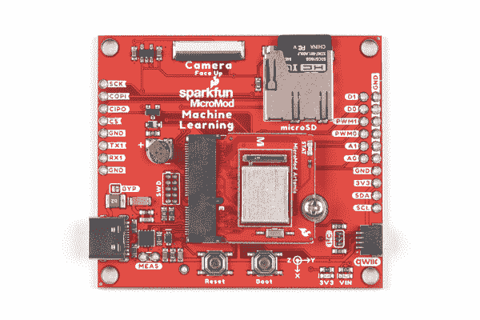
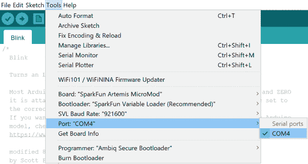
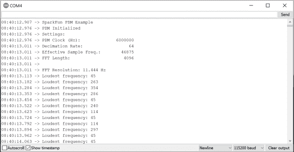

# MicroMod Artemis 处理器板连接指南

> 原文：<https://learn.sparkfun.com/tutorials/micromod-artemis-processor-board-hookup-guide>

## 介绍

利用超级强大的 Artemis 模块， [SparkFun MicroMod Artemis 处理器](https://www.sparkfun.com/products/16401)是你梦想的大脑板。采用 BLE 5.0 的 Cortex-M4F 运行频率高达 96MHz，功耗低至每 MHz 6 ua(不到 5mW)，M.2 MicroMod 连接器允许您插入带有任意数量外设的 MicroMod 载板。让我们来看看这款处理器主板能提供什么！

[](https://www.sparkfun.com/products/16401) 

将**添加到您的[购物车](https://www.sparkfun.com/cart)中！**

 **### [SparkFun MicroMod Artemis 处理器](https://www.sparkfun.com/products/16401)

[24 available](https://learn.sparkfun.com/static/bubbles/ "24 available") DEV-16401

该处理器具有 Artemis 模块，能够进行机器学习、蓝牙、I2C、GPIO、PWM、SPI，并打包以适应…

$14.95[Favorited Favorite](# "Add to favorites") 14[Wish List](# "Add to wish list")** **[https://www.youtube.com/embed/4QUJWeSrzD0/?autohide=1&border=0&wmode=opaque&enablejsapi=1](https://www.youtube.com/embed/4QUJWeSrzD0/?autohide=1&border=0&wmode=opaque&enablejsapi=1)

### 所需材料

除了你的 MicroMod Artemis 处理器板，你还需要一个载板来开始。在这里，我们使用机器学习载板，但也有许多其他人可以选择。

[](https://www.sparkfun.com/products/16885) 

将**添加到您的[购物车](https://www.sparkfun.com/cart)中！**

 **### [SparkFun MicroMod ATP 载板](https://www.sparkfun.com/products/16885)

[In stock](https://learn.sparkfun.com/static/bubbles/ "in stock") DEV-16885

如果您需要“大量”带有简单 to 编程、准备上市模块的 GPIO，ATP 是您需要的解决方案。

$19.951[Favorited Favorite](# "Add to favorites") 13[Wish List](# "Add to wish list")****[](https://www.sparkfun.com/products/16829) 

将**添加到您的[购物车](https://www.sparkfun.com/cart)中！**

 **### [SparkFun MicroMod 数据记录载板](https://www.sparkfun.com/products/16829)

[20 available](https://learn.sparkfun.com/static/bubbles/ "20 available") DEV-16829

MicroMod 数据记录载体提供了一个使用 MicroMod 系统的低功耗数据记录平台，允许您选择 y…

$21.50[Favorited Favorite](# "Add to favorites") 9[Wish List](# "Add to wish list")****[](https://www.sparkfun.com/products/16400) 

将**添加到您的[购物车](https://www.sparkfun.com/cart)中！**

 **### [SparkFun MicroMod 机器学习载板](https://www.sparkfun.com/products/16400)

[In stock](https://learn.sparkfun.com/static/bubbles/ "in stock") DEV-16400

微电机机器学习载体结合了自由探索任何处理器的微电机产品线，而不需要 f。

$19.95[Favorited Favorite](# "Add to favorites") 20[Wish List](# "Add to wish list")****** ******你还需要一根 USB-C 电缆将载体连接到你的计算机，如果你想在你的 MicroMod 项目中添加一些 Qwiic 分线点，你至少需要一根 Qwiic 电缆将它们连接在一起。以下是这两种电缆的一些选项:

[](https://www.sparkfun.com/products/15081) 

将**添加到您的[购物车](https://www.sparkfun.com/cart)中！**

 **### [SparkFun Qwiic 线缆套件](https://www.sparkfun.com/products/15081)

[In stock](https://learn.sparkfun.com/static/bubbles/ "in stock") KIT-15081

为了更容易上手，我们用 50 毫米到 500 毫米的各种 Qwiic 电缆组装了 Qwiic 电缆套件…

$8.9516[Favorited Favorite](# "Add to favorites") 58[Wish List](# "Add to wish list")****[](https://www.sparkfun.com/products/15424) 

将**添加到您的[购物车](https://www.sparkfun.com/cart)中！**

 **### [可逆 USB A 转 C 线- 2m](https://www.sparkfun.com/products/15424)

[18 available](https://learn.sparkfun.com/static/bubbles/ "18 available") CAB-15424

这些 2 米长的电缆稍加修改后，就可以插入其端口，而不用考虑其在 U…

$8.951[Favorited Favorite](# "Add to favorites") 4[Wish List](# "Add to wish list")****[](https://www.sparkfun.com/products/14743) 

将**添加到您的[购物车](https://www.sparkfun.com/cart)中！**

 **### [USB 3.1 线 A 到 C - 3 脚](https://www.sparkfun.com/products/14743)

[In stock](https://learn.sparkfun.com/static/bubbles/ "in stock") CAB-14743

USB C 棒极了。但是，在我们将所有的集线器、充电器和端口转换为 USB C 之前，这是您要使用的电缆…

$5.504[Favorited Favorite](# "Add to favorites") 9[Wish List](# "Add to wish list")****** ******根据您选择的载板，您可能需要一些额外的外设来充分利用它们。有关具体的外设建议，请参考载板各自的连接指南。

### 推荐阅读

SparkFun MicroMod 生态系统是一种独特的方式，允许用户根据自己的需求定制他们的项目。你想通过无线信号(如蓝牙或 WiFi)发送你的天气数据吗？有一个微型处理器可以做到这一点。希望最大限度地提高效率和处理能力？你猜对了，有一个微模块处理器。如果你不熟悉 MicroMod 系统，请看这里:

| [](https://www.sparkfun.com/micromod) |
| *[微模式生态系统](https://www.sparkfun.com/micromod)* |

如果您不熟悉以下教程中涵盖的概念，我们还建议您浏览这些教程:

[](https://learn.sparkfun.com/tutorials/getting-started-with-micromod) [### MicroMod 入门](https://learn.sparkfun.com/tutorials/getting-started-with-micromod) Dive into the world of MicroMod - a compact interface to connect a microcontroller to various peripherals via the M.2 Connector 3[](https://learn.sparkfun.com/tutorials/designing-with-micromod) [### 用 MicroMod 设计](https://learn.sparkfun.com/tutorials/designing-with-micromod) This tutorial will walk you through the specs of the MicroMod processor and carrier board as well as the basics of incorporating the MicroMod form factor into your own PCB designs 0[](https://learn.sparkfun.com/tutorials/micromod-machine-learning-carrier-board-hookup-guide) [### MicroMod 机器学习载板连接指南](https://learn.sparkfun.com/tutorials/micromod-machine-learning-carrier-board-hookup-guide) Get hacking with this tutorial on our Machine Learning Carrier Board 2

## 硬件概述

虽然 Artemis 模块相当独立，但让我们看看这款 MicroMod 处理器板的一些独特特性。

### 力量

电源由载板提供，但需要注意的是所有引脚都是 **3.3V** 。

⚡ **Warning:** All pins are **3.3V**. DO NOT expose the pins to 5V.

The ADC on the Artemis is **0-2V**. Exposing an ADC pin to 3.3V will not harm the device but the ADC will saturate returning 16,383 (14-bit) for voltages greater than 2V.

### M.2 连接器

我们所有的 MicroMod 处理器板都配备了 **M.2 MicroMod 连接器**，它利用 [M.2 标准](https://en.wikipedia.org/wiki/M.2)和规范，允许您将 MicroMod 处理器板安装在您选择的载板上。

| [](https://cdn.sparkfun.com/assets/learn_tutorials/1/1/9/1/16401-SparkFun-MicroMod-Artemis-Processor_M2ConnectorTop.jpg) | [](https://cdn.sparkfun.com/assets/learn_tutorials/1/1/9/1/16401-SparkFun-MicroMod-Artemis-Processor_M2ConnectorBottom.jpg) |
| *前面的 M.2 连接器* | *背面的 M.2 连接器* |

### Artemis 处理器

SparkFun Artemis 处理器提供运行频率高达 96MHz 的 BLE 5.0 Cortex-M4F，功耗低至每 MHz 6uA(小于 5mW)。这个模块足够强大，可以运行 TensorFlow、机器学习和各种语音识别软件。在 SparkFun Artemis 教程的[设计中可以找到对 Artemis 所有令人愉快的特性的深入探究。](https://learn.sparkfun.com/tutorials/designing-with-the-sparkfun-artemis)

[](https://cdn.sparkfun.com/assets/learn_tutorials/1/1/9/1/16401-SparkFun-MicroMod-Artemis-Processor_ArtemisModule.jpg)

### 运算放大器

超过 **2V** 的输入模拟电压将使 Artemis 的模数转换器饱和。我们集成了一个运算放大器，将输入的 **0-3.3V** 电压降低到 Artemis 可以处理的 **0-2V** 范围。

[](https://cdn.sparkfun.com/assets/learn_tutorials/1/1/9/1/16401-SparkFun-MicroMod-Artemis-Processor_OpAmp.jpg)

### 雷达跟踪中心（Radar Tracking Centre 的缩写）

集成了一个板载 RTC 晶体。

[](https://cdn.sparkfun.com/assets/learn_tutorials/1/1/9/1/16401-SparkFun-MicroMod-Artemis-Processor_RTC.jpg)

### 状态 LED

我们还包括一个状态 LED，满足您所有的闪光需求。

[](https://cdn.sparkfun.com/assets/learn_tutorials/1/1/9/1/16401-SparkFun-MicroMod-Artemis-Processor_StatusLED.jpg)

### Artemis MicroMod 处理器引脚功能

**Note:** You may not recognize the COPI/CIPO labels for SPI pins. SparkFun is working to move away from using MISO/MOSI to describe signals between the controller and the peripheral. Check out [this page](https://www.sparkfun.com/spi_signal_names) for more on our reasoning behind this change.

*   [Artemis 处理器板引脚表](#ArtemisProcessor)
*   [微模块通用引脚表](#MMGen)
*   [MicroMod 通用引脚描述](#MMDescript)

| **音频** | **UART** | **GPIO/总线** | **I ² C** | **SDIO** 的缩写形式 | **SPI** | **专用** |

| 功能 | 底部
销 | 顶部
销 | 功能 |
|  |  |  | (未连接) |  | **75** | GND |  |  |  |
|  |  |  | 3.3V | **74** | **73** | G5 /总线 5 |  |  |  |
|  |  |  | RTC _ 3V _ 电池 | **72** | **71** | G6 /总线 6 |  |  |  |
|  |  | SPI_CS1# | SDIO _ 数据 3(输入输出) | **70** | **69** | G7 /总线 7 |  |  |  |
|  |  |  | SDIO _ 数据 2(输入输出) | **68** | **67** | 八国集团(Group of Eight) |  |  |  |
|  |  |  | SDIO _ 数据 1(输入输出) | **66** | **65** | G9 | ADC_D- | CAM_HSYNC |  |
|  |  | 睡吧 | SDIO _ 数据 0(输入输出) | **64** | **63** | G10 | ADC_D+ | CAM_VSYNC |  |
|  |  | SPI COPI1 | SDIO_CMD (I/O) | **62** | **61** | 睡吧 |  |  |  |
|  |  | SPI SCK1 | SDIO_SCK(或) | **60** | **59** | SPI_COPI (O) | LED_DAT |  |  |
|  |  |  | AUD_MCLK (O) | **58** | **57** | SPI_SCK(或) | LED |  |  |
| 凯姆 | PCM_OUT | I2S 出局 | AUD_OUT | **56** | **55** | SPI_CS# |  |  |  |
| cam _ pclk | PCM_IN | I2S 因 | 澳元 _ 美元 | **54** | **53** | I2C_SCL1(输入/输出) |  |  |  |
| PDM_DATA | PCM_SYNC | i2s WS | AUD_LRCLK | **52** | **51** | I2C_SDA1(输入输出) |  |  |  |
| PDM_CLK | PCM_CLK | SCK i2s | 奥德 _BCLK | **50** | **49** | BATT_VIN / 3 (I - ADC) (0 至 3.3V) |  |  |  |
|  |  |  | G4 /总线 4 | **48** | **47** | PWM1 |  |  |  |
|  |  |  | G3 /总线 3 | **46** | **45** | GND |  |  |  |
|  |  |  | G2 /总线 2 | **44** | **43** | CAN_TX |  |  |  |
|  |  |  | G1 /巴士 1 | **42** | **41** | CAN_RX |  |  |  |
|  |  |  | G0 /总线 0 | **40** | **39** | GND |  |  |  |
|  |  |  | 一流的 | **38** | **37** | USBHOST_D- |  |  |  |
|  |  |  | GND | **36** | **35** | USBHOST_D+ |  |  |  |
|  |  |  | A0 | **34** | **33** | GND |  |  |  |
|  |  |  | PWM0 | **32** | **31** | 模块密钥 |  |  |  |
|  |  |  | 模块密钥 | **30** | **29** | 模块密钥 |  |  |  |
|  |  |  | 模块密钥 | **28** | **27** | 模块密钥 |  |  |  |
|  |  |  | 模块密钥 | **26** | **25** | 模块密钥 |  |  |  |
|  |  |  | 模块密钥 | **24** | **23** | SWDIO |  |  |  |
|  |  |  | UART_TX2 (O) | **22** | **21** | SWDCK |  |  |  |
|  |  |  | UART_RX2 (I) | **20** | **19** | UART_RX1 (I) |  |  |  |
|  |  | CAM_TRIG | D1 | **18** | **17** | UART_TX1 (0) |  |  |  |
|  |  |  | I2C INT # | **16** | **15** | UART_CTS1 (I) |  |  |  |
|  |  |  | S7-1200 可编程控制器 | **14** | **13** | UART_RTS1 (O) |  |  |  |
|  |  |  | I2C SDA(输入/输出) | **12** | **11** | 行李箱(I 型开式排放) |  |  |  |
|  |  |  | D0 | **10** | **9** | USB_VIN |  |  |  |
|  |  | 浅部白色甲癣 | G11 | **8** | **7** | GND |  |  |  |
|  |  |  | 复位# (I -开漏) | **6** | **5** | USB_D- |  |  |  |
|  |  |  | 3.3V_EN | **4** | **3** | USB_D+ |  |  |  |
|  |  |  | 3.3V | **2** | **1** | GND |  |  |  |

| 阿耳忒弥斯
引脚 | 替代
功能 | 主要
功能 | 底部
销 | 顶部
销 | 主要
功能 | 替代
功能 | 阿耳忒弥斯
引脚 |
|  |  |  | (未连接) | **73** | G5 |  | A29 |
|  |  | - | **72** | **71** | G6 |  | D14 |
| D23 | QSPI3 | SPI_CS1 | **70** | **69** | 七国集团 |  | D15 |
| D4 |  | QSPI2 | **68** | **67** | - |  |  |
| D26 |  | QSPI1 | **66** | **65** | TX1 | ADC_D- | A12 |
| D6 | QSPI0 | 睡吧 | **64** | **63** | ADC_D+ |  | A13 |
| D7 | QSPI_CS | SPI_COPI1 | **62** | **61** | 睡吧，婊子 |  | D43 |
| D5 | QSPI | SPI_SCK1 | **60** | **59** | SPI_COPI |  | D38 |
| D18 |  | 凯姆 | **58** | **57** | SPI |  | D42 |
| D18 |  | 凯姆 | **56** | **55** | SPI_CS |  | D41 |
| A11 |  | cam _ pclk | **54** | **53** | SCL1 |  | D8 |
| D36 |  | PDM_DATA | **52** | **51** | SDA1 |  | D9 |
| D37 |  | PDM_CLK | **50** | **49** | BATT_VIN / 3 |  | A31 |
| D28 |  | G4 | **48** | **47** | PWM1 |  | D45 |
| D27 |  | 自交第三代 | **46** | **45** | - |  |  |
| A34 |  | G2 Esports 电子竞技俱乐部 | **44** | **43** | - |  |  |
| A33 |  | G1 | **42** | **41** | - |  |  |
| A16 |  | 静止状态 | **40** | **39** | GND |  |  |
| A35 |  | ADC1 | **38** | **37** | - |  |  |
| A32 |  | ADC0 | **34** | **33** | - |  |  |
| D44 |  | PWM0 | **32** | **31** | - |  |  |
|  |  | - | **24** | **23** | SWDIO |  | D21 |
|  |  | - | **22** | **21** | SWDCK |  | D20 |
|  |  | - | **20** | **19** | RX1 |  | D25 |
| D1 |  | D1 | **18** | **17** | TX1 | ADC_D- | A12 |
| D2 |  | I²C _ 中断 | **16** | **15** | CTS1 |  | D17 |
| D39 |  | SCL | **14** | **13** | RTS1 |  | D10 |
| D40 |  | 国家药品监督管理局 | **12** | **11** | 靴子 |  |  |
| D0 |  | D0 | **10** | **9** | - |  |  |
|  |  | - | **8** | **7** | GND |  |  |
|  |  | 重置 | **6** | **5** | USB_D- |  |  |
|  |  | - | **4** | **3** | USB_D+ |  |  |
|  |  | 3.3V | **2** | **1** | GND |  |  |

| 信号群 | 信号 | 输入－输出 | 描述 | 电压 |
| 力量 | 3.3V | 我 | 3.3V 电源 | 3.3V |
| GND |  | 返回电流路径 | 0V |
| USB_VIN | 我 | USB VIN 符合 USB 2.0 规范。连接到处理器板上要求 5V USB 功能的引脚 | 4.8-5.2V |
| RTC _ 3V _ 电池 | 我 | 3V 由外部纽扣电池或迷你电池提供。最大功耗=100μA，连接到引脚，在掉电期间保持 RTC。可以左 NC。 | 3V |
| 3.3V_EN | O | 控制载板的主电压调节器。1V 以上的电压将启用 3.3V 电源路径。 | 3.3V |
| BATT_VIN/3 | 我 | 载板原始电压超过 3。1/3 电阻分压器在载板上实现。根据需要放大整个 0-3.3V 范围的模拟信号 | 3.3V |
| 重置 | 重置 | 我 | 处理器的输入。处理器板上带上拉电阻的开漏。拉低复位处理器。 | 3.3V |
| 靴子 | 我 | 处理器的输入。处理器板上带上拉电阻的开漏。拉低使处理器进入特殊启动模式。可以左 NC。 | 3.3V |
| 通用串行总线 | USB_D | 输入－输出 | USB 数据。符合 USB 2.0 规范的差分串行数据接口。如果编程需要 UART，USB 必须连接到处理器板上的 USB 转串行转换 IC。 |  |
| USB 主机 | USBHOST_D | 输入－输出 | 对于支持 USB 主机模式的处理器。USB 数据。符合 USB 2.0 规范的差分串行数据接口。可以左 NC。 |  |
| 能 | CAN_RX | 我 | CAN 总线接收数据。 | 3.3V |
| CAN_TX | O | CAN 总线传输数据。 | 3.3V |
| 通用非同步收发传输器(Universal Asynchronous Receiver/Transmitter) | UART_RX1 | 我 | UART 接收数据。 | 3.3V |
| UART_TX1 | O | UART 发送数据。 | 3.3V |
| UART_RTS1 | O | UART 准备发送。 | 3.3V |
| UART_CTS1 | 我 | UART 清零发送。 | 3.3V |
| UART_RX2 | 我 | 第二个 UART 接收数据。 | 3.3V |
| UART_TX2 | O | 第二个 UART 发送数据。 | 3.3V |
| I ² C | 我在 SCL 的第二个城市 | 输入－输出 | I ² C 时钟。载板上拉的开漏。 | 3.3V |
| I2C SDA | 输入－输出 | I ² C 数据。载板上有上拉电阻的开漏 | 3.3V |
| I2C INT # | 我 | 从载板到处理器的中断通知。载板上拉的开漏。低电平有效 | 3.3V |
| I2C_SCL1 号文件 | 输入－输出 | 2nd I ² C 时钟。载板上拉的开漏。 | 3.3V |
| I2C sda 1 | 输入－输出 | 2nd I ² C 数据。载板上拉的开漏。 | 3.3V |
| 精力 | SPI_COPI | O | SPI 控制器输出/外设输入。 | 3.3V |
| 睡吧，婊子 | 我 | SPI 控制器输入/外设输出。 | 3.3V |
| SPI | O | SPI 时钟。 | 3.3V |
| SPI_CS# | O | SPI 片选。低电平有效。如果不使用硬件 CS，可以路由到 GPIO。 | 3.3V |
| SPI/SDIO | SPI_SCK1/SDIO_CLK | O | 第二个 SPI 时钟。次要用途是 SDIO 钟。 | 3.3V |
| SPI_COPI1/SDIO_CMD | 输入－输出 | 第二 SPI 控制器输出/外设输入。次要用途是 SDIO 命令界面。 | 3.3V |
| spi _ 塞浦路斯 1/SDIO_DATA0 | 输入－输出 | 第二个 SPI 外设输入/控制器输出。次要用途是 SDIO 数据交换位 0。 | 3.3V |
| SDIO_DATA1 | 输入－输出 | SDIO 数据交换位 1。 | 3.3V |
| SDIO_DATA2 | 输入－输出 | SDIO 数据交换位 2。 | 3.3V |
| SPI _ CS1/SDIO _ 数据 3 | 输入－输出 | 第二个 SPI 芯片选择。次要用途是 SDIO 数据交换位 3。 | 3.3V |
| 声音的 | 奥地利马克 | O | 音频主时钟。 | 3.3V |
| AUD _ OUT/PCM _ OUT/i2s _ OUT/CAM _ MCLK | O | 音频数据输出。PCM 同步数据输出。I2S 串行数据输出。相机主时钟。 | 3.3V |
| 澳大利亚/PCM _ IN/i2s _ IN/卡姆 _PCLK | 我 | 音频数据输入。PCM 同步数据输入。I2S 串行数据输入。照相机外围时钟。 | 3.3V |
| AUD _ LRC lk/PCM _ SYNC/i2s _ WS/PDM _ DATA | 输入－输出 | 音频左/右时钟。PCM 同步数据同步。I2S 单词精选。PDM 数据。 | 3.3V |
| 澳大利亚 BCLK/CLK PCM/CLK i2s/CLK PDM | O | 音频位时钟。PCM 时钟。I2S 连续串行时钟。PDM 时钟。 | 3.3V |
| 社署 | SWDIO | 输入－输出 | 串行线调试 I/O。如果处理器板支持 SWD，则连接。可以左 NC。 | 3.3V |
| SWDCK | 我 | 串行线调试时钟。如果处理器板支持 SWD，则连接。可以左 NC。 | 3.3V |
| 物理输出核心 | A0 | 我 | 模数转换器 0。根据需要放大模拟信号，以实现完整的 0-3.3V 范围。 | 3.3V |
| 一流的 | 我 | 模数转换器 1。根据需要放大模拟信号，以实现完整的 0-3.3V 范围。 | 3.3V |
| 脉宽调制（pulse-width modulating 的缩写） | PWM0 | O | 脉宽调制输出 0。 | 3.3V |
| PWM1 | O | 脉宽调制输出 1。 | 3.3V |
| 数字的 | D0 | 输入－输出 | 通用数字输入/输出引脚。 | 3.3V |
| D1/CAM_TRIG | 输入－输出 | 通用数字输入/输出引脚。相机触发器。 | 3.3V |
| 常规/公共汽车 | G0/总线 0 | 输入－输出 | 通用引脚。任何未使用的处理器引脚都应分配给 Gx，具有 ADC + PWM 功能的引脚优先(0、1、2 等。)岗位。目的是保证各 ADC/PWM/数字引脚上的 PWM、ADC 和数字引脚功能。Gx 引脚不保证 ADC/PWM 功能。另一种用途是引脚可以支持快速读/写 8 位或 4 位宽总线。 | 3.3V |
| G1/巴士 1 | 输入－输出 | 3.3V |
| G2/总线 2 | 输入－输出 | 3.3V |
| G3/总线 3 | 输入－输出 | 3.3V |
| G4/总线 4 | 输入－输出 | 3.3V |
| G5/总线 5 | 输入－输出 | 3.3V |
| g6/总线 6 | 输入－输出 | 3.3V |
| G7/总线 7 | 输入－输出 | 3.3V |
| 八国集团(Group of Eight) | 输入－输出 | 通用引脚 | 3.3V |
| G9/ADC_D-/CAM_HSYNC | 输入－输出 | 差分 ADC 输入(如有)。相机水平同步。 | 3.3V |
| G10/ADC_D+/CAM_VSYNC | 输入－输出 | 差分 ADC 输入(如有)。相机垂直同步。 | 3.3V |
| G11/SWO | 输入－输出 | 通用引脚。串行线输出 | 3.3V |

### 电路板尺寸

该板的尺寸为 22 毫米 x 22mm 毫米，顶部槽口为 15 毫米，E 键为 12 毫米。有关处理器板物理标准的更多信息，请前往【MicroMod 入门教程并查看[硬件概述](https://learn.sparkfun.com/tutorials/getting-started-with-micromod#hardware-overview)部分。

[](https://cdn.sparkfun.com/assets/learn_tutorials/1/1/8/9/SparkFun_MicroMod_Processor_Board_Dimensions.jpg)

## 硬件连接

要开始使用 Artemis MicroMod 处理器板，您需要一个载板。这里我们用的是[机器学习载板](https://www.sparkfun.com/products/16400)。将 MicroMod Artemis 处理器板的顶部键与机器学习载板的螺丝端子对齐，并将板倾斜到插槽中。将电路板以一定角度插入 M.2 连接器。

**Note:** There is no way to insert the processor backward since the key prevents it from mating with the M.2 connector and as an extra safeguard to prevent inserting a processor that matches the key, the mounting screw is offset so you will not be able to secure an improperly connected processor board.[](https://cdn.sparkfun.com/assets/learn_tutorials/1/1/9/1/MicroMod_Artemis_in_Machine_Learning_Carrier_Board.jpg)

处理器板将以一定角度竖起，如下图所示:

[](https://cdn.sparkfun.com/assets/learn_tutorials/1/1/8/9/MicroMod_Getting_Started_Guide_Images-01.jpg)

一旦电路板插入插座，轻轻向下推 MicroMod 处理器板，用 Phillip 头拧紧螺丝。

[](https://cdn.sparkfun.com/assets/learn_tutorials/1/1/8/9/MicroMod_Getting_Started_Guide_Images-02.jpg)

一旦电路板被固定，你组装好的 MicroMod 系统看起来应该和下图相似！

[](https://cdn.sparkfun.com/assets/learn_tutorials/1/1/8/9/MicroMod_Getting_Started_Guide_Images-03.jpg)

### 连接一切

插入并固定好处理器后，就可以使用载体上的 USB-C 连接器将载体板连接到计算机了。根据您选择的运营商和您已经安装的驱动程序，您可能需要安装驱动程序。

**Note:** If you've never connected a **CH340** device to your computer before, you may need to install drivers for the USB-to-serial converter. Check out our section on ["How to Install CH340 Drivers"](https://learn.sparkfun.com/tutorials/sparkfun-serial-basic-ch340c-hookup-guide#drivers-if-you-need-them) for help with the installation.

[](https://learn.sparkfun.com/tutorials/how-to-install-ch340-drivers) [### 如何安装 CH340 驱动程序

#### 2019 年 8 月 6 日](https://learn.sparkfun.com/tutorials/how-to-install-ch340-drivers) How to install CH340 drivers (if you need them) on Windows, Mac OS X, and Linux.[Favorited Favorite](# "Add to favorites") 9

## 软件设置

**Note:** This example assumes you are using the latest version of the Arduino IDE on your desktop. If this is your first time using Arduino, please review our tutorial on [installing the Arduino IDE.](https://learn.sparkfun.com/tutorials/installing-arduino-ide)

### 为 Apollo3 安装 Arduino 核心

要开始使用 Artemis MicroMod 处理器板，您需要安装 SparkFun Apollo3 Arduino 内核。打开 Arduino IDE(必须是 v1.8.13 或更高版本)，导航到**文件**->-**首选项**，像这样:

[](https://cdn.sparkfun.com/assets/learn_tutorials/9/1/1/Arduino-Preferences.png)*Having a hard time seeing? Click the image for a closer look.*

在“附加 Board Manager URL”框中，确保您有以下 json 文件:

```
language:c
https://raw.githubusercontent.com/sparkfun/Arduino_Apollo3/main/package_sparkfun_apollo3_index.json 
```

如果您有不止一个 json 文件，您可以点击红色轮廓的按钮，并在最后添加 json 链接。它看起来会像下面这样:

[](https://cdn.sparkfun.com/assets/learn_tutorials/1/1/9/1/PreferencesButtonLink.png)*Having a hard time seeing? Click the image for a closer look.*

*   进入**工具**->-**板卡**，选择**板卡管理器**

[](https://cdn.sparkfun.com/assets/learn_tutorials/9/1/1/Arduino-BoardsManager.png)*Having a hard time seeing? Click the image for a closer look.*

搜索“Apollo3”，应该会找到 **SparkFun Apollo3 板**板包。确保选择了**版本 1.2.1** ，点击**安装**。

[](https://cdn.sparkfun.com/assets/learn_tutorials/1/1/9/1/BoardsManager-VersionSelection.png)*Having a hard time seeing? Click the image for a closer look.*

安装可能需要几分钟——安装中包括 Arduino 核心和 Apollo3 库的所有必要源文件，加上所有编译器和软件上传工具，您将需要使用 Arduino 的 Artemis。

一旦安装了板定义，你应该在**工具- >板- > SparkFun Apollo3** 菜单下看到 Artemis MicroMod 处理器板。

[](https://cdn.sparkfun.com/assets/learn_tutorials/1/1/9/1/BoardDropDown.png)*Having a hard time seeing? Click the image for a closer look.*

## 示例 1:眨眼

**Note:** This example assumes you are using the latest version of the Arduino IDE on your desktop. If this is your first time using Arduino, please review our tutorial on [installing the Arduino IDE.](https://learn.sparkfun.com/tutorials/installing-arduino-ide) If you have not previously installed an Arduino library, please check out our [installation guide.](https://learn.sparkfun.com/tutorials/installing-an-arduino-library)

要开始上传代码并使用您的机器学习载板，请确保您在**工具** > **板**菜单下选择了 Artemis MicroMod 板定义(或您选择使用的任何处理器)。

[](https://cdn.sparkfun.com/assets/learn_tutorials/1/3/9/5/BoardDropDown.png)*Having a hard time seeing? Click the image for a closer look.*

然后在**工具** > **端口**菜单下选择你的串口。

[](https://cdn.sparkfun.com/assets/learn_tutorials/1/3/9/5/portSelect.png)

### 加载闪烁

让我们从一些基本的东西开始——让一个 LED 闪烁。转到**档**->-**例题**->-**01。基础** - > **眨眼**。

[](https://cdn.sparkfun.com/assets/learn_tutorials/1/3/9/5/BlinkExamplePulldown.png)*Having a hard time seeing? Click the image for a closer look.*

一切设置正确后，上传代码！一旦代码完成传输，您应该看到 Artemis 处理器板上的 STAT LED 开始闪烁！

If the blue LED remains off, it's probably still sitting in the bootloader. After uploading a sketch, you may need to **tap the reset button** to get your Artemis MicroMod to run the sketch.

看看所有的眨眼！

[](https://cdn.sparkfun.com/assets/learn_tutorials/1/3/9/5/MachineLearningBlink.gif)

## 示例 2: PDM

我们已经为 Artemis 从头开始构建了 Arduino 内核，我们的大量内置示例将通过 Artemis MicroMod 处理器板开箱即用。你可以在**文件- >示例->“spark fun Artemis micro mod 示例”**下找到它们。

让我们从这里的例子中快速运行一个，并利用我们正在使用的机器学习载板上的两个内置麦克风。进入**文件- >示例- > PDM- >示例 1 _ 麦克风输出**

[](https://cdn.sparkfun.com/assets/learn_tutorials/9/1/1/Artemis-I2C-Examples-FullMenu.jpg)*Click above image for full menu context*

确保您选择了正确的板和端口，然后上传代码。一旦代码传输完毕，**打开[串行监视器](https://learn.sparkfun.com/tutorials/terminal-basics)** 并将波特率设置为 **115200** 。您应该会看到如下所示的内容:

[](https://cdn.sparkfun.com/assets/learn_tutorials/1/1/9/1/PDM_MicExample_Output.png)*Having a hard time seeing? Click the image for a closer look.*

注意，如果你大喊大叫，输出会改变。

在“SparkFun Artemis Micromod 示例”菜单中，我们有设置多个 I ² C 端口的示例(非常简单)，写入 EEPROM，使用软件串行(所有 48 个引脚都可以是串行的！)，使用板载麦克风，并使用伺服(高达 32！).我们一直在添加更多内容，所以请确保您的核心保持最新。

## 进一步的例子

对于 MicroMod 系统，所有处理器/载板的可能性是无穷无尽的，我们无法一一涵盖。您会注意到，在本教程中，我们选择了机器学习载板，但我们的示例集中在 Artemis 处理器板上。如果您对我们载板的具体示例感兴趣，请访问我们的[机器学习载板连接指南](https://learn.sparkfun.com/tutorials/micromod-machine-learning-carrier-board-hookup-guide)。

## 解决纷争

**Not working as expected and need help?**

If you need technical assistance and more information on a product that is not working as you expected, we recommend heading on over to the [SparkFun Technical Assistance](https://www.sparkfun.com/technical_assistance) page for some initial troubleshooting.

[SparkFun Technical Assistance Page](https://www.sparkfun.com/technical_assistance)

If you don't find what you need there, the [SparkFun Forums: MicroMod](https://forum.sparkfun.com/viewforum.php?f=180) are a great place to find and ask for help. If this is your first visit, you'll need to [create a Forum Account](https://forum.sparkfun.com/ucp.php?mode=register) to search product forums and post questions.

[SparkFun Forums: MicroMod](https://forum.sparkfun.com/viewforum.php?f=180)

## 资源和更进一步

想了解更多关于 Artemis MicroMod 处理器板的信息？查看这些链接！

*   [示意图(PDF)](https://cdn.sparkfun.com/assets/3/e/0/b/5/16401_MicroMod-Artemis-ProcessorBoard_schematic.pdf)
*   [老鹰文件(ZIP)](https://cdn.sparkfun.com/assets/7/0/7/a/2/16401_MicroMod-Artemis-ProcessorBoard_EagleFiles.zip)
*   [阿波罗 3 数据表](https://cdn.sparkfun.com/assets/d/e/8/b/4/Apollo3_Blue_MCU_Data_Sheet_v0_12_1_rZ9Akgo.pdf)
*   [GitHub 硬件回购](https://github.com/sparkfun/MicroMod_Artemis_Processor)

MicroMod 文档:

*   [micro mod 入门](https://learn.sparkfun.com/tutorials/getting-started-with-micromod)
*   [用微模块设计](https://learn.sparkfun.com/tutorials/designing-with-micromod)
*   [MicroMod 信息页面](https://www.sparkfun.com/micromod)
*   [MicroMod 论坛](https://forum.sparkfun.com/viewforum.php?f=180)

Artemis 文档:

*   [阿耳忒弥斯集成指南](https://cdn.sparkfun.com/assets/8/7/5/3/f/Artemis_Integration_Guide.pdf)
*   [用 SparkFun Artemis 设计](https://learn.sparkfun.com/tutorials/designing-with-the-sparkfun-artemis)
*   [使用 Arduino 开发 Artemis】](https://learn.sparkfun.com/tutorials/artemis-development-with-arduino)
*   [Arduino 核心](https://github.com/sparkfun/Arduino_Apollo3)
*   [阿波罗 3 引脚图](https://cdn.sparkfun.com/assets/8/2/3/3/c/Apollo3_Pad_Mapping.pdf)

使用 Artemis 处理器板寻找一些项目灵感？下面的教程可以帮你入门！

[](https://learn.sparkfun.com/tutorials/micromod-esp32-processor-board-hookup-guide) [### MicroMod ESP32 处理器板连接指南](https://learn.sparkfun.com/tutorials/micromod-esp32-processor-board-hookup-guide) A short hookup guide to get started with the SparkFun MicroMod ESP32 Processor Board.[Favorited Favorite](# "Add to favorites") 1[](https://learn.sparkfun.com/tutorials/micromod-all-the-pins-atp-carrier-board) [### 微模压所有引脚(ATP)载板](https://learn.sparkfun.com/tutorials/micromod-all-the-pins-atp-carrier-board) Access All The Pins (ATP) of the MicroMod Processor Board with the Carrier Board 0[](https://learn.sparkfun.com/tutorials/sound-location-with-the-qwiic-sound-trigger-and-the-u-blox-zed-f9x) [### 使用 Qwiic 声音触发器和 u-blox ZED-F9x 进行声音定位](https://learn.sparkfun.com/tutorials/sound-location-with-the-qwiic-sound-trigger-and-the-u-blox-zed-f9x) [Favorited Favorite](# "Add to favorites") 2[](https://learn.sparkfun.com/tutorials/micromod-main-board-hookup-guide-v2)[New!

### MicroMod 主板连接指南 V2](https://learn.sparkfun.com/tutorials/micromod-main-board-hookup-guide-v2) The MicroMod Main Board - Single and Double are specialized carrier boards that allow you to interface a Processor Board with a Function Board(s). The modular system allows you to add an additional feature(s) to a Processor Board with the help of a Function Board(s). In this tutorial, we will focus on the basic functionality of the Main Board - Single V2.1 and Main Board - Double and V2.2\.[Favorited Favorite](# "Add to favorites") 0**************