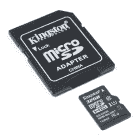

# 微型数据记录载板连接指南

> 原文：<https://learn.sparkfun.com/tutorials/micromod-data-logging-carrier-board-hookup-guide>

## 介绍

[MicroMod 数据记录载板](https://www.sparkfun.com/products/16829)类似于 [SparkFun Logomatic](https://www.sparkfun.com/products/12772) 为用户提供专用的数据记录板，但增加了为您的下一个数据记录器项目选择 MicroMod 处理器的能力。数据记录载板专为 MicroMod 生态系统的低功耗控制和传感器数据采集而设计。

[](https://www.sparkfun.com/products/16829) 

将**添加到您的[购物车](https://www.sparkfun.com/cart)中！**

 **### [SparkFun MicroMod 数据记录载板](https://www.sparkfun.com/products/16829)

[20 available](https://learn.sparkfun.com/static/bubbles/ "20 available") DEV-16829

MicroMod 数据记录载体提供了一个使用 MicroMod 系统的低功耗数据记录平台，允许您选择 y…

$21.50[Favorited Favorite](# "Add to favorites") 9[Wish List](# "Add to wish list")** **[https://www.youtube.com/embed/4QUJWeSrzD0/?autohide=1&border=0&wmode=opaque&enablejsapi=1](https://www.youtube.com/embed/4QUJWeSrzD0/?autohide=1&border=0&wmode=opaque&enablejsapi=1)

数据记录载板允许您控制板上 Qwiic 连接器和非 Qwiic 外设(如串行 UART 或 SPI 设备)专用电源引脚的电源，以便您可以选择何时为监控数据的外设供电。它还具有一个用于单节锂离子电池的充电电路，以及一个 RTC 电池备份电路，为处理器板上的实时时钟电路供电。

### 所需材料

像我们所有的 MicroMod 载板一样，不包含处理器，但您可以将您选择的处理器插入载体上的 MicroMod M.2 连接器。以下是为您的处理器选择的几个选项:

[](https://www.sparkfun.com/products/16791) 

将**添加到您的[购物车](https://www.sparkfun.com/cart)中！**

 **### [SparkFun MicroMod SAMD51 处理器](https://www.sparkfun.com/products/16791)

[Out of stock](https://learn.sparkfun.com/static/bubbles/ "out of stock") DEV-16791

SparkFun MicroMod SAMD51 处理器板采用 32 位 ARM Cortex-M4F MCU，是一款功能强大的微控制器，封装在一个

$18.951[Favorited Favorite](# "Add to favorites") 8[Wish List](# "Add to wish list")****[](https://www.sparkfun.com/products/16781) 

将**添加到您的[购物车](https://www.sparkfun.com/cart)中！**

 **### [SparkFun MicroMod ESP32 处理器](https://www.sparkfun.com/products/16781)

[In stock](https://learn.sparkfun.com/static/bubbles/ "in stock") WRL-16781

该板将 Espressif 的 ESP32 与我们的 M.2 连接器接口相结合，为我们的 Micro…

$16.951[Favorited Favorite](# "Add to favorites") 6[Wish List](# "Add to wish list")****[](https://www.sparkfun.com/products/16401) 

将**添加到您的[购物车](https://www.sparkfun.com/cart)中！**

 **### [SparkFun MicroMod Artemis 处理器](https://www.sparkfun.com/products/16401)

[24 available](https://learn.sparkfun.com/static/bubbles/ "24 available") DEV-16401

该处理器具有 Artemis 模块，能够进行机器学习、蓝牙、I2C、GPIO、PWM、SPI，并打包以适应…

$14.95[Favorited Favorite](# "Add to favorites") 14[Wish List](# "Add to wish list")****** ******您还需要一根 USB-C 电缆将载板连接到计算机，以便对处理器进行编程和进行串行 USB 通信。如果你想在你的 MicroMod 项目中增加一些 Qwiic 分线点，你至少需要一根 Qwiic 电缆将它们连接在一起。以下是这两种电缆的一些选项:

[](https://www.sparkfun.com/products/15081) 

将**添加到您的[购物车](https://www.sparkfun.com/cart)中！**

 **### [SparkFun Qwiic 线缆套件](https://www.sparkfun.com/products/15081)

[In stock](https://learn.sparkfun.com/static/bubbles/ "in stock") KIT-15081

为了更容易上手，我们用 50 毫米到 500 毫米的各种 Qwiic 电缆组装了 Qwiic 电缆套件…

$8.9516[Favorited Favorite](# "Add to favorites") 58[Wish List](# "Add to wish list")****[](https://www.sparkfun.com/products/14427) 

将**添加到您的[购物车](https://www.sparkfun.com/cart)中！**

 **### [Qwiic 线缆- 100mm](https://www.sparkfun.com/products/14427)

[In stock](https://learn.sparkfun.com/static/bubbles/ "in stock") PRT-14427

这是一条 100 毫米长的 4 芯电缆，带有 1 毫米 JST 端接。它旨在将支持 Qwiic 的组件连接在一起…

$1.50[Favorited Favorite](# "Add to favorites") 32[Wish List](# "Add to wish list")****[](https://www.sparkfun.com/products/15424) 

将**添加到您的[购物车](https://www.sparkfun.com/cart)中！**

 **### [可逆 USB A 转 C 线- 2m](https://www.sparkfun.com/products/15424)

[18 available](https://learn.sparkfun.com/static/bubbles/ "18 available") CAB-15424

这些 2 米长的电缆稍加修改后，就可以插入其端口，而不用考虑其在 U…

$8.951[Favorited Favorite](# "Add to favorites") 4[Wish List](# "Add to wish list")****[](https://www.sparkfun.com/products/14743) 

将**添加到您的[购物车](https://www.sparkfun.com/cart)中！**

 **### [USB 3.1 线 A 到 C - 3 脚](https://www.sparkfun.com/products/14743)

[In stock](https://learn.sparkfun.com/static/bubbles/ "in stock") CAB-14743

USB C 棒极了。但是，在我们将所有的集线器、充电器和端口转换为 USB C 之前，这是您要使用的电缆…

$5.504[Favorited Favorite](# "Add to favorites") 9[Wish List](# "Add to wish list")******** ********除了处理器、相关的电缆和传感器或其他想要记录数据的物品，你还需要一个 microSD 卡。最后，如果你想让你的 MicroMod 数据记录项目由电池供电，你需要一个单节锂离子电池。以下是这两种配件的几种选择:

[](https://www.sparkfun.com/products/13813) 

将**添加到您的[购物车](https://www.sparkfun.com/cart)中！**

 **### [锂离子电池-1Ah](https://www.sparkfun.com/products/13813)

[In stock](https://learn.sparkfun.com/static/bubbles/ "in stock") PRT-13813

基于锂离子化学的超薄超轻电池。每个电池在 1000 毫安时输出 3.7V 的标称电压！

$10.958[Favorited Favorite](# "Add to favorites") 75[Wish List](# "Add to wish list")****[](https://www.sparkfun.com/products/13855) 

将**添加到您的[购物车](https://www.sparkfun.com/cart)中！**

 **### [锂离子电池- 2Ah](https://www.sparkfun.com/products/13855)

[In stock](https://learn.sparkfun.com/static/bubbles/ "in stock") PRT-13855

这是基于锂离子化学的非常薄、非常轻的电池。每个电池在 200 伏时输出一个标称的 3.7 伏电压…

$13.959[Favorited Favorite](# "Add to favorites") 43[Wish List](# "Add to wish list")****[](https://www.sparkfun.com/products/15051) 

将**添加到您的[购物车](https://www.sparkfun.com/cart)中！**

 **### [microSD 卡-16GB(10 类)](https://www.sparkfun.com/products/15051)

[22 available](https://learn.sparkfun.com/static/bubbles/ "22 available") COM-15051

这是一个 10 级 16GB microSD 存储卡，非常适合容纳单板计算机和多种…

$19.95[Favorited Favorite](# "Add to favorites") 4[Wish List](# "Add to wish list")****[](https://www.sparkfun.com/products/14832) 

将**添加到您的[购物车](https://www.sparkfun.com/cart)中！**

 **### [【带适配器的 microSD 卡-32GB(10 类)](https://www.sparkfun.com/products/14832)

[In stock](https://learn.sparkfun.com/static/bubbles/ "in stock") COM-14832

这是一个 10 级 32GB microSD 存储卡，非常适合容纳单板计算机和多种…

$26.951[Favorited Favorite](# "Add to favorites") 1[Wish List](# "Add to wish list")******** ********### 推荐阅读

SparkFun MicroMod 生态系统旨在允许用户根据自己的需求定制他们的项目。您想通过无线信号(如蓝牙或 WiFi)发送您的记录数据吗？有一个微型处理器可以做到这一点。希望最大限度地提高效率和处理能力？你猜对了，有一个微模块处理器。如果你不熟悉 SparkFun MicroMod 系统，可以看看这里:

如果你不熟悉 MicroMod 生态系统，我们推荐你阅读这里的概述:

| [](https://www.sparkfun.com/micromod) |
| *[微模式生态系统](https://www.sparkfun.com/micromod)* |

如果您不熟悉以下教程中的概念，我们还建议您通读这些教程:

[](https://learn.sparkfun.com/tutorials/serial-communication) [### 串行通信](https://learn.sparkfun.com/tutorials/serial-communication) Asynchronous serial communication concepts: packets, signal levels, baud rates, UARTs and more 100[](https://learn.sparkfun.com/tutorials/serial-peripheral-interface-spi) [### 串行外设接口(SPI)](https://learn.sparkfun.com/tutorials/serial-peripheral-interface-spi) SPI is commonly used to connect microcontrollers to peripherals such as sensors, shift registers, and SD cards.[Favorited Favorite](# "Add to favorites") 91[](https://learn.sparkfun.com/tutorials/sd-cards-and-writing-images) [### SD 卡和书写图像](https://learn.sparkfun.com/tutorials/sd-cards-and-writing-images) How to upload images to an SD card for Raspberry Pi, PCDuino, or your favorite SBC.[Favorited Favorite](# "Add to favorites") 19[](https://learn.sparkfun.com/tutorials/getting-started-with-micromod) [### MicroMod 入门](https://learn.sparkfun.com/tutorials/getting-started-with-micromod) Dive into the world of MicroMod - a compact interface to connect a microcontroller to various peripherals via the M.2 Connector 3

## 硬件概述

在本节中，我们将介绍 MicroMod 数据记录载板上的元件，特定的 MicroMod 处理器板如何与之交互，并重点介绍板上的一些独特功能。

### 通用组件

大多数 SparkFun MicroMod 载板都有一些通用组件，所有 MicroMod 载板都有键控 M.2 MicroMod 连接器，可以将您的处理器插入其中。下面的照片和列表概述了大多数 SparkFun MicroMod 载板包含的一些组件。

*   **M.2 MicroMod 连接器** -这种特殊的键控 M.2 连接器允许您在载板上安装您选择的 MicroMod 处理器板。
*   **USB-C 连接器** -连接到您的计算机，对您的处理器板进行编程，还可以为您的 MicroMod 系统供电。
*   **3.3V 调节器** -提供调节后的 **3.3V** 和高达 **1A** 的电源。
*   **qw IC 连接器** -标准 qw IC 连接器，因此您可以将 qw IC 设备添加到您的 MicroMod 系统中。
*   **启动/复位按钮** -按下按钮进入处理器板上的启动模式，并复位您的微模块电路。
*   **RTC 备用电池&充电电路** - **1mAh** 某些 MicroMod 处理器板卡的 RTC 备用电池。从 **3.3V** 接收充电电压。
*   **microSD 插槽** -在此插入格式化为 FAT32 的 SD 卡，记录您的数据。

[](https://cdn.sparkfun.com/assets/learn_tutorials/1/3/2/9/MicroMod_Data_Logging_CB-Common_Components1.jpg)

### 电源控制电路

数据记录载板具有两个 **3.3V/600mA** 电压调节器，它们的使能引脚连接到连接的 MicroMod 处理器板上的 I/O 引脚。这样，只需几行代码就可以控制调节器的输出，使得电池供电应用中的控制和省电变得极其简单。**的 G1-3V3** 线是由微马达处理器上的 G1 控制的，而**的 G2-3.3V** 电路是(你可能会怀疑)由微马达处理器上的 G2 控制的。 **G1-3.3V** 电源电路连接到下图中突出显示的几个引脚，为外部设备供电提供了额外的灵活性。 **G2-3V3** 输出连接到 Qwiic 连接器上的 **3.3V** 引脚以及标有 G2-3V3 的专用 PTH 引脚。

[](https://cdn.sparkfun.com/assets/learn_tutorials/1/3/2/9/MicroMod_Data_Logging_CB-Power_Control.jpg)

### 电池充电电路

该板还有一个 MCP73831 单节锂离子/锂聚合物充电 IC，因此您可以为连接的单节 LiPo 电池充电。充电 IC 主要从 USB 接收电源，可以提供高达 450mA 的电流为连接的电池充电。

[](https://cdn.sparkfun.com/assets/learn_tutorials/1/3/2/9/MicroMod_Data_Logging_CB-LiPo_Circuit.jpg)

### 数据记录连接

除了常见元件中提到的 Qwiic 连接器，数据记录载板还分出几个其他引脚来连接 UART、SPI 和其他 I/O 设备。主 SPI 引脚连接到 SD 插槽和 LiPo 电池连接器附近的 PTH 接头。连接到 G0 的第二个芯片选择引脚连接到同一个接头。

**Note:** µSD Chip Select is tied to the SPI_CS chip select pin on the M.2 Connector. Refer to your Processor Board's documentation for information on how to properly define that pin in your code.

UART PTH 接头连接到 RX1 和 TX1，用于串行数据记录，A0、A1、PWM0、PWM1、D0 和 D1 也路由到专用 PTH 引脚。最后，如果用户更喜欢焊接连接，而不是 Qwiic，则主 I ² C 总线断开至 PTH 引脚。

[](https://cdn.sparkfun.com/assets/learn_tutorials/1/3/2/9/MicroMod_Data_Logging_CB-PTH_Pins.jpg)

### JTAG

需要断点级别调试的高级用户可以使用未填充的 JTAG 足迹。我们建议检查我们的 [JTAG 部分](https://www.sparkfun.com/categories/tags/jtag)的兼容公头和兼容的 JTAG 编程器和调试器。

[](https://cdn.sparkfun.com/assets/learn_tutorials/1/3/2/9/MicroMod_Data_Logging_CB-JTAG.jpg)

### 焊料跳线

If you have never worked with solder jumpers and PCB traces before or would like a quick refresher, check out our [How to Work with Solder Jumpers and PCB Traces](https://learn.sparkfun.com/tutorials/how-to-work-with-jumper-pads-and-pcb-traces) tutorial for detailed instructions and tips.

数据记录载板上有七个焊接跳线，标记为 I ² C、MEAS、BYP、VIN、3V3、VE 和 BATT。在本节中，我们将详细介绍每个跳线的功能和默认状态。

| **跳线名称/标签** | 描述 | **默认状态** |
| I ² C 上拉/ I2C | 通过两个 **2.2K &欧姆将 Qwiic SDA/SCL 线拉至**3.3V**；**电阻器 | 关闭的 |
| 测量值 | 打开该跳线以探测调节器的 **3.3V** 输出端的电流消耗。为了帮助测量电流，看看我们的[如何使用万用表](https://learn.sparkfun.com/tutorials/how-to-use-a-multimeter#measuring-current)教程。 | 关闭的 |
| 旁路/ BYP | “保险丝中的硬币”跳线。绕过 **6V/2A** 保险丝，并将 VIN 和 V_USB 连接在一起，以允许**T6 2A**电流流动。**只有当你知道自己在做什么的时候才关门！** | 打开 |
| 葡萄酒/葡萄酒 _LED | 将 5V/VIN LED 连接到 **3.7-6V(典型值。5V 来自 USB)** 通过一个 **4.1K &欧姆；**电阻器。打开以禁用 VIN LED。 | 关闭的 |
| 3V3 / 3V3_LED | 通过 **1K &欧姆将 3.3V LED 连接到**3.3V**；**电阻器。打开以禁用 3.3V LED。 | 关闭的 |
| 电压使能/ VE | 关闭该跳线，以启用处理器对 **3.3V** 总线的控制。 | 打开 |
| 电池/电池组 | 打开此跳线以测量电池的电流消耗或将主电源从 USB 切换到电池。 | 关闭的 |

| [](https://cdn.sparkfun.com/assets/learn_tutorials/1/3/2/9/MicroMod_Data_Logging_CB-Jumpers_Front.jpg) | [](https://cdn.sparkfun.com/assets/learn_tutorials/1/3/2/9/MicroMod_Data_Logging_CB-Jumpers_Back.jpg) |

*Having trouble viewing the detail in either photo? Click on them for a larger view!*

### 电路板尺寸

MicroMod 数据记录载板的尺寸为 2.40 英寸 x 1.60 英寸(60.96 毫米 x 40.64mm 毫米)，有五个安装孔，可安装一个 [4-40 螺钉](https://www.sparkfun.com/products/10453)。请注意 SD 插槽上方标有“Qwiic Mount”的安装孔，因为它可以作为 qw IC 分线点(或其他传感器)的单个安装件，或者您可以将其与“右上角”的外部安装件配对，以获得更安全的安装选项。在下一节“硬件装配”中，我们将演示如何使用这两个支架来安装 Qwiic 分线点。

[](https://cdn.sparkfun.com/assets/learn_tutorials/1/3/2/9/MicroMod_Data_Logging_CB-Dimensions.png)

现在我们已经熟悉了 MicroMod 数据记录载板的硬件，是时候插入处理器板和外围传感器并开始记录一些数据了。接下来，我们将介绍一些组装技巧。

## 硬件装配

### 插入处理器板

有了 M.2 MicroMod 连接器，连接您的处理器板变得很容易。将处理器斜边连接器上的键与载板上 M.2 连接器上的键匹配。以 45 度角将处理器板插入 M.2 连接器。处理器板将以如下所示的角度竖起:

[](https://cdn.sparkfun.com/assets/learn_tutorials/1/3/2/9/MM_Data_Logging_CB-Unsecured-Processor.jpg)

一旦主板插入插槽，轻轻按下处理器板，抓住固定螺丝，用十字螺丝刀拧紧:

[](https://cdn.sparkfun.com/assets/learn_tutorials/1/3/2/9/MM_Data_Logging_CB-Securing-Processor.jpg)

一旦处理器是安全的，你组装的 MicroMod 系统应该看起来像下面的图片！

[](https://cdn.sparkfun.com/assets/learn_tutorials/1/3/2/9/MM_Data_Logging_CB-Assembled-Processor.jpg)**Note:** There is *technically* no way to insert the processor backward since the key prevents it from mating with the M.2 connector. As an extra safeguard to prevent inserting a processor improperly or with a poor connection, the mounting screw will not match up if the Processor is not plugged in entirely.

### 数据记录外设

正如我们之前提到的，数据记录载板提供了多种方法来连接您的传感器或其他外设，以便记录数据。

如果您使用 qw IC 分线点，只需使用 qw IC 电缆将其连接到载板的 qw IC 连接器。如果您的 I ² C 设备不支持 Qwiic，您可以使用 [Qwiic 适配器电缆](https://www.sparkfun.com/products/14425)或者使用 I ² C 的 0.1 英寸间距 PTH 引脚将外设连接到载板。强烈建议采用焊接方法，但是如果您只是想要一个用于原型制作的临时连接，您可以使用 ic 挂钩，如[这些](https://www.sparkfun.com/products/501)或[这些](https://www.sparkfun.com/products/9741)。

对于使用 SPI、串行 UART 或其他输入(模拟、数字等)的备用数据输入。)，您需要使用上述方法之一将它们连接到数据记录载板任一侧的 0.1 英寸间距 PTH 引脚。所有部件焊接在一起后，请记下它们连接到哪个 **3.3V** 轨，以便在控制设备电源时参考。

[](https://cdn.sparkfun.com/assets/learn_tutorials/1/3/2/9/MM_Data_Logging_CB-Qwiic-GPS.jpg)

在给所有设备加电之前，将您的 microSD 卡插入卡槽，并按入锁定到位。

### 连接一切

插入并固定好处理器后，就可以使用 USB-C 连接器将 MicroMod 数据记录载板连接到计算机上了。根据您选择的处理器和已经安装的驱动程序，您可能需要为您的处理器主板安装驱动程序。有关如何安装它们的详细说明，请参阅处理器板的连接指南。此时，您还可以连接电池进行充电，或者在 USB 电源断开后为电路供电。

[](https://cdn.sparkfun.com/assets/learn_tutorials/1/3/2/9/MM_Data_Logging_CB-Completed-Circuit.jpg)*This demo circuit uses the [SparkFun GPS Breakout - ZOE-M8Q (Qwiic)](https://www.sparkfun.com/products/15193) and [GPS/GNSS Magnetic Mount Antenna](https://www.sparkfun.com/products/14986).***Note:** Make sure that for whichever processor you choose, you have the correct board definitions installed.

For this particular tutorial, we are using the Artemis MicroMod Processor. Board definitions for this processor board can be found in the [Software Setup and Programming](https://learn.sparkfun.com/tutorials/micromod-artemis-processor-board-hookup-guide#software-setup-and-programming) section of the [Artemis MicroMod Processor Board Hookup Guide](https://learn.sparkfun.com/tutorials/micromod-artemis-processor-board-hookup-guide).

If you are using a different processor board, go to our [MicroMod Processor Boards](https://www.sparkfun.com/micromod#processor_boards) landing page, find your processor board, and head on over to that tutorial for help installing your board definition.

## Arduino 示例

**Note:** This example assumes you are using the latest version of the Arduino IDE on your desktop. If this is your first time using Arduino, please review our tutorial on [installing the Arduino IDE.](https://learn.sparkfun.com/tutorials/installing-arduino-ide) If you have not previously installed an Arduino library, please check out our [installation guide.](https://learn.sparkfun.com/tutorials/installing-an-arduino-library)

### GPS 演示电路示例

我们已经使用 [SparkFun GPS 分线点- ZEO-M8Q (Qwiic)](https://www.sparkfun.com/products/15193) 编写了硬件组装部分演示电路的快速示例，展示如何将 GPS 模块中的数据记录到 SD 卡中。要组装电路，只需通过 Qwiic 电缆将 GPS 模块插入数据记录载板，并使用一个 [u.Fl 到 SMA 适配器](https://www.sparkfun.com/products/9145)将 [GPS 天线](https://www.sparkfun.com/products/14986)连接到板上。如果你在[之前从未使用过 u.Fl 连接器，本教程](https://learn.sparkfun.com/tutorials/three-quick-tips-about-using-ufl)提供了一些使用它们的快速技巧。此外，SparkFun u-blox Arduino 库可与我们所有的 u-blox 模块配合使用，因此如果您愿意，您可以更换不同的 u-blox GPS。

为了运行这个例子，你需要安装 SparkFun U-blox Arduino 库。你可以通过搜索**‘spark fun u-blox GNSS’**使用 Arduino 库管理器安装它，或者你可以从 [GitHub 库](https://github.com/sparkfun/SparkFun_u-blox_GNSS_Arduino_Library)下载 zip 文件:

[SparkFun U-blox Arduino Library (ZIP)](https://github.com/sparkfun/SparkFun_u-blox_GNSS_Arduino_Library/archive/master.zip)

将下面的代码复制到一个空白的 Arduino 草图中，选择您的处理器板(对于我们选择的演示电路，“SparkFun Artemis MicroMod”)和您的板列举的端口。如果您没有使用 MicroMod Artemis 处理器，您需要调整芯片选择的定义:

```
language:c
/*
  MicroMod Data Logging Carrier Board - ZOE-M8Q GPS Example
  This example code is in the public domain.
*/

#include <SPI.h>
#include <SD.h>
#include <Wire.h>
#include <SparkFun_u-blox_GNSS_Arduino_Library.h>

const int chipSelect = 23; // The CS pin is DATA3 or 23 for the MicroMod Artemis Processor. Adjust for your processor if necessary.
SFE_UBLOX_GNSS myGNSS;

long lastTime = 0; //Simple local timer. Limits amount if I2C traffic to Ublox module.
File myFile;

void setup() {
  // Open serial communications and wait for port to open:
  Serial.begin(115200);
  while (!Serial) {
    ; // wait for serial port to connect. Needed for native USB port only
  }
  Wire.begin();
  if (myGNSS.begin() == false) //Connect to the Ublox module using Wire port
  {
    Serial.println(F("Ublox GPS not detected at default I2C address. Please check wiring. Freezing."));
    while (1);
  }

  myGNSS.setI2COutput(COM_TYPE_UBX); //Set the I2C port to output UBX only (turn off NMEA noise)
  myGNSS.saveConfiguration(); //Save the current settings to flash and BBR

  Serial.print("Initializing SD card...");

  // see if the card is present and can be initialized:
  if (!SD.begin(chipSelect)) {
    Serial.println("Card failed, or not present");
    // don't do anything more:
    while (1);
  }
  Serial.println("card initialized.");

  myFile = SD.open("data.txt", FILE_WRITE); // Create or open a file called "data.txt" on the SD card
  if(myFile) 
  {
    if(myFile.size() == 0)  // Only create the header if there isn't any data in the file yet
    {
      myFile.println("Date\t\tTime\t\tLatitude\tLongitude\tAlt");
      myFile.println("MM/DD/YYYY\tHH/MM/SS\tdeg\t\tdeg\t\tmm");
      myFile.println("-------------------------------------------------------------------------------------");
    }
    myFile.close(); // Close the file to properly save the data
  }
  else {
    // if the file didn't open, print an error:
    Serial.println("error opening data.txt");
  }

}

void loop() 
{
  char gpsDate[10], gpsTime[10];
  //Query module only every 10 seconds. Adjust this value for more/less frequent GPS logs.
  if (millis() - lastTime > 10000)
  {
    lastTime = millis(); //Update the timer
    long latitude = myGNSS.getLatitude();
    long longitude = myGNSS.getLongitude();
    long altitude = myGNSS.getAltitude();
    uint8_t fixType = myGNSS.getFixType();
    if(fixType != 0){
      myFile = SD.open("data.txt", FILE_WRITE); // Open file "data.txt"
      if(myFile)
      {
        // Get date and time
      sprintf(gpsDate,"%d/%d/%d", myGNSS.getMonth(),myGNSS.getDay(),myGNSS.getYear());
      if(myGNSS.getSecond() < 10){
        sprintf(gpsTime,"%d/%d/0%d", myGNSS.getHour(),myGNSS.getMinute(),myGNSS.getSecond());
      }
      else
      {
        sprintf(gpsTime,"%d/%d/0%d", myGNSS.getHour(),myGNSS.getMinute(),myGNSS.getSecond());
      }
      // Save data to SD card
      myFile.print(gpsDate);
      myFile.print('\t');
      myFile.print(gpsTime);
      myFile.print('\t');
      myFile.print(latitude);
      myFile.print('\t');
      myFile.print(longitude);
      myFile.print('\t');
      myFile.println(altitude); 
      }

      Serial.print(gpsDate);
      Serial.print('\t');
      Serial.print(gpsTime);
      Serial.print('\t');
      Serial.print(latitude);
      Serial.print('\t');
      Serial.print(longitude);
      Serial.print('\t');
      Serial.println(altitude);

      myFile.close();

    }
    else  // GPS is looking for satellites, waiting on fix
    {
    uint8_t SIV = myGNSS.getSIV();
    Serial.print("Satellites in view: ");
    Serial.println(SIV);
    }
  } 
} 
```

调整代码后，单击上传按钮。调试时，打开你的[串行监视器](https://learn.sparkfun.com/tutorials/terminal-basics/arduino-serial-monitor-windows-mac-linux)，设置波特率 **115200** 。如果 SD 卡或 GPS 未正确初始化，代码将打印出来。如果 SD 初始化失败，请检查卡是否已插入并锁定，以及是否格式化为 FAT32。如果 GPS 初始化失败，检查与 GPS 板的连接或验证它是否在默认的 I ² C 地址。

如果一切都正常初始化，代码将打开“data.txt”文件，并在 GPS 定位后开始记录数据，还将通过串行打印相同的数据。如果 GPS 没有锁定，代码将通过串行打印出可见卫星的数量。

### 电源控制示例

除了这个 GPS 示例，我们还专门为数据记录载板写了两个示例草图，演示如何控制为 Qwiic 连接器/G2-3V3 引脚和 G1-3V3 轨供电的 **3.3V** 稳压器。它们可以在[的 MicroMod 数据记录载板 GitHub Repo](https://github.com/sparkfun/MicroMod_Data_Logging_Carrier) 中找到，或者你可以点击下面的按钮下载存储库的 Zip 文件

[Data Logging Carrier Board Test Sketches (ZIP)](https://github.com/sparkfun/MicroMod_Data_Logging_Carrier/archive/master.zip)

请注意，Qwiic 和 3V3 外设电源都是通过专用稳压器上的使能引脚控制的。外部上拉电阻默认开启两个调节器，但可以用标准逻辑控制。通电= `HIGH`，断电= `LOW`。

## 解决纷争

**Not working as expected and need help?**

If you need technical assistance and more information on a product that is not working as you expected, we recommend heading on over to the [SparkFun Technical Assistance](https://www.sparkfun.com/technical_assistance) page for some initial troubleshooting.

[SparkFun Technical Assistance Page](https://www.sparkfun.com/technical_assistance)

If you don't find what you need there, the [SparkFun Forums: MicroMod](https://forum.sparkfun.com/viewforum.php?f=180) are a great place to find and ask for help. If this is your first visit, you'll need to [create a Forum Account](https://forum.sparkfun.com/ucp.php?mode=register) to search product forums and post questions.

[SparkFun Forums: MicroMod](https://forum.sparkfun.com/viewforum.php?f=180)

## 资源和更进一步

希望这个指南已经让你开始使用 SparkFun MicroMod 数据记录载体板进行你自己的 MicroMod 记录项目。有关载板的更多信息，请查看以下资源:

*   [示意图(PDF)](https://cdn.sparkfun.com/assets/5/8/e/f/a/MicroMod_Data_Logging_CB-Schematic.pdf)
*   [老鹰文件(ZIP)](https://cdn.sparkfun.com/assets/a/0/a/c/7/MicroMod_Data_Logging_CB.zip)
*   [板尺寸(PNG)](https://cdn.sparkfun.com/r/600-600/assets/learn_tutorials/1/3/2/9/MicroMod_Data_Logging_CB-Dimensions.png)
*   [硬件 GitHub 库](https://github.com/sparkfun/MicroMod_Data_Logging_Carrier)

有关 MicroMod 生态系统的更多信息，请查看以下资源:

*   [micro mod 入门](https://learn.sparkfun.com/tutorials/getting-started-with-micromod)
*   [用微模块设计](https://learn.sparkfun.com/tutorials/designing-with-micromod)
*   [MicroMod 信息页面](https://www.sparkfun.com/micromod)
*   [MicroMod 论坛](https://forum.sparkfun.com/viewforum.php?f=167)

不确定从哪里开始自己的数据记录项目？下面的教程可能会给你一些灵感，让你的创意源源不断:

[](https://learn.sparkfun.com/tutorials/vernier-shield-hookup-guide) [### 游标屏蔽连接导轨](https://learn.sparkfun.com/tutorials/vernier-shield-hookup-guide) A guide to using the Vernier Shield[Favorited Favorite](# "Add to favorites") 1[](https://learn.sparkfun.com/tutorials/logomatic-hookup-guide) [### Logomatic 连接指南](https://learn.sparkfun.com/tutorials/logomatic-hookup-guide) Basic introduction and hook-up guide for the SparkFun Logomatic.[Favorited Favorite](# "Add to favorites") 1[](https://learn.sparkfun.com/tutorials/mini-gps-shield-hookup-guide) [### 迷你 GPS 屏蔽连接指南](https://learn.sparkfun.com/tutorials/mini-gps-shield-hookup-guide) A hookup guide for the SparkFun Mini GPS Shield.[Favorited Favorite](# "Add to favorites") 5[](https://learn.sparkfun.com/tutorials/python-gui-guide-introduction-to-tkinter) [### Python GUI 指南:Tkinter 简介](https://learn.sparkfun.com/tutorials/python-gui-guide-introduction-to-tkinter) Tkinter is the standard graphical user interface package that comes with Python. This tutorial will show you how to create basic windowed applications as well as complete full-screen dashboard examples complete with live graph updates from matplotlib.[Favorited Favorite](# "Add to favorites") 24************************