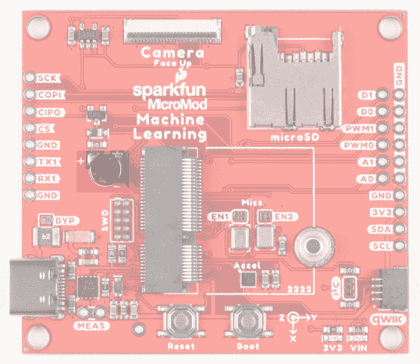
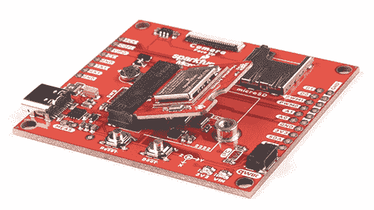
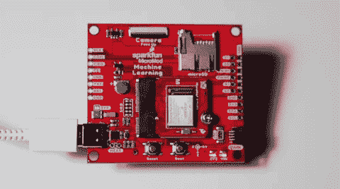
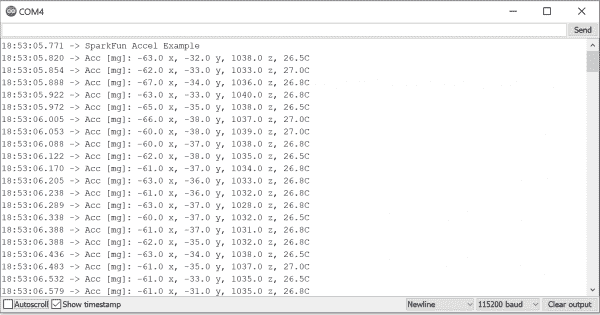

# MicroMod 机器学习载板连接指南

> 原文：<https://learn.sparkfun.com/tutorials/micromod-machine-learning-carrier-board-hookup-guide>

## 介绍

[MicroMod 机器学习载板](https://www.sparkfun.com/products/16400)结合了我们的 SparkFun Edge 板和 SparkFun Artemis 板的一些功能，但允许您自由探索 MicroMod 系列中的任何处理器，而不需要中央计算机或网络连接。TensorFlow 应用程序支持语音识别、持续语音命令、手势或图像识别。板载加速度计和 Qwiic 端口让您更加灵活。

让我们开始吧，好好看看我们能得到什么，并快速浏览几个例子！

 

将**添加到您的[购物车](https://www.sparkfun.com/cart)中！**

 **### [SparkFun MicroMod 机器学习载板](https://www.sparkfun.com/products/16400)

[In stock](https://learn.sparkfun.com/static/bubbles/ "in stock") DEV-16400

微电机机器学习载体结合了自由探索任何处理器的微电机产品线，而不需要 f。

$19.95[Favorited Favorite](# "Add to favorites") 20[Wish List](# "Add to wish list")** **[https://www.youtube.com/embed/4QUJWeSrzD0/?autohide=1&border=0&wmode=opaque&enablejsapi=1](https://www.youtube.com/embed/4QUJWeSrzD0/?autohide=1&border=0&wmode=opaque&enablejsapi=1)

### 所需材料

除了机器学习载板之外，您还需要一个处理器板来开始。这里我们使用 Artemis 处理器板，但也有许多其他的可供选择。

 

将**添加到您的[购物车](https://www.sparkfun.com/cart)中！**

 **### [SparkFun MicroMod SAMD51 处理器](https://www.sparkfun.com/products/16791)

[Out of stock](https://learn.sparkfun.com/static/bubbles/ "out of stock") DEV-16791

SparkFun MicroMod SAMD51 处理器板采用 32 位 ARM Cortex-M4F MCU，是一款功能强大的微控制器，封装在一个

$18.951[Favorited Favorite](# "Add to favorites") 8[Wish List](# "Add to wish list")**** 

将**添加到您的[购物车](https://www.sparkfun.com/cart)中！**

 **### [SparkFun MicroMod Artemis 处理器](https://www.sparkfun.com/products/16401)

[24 available](https://learn.sparkfun.com/static/bubbles/ "24 available") DEV-16401

该处理器具有 Artemis 模块，能够进行机器学习、蓝牙、I2C、GPIO、PWM、SPI，并打包以适应…

$14.95[Favorited Favorite](# "Add to favorites") 14[Wish List](# "Add to wish list")**** ****你还需要一根 USB-C 电缆将载体连接到你的计算机，如果你想在你的 MicroMod 项目中添加一些 Qwiic 分线点，你至少需要一根 Qwiic 电缆将它们连接在一起。以下是这两种电缆的一些选项:

 

将**添加到您的[购物车](https://www.sparkfun.com/cart)中！**

 **### [SparkFun Qwiic 线缆套件](https://www.sparkfun.com/products/15081)

[In stock](https://learn.sparkfun.com/static/bubbles/ "in stock") KIT-15081

为了更容易上手，我们用 50 毫米到 500 毫米的各种 Qwiic 电缆组装了 Qwiic 电缆套件…

$8.9516[Favorited Favorite](# "Add to favorites") 58[Wish List](# "Add to wish list")**** 

将**添加到您的[购物车](https://www.sparkfun.com/cart)中！**

 **### [可逆 USB A 转 C 线- 2m](https://www.sparkfun.com/products/15424)

[18 available](https://learn.sparkfun.com/static/bubbles/ "18 available") CAB-15424

这些 2 米长的电缆稍加修改后，就可以插入其端口，而不用考虑其在 U…

$8.951[Favorited Favorite](# "Add to favorites") 4[Wish List](# "Add to wish list")**** 

将**添加到您的[购物车](https://www.sparkfun.com/cart)中！**

 **### [USB 3.1 线 A 到 C - 3 脚](https://www.sparkfun.com/products/14743)

[In stock](https://learn.sparkfun.com/static/bubbles/ "in stock") CAB-14743

USB C 棒极了。但是，在我们将所有的集线器、充电器和端口转换为 USB C 之前，这是您要使用的电缆…

$5.504[Favorited Favorite](# "Add to favorites") 9[Wish List](# "Add to wish list")****** ******除了处理器和相关的电缆和附件，如果您想充分利用机器学习载板的功能，您还需要一个 microSD 卡:

 

将**添加到您的[购物车](https://www.sparkfun.com/cart)中！**

 **### [microSD 卡-16GB(10 类)](https://www.sparkfun.com/products/15051)

[22 available](https://learn.sparkfun.com/static/bubbles/ "22 available") COM-15051

这是一个 10 级 16GB microSD 存储卡，非常适合容纳单板计算机和多种…

$19.95[Favorited Favorite](# "Add to favorites") 4[Wish List](# "Add to wish list")** **### 推荐阅读

SparkFun MicroMod 生态系统是一种独特的方式，允许用户根据自己的需求定制他们的项目。你想通过无线信号(如蓝牙或 WiFi)发送你的天气数据吗？有一个微型处理器可以做到这一点。希望最大限度地提高效率和处理能力？你猜对了，有一个微模块处理器。

|  |
| *[微模式生态系统](https://www.sparkfun.com/micromod)* |

如果您不熟悉以下教程中涵盖的概念，我们还建议您浏览这些教程:

 [### MicroMod 入门](https://learn.sparkfun.com/tutorials/getting-started-with-micromod) Dive into the world of MicroMod - a compact interface to connect a microcontroller to various peripherals via the M.2 Connector 3 [### MicroMod Artemis 处理器板连接指南](https://learn.sparkfun.com/tutorials/micromod-artemis-processor-board-hookup-guide) Get started with the Artemis MicroMod Processor Board in this tutorial 0 [### 用 MicroMod 设计](https://learn.sparkfun.com/tutorials/designing-with-micromod) This tutorial will walk you through the specs of the MicroMod processor and carrier board as well as the basics of incorporating the MicroMod form factor into your own PCB designs 0

## 硬件概述

### 通用组件

大多数 SparkFun MicroMod 载体都有一些通用组件，所有 MicroMod 载体都有键控 M.2 MicroMod 连接器来插入您的处理器。下面的照片和列表概述了你可以在大多数 SparkFun MicroMod 载体上看到的一些组件。

*   **M.2 MicroMod 连接器** -这种特殊的键控 M.2 连接器允许您在机器学习载板上安装您选择的 MicroMod 处理器。
*   **USB-C 连接器** -连接到您的计算机，为您的处理器编程，也可以为您的 MicroMod 系统供电。
*   **3.3V 调节器** -提供调节后的 **3.3V** 和高达 **1A** 的电源。
*   qw IC 连接器 -标准 qw IC 连接器，因此您可以将其他 qw IC 设备添加到您的 MicroMod 系统中。
*   **启动/复位按钮** -按下按钮进入处理器板上的启动模式，并复位您的微模块电路。
*   **microSD 插槽** -插入 microSD 卡进行数据读写。

**Note:** While the MicroMod RP2040 Processor Board is designed to mate with M.2 Connectors that are populated on Carrier Boards, the RP2040 is not compatible specifically with the Machine Learning Carrier Board.

### 机器学习 MicroMod 载板特定组件

### 数字 MEMS 麦克风

有什么比一个麦克风更好？两个！

*   麦克风 1 支持 PDM 接口，默认启用。要禁用这个麦克风，切断 EN1 跳线。有关这款麦克风的更多信息，请参考此处的[数据表。](https://cdn.sparkfun.com/assets/0/5/1/d/e/SPH0641LM4H-1-952032.pdf)
*   麦克风 2 支持 I2S 接口，默认禁用。要启用 EN2，焊接跳线焊盘以闭合电路。有关这款麦克风的更多信息，请参考此处的[数据表。](https://cdn.sparkfun.com/assets/a/9/c/9/1/DS-000069-ICS-43434-v1.2.pdf)

### GPIO

在机器学习载板的两侧，我们划分了用于 UART、数字、模拟、脉宽调制和 SPI 的专用 PTH。您可能还注意到，我们在电路板的右侧包括了一个接地轨。

#### I ² C 特定 GPIO

此外，我们还打破了 I ² C SDA 和 SCL 线，用 3V3 和 GND 来完成您的 I ² C 功能。这些是主要的 I ² C 引脚——它们连接到 Qwiic 连接器。

### 加速计

LIS2DH12 是一款超低功耗、高性能、三轴线性加速度计，属于“femto”系列，具有数字 I ² C/SPI 串行接口标准输出。如果你需要这个小家伙的更多细节，请参考这里的[数据表](https://cdn.sparkfun.com/assets/e/8/c/3/a/lis2dh12_datasheet.pdf)。

### 相机连接器

有了这个 24 针连接器，您可以通过插入 [Himax CMOS 成像相机](https://www.sparkfun.com/products/15570)来为您的机器学习板添加图像识别功能。

### JTAG

需要断点级别调试的高级用户可以使用未填充的 JTAG 足迹。我们建议检查我们的 [JTAG 部分](https://www.sparkfun.com/categories/tags/jtag)的兼容公头和兼容的 JTAG 编程器和调试器。

### RTC 电池

我们包括一个 3V 锂充电电池作为备用电源。

### 针织套衫

#### VE 跳线

#### VIN 和 3V3 跳线

切断这些跳线将禁用电路板前面的 VIN 和 3V3 LEDs。

#### I ² C 跳线

如果你是菊花链多个 Qwiic 器件，你会想切断这个跳线；如果多个传感器连接到总线并使能上拉电阻，并联等效电阻可能会产生过强的上拉电阻，使总线无法正常工作。一般来说，如果总线上连接了多个器件，则除一对上拉电阻外，应禁用所有上拉电阻。要禁用上拉电阻，使用 X-acto 刀切断突出显示的跳线焊盘之间的连接。

#### 重置 PTH

需要外部复位按钮？这些 PTH 允许您连接到复位功能。

### 机器学习微型马达载体引脚功能

**Note:** You may not recognize the COPI/CIPO labels for SPI pins. SparkFun is working to move away from using MISO/MOSI to describe signals between the controller and the peripheral. Check out [this page](https://www.sparkfun.com/spi_signal_names) for more on our reasoning behind this change.

*   [机器学习载体引脚表](#MachineLearningCarrier)
*   [微模块通用引脚表](#MMGen)
*   [MicroMod 通用引脚描述](#MMDescript)

| **音频** | **UART** | **GPIO/总线** | **I ² C** | **SDIO** 的缩写形式 | **SPI0** | **专用** |

| 功能 | 底部
销 | 顶部
销 | 功能 |
|  |  |  | (未连接) |  | **75** | GND |  |  |  |
|  |  |  | 3.3V | **74** | **73** | G5 /总线 5 |  |  |  |
|  |  |  | RTC _ 3V _ 电池 | **72** | **71** | G6 /总线 6 |  |  |  |
|  |  | SPI_CS1# | SDIO _ 数据 3(输入输出) | **70** | **69** | G7 /总线 7 |  |  |  |
|  |  |  | SDIO _ 数据 2(输入输出) | **68** | **67** | 八国集团(Group of Eight) |  |  |  |
|  |  |  | SDIO _ 数据 1(输入输出) | **66** | **65** | G9 | ADC_D- | CAM_HSYNC |  |
|  |  | 睡吧 | SDIO _ 数据 0(输入输出) | **64** | **63** | G10 | ADC_D+ | CAM_VSYNC |  |
|  |  | SPI COPI1 | SDIO_CMD (I/O) | **62** | **61** | 睡吧 |  |  |  |
|  |  | SPI SCK1 | SDIO_SCK(或) | **60** | **59** | SPI_COPI (O) | LED_DAT |  |  |
|  |  |  | AUD_MCLK (O) | **58** | **57** | SPI_SCK(或) | LED |  |  |
| 凯姆 | PCM_OUT | I2S 出局 | AUD_OUT | **56** | **55** | SPI_CS# |  |  |  |
| cam _ pclk | PCM_IN | I2S 因 | 澳元 _ 美元 | **54** | **53** | I2C_SCL1(输入/输出) |  |  |  |
| PDM_DATA | PCM_SYNC | i2s WS | AUD_LRCLK | **52** | **51** | I2C_SDA1(输入输出) |  |  |  |
| PDM_CLK | PCM_CLK | SCK i2s | 奥德 _BCLK | **50** | **49** | BATT_VIN / 3 (I - ADC) (0 至 3.3V) |  |  |  |
|  |  |  | G4 /总线 4 | **48** | **47** | PWM1 |  |  |  |
|  |  |  | G3 /总线 3 | **46** | **45** | GND |  |  |  |
|  |  |  | G2 /总线 2 | **44** | **43** | CAN_TX |  |  |  |
|  |  |  | G1 /巴士 1 | **42** | **41** | CAN_RX |  |  |  |
|  |  |  | G0 /总线 0 | **40** | **39** | GND |  |  |  |
|  |  |  | 一流的 | **38** | **37** | USBHOST_D- |  |  |  |
|  |  |  | GND | **36** | **35** | USBHOST_D+ |  |  |  |
|  |  |  | A0 | **34** | **33** | GND |  |  |  |
|  |  |  | PWM0 | **32** | **31** | 模块密钥 |  |  |  |
|  |  |  | 模块密钥 | **30** | **29** | 模块密钥 |  |  |  |
|  |  |  | 模块密钥 | **28** | **27** | 模块密钥 |  |  |  |
|  |  |  | 模块密钥 | **26** | **25** | 模块密钥 |  |  |  |
|  |  |  | 模块密钥 | **24** | **23** | SWDIO |  |  |  |
|  |  |  | UART_TX2 (O) | **22** | **21** | SWDCK |  |  |  |
|  |  |  | UART_RX2 (I) | **20** | **19** | UART_RX1 (I) |  |  |  |
|  |  | CAM_TRIG | D1 | **18** | **17** | UART_TX1 (0) |  |  |  |
|  |  |  | I2C INT # | **16** | **15** | UART_CTS1 (I) |  |  |  |
|  |  |  | S7-1200 可编程控制器 | **14** | **13** | UART_RTS1 (O) |  |  |  |
|  |  |  | I2C SDA(输入/输出) | **12** | **11** | 行李箱(I 型开式排放) |  |  |  |
|  |  |  | D0 | **10** | **9** | USB_VIN |  |  |  |
|  |  | 浅部白色甲癣 | G11 | **8** | **7** | GND |  |  |  |
|  |  |  | 复位# (I -开漏) | **6** | **5** | USB_D- |  |  |  |
|  |  |  | 3.3V_EN | **4** | **3** | USB_D+ |  |  |  |
|  |  |  | 3.3V | **2** | **1** | GND |  |  |  |

| 功能 | 底部
销 | 顶部
销 | 功能 |
|  | (未连接) |  | **75** | GND |  |
|  |  | **74** | **73** | 相机 _D5 |  |
|  | RTC_3V | **72** | **71** | 相机 _D6 |  |
|  |  | **70** | **69** | 相机 _D7 |  |
|  |  | **66** | **65** | 相机 _ 同步 |  |
|  |  | **64** | **63** | 相机 _ 垂直同步 |  |
|  |  | **62** | **61** | 睡吧，婊子 |  |
|  |  | **60** | **59** | SPI_COPI |  |
|  |  | **58** | **57** | SPI |  |
|  | CAMERA_MCLK | **56** | **55** | SPI_CS |  |
| 照相机 _PCLK | i2s SD | **54** | **53** |  |  |
| PDM_DAT | i2s WS | **52** | **51** |  |  |
| PDM_CLK | SCK i2s | **50** | **49** | BATT_VIN/3 |  |
|  | 相机 _D4 | **48** | **47** | PWM1 | VDD 卡姆 |
|  | 相机 _D3 | **46** | **45** |  |  |
|  | 相机 _D2 | **44** | **43** |  |  |
|  | 相机 _D1 | **42** | **41** |  |  |
|  | 相机 _D0 | **40** | **39** |  |  |
|  | 一流的 | **38** | **37** |  |  |
|  | A0 | **34** | **33** |  |  |
|  | PWM0 | **32** | **31** |  |  |
|  |  | **24** | **23** | SWDIO |  |
|  |  | **22** | **21** | SWDCK |  |
|  |  | **20** | **19** | RX1 |  |
| 相机 _ 触发器 | D1 | **18** | **17** | TX1 |  |
|  | CAMERA_INT | **16** | **15** |  |  |
|  | 我在 SCL 的第二个城市 | **14** | **13** |  |  |
|  | I ² C_SDA | **12** | **11** | 靴子 |  |
| HEADER_CS | D0 | **10** | **9** | 车辆识别号码 |  |
|  |  | **8** | **7** | GND |  |
|  | 重置 | **6** | **5** | USB_D- |  |
|  | 3.3V_EN | **4** | **3** | USB_D+ |  |
|  | 3.3V | **2** | **1** | GND |  |

| 信号群 | 信号 | 输入－输出 | 描述 | 电压 |
| 力量 | 3.3V | 我 | 3.3V 电源 | 3.3V |
| GND |  | 返回电流路径 | 0V |
| USB_VIN | 我 | USB VIN 符合 USB 2.0 规范。连接到处理器板上要求 5V USB 功能的引脚 | 4.8-5.2V |
| RTC _ 3V _ 电池 | 我 | 3V 由外部纽扣电池或迷你电池提供。最大功耗=100μA，连接到引脚，在掉电期间保持 RTC。可以左 NC。 | 3V |
| 3.3V_EN | O | 控制载板的主电压调节器。1V 以上的电压将启用 3.3V 电源路径。 | 3.3V |
| BATT_VIN/3 | 我 | 载板原始电压超过 3。1/3 电阻分压器在载板上实现。根据需要放大整个 0-3.3V 范围的模拟信号 | 3.3V |
| 重置 | 重置 | 我 | 处理器的输入。处理器板上带上拉电阻的开漏。拉低复位处理器。 | 3.3V |
| 靴子 | 我 | 处理器的输入。处理器板上带上拉电阻的开漏。拉低使处理器进入特殊启动模式。可以左 NC。 | 3.3V |
| 通用串行总线 | USB_D | 输入－输出 | USB 数据。符合 USB 2.0 规范的差分串行数据接口。如果编程需要 UART，USB 必须连接到处理器板上的 USB 转串行转换 IC。 |  |
| USB 主机 | USBHOST_D | 输入－输出 | 对于支持 USB 主机模式的处理器。USB 数据。符合 USB 2.0 规范的差分串行数据接口。可以左 NC。 |  |
| 能 | CAN_RX | 我 | CAN 总线接收数据。 | 3.3V |
| CAN_TX | O | CAN 总线传输数据。 | 3.3V |
| 通用非同步收发传输器(Universal Asynchronous Receiver/Transmitter) | UART_RX1 | 我 | UART 接收数据。 | 3.3V |
| UART_TX1 | O | UART 发送数据。 | 3.3V |
| UART_RTS1 | O | UART 准备发送。 | 3.3V |
| UART_CTS1 | 我 | UART 清零发送。 | 3.3V |
| UART_RX2 | 我 | 第二个 UART 接收数据。 | 3.3V |
| UART_TX2 | O | 第二个 UART 发送数据。 | 3.3V |
| I2C | i2c _ scl | 输入－输出 | I ² C 时钟。载板上拉的开漏。 | 3.3V |
| I2C SDA | 输入－输出 | I ² C 数据。载板上有上拉电阻的开漏 | 3.3V |
| I2C INT # | 我 | 从载板到处理器的中断通知。载板上拉的开漏。低电平有效 | 3.3V |
| I2C_SCL1 号文件 | 输入－输出 | 2nd I ² C 时钟。载板上拉的开漏。 | 3.3V |
| I2C sda 1 | 输入－输出 | 2nd I ² C 数据。载板上拉的开漏。 | 3.3V |
| 精力 | SPI_COPI | O | SPI 控制器输出/外设输入。 | 3.3V |
| 睡吧，婊子 | 我 | SPI 控制器输入/外设输出。 | 3.3V |
| SPI | O | SPI 时钟。 | 3.3V |
| SPI_CS# | O | SPI 片选。低电平有效。如果不使用硬件 CS，可以路由到 GPIO。 | 3.3V |
| SPI/SDIO | SPI_SCK1/SDIO_CLK | O | 第二个 SPI 时钟。次要用途是 SDIO 钟。 | 3.3V |
| SPI_COPI1/SDIO_CMD | 输入－输出 | 第二 SPI 控制器输出/外设输入。次要用途是 SDIO 命令界面。 | 3.3V |
| spi _ 塞浦路斯 1/SDIO_DATA0 | 输入－输出 | 第二个 SPI 外设输入/控制器输出。次要用途是 SDIO 数据交换位 0。 | 3.3V |
| SDIO_DATA1 | 输入－输出 | SDIO 数据交换位 1。 | 3.3V |
| SDIO_DATA2 | 输入－输出 | SDIO 数据交换位 2。 | 3.3V |
| SPI _ CS1/SDIO _ 数据 3 | 输入－输出 | 第二个 SPI 芯片选择。次要用途是 SDIO 数据交换位 3。 | 3.3V |
| 声音的 | 奥地利马克 | O | 音频主时钟。 | 3.3V |
| AUD _ OUT/PCM _ OUT/i2s _ OUT/CAM _ MCLK | O | 音频数据输出。PCM 同步数据输出。I2S 串行数据输出。相机主时钟。 | 3.3V |
| 澳大利亚/PCM _ IN/i2s _ IN/卡姆 _PCLK | 我 | 音频数据输入。PCM 同步数据输入。I2S 串行数据输入。照相机外围时钟。 | 3.3V |
| AUD _ LRC lk/PCM _ SYNC/i2s _ WS/PDM _ DATA | 输入－输出 | 音频左/右时钟。PCM 同步数据同步。I2S 单词精选。PDM 数据。 | 3.3V |
| 澳大利亚 BCLK/CLK PCM/CLK i2s/CLK PDM | O | 音频位时钟。PCM 时钟。I2S 连续串行时钟。PDM 时钟。 | 3.3V |
| 社署 | SWDIO | 输入－输出 | 串行线调试 I/O。如果处理器板支持 SWD，则连接。可以左 NC。 | 3.3V |
| SWDCK | 我 | 串行线调试时钟。如果处理器板支持 SWD，则连接。可以左 NC。 | 3.3V |
| 物理输出核心 | A0 | 我 | 模数转换器 0。根据需要放大模拟信号，以实现完整的 0-3.3V 范围。 | 3.3V |
| 一流的 | 我 | 模数转换器 1。根据需要放大模拟信号，以实现完整的 0-3.3V 范围。 | 3.3V |
| 脉宽调制（pulse-width modulating 的缩写） | PWM0 | O | 脉宽调制输出 0。 | 3.3V |
| PWM1 | O | 脉宽调制输出 1。 | 3.3V |
| 数字的 | D0 | 输入－输出 | 通用数字输入/输出引脚。 | 3.3V |
| D1/CAM_TRIG | 输入－输出 | 通用数字输入/输出引脚。相机触发器。 | 3.3V |
| 常规/公共汽车 | G0/总线 0 | 输入－输出 | 通用引脚。任何未使用的处理器引脚都应分配给 Gx，具有 ADC + PWM 功能的引脚优先(0、1、2 等。)岗位。目的是保证各 ADC/PWM/数字引脚上的 PWM、ADC 和数字引脚功能。Gx 引脚不保证 ADC/PWM 功能。另一种用途是引脚可以支持快速读/写 8 位或 4 位宽总线。 | 3.3V |
| G1/巴士 1 | 输入－输出 | 3.3V |
| G2/总线 2 | 输入－输出 | 3.3V |
| G3/总线 3 | 输入－输出 | 3.3V |
| G4/总线 4 | 输入－输出 | 3.3V |
| G5/总线 5 | 输入－输出 | 3.3V |
| g6/总线 6 | 输入－输出 | 3.3V |
| G7/总线 7 | 输入－输出 | 3.3V |
| 八国集团(Group of Eight) | 输入－输出 | 通用引脚 | 3.3V |
| G9/ADC_D-/CAM_HSYNC | 输入－输出 | 差分 ADC 输入(如有)。相机水平同步。 | 3.3V |
| G10/ADC_D+/CAM_VSYNC | 输入－输出 | 差分 ADC 输入(如有)。相机垂直同步。 | 3.3V |
| G11/SWO | 输入－输出 | 通用引脚。串行线输出 | 3.3V |

### 电路板尺寸

机器学习载板的尺寸为 2.3 英寸乘 2.05 英寸。

## 硬件连接

要开始使用机器学习载板，您需要一个兼容的处理器板。这里我们使用的是 MicroMod Artemis 处理器板。

**Note:** While the MicroMod RP2040 Processor Board is designed to mate with M.2 Connectors that are populated on Carrier Boards, the RP2040 is not compatible specifically with the Machine Learning Carrier Board.

将 MicroMod Artemis 处理器板的顶部键与机器学习载板的螺丝端子对齐，并将板倾斜到插槽中。将电路板以一定角度插入 M.2 连接器。

**Note:** There is no way to insert the processor backward since the key prevents it from mating with the M.2 connector and as an extra safeguard to prevent inserting a processor that matches the key, the mounting screw is offset so you will not be able to secure an improperly connected processor board.

处理器板将以一定角度竖起，如下图所示:

一旦板在插座中，轻轻按住 MicroMod 处理器板并用 Phillip 头拧紧螺丝。

一旦电路板被固定，你组装好的 MicroMod 系统看起来应该和下图相似！

### 连接一切

插入并固定好处理器后，就可以使用载体上的 USB-C 连接器将载体板连接到计算机了。根据您选择的运营商和您已经安装的驱动程序，您可能需要安装驱动程序。

**Note:** Make sure that for whatever processor board you choose, you have the correct board definitions installed.

For this particular tutorial, we are using the MicroMod Artemis Processor Board. Board definitions for this processor board can be found in the [Software Setup and Programming](https://learn.sparkfun.com/tutorials/micromod-artemis-processor-board-hookup-guide#software-setup) section of the [MicroMod Artemis Processor Board Hookup Guide](https://learn.sparkfun.com/tutorials/micromod-artemis-processor-board-hookup-guide).

If you are using a different processor board, go to our [MicroMod Processor Boards](https://www.sparkfun.com/micromod#processor_boards) landing page, find your processor board, and head on over to that tutorial for help installing your board definition.

## 示例 1:眨眼

**Note:** This example assumes you are using the latest version of the Arduino IDE on your desktop. If this is your first time using Arduino, please review our tutorial on [installing the Arduino IDE.](https://learn.sparkfun.com/tutorials/installing-arduino-ide) If you have not previously installed an Arduino library, please check out our [installation guide.](https://learn.sparkfun.com/tutorials/installing-an-arduino-library)

要开始上传代码并使用您的机器学习载板，请确保您在**工具** > **板**菜单下选择了 MicroMod Artemis 板定义(或您选择使用的任何处理器)。

*Having a hard time seeing? Click the image for a closer look.*

然后在**工具** > **端口**菜单下选择你的串口。

### 加载闪烁

让我们从一些基本的东西开始——让一个 LED 闪烁。转到**档**->-**例题**->-**01。基础** - > **眨眼**。

*Having a hard time seeing? Click the image for a closer look.*

一切设置正确后，上传代码！一旦代码完成传输，您应该看到 Artemis 处理器板上的 STAT LED 开始闪烁！

If the blue LED remains off, it's probably still sitting in the bootloader. After uploading a sketch, you may need to **tap the reset button** to get your MicroMod Artemis to run the sketch.

看看所有的眨眼！

## 示例 2:加速度计

**Note:** This example assumes you are using the latest version of the Arduino IDE on your desktop. If this is your first time using Arduino, please review our tutorial on [installing the Arduino IDE.](https://learn.sparkfun.com/tutorials/installing-arduino-ide) If you have not previously installed an Arduino library, please check out our [installation guide.](https://learn.sparkfun.com/tutorials/installing-an-arduino-library)

SparkFun 编写了一个库，可用于该板上的 LIS2DH12 加速度计。您可以通过 Arduino 库管理器搜索“LIS2DH12”来获得该库。找到 SparkFun 电子写的，安装最新版本。如果您喜欢手动下载库，您可以从 GitHub 资源库中获取它们。我们已经在[参考资料和进一步的](https://learn.sparkfun.com/tutorials/micromod-machine-learning-carrier-board-hookup-guide#resources-and-going-further)部分链接了加速度计的数据手册，但是如果你想方便地使用它，你也可以在这里参考它[。](https://cdn.sparkfun.com/assets/e/8/c/3/a/lis2dh12_datasheet.pdf)

[SparkFun LIS2DH12 Arduino Library GitHub](https://github.com/sparkfun/SparkFun_LIS2DH12_Arduino_Library/archive/master.zip)

安装好库后，导航到位于**文件**->-**示例**->-**spark fun lis2d h12 Arduino 库**下的示例。让我们加载**example 1 _ basicreards**让您开始。

*Having a hard time seeing? Click the image for a closer look.*

确保您选择了正确的板和端口，然后上传代码。一旦代码传输完毕，**打开[串行监视器](https://learn.sparkfun.com/tutorials/terminal-basics)** 并将波特率设置为 **115200** 。你应该看到 x，y 和 z 位置飞过，告诉你加速度计正在读取的方向！

*Having a hard time seeing? Click the image for a closer look.*

## 解决纷争

**Not working as expected and need help?**

If you need technical assistance and more information on a product that is not working as you expected, we recommend heading on over to the [SparkFun Technical Assistance](https://www.sparkfun.com/technical_assistance) page for some initial troubleshooting.

[SparkFun Technical Assistance Page](https://www.sparkfun.com/technical_assistance)

If you don't find what you need there, the [SparkFun Forums: MicroMod](https://forum.sparkfun.com/viewforum.php?f=180) are a great place to find and ask for help. If this is your first visit, you'll need to [create a Forum Account](https://forum.sparkfun.com/ucp.php?mode=register) to search product forums and post questions.

[SparkFun Forums: MicroMod](https://forum.sparkfun.com/viewforum.php?f=180)

## 资源和更进一步

想要 SparkFun 机器学习载体板的更多信息？查看这些链接！

*   [示意图(PDF)](https://cdn.sparkfun.com/assets/1/f/9/5/f/16400_SparkFun_MicroMod_Machine_Learning_Carrier_Board_Schematic.pdf)
*   [老鹰文件(ZIP)](https://cdn.sparkfun.com/assets/1/2/9/f/5/16400_SparkFun_MicroMod_Machine_Learning_Carrier_Board_EagleFiles.zip)
*   [GitHub 硬件回购](https://github.com/sparkfun/MicroMod_Machine_Learning_Carrier)
*   [加速度计数据表](https://cdn.sparkfun.com/assets/e/8/c/3/a/lis2dh12_datasheet.pdf)
*   [默认 PDM 麦克风数据表](https://cdn.sparkfun.com/assets/0/5/1/d/e/SPH0641LM4H-1-952032.pdf)
*   [麦克风 2 I2S 数据表](https://cdn.sparkfun.com/assets/a/9/c/9/1/DS-000069-ICS-43434-v1.2.pdf)

MicroMod 文档:

*   [micro mod 入门](https://learn.sparkfun.com/tutorials/getting-started-with-micromod)
*   [用微模块设计](https://learn.sparkfun.com/tutorials/designing-with-micromod)
*   [MicroMod 信息页面](https://www.sparkfun.com/micromod)
*   [MicroMod 论坛](https://forum.sparkfun.com/viewforum.php?f=180)

使用您的机器学习载板寻找一些项目灵感？下面的教程可以帮你入门！

 [### 微型数据记录载板连接指南](https://learn.sparkfun.com/tutorials/micromod-data-logging-carrier-board-hookup-guide) Get started with some customizable MicroMod data logging with the Data Logging Carrier Board.[Favorited Favorite](# "Add to favorites") 0 [### MicroMod Alorium Sno M2 处理器板连接指南](https://learn.sparkfun.com/tutorials/micromod-alorium-sno-m2-processor-board-hookup-guide) Get started with the MicroMod Alorium Sno M2 Processor Board 1 [### MicroMod GNSS 功能板- ZED-F9P 连接指南](https://learn.sparkfun.com/tutorials/micromod-gnss-function-board---zed-f9p-hookup-guide) Add millimeter precision location data to your MicroMod project with this guide for the SparkFun MicroMod GNSS Function Board - ZED-F9P.[Favorited Favorite](# "Add to favorites") 1 [### MicroMod Qwiic Pro 套件项目指南](https://learn.sparkfun.com/tutorials/micromod-qwiic-pro-kit-project-guide) The MicroMod Qwiic Pro Kit was designed to allow users to get started with Arduino without the need for soldering or a breadboard. We've included three inputs (a joystick, accelerometer, and proximity sensor) and one display that can be daisy chained to the MicroMod SAMD51 Processor Board.[Favorited Favorite](# "Add to favorites") 0**************