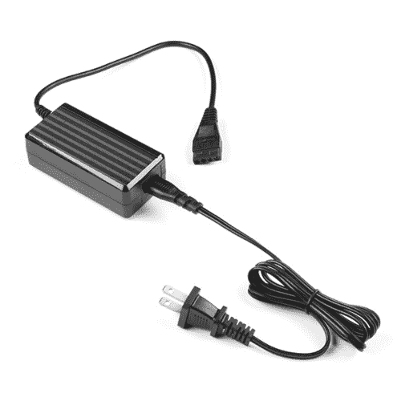
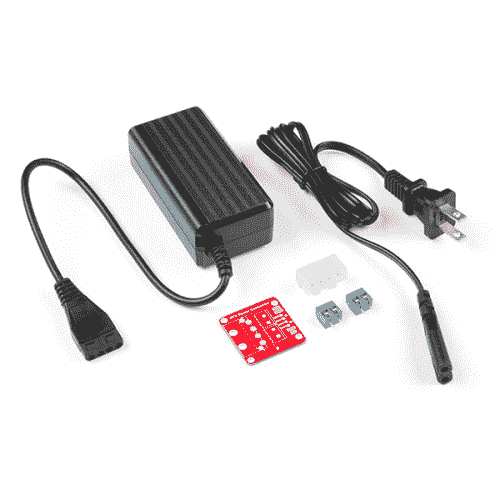

# 12V/5V 电源连接指南

> 原文：<https://learn.sparkfun.com/tutorials/12v5v-power-supply-hookup-guide>

## 介绍

[12V/5V (2A)电源](https://www.sparkfun.com/products/15664)非常适合为微控制器和 led 供电。在本教程中，我们将使用两个插头插孔适配器替换电源的 molex 连接器。

 

将**添加到您的[购物车](https://www.sparkfun.com/cart)中！**

### [电源- 12V/5V (2A)](https://www.sparkfun.com/products/15664)

[In stock](https://learn.sparkfun.com/static/bubbles/ "in stock") TOL-15664

这种 2A“笔记本电脑砖”电源输出 5V 和 12v 直流，并终止于 4 针 ATX 连接器。

$11.953[Favorited Favorite](# "Add to favorites") 5[Wish List](# "Add to wish list")** **### 所需材料

要跟随本教程，您将需要以下材料。你可能不需要所有的东西，这取决于你拥有什么。将它添加到您的购物车，通读指南，并根据需要调整购物车。左边的套件是最容易连接的。右边的愿望列表是给那些对破解电源感兴趣的人的。

 

将**添加到您的[购物车](https://www.sparkfun.com/cart)中！**

### [【spark fun ATX 电源连接器转接套件- 12V/5V (4 针)](https://www.sparkfun.com/products/15701)

[Only 11 left!](https://learn.sparkfun.com/static/bubbles/ "only 11 left!") KIT-15701

ATX 电源连接器从一个墙壁适配器上为您的 12V 和 5V 设备断开标准的 4 针计算机外围设备端口…

$19.504[Favorited Favorite](# "Add to favorites") 16[Wish List](# "Add to wish list")****