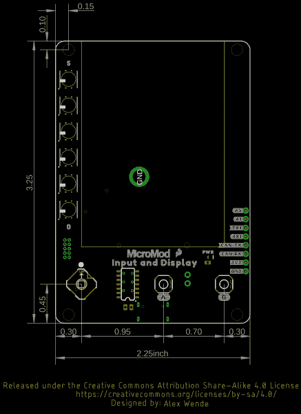

# SparkFun MicroMod 输入和显示载板连接指南

> 原文：<https://learn.sparkfun.com/tutorials/sparkfun-micromod-input-and-display-carrier-board-hookup-guide>

## 介绍

介绍 [SparkFun MicroMod 输入和显示载板](https://www.sparkfun.com/products/16985)！这个漂亮的小板子可以和所有 SparkFun MicroMod 处理器一起工作，所以你可以用众多处理器中的一个来创建你自己的显示器。

载板包括 6 个 APA102 可寻址 led、6 个输入按钮、板载电压调节、2.4 英寸 TFT 显示屏、IO 连接器和一个蜂鸣器。此外，还有一个 microSD 卡插槽来存储和读取数据。

让我们开始吧，看看我们能做些什么！

 

将**添加到您的[购物车](https://www.sparkfun.com/cart)中！**

 **### [SparkFun 微电机输入显示载板](https://www.sparkfun.com/products/16985)

[22 available](https://learn.sparkfun.com/static/bubbles/ "22 available") DEV-16985

借助 2.4 英寸 TFT 显示屏、6 个可寻址 led、板载稳压器、6 针 I…

$59.953[Favorited Favorite](# "Add to favorites") 15[Wish List](# "Add to wish list")** **[https://www.youtube.com/embed/4QUJWeSrzD0/?autohide=1&border=0&wmode=opaque&enablejsapi=1](https://www.youtube.com/embed/4QUJWeSrzD0/?autohide=1&border=0&wmode=opaque&enablejsapi=1)

### 所需材料

像我们所有的 MicroMod 载板一样，不包含处理器，但您可以将您选择的处理器板插入载体上的 MicroMod M.2 连接器。以下是为您的处理器选择的几个选项:

 

将**添加到您的[购物车](https://www.sparkfun.com/cart)中！**

 **### [SparkFun MicroMod SAMD51 处理器](https://www.sparkfun.com/products/16791)

[Out of stock](https://learn.sparkfun.com/static/bubbles/ "out of stock") DEV-16791

SparkFun MicroMod SAMD51 处理器板采用 32 位 ARM Cortex-M4F MCU，是一款功能强大的微控制器，封装在一个

$18.951[Favorited Favorite](# "Add to favorites") 8[Wish List](# "Add to wish list")**** 

将**添加到您的[购物车](https://www.sparkfun.com/cart)中！**

 **### [SparkFun MicroMod ESP32 处理器](https://www.sparkfun.com/products/16781)

[In stock](https://learn.sparkfun.com/static/bubbles/ "in stock") WRL-16781

该板将 Espressif 的 ESP32 与我们的 M.2 连接器接口相结合，为我们的 Micro…

$16.951[Favorited Favorite](# "Add to favorites") 6[Wish List](# "Add to wish list")**** 

将**添加到您的[购物车](https://www.sparkfun.com/cart)中！**

 **### [SparkFun MicroMod Artemis 处理器](https://www.sparkfun.com/products/16401)

[24 available](https://learn.sparkfun.com/static/bubbles/ "24 available") DEV-16401

该处理器具有 Artemis 模块，能够进行机器学习、蓝牙、I2C、GPIO、PWM、SPI，并打包以适应…

$14.95[Favorited Favorite](# "Add to favorites") 14[Wish List](# "Add to wish list")****** ******你还需要一根 USB-C 电缆将载体连接到你的计算机，如果你想在你的 MicroMod 项目中添加一些 Qwiic 分线点，你至少需要一根 Qwiic 电缆将它们连接在一起。以下是这两种电缆的一些选项:

 

将**添加到您的[购物车](https://www.sparkfun.com/cart)中！**

 **### [SparkFun Qwiic 线缆套件](https://www.sparkfun.com/products/15081)

[In stock](https://learn.sparkfun.com/static/bubbles/ "in stock") KIT-15081

为了更容易上手，我们用 50 毫米到 500 毫米的各种 Qwiic 电缆组装了 Qwiic 电缆套件…

$8.9516[Favorited Favorite](# "Add to favorites") 58[Wish List](# "Add to wish list")**** 

将**添加到您的[购物车](https://www.sparkfun.com/cart)中！**

 **### [可逆 USB A 转 C 线- 2m](https://www.sparkfun.com/products/15424)

[18 available](https://learn.sparkfun.com/static/bubbles/ "18 available") CAB-15424

这些 2 米长的电缆稍加修改后，就可以插入其端口，而不用考虑其在 U…

$8.951[Favorited Favorite](# "Add to favorites") 4[Wish List](# "Add to wish list")**** 

将**添加到您的[购物车](https://www.sparkfun.com/cart)中！**

 **### [USB 3.1 线 A 到 C - 3 脚](https://www.sparkfun.com/products/14743)

[In stock](https://learn.sparkfun.com/static/bubbles/ "in stock") CAB-14743

USB C 棒极了。但是，在我们将所有的集线器、充电器和端口转换为 USB C 之前，这是您要使用的电缆…

$5.504[Favorited Favorite](# "Add to favorites") 9[Wish List](# "Add to wish list")****** ******除了处理器和相关的电缆和附件，如果您想要充分利用输入和显示载板的功能，您还需要一个 microSD 卡:

 

将**添加到您的[购物车](https://www.sparkfun.com/cart)中！**

 **### [microSD 卡-16GB(10 类)](https://www.sparkfun.com/products/15051)

[22 available](https://learn.sparkfun.com/static/bubbles/ "22 available") COM-15051

这是一个 10 级 16GB microSD 存储卡，非常适合容纳单板计算机和多种…

$19.95[Favorited Favorite](# "Add to favorites") 4[Wish List](# "Add to wish list")** **### 推荐阅读

SparkFun MicroMod 生态系统是一种独特的方式，允许用户根据自己的需求定制他们的项目。您想通过无线信号(如蓝牙或 WiFi)发送数据吗？有一个微型处理器可以做到这一点。希望最大限度地提高效率和处理能力？你猜对了，有一个微模块处理器。如果你不熟悉 MicroMod 系统，请看这里:

|  |
| *[微模式生态系统](https://www.sparkfun.com/micromod)* |

如果您不熟悉以下教程中涵盖的概念，我们还建议您浏览这些教程:

 [### MicroMod 入门](https://learn.sparkfun.com/tutorials/getting-started-with-micromod) Dive into the world of MicroMod - a compact interface to connect a microcontroller to various peripherals via the M.2 Connector 3 [### 用 MicroMod 设计](https://learn.sparkfun.com/tutorials/designing-with-micromod) This tutorial will walk you through the specs of the MicroMod processor and carrier board as well as the basics of incorporating the MicroMod form factor into your own PCB designs 0 [### MicroMod ESP32 处理器板连接指南](https://learn.sparkfun.com/tutorials/micromod-esp32-processor-board-hookup-guide) A short hookup guide to get started with the SparkFun MicroMod ESP32 Processor Board.[Favorited Favorite](# "Add to favorites") 1

## 硬件概述

在本节中，我们将介绍 MicroMod 输入和显示载板中包含的各种硬件和传感器。

### 通用组件

大多数 SparkFun MicroMod 载体都有一些通用组件，所有 MicroMod 载体都有键控 M.2 MicroMod 连接器来插入您的处理器。下面的照片和列表概述了你可以在大多数 SparkFun MicroMod 载体上看到的一些组件。

*   **M.2 MicroMod 连接器** -这种特殊的键控 M.2 连接器让您可以在输入&显示载板上安装您选择的 MicroMod 处理器。
*   **USB-C 连接器** -连接到您的计算机，为您的处理器编程，也可以为您的 MicroMod 系统供电。
*   **3.3V 调节器** -提供调节后的 **3.3V** 和高达 **1A** 的电源。
*   qw IC 连接器 -标准 qw IC 连接器，因此您可以将其他 qw IC 设备添加到您的 MicroMod 系统中。
*   **启动/复位按钮** -按下按钮进入处理器板上的启动模式，并复位您的微模块电路。**需要更多信息- LAC**
*   **microSD 插槽** -插入 microSD 卡进行数据读写。

### 力量

输入和显示载板通过 USB-C 连接器接受从 **2.7V - 6V** 的输入电压范围。我们集成了一个功率调节电路，用于限制功率敏感电路和 Qwiic 连接器的电压。

### 输入和显示载板特定组件

#### 阿迪那 84 号

我们已经用 Atmel 的 ATtiny84 填充了这个载板，带有 8kB 的可编程闪存。这个小家伙被预编程为通过 I ² C 与处理器通信，以读取按钮按压。

#### TFT 显示器

4DLCD 的 24320240-IPS 是一款彩色有源矩阵 LCD 模块，集成了非晶硅 TFT(薄膜晶体管)。模块显示面积为 2.4 英寸，包含 240 x 320 像素。

**Note:** IPS displays have higher display quality, better colors, and much better viewing angles than their non-IPS counterparts.

#### 发光二极管

输入和显示载板有 6 个可寻址的 APA102 LEDs。

#### 输入按钮

按钮按钮，谁拿了按钮？我们有。我们有两个输入按钮(A 和 B)和一个 5 向开关，允许您浏览 UI 或玩板载游戏。

#### JTAG 调试

我们为需要断点级别调试的更高级用户填充了 JTAG 足迹。我们建议检查我们的 [JTAG 部分](https://www.sparkfun.com/categories/tags/jtag)的兼容 JTAG 编程器和调试器。

### 针织套衫

#### I ² C 跳线

如果你是菊花链多个 Qwiic 器件，你会想切断这个跳线；如果多个传感器连接到总线并使能上拉电阻，并联等效电阻可能会产生过强的上拉电阻，使总线无法正常工作。一般来说，如果总线上连接了多个器件，则除一对上拉电阻外，应禁用所有上拉电阻。要禁用上拉电阻，请使用 X-acto 刀切断下面突出显示的两个跳线焊盘之间的连接。

#### 压水堆跳线

切断此跳线将禁用主板前面的“电源”LED。

#### 3V3CTRL 跳线

许多 MicroMod 载板都有一个 RTC 备用电池，作为标准化电压调节电路的一部分，我们包括一个 3V3 跳线，当关闭时，您可以控制 3V3 控制调节器。这关闭了 3V3 轨道上的所有东西，但是电池保持处理器清醒。输入和显示载板没有备用电池，因此该跳线应保持开路。

#### BYP 跳线

如果你真的，真的，真的需要更多的电力，关闭这个跳线将绕过 2A 保险丝。关闭风险自担！

#### 测量跳线

想测量流经电路的电流吗？切断这些 PTH 焊盘之间的走线，以便用数字万用表测量电流。

### 引脚排列

**Note:** You may not recognize the COPI/CIPO labels for SPI pins. SparkFun is working to move away from using MISO/MOSI to describe signals between the controller and the peripheral. Check out [this page](https://www.sparkfun.com/spi_signal_names) for more on our reasoning behind this change.

*   [输入&显示载板引出线表](#InputDisplay)
*   [微模块通用引脚表](#MMGen)
*   [MicroMod 通用引脚描述](#MMDescript)

| **音频** | **UART** | **GPIO/总线** | **I ² C** | **SDIO** 的缩写形式 | **SPI** | **专用** |

| 功能 | 底部
销 | 顶部
销 | 功能 |
|  |  |  | (未连接) |  | **75** | GND |  |  |  |
|  |  |  | 3.3V | **74** | **73** | G5 /总线 5 |  |  |  |
|  |  |  | RTC _ 3V _ 电池 | **72** | **71** | G6 /总线 6 |  |  |  |
|  |  | SPI_CS1# | SDIO _ 数据 3(输入输出) | **70** | **69** | G7 /总线 7 |  |  |  |
|  |  |  | SDIO _ 数据 2(输入输出) | **68** | **67** | 八国集团(Group of Eight) |  |  |  |
|  |  |  | SDIO _ 数据 1(输入输出) | **66** | **65** | G9 | ADC_D- | CAM_HSYNC |  |
|  |  | 睡吧 | SDIO _ 数据 0(输入输出) | **64** | **63** | G10 | ADC_D+ | CAM_VSYNC |  |
|  |  | SPI COPI1 | SDIO_CMD (I/O) | **62** | **61** | 睡吧 |  |  |  |
|  |  | SPI SCK1 | SDIO_SCK(或) | **60** | **59** | SPI_COPI (O) | LED_DAT |  |  |
|  |  |  | AUD_MCLK (O) | **58** | **57** | SPI_SCK(或) | LED |  |  |
| 凯姆 | PCM_OUT | I2S 出局 | AUD_OUT | **56** | **55** | SPI_CS# |  |  |  |
| cam _ pclk | PCM_IN | I2S 因 | 澳元 _ 美元 | **54** | **53** | I2C_SCL1(输入/输出) |  |  |  |
| PDM_DATA | PCM_SYNC | i2s WS | AUD_LRCLK | **52** | **51** | I2C_SDA1(输入输出) |  |  |  |
| PDM_CLK | PCM_CLK | SCK i2s | 奥德 _BCLK | **50** | **49** | BATT_VIN / 3 (I - ADC) (0 至 3.3V) |  |  |  |
|  |  |  | G4 /总线 4 | **48** | **47** | PWM1 |  |  |  |
|  |  |  | G3 /总线 3 | **46** | **45** | GND |  |  |  |
|  |  |  | G2 /总线 2 | **44** | **43** | CAN_TX |  |  |  |
|  |  |  | G1 /巴士 1 | **42** | **41** | CAN_RX |  |  |  |
|  |  |  | G0 /总线 0 | **40** | **39** | GND |  |  |  |
|  |  |  | 一流的 | **38** | **37** | USBHOST_D- |  |  |  |
|  |  |  | GND | **36** | **35** | USBHOST_D+ |  |  |  |
|  |  |  | A0 | **34** | **33** | GND |  |  |  |
|  |  |  | PWM0 | **32** | **31** | 模块密钥 |  |  |  |
|  |  |  | 模块密钥 | **30** | **29** | 模块密钥 |  |  |  |
|  |  |  | 模块密钥 | **28** | **27** | 模块密钥 |  |  |  |
|  |  |  | 模块密钥 | **26** | **25** | 模块密钥 |  |  |  |
|  |  |  | 模块密钥 | **24** | **23** | SWDIO |  |  |  |
|  |  |  | UART_TX2 (O) | **22** | **21** | SWDCK |  |  |  |
|  |  |  | UART_RX2 (I) | **20** | **19** | UART_RX1 (I) |  |  |  |
|  |  | CAM_TRIG | D1 | **18** | **17** | UART_TX1 (0) |  |  |  |
|  |  |  | I2C INT # | **16** | **15** | UART_CTS1 (I) |  |  |  |
|  |  |  | S7-1200 可编程控制器 | **14** | **13** | UART_RTS1 (O) |  |  |  |
|  |  |  | I2C SDA(输入/输出) | **12** | **11** | 行李箱(I 型开式排放) |  |  |  |
|  |  |  | D0 | **10** | **9** | USB_VIN |  |  |  |
|  |  | 浅部白色甲癣 | G11 | **8** | **7** | GND |  |  |  |
|  |  |  | 复位# (I -开漏) | **6** | **5** | USB_D- |  |  |  |
|  |  |  | 3.3V_EN | **4** | **3** | USB_D+ |  |  |  |
|  |  |  | 3.3V | **2** | **1** | GND |  |  |  |

| 笔记 | 基函数 | 底部销 | 顶部销 | 基函数 | 笔记 |
|  |  |  | **61** | 睡吧，婊子 |  |
|  |  |  | **59** | SPI_COPI |  |
|  |  |  | **57** | SPI |  |
|  |  |  | **55** | SPI_CS# | microSD 芯片选择# |
|  |  |  | **47** | PWM1 | 门铃 |
| 显示重置# | G2/总线 2 | **44****** | **43** | CAN-TX |  |
| APA102 数据 | G1 /巴士 1 | **42** | **41** | CAN_RX |  |
| APA102 Clock | G0 /总线 0 | **40** | **39** | GND |  |
|  | 一流的 | **38** |  |  |  |
|  | A0 | **34** |  |  |  |
| 显示屏背光# | PWM0 | **32** |  |  |  |
|  |  |  | **23** | SWDIO |  |
|  |  |  | **21** | SWDCK |  |
|  |  |  | **19** | UART_RX1 |  |
| 显示直流 | D1/CAM_TRIG | **18** | **17** | UART_TX1 |  |
|  | I²C _ 中断 | **16** |  |  |  |
|  | 我在 SCL 的第二个城市 | **14** |  |  |  |
|  | I ² C_SDA | **12** | **11** | 靴子 |  |
| 显示芯片选择# | D0 | **10** | **9** | USB_VIN |  |
|  |  |  | **7** | GND |  |
|  | 重置 | **6** | **5** | USB_D- |  |
|  | 3.3V_EN | **4** | **3** | USB_D+ |  |
|  | 3.3V | **2** | **1** | GND |  |

| 信号群 | 信号 | 输入－输出 | 描述 | 电压 |
| 力量 | 3.3V | 我 | 3.3V 电源 | 3.3V |
| GND |  | 返回电流路径 | 0V |
| USB_VIN | 我 | USB VIN 符合 USB 2.0 规范。连接到处理器板上要求 5V USB 功能的引脚 | 4.8-5.2V |
| RTC _ 3V _ 电池 | 我 | 3V 由外部纽扣电池或迷你电池提供。最大功耗=100μA，连接到引脚，在掉电期间保持 RTC。可以左 NC。 | 3V |
| 3.3V_EN | O | 控制载板的主电压调节器。1V 以上的电压将启用 3.3V 电源路径。 | 3.3V |
| BATT_VIN/3 | 我 | 载板原始电压超过 3。1/3 电阻分压器在载板上实现。根据需要放大整个 0-3.3V 范围的模拟信号 | 3.3V |
| 重置 | 重置 | 我 | 处理器的输入。处理器板上带上拉电阻的开漏。拉低复位处理器。 | 3.3V |
| 靴子 | 我 | 处理器的输入。处理器板上带上拉电阻的开漏。拉低使处理器进入特殊启动模式。可以左 NC。 | 3.3V |
| 通用串行总线 | USB_D | 输入－输出 | USB 数据。符合 USB 2.0 规范的差分串行数据接口。如果编程需要 UART，USB 必须连接到处理器板上的 USB 转串行转换 IC。 |  |
| USB 主机 | USBHOST_D | 输入－输出 | 对于支持 USB 主机模式的处理器。USB 数据。符合 USB 2.0 规范的差分串行数据接口。可以左 NC。 |  |
| 能 | CAN_RX | 我 | CAN 总线接收数据。 | 3.3V |
| CAN_TX | O | CAN 总线传输数据。 | 3.3V |
| 通用非同步收发传输器(Universal Asynchronous Receiver/Transmitter) | UART_RX1 | 我 | UART 接收数据。 | 3.3V |
| UART_TX1 | O | UART 发送数据。 | 3.3V |
| UART_RTS1 | O | UART 准备发送。 | 3.3V |
| UART_CTS1 | 我 | UART 清零发送。 | 3.3V |
| UART_RX2 | 我 | 第二个 UART 接收数据。 | 3.3V |
| UART_TX2 | O | 第二个 UART 发送数据。 | 3.3V |
| I2C | i2c _ scl | 输入－输出 | I ² C 时钟。载板上拉的开漏。 | 3.3V |
| I2C SDA | 输入－输出 | I ² C 数据。载板上有上拉电阻的开漏 | 3.3V |
| I2C INT # | 我 | 从载板到处理器的中断通知。载板上拉的开漏。低电平有效 | 3.3V |
| I2C_SCL1 号文件 | 输入－输出 | 2nd I ² C 时钟。载板上拉的开漏。 | 3.3V |
| I2C sda 1 | 输入－输出 | 2nd I ² C 数据。载板上拉的开漏。 | 3.3V |
| 精力 | SPI_COPI | O | SPI 控制器输出/外设输入。 | 3.3V |
| 睡吧，婊子 | 我 | SPI 控制器输入/外设输出。 | 3.3V |
| SPI | O | SPI 时钟。 | 3.3V |
| SPI_CS# | O | SPI 片选。低电平有效。如果不使用硬件 CS，可以路由到 GPIO。 | 3.3V |
| SPI/SDIO | SPI_SCK1/SDIO_CLK | O | 第二个 SPI 时钟。次要用途是 SDIO 钟。 | 3.3V |
| SPI_COPI1/SDIO_CMD | 输入－输出 | 第二 SPI 控制器输出/外设输入。次要用途是 SDIO 命令界面。 | 3.3V |
| spi _ 塞浦路斯 1/SDIO_DATA0 | 输入－输出 | 第二个 SPI 外设输入/控制器输出。次要用途是 SDIO 数据交换位 0。 | 3.3V |
| SDIO_DATA1 | 输入－输出 | SDIO 数据交换位 1。 | 3.3V |
| SDIO_DATA2 | 输入－输出 | SDIO 数据交换位 2。 | 3.3V |
| SPI _ CS1/SDIO _ 数据 3 | 输入－输出 | 第二个 SPI 芯片选择。次要用途是 SDIO 数据交换位 3。 | 3.3V |
| 声音的 | 奥地利马克 | O | 音频主时钟。 | 3.3V |
| AUD _ OUT/PCM _ OUT/i2s _ OUT/CAM _ MCLK | O | 音频数据输出。PCM 同步数据输出。I2S 串行数据输出。相机主时钟。 | 3.3V |
| 澳大利亚/PCM _ IN/i2s _ IN/卡姆 _PCLK | 我 | 音频数据输入。PCM 同步数据输入。I2S 串行数据输入。照相机外围时钟。 | 3.3V |
| AUD _ LRC lk/PCM _ SYNC/i2s _ WS/PDM _ DATA | 输入－输出 | 音频左/右时钟。PCM 同步数据同步。I2S 单词精选。PDM 数据。 | 3.3V |
| 澳大利亚 BCLK/CLK PCM/CLK i2s/CLK PDM | O | 音频位时钟。PCM 时钟。I2S 连续串行时钟。PDM 时钟。 | 3.3V |
| 社署 | SWDIO | 输入－输出 | 串行线调试 I/O。如果处理器板支持 SWD，则连接。可以左 NC。 | 3.3V |
| SWDCK | 我 | 串行线调试时钟。如果处理器板支持 SWD，则连接。可以左 NC。 | 3.3V |
| 物理输出核心 | A0 | 我 | 模数转换器 0。根据需要放大模拟信号，以实现完整的 0-3.3V 范围。 | 3.3V |
| 一流的 | 我 | 模数转换器 1。根据需要放大模拟信号，以实现完整的 0-3.3V 范围。 | 3.3V |
| 脉宽调制（pulse-width modulating 的缩写） | PWM0 | O | 脉宽调制输出 0。 | 3.3V |
| PWM1 | O | 脉宽调制输出 1。 | 3.3V |
| 数字的 | D0 | 输入－输出 | 通用数字输入/输出引脚。 | 3.3V |
| D1/CAM_TRIG | 输入－输出 | 通用数字输入/输出引脚。相机触发器。 | 3.3V |
| 常规/公共汽车 | G0/总线 0 | 输入－输出 | 通用引脚。任何未使用的处理器引脚都应分配给 Gx，具有 ADC + PWM 功能的引脚优先(0、1、2 等。)岗位。目的是保证各 ADC/PWM/数字引脚上的 PWM、ADC 和数字引脚功能。Gx 引脚不保证 ADC/PWM 功能。另一种用途是引脚可以支持快速读/写 8 位或 4 位宽总线。 | 3.3V |
| G1/巴士 1 | 输入－输出 | 3.3V |
| G2/总线 2 | 输入－输出 | 3.3V |
| G3/总线 3 | 输入－输出 | 3.3V |
| G4/总线 4 | 输入－输出 | 3.3V |
| G5/总线 5 | 输入－输出 | 3.3V |
| g6/总线 6 | 输入－输出 | 3.3V |
| G7/总线 7 | 输入－输出 | 3.3V |
| 八国集团(Group of Eight) | 输入－输出 | 通用引脚 | 3.3V |
| G9/ADC_D-/CAM_HSYNC | 输入－输出 | 差分 ADC 输入(如有)。相机水平同步。 | 3.3V |
| G10/ADC_D+/CAM_VSYNC | 输入－输出 | 差分 ADC 输入(如有)。相机垂直同步。 | 3.3V |
| G11/SWO | 输入－输出 | 通用引脚。串行线输出 | 3.3V |

### 电路板尺寸

输入和显示器载板的尺寸为 3.25 英寸×2.25 英寸。

## 硬件连接

要开始使用输入和显示载板，您需要一个处理器板。这里我们使用的是 MicroMod ESP32 处理器板。

将 MicroMod ESP32 处理器板的顶部键与输入和显示载板的螺丝端子对齐，并将板倾斜到插座中。将电路板以一定角度插入 M.2 连接器。

**Note:** There is no way to insert the processor backward since the key prevents it from mating with the M.2 connector and as an extra safeguard to prevent inserting a processor that matches the key, the mounting screw is offset so you will not be able to secure an improperly connected processor board.

处理器板将以一定角度竖起，如下图所示:

一旦板在插座中，轻轻按住 MicroMod 处理器板并用 Phillip 头拧紧螺丝。

一旦电路板被固定，你组装好的 MicroMod 系统看起来应该和下图相似！

### 连接一切

插入并固定好处理器后，就可以使用载体上的 USB-C 连接器将载体板连接到计算机了。根据您选择的运营商和您已经安装的驱动程序，您可能需要安装驱动程序。

**Note:** Make sure that for whatever processor board you choose, you have the correct board definitions installed.

For this particular tutorial, we are using the MicroMod ESP32 Processor Board. Board definitions for this processor board can be found in the [Software Setup and Programming](https://learn.sparkfun.com/tutorials/micromod-esp32-processor-board-hookup-guide#software-setup-and-programming) section of the [MicroMod ESP32 Processor Board Hookup Guide](https://learn.sparkfun.com/tutorials/micromod-esp32-processor-board-hookup-guide).

If you are using a different processor board, go to our [MicroMod Processor Boards](https://www.sparkfun.com/micromod#processor_boards) landing page, find your processor board, and head on over to that tutorial for help installing your board definition.

## 软件设置和编程

**Note:** This example assumes you are using the latest version of the Arduino IDE on your desktop. If this is your first time using Arduino, please review our tutorial on [installing the Arduino IDE.](https://learn.sparkfun.com/tutorials/installing-arduino-ide) If you have not previously installed an Arduino library, please check out our [installation guide.](https://learn.sparkfun.com/tutorials/installing-an-arduino-library)

首先，您需要熟悉我们的 HyperDisplay 库。HyperDisplay 是一个抽象库，适用于几乎所有的 2D 图形显示，并且专注于可扩展性。由于接口是标准化的，你可以只写一次显示应用程序，通过一些小的改变就可以使它们在许多不同的显示器上工作。如果你想更深入地了解，请查看超级显示器教程。

 [### 关于 HyperDisplay 你应该知道的一切

#### 2019 年 2 月 20 日](https://learn.sparkfun.com/tutorials/everything-you-should-know-about-hyperdisplay) This is a tutorial to go in-depth about the SparkFun HyperDisplay Arduino Library.[Favorited Favorite](# "Add to favorites") 3

要在此载板上使用 HyperDisplay，您需要在 Arduino IDE 中安装以下三个库。您可以前往各个 GitHub 页面进行下载，或者只需点击下面列出的每个库的相应链接:

| 库名 | Arduino 库管理器搜索词 | GitHub 链接 | 下载链接 |
| 超级显示器 | SparkFun 超级显示器 | [HyperDisplay GitHub](https://github.com/sparkfun/SparkFun_HyperDisplay) | [HyperDisplay 下载](https://github.com/sparkfun/SparkFun_HyperDisplay/archive/master.zip) |
| 超级显示器 ILI9341 | spark fun HyperDisplay Ili 9341 Arduino 库 | [SparkFun HyperDisplay Ili 9341 Arduino 库 GitHub](https://github.com/sparkfun/HyperDisplay_ILI9341_ArduinoLibrary) | [SparkFun HyperDisplay Ili 9341 Arduino 库下载](https://github.com/sparkfun/HyperDisplay_ILI9341_ArduinoLibrary/archive/master.zip) |
| HyperDisplay 4 dlcd-320240 Arduino 库 | spark fun _ HyperDisplay _ 4d LCD-320240 _ ArduinoLibrary | [HyperDisplay 4d LCD-320240 Arduino 库 GitHub](https://github.com/sparkfun/HyperDisplay_4DLCD-320240_ArduinoLibrary) | [HyperDisplay 4 dlcd-320240 Arduino 库下载](https://github.com/sparkfun/HyperDisplay_4DLCD-320240_ArduinoLibrary/archive/master.zip) |

如果你不熟悉的话，可以看看这篇关于如何安装 Arduino 库的教程。

上面的每个库都包含一些示例，但是真正让您的输入和显示载板亮起来的示例包含在“HyperDisplay 4d LCD-320240 Arduino 库”中-如果您想知道，该名称来自板上使用的显示模块的名称。安装完库之后，继续下一节，尝试几个例子。

## 示例代码

输入和显示载板的 HyperDisplay 库以其使用的 LCD 模块命名，即 4DLCD-320240。如果你已经正确安装了所需的库，你会注意到在**文件** - > **示例**->**SparkFun HyperDisplay 4d LCD-320240**中有很多例子。如果您还没有安装，请确保您已经安装了以下三个库:

*   [SparkFun HyperDisplay Arduino 库](https://github.com/sparkfun/SparkFun_HyperDisplay/archive/master.zip)
*   [SparkFun HyperDisplay Ili 9341 Arduino 库](https://github.com/sparkfun/HyperDisplay_ILI9341_ArduinoLibrary/archive/master.zip)
*   [SparkFun HyperDisplay 4 dlcd-320240 Arduino 库](https://github.com/sparkfun/HyperDisplay_4DLCD-320240_ArduinoLibrary/archive/master.zip)

You will also need to make sure that you have the board definitions for your chosen processor board installed.

For this particular tutorial, we are using the MicroMod ESP32 Processor Board. Board definitions for this processor board can be found in the [Software Setup and Programming](https://learn.sparkfun.com/tutorials/micromod-esp32-processor-board-hookup-guide#software-setup-and-programming) section of the [MicroMod ESP32 Processor Board Hookup Guide](https://learn.sparkfun.com/tutorials/micromod-esp32-processor-board-hookup-guide).

以下所有例子都在【HyperDisplay 教程中有深入的解释。我们将在这里向您展示每个示例的快速概述，但是如果您想了解关于这些示例及其代码如何工作的更多信息，请前往 HyperDisplay 教程。

 [### 关于 HyperDisplay 你应该知道的一切

#### 2019 年 2 月 20 日](https://learn.sparkfun.com/tutorials/everything-you-should-know-about-hyperdisplay) This is a tutorial to go in-depth about the SparkFun HyperDisplay Arduino Library.[Favorited Favorite](# "Add to favorites") 3**Note:** The display's colors are inverted from the standard ILI9341 driver library. If you're using the HyperDisplay libraries, this is taken care of in the HyperDisplay 4DLCD-320240\. But if you prefer using a different ILI9341 library, no hard feelings, but you will have to run that library's invert display function in order for the colors to display like you expect. .

### 示例 1:显示测试

示例一验证您的显示器正在工作，并为您提供一些绘制线条和形状的基本代码。首先，进入**文件** - > **示例**->**SparkFun HyperDisplay 4d LCD-320240**并加载**示例 1_DisplayTest** 。在 windows 中，它看起来像这样:

*Having a hard time seeing? Click the image for a closer look.*

确保您选择了正确的板，以及正确的 COM 端口。您选择的处理器主板将决定您需要加载哪种主板定义。

*Having a hard time seeing? Click the image for a closer look.*

### 示例 2:超级显示基础

这段代码将带您了解 HyperDisplay 最简单的用法，以便您可以开始编写自己的代码。首先，进入**文件** - > **示例**->**SparkFun HyperDisplay 4d LCD-320240**并加载**示例 2_HyperDisplayBasics** 。

*Having a hard time seeing? Click the image for a closer look.*

与示例 1 一样，请确保您选择了正确的板以及正确的 COM 端口。继续上传您的代码，您应该会看到类似下面这样的内容(注意 gif 是加速的):

*Having a hard time seeing? Click the image for a closer look.*

### 示例 3:高级超级显示

示例 3 介绍了 HyperDisplay 绘图功能中当前可用的颜色周期和绘图功能。要更深入地了解本例中可用的函数，请参考[HyperDisplay](https://learn.sparkfun.com/tutorials/everything-you-should-know-about-hyperdisplay)教程中的[高级绘图函数](https://learn.sparkfun.com/tutorials/everything-you-should-know-about-hyperdisplay/advanced-drawing-functions)部分。

首先，进入**文件** - > **示例**->**SparkFun HyperDisplay 4d LCD-320240**并加载**示例 3_AdvancedHyperDisplay** 。

*Having a hard time seeing? Click the image for a closer look.*

如上所述，请确保您选择了正确的主板，以及正确的 COM 端口。继续上传你的代码。您应该会看到类似下面的内容(注意，gif 是加速的):

*Having a hard time seeing? Click the image for a closer look.*

### 示例 4:缓冲超级显示

最后一个例子向您展示了如何使用 HyperDisplay 的缓冲能力的基础知识。你可以通过参考[关于 HyperDisplay](https://learn.sparkfun.com/tutorials/everything-you-should-know-about-hyperdisplay) 教程的[缓冲](https://learn.sparkfun.com/tutorials/everything-you-should-know-about-hyperdisplay/buffering)部分来获得更深入的讨论。

首先，进入**文件** - > **示例**->**SparkFun HyperDisplay 4d LCD-320240**并加载**示例 4_BufferingHyperDisplay** 。

*Having a hard time seeing? Click the image for a closer look.*

如上所述，请确保您选择了正确的主板，以及正确的 COM 端口。继续上传你的代码。您应该会看到类似下面这样的内容(注意，gif 是加速的):

*Having a hard time seeing? Click the image for a closer look.*

## 解决纷争

**Not working as expected and need help?**

If you need technical assistance and more information on a product that is not working as you expected, we recommend heading on over to the [SparkFun Technical Assistance](https://www.sparkfun.com/technical_assistance) page for some initial troubleshooting.

[SparkFun Technical Assistance Page](https://www.sparkfun.com/technical_assistance)

If you don't find what you need there, the [SparkFun Forums: MicroMod](https://forum.sparkfun.com/viewforum.php?f=180) are a great place to find and ask for help. If this is your first visit, you'll need to [create a Forum Account](https://forum.sparkfun.com/ucp.php?mode=register) to search product forums and post questions.

[SparkFun Forums: MicroMod](https://forum.sparkfun.com/viewforum.php?f=180)

## 资源和更进一步

有关 MicroMod 输入和显示载体的更多信息，请查看以下链接:

*   [示意图(PDF)](https://cdn.sparkfun.com/assets/e/3/3/3/a/MicroMod_InputandDisplay_Schematic.pdf)
*   [老鹰文件(ZIP)](https://cdn.sparkfun.com/assets/3/c/8/f/b/MicroMod_InputandDisplay_EagleFiles.zip)
*   [GitHub 硬件回购](https://github.com/sparkfun/MicroMod_Input_and_Display_Carrier)
*   [尺寸图(PNG)](https://cdn.sparkfun.com/assets/f/3/2/a/7/MicroMod_InputandDisplay_Dimensions.png)
*   [TFT 显示数据表(PDF)](https://cdn.sparkfun.com/assets/6/d/3/5/b/4DLCD-24320240-IPS-V1.0-update20190103-1608318.pdf)
*   [SparkFun HyperDisplay Arduino 库](https://github.com/sparkfun/SparkFun_HyperDisplay/archive/master.zip)
*   [SparkFun HyperDisplay Ili 9341 Arduino 库](https://github.com/sparkfun/HyperDisplay_ILI9341_ArduinoLibrary/archive/master.zip)
*   [SparkFun HyperDisplay 4 dlcd-320240 Arduino 库](https://github.com/sparkfun/HyperDisplay_4DLCD-320240_ArduinoLibrary/archive/master.zip)

有关 SparkFun MicroMod 生态系统的更多信息，请查看以下链接:

*   [micro mod 入门](https://learn.sparkfun.com/tutorials/getting-started-with-micromod)
*   [用微模块设计](https://learn.sparkfun.com/tutorials/designing-with-micromod)
*   [MicroMod 信息页面](https://www.sparkfun.com/micromod)
*   [MicroMod 论坛](https://forum.sparkfun.com/viewforum.php?f=180)

使用您的输入和显示载板寻找一些项目灵感？下面的教程可以帮你入门！

 [### 1W LoRa MicroMod 功能板连接指南](https://learn.sparkfun.com/tutorials/1w-lora-micromod-function-board-hookup-guide) Everything you need to get started with the 1W LoRa MicroMod function board; a MicroMod function board that provides LoRa capabilities for your MicroMod project. Must be used in conjunction with a MicroMod main board and processor.[Favorited Favorite](# "Add to favorites") 0 [### MicroMod 单对以太网功能板- ADIN1110 连接指南](https://learn.sparkfun.com/tutorials/micromod-single-pair-ethernet-function-board---adin1110-hookup-guide) With the SparkFun MicroMod Single Pair Ethernet Function Board - ADIN1110 you can prototype and create 10BASE-T1L Ethernet connections that work in noisy environments and over exceptionally long distances of over 1 kilometer! Follow this guide to get started with this Function Board.[Favorited Favorite](# "Add to favorites") 1 [### MicroMod Alorium Sno M2 处理器板连接指南](https://learn.sparkfun.com/tutorials/micromod-alorium-sno-m2-processor-board-hookup-guide) Get started with the MicroMod Alorium Sno M2 Processor Board 1 [### MicroMod GNSS 功能板- ZED-F9P 连接指南](https://learn.sparkfun.com/tutorials/micromod-gnss-function-board---zed-f9p-hookup-guide) Add millimeter precision location data to your MicroMod project with this guide for the SparkFun MicroMod GNSS Function Board - ZED-F9P.[Favorited Favorite](# "Add to favorites") 1****************