# MicroMod 入门

> 原文：<https://learn.sparkfun.com/tutorials/getting-started-with-micromod>

## 介绍

MicroMod 是连接微控制器和各种外设的紧凑接口。你通常可以把 MicroMod 系统想象成一个插在“载板”上的“大脑”。

一个 MicroMod 处理器板大约为 22x22mm，可以插入任何 MicroMod 载板。一个小螺丝固定住处理器板。最初的 [M.2 标准](https://en.wikipedia.org/wiki/M.2)是为交换外设而设计的(用户可以将一个固态硬盘换成更大的)，而 MicroMod 标准是为交换控制器而设计的(用户可以从功能强大的处理器开始，然后换成低功耗控制器，以延长电池寿命)。

### 推荐阅读

如果你不熟悉 MicroMod 生态系统，我们推荐你阅读这里的[来了解](https://www.sparkfun.com/micromod)的概况。

|  |
| *[微模式生态系统](https://www.sparkfun.com/micromod)* |

如果您不熟悉以下概念，我们建议您在继续之前查看这些教程。

 [### 串行外设接口(SPI)](https://learn.sparkfun.com/tutorials/serial-peripheral-interface-spi) SPI is commonly used to connect microcontrollers to peripherals such as sensors, shift registers, and SD cards.[Favorited Favorite](# "Add to favorites") 91 [### 脉宽灯](https://learn.sparkfun.com/tutorials/pulse-width-modulation) An introduction to the concept of Pulse Width Modulation.[Favorited Favorite](# "Add to favorites") 46 [### 逻辑电平](https://learn.sparkfun.com/tutorials/logic-levels) Learn the difference between 3.3V and 5V devices and logic levels.[Favorited Favorite](# "Add to favorites") 82 [### I2C](https://learn.sparkfun.com/tutorials/i2c) An introduction to I2C, one of the main embedded communications protocols in use today.[Favorited Favorite](# "Add to favorites") 128

## 它是如何工作的？

MicroMod 标准利用 [M.2 连接器和规格](https://en.wikipedia.org/wiki/M.2)来增加零件的可用性并降低连接器的成本。所有的 MicroMod“大脑”都有一个共同的引脚。例如，MicroMod ESP32 的 I ² C 引脚与 MicroMod Artemis 上的 I ² C 引脚位于相同的位置。

各种各样的 MicroMod 载板让用户接触到不同的技术。由于 MicroMod 连接器是标准化的，控制器可以轻松快速地更换为处理能力、功耗和无线连接。例如，用户可以从 MicroMod Artemis 和 RFID 载板开始。然后，他们可能会决定他们的项目需要 WiFi。切换到 MicroMod ESP32 允许用户立即添加 WiFi 功能，而无需更改底层硬件。

MicroMod 接口定义如下:

*   [SparkFun MicroMod 接口 v1.0 -引脚排列](https://cdn.sparkfun.com/assets/learn_tutorials/1/2/0/6/SparkFun_MicroMod_Interface_v1.0_-_Pinout.pdf)
*   [SparkFun MicroMod 接口 v1.0 -引脚描述](https://cdn.sparkfun.com/assets/learn_tutorials/1/2/0/6/SparkFun_MicroMod_Interface_v1.0_-_Pin_Descriptions.pdf)

## 硬件概述

### MicroMod 用什么连接器和按键？

MicroMod 使用常见的 **M.2 连接器**。这与现代主板和笔记本电脑上的连接器相同。我们推荐**4.2 毫米高**的连接器。

| [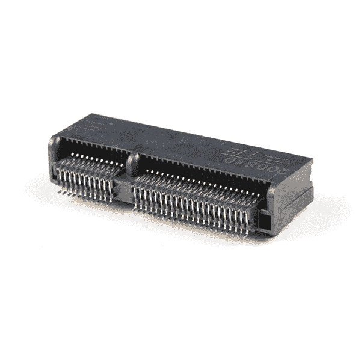](https://cdn.sparkfun.com/assets/parts/1/5/4/2/8/16549-SparkFun_MicroMod_DIY_Carrier_Kit__5_pack_-03.jpg) | [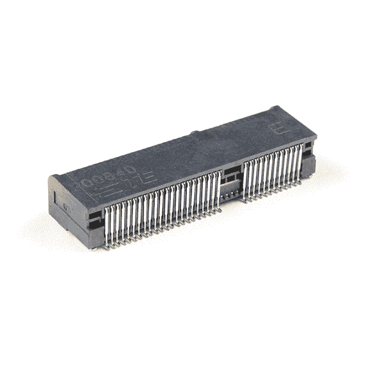](https://cdn.sparkfun.com/assets/parts/1/5/4/2/8/16549-SparkFun_MicroMod_DIY_Carrier_Kit__5_pack_-02.jpg) |
| *M.2 连接器插座视图* | *M.2 连接器后视图* |

TE 生产的 [2199230-4](https://www.findchips.com/search/2199230-4) 广泛上市，价格合理(千片订量预算报价为 0.56 美元)。您还可以订购 [MicroMod DIY 载体套件](https://www.sparkfun.com/products/16549)，其中包括 5 个连接器、螺钉和可回流支架。

M.2 连接器上的塑料“键”有不同的位置，以防止用户插入不兼容的设备。MicroMod 标准使用**‘E’键**，但通过将安装螺丝向侧面移动 4 毫米，偏离了 M.2 标准。“E”键相当常见，因此用户可以插入 M.2 兼容的 Wifi 模块，但由于螺丝安装不对齐，用户无法将不兼容的设备固定到 MicroMod 载板中。

### 什么是处理器板？

[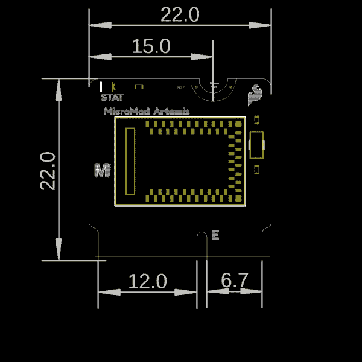](https://cdn.sparkfun.com/assets/learn_tutorials/1/1/8/9/SparkFun_MicroMod_Processor_Board_Dimensions.jpg)*Each processor board follows the M.2 standard of '2222' or 22x22mm overall size.*

每个处理器板大约为 22x22mm，上面有一个微控制器或处理器。处理器上的引脚被带到卡的边缘，以匹配 MicroMod 引脚规格。

每个处理器板预计只需要 USB D+/-进行编程。这意味着没有内置 USB 支持的处理器必须添加它。例如:Artemis 处理器板增加了 CH340E 以提供串行编程支持。

每个处理器板都应该有一个未布线到板边缘的板载状态 LED。

**注意:**MicroMod 规范将螺丝位置从板的中心线移动到中心偏右 4 毫米。这是为了防止越来越多的使用 M.2 连接器的设备(如 WiFi 卡、固态硬盘、蜂窝调制解调器等)和 MicroMod 设备的不正确混合。虽然用户*可以*将 WiFi 卡插入 SparkFun 数据记录载板，但螺丝孔不会对齐，这显然表明设备不能一起工作。

MicroMod 规格将来可能会包含更大的尺寸，并且欢迎用户创建自己的处理器板，但请注意，大多数载板上的支座孔的位置将适合 2222 MicroMod 键。

### 什么是 [MicroMod 引脚排列](https://learn.sparkfun.com/tutorials/getting-started-with-micromod#hardware_pinout)？

MicroMod 接口定义如下:

*   [SparkFun MicroMod 接口 v1.0 -引脚排列](https://cdn.sparkfun.com/assets/learn_tutorials/1/2/0/6/SparkFun_MicroMod_Interface_v1.0_-_Pinout.pdf)
*   [SparkFun MicroMod 接口 v1.0 -引脚描述](https://cdn.sparkfun.com/assets/learn_tutorials/1/2/0/6/SparkFun_MicroMod_Interface_v1.0_-_Pin_Descriptions.pdf)

**Note:** Below is a graphical datasheet for the MicroMod processor board's general pinout. The pins on the card edge from the processor board interface with the carrier board's M.2 connector pins.

[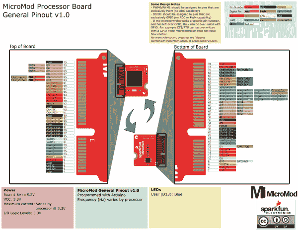](https://cdn.sparkfun.com/assets/learn_tutorials/1/1/8/9/MicroMod_General_Pinout_v10_Graphical_Datasheet.pdf)

*Click on the image for a closer view of the graphical datasheet.*
Note that the M.2 connector pins on opposing sides are offset from each other as indicated by the bottom pins. It's not as apparent in the table further below since it is not offset. As a result, one row for the bottom pins are "Not Connected".

[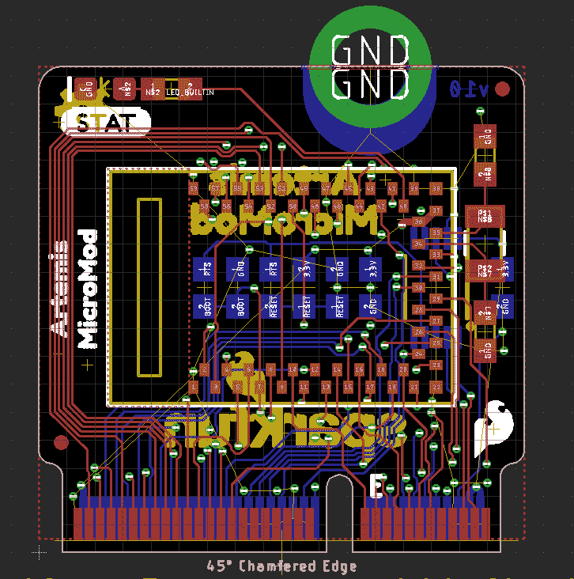](https://cdn.sparkfun.com/r/600-600/assets/learn_tutorials/1/2/0/6/MicroMod-Eagle-Board_Routing_1.png)

下面是 1.0 版处理器和载板的通用 MicroMod 接口引脚排列。

使用 MicroMod 外形时，并非所有引脚都能保证连接。如需更多资讯，请参阅您处理器主板的相关文件。

*   [微模块通用引脚表](#MMGen)
*   [MicroMod 通用引脚描述](#MMDescript)

| **音频** | **UART** | **GPIO/总线** | **I ² C** | **SDIO** 的缩写形式 | **SPI** | **专用** |

| 功能 | 底部
销 | 顶部
销 | 功能 |
|  |  |  | (未连接) |  | **75** | GND |  |  |  |
|  |  |  | 3.3V | **74** | **73** | G5 /总线 5 |  |  |  |
|  |  |  | RTC _ 3V _ 电池 | **72** | **71** | G6 /总线 6 |  |  |  |
|  |  | SPI_CS1# | SDIO _ 数据 3(输入输出) | **70** | **69** | G7 /总线 7 |  |  |  |
|  |  |  | SDIO _ 数据 2(输入输出) | **68** | **67** | 八国集团(Group of Eight) |  |  |  |
|  |  |  | SDIO _ 数据 1(输入输出) | **66** | **65** | G9 | ADC_D- | CAM_HSYNC |  |
|  |  | 睡吧 | SDIO _ 数据 0(输入输出) | **64** | **63** | G10 | ADC_D+ | CAM_VSYNC |  |
|  |  | SPI COPI1 | SDIO_CMD (I/O) | **62** | **61** | 睡吧 |  |  |  |
|  |  | SPI SCK1 | SDIO_SCK(或) | **60** | **59** | SPI_COPI (O) | LED_DAT |  |  |
|  |  |  | AUD_MCLK (O) | **58** | **57** | SPI_SCK(或) | LED |  |  |
| 凯姆 | PCM_OUT | I2S 出局 | AUD_OUT | **56** | **55** | SPI_CS# |  |  |  |
| cam _ pclk | PCM_IN | I2S 因 | 澳元 _ 美元 | **54** | **53** | I2C_SCL1(输入/输出) |  |  |  |
| PDM_DATA | PCM_SYNC | i2s WS | AUD_LRCLK | **52** | **51** | I2C_SDA1(输入输出) |  |  |  |
| PDM_CLK | PCM_CLK | SCK i2s | 奥德 _BCLK | **50** | **49** | BATT_VIN / 3 (I - ADC) (0 至 3.3V) |  |  |  |
|  |  |  | G4 /总线 4 | **48** | **47** | PWM1 |  |  |  |
|  |  |  | G3 /总线 3 | **46** | **45** | GND |  |  |  |
|  |  |  | G2 /总线 2 | **44** | **43** | CAN_TX |  |  |  |
|  |  |  | G1 /巴士 1 | **42** | **41** | CAN_RX |  |  |  |
|  |  |  | G0 /总线 0 | **40** | **39** | GND |  |  |  |
|  |  |  | 一流的 | **38** | **37** | USBHOST_D- |  |  |  |
|  |  |  | GND | **36** | **35** | USBHOST_D+ |  |  |  |
|  |  |  | A0 | **34** | **33** | GND |  |  |  |
|  |  |  | PWM0 | **32** | **31** | 模块密钥 |  |  |  |
|  |  |  | 模块密钥 | **30** | **29** | 模块密钥 |  |  |  |
|  |  |  | 模块密钥 | **28** | **27** | 模块密钥 |  |  |  |
|  |  |  | 模块密钥 | **26** | **25** | 模块密钥 |  |  |  |
|  |  |  | 模块密钥 | **24** | **23** | SWDIO |  |  |  |
|  |  |  | UART_TX2 (O) | **22** | **21** | SWDCK |  |  |  |
|  |  |  | UART_RX2 (I) | **20** | **19** | UART_RX1 (I) |  |  |  |
|  |  | CAM_TRIG | D1 | **18** | **17** | UART_TX1 (0) |  |  |  |
|  |  |  | I2C INT # | **16** | **15** | UART_CTS1 (I) |  |  |  |
|  |  |  | S7-1200 可编程控制器 | **14** | **13** | UART_RTS1 (O) |  |  |  |
|  |  |  | I2C SDA(输入/输出) | **12** | **11** | 行李箱(I 型开式排放) |  |  |  |
|  |  |  | D0 | **10** | **9** | USB_VIN |  |  |  |
|  |  | 浅部白色甲癣 | G11 | **8** | **7** | GND |  |  |  |
|  |  |  | 复位# (I -开漏) | **6** | **5** | USB_D- |  |  |  |
|  |  |  | 3.3V_EN | **4** | **3** | USB_D+ |  |  |  |
|  |  |  | 3.3V | **2** | **1** | GND |  |  |  |

| 信号群 | 信号 | 输入－输出 | 描述 | 电压 |
| 力量 | 3.3V | 我 | 3.3V 电源 | 3.3V |
| GND |  | 返回电流路径 | 0V |
| USB_VIN | 我 | USB VIN 符合 USB 2.0 规范。连接到处理器板上要求 5V USB 功能的引脚 | 4.8-5.2V |
| RTC _ 3V _ 电池 | 我 | 3V 由外部纽扣电池或迷你电池提供。最大功耗=100μA，连接到引脚，在掉电期间保持 RTC。可以左 NC。 | 3V |
| 3.3V_EN | O | 控制载板的主电压调节器。1V 以上的电压将启用 3.3V 电源路径。 | 3.3V |
| BATT_VIN/3 | 我 | 载板原始电压超过 3。1/3 电阻分压器在载板上实现。根据需要放大整个 0-3.3V 范围的模拟信号 | 3.3V |
| 重置 | 重置 | 我 | 处理器的输入。处理器板上带上拉电阻的开漏。拉低复位处理器。 | 3.3V |
| 靴子 | 我 | 处理器的输入。处理器板上带上拉电阻的开漏。拉低使处理器进入特殊启动模式。可以左 NC。 | 3.3V |
| 通用串行总线 | USB_D | 输入－输出 | USB 数据。符合 USB 2.0 规范的差分串行数据接口。如果编程需要 UART，USB 必须连接到处理器板上的 USB 转串行转换 IC。 |  |
| USB 主机 | USBHOST_D | 输入－输出 | 对于支持 USB 主机模式的处理器。USB 数据。符合 USB 2.0 规范的差分串行数据接口。可以左 NC。 |  |
| 能 | CAN_RX | 我 | CAN 总线接收数据。 | 3.3V |
| CAN_TX | O | CAN 总线传输数据。 | 3.3V |
| 通用非同步收发传输器(Universal Asynchronous Receiver/Transmitter) | UART_RX1 | 我 | UART 接收数据。 | 3.3V |
| UART_TX1 | O | UART 发送数据。 | 3.3V |
| UART_RTS1 | O | UART 准备发送。 | 3.3V |
| UART_CTS1 | 我 | UART 清零发送。 | 3.3V |
| UART_RX2 | 我 | 第二个 UART 接收数据。 | 3.3V |
| UART_TX2 | O | 第二个 UART 发送数据。 | 3.3V |
| I2C | i2c _ scl | 输入－输出 | I ² C 时钟。载板上拉的开漏。 | 3.3V |
| I2C SDA | 输入－输出 | I ² C 数据。载板上有上拉电阻的开漏 | 3.3V |
| I2C INT # | 我 | 从载板到处理器的中断通知。载板上拉的开漏。低电平有效 | 3.3V |
| I2C_SCL1 号文件 | 输入－输出 | 2nd I ² C 时钟。载板上拉的开漏。 | 3.3V |
| I2C sda 1 | 输入－输出 | 2nd I ² C 数据。载板上拉的开漏。 | 3.3V |
| 精力 | SPI_COPI | O | SPI 控制器输出/外设输入。 | 3.3V |
| 睡吧，婊子 | 我 | SPI 控制器输入/外设输出。 | 3.3V |
| SPI | O | SPI 时钟。 | 3.3V |
| SPI_CS# | O | SPI 片选。低电平有效。如果不使用硬件 CS，可以路由到 GPIO。 | 3.3V |
| SPI/SDIO | SPI_SCK1/SDIO_CLK | O | 第二个 SPI 时钟。次要用途是 SDIO 钟。 | 3.3V |
| SPI_COPI1/SDIO_CMD | 输入－输出 | 第二 SPI 控制器输出/外设输入。次要用途是 SDIO 命令界面。 | 3.3V |
| spi _ 塞浦路斯 1/SDIO_DATA0 | 输入－输出 | 第二个 SPI 外设输入/控制器输出。次要用途是 SDIO 数据交换位 0。 | 3.3V |
| SDIO_DATA1 | 输入－输出 | SDIO 数据交换位 1。 | 3.3V |
| SDIO_DATA2 | 输入－输出 | SDIO 数据交换位 2。 | 3.3V |
| SPI _ CS1/SDIO _ 数据 3 | 输入－输出 | 第二个 SPI 芯片选择。次要用途是 SDIO 数据交换位 3。 | 3.3V |
| 声音的 | 奥地利马克 | O | 音频主时钟。 | 3.3V |
| AUD _ OUT/PCM _ OUT/i2s _ OUT/CAM _ MCLK | O | 音频数据输出。PCM 同步数据输出。I2S 串行数据输出。相机主时钟。 | 3.3V |
| 澳大利亚/PCM _ IN/i2s _ IN/卡姆 _PCLK | 我 | 音频数据输入。PCM 同步数据输入。I2S 串行数据输入。照相机外围时钟。 | 3.3V |
| AUD _ LRC lk/PCM _ SYNC/i2s _ WS/PDM _ DATA | 输入－输出 | 音频左/右时钟。PCM 同步数据同步。I2S 单词精选。PDM 数据。 | 3.3V |
| 澳大利亚 BCLK/CLK PCM/CLK i2s/CLK PDM | O | 音频位时钟。PCM 时钟。I2S 连续串行时钟。PDM 时钟。 | 3.3V |
| 社署 | SWDIO | 输入－输出 | 串行线调试 I/O。如果处理器板支持 SWD，则连接。可以左 NC。 | 3.3V |
| SWDCK | 我 | 串行线调试时钟。如果处理器板支持 SWD，则连接。可以左 NC。 | 3.3V |
| 物理输出核心 | A0 | 我 | 模数转换器 0。根据需要放大模拟信号，以实现完整的 0-3.3V 范围。 | 3.3V |
| 一流的 | 我 | 模数转换器 1。根据需要放大模拟信号，以实现完整的 0-3.3V 范围。 | 3.3V |
| 脉宽调制（pulse-width modulating 的缩写） | PWM0 | O | 脉宽调制输出 0。 | 3.3V |
| PWM1 | O | 脉宽调制输出 1。 | 3.3V |
| 数字的 | D0 | 输入－输出 | 通用数字输入/输出引脚。 | 3.3V |
| D1/CAM_TRIG | 输入－输出 | 通用数字输入/输出引脚。相机触发器。 | 3.3V |
| 常规/公共汽车 | G0/总线 0 | 输入－输出 | 通用引脚。任何未使用的处理器引脚都应分配给 Gx，具有 ADC + PWM 功能的引脚优先(0、1、2 等。)岗位。目的是保证各 ADC/PWM/数字引脚上的 PWM、ADC 和数字引脚功能。Gx 引脚不保证 ADC/PWM 功能。另一种用途是引脚可以支持快速读/写 8 位或 4 位宽总线。 | 3.3V |
| G1/巴士 1 | 输入－输出 | 3.3V |
| G2/总线 2 | 输入－输出 | 3.3V |
| G3/总线 3 | 输入－输出 | 3.3V |
| G4/总线 4 | 输入－输出 | 3.3V |
| G5/总线 5 | 输入－输出 | 3.3V |
| g6/总线 6 | 输入－输出 | 3.3V |
| G7/总线 7 | 输入－输出 | 3.3V |
| 八国集团(Group of Eight) | 输入－输出 | 通用引脚 | 3.3V |
| G9/ADC_D-/CAM_HSYNC | 输入－输出 | 差分 ADC 输入(如有)。相机水平同步。 | 3.3V |
| G10/ADC_D+/CAM_VSYNC | 输入－输出 | 差分 ADC 输入(如有)。相机垂直同步。 | 3.3V |
| G11/SWO | 输入－输出 | 通用引脚。串行线输出 | 3.3V |

M.2 连接器上的每个引脚都被指定具有给定的功能。为了确保跨平台的兼容性，MicroMod 规范还有一些附加的规则。在极端情况下，最多支持 49x GPIOs。一般来说，MicroMod 关注的是接口类型和位置。例如，如果载板需要 PWM 功能，则载板应利用引脚 32(又名 PWM0)和 47(又名 PWM1)，因为这些引脚最有可能支持 PWM。

支持的接口:

*   用于编程和串行调试的 USB
*   2x 模拟专用
*   2x PWM 专用
*   2x 数字 I/O 专用
*   12 个 GPIO
*   2x I ² C
*   2 个 SPI
*   2x UART
*   迪索
*   USB 主机
*   能
*   社署
*   PDM / PCM / I2S
*   差分 ADC

12x gpio 听起来可能不多，但是一旦连接了所有其他接口(UART、SPI、I2C、PWM、ADC ), 12x gpio 应该可以覆盖大多数剩余的应用。

## 硬件连接

下面是将你的 MicroMod 板连接在一起的步骤！

*   [将处理器连接到载板](https://learn.sparkfun.com/tutorials/getting-started-with-micromod#micromod_processor)
*   [将功能板连接到主板上](https://learn.sparkfun.com/tutorials/getting-started-with-micromod#micromod_main)

### [将处理器连接到载板](https://learn.sparkfun.com/tutorials/getting-started-with-micromod#micromod_processor)

要开始使用 MicroMod，你需要一块处理器板和一块载板。这里我们使用 Artemis MicroMod 处理器板和机器学习载板。将 MicroMod Artemis 处理器板的顶部键与机器学习载板的螺丝端子对齐，并将板倾斜到插槽中。将电路板以一定角度插入 M.2 连接器。

**Note:** There is no way to insert the processor backward since the key prevents it from mating with the M.2 connector and as an extra safeguard to prevent inserting a processor that matches the key, the mounting screw is offset so you will not be able to secure an improperly connected processor board.

处理器板将以一定角度(大约 25°)竖起，如下所示:

一旦板在插座中，轻轻按住 MicroMod 处理器板，并用 Phillip 头拧紧螺丝。我们推荐经典的 SparkFun 可逆[微型螺丝刀](https://www.sparkfun.com/products/9146)、[微型螺丝刀](https://www.sparkfun.com/products/19012)或更高级的[袖珍螺丝刀套装](https://www.sparkfun.com/products/12891)，但是任何#00、#0 或#1 Phillip 螺丝刀都可以。

[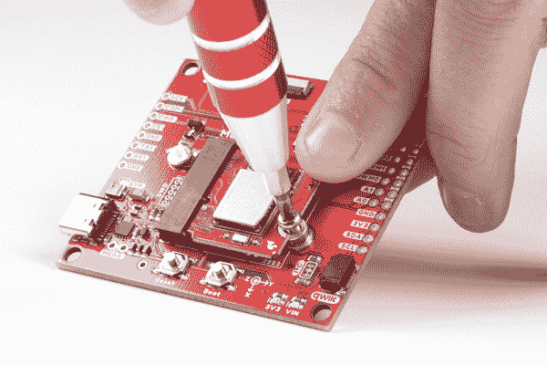](https://cdn.sparkfun.com/assets/learn_tutorials/1/1/8/9/MicroMod_Getting_Started_Guide_Images-02.jpg)

一旦电路板被固定，你组装好的 MicroMod 系统看起来应该和下图相似！

**Note:** If you've never connected an CH340 device to your computer before, you may need to install drivers for the USB-to-serial converter. Check out our section on [How to Install CH340 Drivers"](https://learn.sparkfun.com/tutorials/sparkfun-serial-basic-ch340c-hookup-guide#drivers-if-you-need-them) for help with the installation.

### [将功能板连接到主板上](https://learn.sparkfun.com/tutorials/getting-started-with-micromod#micromod_main)

对于那些走模块化路线的主板，你需要一个处理器和功能板。这些步骤类似于上面解释的将处理器连接到常规载板。将处理器板以大约 25°的角度插入标有“**处理器**的 M.2 连接器。然后用菲利普的头固定住板子。同样，我们推荐经典的 SparkFun 可逆[迷你螺丝刀](https://www.sparkfun.com/products/9146)或更好的[袖珍螺丝刀套装](https://www.sparkfun.com/products/12891)，但是任何#00、#0 或#1 Phillip 螺丝刀都可以。

| [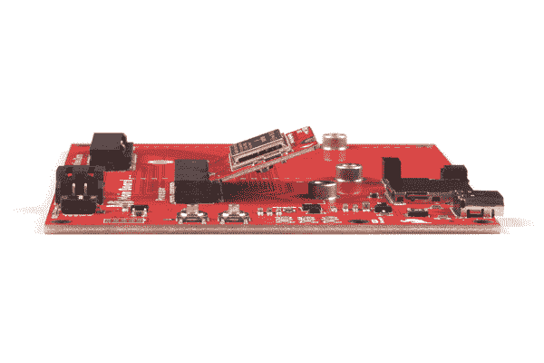](https://cdn.sparkfun.com/assets/learn_tutorials/1/1/8/9/Artemis_Processor_Inserted_Angle_Main_Board.jpg) | [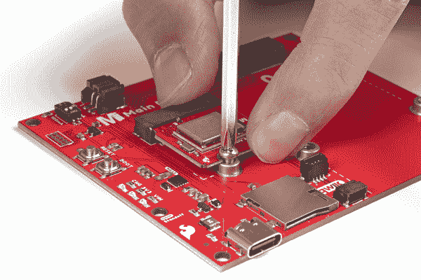](https://cdn.sparkfun.com/assets/learn_tutorials/1/1/8/9/Artemis_Processor_Mounted_Main_Board.jpg) |
| *处理器板以角度*插入 | *固定处理器板* |

然后将功能板以一定角度(大约 25°)插入标有“**功能零**的 M.2 连接器，就像处理器板一样。

[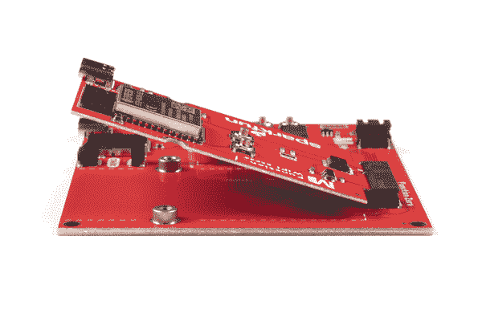](https://cdn.sparkfun.com/assets/learn_tutorials/1/1/8/9/MicroMod_Main_Board_Function_Board_Angle.jpg)

一旦板在插座中，轻轻地将 MicroMod 功能板压向主板。用食指和拇指将功能板抵住 M.2 连接器。然后用一个 Phillip 头拧紧一个螺丝，刚好可以固定住。你会想避免完全拧紧螺丝。

[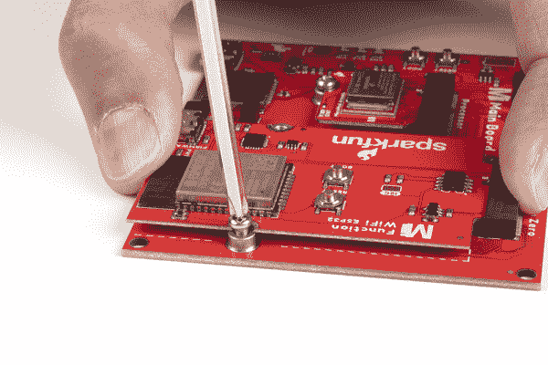](https://cdn.sparkfun.com/assets/learn_tutorials/1/1/8/9/Function_Board_Screw_Holding_Main_board.jpg)

在保持功能板不动的同时，拧紧另一侧的第二颗螺丝，使其保持不动。返回并完全拧紧两个螺钉，以确保电路板被均匀地压下。

[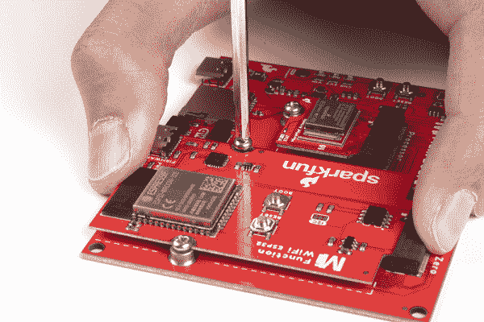](https://cdn.sparkfun.com/assets/learn_tutorials/1/1/8/9/MicroMod_Main_Board_Single_Function_Board_Tighten_Scews.jpg)

一旦电路板被固定，你组装的 MicroMod 系统应该看起来像下面的图片！

[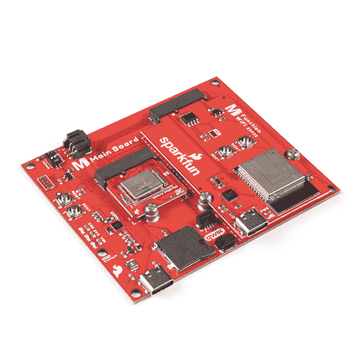](https://cdn.sparkfun.com/assets/learn_tutorials/1/1/8/9/MicroMod_Main_Board_Single_Assembled.jpg)

如果你有一个 MicroMod 主板——Double，步骤和主板一样——Single。这些步骤类似于上面解释的连接处理器和功能板。以大约 25°的角度插入两个功能板。

[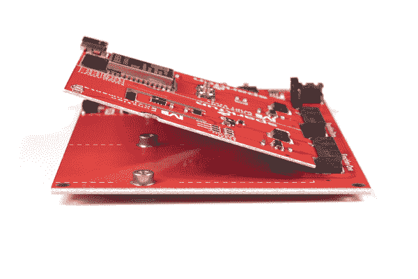](https://cdn.sparkfun.com/assets/learn_tutorials/1/1/8/9/MicroMod_Main_Double_Board_Function_Boards_Angle.jpg)**Note:** The tolerance is tight with both PCBs next together and you may have the Function Boards pushing up against each other when they are in the socket. You may need to use sand paper or file down the edges from the panelization of the PCBs so that the boards are flush.

轻轻地将其中一个功能板压向主板-双击。用食指和拇指将功能板抵住 M.2 连接器。然后用一个 Phillip 头拧紧其中一个螺钉(避开两个功能板之间的中间螺钉),刚好足以将其固定到位。你会想避免完全拧紧螺丝。

[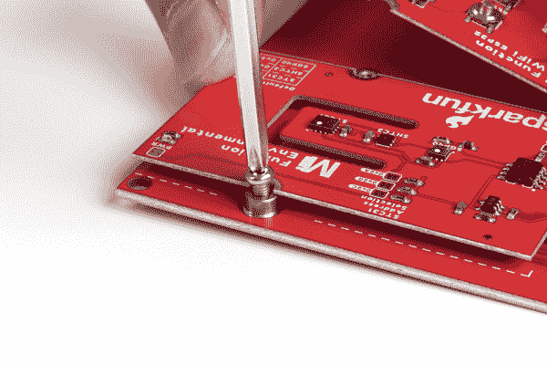](https://cdn.sparkfun.com/assets/learn_tutorials/1/1/8/9/MicroMod_Main_Double_Function_Board_Screw_Holding.jpg)

轻轻地将另一个功能板压向主板-双倍。将功能板固定到位，同时确保两块板齐平。然后用一个 Phillip 头拧紧其中一个螺钉(避开两个功能板之间的中间螺钉),刚好足以将其固定到位。你会想避免完全拧紧螺丝

[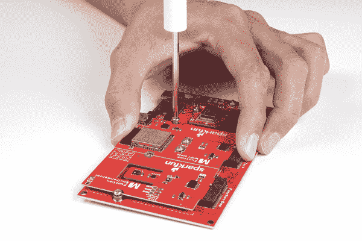](https://cdn.sparkfun.com/assets/learn_tutorials/1/1/8/9/MicroMod_Main_Double_Other_Function_Board_Screw_Holding.jpg)

拧紧中间的螺丝，同时按住两个功能板。返回并完全拧紧所有三个螺钉，以确保电路板被均匀地压下。

[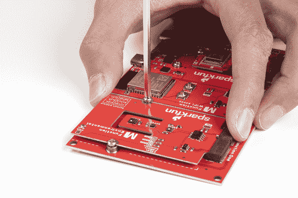](https://cdn.sparkfun.com/assets/learn_tutorials/1/1/8/9/MicroMod_Main_Double_Function_Board_Screw_Middle.jpg)

一旦电路板被固定，你组装的 MicroMod 系统应该看起来像下面的图片！

[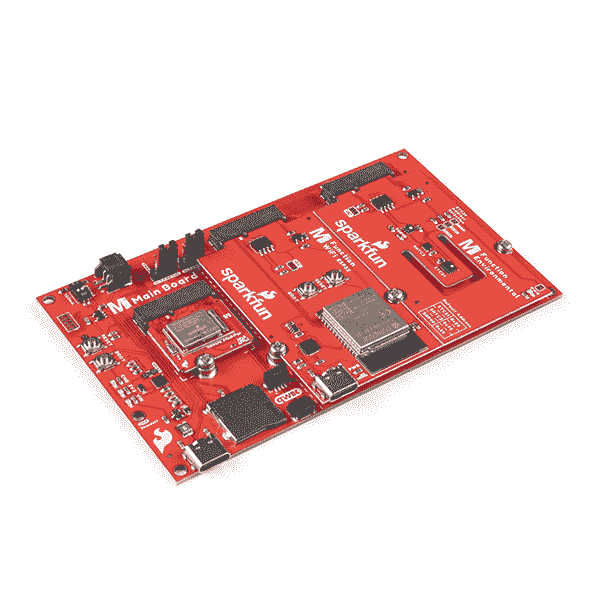](https://cdn.sparkfun.com/assets/learn_tutorials/1/1/8/9/MicroMod_Main_Board_Double_Assembled.jpg)**Note:** Misplaced a MicroMod screw? Have no fear! You can order replacement screws in packs of 5.

[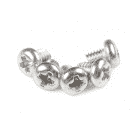](https://www.sparkfun.com/products/19296) 

将**添加到您的[购物车](https://www.sparkfun.com/cart)中！**

### [微电机机螺丝- M2.5x3mm，十字头(5 个装)](https://www.sparkfun.com/products/19296)

[33 available](https://learn.sparkfun.com/static/bubbles/ "33 available") PRT-19296

SparkFun 在 MicroMod 生态系统中使用的 5 包 M.2 螺丝。

$0.25[Favorited Favorite](# "Add to favorites") 1[Wish List](# "Add to wish list")** **## 用 MicroMod 设计

### 可以自己做 MicroMod 处理器板吗？

绝对的。SparkFun 是一家开源硬件公司，没有申请这个接口的专利。我们所要求的是，你不要分叉规范，遵守规则，并尽量不要通过引入竞争或部分兼容的类似接口来混淆社区。

我们建议从我们的开源处理器板设计开始。目前所有这些文件都是 EAGLE PCB 格式。如果您有不同的 PCB 封装，并且希望将您的设计添加到列表中作为参考设计，请[让我们知道](https://www.sparkfun.com/static/contact)！

*   [MicroMod ESP32 处理器板](https://github.com/sparkfun/MicroMod_ESP32_Processor)
*   [MicroMod SAMD51 处理器板](https://github.com/sparkfun/MicroMod_Processor_Board-SAMD51)
*   [MicroMod Artemis 处理器板](https://github.com/sparkfun/MicroMod_Artemis_Processor)

此外，我们已经写了[用 MicroMod](https://learn.sparkfun.com/tutorials/designing-with-micromod) 设计，深入讨论了如何创建一个好的处理器和载板。

### 可以自己做微电机载板吗？

绝对的！这才是真正令人兴奋的地方。我们有各种资源，包括 Eagle PCB 的连接器尺寸和符号。我们已经设计了多个载板，并且开源，因此您可以将它们用作参考设计和起点。我们迫不及待地想看看你做了什么。

我们建议从我们的开源载板设计开始。目前所有这些文件都是 EAGLE PCB 格式。如果您有不同的 PCB 封装，并且希望将您的设计添加到列表中作为参考设计，请[让我们知道](https://www.sparkfun.com/static/contact)！

*   [微模所有引脚(ATP)载板](https://github.com/sparkfun/MicroMod_ATP_Carrier_Board)
*   [微型数据记录载板](https://github.com/sparkfun/MicroMod_Data_Logging_Carrier)
*   [MicroMod 机器学习载板](https://github.com/sparkfun/MicroMod_Machine_Learning_Carrier)
*   [微型输入显示载板](https://github.com/sparkfun/MicroMod_Input_and_Display_Carrier)

此外，我们已经写了[用 MicroMod](https://learn.sparkfun.com/tutorials/designing-with-micromod) 设计，深入讨论了如何创建一个好的处理器和载板。

设计自己的载板时，请记住以下经验法则:

*   所有载板必须提供能够 1A 的 3.3V 稳压电源。
*   所有载板必须提供一个 USB D+/-连接用于编程。
*   并非所有处理器板都连接到每个引脚。
*   A0/1、PWM0/1 和 D0/1 *应该由每个*处理器板的*支持，因此您可以相信这些引脚将是可用的。*
*   UART1、SPI 和 I2C 端口非常常见，几乎每个处理器板上都有，但除此之外的外设因处理器板而异。例如:对第二个 I2C 端口的支持变化很大，因此如果您的承载板需要第二个 I2C 端口，请了解将支持哪些处理器板。

为了帮助您开始使用自己的定制载板，我们组装了 [MicroMod DIY 载板套件](https://www.sparkfun.com/products/16549)，其中包括 5 个连接器、螺钉和支架，以便您可以获得制作自己的载板所需的所有“特殊”部件。

[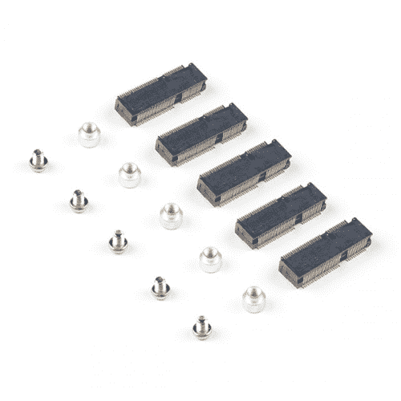](https://www.sparkfun.com/products/16549) 

将**添加到您的[购物车](https://www.sparkfun.com/cart)中！**

### [【SparkFun micro mod DIY 载体套装(5 个装)](https://www.sparkfun.com/products/16549)

[In stock](https://learn.sparkfun.com/static/bubbles/ "in stock") KIT-16549

MicroMod DIY 载体套件包括五个 M.2 连接器、螺钉和支架，以便您可以获得您可能需要的所有部件

$7.50[Favorited Favorite](# "Add to favorites") 3[Wish List](# "Add to wish list")** **M.2 连接器有一个 0.5 毫米的间距和定位销。手工模版印刷和在家回流是可能的，但是我们建议使用不锈钢模版(不要使用聚酯薄膜)和更高质量的回流炉(抱歉[热板](https://www.sparkfun.com/tutorials/59)！)来帮助防止跳楼。

### 说说散热吧！

M.2 标准的好处之一是能够将组件放在模块下。利用这一点，我们现在可以为我们的微控制器添加散热器！

因此，我们推荐 4.2 毫米高的连接器。TE 生产的 [2199230-4](https://www.findchips.com/search/2199230-4) 广泛上市，价格合理(千片订量预算报价为 0.56 美元)。

### 如果我需要很多 GPIO 怎么办？

在有些应用中，用户需要 12 个以上的 GPIO。MicroMod 规范是灵活的。如果你想设计一个只连接几个外设(例如，只有 UART 和 I2C)并将其余的留给 GPIO(本例中有 45 个可供 GPIO 使用)的 MicroMod，这很好。您的载板将在正常位置使用 UART 和 I2C 引脚，在非标准位置使用 GPIOs。这将阻止其他微马达绝对兼容(也许一个或两个微马达 Artemis 不能驱动你的载板的继电器)，但这是允许的。你，设计师，只需要考虑权衡。

我们已经编写了一份关于创建 MicroMod 处理器板的指南，但以下是指导原则:

*   将微控制器的专用硬件连接到暴露在 MicroMod 连接器边缘的可用 I2C、SPI、UART、USB、USB_HOST、CAN、SDIO 和 JTAG 引脚。
*   接下来，应将 MicroMod 连接器边缘的 A0/A1 分配给微控制器上专用于 ADC 的引脚(无 PWM 功能)。
*   PWM0/PWM1 应分配给专用于 PWM(无 ADC 功能)的引脚。
*   D0/D1 应分配给专用 GPIO 引脚(无 ADC 或 PWM 功能)
*   其余引脚应分配给 Gx，ADC + PWM 引脚优先(0、1、2 等)
*   目的是保证这些特定引脚上的 PWM、ADC 和数字引脚功能。而 Gx 引脚不保证 ADC/PWM 功能。
*   如果微控制器缺少特定的引脚功能，并且留下了 GPIO，它们可以被 GPIO 覆盖。例如，如果微控制器没有流控制，CTS/RTS 可以用 GPIO 覆盖。

欲了解更多信息，请查看[用 MicroMod 设计教程](https://learn.sparkfun.com/tutorials/designing-with-micromod)。

 [### 用 MicroMod 设计

#### 2020 年 10 月 21 日](https://learn.sparkfun.com/tutorials/designing-with-micromod) This tutorial will walk you through the specs of the MicroMod processor and carrier board as well as the basics of incorporating the MicroMod form factor into your own PCB designs 0

## 资源和更进一步

有价值的 MicroMod 文档:

*   [SparkFun MicroMod 接口 v1.0 -引脚排列](https://cdn.sparkfun.com/assets/learn_tutorials/1/2/0/6/SparkFun_MicroMod_Interface_v1.0_-_Pinout.pdf)
*   [SparkFun MicroMod 接口 v1.0 -引脚描述](https://cdn.sparkfun.com/assets/learn_tutorials/1/2/0/6/SparkFun_MicroMod_Interface_v1.0_-_Pin_Descriptions.pdf)
*   [SparkFun Eagle 库](https://github.com/sparkfun/SparkFun-Eagle-Libraries)包含 M.2 连接器和 SMD 支架的示例
*   [M.2 微模块连接器数据表](https://cdn.sparkfun.com/assets/9/c/e/b/6/MicroMod_M.2_Connector_Datasheet_TE_2199230-4.pdf)
*   [M2.5 可回流支架数据表](https://cdn.sparkfun.com/assets/f/d/2/b/e/MicroMod_Reflowable_Standoff.pdf)
*   [MicroMod 信息页面](https://www.sparkfun.com/micromod)
*   [MicroMod 论坛](https://forum.sparkfun.com/viewforum.php?f=180)

既然你已经熟悉了 MicroMod 的基础知识，那就来看看下面一些关于 [MicroMod](https://learn.sparkfun.com/tutorials/tags/micromod) 的教程吧！

 [### SparkFun MicroMod 输入和显示载板连接指南](https://learn.sparkfun.com/tutorials/sparkfun-micromod-input-and-display-carrier-board-hookup-guide) A short Hookup Guide to get started with the SparkFun MicroMod Input and Display Carrier Board[Favorited Favorite](# "Add to favorites") 3 [### MicroMod 机器学习载板连接指南](https://learn.sparkfun.com/tutorials/micromod-machine-learning-carrier-board-hookup-guide) Get hacking with this tutorial on our Machine Learning Carrier Board 2 [### MicroMod WiFi 功能板- ESP32 连接指南](https://learn.sparkfun.com/tutorials/micromod-wifi-function-board---esp32-hookup-guide) The MicroMod ESP32 Function Board adds additional wireless options to MicroMod Processor Boards that do not have that capability. This special function board acts as a coprocessor that takes advantage of Espressif's ESP32 WROOM to add WiFi and Bluetooth® to your applications.[Favorited Favorite](# "Add to favorites") 0 [### 声音定位第 2 部分，带 Qwiic 声音触发器和 u-blox ZED-F9x](https://learn.sparkfun.com/tutorials/sound-location-part-2-with-the-qwiic-sound-trigger-and-the-u-blox-zed-f9x) [Favorited Favorite](# "Add to favorites") 2****