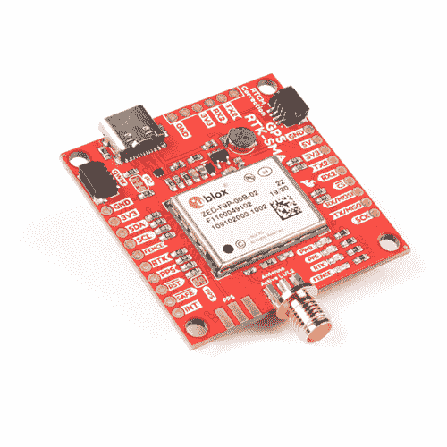
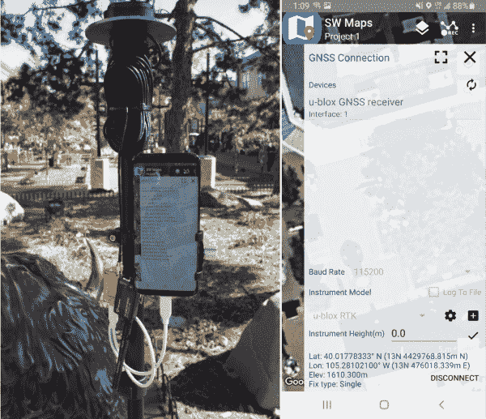

# 设置基于流动站的 RTK 系统

> 原文：<https://learn.sparkfun.com/tutorials/setting-up-a-rover-base-rtk-system>

## 介绍

本教程将带你设置一个基地和漫游者，使你的漫游者可以有大约 14 毫米的精度，测量员使用！这对各种项目都很有用，包括农业、无人机、地图绘制，甚至一些极端的地理藏宝。

*The [SW Maps](https://play.google.com/store/apps/details?id=np.com.softwel.swmaps) app for Android connected to a ZED-F9P over USB C using RTK and a serial radio*

我们使用 u-blox 的 ZED-F9P 已经有几年了。虽然它有点贵(约 200 美元)，但它只是其他 RTK 系统成本的一小部分，从 3000 美元到 20000 美元甚至更多！ZED-F9P 的强大之处在于它的可配置性。我们也将自由使用 u-blox 的[u-center](https://www.u-blox.com/en/product/u-center)——别担心，我们已经有了那个的[教程。不幸的是，u-center 目前仅适用于 Windows。对于更喜欢冒险的人来说，SparkFun 已经创建了一个流行而强大的](https://learn.sparkfun.com/tutorials/getting-started-with-u-center-for-u-blox/all) [u-blox Arduino 库](https://github.com/sparkfun/SparkFun_u-blox_GNSS_Arduino_Library)，它可以做*u-center 可以从 Arduino 上做的一切事情。*

**Quick note:** You will see the terms *GPS* and *GNSS* used interchangeably throughout this tutorial. GNSS, or Global Navigation Satellite System, is the collective term for all GPS (USA), GLONASS (Russia), BeiDou (China), and Galileo (EU) satellites. GPS was the predominant constellation up to about 2017\. After this time enough BeiDou satellites were functional and enough GLONASS satellites were transmitting additional bands (L2, etc) that advanced receivers are now designed to receive signals from a variety of constellations rather than *just* GPS. This is a very good thing. With more satellites and more frequencies we can improve accuracies greatly. Said differently, you don’t own a *GPS* receiver, you own a *GNSS* receiver. Congrats!

**我真的需要 RTK 吗？**

问得好。使用一个 [ZED-F9P](https://www.sparkfun.com/products/16481) 和一个 [u-blox L1/L2 天线](https://www.sparkfun.com/products/15192)(没有 RTK 校正数据)，我们已经看到 30 个或更多的卫星，水平位置精度优于 300 毫米。这对于单个接收器来说是非常精确的，对于许多项目来说应该足够了。RTK 对设置来说是一个挑战，但是一旦完成，你应该能够获得 14 毫米*精度*(精度为亚毫米)的 RTK 定位。为了正确看待 ZED-F9P， [SAM-M8Q](https://www.sparkfun.com/products/15210) 是一个很好的接收器，但只能接收 L1 频率，水平精度为 2.5 米(2500 毫米)。ZED-F9P 要精确得多。

**注意:**最好是在你舒适的办公桌前开发 RTK 系统。不要带着笔记本电脑去野外，试图让所有东西都在外面工作。

### 推荐阅读

在开始之前，请确保您对使用 U-Center 开始使用[感到舒适，并确保查看我们的](https://learn.sparkfun.com/tutorials/getting-started-with-u-center)[什么是 GPS RTK？](https://learn.sparkfun.com/tutorials/what-is-gps-rtk)教程。

 [### I2C](https://learn.sparkfun.com/tutorials/i2c) An introduction to I2C, one of the main embedded communications protocols in use today.[Favorited Favorite](# "Add to favorites") 128 [### 什么是 GPS RTK？](https://learn.sparkfun.com/tutorials/what-is-gps-rtk) Learn about the latest generation of GPS and GNSS receivers to get 14mm positional accuracy 9 [### u-blox 的 U-Center 入门](https://learn.sparkfun.com/tutorials/getting-started-with-u-center-for-u-blox) Learn the tips and tricks to use the u-blox software tool to configure your GPS receiver.[Favorited Favorite](# "Add to favorites") 2 [### GPS-RTK2 连接指南](https://learn.sparkfun.com/tutorials/gps-rtk2-hookup-guide) Get precision down to the diameter of a dime with the new ZED-F9P from u-blox.[Favorited Favorite](# "Add to favorites") 9

## 更新接收器固件

请确保基站和流动站接收器都有来自 u-blox 的最新固件。截至本文撰写之时，已经发布了新的 1.30 版固件。u-blox 在 u-center 内部提供了一个简单易用的升级工具。您可以在其网站的[文档和资源](https://www.u-blox.com/en/product/zed-f9p-module#tab-documentation-resources)选项卡下找到所有 u-blox 接收器的最新固件。u-blox 对 ZED-F9P 做了一些很好的改进，从 1.12 版到 1.13 版，再到 1.30 版，我们现在可以收到来自 [EGNOS](https://en.wikipedia.org/wiki/European_Geostationary_Navigation_Overlay_Service) 的！

*Look at all those satellites!**Firmware version 1.13*

若要检查固件，请打开“信息”窗口。双击“NMEA”缩小 NMEA 分支。展开 UBX 分支并查找“MON”或“monitor”。展开 MON 并查找 VER(列表中的最后一个)。FWVER 将显示您当前的固件版本。

如果您有旧版本的固件，请从 u-blox 下载最新的二进制文件。打开工具->固件更新菜单，并按照提示进行操作。注意:我们必须在更新之前取消选择“*输入安全引导”来更新我们的模块。*

## 建立一个临时基地

*A basic GNSS antenna on a tripod*

基站/流动站设置的第一步是设置基站。有几种方法可以设置基站:临时基站速度更快，但精度较低。静态基站需要更多的时间来设置和配置，但可以提供最高的精度。还有第三种选择，那就是从公共数据源获取你的修正数据。该选项在[本教程](https://learn.sparkfun.com/tutorials/gps-rtk-hookup-guide/all#connecting-the-gps-rtk-to-a-correction-source)中有所介绍，因此我们不会在本教程中介绍公共校正数据。

我们已经在[之前的教程](https://learn.sparkfun.com/tutorials/gps-rtk-hookup-guide/all#setting-up-a-base-station)中介绍了如何设置临时基站，但我们将在这里进行更深入的探讨。此外，本教程将涵盖 ZED-F9P 所需的设置(而不是上一代 [NEO-M8P](https://www.sparkfun.com/products/15005) )。

上图是 u-blox 天线，连接在三脚架顶部的接地板上，SMA 电缆在室内连接到接收器。这是一个很好的实验和野外短途旅行的设置。GNSS RTK 基站的目的是不移动。一旦你告诉一个接收器这是一个基站(即，不移动)，它将开始寻找头顶上的卫星变焦，并计算其位置。随着环境的变化，来自 GNSS(全球导航卫星系统 GPS、GLONASS、北斗、伽利略卫星的统称)网络的信号也随之变化。因为基站知道它是不动的，所以它可以确定电离层和对流层中的干扰(以及其他误差源),并开始计算校正卫星向基站的实际位置报告的位置所需的值。毫不奇怪，这些值被称为“校正值”，并被编码成一种称为 RTCM 的格式。(RTCM 代表海事无线电技术委员会，但只是一个类似于“802.11”的标准的名称。别担心。).你会经常看到使用术语 RTCM3 这只是使用 RTCM 格式的版本 3 传输的校正数据。

好吧，那我们怎么建立基地？您将需要以下内容:

您将需要的东西:

*   一个带 [USB 线](https://www.sparkfun.com/products/15092)的 [ZED-F9P 接收器](https://www.sparkfun.com/products/16481)连接到你的电脑上。
*   天空的清晰景象。不要在室内，不要靠近窗户，不要在外面，周围什么都没有。整个系统的准确性取决于尽可能多地看到卫星的能力。
*   一根天线。我们喜欢并提倡使用低成本的天线和设备。你可以轻松地花费 2000 多美元购买一根商用级 GNSS 天线，但我们已经在 u-blox L1/L2 天线上取得了巨大成功。你必须绝对有一个天线是 L1/L2 兼容。一个简单的[磁性 GPS 天线](https://www.sparkfun.com/products/14986)将接收 L1 频率，但 RTK 将非常不准确，如果它甚至是可能的。
*   如果您的天线没有内置接地层(u-blox 天线没有)，您将需要添加一个金属[接地板](https://www.sparkfun.com/products/15004)。车顶也可以作为接地板。
*   安装天线的三脚架或车顶。我们发现便宜的相机三脚架工作良好。我们设计的接地板有一个兼容的 1/4”-20 孔，这样它们可以直接拧到三脚架上。
*   将 RTCM 修正数据传送到漫游车的一种方法:具有互联网连接的计算机、串行点对点无线电、XBee 模块等。我们将使用 [915MHz 串行遥测无线电套件](https://www.sparkfun.com/products/19032)。
*   SMA 延长线(约 10 米或任何你需要的东西，从外面接到你的工作电脑)。

**注意:**基地位置的准确性将反映在月球车位置的准确性上。换句话说，如果基地被错误地记录在离其实际位置 1 米远的地方，那么所有的漫游者读数将精确地误差 1 米。将天线放在视野开阔的地方并获得准确的基站位置非常重要。

 

将**添加到您的[购物车](https://www.sparkfun.com/cart)中！**

 **### [【spark fun GPS-RTK 2 Board-ZED-F9P(Qwiic)](https://www.sparkfun.com/products/15136)

[In stock](https://learn.sparkfun.com/static/bubbles/ "in stock") GPS-15136

SparkFun GPS-RTK2 是 ZED-F9P 模块的一个强大突破。ZED-F9P 是 GNSS 和 GPS 系统的顶级模块

$274.9521[Favorited Favorite](# "Add to favorites") 61[Wish List](# "Add to wish list")**** 

将**添加到您的[购物车](https://www.sparkfun.com/cart)中！**

 **### [踢腿式 GPS-RTK-SMA 突围-zed-F9(qwiic)T3](https://www.sparkfun.com/products/16481)

[In stock](https://learn.sparkfun.com/static/bubbles/ "in stock") GPS-16481

SparkFun GPS-RTK-SMA 提高了高精度 GPS 的标准，是一系列功能强大的 RTK 板中最新的一款

$274.9511[Favorited Favorite](# "Add to favorites") 33[Wish List](# "Add to wish list")**** ****一旦天线安装到位，将 ZED-F9P 连接到 USB 和天线。我们提供 Qwiic RTK 的两种变体。如果你有带 U.FL 天线连接的 [SparkFun GPS-RTK2](https://www.sparkfun.com/products/15136) ，你需要将 [U.FL 连接到 SMA 适配器](https://www.sparkfun.com/products/9145)。这里有一些很好的图片告诉你[如何正确连接 U.FL 电缆](https://learn.sparkfun.com/tutorials/three-quick-tips-about-using-ufl/all)。如果你有 [SparkFun GPS-RTK-SMA](https://www.sparkfun.com/products/16481) 只需将天线拧到 SMA 连接器上。

打开 [u-center](https://www.u-blox.com/en/product/u-center) 并连接到 Windows 在连接板时创建的相应 COM 端口。

**COM 端口有问题？**具体请查看我们关于优图中心的[教程。它将引导您安装驱动程序，并确定哪个 COM 端口是接收器。](https://learn.sparkfun.com/tutorials/getting-started-with-u-center-for-u-blox)

你应该开始看到事情的变化和数据的流动。上面显示了 ZED-F9P 运行了几分钟，获得了一堆卫星，并实现了 0.9 米的水平精度。让我们打开消息窗口，开始配置模块。

首先，关闭 NMEA 分行，以摆脱困境。打开 UBX 分支，然后打开 CFG 配置分支。一开始，配置选项的数量可能会多得令人不知所措，但随着时间的推移，它们会变得非常有用。我们正在寻找**消息**。

利用这一时刻，问问你自己，你将如何把修正数据从基地传送到漫游者。校正数据或 RTCM 的大小各不相同，但大约为每秒 1 到 2k 字节。与下载一首歌曲或视频相比很小，但足够大，LoRa 和更小的分组无线电可能无法处理它。我们建议使用[串行遥测无线电](https://www.sparkfun.com/products/19032)。运行在 915MHz，这些无线电可以达到约 300 米开箱 100 兆瓦，以及 2 公里/500 兆瓦的选择。这些无线电充当 57600bps(开箱即用)的透明串行通道。我们发现它们对于 RTCM 基地和漫游者的通信来说是完美的，唯一的限制是距离。如果你需要英里的范围，你将需要得到你的业余无线电执照和曲柄的权力。但是如果你刚刚开始使用 RTK，这些收音机很棒！

我们假设 ZED-F9P 的 UART2 上会连接一个遥测无线电。从 u-center 消息窗口，启用 UART2 和 USB 的以下消息。

*   RTCM3.3 1005
*   RTCM3.3 1074 号命令
*   RTCM3.3 1084
*   RTCM3.3 1094
*   RTCM3.3 1124 号
*   RTCM3.3 1230 x 5(每 5 秒启用一次消息)

当您设置每项设置时，您需要按“发送”按钮。按下“投票”按钮来验证设置是否有效也无妨。

我们建议对 USB 和 UART2 启用这些消息，如图所示。这将告诉模块，一旦模块完成调查，就开始发送这些 RTCM 句子(消息类型)。UART2 最适合用于发送串行 RTCM 输入/输出。USB 已启用，因此我们将能够看到并验证 RTCM 消息是否确实由模块输出。

接下来，将 UART2 设置为合适的波特率。向下滚动到“PRT”或端口设置。选择 UART2。默认情况下，它是 38400bps，无线电期望 57600bps。提高速度。记得按“发送”。

现在向上滚动到 CFG 或 config 选项。该菜单允许我们保存当前设置。当您再次插入您的模块时，您不必重新进行所有这些设置。 *BBR* 是电池供电的 RAM。SparkFun GPS-RTK 板上有一个小电池，可以维持设置一周以上。*闪存*设置也将设置记录到闪存中，因此如果电池断电，闪存将保持设置(也称为非易失性存储器或 NVM)。

最后要做的是在中发起调查。导航至 TMODE3 菜单，将模式设置为“1 -测量输入”，将观察时间设置为 60 秒，并将所需精度设置为 5 米。这些是 u-blox 推荐的设置。按“发送”,然后坐下。模块可能需要花费许多分钟来获得足够的定位，以具有小于 5m 的标准偏差。

**注意:**您*可以*输入观察时间和所需精度值*然后*将当前设置保存到 BBR/闪光灯。这将有效地告诉您的模块在每次通电时进行调查。这在 u-center 不可用的许多现场部署中非常方便，但要谨慎使用。有几次，当我的设备停止更新位置时，我感到非常困惑，因为我把它留在了测量模式下，而没有意识到这一点。

要监控调查的状态，向下滚动，退出 CFG 部分，进入 NAV 部分。右击“SVIN”并点击*启用消息*。这将告诉模块每秒发送该寄存器的状态。一旦模块获得 60 秒的数据*和*，平均标准偏差小于 5 米，则调查将报告“完成！”。这个模块的纬度/经度/高度将不再改变，因为它已经被固定。

您可以通过查看 PVT 邮件来验证中的调查是否完整。如果修复类型是“时间”,那么你知道你已经成功地建立了一个基础。恭喜你。

此外，我们可以查看 RTCM 消息。打开数据包控制台。如果 RTCM 消息已经启用*并且*调查完成，我们应该看到 RTCM 消息滚动过去。**注意:**RTCM 消息不像 NMEA 语句那样是可见的 ASCII 码，它们是数据的编码字节。你不能在文本控制台中“看到”它们，但它们会显示在数据包控制台中。

快速更新率呢？ZED-F9P 能够输出高达 30Hz 的固定速率。这是一个惊人的数学量。“莫阿，不是更好吗？”不太适合 RTK。基地每秒传送一次修正值。我们可以将模块的输出增加到 4 或 10Hz，但因为你和卫星之间的条件变化不是那么快，它真的只会干扰你的无线电链路。

我们需要做的最后一件事是连接我们的无线电。将[串行无线电遥测套件](https://www.sparkfun.com/products/19032)附带的 6 针 JST-GH 电缆切成两半。将电缆插入一个收音机，注意 TX、RX、5V 和 GND 引脚的位置。**缓行**。我把 TX/RX 接反了，给自己造成了一个小时的痛苦。我建议一次剥开一根电线，因为这样可以清楚地看到我在处理哪根电线。按照以下步骤焊接电线:

*   无线电 5V - RTK 5V
*   无线电 TX - RTK RX2
*   收音机 RX - RTK TX2
*   GND GND RTK 电台

对于本教程的高级读者，继续以完全相同的方式在*将第二根无线电电缆焊接到你的漫游器模块上。*

如上所示，我将收音机连接到 6 针 UART2 接口。这个空间通常用于蓝牙模块的 6 引脚连接，因此如果您想保留这些引脚(用于未来潜在的蓝牙)，您也可以将无线电焊接到 GPS-RTK 板一侧的 TX2/RX2 引脚。我们将收音机连接到 5V，而不是 6 针插头上的 3.3V。我们已经看到无线电工作在 3.3V，但高电压应该让你最大的传输距离。

现在是用记号笔或“基本”标签标记你的模块的好时机，这样你就知道哪个模块是哪个了。

### 高级用户技巧

与其搜寻和搜寻每个单独的设置，不如准备好各种配置文件来配置给定的模块。点击工具->接收器配置。这将允许您将当前配置保存到一个文件中，并将其加载到一个新单元中。[这里是](https://cdn.sparkfun.com/assets/learn_tutorials/1/3/6/2/Basic-Survey-In-Config.txt)我使用的调查准备配置(启用 RTCM 消息，UART2 设置为 57600，无调查设置)。将链接保存为“survey-in-config.txt ”,并使用 u-center 加载。加载配置后，请务必将其记录到 BBR/闪存中。

## 漫游者设置

我们假设您已经设置了一个基站，可以是临时基站，也可以是 ECEF 坐标基站(我们稍后将讨论这个高级主题)。u-blox 有一些关于如何在漫游模式下设置 ZED-F9P 的好文档，但它出奇的简单。火星车只需输入 RTCM 修正值，它就会进入 RTK Float，然后进入 RTK Fix。

打开 u-center 并连接到 rover 模块。如果有多个模块连接到一台计算机，可以启动多个 u-center 实例。

导航至 CFG / PRT 消息并配置 UART2。我们希望将 UART2 设置为 57600bps，以匹配我们将使用的基站和遥测无线电套件。

现在保存这些端口设置，以便在每次开机时加载它们。

**注意:**如果您遇到模块配置问题，您可以选择“恢复默认配置”并点击发送。这应该给你的模块一个良好的洗脑返回到默认的工厂设置。该命令还将重置 BBR/闪光灯设置。

将无线电电缆的另一半焊接到流动站接收器的 UART2 上。设置与之前的基站接收器完全相同:

*   无线电 5V - RTK 5V
*   无线电 TX - RTK RX2
*   收音机 RX - RTK TX2
*   GND GND RTK 电台

测试时间到了！给漫游者和基地加电，你应该看到无线电上的绿色 LED 从闪烁变为稳定，表明无线电相互检测并在它们之间传递串行数据。无线电上闪烁的红色 LED 表示正在传输串行数据。

就是这样！这个漫游器模块现在已经准备好投入使用了。仍然建议将 u-center 放在手边，以便在接收 RTCM 校正时查看漫游者的状态。当漫游器接收到 RTCM 时，它将快速地从 3D 定位移动到 RTK 浮动，再到 RTK 定位。

当漫游者实现 RTK 定位时，有一些信息需要注意。NAV/HPPOSECEF 将显示整体位置精度，NAV/HPPOSLLH 将显示水平精度。导航/PVT 将显示从 3D 到 RTK 浮动再到 RTK 固定的定位类型。

**PSST:** We messed up. The RTK LED on the GPS-RTK boards is wired to ground instead of 3.3V. This means the RTK LED will be on in normal non-RTK mode. Once RTCM is being received and the module enters RTK Float the LED will blink. Once enough corrections are received, the RTK LED will turn off indicating RTK Fixed mode which is the best, 14mm horizontal accuracy situation.

*   RTK LED 亮起=常规卫星模式
*   RTK LED 闪烁= RTK 浮动，精度约< 500mm
*   RTK LED 关闭= RTK 固定，14mm 精度

 *SW Maps is a great way to view and use the positional information from the ZED-F9P*

一旦漫游者完成了 RTK 定位，下一步做什么？ZED-F9P 将输出高精度坐标 UART1 和 USB。任何可以解析串行的微控制器都可以以毫米级的精度计算出它在世界上的位置。对于测量应用程序，我们已经被 android 应用程序 [SW Maps](https://play.google.com/store/apps/details?id=np.com.softwel.swmaps) 所震撼。由尼泊尔一个令人印象深刻的团队制作，SW Maps 是一个连接到 ZED-F9Ps 并记录各种 GIS 和勘测兴趣点(POI)的优秀应用程序。

将 ZED-F9P 连接到 SW Maps 就像一根 [USB C 到 C](https://www.sparkfun.com/products/16905) 线一样简单(假设你的手机是 USB-C，microB OTG 也可以)。ZED-F9P 将作为一个串行设备出现在 Android 上。SW Maps 将连接并显示所有位置数据、RTK 状态，使用户能够记录路点、轨迹、测量信息和注释；非常适合基础设施和物业的 DIY 测量。

在上面的图片中，我们使用了一个带螺栓的相机脚架，我们对它的设置非常满意(一定要有一个直径为 1 英寸/27 毫米的脚架，以便用螺栓固定到脚架上)。

**注意:**如果您计划使用 SW Maps，我们建议您在进入现场之前使用 u-center 设置两个附加设置。

1.  启用 GxGST 消息

*Turning on GxGST for USB interface*

打开 GxGST NMEA 语句将传输各种横向、纵向、水平和垂直位置误差。要查看软件地图 GNSS 状态窗口中的值，需要这句话。

*Enable High Precision NMEA and SV numbering*

2.  启用高精度模式

这将扩展纬度/经度的小数位数，并且设置用于 SV 的编号将绕过视野中卫星的 NMEA 限制。高精度 NMEA 将小数位数从 5 位增加到 7 位。

> $GNGLL，4005.42027，N，10511.08674，W，180753.00，A，D*63
> 
> $GNGLL，4005.4202248，N，10511.0867652，W，180817.00，A，D*60

同样，如果您计划定期使用这些设置，请考虑将它们保存到 BBR/闪存中，以便在每次开机时加载。

除了能够直接连接到 u-blox 接收器之外，当您在 SW Maps 中选择一个 *u-blox RTK* 接收器并连接时，您将能够启用 NTRIP 客户端。一旦登录到 NTRIP caster，您的手机将通过其蜂窝连接从服务器下载校正数据，并通过 USB 将 RTCM 传递到 GNSS 接收器。SW 地图简直太神奇了！注意:在这个例子中，我们使用 915MHz 串行遥测无线电传输 RTCM 校正数据，因此**不需要**连接 NTRIP 客户端进行校正...但是你可以在下一个教程中看到我们的方向！

### RTCM 故障排除

如果你不确定 RTCM 信息是通过射频链路来的，从漫游者的无线电上断开 JST 电缆，并将 microB USB 电缆连接到 915MHz 无线电上。这将创建一个 COM 端口。打开 u-center 并以 57600bps 的速率连接到无线电，就像它是 GNSS 接收器一样。然后打开数据包控制台。如果从基站接收到 RTCM 信息，u-center 将正确解释输入的 RTCM 信息，并在信息包控制台中显示它们。

## 资源和更进一步

部署！您已经准备好开始使用 RTK 进行测试了。走向世界。

该去实地看看了。如果您已经配置了模块并将设置保存到 BBR/闪存，它们应该能够通电并自动开始 RTK 链接。一旦基地完成了它的调查过程，它应该开始通过无线电链路传输 RTCM。在通过无线电链路接收到仅几秒钟的 RTCM 后，漫游车的 ZED-F9P 接收器应该进入 RTK Float，然后 RTK Fix，并开始输出高精度的位置数据。您也可以选择在一个或两个接收器上使用微控制器，根据条件、位置等定制配置。微控制器与 [SparkFun u-blox GNSS Arduino 库](https://github.com/sparkfun/SparkFun_u-blox_GNSS_Arduino_Library)配合使用，可以配置该模块进行现场定制设置。

我们建议尝试基本的无线电连接 RTK 设置，以适应这一过程。在我们的[下一篇教程](https://learn.sparkfun.com/tutorials/how-to-build-a-diy-gnss-reference-station)中，我们将向您展示如何使用 NTRIP 通过蜂窝链路将漫游车连接到您的校正数据。

 [### 如何建立一个 DIY GNSS 参考站

#### 2020 年 10 月 15 日](https://learn.sparkfun.com/tutorials/how-to-build-a-diy-gnss-reference-station) Learn how to affix a GNSS antenna, use PPP to get its ECEF coordinates and then broadcast your own RTCM data over the internet and cellular using NTRIP to increase rover reception to 10km 14

这里有一些你可能会感兴趣的附加教程。

 [### 建造自主车辆:蝙蝠战车](https://learn.sparkfun.com/tutorials/building-an-autonomous-vehicle-the-batmobile) Documenting a six-month project to race autonomous Power Wheels at the SparkFun Autonomous Vehicle Competition (AVC) in 2016\.[Favorited Favorite](# "Add to favorites") 8 [### 什么是 GPS RTK？](https://learn.sparkfun.com/tutorials/what-is-gps-rtk) Learn about the latest generation of GPS and GNSS receivers to get 14mm positional accuracy 9 [### u-blox 的 U-Center 入门](https://learn.sparkfun.com/tutorials/getting-started-with-u-center-for-u-blox) Learn the tips and tricks to use the u-blox software tool to configure your GPS receiver.[Favorited Favorite](# "Add to favorites") 2 [### GPS-RTK2 连接指南](https://learn.sparkfun.com/tutorials/gps-rtk2-hookup-guide) Get precision down to the diameter of a dime with the new ZED-F9P from u-blox.[Favorited Favorite](# "Add to favorites") 9 [### 如何建立一个 DIY GNSS 参考站](https://learn.sparkfun.com/tutorials/how-to-build-a-diy-gnss-reference-station) Learn how to affix a GNSS antenna, use PPP to get its ECEF coordinates and then broadcast your own RTCM data over the internet and cellular using NTRIP to increase rover reception to 10km 14 [### SparkFun RTK 快速连接指南](https://learn.sparkfun.com/tutorials/sparkfun-rtk-express-hookup-guide) Learn how to use the enclosed RTK Express product to achieve millimeter level geospatial coordinates.[Favorited Favorite](# "Add to favorites") 2****