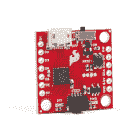
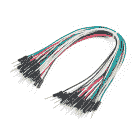

# SparkFun Qwiic GPIO 连接指南

> 原文：<https://learn.sparkfun.com/tutorials/sparkfun-qwiic-gpio-hookup-guide>

## 介绍

SparkFun Qwiic GPIO 是一款 I ² C 设备，旨在简化向微控制器添加额外的 GPIO 引脚。该板使用德州仪器的 TCA9534U I/O 扩展器 IC 来添加多达 8 个数字输入和输出，通过 I ² C 接口进行控制。TCA9534U 具有三个地址选择引脚，可以设置为配置八个唯一的地址，这意味着您可以从一条 I ² C 总线控制多达 *64 个* I/O 引脚！

[](https://www.sparkfun.com/products/17047) 

将**添加到您的[购物车](https://www.sparkfun.com/cart)中！**

 **### [spark fun Qwiic GPIO](https://www.sparkfun.com/products/17047)

[In stock](https://learn.sparkfun.com/static/bubbles/ "in stock") DEV-17047

基于 TCA9534 I/O 扩展器 ic 的 Qwiic GPIO 增加了额外的 8 个 IO 引脚，您可以像读取和写入任何…

$6.503[Favorited Favorite](# "Add to favorites") 15[Wish List](# "Add to wish list")** **[https://www.youtube.com/embed/-E9dE9xWuQc/?autohide=1&border=0&wmode=opaque&enablejsapi=1](https://www.youtube.com/embed/-E9dE9xWuQc/?autohide=1&border=0&wmode=opaque&enablejsapi=1)

为了简化布线，我们将 TCA9534U 上的所有八个通用 I/O 引脚与几个电源轨引脚分开，以锁定端子，正如您对 qw IC 板的期望，I ² C 接口被分成一对 qw IC 连接器。

控制 TCA9534 相对简单，但为了让事情变得更简单，我们为 Qwiic GPIO 编写了一个 Arduino 库和一个 Python 包，让编写代码变得尽可能简单。

在本指南中，我们将介绍您需要了解的关于 Qwiic GPIO 的一切，以便您可以轻松地将这些额外的 I/O 引脚添加到您的电路中！

### 所需材料

为了跟随本教程，你需要一些物品和你的 Qwiic GPIO。首先，你需要一个微控制器与电路板通信。以下是一些开箱即用的 Qwiic 选项:

[](https://www.sparkfun.com/products/15663) 

将**添加到您的[购物车](https://www.sparkfun.com/cart)中！**

 **### [【spark fun Thing Plus-ESP32 WROOM(微-B)](https://www.sparkfun.com/products/15663)

[Out of stock](https://learn.sparkfun.com/static/bubbles/ "out of stock") WRL-15663

SparkFun ESP32 Thing Plus 是开始使用 Espressif 物联网概念的下一步，同时还可以享受所有的便利设施

$22.5010[Favorited Favorite](# "Add to favorites") 48[Wish List](# "Add to wish list")****[](https://www.sparkfun.com/products/15123) 

将**添加到您的[购物车](https://www.sparkfun.com/cart)中！**

 **### [spark fun RedBoard Qwiic](https://www.sparkfun.com/products/15123)

[In stock](https://learn.sparkfun.com/static/bubbles/ "in stock") DEV-15123

SparkFun RedBoard Qwiic 是一款 Arduino 兼容开发板，内置 Qwiic 连接器，无需…

$21.5014[Favorited Favorite](# "Add to favorites") 49[Wish List](# "Add to wish list")****[](https://www.sparkfun.com/products/15444) 

将**添加到您的[购物车](https://www.sparkfun.com/cart)中！**

 **### [SparkFun RedBoard Artemis](https://www.sparkfun.com/products/15444)

[In stock](https://learn.sparkfun.com/static/bubbles/ "in stock") DEV-15444

RedBoard Artemis 采用 SparkFun 的功能强大的 Artemis 模块，并将其包装在一个易于使用和熟悉的环境中…

$21.509[Favorited Favorite](# "Add to favorites") 32[Wish List](# "Add to wish list")****[](https://www.sparkfun.com/products/15423) 

将**添加到您的[购物车](https://www.sparkfun.com/cart)中！**

 **### [spark fun Qwiic Micro-samd 21 开发板](https://www.sparkfun.com/products/15423)

[In stock](https://learn.sparkfun.com/static/bubbles/ "in stock") DEV-15423

SparkFun Qwiic Micro 的成型符合我们的标准 1" x 1" Qwiic 板尺寸，这使它成为我们最小的 SAMD21 微控制器…

$22.505[Favorited Favorite](# "Add to favorites") 18[Wish List](# "Add to wish list")******** ********如果您的首选微控制器没有 Qwiic 连接器，您可以使用以下产品之一添加一个:

[](https://www.sparkfun.com/products/14495) 

将**添加到您的[购物车](https://www.sparkfun.com/cart)中！**

 **### [SparkFun Qwiic 适配器](https://www.sparkfun.com/products/14495)

[In stock](https://learn.sparkfun.com/static/bubbles/ "in stock") DEV-14495

SparkFun Qwiic 适配器提供了将任何旧 I ² C 板改造成支持 Qwiic 的板的完美方法。

$1.601[Favorited Favorite](# "Add to favorites") 53[Wish List](# "Add to wish list")****[](https://www.sparkfun.com/products/14352) 

将**添加到您的[购物车](https://www.sparkfun.com/cart)中！**

 **### [ArduinoT3 的 SparkFun Qwiic 盾](https://www.sparkfun.com/products/14352)

[In stock](https://learn.sparkfun.com/static/bubbles/ "in stock") DEV-14352

SparkFun Qwiic Shield 是一种易于组装的板，它提供了一种简单的方法来将 Qwiic Connect 系统与

$7.508[Favorited Favorite](# "Add to favorites") 39[Wish List](# "Add to wish list")****[](https://www.sparkfun.com/products/16790) 

将**添加到您的[购物车](https://www.sparkfun.com/cart)中！**

 **### [SparkFun Qwiic 盾为物加](https://www.sparkfun.com/products/16790)

[In stock](https://learn.sparkfun.com/static/bubbles/ "in stock") DEV-16790

SparkFun Qwiic Shield for Thing Plus 使您可以使用 spark fun 的 Qwiic connect 生态系统和开发板来测试

$4.95[Favorited Favorite](# "Add to favorites") 7[Wish List](# "Add to wish list")****[](https://www.sparkfun.com/products/16789) 

将**添加到您的[购物车](https://www.sparkfun.com/cart)中！**

 **### [Arduino Nano的 SparkFun Qwiic 盾](https://www.sparkfun.com/products/16789)

[Only 14 left!](https://learn.sparkfun.com/static/bubbles/ "only 14 left!") DEV-16789

用于 Arduino Nano 的 SparkFun Qwiic Shield 使您可以将 SparkFun 的 Qwiic connect 生态系统与开发板一起使用…

$4.95[Favorited Favorite](# "Add to favorites") 12[Wish List](# "Add to wish list")******** ********最后，你至少需要一根 Qwiic 电缆，可能还需要一些连接线或跳线。以下是每种电缆类型的一些选项:

[](https://www.sparkfun.com/products/11375) 

将**添加到您的[购物车](https://www.sparkfun.com/cart)中！**

 **### [](https://www.sparkfun.com/products/11375)

[In stock](https://learn.sparkfun.com/static/bubbles/ "in stock") PRT-11375

各种颜色的电线:你知道这是一个美丽的东西。六种不同颜色的绞线装在一个纸板盒里…

$22.5019[Favorited Favorite](# "Add to favorites") 46[Wish List](# "Add to wish list")****[](https://www.sparkfun.com/products/14427) 

将**添加到您的[购物车](https://www.sparkfun.com/cart)中！**

 **### [Qwiic 线缆- 100mm](https://www.sparkfun.com/products/14427)

[In stock](https://learn.sparkfun.com/static/bubbles/ "in stock") PRT-14427

这是一条 100 毫米长的 4 芯电缆，带有 1 毫米 JST 端接。它旨在将支持 Qwiic 的组件连接在一起…

$1.50[Favorited Favorite](# "Add to favorites") 32[Wish List](# "Add to wish list")****[](https://www.sparkfun.com/products/11026) 

将**添加到您的[购物车](https://www.sparkfun.com/cart)中！**

 **### [跳线标准 7" M/M - 30 AWG (30 个装)](https://www.sparkfun.com/products/11026)

[In stock](https://learn.sparkfun.com/static/bubbles/ "in stock") PRT-11026

如果你需要快速完成一个原型，没有什么比一堆跳线更能加快速度的了，让我们来看看

$2.4520[Favorited Favorite](# "Add to favorites") 43[Wish List](# "Add to wish list")****[](https://www.sparkfun.com/products/14428) 

### [Qwiic 线缆- 200mm](https://www.sparkfun.com/products/14428)

[Out of stock](https://learn.sparkfun.com/static/bubbles/ "out of stock") PRT-14428

这是一根 200 毫米长的 4 芯电缆，带有 1 毫米 JST 端接。它旨在将支持 Qwiic 的组件连接在一起…

[Favorited Favorite](# "Add to favorites") 21[Wish List](# "Add to wish list")****** ******### 推荐阅读

如果您不熟悉 Qwiic 系统，我们建议您阅读此处的[以获得概述](https://www.sparkfun.com/qwiic):

| [](https://www.sparkfun.com/qwiic) |

如果您不熟悉以下教程中的概念，我们还建议您看一看这些教程:

[](https://learn.sparkfun.com/tutorials/polarity) [### 极性](https://learn.sparkfun.com/tutorials/polarity) An introduction to polarity in electronic components. Discover what polarity is, which parts have it, and how to identify it.[Favorited Favorite](# "Add to favorites") 52[](https://learn.sparkfun.com/tutorials/terminal-basics) [### 串行终端基础知识](https://learn.sparkfun.com/tutorials/terminal-basics) This tutorial will show you how to communicate with your serial devices using a variety of terminal emulator applications.[Favorited Favorite](# "Add to favorites") 46[](https://learn.sparkfun.com/tutorials/processor-interrupts-with-arduino) [### Arduino 处理器中断](https://learn.sparkfun.com/tutorials/processor-interrupts-with-arduino) What is an interrupt? In a nutshell, there is a method by which a processor can execute its normal program while continuously monitoring for some kind of event, or interrupt. There are two types of interrupts: hardware and software interrupts. For the purposes of this tutorial, we will focus on hardware interrupts.[Favorited Favorite](# "Add to favorites") 9[](https://learn.sparkfun.com/tutorials/how-to-work-with-jumper-pads-and-pcb-traces) [### 如何使用跳线焊盘和 PCB 走线](https://learn.sparkfun.com/tutorials/how-to-work-with-jumper-pads-and-pcb-traces) Handling PCB jumper pads and traces is an essential skill. Learn how to cut a PCB trace, add a solder jumper between pads to reroute connections, and repair a trace with the green wire method if a trace is damaged.[Favorited Favorite](# "Add to favorites") 11

## 硬件概述

正如我们在简介中提到的，Qwiic GPIO 具有 TCA9534 I/O 扩展器，可通过 I ² C 与多达 8 个数字输入/输出引脚通信，在本节中，我们将研究 TCA9534 的特性以及 Qwiic GPIO 分线点的特性。

### TCA9534 I/O 扩展器 IC

德州仪器的 TCA9534 提供 I ² C 到并行数字输入输出接口。我们将在这里讨论基础知识，但要全面了解 TCA9534，请参考[数据手册](https://cdn.sparkfun.com/assets/b/b/f/1/7/TCA9534.pdf)。该 IC 的工作输入电压范围为 **1.65V** 至 **5.5V** ，但我们建议通过 Qwiic 连接器或通过任何 **3.3V** 和接地引脚使用 **3.3V** 为其供电，以保持与其他 Qwiic 器件的兼容性。

[](https://cdn.sparkfun.com/assets/learn_tutorials/1/2/1/0/SparkFun_Qwiic_GPIO-TCA9534.jpg)

TCA9534 支持标准(100kHz)和快速模式(400kHz) I ² C 频率。该 IC 还具有一个低电平有效中断引脚，当配置为输入的任何引脚的状态与输入端口寄存器的状态不同时，该引脚被激活。这意味着您可以将此 INT 引脚连接到微控制器上的一个支持中断的引脚，以被动监控连接到 TCA9534 的器件。有关该功能的更多信息，请参考 [TCA9534 数据表](https://cdn.sparkfun.com/assets/b/b/f/1/7/TCA9534.pdf)中的第 8.3.2 节和 Qwiic GPIO Arduino 库中的示例 4 -中断。

三个硬件引脚(A0、A1 和 A2)是专用的 I ² C 地址选择引脚。我们在 Qwiic GPIO 中增加了三个跳线，允许用户在同一条总线上拥有多达 8 块电路板。下面的焊接跳线部分将更详细地介绍如何在 Qwiic GPIO 上使用这些引脚和跳线。

### 闩锁端子

Qwiic GPIO 将 TCA9534 的所有八个 I/O 引脚、中断引脚以及几个电源轨引脚( **3.3V** 和地)连接到四个 4 引脚锁存端子，因此将外设连接到电路板非常容易。你需要做的只是将一根剥开的电线插入你喜欢的端子开口，然后用力按下锁柄，将电线固定到位。

[](https://cdn.sparkfun.com/assets/learn_tutorials/1/2/1/0/SparkFun_Qwiic_GPIO-LatchTerminals.jpg)

上电时，每个 I/O 引脚默认为一个输入。发送适当的命令会将它们切换到输出，您也可以通过 I ² C 反转每个引脚的极性，请继续阅读 Qwiic GPIO Arduino 库和 Python 包部分，了解有关如何配置这些引脚并与之交互的更多信息。

### Qwiic 和 I ² C 接口

正如您对 Qwiic 板的期望，Qwiic GPIO 上的 I ² C 总线( **SDA** 、 **SCL** 、 **GND** 和 **3.3V** )的连接被分成一对 Qwiic 连接器以及标准的 0.1 英寸间距 PTH 引脚，供那些希望焊接到它们的人使用。Qwiic GPIO 的默认 I ² C 地址是 **0x27** 。

[](https://cdn.sparkfun.com/assets/learn_tutorials/1/2/1/0/SparkFun_Qwiic_GPIO-Qwiic-I2C.jpg)

### 焊料跳线

If you have never worked with solder jumpers and PCB traces before or would like a quick refresher, check out our [How to Work with Solder Jumpers and PCB Traces](https://learn.sparkfun.com/tutorials/how-to-work-with-jumper-pads-and-pcb-traces) tutorial for detailed instructions and tips.

Qwiic GPIO 有六个跳线来配置标有 **I ² C** 、 **PWR** 、 **INT** 、 **A0** 、 **A1** 和 **A2** 的电路板。本节介绍每个跳线的功能以及如何配置它们。

[](https://cdn.sparkfun.com/assets/learn_tutorials/1/2/1/0/SparkFun_Qwiic_GPIO-Jumpers.jpg)

#### I ² C 跳线

该跳线通过两个**4.7kω**电阻将 SDA 和 SCL 线连接到 **3.3V** 。默认状态是**关闭**。要禁用上拉电阻，只需切断焊盘之间的走线，断开跳线。如果同一条总线上有多个 Qwiic GPIO 或其他 I ² C 器件，则禁用除一对上拉电阻之外的所有上拉电阻，以避免在 SDA 和 SCL 线上产生太强的电阻。

#### 电源跳线

此跳线控制主板上电源指示灯的电压。它通过**1kω**电阻将功率 LED 的阳极连接到 **3.3V** 。默认状态是**关闭**。要禁用电源指示灯，请通过切断两个焊盘之间的走线来断开跳线。禁用电源指示灯有助于降低主板的整体功耗。

#### 中断跳线

该跳线通过**10kω**电阻将 TCA9534 的中断引脚连接到 **3.3V** ，其默认状态为**关闭**。这将保持中断引脚为高电平，因此当 TCA9534 监控到中断事件时，可以将其驱动为低电平。如果中断引脚上有另一个上拉电阻，则打开跳线。

#### 地址跳线

Qwiic GPIO 上的三个地址跳线:ADR0、ADR1 和 ADR2，通过将它们拉至 **3.3V** 或**0V/地**来设置 TCA9534 的 I ² C 地址。所有三个跳线的默认状态是**关闭**，它们通过一个**2.2kω**电阻将每个地址引脚连接到 **3.3V** 。该配置将默认 I ² C 地址设置为 **0x27** 。通过打开或关闭这些跳线，您可以改变 TCA9534 的地址，这样您就可以在一条 I ² C 总线上拥有多达八块这样的板。点击按钮打开下表，显示各种跳线配置和每个配置设置的地址:

| ADR0 状态 | ADR1 状态 | ADR2 状态 | 地址(十六进制) |
| 关闭的 | 关闭的 | 关闭的 | 27(默认) |
| 打开 | 关闭的 | 关闭的 | Twenty-six |
| 关闭的 | 打开 | 关闭的 | Twenty-five |
| 打开 | 打开 | 关闭的 | Twenty-four |
| 关闭的 | 关闭的 | 打开 | Twenty-three |
| 打开 | 关闭的 | 打开 | Twenty-two |
| 关闭的 | 打开 | 打开 | Twenty-one |
| 打开 | 打开 | 打开 | Twenty |

### 电路板尺寸

Qwiic GPIO 比我们的标准 Qwiic 分线点尺寸(1" x 1 ")稍大一些。它的尺寸为 2.40 英寸 x 1.50 英寸(60.96 毫米 x 38.10mm 毫米)，有四个安装孔，可安装 4-40 螺钉。

[](https://cdn.sparkfun.com/assets/learn_tutorials/1/2/1/0/Qwiic_GPIO_Dimensions.png)

既然我们对 Qwiic GPIO 上的硬件有了更多的了解，现在是时候将它连接到我们的微控制器上，并将一些外设连接到 I/O 引脚上了。接下来，我们将详细介绍如何组装电路板和 Qwiic GPIO 电路。

## 硬件装配

Qwiic 系统使 Qwiic GPIO 与您选择的微控制器的连接变得轻而易举。您只需用 qw IC 电缆或[适配器电缆](https://www.sparkfun.com/products/14425)将 Qwiic GPIO 连接到您选择的开发板。如果您不想使用 Qwiic 连接器，可以连接到电路板侧面的 0.1 英寸插头。

如果您喜欢使用 Qwiic GPIO 上断开的 PTH 引脚，您需要焊接到这些引脚上。对于原型制作的临时连接，这些 [IC 挂钩](https://www.sparkfun.com/products/9741)是进行该连接的最佳选择。对于不熟悉通孔焊接的用户来说，可以看看这个教程:

[](https://learn.sparkfun.com/tutorials/how-to-solder-through-hole-soldering) [### 如何焊接:通孔焊接

#### 2013 年 9 月 19 日](https://learn.sparkfun.com/tutorials/how-to-solder-through-hole-soldering) This tutorial covers everything you need to know about through-hole soldering.[Favorited Favorite](# "Add to favorites") 70

将外设连接到 GPIO 很简单，使用锁存端子也很简单。如果您使用的是连接电线，请确保您已剥去电线末端，将其插入适当的端子(确保其“打开”)，然后用力按下插销端子以将电线固定到位。根据你打算如何使用 I/O 引脚，你会想要将你的另一根线连接到一个 **3.3V** 或**接地**引脚。出于演示目的，我们使用 led 和按钮分别作为我们的输入和输出。

[](https://cdn.sparkfun.com/assets/learn_tutorials/1/2/1/0/Qwiic_GPIO_Hookup_Guide-01.jpg)*Having trouble seeing the detail in this mess of jumper wires? Click on the photo for a larger view!*

装配好 Qwiic GPIO 电路并连接到您的微控制器后，是时候上传一些代码并开始通过 I ² C 控制额外的 I/O 引脚了！

## Qwiic GPIO Arduino 库

**Note:** This library assumes you are using the latest version of the Arduino IDE on your desktop. If this is your first time using Arduino, please review our tutorial on [installing the Arduino IDE.](https://learn.sparkfun.com/tutorials/installing-arduino-ide) If you have not previously installed an Arduino library, please check out our [installation guide.](https://learn.sparkfun.com/tutorials/installing-an-arduino-library)

SparkFun Qwiic GPIO Arduino 库有助于简化 TCA9534 与 Arduino 微控制器之间的接口。在这一节中，我们将列出库中所有可用的函数，并简要描述它们的功能。

### 库函数

我们在下面概述了 Arduino 库中的所有函数，以及它们的一些快速描述。这些例子涵盖了几乎所有的函数，所以你可以参考这些例子来帮助你编写自己的代码。

#### 设备设置和设置

*   `bool begin(TwoWire &wirePort, uint8_t address);` -初始化 I ² C 总线上的 TCA9534。如果您已经使用 ADR 跳线将 TCA9534 设置为备用 I ² C 地址，请在此输入。
*   `bool pinMode(uint8_t gpioNumber, bool mode);` -设置 TCA9534 上所选 GPIO 引脚的模式。例如，`pinMode(0, GPIO_OUT);`将引脚 0 设置为输出。上电时，所有 I/O 默认为**输入**。
*   `bool pinMode(bool *gpioPinMode);` -上述功能的替代功能，将整个端口设置为输入或输出。这接受在您的设置中定义的 bool 来一次设置所有八个 GPIO 引脚。有关使用该功能的更多信息，请参考[示例 1B -写入 GPIO 端口](https://github.com/sparkfun/SparkFun_Qwiic_GPIO_Library/blob/master/examples/Example1b-Write_GPIO_Port/Example1b-Write_GPIO_Port.ino)。
*   `bool invertPin(uint8_t gpioNumber, bool inversionMode);` -反转 TCA9534 上所选 GPIO 引脚的极性。
*   `bool invertPin(bool *inversionMode);` -反转 TCA9534 整个端口的极性。关于如何设置和使用该功能的演示，请参考[示例 3B -反转 _ 端口](https://github.com/sparkfun/SparkFun_Qwiic_GPIO_Library/blob/master/examples/Example3b-Inversion_Port/Example3b-Inversion_Port.ino)。

#### GPIO 读写

*   `bool digitalWrite(uint8_t gpioNumber, bool value);` -您的基本数字书写功能。写入所选 GPIO 引脚`HIGH`或`LOW`。
*   `bool digitalWrite(bool *gpioOutStatus);` -使用`bool`向`HIGH`或`LOW`写入整个端口设置。
*   `bool digitalRead(uint8_t gpioNumber);` -标准数字读取功能。返回所选 GPIO 引脚的状态。
*   `uint8_t digitalReadPort(bool *gpioInStatus);` -使用`bool`读取整个端口设置的状态。返回端口上所有选定管脚的状态。看一下 [Example2B - Read_GPIO_Port](https://github.com/sparkfun/SparkFun_Qwiic_GPIO_Library/blob/master/examples/Example2b-Read_GPIO_Port/Example2b-Read_GPIO_Port.ino) 做参考。

#### 高级功能

这些功能旨在让有经验的用户读写特定的位和寄存器。

*   `bool readBit(uint8_t regAddr, uint8_t bitAddr);` -读取所选寄存器中的特定位。
*   `bool writeBit(uint8_t regAddr, uint8_t bitAddr, bool bitToWrite);` -写入所选寄存器中的特定位。
*   `uint8_t readRegister(uint8_t addr);` -读取特定寄存器。
*   `bool writeRegister(uint8_t addr, uint8_t val);` -写入特定寄存器。

接下来，我们将介绍 Qwiic GPIO Arduino 库包含的示例，以查看这些功能的运行情况，并进一步解释如何为`pinMode();`、`invertPin();`和`digitalWrite();`设置端口选项。

## Arduino 示例

Qwiic GPIO Arduino 库有三个示例，分为单引脚和端口变量，演示如何设置控制 TCA9534，第四个示例演示如何使用外部中断功能。在本节中，我们将回顾这些示例，并强调在代码中设置 Qwiic GPIO 时需要注意的一些事项。

**Note:** If you are using the SparkFun Qwiic Micro - SAMD21 Development Board as shown in the Hardware Assembly section you'll need to add this quick define due to how the SAMD architecture handles ports: `#define Serial SerialUSB`
This definition helps a ton when working with chip architectures that have multiple serial ports you need to call specifically instead of using a general `Serial` calls. Simply update that definition with whichever serial port you want to use for [serial prints](https://learn.sparkfun.com/tutorials/terminal-basics) via USB.

### 示例 1A:编写 GPIO

一个基本的数字书写例子。导航至**文件>示例> SparkFun Qwiic GPIO Arduino 库>示例 1a-Write_GPIO** 打开 Arduino 中的示例 1A。本例将 GPIO 0 设置为输出，并将其切换为高电平和低电平。代码通过在默认地址上初始化 I ² C 总线上的 Qwiic GPIO 启动，并将 GPIO0 设置为输出:

```
language:c
myGPIO.pinMode(0, GPIO_OUT); //Use GPIO_OUT and GPIO_IN instead of OUTPUT and INPUT_PULLUP 
```

当将 GPIO 引脚设置为输入或输出时，注意使用`GPIO_OUT`或`GPIO_IN`而不是`OUTPUT`和`INPUT_PULLUP`的标准 Arduino 设置。我们使用这些备用引脚是因为 TCA9534 的 I/O 引脚默认为**输入**(引脚模式=真)，因此在库中定义了`GPIO_IN = true`和`GPIO_OUT = false`来设置引脚模式以避免混淆。在我们将 GPIO 0 设置为输出后，代码每秒使用`digitalWrite();`将其切换为高电平和低电平，并通过[串行](https://learn.sparkfun.com/tutorials/terminal-basics)输出 GPIO 状态。

[](https://cdn.sparkfun.com/assets/learn_tutorials/1/2/1/0/Qwiic_GPIO_Hookup_Guide-02.jpg)

上面的演示电路显示了 GPIO 0 使用 led 在高电平和低电平之间切换的直观表示。如果你想控制更多的管脚，只需为你想使用的管脚添加另一个`myGPIO.pinMode();`，将其设置为输出，然后使用`myGPIO.digitalWrite();`控制它。

### 示例 1B:写 GPIO - Port

这个版本的写入 Qwiic GPIO 控制整个端口(所有 8 个 GPIO 引脚)。为了设置端口，我们需要定义我们正在使用的 GPIO 管脚的数量，并构造一个布尔值来定义每个管脚是输入还是输出。由于本例用于写入端口，因此所有八个引脚都被定义为输出:

```
language:c
#define NUM_GPIO 8

bool currentPinMode[NUM_GPIO] = {GPIO_OUT, GPIO_OUT, GPIO_OUT, GPIO_OUT, GPIO_OUT, GPIO_OUT, GPIO_OUT, GPIO_OUT}; 
```

除了引脚模式，我们还需要定义每个 GPIO 的初始状态:

```
language:c
bool gpioConfig[NUM_GPIO] = {HIGH, LOW, HIGH, LOW, HIGH, LOW, HIGH, LOW} 
```

配置好 GPIO 端口后，代码初始化 I ² C 总线上的 Qwiic GPIO，然后使用本例特有的函数`flipGPIO();`每秒改变每个引脚的状态:

```
language:c
void flipGPIO()
{
    for (uint8_t arrayPosition = 0; arrayPosition < NUM_GPIO; arrayPosition++)
    {
        gpioConfig[arrayPosition] = !gpioConfig[arrayPosition];
    }
} 
```

### 示例 2A:读取 GPIO

2A 示例演示了如何读取 TCA9534 上的单个 GPIO 引脚。它首先将 GPIO 0 设置为输入，读取其状态，并通过串行打印出它是高还是低。与示例 1 相似，GPIO 0 已设置，但在本例中，使用`pinMode(0, GPIO_IN);`将其设置为输入。然后，代码每隔 250ms 监控一次引脚状态，并通过串行方式打印状态。您可以查看下面的主循环:

```
language:c
void loop() {
  bool gpioState = myGPIO.digitalRead(0);
  switch (gpioState) {
    case true:
      Serial.println("HIGH");
      break;
    case false:
      Serial.println("LOW");
      break;
  }
  delay(250);
} 
```

[](https://cdn.sparkfun.com/assets/learn_tutorials/1/2/1/0/Qwiic_GPIO_Hookup_Guide-03.jpg)

上图中的示例电路演示了如何通过在按下按钮时将选定的 I/O 引脚(本例中为 GPIO 0)拉低来监控 Qwiic GPIO 上的高电平有效输入。

**Note:** Defining a pin as an input is not absolutely necessary since GPIO pins on the TCA9534 default to inputs on power on. We include that call in any example using inputs in case an I/O pin used in the example was set as an output without power-cycling the Qwiic GPIO.

### 示例 2B:读取 GPIO 端口

2B 示例演示了如何读取 TCA9534 上的整个 GPIO 端口。该代码设置了所有 8 个 GPIO 引脚，就像示例 1B 使用布尔值一样，但这次所有引脚都被设置为输入。由于 TCA9534 的端口读取寄存器的工作方式，我们还需要为 GPIO 引脚状态设置第二个布尔值:

```
language:c
bool gpioStatus[NUM_GPIO] 
```

随着端口的设置和配置，我们可以继续初始化 I ² C 总线上的 Qwiic GPIO，并开始读取整个 GPIO 端口的状态。正如下面代码中的注释所解释的，为了从端口读取，您可以将完整的寄存器值作为一个无符号的 8 位整数返回，或者通过传递一个由返回每个引脚状态的函数修改的 8 个布尔值的数组。该示例默认为后者，并为端口读取设置了一个数组:

```
language:c
void loop() {
  //There are two ways to read from a port, either by returning the full register value as a uint8_t, or passing in an array of 8 boolean's to be modified by the function with the statuses of each pin
  uint8_t portValue = myGPIO.digitalReadPort(gpioStatus);

  Serial.print("uint8_t: ");
  Serial.println(portValue, BIN);
  Serial.print("Bool array: ");
  for (uint8_t arrayPosition = 0; arrayPosition < NUM_GPIO; arrayPosition++) {
    Serial.print(arrayPosition);
    Serial.print(": ");
    switch (gpioStatus[arrayPosition])
    {
      case true:
        Serial.print("HIGH");
        break;
      case false:
        Serial.print("LOW");
        break;
    }
  }
  Serial.println("\n");
  delay(100);
} 
```

### 实施例 3A:倒置

示例 3A 显示了如何反转 Qwiic GPIO 上的输入信号极性。极性反转仅适用于配置为输入的引脚，因此我们首先设置引脚模式，然后反转极性。输入引脚默认为高电平有效，因此反相时会变为低电平有效。下面你可以看到引脚反转所需的设置:

```
language:c
myGPIO.pinMode(0, GPIO_IN);
myGPIO.invertPin(0, INVERT); 
```

一旦我们将引脚设置为输入并反转极性，主循环每 100ms 读取一次引脚状态:

```
language:c
void loop() {
  bool status = myGPIO.digitalRead(0);    
  switch (status)
    {
      case true:
        Serial.println("GPIO 0: HI");
        break;
      case false:
        Serial.println("GPIO 0: LO");
        break;
    }
  delay(100);
} 
```

### 示例 3B:反转端口

如你所料，3B 展示了如何反转 Qwiic GPIO 上的整个端口。该代码与其他端口示例一样，首先定义端口上所有引脚的引脚数并设置其引脚模式。然后，它使用第二个布尔函数反转一半引脚的极性。设置如下所示:

```
language:c
#define NUM_GPIO 8

bool currentPinMode[NUM_GPIO] = {GPIO_IN, GPIO_IN, GPIO_IN, GPIO_IN, GPIO_IN, GPIO_IN, GPIO_IN, GPIO_IN};

bool inversionStatus[NUM_GPIO] = {INVERT, INVERT, INVERT, INVERT, NO_INVERT, NO_INVERT, NO_INVERT, NO_INVERT}; 
```

主循环与示例 2B - ReadGPIO - Port 相同，并使用无符号 8 位整数打印出端口寄存器的状态。

### 示例 4:中断

**Heads Up!** In this example we use D13 as our interrupt pin since the code was written for use with a SparkFun RedBoard/Arduino Uno. If you are using a different microcontroller with your Qwiic GPIO, take a look through its documentation to see which pins can be used as an interrupt and then adjust this definition: `#define INTERRUPT PIN 13` to the selected pin. If you are not familiar with using processor interrupts on a microcontroller, [this tutorial](https://learn.sparkfun.com/tutorials/processor-interrupts-with-arduino) will help you get started.

示例 4 演示了当任何输入引脚记录变化时，如何使用 TCA9534 上的中断引脚。中断引脚为低电平有效，一旦读取输入寄存器，它将返回高电平。我们将 INT 引脚连接到一个锁存端子，这样您就可以将一根电线连接到该端子，并将其连接到微控制器上的可中断引脚。如果您愿意，INT 引脚也可以连接到 PTH 引脚，以便焊接。无论您选择哪个选项，将 Qwiic GPIO 上的中断引脚连接到 Arduino 上的 D13(假设您使用的是 Uno/RedBoard)。

代码的开始类似于我们的其他端口示例，定义 GPIO 引脚的数量并设置其引脚状态。除了 GPIO 引脚，我们还定义了微控制器上的中断引脚。您可以在下面查看这段代码的相关部分:

```
language:c
#define NUM_GPIO 8

#define INTERRUPT_PIN 13

bool currentPinMode[NUM_GPIO] = {GPIO_IN, GPIO_IN, GPIO_IN, GPIO_IN, GPIO_IN, GPIO_IN, GPIO_IN, GPIO_IN};

bool gpioStatus[NUM_GPIO];

bool dataReady = true; 
```

定义好一切后，设置初始化 I ² C 总线上的 Qwiic GPIO，将微控制器上的中断引脚设置为输入，通过将其写入高电平来“启动”它，并告诉我们的微控制器将其视为中断:

```
language:c
pinMode(INTERRUPT_PIN, INPUT_PULLUP);
digitalWrite(INTERRUPT_PIN, HIGH);
attachInterrupt(digitalPinToInterrupt(INTERRUPT_PIN), ISR, FALLING); 
```

既然我们的中断引脚已经配置好，代码就会监控 GPIO 引脚的状态，只要状态发生变化，Qwiic GPIO 上的中断引脚就会被拉低。您可以在下面查看整个循环和 ISR 功能:

```
language:c
void loop() {
  if (dataReady) {
    myGPIO.digitalReadPort(gpioStatus);
    for (uint8_t arrayPosition = 0; arrayPosition < NUM_GPIO; arrayPosition++) {
      Serial.print(arrayPosition);
      Serial.print(": ");
      switch (gpioStatus[arrayPosition])
      {
        case true:
          Serial.print("HI ");
          break;
        case false:
          Serial.print("LO ");
          break;
      }
    }
    Serial.println();
    dataReady = false;
  }
}

void ISR() {
  dataReady = true;
} 
```

Arduino 示例到此结束，但是如果您更喜欢在不同的开发板或单板计算机(如 Raspberry Pi)上使用 Python，请继续阅读下面两节，我们将详细介绍如何使用 Qwiic GPIO Python 包。

## Qwiic GPIO Python 包

**注意:**这个包假设你使用的是最新版本的 Python 3。如果这是你第一次在 Raspberry Pi 上使用 Python 或 I ² C 硬件，请查看我们关于用 Raspberry Pi 和 [Raspberry Pi SPI 和 I2C 教程](https://learn.sparkfun.com/tutorials/raspberry-pi-spi-and-i2c-tutorial)进行 [Python 编程的教程。](https://learn.sparkfun.com/tutorials/python-programming-tutorial-getting-started-with-the-raspberry-pi)

除了 Arduino 库，我们还编写了一个 Python 包来控制 Qwiic GPIO。你可以安装 PyPi 托管的`sparkfun-qwiic-gpio` Python 包，或者如果你喜欢从 [GitHub 库](https://github.com/sparkfun/Qwiic_GPIO_Py)手动下载并构建库，你可以点击下面的按钮(**请注意任何包的依赖性。你也可以查看位于[的知识库文档页面，阅读文档](https://sparkfun-qwiic-gpio.readthedocs.io/en/latest/)。*):

[Download the SparkFun Qwiic GPIO Python Package (ZIP)](https://github.com/sparkfun/Qwiic_GPIO_Pyy/archive/main.zip)

### 装置

**注意:**不要忘记仔细检查硬件 I ² C 连接是否在你的 Raspberry Pi 或者其他单板电脑上启用。

#### PyPi 安装

这个存储库作为`sparkfun-qwiic-gpio package`托管在 PyPi 上。在支持 PyPi 的系统上，通过`pip3`安装(对于 Python 2 使用`pip`)很简单，使用以下命令:

对于**所有用户**(注意:用户必须拥有 [**须户**](https://en.wikipedia.org/wiki/Sudo) 权限):

```
language:bash
sudo pip3 install sparkfun-qwiic-gpio 
```

对于**当前用户**:

```
language:bash
pip3 install sparkfun-qwiic-gpio 
```

#### 本地安装

要安装，请确保系统上安装了`setuptools`包。

命令行直接安装(Python 2 使用`python`):

```
language:bash
python3 setup.py install 
```

要构建与`pip3`一起使用的包:

```
language:bash
python3 setup.py sdist 
```

构建一个包文件并放在名为 dist 的子目录中。这个包文件可以用`pip3`来安装。

```
language:bash
cd dist
pip3 install sparkfun_qwiic_gpio-<version>.tar.gz 
```

#### 属国

这个 Python 包在代码中有一些依赖项，如下所示:

```
language:python
from __future__ import print_function
import math
import qwiic_i2c 
```

#### 功能概述

要全面了解 Qwiic GPIO Py 软件包包含的所有功能，请前往 [ReadtheDocs 页面](https://sparkfun-qwiic-gpio.readthedocs.io/en/latest/?)。

## Python 示例

安装了 Qwiic GPIO Python 包后，我们可以开始使用其中包含的示例了。在这一节中，我们将检查每个示例，并突出显示相关的代码。要运行示例，下载或复制代码到一个文件中，然后打开/保存示例文件(如果需要)，并在您的[首选 Python IDE](https://www.sparkfun.com/news/2706) 中执行代码。

### Qwiic GPIO 示例 1

本例将所有八个 I/O 引脚设置为输出，并每秒开关一次。注意，您需要定义每个引脚的模式，并调用`setMode`将配置写入 Qwiic GPIO。复制下面的代码，并在您选择的 Python IDE 中执行它。

```
language:python
from __future__ import print_function
import qwiic_gpio
import time
import sys

def runExample():

    print("\nSparkFun Qwiic GPIO Example 1\n")
    myGPIO = qwiic_gpio.QwiicGPIO()

    if myGPIO.isConnected() == False:
        print("The Qwiic GPIO isn't connected to the system. Please check your connection", \
            file=sys.stderr)
        return

    myGPIO.begin()
    myGPIO.mode_0 = myGPIO.GPIO_OUT
    myGPIO.mode_1 = myGPIO.GPIO_OUT
    myGPIO.mode_2 = myGPIO.GPIO_OUT
    myGPIO.mode_3 = myGPIO.GPIO_OUT
    myGPIO.mode_4 = myGPIO.GPIO_OUT
    myGPIO.mode_5 = myGPIO.GPIO_OUT
    myGPIO.mode_6 = myGPIO.GPIO_OUT
    myGPIO.mode_7 = myGPIO.GPIO_OUT
    myGPIO.setMode()

    while True:
        myGPIO.out_status_0 = myGPIO.GPIO_HI
        myGPIO.out_status_1 = myGPIO.GPIO_HI
        myGPIO.out_status_2 = myGPIO.GPIO_HI
        myGPIO.out_status_3 = myGPIO.GPIO_HI
        myGPIO.out_status_4 = myGPIO.GPIO_HI
        myGPIO.out_status_5 = myGPIO.GPIO_HI
        myGPIO.out_status_6 = myGPIO.GPIO_HI
        myGPIO.out_status_7 = myGPIO.GPIO_HI
        myGPIO.setGPIO()
        print("set hi")
        time.sleep(1)
        myGPIO.out_status_0 = myGPIO.GPIO_LO
        myGPIO.out_status_1 = myGPIO.GPIO_LO
        myGPIO.out_status_2 = myGPIO.GPIO_LO
        myGPIO.out_status_3 = myGPIO.GPIO_LO
        myGPIO.out_status_4 = myGPIO.GPIO_LO
        myGPIO.out_status_5 = myGPIO.GPIO_LO
        myGPIO.out_status_6 = myGPIO.GPIO_LO
        myGPIO.out_status_7 = myGPIO.GPIO_LO
        myGPIO.setGPIO()
        print("set lo")
        time.sleep(1)

if __name__ == '__main__':
    try:
        runExample()
    except (KeyboardInterrupt, SystemExit) as exErr:
        print("\nEnding Example 1")
        sys.exit(0) 
```

### Qwiic GPIO 示例 2

示例 2 显示了当 I/O 引脚被配置为输入时，如何读取每个 I/O 引脚。它首先使用`setMode`函数设置所有引脚，就像我们在示例 1 中所做的那样。然后，代码每隔 0.25 秒监视并打印出每个输入的状态。您可以复制下面的整个示例，或者从 Python 包的下载副本中打开它:

```
language:python
from __future__ import print_function
import qwiic_gpio
import time
import sys

def runExample():

    print("\nSparkFun Qwiic GPIO Example 2\n")
    myGPIO = qwiic_gpio.QwiicGPIO()

    if myGPIO.isConnected() == False:
        print("The Qwiic GPIO isn't connected to the system. Please check your connection",
              file=sys.stderr)
        return

    myGPIO.begin()
    myGPIO.mode_0 = myGPIO.GPIO_IN
    myGPIO.mode_1 = myGPIO.GPIO_IN
    myGPIO.mode_2 = myGPIO.GPIO_IN
    myGPIO.mode_3 = myGPIO.GPIO_IN
    myGPIO.mode_4 = myGPIO.GPIO_IN
    myGPIO.mode_5 = myGPIO.GPIO_IN
    myGPIO.mode_6 = myGPIO.GPIO_IN
    myGPIO.mode_7 = myGPIO.GPIO_IN
    myGPIO.setMode()

    while True:
        myGPIO.getGPIO() #This function updates each in_status_x variable
        print("GPIO 0:", end=" ")
        print(myGPIO.in_status_0, end=" ")
        print("GPIO 1:", end=" ")
        print(myGPIO.in_status_1, end=" ")
        print("GPIO 2:", end=" ")
        print(myGPIO.in_status_2, end=" ")
        print("GPIO 3:", end=" ")
        print(myGPIO.in_status_3, end=" ")
        print("GPIO 4:", end=" ")
        print(myGPIO.in_status_4, end=" ")
        print("GPIO 5:", end=" ")
        print(myGPIO.in_status_5, end=" ")
        print("GPIO 6:", end=" ")
        print(myGPIO.in_status_6, end=" ")
        print("GPIO 7:", end=" ")
        print(myGPIO.in_status_7)
        time.sleep(.25)

if __name__ == '__main__':
    try:
        runExample()
    except (KeyboardInterrupt, SystemExit) as exErr:
        print("\nEnding Example 1")
        sys.exit(0) 
```

### Qwiic GPIO 示例 3

示例 3 演示了如何反转配置为输入的 I/O 引脚。我们首先将所有 8 个引脚设置为输入，然后使用`setInversion(self)`功能反转其中的一半。正如我们在 Arduino 示例部分所述，每个设置为输入的 I/O 引脚默认为高电平有效输入，因此反相会将其切换为低电平有效输入。同样，请注意，您需要定义想要反转的每个引脚的反转状态，然后使用`setInversion`函数写入该数据。

```
language:python
from __future__ import print_function
import qwiic_gpio
import time
import sys

def runExample():

    print("\nSparkFun Qwiic GPIO Example 3\n")
    myGPIO = qwiic_gpio.QwiicGPIO()

    if myGPIO.isConnected() == False:
        print("The Qwiic GPIO isn't connected to the system. Please check your connection",
              file=sys.stderr)
        return

    myGPIO.begin()
    myGPIO.mode_0 = myGPIO.GPIO_IN
    myGPIO.mode_1 = myGPIO.GPIO_IN
    myGPIO.mode_2 = myGPIO.GPIO_IN
    myGPIO.mode_3 = myGPIO.GPIO_IN
    myGPIO.mode_4 = myGPIO.GPIO_IN
    myGPIO.mode_5 = myGPIO.GPIO_IN
    myGPIO.mode_6 = myGPIO.GPIO_IN
    myGPIO.mode_7 = myGPIO.GPIO_IN
    myGPIO.setMode()

    myGPIO.inversion_0 = myGPIO.INVERT
    myGPIO.inversion_1 = myGPIO.NO_INVERT
    myGPIO.inversion_2 = myGPIO.INVERT
    myGPIO.inversion_3 = myGPIO.NO_INVERT
    myGPIO.inversion_4 = myGPIO.INVERT
    myGPIO.inversion_5 = myGPIO.NO_INVERT
    myGPIO.inversion_6 = myGPIO.INVERT
    myGPIO.inversion_7 = myGPIO.NO_INVERT
    myGPIO.setInversion()

    while True:
        myGPIO.getGPIO()  # This function updates each in_status_x variable
        print("GPIO 0:", end=" ")
        print(myGPIO.in_status_0, end=" ")
        print("GPIO 1:", end=" ")
        print(myGPIO.in_status_1, end=" ")
        print("GPIO 2:", end=" ")
        print(myGPIO.in_status_2, end=" ")
        print("GPIO 3:", end=" ")
        print(myGPIO.in_status_3, end=" ")
        print("GPIO 4:", end=" ")
        print(myGPIO.in_status_4, end=" ")
        print("GPIO 5:", end=" ")
        print(myGPIO.in_status_5, end=" ")
        print("GPIO 6:", end=" ")
        print(myGPIO.in_status_6, end=" ")
        print("GPIO 7:", end=" ")
        print(myGPIO.in_status_7)
        time.sleep(.25)

if __name__ == '__main__':
    try:
        runExample()
    except (KeyboardInterrupt, SystemExit) as exErr:
        print("\nEnding Example 1")
        sys.exit(0) 
```

## 资源和更进一步

这就结束了连接指南！有关 Qwiic GPIO 的更多信息，请查看以下链接:

*   [示意图(PDF)](https://cdn.sparkfun.com/assets/2/e/4/6/c/SparkFun_Qwiic_GPIO_Schematic.pdf)
*   [老鹰文件(ZIP)](https://cdn.sparkfun.com/assets/c/f/c/a/7/SparkFun_Qwiic_GPIO.zip)
*   [尺寸图(PNG)](https://cdn.sparkfun.com/assets/learn_tutorials/1/2/1/0/Qwiic_GPIO_Dimensions.png)
*   [TCA9534 数据手册(PDF)](https://cdn.sparkfun.com/assets/b/b/f/1/7/TCA9534.pdf)
*   [GitHub 硬件库](https://github.com/sparkfun/Qwiic_GPIO)
*   [Qwiic GIPO Arduino 库知识库](https://github.com/sparkfun/SparkFun_Qwiic_GPIO_Library)
*   [Qwiic GPIO Python 包](https://github.com/sparkfun/Qwiic_GPIO_Py)

不确定下一个输入/输出项目从哪里开始？这些输入教程可能有助于激发灵感:

[](https://learn.sparkfun.com/tutorials/touch-potentiometer-hookup-guide) [### 触摸电位计连接指南](https://learn.sparkfun.com/tutorials/touch-potentiometer-hookup-guide) Learn how to use the SparkFun Touch Potentiometer to control lighting, volume or other inputs in your daily life.[Favorited Favorite](# "Add to favorites") 7[](https://learn.sparkfun.com/tutorials/three-quick-tips-about-using-ufl) [### 关于使用 U.FL 的三个快速提示](https://learn.sparkfun.com/tutorials/three-quick-tips-about-using-ufl) Quick tips regarding how to connect, protect, and disconnect U.FL connectors.[Favorited Favorite](# "Add to favorites") 14[](https://learn.sparkfun.com/tutorials/qwiic-joystick-hookup-guide) [### Qwiic 操纵杆连接指南](https://learn.sparkfun.com/tutorials/qwiic-joystick-hookup-guide) Looking for an easy way to implement a joystick to your next Arduino or Raspberry Pi project? This hookup guide will walk you through using the Qwiic Joystick with the Arduino IDE on a RedBoard Qwiic and in Python on a Raspberry Pi.[Favorited Favorite](# "Add to favorites") 4[](https://learn.sparkfun.com/tutorials/micromod-qwiic-pro-kit-project-guide) [### MicroMod Qwiic Pro 套件项目指南](https://learn.sparkfun.com/tutorials/micromod-qwiic-pro-kit-project-guide) The MicroMod Qwiic Pro Kit was designed to allow users to get started with Arduino without the need for soldering or a breadboard. We've included three inputs (a joystick, accelerometer, and proximity sensor) and one display that can be daisy chained to the MicroMod SAMD51 Processor Board.[Favorited Favorite](# "Add to favorites") 0************************