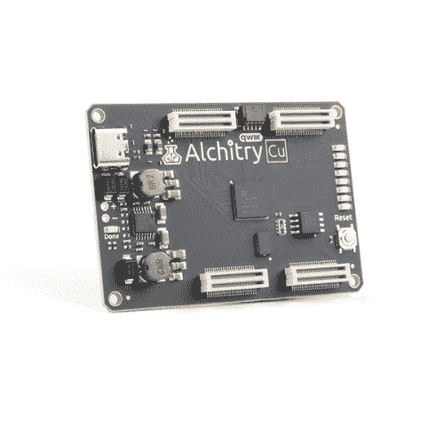

# 第一个 FPGA 项目——对 PWM 着迷

> 原文：<https://learn.sparkfun.com/tutorials/first-fpga-project---getting-fancy-with-pwm>

## 介绍

当你第一次购买 [Alchitry Au+](https://www.sparkfun.com/products/17514) 、 [Alchitry Au](https://www.sparkfun.com/products/16527) 或 [Alchitry Cu](https://www.sparkfun.com/products/16526) 板时，默认的 [FPGA](https://www.sparkfun.com/fpga) 配置会在 led 上产生奇特的波形效果。在本教程中，我们将通过不同的步骤来制作这样的东西。这将是一个很好的概述，介绍如何进行设计，以及在我们使用硬件的情况下需要考虑的各种事情。

让我们深入研究一下，看看这一切是如何工作的！

 

将**添加到您的[购物车](https://www.sparkfun.com/cart)中！**

 **### [Alchitry Cu FPGA 开发板(格子 iCE40 HX)](https://www.sparkfun.com/products/16526)

[In stock](https://learn.sparkfun.com/static/bubbles/ "in stock") DEV-16526

如果您不需要大量的电源来开始您的 FPGA 冒险，或者正在寻找一个更经济的选择，Alchitry…

$53.503[Favorited Favorite](# "Add to favorites") 7[Wish List](# "Add to wish list")**** 

### [Alchitry Au FPGA 开发板(Xilinx Artix 7)](https://www.sparkfun.com/products/16527)

[Out of stock](https://learn.sparkfun.com/static/bubbles/ "out of stock") DEV-16527

Alchitry Au 是 FPGA 开发板的黄金标准，可能是同类产品中最强的板之一…

6[Favorited Favorite](# "Add to favorites") 15[Wish List](# "Add to wish list") 

将**添加到您的[购物车](https://www.sparkfun.com/cart)中！**

 **### [Alchitry Au+ FPGA 开发板(Xilinx Artix 7)](https://www.sparkfun.com/products/17514)

[In stock](https://learn.sparkfun.com/static/bubbles/ "in stock") DEV-17514

Alchitry Au+是 FPGA 开发板的黄金标准，可能是同类开发板中最强的一种

$324.951[Favorited Favorite](# "Add to favorites") 12[Wish List](# "Add to wish list")**** ****我将假设您已经有了工具设置，并且正在 Alchitry 实验室中使用 Lucid 和 Alchitry Au 或 Cu。你也应该已经阅读过之前的教程，[FPGA 编程](https://learn.sparkfun.com/tutorials/programming-an-fpga)，了解一些基础知识。

 [### FPGA 编程

#### 2020 年 7 月 30 日](https://learn.sparkfun.com/tutorials/programming-an-fpga) Come look at the basics of working with Field Programmable Gate Arrays.[Favorited Favorite](# "Add to favorites") 9

### 所需材料

要跟随本教程，您将需要以下材料。你可能不需要所有的东西，这取决于你拥有什么。将它添加到您的购物车，通读指南，并根据需要调整购物车。

&nbsp****