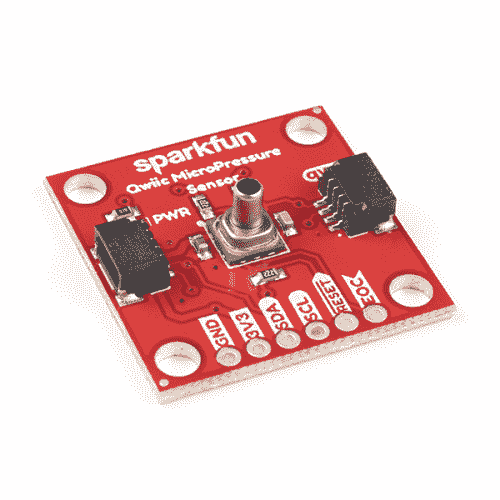

# SparkFun Qwiic 微压连接指南

> 原文：<https://learn.sparkfun.com/tutorials/sparkfun-qwiic-micropressure-hookup-guide>

## 介绍

压力传感器应用广泛。你可以在医疗领域找到它们(血压监测，负压伤口治疗)，它们有工业用途(空气制动系统，气体和水表)，并有广泛的消费用途(咖啡机，加湿器，气床，洗衣机，洗碗机)。测量面积为 1 平方英寸， [SparkFun Qwiic 微压传感器](https://www.sparkfun.com/products/16476)利用霍尼韦尔的 MPR 系列压阻硅压力传感器和我们的即插即用 [Qwiic 系统](https://www.sparkfun.com/qwiic)使压力测量变得简单和便携。

MPRLS0025PA00001A 具有小尺寸(5 mm x 5 mm)，易于读取 24 位数字 I ² C 输出，并使用板载专用集成电路(ASIC)在特定温度范围内针对传感器失调、灵敏度、温度效应和非线性进行校准和补偿。此外还有超低功耗(典型值低至 0.01 mW。平均功率，1 赫兹测量频率)和 Qwiic 端口，你就有了一个充满能量的小传感器！

 

将**添加到您的[购物车](https://www.sparkfun.com/cart)中！**

### [SparkFun Qwiic 微压传感器](https://www.sparkfun.com/products/16476)

[Only 9 left!](https://learn.sparkfun.com/static/bubbles/ "only 9 left!") SEN-16476

SparkFun Qwiic 微压传感器是一个迷你分接头，配有霍尼韦尔的 MPR 系列压阻硅 25psi …

$16.951[Favorited Favorite](# "Add to favorites") 17[Wish List](# "Add to wish list")** **[https://www.youtube.com/embed/zr1hCmyQwWU/?autohide=1&border=0&wmode=opaque&enablejsapi=1](https://www.youtube.com/embed/zr1hCmyQwWU/?autohide=1&border=0&wmode=opaque&enablejsapi=1)

### 所需材料

要跟随本教程，您将需要以下材料。你可能不需要所有的东西，这取决于你有什么。将它添加到您的购物车，通读指南，并根据需要调整购物车。**