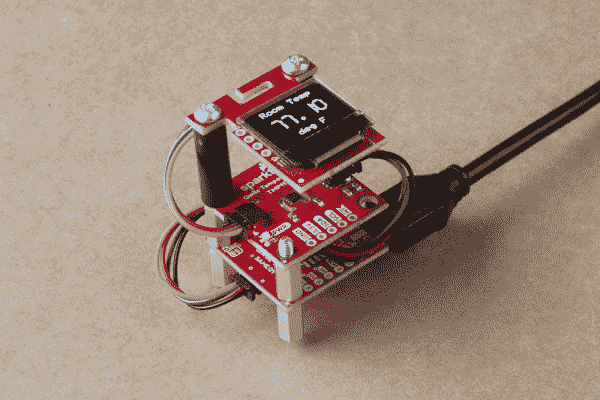

# Qwiic 数字室内温度计

> 原文：<https://learn.sparkfun.com/tutorials/qwiic-digital-indoor-thermometer>

## 介绍

Qwiic-ly 构建一个数字室内温度计来测量房间的环境温度，并使用有机发光二极管显示出来！

### 所需材料

要跟随本教程，您将需要以下材料。你可能不需要所有的东西，这取决于你拥有什么。将它添加到您的购物车，通读指南，并根据需要调整购物车。本教程的代码可用于 TMP117 或 TMP102！