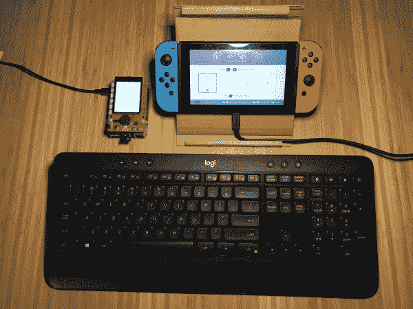

# 树莓 Pi 上的任天堂 Switch 宏录制

> 原文：<https://learn.sparkfun.com/tutorials/nintendo-switch-macro-recording-on-the-raspberry-pi>

## 介绍

在本教程中，我们将安装一个修改版的 [Joycontrol](https://github.com/mart1nro/joycontrol) ，这是一个开源项目，允许你通过蓝牙在[树莓 Pi](https://www.sparkfun.com/products/15447) 上模拟任天堂 Switch 控制器。最初的项目允许您使用简单的命令行界面来控制您的交换机，但是我有一些可以添加更多功能的想法，所以我分叉了存储库并开始工作。

*Connect your Raspberry Pi to your Nintendo Switch as a Pro Controller*

[Joycontrol-ms](https://github.com/marcus-stevenson/joycontrol-ms) 增加了键盘控制、宏录制和回放，并集成了 [SparkFun Top pHAT](https://www.sparkfun.com/products/16301) 以方便使用。如果您想编写自己的定制命令，我还将深入研究使一切工作的代码。

### 所需材料

要跟随本教程，您将需要以下材料。你可能不需要所有的东西，这取决于你拥有什么。将它添加到您的购物车，通读指南，并根据需要调整购物车。