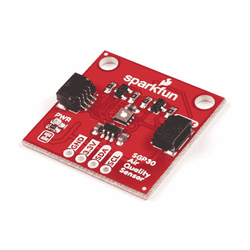
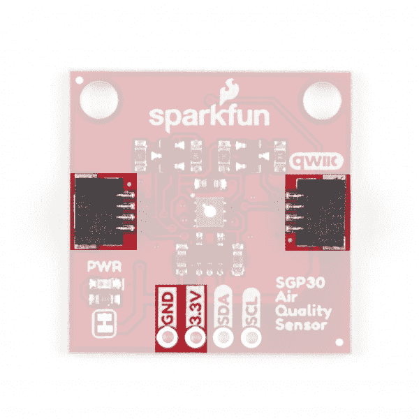
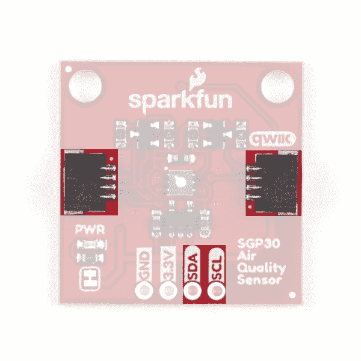
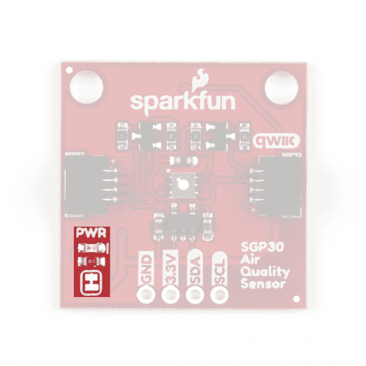
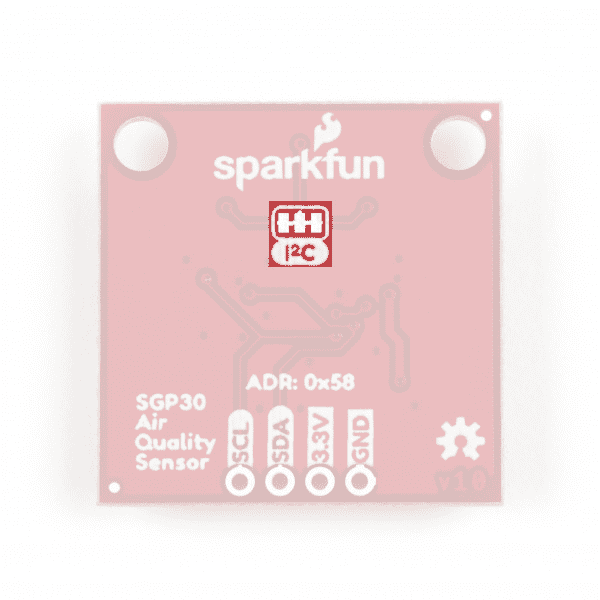
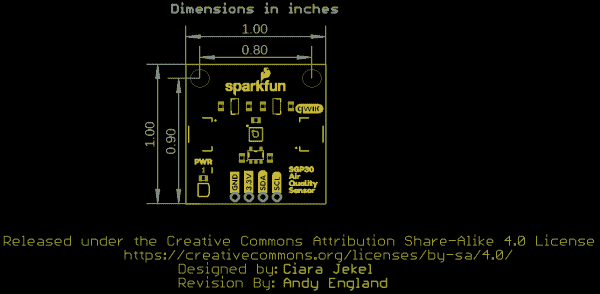
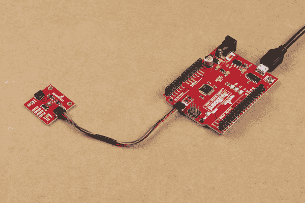
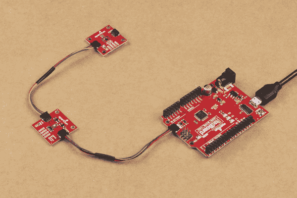

# SparkFun 空气质量传感器- SGP30 (Qwiic)连接指南

> 原文：<https://learn.sparkfun.com/tutorials/sparkfun-air-quality-sensor---sgp30-qwiic-hookup-guide>

## 介绍

你想知道你房间或房子的空气质量吗？也许你需要监控 3D 打印过程中释放的挥发性有机化合物，这样你就知道什么时候打开通风设备(或者离开房间！). [SparkFun 空气质量传感器- SGP30 (Qwiic)](https://www.sparkfun.com/products/16531) 可能就是你需要的传感器！室内空气质量(被称为 IAQ)传感器非常适合测量 CO [2] 和挥发性有机化合物(通常被称为 VOCs)，但其中一些传感器，如 [CCS811](https://www.sparkfun.com/products/14193) 需要 48 小时的老化时间和 20 分钟的启动时间。相比之下，SGP30 可以在通电后 15 秒内返回有效的 IAQ 读数！

除了启动时间非常短之外，SGP30 还非常耐其他气体的污染，以确保低漂移和长期稳定性，从而获得极其可靠的结果。最后，你还可以阅读 SGP30 对乙醇和 H [2] 的原始测量结果。SGP30 通过 I ² C 进行通信，因此我们很自然地将传感器上的引脚与 Qwiic 连接器分开，以便您可以轻松地将其连接到 SparkFun 不断增长的 [Qwiic 生态系统](https://www.sparkfun.com/qwiic)！

[](https://www.sparkfun.com/products/16531) 

### [【spark fun 空气质量传感器- SGP30 (Qwiic)](https://www.sparkfun.com/products/16531)

[Out of stock](https://learn.sparkfun.com/static/bubbles/ "out of stock") SEN-16531

SparkFun SGP30 空气质量传感器监测您周围的挥发性有机化合物，并可以在 15 秒内返回有效的室内空气质量读数…

1[Favorited Favorite](# "Add to favorites") 29[Wish List](# "Add to wish list")

[https://www.youtube.com/embed/OHDevOBBNeg/?autohide=1&border=0&wmode=opaque&enablejsapi=1](https://www.youtube.com/embed/OHDevOBBNeg/?autohide=1&border=0&wmode=opaque&enablejsapi=1)

在本指南中，我们将介绍 SGP30 的功能、如何连接和使用 SGP 30 以及 Arduino 库，并举例说明如何开始监控室内空气质量。

### 所需材料

按照本指南，您需要一个微控制器来与 SGP30 通信。以下是一些开箱即用的 Qwiic 选项:

[](https://www.sparkfun.com/products/15663) 

将**添加到您的[购物车](https://www.sparkfun.com/cart)中！**

### [【spark fun Thing Plus-ESP32 WROOM(微-B)](https://www.sparkfun.com/products/15663)

[Out of stock](https://learn.sparkfun.com/static/bubbles/ "out of stock") WRL-15663

SparkFun ESP32 Thing Plus 是开始使用 Espressif 物联网概念的下一步，同时还可以享受所有的便利设施

$22.5010[Favorited Favorite](# "Add to favorites") 48[Wish List](# "Add to wish list")****[](https://www.sparkfun.com/products/15795) 

将**添加到您的[购物车](https://www.sparkfun.com/cart)中！**

### [【spark fun Qwiic Pro Micro-USB-C(atmega 32 u 4)](https://www.sparkfun.com/products/15795)

[In stock](https://learn.sparkfun.com/static/bubbles/ "in stock") DEV-15795

SparkFun Qwiic Pro Micro 在小型化的 Arduino bo 上增加了一个重置按钮、Qwiic 连接器、USB-C 和齿形垫…

$21.507[Favorited Favorite](# "Add to favorites") 46[Wish List](# "Add to wish list")****[](https://www.sparkfun.com/products/15123) 

将**添加到您的[购物车](https://www.sparkfun.com/cart)中！**

### [spark fun RedBoard Qwiic](https://www.sparkfun.com/products/15123)

[In stock](https://learn.sparkfun.com/static/bubbles/ "in stock") DEV-15123

SparkFun RedBoard Qwiic 是一款 Arduino 兼容开发板，内置 Qwiic 连接器，无需…

$21.5014[Favorited Favorite](# "Add to favorites") 49[Wish List](# "Add to wish list")****[](https://www.sparkfun.com/products/15444) 

将**添加到您的[购物车](https://www.sparkfun.com/cart)中！**

### [SparkFun RedBoard Artemis](https://www.sparkfun.com/products/15444)

[In stock](https://learn.sparkfun.com/static/bubbles/ "in stock") DEV-15444

RedBoard Artemis 采用 SparkFun 的功能强大的 Artemis 模块，并将其包装在一个易于使用和熟悉的环境中…

$21.509[Favorited Favorite](# "Add to favorites") 32[Wish List](# "Add to wish list")******** ********如果您选择的微控制器尚未启用 Qwiic，您可以添加以下一项或多项功能:

[](https://www.sparkfun.com/products/15081) 

将**添加到您的[购物车](https://www.sparkfun.com/cart)中！**

### [SparkFun Qwiic 线缆套件](https://www.sparkfun.com/products/15081)

[In stock](https://learn.sparkfun.com/static/bubbles/ "in stock") KIT-15081

为了更容易上手，我们用 50 毫米到 500 毫米的各种 Qwiic 电缆组装了 Qwiic 电缆套件…

$8.9516[Favorited Favorite](# "Add to favorites") 58[Wish List](# "Add to wish list")****[](https://www.sparkfun.com/products/14495) 

将**添加到您的[购物车](https://www.sparkfun.com/cart)中！**

### [SparkFun Qwiic 适配器](https://www.sparkfun.com/products/14495)

[In stock](https://learn.sparkfun.com/static/bubbles/ "in stock") DEV-14495

SparkFun Qwiic 适配器提供了将任何旧 I ² C 板改造成支持 Qwiic 的板的完美方法。

$1.601[Favorited Favorite](# "Add to favorites") 53[Wish List](# "Add to wish list")****[](https://www.sparkfun.com/products/14352) 

将**添加到您的[购物车](https://www.sparkfun.com/cart)中！**

### [ArduinoT3 的 SparkFun Qwiic 盾](https://www.sparkfun.com/products/14352)

[In stock](https://learn.sparkfun.com/static/bubbles/ "in stock") DEV-14352

SparkFun Qwiic Shield 是一种易于组装的板，它提供了一种简单的方法来将 Qwiic Connect 系统与

$7.508[Favorited Favorite](# "Add to favorites") 39[Wish List](# "Add to wish list")****[](https://www.sparkfun.com/products/16789) 

将**添加到您的[购物车](https://www.sparkfun.com/cart)中！**

### [Arduino Nano的 SparkFun Qwiic 盾](https://www.sparkfun.com/products/16789)

[Only 14 left!](https://learn.sparkfun.com/static/bubbles/ "only 14 left!") DEV-16789

用于 Arduino Nano 的 SparkFun Qwiic Shield 使您可以将 SparkFun 的 Qwiic connect 生态系统与开发板一起使用…

$4.95[Favorited Favorite](# "Add to favorites") 12[Wish List](# "Add to wish list")******** ********您还需要至少一根 Qwiic 电缆将传感器连接到微控制器。

[](https://www.sparkfun.com/products/14427) 

将**添加到您的[购物车](https://www.sparkfun.com/cart)中！**

### [Qwiic 线缆- 100mm](https://www.sparkfun.com/products/14427)

[In stock](https://learn.sparkfun.com/static/bubbles/ "in stock") PRT-14427

这是一条 100 毫米长的 4 芯电缆，带有 1 毫米 JST 端接。它旨在将支持 Qwiic 的组件连接在一起…

$1.50[Favorited Favorite](# "Add to favorites") 32[Wish List](# "Add to wish list")****[](https://www.sparkfun.com/products/14429) 

将**添加到您的[购物车](https://www.sparkfun.com/cart)中！**

### [Qwiic 线缆- 500mm](https://www.sparkfun.com/products/14429)

[In stock](https://learn.sparkfun.com/static/bubbles/ "in stock") PRT-14429

这是一根 500mm 长的 4 芯电缆，带有 1mm JST 端接。它旨在将支持 Qwiic 的组件连接在一起…

$1.951[Favorited Favorite](# "Add to favorites") 25[Wish List](# "Add to wish list")****[](https://www.sparkfun.com/products/14426) 

将**添加到您的[购物车](https://www.sparkfun.com/cart)中！**

### [Qwiic 线缆- 50mm](https://www.sparkfun.com/products/14426)

[In stock](https://learn.sparkfun.com/static/bubbles/ "in stock") PRT-14426

这是一根 50 毫米长的 4 芯电缆，带有 1 毫米 JST 端接。它旨在将支持 Qwiic 的组件连接在一起…

$0.95[Favorited Favorite](# "Add to favorites") 29[Wish List](# "Add to wish list")****[](https://www.sparkfun.com/products/14428) 

### [Qwiic 线缆- 200mm](https://www.sparkfun.com/products/14428)

[Out of stock](https://learn.sparkfun.com/static/bubbles/ "out of stock") PRT-14428

这是一根 200 毫米长的 4 芯电缆，带有 1 毫米 JST 端接。它旨在将支持 Qwiic 的组件连接在一起…

[Favorited Favorite](# "Add to favorites") 21[Wish List](# "Add to wish list")****** ******### 推荐阅读

如果你不熟悉 Qwiic 系统，请看这里的[以获得概述](https://www.sparkfun.com/qwiic)。

| [](https://www.sparkfun.com/qwiic) |

如果您不熟悉以下教程中的概念，我们也建议您看一看这些教程。如果您正在使用上面列出的 Qwiic 防护罩之一，在开始使用 SparkFun 空气质量传感器- SGP30 (Qwiic)之前，您可能也想通读它们各自的连接指南。

[](https://learn.sparkfun.com/tutorials/i2c) [### I2C](https://learn.sparkfun.com/tutorials/i2c) An introduction to I2C, one of the main embedded communications protocols in use today.[Favorited Favorite](# "Add to favorites") 128[](https://learn.sparkfun.com/tutorials/terminal-basics) [### 串行终端基础知识](https://learn.sparkfun.com/tutorials/terminal-basics) This tutorial will show you how to communicate with your serial devices using a variety of terminal emulator applications.[Favorited Favorite](# "Add to favorites") 46[](https://learn.sparkfun.com/tutorials/qwiic-shield-for-arduino--photon-hookup-guide) [### Arduino 和光子连接指南的 Qwiic 屏蔽](https://learn.sparkfun.com/tutorials/qwiic-shield-for-arduino--photon-hookup-guide) Get started with our Qwiic ecosystem with the Qwiic shield for Arduino or Photon.[Favorited Favorite](# "Add to favorites") 5[](https://learn.sparkfun.com/tutorials/sparkfun-qwiic-shield-for-arduino-nano-hookup-guide) [### Arduino Nano 连接指南的 SparkFun Qwiic 盾](https://learn.sparkfun.com/tutorials/sparkfun-qwiic-shield-for-arduino-nano-hookup-guide) Hookup Guide for the SparkFun Qwiic Shield for Arduino Nano.[Favorited Favorite](# "Add to favorites") 1

## 硬件概述

这一突破的大脑是来自 Sensirion 的出色的 SGP30 气体传感器。在本节中，我们将介绍 SGP30 的一些特性和特征，以及本次分组讨论中的硬件。

正如我们在简介中提到的，SGP30 气体传感器输出以十亿分之一(ppb)为单位的总 VOCs (TVOC)、以百万分之一(ppm)为单位的二氧化碳(CO [2] 当量以及乙醇和氢气(H [2] 的原始气体读数。乙醇和 H [2] 读数主要用于 SGP30 的片内校准和基线补偿算法，但也可用于两种化合物的粗略测量。参考[数据表](https://cdn.sparkfun.com/assets/c/0/a/2/e/Sensirion_Gas_Sensors_SGP30_Datasheet.pdf)的第 8 页，了解关于这些原始信号的更多信息。

下表概述了每个传感输出的基本参数。有关传感器的这些和所有其它方面的详细说明，请查阅数据手册。

| **感应参数** | 价值 |
| TVOC 输出信号范围 | 0 至 60，000 ppb |
| CO [2] eq 输出信号范围 | 400 至 60，000 ppm |
| 乙醇信号测量范围 | 0 至 1,000 ppm |
| H [2] 信号测量范围 | 0 至 1,000 ppm |

### 力量

SGP30 接受 1.62-1.98v 之间的电源电压，因此为了配合 Qwiic 生态系统的**3.3V**标准，我们添加了一个电压调节器，以便将**3.3V**下调至**1.8V**。电源可以通过 Qwiic 连接器或通过该板上标记为 **3.3V** 和 **GND** 的 0.1 英寸插头引脚提供。

⚡**Note:** While the voltage regulator on this breakout can accept up to a **6V** supply voltage, we strongly recommend only using **3.3V** as all Qwiic devices are designed to work at that voltage.[](https://cdn.sparkfun.com/assets/learn_tutorials/1/1/7/4/SparkFun_Air_Quality_Sensor_SGP30_Power.jpg)

### Qwiic 和 I ² C 接口

SGP30 通过 I ² C 进行通信，因此，如果您喜欢使用标准 PTH 连接，我们当然会将这些引脚连接到两个 Qwiic 连接器以及 0.1 英寸间距的接头引脚。由于传感器在 **1.8V** 下工作，我们在 SDA 和 SCL 线上添加了晶体管，以将它们从 **3.3V** 电平转换，因此您可以使用它，而不会与其他 Qwiic 设备发生问题。请注意，该电平电路的高端直接连接到您的电源输入，因此，正如上面关于电源电压的说明所警告的，我们建议使用 **3.3V** 为电路板供电。

SGP30 的 I ² C 地址是 **0x58** (1011000 bin)并且是硬件设置的。如果您有其他设备与 SGP30 共享相同的地址，或者需要在一条 I ² C 总线上使用多个 SGP30 传感器，您将需要使用一个多路复用器/mux，如 [Qwiic Mux Breakout 8 通道](https://www.sparkfun.com/products/14685)。

[](https://cdn.sparkfun.com/assets/learn_tutorials/1/1/7/4/SparkFun_Air_Quality_Sensor_SGP30_I2C.jpg)

### 针织套衫

If you have never worked with solder jumpers and PCB traces before or would like a quick refresher, check out our [How to Work with Solder Jumpers and PCB Traces](https://learn.sparkfun.com/tutorials/how-to-work-with-jumper-pads-and-pcb-traces) tutorial for detailed instructions and tips.

这个突破有两个跳线；一个控制电源 LED，另一个使能 SDA 和 SCL 走线上的两个 **10K 欧姆**上拉电阻。两者都默认**关闭**。要禁用任一跳线，只需切断焊盘之间的走线。禁用电源 LED 对于低功耗应用尤其有用，有助于降低电路板的总电流消耗。注意，如果禁用上拉电阻，请确保 I ² C 总线上的其他器件运行在 **3.3V** 电压下，以免损坏 SGP30。

| [](https://cdn.sparkfun.com/assets/learn_tutorials/1/1/7/4/SparkFun_Air_Quality_Sensor_SGP30_PowerLED.jpg) | [](https://cdn.sparkfun.com/assets/learn_tutorials/1/1/7/4/SparkFun_Air_Quality_Sensor_SGP30_I2CJumper.jpg) |
| *电源 LED 跳线* | *I ² C 上拉电阻跳线* |

### 电路板尺寸

我们设计的 SparkFun 空气质量传感器符合我们的 Qwiic 突破标准。该板尺寸为 1 英寸 x 1 英寸，有两个安装孔，可安装一个 4-40 螺钉。对于具体的间距测量，看看下面的空间照片。

[](https://cdn.sparkfun.com/assets/learn_tutorials/1/1/7/4/SGP30_Dimensions.png)

## 硬件装配

使用 Qwiic 系统，组装硬件轻而易举。你只需要用 Qwiic 电缆或[适配器电缆](https://www.sparkfun.com/products/14425)将你的 SparkFun 空气质量传感器- SGP30 (Qwiic)连接到你选择的开发板。如果您不想使用 Qwiic 连接器，可以连接到电路板底部的 0.1 英寸插头。

[](https://cdn.sparkfun.com/assets/learn_tutorials/1/1/7/4/SparkFun_Air_Quality_Sensor_SGP30_Hookup.jpg)

如果您决定使用空气质量传感器上断开的 PTH 引脚，您需要焊接到这些引脚上。或者，如果你想要一个用于原型制作的临时连接，这些 [IC 挂钩](https://www.sparkfun.com/products/9741)是进行该连接的一个很好的选择。如果你不熟悉通孔焊接，看看这个教程:

[](https://learn.sparkfun.com/tutorials/how-to-solder-through-hole-soldering) [### 如何焊接:通孔焊接

#### 2013 年 9 月 19 日](https://learn.sparkfun.com/tutorials/how-to-solder-through-hole-soldering) This tutorial covers everything you need to know about through-hole soldering.[Favorited Favorite](# "Add to favorites") 70

SGP30 连接到您的微控制器后，是时候上传一些代码并开始测量了！

## SGP30 Arduino 库

**Note:** This library assumes you are using the latest version of the Arduino IDE on your desktop. If this is your first time using Arduino, please review our tutorial on [installing the Arduino IDE.](https://learn.sparkfun.com/tutorials/installing-arduino-ide) If you have not previously installed an Arduino library, please check out our [installation guide.](https://learn.sparkfun.com/tutorials/installing-an-arduino-library)

SparkFun SGP30 Arduino 库可以通过搜索' **SparkFun SGP30** '使用 Arduino 库管理器下载，或者您可以从 [GitHub 库](https://github.com/sparkfun/SparkFun_SGP30_Arduino_Library)获取 zip 文件:

[SparkFun SGP30 Arduino Library (ZIP)](https://github.com/sparkfun/SparkFun_SGP30_Arduino_Library/archive/main.zip)

### 库函数

下面的列表概述了该库的所有功能，并简要描述了它们的作用。这些例子涵盖了大部分函数，所以看看这些例子，看看如何将它们集成到您的代码中。

在我们进入函数的核心之前，我们将首先介绍有助于调试的安装类型定义。这个枚举将 SGP30 返回的四个整数值解析成一种更“人类可读”的方式。

```
language:c
typedef enum {
SUCCESS = 0,
ERR_BAD_CRC,
ERR_I2C_TIMEOUT,
SELF_TEST_FAIL
} SGP30ERR; 
```

这个枚举允许我们简单地通过它的描述来判断返回了什么错误代码，而不是得到一个错误的数字，然后您必须“解码”。例如，错误检查不返回`error == 0`，而是返回`error == SUCCESS`。现在，我们来看看其余的函数。

#### 设备设置和设置

*   `bool begin(TwoWire &wirePort);` -初始化 I ² C 总线上的传感器并选择线端口。
*   `void initAirQuality(void);` -初始化 SGP30 上的空气质量测量。必须在呼叫`measureAirQuality`之前的之前呼叫*。*
*   `void generalCallReset(void);` -执行 SGP30 的软复位。不是特定于设备的，此呼叫可以重置任何支持通用呼叫模式的连接设备。
*   `getFeatureSetVersion(void);` -返回功能集版本号的读数。更多信息参见[数据表](https://cdn.sparkfun.com/assets/c/0/a/2/e/Sensirion_Gas_Sensors_SGP30_Datasheet.pdf)第 8 页。
*   `getSerialID(void);` -返回序列 ID 寄存器的读数，以识别芯片并验证传感器已连接。
*   `measureTest(void);` -在 SGP30 上运行自检。该功能主要由制造商用于测试。

#### 测量功能

*   `measureAirQuality(void);` -返回以 ppm 为单位的 CO [2] 值和以 ppb 为单位的 TVOC 值。每隔 1 秒打一次电话，以保持基线计算。
*   `setBaseline(void);` -将基线值更新为先前的基线值。建议仅使用以前检索的基线来保持准确性。
*   `getBaseline(void);` -从 SGP30 的动态基线计算中返回当前计算的基线。
*   `setHumidity(uint16_t humidity);` -设定湿度值进行补偿。默认值为 15.5 克/米 ³ ，如果修改，新的湿度值应取自湿度传感器，如 [SHTC3](https://www.sparkfun.com/products/16467) 。发送`0x0000`重置为默认值并关闭湿度补偿。有关计算和发送该值的更多信息，请参考我们 Arduino 库中的“示例 3 _ 湿度”。
*   `measureRawSignals(void);` -返回 H [2] 和乙醇的原始信号。这些值用作片内校准和基线补偿算法的输入。更多信息请参考数据手册第 8 页。

概述并解释了这个 Arduino 库的核心函数之后，是时候开始在一些示例代码中将它们放在一起了。

## Arduino 示例

SGP30 Arduino 库包括九个示例，帮助您入门。就本教程的范围而言，我们将只讨论前三个，因为它们演示了设置和读取 SGP30 的基础知识。

### 例 1 -基本阅读

一个让你开始阅读 SGP30 中 TVOC 和 CO [2] 的基本例子。要打开这个例子，导航到**文件** > **例子**>**spark fun SGP 30 Arduino 库**>**example 1 _ BasicReadings**。接下来，打开工具菜单，选择您的主板(在我们的例子中是 **Arduino Uno** )和正确的端口。

上传代码，打开 [Arduino 串行监视器](https://learn.sparkfun.com/tutorials/terminal-basics/arduino-serial-monitor-windows-mac-linux)，将波特率设置为 **9600** 。如果传感器初始化返回 false，代码将显示“未检测到 SGP30”。请检查连接。通过串行。该错误几乎肯定是由于与 SGP30 连接不良造成的。初始化成功后，它将开始打印出 TVOC 和 CO [2] 的读数。请注意，在传感器通电或复位后的前 15 秒，读数将为:**一氧化碳 [2] : 400 ppm** 和 **TVOC : 0 ppb** ，因此，如果您正在使用 [OpenLog Artemis](https://www.sparkfun.com/products/16832) 记录数据，您将希望忽略这前 15 个读数。

前 15 个读数过去后，试着在传感器附近轻轻呼吸，你应该会看到 CO [2] 读数从 400 ppm 的基线大幅上升。这些基本读数有助于开始并确保您的传感器已连接并正常工作，但为了获得更准确的读数，您可能需要包括湿度传感器的补偿值，如我们在示例 3 -湿度中演示的那样。

### 示例 2 -原始信号

该示例包括来自 SGP30 的 TVOC 和一氧化碳[2]读数，以及乙醇和氢气[2]的原始读数。乙醇和 H [2] 值主要用于 SGP30 的内部处理，但您可以使用它们对这两种气体进行粗略测量。

如上所述，从**示例**菜单中打开示例，并选择**示例 2 _ 原始信号**。选择您的板和端口并上传代码。再次打开 Arduino 串行监视器，并将您的波特率设置为 **9600** 。你应该每秒钟都能看到一氧化碳 [2] 、TVOC、生氢 [2] 和生乙醇的读数。

### 示例 3 -湿度

本例演示了如何从外部传感器(在本例中为 [SparkFun 湿度传感器分线点- SHTC3 (Qwiic)](https://www.sparkfun.com/products/16467) )传递湿度数据，以使用实际绝对湿度值修改 SGP30 的湿度补偿。将实际湿度值传递给 SGP30 的湿度补偿将有助于提高传感器的精度和可靠性。

为了使用这个例子，你还需要安装 [SparkFun SHTC3 Arduino 库](https://github.com/sparkfun/SparkFun_SHTC3_Arduino_Library)。安装两个库后，只需将 SHTC3 分线点连接到 Qwiic 链，并上传示例，将湿度补偿值添加到 SGP30 的读数中！

[](https://cdn.sparkfun.com/assets/learn_tutorials/1/1/7/4/SGP30_SHTC3_Hookup.jpg)

此示例初始化两个传感器，并在设置中从 SHTC3 获取温度和湿度读数。然后，代码将这些读数转换为绝对湿度，将其解析为 SGP30 可以接受的固定 8.8 位湿度补偿值，然后使用`setHumidity`函数将该数据发送给 SGP30。设置该值后，代码运行读取 CO [2] 和 TVOC 值并通过串行打印它们的主例程。

为片内湿度补偿存储的值将保持静态，直到发送新值或 SGP30 复位。我们提供了一个选项，通过您的串行监视器发送字母“H”(大写或小写)，将湿度补偿值调整为 SHTC3 的新读数，以避免必须重置电路。

要更新补偿值，可在初始化后随时打开串行监视器，并将波特率设置为 **9600** 。输入“H ”,按回车键，代码将使用 SHTC3 的更新读数重置湿度补偿值。代码还将打印出以克/米 ³ 为单位的新值，然后继续从 SGP30 中读取一氧化碳 [2] 和 TVOC 读数。以下代码显示了 if 语句以及如何根据 SHTC3 的温度和湿度数据计算湿度值:

```
language:c
if (Serial.available())
{
char ch = Serial.read();
if (ch == 'H' || ch == 'h')
{
  SHTC3_Status_TypeDef result = hSensor.update();
  delay(190);  
  // Measure Relative Humidity from the Si7021
  float humidity = hSensor.toPercent();

  //Measure temperature (in C) from the Si7021
  float temperature = hSensor.toDegC();

  //Convert relative humidity to absolute humidity
  double absHumidity = RHtoAbsolute(humidity, temperature);

  //Convert the double type humidity to a fixed point 8.8bit number
  uint16_t sensHumidity = doubleToFixedPoint(absHumidity);

  //Set the humidity compensation on the SGP30 to the measured value
  //If no humidity sensor attached, sensHumidity should be 0 and sensor will use default
  mySensor.setHumidity(sensHumidity);
  Serial.print("Absolute Humidity compensation value set to: ");
  Serial.print(absHumidity);
  Serial.println("g/m^3 ");
  delay(100); 
```

## 资源和更进一步

本指南到此为止。希望在阅读完本文和 Arduino 示例后，您已经准备好将 SparkFun 空气质量传感器-SGP30 (Qwiic)集成到您的下一个空气质量监测项目中！

有关更多信息，请查看下面的资源:

*   [示意图(PDF)](https://cdn.sparkfun.com/assets/learn_tutorials/1/1/7/4/SparkFun_Air_Quality_Sensor_SGP30.pdf)
*   [老鹰文件(ZIP)](https://cdn.sparkfun.com/assets/learn_tutorials/1/1/7/4/SparkFun_Air_Quality_Sensor-SPG30.zip)
*   [板尺寸(PNG)](https://cdn.sparkfun.com/assets/learn_tutorials/1/1/7/4/SGP30_Dimensions.png)
*   [Arduino 库 GitHub 库](https://github.com/sparkfun/SparkFun_SGP30_Arduino_Library)
*   [硬件 GitHub 库](https://github.com/sparkfun/SparkFun_Air_Quality_Sensor-SGP30)
*   [SGP30 数据表](https://cdn.sparkfun.com/assets/c/0/a/2/e/Sensirion_Gas_Sensors_SGP30_Datasheet.pdf)

希望在您的室内空气质量项目中添加更多传感器，或者只是想要更多天气和环境相关的教程？看看这些:

[](https://learn.sparkfun.com/tutorials/photon-remote-water-level-sensor) [### 光子远程水位传感器](https://learn.sparkfun.com/tutorials/photon-remote-water-level-sensor) Learn how to build a remote water level sensor for a water storage tank and how to automate a pump based off the readings 15[](https://learn.sparkfun.com/tutorials/sparkfun-inventors-kit-for-photon-experiment-guide) [### 光子实验指南](https://learn.sparkfun.com/tutorials/sparkfun-inventors-kit-for-photon-experiment-guide) Dive into the world of the Internet of Things with the SparkFun Inventor's Kit for Photon.[Favorited Favorite](# "Add to favorites") 14[](https://learn.sparkfun.com/tutorials/qwiic-ambient-light-sensor-veml6030-hookup-guide) [### Qwiic 环境光线传感器(VEML6030)连接指南](https://learn.sparkfun.com/tutorials/qwiic-ambient-light-sensor-veml6030-hookup-guide) The VEML6030 is a high accuracy ambient light sensor with 16-bit resolution. This I2C sensor can detect light similar to the human eye response. Start detecting light levels in your environment 1[](https://learn.sparkfun.com/tutorials/artemis-global-tracker-hookup-guide) [### Artemis 全球追踪器连接指南](https://learn.sparkfun.com/tutorials/artemis-global-tracker-hookup-guide) The SparkFun Artemis Global Tracker combines the Artemis processor with an Iridium 9603N satellite transceiver, ZOE-M8Q GNSS transceiver, and MS8607 PHT sensor. With a clear view of the sky, this board allows you to send and receive short data messages from anywhere in the world including remote locations far beyond the reach of WiFi and GSM networks. Follow this guide to get started with the Artemis Global Tracker.[Favorited Favorite](# "Add to favorites") 3

不确定你想启动什么类型的空气质量项目？这些博客帖子可能会给你一些启发:

[](https://www.sparkfun.com/news/2369 "April 26, 2017: Wherein we seek to answer the age old question: What the heck is a VOC?") [### 硬件驼峰日:用 CCS811 测量空气质量

April 26, 2017](https://www.sparkfun.com/news/2369 "April 26, 2017: Wherein we seek to answer the age old question: What the heck is a VOC?")[Favorited Favorite](# "Add to favorites") 2[](https://www.sparkfun.com/news/2433 "July 19, 2017: What "cleaning" a room does to air quality.") [### 空气质量传感器实验

July 19, 2017](https://www.sparkfun.com/news/2433 "July 19, 2017: What "cleaning" a room does to air quality.")[Favorited Favorite](# "Add to favorites") 2**********************