# 了解热阻

> 原文：<https://learn.sparkfun.com/tutorials/understanding-thermal-resistance>

## 介绍

当使用低功耗设备时，热量管理不是大问题。一旦您开始添加电机、LED 灯条，并且项目的电流消耗增加，部件可能会开始变热。如果不控制热量，零件可能会过热，从而缩短组件的寿命。在本教程中，我们将涵盖什么是热阻，它如何用于热管理，以及如何最大限度地延长您的项目寿命。

### 推荐阅读

如果您不熟悉以下概念，我们建议您在继续之前查看这些教程。

 [### 电压、电流、电阻和欧姆定律](https://learn.sparkfun.com/tutorials/voltage-current-resistance-and-ohms-law) Learn about Ohm's Law, one of the most fundamental equations in all electrical engineering.[Favorited Favorite](# "Add to favorites") 132 [### 如何使用万用表](https://learn.sparkfun.com/tutorials/how-to-use-a-multimeter) Learn the basics of using a multimeter to measure continuity, voltage, resistance and current.[Favorited Favorite](# "Add to favorites") 67

## 热阻

要了解功率损耗如何影响产生的热量，首先需要了解热阻(R [θ] )。类似于电阻以欧姆为单位阻止电流流动，热阻以开尔文每瓦或摄氏度每瓦为单位阻止热量流动。根据热量从一个地方传递到另一个地方的难易程度，我们可以使用热阻来估计特定部件在各种负载下可能达到的温度。对于电子设备，热量从源头开始，如半导体结，然后扩散，最终消散到周围空气中。

如果半导体的结超过它的最高温度，它就会破裂，让所有的魔法烟出来。为了确保我们不会这样做，我们需要看看设备使用电源的效率.....

### 欧姆定律和热阻

我们可以使用欧姆定律来计算从散热器到结的温度，以及两者之间任何地方的温度。如前所述，电阻与热阻非常相似。我们可以使用欧姆定律，即 V = I*R，并用电压代替温度(T ),用电流代替功率(P ),得出:

[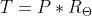](https://cdn.sparkfun.com/assets/learn_tutorials/1/1/8/3/ThermalOhmsLaw.gif)

等效热回路如下所示，其中:

*   **T_Junction (T [J] ):** 结温
*   **R [θJC] :** 结至外壳热阻
*   **T_Case (T [C] ):** 结温
*   **R [θCH] :** 机箱到散热片的热阻
*   **T _ 散热片(T [H] ):** 散热片温度
*   **R [θHA] :** 散热片对环境空气的热阻
*   **T_Ambient (T [A] ):** 环境空气温度

[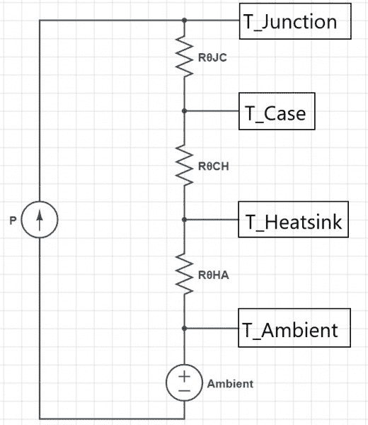](https://cdn.sparkfun.com/assets/learn_tutorials/1/1/8/3/Thermal_Resistance_Schematic.jpg)

为了更好地理解热阻的使用，让我们看下面的例子:

*   **功耗:** 2W
*   **R[θJC]= 4°C/W**
*   **R[θCH]= 0.25 C/W**
*   **R[θHA]= 6°C/W**
*   **T[A]= 25c**

从欧姆定律的热当量开始:

我们需要求解结温上升，因此 T 变为 T [J] 。我们的力量消散了，P，是 2W。我们的热阻是串联的，就像电路中的串联电阻一样，我们可以将这些值相加:

[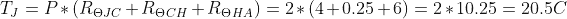](https://cdn.sparkfun.com/assets/learn_tutorials/1/1/8/3/SolveThermalOhmsLaw.gif)

结温比环境温度高 20.5°C(本例中为 25°C)，这意味着绝对温度为 20.5°C+25°C，即 45.5°C。

你在哪里找到热阻值？对于稳压器、二极管、晶体管和其它半导体等器件，数据手册将有一个热信息部分，如果不使用某种类型的散热器，主要是与空气的结(R [θJA] );如果要使用散热器，则是与外壳的结(R [θJC] ),它有自己的热阻，将在下一部分讨论。典型的热阻数据类似于下图。

[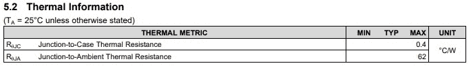](https://cdn.sparkfun.com/assets/learn_tutorials/1/1/8/3/Datasheet_Thermal_Resistance.jpg)

## 如何传递热量

### 金属散热片散热器

[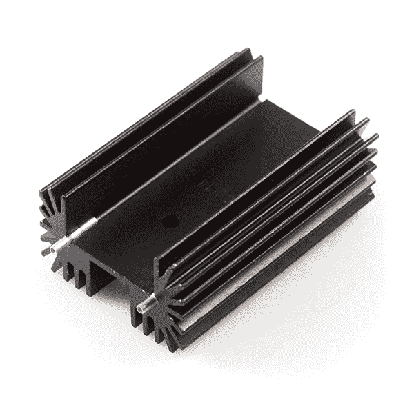](https://cdn.sparkfun.com/assets/learn_tutorials/1/1/8/3/Heatsink.jpg)

散热器有各种形状和大小，只有一个目的:将热量传递给空气。散热器上每个散热片的目的是为空气与散热器的相互作用创造尽可能多的表面积，并将热量从散热器带走，这有助于将热量从半导体的结带走。散热器的热阻可能有点复杂，因为金属散热片散热器根据流经散热片的空气量以不同的速度工作。散热器的典型数据手册不仅提供了器件的尺寸，还提供了热特性，如下所示:

[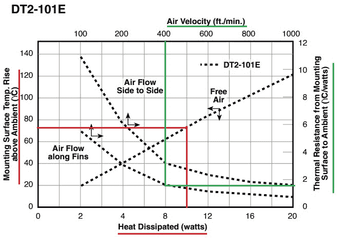](https://cdn.sparkfun.com/assets/learn_tutorials/1/1/8/3/Highlighted_Heatsink_Graph.jpg)

每条绘图线上的箭头对应于它们所代表的轴。例如，红色突出显示表明，在自由空气中(即没有风扇)，消耗 10W 的功率会使散热器的温度比环境温度高出约 78°C。相反，如果有大约 400 英尺/分钟的空气沿着散热器的散热片流动，绿线表明散热器的热阻大约为 1.8°C/W，或者比环境温度高 18°C，消耗相同的 10W 功率。

### 过孔

如果您需要在设计中添加散热器，如开关模式电源，必须使元件尽可能靠近 IC，过孔不仅可以将信号从 PCB 的一侧传输到另一侧，还可以传热！

如果你不喜欢做大量的数学计算，土星 PCB 设计公司的 [PCB 工具包](https://saturnpcb.com/pcb_toolkit/)有很多很棒的工具来解决电气工程师可能会用到的大量方程。其中一个选项卡特别针对过孔属性:

[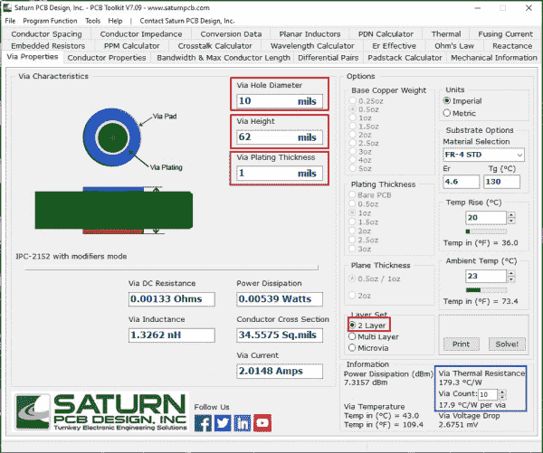](https://cdn.sparkfun.com/assets/learn_tutorials/1/1/8/3/Saturn_PCB_Toolkit.jpg)Image courtesy of [SaturnPCB](https://saturnpcb.com/pcb_toolkit/)

为了获得过孔的热阻，我在红色突出显示的框中输入了我所拥有的 PCB 的属性。将层设置为 2 层，过孔直径应该是您可能需要更改的唯一设置。对于大多数 PCB 来说，过孔电镀厚度和过孔高度是相当标准的。单击“solve”后，在右下角的蓝色框中，我得到了每通孔 179.3 C/W 的热阻。有 10 个过孔时，过孔热阻降至 17.9°C/w。如果现在要计算结温，需要为过孔增加另一个串联热阻，计算时会将该热阻与其他热阻相加。

### PCB 散热

当涉及到 PCB 中的热传递时，数学会变得非常复杂，这就是为什么对于过孔热阻，使用 Saturn PCB 的工具是更简单的方法之一。更复杂的是使用 PCB 作为散热器。不仅铜有热阻，它是表面积的函数，而且阻焊膜、基板材料也有热阻，它也会将热量传递到周围隔离的铜层。如需详细解释，您可以阅读德州仪器的这份[应用报告。为了更容易消化信息，Paul Bryson 在这个主题上有一篇很棒的博文，并提供了一些很棒的技巧和发现，可以在](http://www.ti.com/lit/an/snva419c/snva419c.pdf)[这里](http://www.brysonics.com/pcb-thermal-resistance-some-unexpected-results/)找到。

你可以使用保罗·布赖森在下面的帖子中的图表作为粗略的指导:

[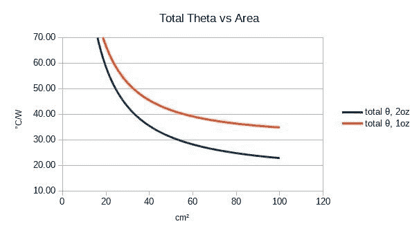](https://cdn.sparkfun.com/assets/learn_tutorials/1/1/8/3/PCB_Thermal_Resistance.jpg)Image courtesy of Paul Bryson of [brysonics.com](http://www.brysonics.com/)

## 示例:PTH 线性调节器

让我们看看热阻计算在现实世界中的效果如何。对于这些例子，我将使用两种不同类型的电压调节器，一种线性调节器，特别是 [LM7805](https://www.sparkfun.com/products/107) ，以及 [DC-DC 转换器](https://www.sparkfun.com/products/15208)。我们将看到它们在多大程度上符合我们从数据手册中获得的数字。

## 线性调节器

拥有一个低成本、低噪声的电压调节器，怎么可能会出错呢？线性调节器是许多应用的绝佳选择，但它们的不足之处在于效率。我们可以看到线性调节器的基本设计如下:

[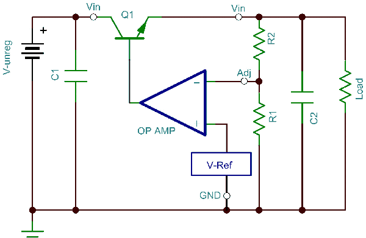](https://cdn.sparkfun.comr/600-600//assets/learn_tutorials/1/1/8/3/Linear_Regulator_Schematic.gif)Image courtesy of [EE Times](https://www.eetimes.com/signal-chain-basics-part-19-exploring-and-understanding-linear-voltage-regulators/)

为了确定线性调节器的温度，我们首先要理解输入功率必须等于输出功率。理想情况下，该系统的效率为 100%，但在现实世界中，会有一些损耗，这些功率损耗会以热量的形式耗散掉(P [D] )。这可以表示为以下公式:

[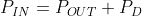](https://cdn.sparkfun.com/assets/learn_tutorials/1/1/8/3/LinearReg-SolvedForPin.gif)

这意味着功耗可以表示为:

在电子学中，功率可以表示为电压和电流的乘积。这意味着我们可以将第一个等式改写为:

[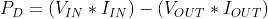](https://cdn.sparkfun.com/assets/learn_tutorials/1/1/8/3/LinearReg-SolvedForPd-Again.gif)With linear regulators the input and output current is the same, so we can simplify the equation to the following:

现在我们需要看看线性调节器的热特性。对于正在使用的 TO-220 封装，LM7805 具有以下热阻:

[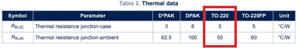](https://cdn.sparkfun.com/assets/learn_tutorials/1/1/8/3/LM7805_Thermal_Data.jpg)

### 不带散热器(R [θJA]

对于第一个例子，我们将了解线性调节器在只有 200mA 负载的情况下会变得多热。TheLM7805 输出电压为 5V，输入电压会在 12V 左右。将这些数字代入上面的功率损耗方程，我们可以得到:

[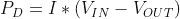](https://cdn.sparkfun.com/assets/learn_tutorials/1/1/8/3/PdWithoutAHeatsinkVariables.gif)[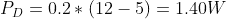](https://cdn.sparkfun.com/assets/learn_tutorials/1/1/8/3/PdWithoutAHeatsinkNumbers.gif)

为了计算无散热器时的温度，我们需要使用结至空气热阻，即 50°C/w，使用热阻部分的公式，并假设环境空气温度为 23°C，我们可以计算出结温:

[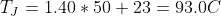](https://cdn.sparkfun.com/assets/learn_tutorials/1/1/8/3/LinearReg_-_JunctionTemp-Numbers.gif)

为了对比真实情况，我测得输入电压为 12.1V，负载下的输出电压为 4.90V。我在输出端连接了一个设置为 200mA 的恒流假负载。使用测量值，耗散功率为:

[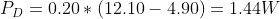](https://cdn.sparkfun.com/assets/learn_tutorials/1/1/8/3/LinearReg_-_PowerDissipated.gif)

预期结温应为:

[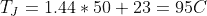](https://cdn.sparkfun.com/assets/learn_tutorials/1/1/8/3/LinearReg_-_JunctionTemp-Solved.gif)[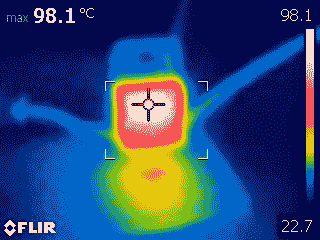](https://cdn.sparkfun.com/assets/learn_tutorials/1/1/8/3/Flir_LM7805_No_Heatsink.jpg)

如上图所示，打开负载并让调节器升温后，温度稳定在 98°c 左右。非常接近，但这是一个很好的例子，说明了为什么给数字增加余量很重要。由于缺乏精度，电源比我们计算的略高，在负载下，调节器的输出电压容差为 4%，这可能允许输出电压降至 4.8V，但仍在规格范围内。

### 带散热器(使用 R [θJC]

现在，由于增加了一个散热器，我们不再使用结到空气的热阻，而需要使用结到外壳的热阻，该值约为 5°C/w。查看了我所用散热器的数据手册后，自由空气中约 1.4W 的功率将导致 25°C 的温升:

[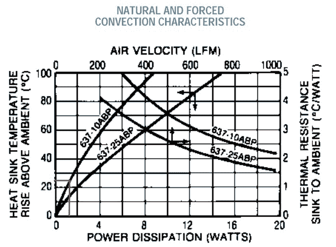](https://cdn.sparkfun.com/assets/learn_tutorials/1/1/8/3/Heatsink_Graph_for_Linear_Regulator_Example.jpg)

由于散热器提供的是温升而不是热阻，我们需要首先利用从结到散热器的热阻来计算结温，然后加上散热器的温升和环境空气温度来获得结温。使用导热化合物可降低从外壳到散热器的热阻(~ 0.25°C/W)，如果没有导热化合物，我们假设热阻约为 1°C/W。因此，结温公式为:

[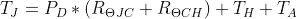](https://cdn.sparkfun.com/assets/learn_tutorials/1/1/8/3/LinearReg-WithHeatsink-Part1.gif)[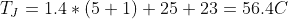](https://cdn.sparkfun.com/assets/learn_tutorials/1/1/8/3/LinearReg-WithHeatsink-Part2.gif)

实际电压与无散热器时相同:Vin = 12.10V，Vout = 4.90V，Iout = 200mA。这导致实际需要消耗相同的 1.44W 功率，这只会将计算出的结温提高到 56.64°c，接通电源并使能负载后，我等待温度达到稳态温度，测得调节器的温度约为 54°c。

[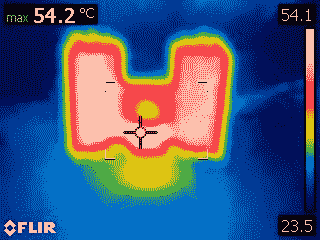](https://cdn.sparkfun.com/assets/learn_tutorials/1/1/8/3/Flir_LM7805_With_Heatsink.jpg)

这次温度比我们预计的要低。误差很可能来自读取散热器在静止空气中的温升，而不是 25°C，可能更接近 23°C。在最后一个例子中，我们将使用表面贴装调节器，并尝试估计调节器在使用 PCB 作为散热器时的温度。

## 示例:贴片 DC/DC 转换器

我们正在使用的板是[降压升压](https://www.sparkfun.com/products/15208)，它使用 [TPS63070 DC-DC 转换器](https://cdn.sparkfun.com/assets/e/4/a/1/4/TPS63070_DataSheet.pdf)。该板为 1.25x1.25 英寸，使用 1 盎司铜。其他需要注意的是，调节器位于电路板的中央，95%以上是实心铜。由于尺寸原因，我将利用总电路板面积来计算热阻，并利用所有 41 个过孔来计算热阻。

首先，我们需要计算出我们需要消耗多少能量。对于 DC-DC 转换器，输入电流不等于输出电流，因此我们不能使用与线性调节器相同的公式。相反，我们可以使用数据手册中的效率图进行估算:

[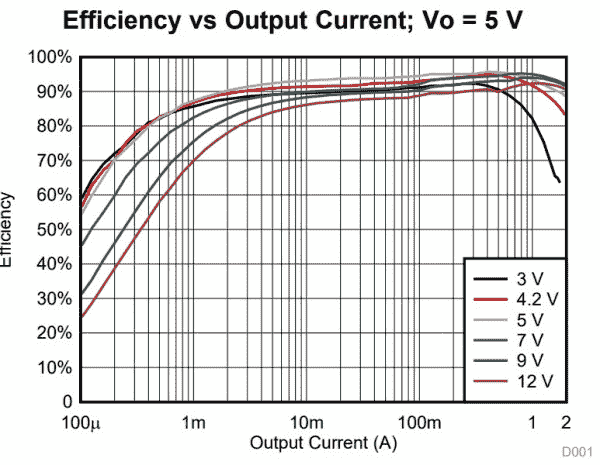](https://cdn.sparkfun.com/assets/learn_tutorials/1/1/8/3/DC-DC_Converter_Efficiency_Graph.jpg)

效率图绘制了效率与输出电流的函数关系，输出电流因输入和输出电压而异。对于这个测试，我们将使用之前相同的值，输入电压为 12V，输出电压为 5V。不过，这次我们将负载电流增加到 1.0A。使用上面的 5V 效率图，效率应该在 93%左右，这将使我们的功率损失为输出功率的 7%。

[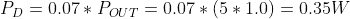](https://cdn.sparkfun.com/assets/learn_tutorials/1/1/8/3/CalculatingHowMuchPowerToDissipate.gif)

对于热阻，我使用了过孔热阻计算器，并使用过孔计算工具中的值估算出过孔热阻约为 4.4 癈/W。为了估计 PCB 热阻，将电路板从桌子上抬起，以防止使用桌子上的散热器。但是因为木板的底部也与空气接触，所以从 10.08cm^2 到 20.16cm^2.，其表面积增加了一倍根据降压/升压板的表面积，我可以估计 PCB 的热阻约为 65°C/w。

[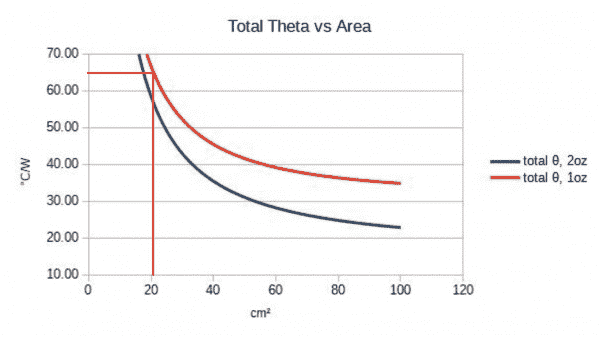](https://cdn.sparkfun.com/assets/learn_tutorials/1/1/8/3/PCB_Thermal_Resistance_example.jpg)

TPS63070 的数据表包含以下热特性:

[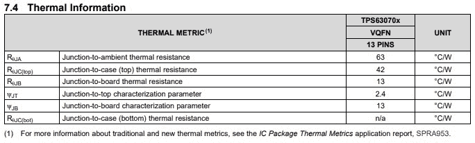](https://cdn.sparkfun.com/assets/learn_tutorials/1/1/8/3/TPS63070_Thermal_Characteristics.jpg)*Click on the image for a closer view.*

结至外壳热阻不适用，但结至电路板热阻适用，约为 13°C/w，利用热阻值，我们可以将其代入结温度方程:

[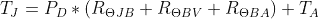](https://cdn.sparkfun.com/assets/learn_tutorials/1/1/8/3/CalculatingPowerDissWithHeatsink-Part1.gif)[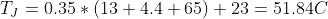](https://cdn.sparkfun.com/assets/learn_tutorials/1/1/8/3/CalculatingPowerDissWithHeatsink-Part2.gif)

就像之前一样，我启用了假负载，让电路板升温，直到温度停止上升。如下图，我记录的温度是 54℃左右。

[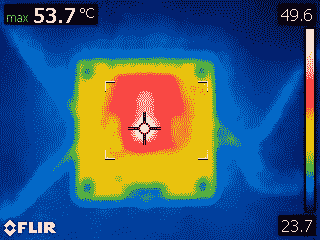](https://cdn.sparkfun.com/assets/learn_tutorials/1/1/8/3/Flir_PCB_Heatsink.jpg)

## 资源和更进一步

您可以对各种电源部件进行同样的计算。例如，您可以查看 mosfet 的漏极和源极之间的电阻，以了解在不同电流下它可能达到的温度。或者，如果您有一个二极管用于反向电流保护，您可以使用正向压降和电流。所有这些组件都会产生一些热量，但现在你可以根据经验猜测到底有多少。

想使用你新发现的技能吗？尝试这些伟大的教程！

 [### 同步 RFID 标签阅读器连接指南](https://learn.sparkfun.com/tutorials/simultaneous-rfid-tag-reader-hookup-guide) A basic guide to getting started with the RFID Tag Reader breakout and how to read and write multiple RFID tags over multiple feet 8 [### ESP32 东西电源控制屏蔽连接指南](https://learn.sparkfun.com/tutorials/esp32-thing-power-control-shield-hookup-guide) This tutorial shows you how to get started with the ESP32 Thing Power Control Shield.[Favorited Favorite](# "Add to favorites") 3 [### 可变负载连接指南-修订版](https://learn.sparkfun.com/tutorials/variable-load-hookup-guide---revised) This tutorial will show you how to assemble and use SparkFun's Variable Load board. It can be used to test stability of the power supply under various loads, battery lifetime, safety cutoffs, and other design elements of power supplies under test.[Favorited Favorite](# "Add to favorites") 3 [### 降压升压连接指南](https://learn.sparkfun.com/tutorials/buck-boost-hookup-guide) This tutorial shows you how to hook up and use the SparkFun Buck-Boost board.[Favorited Favorite](# "Add to favorites") 4 [### 磁力悬浮](https://learn.sparkfun.com/tutorials/magnetic-levitation) This tutorial will show you how to build a magnetic levitation circuit using common parts.[Favorited Favorite](# "Add to favorites") 14