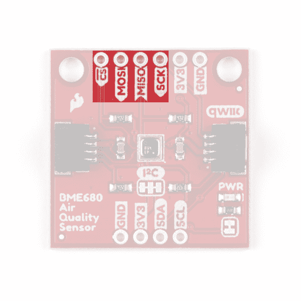
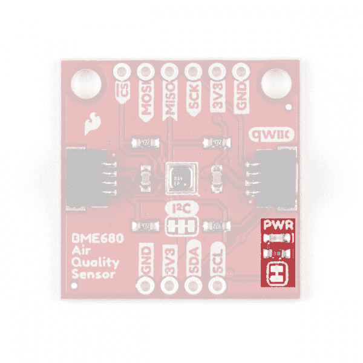

# SparkFun 环境传感器分线点- BME68x (Qwiic)连接指南

> 原文：<https://learn.sparkfun.com/tutorials/sparkfun-environmental-sensor-breakout---bme68x-qwiic-hookup-guide>

## 介绍

**Important Note:** In order to avoid contamination of its gas scanning capabilities, **DO NOT** touch the metallic casing of the BME688 sensor.

[SparkFun 环境传感器- BME680 (Qwiic)](https://www.sparkfun.com/products/16466) 是来自[博世](https://www.bosch.us/)的 4 合 1 BME680 气体传感器的突破。BME680 在单个封装中将气体传感器与温度、湿度和大气压力传感结合为一个完整的环境传感器。BME680 上的气体传感器可以检测各种挥发性有机化合物(简称 VOC)，以监控室内空气质量。结合精确的温度、湿度和大气压力，BME680 可以作为一个完全独立的环境传感器在 1"x1 "的突破！BME680 通过 I ² C 或 SPI 进行通信。正如你从名字中所料，BME680 的 I ² C 引脚被分解成一个 Qwiic 连接器，因此将其集成到 [SparkFun Qwiic 系统](https://www.sparkfun.com/qwiic)中是一件轻而易举的事情。只需将它插入一个支持 Qwiic 的微控制器，你就可以制作自己的气象站了。

[](https://www.sparkfun.com/products/16466) 

将**添加到您的[购物车](https://www.sparkfun.com/cart)中！**

 **### [【spark fun 环境传感器 Breakout - BME680 (Qwiic)](https://www.sparkfun.com/products/16466)

[In stock](https://learn.sparkfun.com/static/bubbles/ "in stock") SEN-16466

这款 SparkFun 环境传感器是博世 4 合 1 BME680 气体传感器的突破。

$22.503[Favorited Favorite](# "Add to favorites") 28[Wish List](# "Add to wish list")** **[https://www.youtube.com/embed/Wrcy8OOkosg/?autohide=1&border=0&wmode=opaque&enablejsapi=1](https://www.youtube.com/embed/Wrcy8OOkosg/?autohide=1&border=0&wmode=opaque&enablejsapi=1)** **[](https://www.sparkfun.com/products/19096) 

将**添加到您的[购物车](https://www.sparkfun.com/cart)中！**

 **### [【spark fun 环境传感器- BME688 (Qwiic)](https://www.sparkfun.com/products/19096)

[In stock](https://learn.sparkfun.com/static/bubbles/ "in stock") SEN-19096

SparkFun BME688 环境传感器将气体扫描传感器与温度、湿度和大气压力传感器相结合

$24.95[Favorited Favorite](# "Add to favorites") 14[Wish List](# "Add to wish list")** **[https://www.youtube.com/embed/8C2DNpUbOAo/?autohide=1&border=0&wmode=opaque&enablejsapi=1](https://www.youtube.com/embed/8C2DNpUbOAo/?autohide=1&border=0&wmode=opaque&enablejsapi=1)****  ****[Qwiic BME688 分线板](https://www.sparkfun.com/products/19096)是博世 [BME680 环境传感器](https://www.sparkfun.com/products/16466)的升级版。与原始 BME680 的功能相同，新 BME688 还包括一个额外的气体扫描功能，以检测 VSC(即硫化氢(H [2] S)化合物)的存在。气体扫描仪的操作可以手动定制，或使用 BME AI-Studio 工具进行训练，以检测目标样品。

**Notes on AI Feature:**

*   BME688 和 BME680 有什么不同？
    *   BME680 不支持人工智能功能。
*   可以用现在的 BME680 测试 AI 软件 it 吗？
    *   不，这是不可能的，因为 BME680 没有必要的气体扫描功能。
*   虽然 [BME688 Qwiic 板](https://www.sparkfun.com/products/16466)可以与 [BME AI-Studio](https://www.bosch-presse.de/pressportal/de/en/bme-ai-studio-software-225349.html) 和 [BSEC2 Arduino 库](https://github.com/BoschSensortec/Bosch-BSEC2-Library)一起使用，但对于 AI 功能，建议用户购买 BME688 评估板 *(即将推出)*以方便使用。

    [https://www.youtube.com/embed/xcZKKNrBt2g/?autohide=1&border=0&wmode=opaque&enablejsapi=1](https://www.youtube.com/embed/xcZKKNrBt2g/?autohide=1&border=0&wmode=opaque&enablejsapi=1)

### 所需材料

**注意:**要开始使用 BME688，一个 RedBoard Qwiic 就足以满足本教程中介绍的基本传感器功能。然而，更先进的 [BSEC2 Arduino 库](https://github.com/BoschSensortec/Bosch-BSEC2-Library)，支持 BME688 AI 功能，只与一些 **ESP32 微控制器**兼容，比如 [ESP32 WROOM](https://www.sparkfun.com/products/15663) 。

**要了解更多细节，请查看 Arduino 库的[测试平台部分](https://github.com/BoschSensortec/Bosch-BSEC2-Library/blob/master/README.md#6-tested-boardcore-list)和我们的BME 人工智能工作室入门指南(即将推出)。*

要遵循本指南，您需要一个微控制器来与 BME68x 通信。以下是一些开箱即用的 Qwiic 选项:

[](https://www.sparkfun.com/products/15663) 

将**添加到您的[购物车](https://www.sparkfun.com/cart)中！**

 **### [【spark fun Thing Plus-ESP32 WROOM(微-B)](https://www.sparkfun.com/products/15663)

[Out of stock](https://learn.sparkfun.com/static/bubbles/ "out of stock") WRL-15663

SparkFun ESP32 Thing Plus 是开始使用 Espressif 物联网概念的下一步，同时还可以享受所有的便利设施

$22.5010[Favorited Favorite](# "Add to favorites") 48[Wish List](# "Add to wish list")****[](https://www.sparkfun.com/products/15795) 

将**添加到您的[购物车](https://www.sparkfun.com/cart)中！**

 **### [【spark fun Qwiic Pro Micro-USB-C(atmega 32 u 4)](https://www.sparkfun.com/products/15795)

[In stock](https://learn.sparkfun.com/static/bubbles/ "in stock") DEV-15795

SparkFun Qwiic Pro Micro 在小型化的 Arduino bo 上增加了一个重置按钮、Qwiic 连接器、USB-C 和齿形垫…

$21.507[Favorited Favorite](# "Add to favorites") 46[Wish List](# "Add to wish list")****[](https://www.sparkfun.com/products/15123) 

将**添加到您的[购物车](https://www.sparkfun.com/cart)中！**

 **### [spark fun RedBoard Qwiic](https://www.sparkfun.com/products/15123)

[In stock](https://learn.sparkfun.com/static/bubbles/ "in stock") DEV-15123

SparkFun RedBoard Qwiic 是一款 Arduino 兼容开发板，内置 Qwiic 连接器，无需…

$21.5014[Favorited Favorite](# "Add to favorites") 49[Wish List](# "Add to wish list")****[](https://www.sparkfun.com/products/15444) 

将**添加到您的[购物车](https://www.sparkfun.com/cart)中！**

 **### [SparkFun RedBoard Artemis](https://www.sparkfun.com/products/15444)

[In stock](https://learn.sparkfun.com/static/bubbles/ "in stock") DEV-15444

RedBoard Artemis 采用 SparkFun 的功能强大的 Artemis 模块，并将其包装在一个易于使用和熟悉的环境中…

$21.509[Favorited Favorite](# "Add to favorites") 32[Wish List](# "Add to wish list")******** ********如果您选择的微控制器尚未启用 Qwiic，您可以添加以下一项或多项功能:

[](https://www.sparkfun.com/products/15081) 

将**添加到您的[购物车](https://www.sparkfun.com/cart)中！**

 **### [SparkFun Qwiic 线缆套件](https://www.sparkfun.com/products/15081)

[In stock](https://learn.sparkfun.com/static/bubbles/ "in stock") KIT-15081

为了更容易上手，我们用 50 毫米到 500 毫米的各种 Qwiic 电缆组装了 Qwiic 电缆套件…

$8.9516[Favorited Favorite](# "Add to favorites") 58[Wish List](# "Add to wish list")****[](https://www.sparkfun.com/products/14352) 

将**添加到您的[购物车](https://www.sparkfun.com/cart)中！**

 **### [ArduinoT3 的 SparkFun Qwiic 盾](https://www.sparkfun.com/products/14352)

[In stock](https://learn.sparkfun.com/static/bubbles/ "in stock") DEV-14352

SparkFun Qwiic Shield 是一种易于组装的板，它提供了一种简单的方法来将 Qwiic Connect 系统与

$7.508[Favorited Favorite](# "Add to favorites") 39[Wish List](# "Add to wish list")****[](https://www.sparkfun.com/products/16789) 

将**添加到您的[购物车](https://www.sparkfun.com/cart)中！**

 **### [Arduino Nano的 SparkFun Qwiic 盾](https://www.sparkfun.com/products/16789)

[Only 14 left!](https://learn.sparkfun.com/static/bubbles/ "only 14 left!") DEV-16789

用于 Arduino Nano 的 SparkFun Qwiic Shield 使您可以将 SparkFun 的 Qwiic connect 生态系统与开发板一起使用…

$4.95[Favorited Favorite](# "Add to favorites") 12[Wish List](# "Add to wish list")****[](https://www.sparkfun.com/products/17119) 

将**添加到您的[购物车](https://www.sparkfun.com/cart)中！**

**[In stock](https://learn.sparkfun.com/static/bubbles/ "in stock") DEV-17119

这个盾提供了一个简单的方法，用你的 Teensy 4.0，3.2 或 LC 板的足迹来点燃 Fun 的 Qwiic 生态系统。

$4.25 $2.551[Favorited Favorite](# "Add to favorites") 4[Wish List](# "Add to wish list")******** ********您还需要至少一根 Qwiic 电缆来连接传感器和微控制器。

[](https://www.sparkfun.com/products/14427) 

将**添加到您的[购物车](https://www.sparkfun.com/cart)中！**

 **### [Qwiic 线缆- 100mm](https://www.sparkfun.com/products/14427)

[In stock](https://learn.sparkfun.com/static/bubbles/ "in stock") PRT-14427

这是一条 100 毫米长的 4 芯电缆，带有 1 毫米 JST 端接。它旨在将支持 Qwiic 的组件连接在一起…

$1.50[Favorited Favorite](# "Add to favorites") 32[Wish List](# "Add to wish list")****[](https://www.sparkfun.com/products/14429) 

将**添加到您的[购物车](https://www.sparkfun.com/cart)中！**

 **### [Qwiic 线缆- 500mm](https://www.sparkfun.com/products/14429)

[In stock](https://learn.sparkfun.com/static/bubbles/ "in stock") PRT-14429

这是一根 500mm 长的 4 芯电缆，带有 1mm JST 端接。它旨在将支持 Qwiic 的组件连接在一起…

$1.951[Favorited Favorite](# "Add to favorites") 25[Wish List](# "Add to wish list")****[](https://www.sparkfun.com/products/14426) 

将**添加到您的[购物车](https://www.sparkfun.com/cart)中！**

 **### [Qwiic 线缆- 50mm](https://www.sparkfun.com/products/14426)

[In stock](https://learn.sparkfun.com/static/bubbles/ "in stock") PRT-14426

这是一根 50 毫米长的 4 芯电缆，带有 1 毫米 JST 端接。它旨在将支持 Qwiic 的组件连接在一起…

$0.95[Favorited Favorite](# "Add to favorites") 29[Wish List](# "Add to wish list")****[](https://www.sparkfun.com/products/14428) 

### [Qwiic 线缆- 200mm](https://www.sparkfun.com/products/14428)

[Out of stock](https://learn.sparkfun.com/static/bubbles/ "out of stock") PRT-14428

这是一根 200 毫米长的 4 芯电缆，带有 1 毫米 JST 端接。它旨在将支持 Qwiic 的组件连接在一起…

[Favorited Favorite](# "Add to favorites") 21[Wish List](# "Add to wish list")****** ******### 推荐阅读

如果你对串行终端、跳线垫或 I ² C 不熟悉，请务必查阅一些基础教程。

[](https://learn.sparkfun.com/tutorials/installing-an-arduino-library) [### 安装 Arduino 库](https://learn.sparkfun.com/tutorials/installing-an-arduino-library) How do I install a custom Arduino library? It's easy! This tutorial will go over how to install an Arduino library using the Arduino Library Manager. For libraries not linked with the Arduino IDE, we will also go over manually installing an Arduino library.[Favorited Favorite](# "Add to favorites") 22[](https://learn.sparkfun.com/tutorials/serial-peripheral-interface-spi) [### 串行外设接口(SPI)](https://learn.sparkfun.com/tutorials/serial-peripheral-interface-spi) SPI is commonly used to connect microcontrollers to peripherals such as sensors, shift registers, and SD cards.[Favorited Favorite](# "Add to favorites") 91[](https://learn.sparkfun.com/tutorials/logic-levels) [### 逻辑电平](https://learn.sparkfun.com/tutorials/logic-levels) Learn the difference between 3.3V and 5V devices and logic levels.[Favorited Favorite](# "Add to favorites") 82[](https://learn.sparkfun.com/tutorials/i2c) [### I2C](https://learn.sparkfun.com/tutorials/i2c) An introduction to I2C, one of the main embedded communications protocols in use today.[Favorited Favorite](# "Add to favorites") 128[](https://learn.sparkfun.com/tutorials/terminal-basics) [### 串行终端基础知识](https://learn.sparkfun.com/tutorials/terminal-basics) This tutorial will show you how to communicate with your serial devices using a variety of terminal emulator applications.[Favorited Favorite](# "Add to favorites") 46[](https://learn.sparkfun.com/tutorials/redboard-qwiic-hookup-guide) [### RedBoard Qwiic 连接指南](https://learn.sparkfun.com/tutorials/redboard-qwiic-hookup-guide) This tutorial covers the basic functionality of the RedBoard Qwiic. This tutorial also covers how to get started blinking an LED and using the Qwiic system.[Favorited Favorite](# "Add to favorites") 5[](https://www.sparkfun.com/qwiic)

Qwiic BME68x 利用 [Qwiic 连接系统](https://www.sparkfun.com/qwiic)。我们建议在使用之前熟悉一下**逻辑电平**和 **I ² C** 教程(如上)。点击上面的横幅，了解有关我们的 [Qwiic 产品](https://www.sparkfun.com/categories/399)的更多信息。

[https://www.youtube.com/embed/x0RDEHqFIF8/?autohide=1&border=0&wmode=opaque&enablejsapi=1](https://www.youtube.com/embed/x0RDEHqFIF8/?autohide=1&border=0&wmode=opaque&enablejsapi=1)

## 硬件概述

这些分线板的核心是博世的 BME680 气体传感器，它将四个传感器(气体、压力、温度和湿度)集成到一个微小的封装中。BME68x 的尺寸仅为 3 毫米 x 3 毫米 x 0.93 毫米，专为依赖小尺寸和低功耗的应用而设计。这使得 BME68x 成为远程或移动环境传感应用的绝佳选择。在本节中，我们将重点介绍 BME68x 的一些独特之处，但要全面了解传感器封装，请查看数据手册:

*   [BME680 数据表](https://cdn.sparkfun.com/assets/8/a/1/c/f/BME680-Datasheet.pdf)
*   [BME688 数据表](https://www.bosch-sensortec.com/media/boschsensortec/downloads/datasheets/bst-bme688-ds000.pdf)

**BME688 注:**BME 688 是 BME680 的换代产品；增加了气体扫描功能并支持人工智能算法。以黄色突出显示的中的参数仅适用于 BME688 传感器。

气体扫描仪是如何工作的？气体传感器在一次气体扫描中以不同的灵敏度进行测量。这样，它可以为不同的气体混合物生成一个轮廓*(或指纹)*。这可以通过 BME AI-Studio 进行修改和优化。

| 特性 | 描述 |
| 工作电压 | 

*   V [DD] : 1.71V to 3.6V ( **is 3.3V 【T3] by default on Qwiic system).**
*   V [DDIO] :1.2 至 3.6V

 |
| 操作模式 | **休眠** ( **默认**)和强制(*低功率；单次测量* )
并行(*气体传感器加热器与 TPH 测量* ) 并行运行 |
| 连接 | I C 和 SPI |
| 集成电路地址 | BME680: **0x77** ( **默认**)或 0x 76
BME 688:**0x 76**(**默认**)或 0x77 |
| 平均电流消耗 | 湿度和温度为 1 赫兹时为 2.1 安
压力和温度为 1 赫兹时为 3.1 安
湿度、压力和温度为 1 赫兹时为 3.7 安
对于 p/h/T 为 ULP 模式时为 90 安&空气质量为 0.9 毫安对于 p/h/T 为 LP 模式时为 0.9 毫安&空气质量为
T5 在标准气体扫描模式下为 3.9 毫安 | 湿度参数 | 范围:10 到 90%相对湿度
绝对精度:3%相对湿度(从 20-80%相对湿度)
分辨率:0.008%相对湿度 |
| 压力参数 | 范围:300 至 1100 百帕(30，000 至 110，000 帕或大约。4.35 - 15.95 PSI)
绝对精度:0.6 百帕
分辨率:0.18 帕 |
| 温度参数 | 范围:0°C 至 65°C(32°F 至 149°F)
绝对精度:(0.5 - 1.0) C
分辨率:0.01°C |
| 气体传感器参数 | h₂s 扫描 F1 分数:0.92
标准扫描速度:10.8 秒/扫描
传感器间偏差:±15%±15
输出数据处理:

*   Air quality index (IAQ)
*   bvoc-&co₂-equivalents(ppm)
*   Gas scanning result (%)
*   See **for more details.**

 |

### 力量

BME68x 接受的电源电压在 **1.71 到 3.6V** 之间。可以通过 Qwiic 连接器之一或电路板两侧断开的专用 **3.3V** 和 **GND** 引脚向电路板供电。

[](https://cdn.sparkfun.com/assets/learn_tutorials/1/1/6/8/BME680_Power_Input.png)
*BME680 (Click to enlarge)*[](https://cdn.sparkfun.com/assets/learn_tutorials/1/1/6/8/BME688-power.jpg)
*BME688 (Click to enlarge)*

### Qwiic 和 I ² C 接口

SparkFun 环境传感器- BME68x (Qwiic)默认通过 I ² C 进行通信。我们已经将 BME68x 的 I ² C 引脚连接到两个 Qwiic 连接器，并将它们分开到 0.1 英寸的间距，如下图所示。

[](https://cdn.sparkfun.com/assets/learn_tutorials/1/1/6/8/BME680_Qwiic_I2C.jpg)
*BME680 (Click to enlarge)*[](https://cdn.sparkfun.com/assets/learn_tutorials/1/1/6/8/BME688-i2c.jpg)
*BME688 (Click to enlarge)***Note:** The default I²C address between the BME680 and BME688 Qwiic boards are different:

*   BME e80s:**x77**的缩写
*   BME e88:“t0”x76“t1”

### 串行外设接口(SPI)

如果您希望通过 [SPI](https://learn.sparkfun.com/tutorials/serial-peripheral-interface-spi) 与 BME68x 通信，我们也将这些引脚拆分为标准 0.1 英寸铲形接头引脚。通过 SPI 进行通信比 I ² C 需要更多的连接，但用途更广，速度也更快。如果您需要在电路中使用两个以上的 BME68x，或者如果您有其他设备使用相同的 I ² C 地址，这将非常有用。

[](https://cdn.sparkfun.com/assets/learn_tutorials/1/1/6/8/BME680_SPI.jpg)
*BME680 (Click to enlarge)*[](https://cdn.sparkfun.com/assets/learn_tutorials/1/1/6/8/BME688-spi_split.jpg)
*BME688 (Click to enlarge)***BME688 SPI Jumpers:** In order to communicate with the BME688 Qwiic board over SPI, users will need to cut the `CSB` and `ADR` *(leave floating)* jumpers. **See the **CSB Jumper** section, below, for more information.***SPI Pin Nomenclature:** Users may not recognize the `COPI`/`CIPO` or `SDI`/`SDO` labels for SPI pins. SparkFun has joined with other members of OSHWA in a resolution to move away from using "Master" and "Slave" to describe signals between the controller and the peripheral. Check out [this page](https://www.sparkfun.com/spi_signal_names) for more on our reasoning behind this change. You can also see OSHWA's resolution [here](https://www.oshwa.org/a-resolution-to-redefine-spi-signal-names).

在 BME688 Qwiic 板上，`CS` *(片选)*引脚标有`CSB`丝印，如 [BME688 数据表](https://www.bosch-sensortec.com/media/boschsensortec/downloads/datasheets/bst-bme688-ds000.pdf)中所标注。

### 焊料跳线

SparkFun 环境传感器- **BME680** (Qwiic)有三个焊接跳线，可以通过修改来改变传感器的功能。而 SparkFun 环境传感器- **BME688** (Qwiic)有四个焊接跳线，可以通过修改来改变传感器的功能。

If you have never worked with solder jumpers or PCB traces before or would like a refresher, take a look at our [How to Work with Jumper Pads and PCB Traces](https://learn.sparkfun.com/tutorials/how-to-work-with-jumper-pads-and-pcb-traces) tutorial.

#### I ² C 上拉跳线

在 BME680 Qwiic 板上，SDA/SDI 和 SCL/SCK 引脚通过一对**4.7kω**(BME 688 上的**2.2kω**)电阻拉至 VDDIO ( **3.3V** )。跳线通常为**闭合**，因此要禁用上拉电阻，只需用小刀切断三个焊盘之间的走线。

[](https://cdn.sparkfun.com/assets/learn_tutorials/1/1/6/8/BME680_I2C_Jumper.jpg)
*BME680 (Click to enlarge)*[](https://cdn.sparkfun.com/assets/learn_tutorials/1/1/6/8/BME688-jumper_I2C.jpg)
*BME688 (Click to enlarge)*

#### 电源 LED 跳线

该跳线通过 **1K 欧姆**电阻器将电源 LED 连接到 **3.3V** 。该跳线通常**关闭**，因此要禁用电源 LED，请切断两个焊盘之间的走线。这尤其有助于降低低功率应用中分线点的总电流消耗。

[](https://cdn.sparkfun.com/assets/learn_tutorials/1/1/6/8/BME680_Power_LED.png)
*BME680 (Click to enlarge)*[](https://cdn.sparkfun.com/assets/learn_tutorials/1/1/6/8/BME688-jumper_LED.jpg)
*BME688 (Click to enlarge)*

#### I ² C 地址跳线

**Note:** The default I²C address between the BME680 and BME688 Qwiic boards are different. The jumper configuration and adjustment is also different.

该跳线设置 BME680 的 7 位未移位 I ² C 地址，默认为**开启**。默认地址是 **0x77** ，可以通过关闭该跳线调整为 **0x76** 。

[](https://cdn.sparkfun.com/assets/learn_tutorials/1/1/6/8/BME680_ADR_Jumper.jpg)*BME680 (Click to enlarge)*

该跳线设置 BME688 的 7 位未移位 I ² C 地址，并将默认地址设置为 **0x76** ，并且可以通过将跳线切割并焊接到`0x77`焊盘来调整为 **0x77** 。

[](https://cdn.sparkfun.com/assets/learn_tutorials/1/1/6/8/BME688-jumper_ADR.jpg)*BME688 (Click to enlarge)*

#### CSB 跳线

此跳线仅适用于 BME688 Qwiic 板。将`CSB`引脚上拉至 V [DDIO] 以默认配置板卡进行 I ² C 通信。为了通过 SPI 与传感器通信，必须将`CSB`跳线与`ADR`跳线*(悬空)*一起切断。在 SPI 通信期间，一旦`CSB`引脚被拉低，传感器将通过 SPI 进行通信，直到电源复位。

[](https://cdn.sparkfun.com/assets/learn_tutorials/1/1/6/8/BME688-jumper_CSB.jpg)

### 电路板尺寸

该分线点符合 Qwiic 分线点的标准尺寸。它是一个 1"x1 "的正方形，有两个安装孔，可以安装一个 4-40 螺钉。

[](https://cdn.sparkfun.com/assets/learn_tutorials/1/1/6/8/BME680_Dimensions.png)
*BME680 (Click to enlarge)*[](https://cdn.sparkfun.com/assets/learn_tutorials/1/1/6/8/qwiic_bme688_dimensions.png)
*BME688 (Click to enlarge)*

现在，我们已经对环境传感器 BME680 (Qwiic)的硬件和功能有了全面的了解，是时候将其连接起来并开始进行测量了。

## 硬件装配

**Important Notes:**

*   为了避免污染其气体扫描能力， **请勿** 触摸 BME688 传感器的金属外壳。
*   首次使用传感器时，应至少进行 48 小时的“老化”。之后，每次使用 30 分钟。在传感器数据被认为是有效的之前。
    *   为了“老化”传感器，用户只需给传感器通电 48 小时。

使用 Qwiic 系统，组装硬件很简单。您只需用 Qwiic 电缆或[适配器电缆](https://www.sparkfun.com/products/14425)将环境传感器- BME68x (Qwiic)连接到您选择的开发板。否则，如果您的开发板上没有 Qwiic 连接器或者您不想使用 Qwiic 连接，您可以使用 I ² C 引脚。如果您没有使用支持 Qwiic 的板，请确保您的输入电压和逻辑运行在 **3.3V** 或者您正在将[逻辑电平](https://learn.sparkfun.com/tutorials/logic-levels)从您的控制器运行的任何逻辑转换为 BME680 的 **3.3V** 。

[](https://cdn.sparkfun.com/assets/learn_tutorials/1/1/6/8/BME680_Connected_to_RedBoard.jpg)

如果您希望通过 SPI 与 BME680 通信，您需要连接到该板上的 SPI 引脚，并将它们发送到开发板(CIPO、COPI、SCK 和 CS)上用于 SPI 通信的相应引脚。还要注意，这个分线点默认为 I ² C 模式，因此一旦上电，您的代码将需要将 CS 引脚**切换到低电平**以启用 SPI 模式。BME680 将保持 SPI 模式，直到下一个电源周期。本指南后面的 SPI 示例会自动完成这一工作，因此只需在编写自己的代码时进行记录。

**Note:** On the BME688 Qwiic board, users will need to cut the `ADR` and `CSB` jumpers to enable SPI communication. *(*See the **Hardware Overview** section for more information.)***Note:** You may not recognize the COPI/CIPO labels for SPI pins. SparkFun has joined with other members of OSHWA in a resolution to move away from using "Master" and "Slave" to describe signals between the controller and the peripheral. Check out [this page](https://www.sparkfun.com/spi_signal_names) for more on our reasoning behind this change. You can also see OSHWA's resolution [here](https://www.oshwa.org/a-resolution-to-redefine-spi-signal-names).

焊接到引脚是安全连接的最佳选择，但您也可以使用这些 [IC 挂钩](https://www.sparkfun.com/products/9741)之类的东西创建到这些引脚的临时连接，用于原型制作。如果你不熟悉通孔焊接，看看这个教程:

[](https://learn.sparkfun.com/tutorials/how-to-solder-through-hole-soldering) [### 如何焊接:通孔焊接

#### 2013 年 9 月 19 日](https://learn.sparkfun.com/tutorials/how-to-solder-through-hole-soldering) This tutorial covers everything you need to know about through-hole soldering.[Favorited Favorite](# "Add to favorites") 70

一切都连接妥当后，我们就可以上传草图并开始监控您的环境了！

## BME680 Arduino 库

**Note:** This library assumes you are using the latest version of the Arduino IDE on your desktop. If this is your first time using Arduino, please review our tutorial on [installing the Arduino IDE.](https://learn.sparkfun.com/tutorials/installing-arduino-ide) If you have not previously installed an Arduino library, please check out our [installation guide.](https://learn.sparkfun.com/tutorials/installing-an-arduino-library)

对于教程的范围，我们将使用 SV-Zanshin 创建的 BME680 Arduino 库。您可以使用 Arduino Library Manager 通过搜索**‘BME 680’**并选择 SV-Zanshin 创作的一个来下载它。或者，您可以从下面获取最新版本(撰写本文时为 1.0.3 版)的 zip 文件，或者从 [GitHub 资源库](https://github.com/SV-Zanshin/BME680)下载最新版本的库。

[BME680 Arduino Library (ZIP)](https://github.com/SV-Zanshin/BME680/archive/v1.0.3.zip)

一旦你安装了这个库，你就可以上传例子和收集环境数据了。

**注意:**对 **BME688** 传感器的人工智能功能感兴趣的用户可以从博世网站查看[软件。](https://www.bosch-sensortec.com/software-tools/software/bme688-software/)

虽然 [BME688 Qwiic 板](https://www.sparkfun.com/products/16466)可以与 [BME AI-Studio](https://www.bosch-presse.de/pressportal/de/en/bme-ai-studio-software-225349.html) 和 [BSEC2 Arduino 库](https://github.com/BoschSensortec/Bosch-BSEC2-Library)一起使用，但对于 AI 功能，建议用户购买 BME688 评估板 *(即将推出)*以方便使用。

[https://www.youtube.com/embed/4vdliMRtxBY/?autohide=1&border=0&wmode=opaque&enablejsapi=1](https://www.youtube.com/embed/4vdliMRtxBY/?autohide=1&border=0&wmode=opaque&enablejsapi=1)

## Arduino 示例

既然库已经安装好了，我们可以继续上传一些代码了。在讨论单个示例之前，我们将介绍它们为 BME68x 执行的一些设置。

代码将 BME68x 配置为对温度、湿度和压力传感器执行过采样，并为这些传感器设置 IIR(无限脉冲响应)滤波器。这有助于消除环境数据中的任何短期异常值。最后，该设置还为气体传感器上的热板配置温度和时间设置。如果您想调整这些设置，请参考 [BME680 数据表](https://cdn.sparkfun.com/assets/8/a/1/c/f/BME680-Datasheet.pdf) / [BME688 数据表](https://www.bosch-sensortec.com/media/boschsensortec/downloads/datasheets/bst-bme688-ds000.pdf)和[库源文件](https://github.com/SV-Zanshin/BME680/tree/master/src)了解更多信息。

### I ² C 演示

要打开这个例子，头到**文件** > **例子**>**BME 680**>**I2C demo**。接下来，打开工具菜单，选择您的主板(在我们的例子中是 **Arduino Uno** )和您的主板所列举的正确端口。

上传代码，打开 [Arduino 串行监视器](https://learn.sparkfun.com/tutorials/terminal-basics/arduino-serial-monitor-windows-mac-linux)并将你的波特率设置为 **115200** 。您可能会看到代码打印出 BME680 的成功初始化以及我们上面讨论的设置，之后，您应该会看到每五秒钟的温度、湿度、压力、海拔和原始气体读数。

[](https://cdn.sparkfun.com/assets/learn_tutorials/1/1/6/8/I2CDemo_Screenshot.png)

**注意:**虽然 Arduino 库会自动检查两个可用地址中的 BME68x，但用户也可以[在其代码中指定一个特定地址](https://github.com/Zanduino/BME680/blob/master/src/Zanshin_BME680.h#L157)。

用户可以更改这行代码:

```
while (!BME680.begin(I2C_STANDARD_MODE)) {  // Start BME680 using I2C, use first device found
```

and add the specific I²C address of the sensor:

```
while (!BME680.begin(I2C_STANDARD_MODE, 0x76)) {  // Start BME680 using I2C, use 0x76 address
```

### SPI 演示

本例与 I ² C 演示几乎相同，但使用 SPI 模式。需要注意的一点是，根据您使用的微控制器的类型，您可能需要调整这条线:

```
language:c
const uint8_t  SPI_CS_PIN   = 53; 
```

将 CS/SS 引脚设置为微控制器上的适当引脚。在我们的例子中，Uno 使用 D10 作为 CS，因此 Uno 或 SparkFun RedBoard Qwiic 的修改版本是:

```
language:c
const uint8_t  SPI_CS_PIN   = 10; 
```

调整好代码行后，上传代码并打开串行监视器。您应该会看到与上面 I ² C 示例截图类似的数据流。

**Tip:** If you'd like to use this library with a development board with multiple serial ports like the [RedBoard Turbo](https://www.sparkfun.com/products/14812) we show in the Hardware Hookup section, you'll want to add this line: `#define Serial SerialUSB` prior to your `void setup()`. This definition can be modified to any serial port on your chosen microcontroller.

## 解决纷争

在本节中，我们将介绍一些使用环境传感器 Breakout - BME68x 解决常见问题的技巧和诀窍。

### 使用 BME68x

首次使用传感器时，应至少进行 48 小时的“老化”。之后，每次使用 30 分钟。在传感器数据被认为是有效的之前。*(*在 BME688 评估板的视频中，博世建议至少 24 小时。来稳定传感器。)*

为了避免污染其气体扫描能力， **请勿** 触摸 BME688 传感器的金属外壳。不幸的是，目前还没有传感器被接触后净化的建议或说明。

### 气体读数解释

本教程中使用的库仅打印出 BME680 上气体传感器的原始电阻值。您可以使用这些值作为空气质量的粗略估计，其中较低的电阻值相当于测得的气体浓度较高(反之亦然)。如果您想从 BME680 获得真实的室内空气质量(IAQ)测量值，我们建议查看博世的 [BSEC Arduino 库](https://github.com/BoschSensortec/BSEC-Arduino-library)，其中包含一种将电阻值转换为 IAQ 值的算法。有关更多信息，请参考该库以及 [BME680 数据表](https://cdn.sparkfun.com/assets/8/a/1/c/f/BME680-Datasheet.pdf)中的第 1.2 节和第 4.2 节。计算 IAQ 测量超出了本教程的范围。

#### BME688 AI 和气体扫描功能

为了避免污染其气体扫描能力， **请勿** 触摸 BME688 传感器的金属外壳。不幸的是，目前还没有传感器被接触后净化的建议或说明。

首次使用传感器时，应至少进行 48 小时的“老化”。之后，每次使用 30 分钟。在传感器数据被认为是有效的之前。*(*在 BME688 评估板的视频中，博世建议至少 24 小时。来稳定传感器。)*

IAQ(空气质量指数)、目标气体扫描仪选择性、挥发性有机化合物、VSC 数据和其他 BME688 功能可使用博世 Sensortec Arduino 库进行访问:

*   [BME68x Arduino 库](https://github.com/BoschSensortec/Bosch-BME68x-Library)
*   [BSEC2 Arduino 库](https://github.com/BoschSensortec/Bosch-BSEC2-Library)

BME AI-Studio 只适用于 Win 和 Mac OS 电脑，附带的蓝牙应用程序只适用于 Android 手机。**有关可用软件的更多信息，请参考[博世 BME688 软件页面](https://www.bosch-sensortec.com/software-tools/software/bme688-software/)。*

**有关这些功能的更多信息，用户还可以参考博世论坛上 BME688 的[常见问题页面。](https://community.bosch-sensortec.com/t5/Knowledge-base/FAQs-BME688/ta-p/24822)*

### 温度数据不正确

您可能会注意到数据中的真实环境温度存在一些偏差，因为 BME68x0 中气体传感器热板的余热会导致观察到的温度出现微小波动。温度、压力和湿度测量完成后，加热阶段开始，因此在测量期间*不应有加热，但随后的读数可能会有偏差。IIR 滤波器对此有所帮助，但如果需要，可以通过测量平均偏差并将其从温度数据中减去来进行补偿。*

### 不正确的高度数据

海拔数据是通过转换大气压力收集的。这是一个很好的近似高度读数工具，但天气模式等因素会影响高度的准确性。这些示例在计算中使用了海平面压力的标准测量值(1013.25 百帕)，因此您可能希望使用修正值进行调整，以获得更准确的高度数据。更多信息请参考我们的 MPL3115 压力传感器连接指南的[维基百科页面](https://en.wikipedia.org/wiki/Atmospheric_pressure)和[本节](https://learn.sparkfun.com/tutorials/mpl3115a2-pressure-sensor-hookup-guide#pressure-vs-altimeter-setting)。

### 芯片选择定义

正如我们在上一节中所述，如果您选择通过 SPI 与 BME68x 通信，请确保您连接到开发板上的正确引脚(COPI、CIPO、SCK 和 CS ),并将片选定义修改为控制器上用于 CS 的适当 I/O 引脚。如果您不确定哪个引脚用于 CS，请参考特定开发板的文档。

**BME688 SPI Jumpers:** In order to communicate with the BME688 Qwiic board over SPI, users will need to cut the `CSB` and `ADR` *(leave floating)* jumpers. **See the **CSB Jumper** section in the **Hardware Overview** page, for more information.***Note:** You may not recognize the COPI/CIPO labels for SPI pins. SparkFun has joined with other members of OSHWA in a resolution to move away from using "Master" and "Slave" to describe signals between the controller and the peripheral. Check out [this page](https://www.sparkfun.com/spi_signal_names) for more on our reasoning behind this change. You can also see OSHWA's resolution [here](https://www.oshwa.org/a-resolution-to-redefine-spi-signal-names).

### 需要帮助吗？

**Need help with something not covered here?**

If your product is not working as you expected or you need technical assistance or information, head on over to the [SparkFun Technical Assistance](https://www.sparkfun.com/technical_assistance) page for some initial troubleshooting.

If you don't find what you need there, the [SparkFun Forums](https://forum.sparkfun.com/index.php) are a great place to find and ask for help. If this is your first visit, you'll need to [create a Forum Account](https://forum.sparkfun.com/ucp.php?mode=register) to search product forums and post questions.

## 资源和更进一步

现在，您的 BME68x 已经集成到您的电路中并正在发送数据，是时候开始跟踪一些天气了！有关这些分线板和 BME68x 的更多信息，请查看以下链接:

#### Qwiic BME680

*   [Qwiic BME680 原理图(PDF)](https://cdn.sparkfun.com/assets/learn_tutorials/1/1/6/8/Environmental_Sensor_Breakout_BME680.pdf)
*   [Qwiic BME680 Eagle 文件(ZIP)](https://cdn.sparkfun.com/assets/learn_tutorials/1/1/6/8/Environmental_Sensor_Breakout_BME680.zip)
*   [qwii BME 680 板尺寸(PNG)](https://cdn.sparkfun.com/assets/learn_tutorials/1/1/6/8/BME680_Dimensions.png)
*   [BME680 数据表(PDF)](https://cdn.sparkfun.com/assets/8/a/1/c/f/BME680-Datasheet.pdf)
*   [布局考虑(PDF)](https://cdn.sparkfun.com/assets/a/3/5/0/4/BME680-Layout_Considerations.pdf)
*   [Qwiic BME680 硬件 GitHub 库](https://github.com/sparkfun/Qwiic_Environmental_Sensor_BME680)
*   [BME680 Arduino 库 GitHub 库](https://github.com/SV-Zanshin/BME680)
*   [博世 BSEC Arduino 库 GitHub 库](https://github.com/BoschSensortec/BSEC-Arduino-library)

#### Qwiic BME688

*   [Qwiic BME688 原理图(PDF)](https://cdn.sparkfun.com/assets/1/2/c/0/1/qwiic_bme688_schematic.pdf)
*   [Qwiic BME688 Eagle 文件(ZIP)](https://cdn.sparkfun.com/assets/4/f/1/4/5/qwiic_bme688-eagle_files.zip)
*   [Qwiic BME688 电路板尺寸(PDF)](https://cdn.sparkfun.com/assets/5/e/f/4/4/qwiic_bme_dimensions.pdf)
*   [BME688 数据表(PDF)](https://www.bosch-sensortec.com/media/boschsensortec/downloads/datasheets/bst-bme688-ds000.pdf)
*   [BME AI 工作室手册(PDF)](https://www.bosch-sensortec.com/media/boschsensortec/downloads/application_notes_1/bst-bme688-an001.pdf)
*   [Qwiic BME688 硬件 GitHub 库](https://github.com/sparkfun/Qwiic_Environmental_Sensor_BME688)
*   [博世软件页面:](https://www.bosch-sensortec.com/software-tools/software/bme688-software/)
    *   BME AI-Studio (Mac/Windows) *(从[软件页面](https://www.bosch-sensortec.com/software-tools/software/bme688-software/)下载)*
    *   [博世-BME 68 x-库](https://github.com/BoschSensortec/Bosch-BME68x-Library) -博世 BME68x Arduino 库
    *   [博世-BSEC 2-图书馆](https://github.com/BoschSensortec/Bosch-BSEC2-Library) -博世传感器技术环境集群(BSEC) Arduino 图书馆
    *   [BME68x API](https://github.com/BoschSensortec/BME68x-Sensor-API)
    *   BSEC2 API *(从[软件页面](https://www.bosch-sensortec.com/software-tools/software/bme688-software/)下载)*
        *   BSEC2 集成指南

你的下一个项目需要一些灵感吗？查看一些与天气感应相关的教程:

[](https://learn.sparkfun.com/tutorials/creating-a-humidor-control-box) [### 创建一个保湿盒控制盒](https://learn.sparkfun.com/tutorials/creating-a-humidor-control-box) Because some of our boards need to be re-humidified after reflow, we decided to make our own humidor. This tutorial will focus on how to model a project in 3D and then fabricate it using a CNC routing machine.[Favorited Favorite](# "Add to favorites") 5[](https://learn.sparkfun.com/tutorials/ccs811bme280-qwiic-environmental-combo-breakout-hookup-guide) [### CCS811/BME280 (Qwiic)环境组合分线连接指南](https://learn.sparkfun.com/tutorials/ccs811bme280-qwiic-environmental-combo-breakout-hookup-guide) Sense various environmental conditions such as temperature, humidity, barometric pressure, eCO2 and tVOCs with the CCS811 and BME280 combo breakout board.[Favorited Favorite](# "Add to favorites") 2[](https://learn.sparkfun.com/tutorials/how-to-make-a-magic-mirror-with-raspberry-pi) [### 如何用树莓皮制作魔镜](https://learn.sparkfun.com/tutorials/how-to-make-a-magic-mirror-with-raspberry-pi) Need a great project for your Raspberry Pi 4 kit? Use it to create a command center to display the weather, clock, your calendar, or even a news feed 11[](https://learn.sparkfun.com/tutorials/digital-temperature-sensor-breakout---as6212-qwiic-hookup-guide) [### 数字温度传感器分线点- AS6212 (Qwiic)连接指南](https://learn.sparkfun.com/tutorials/digital-temperature-sensor-breakout---as6212-qwiic-hookup-guide) Get started measuring highly accurate temperatures at extremely low power with the AS6212 temperature sensor on the SparkFun Digital Temperature Sensor Breakout - AS6212 (Qwiic).[Favorited Favorite](# "Add to favorites") 1**************************