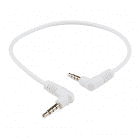
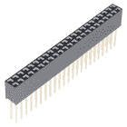
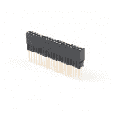
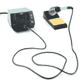
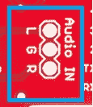

# 频谱屏蔽连接指南(v2)

> 原文：<https://learn.sparkfun.com/tutorials/spectrum-shield-hookup-guide-v2>

## 介绍

**Update:** This tutorial is an updated version of the [original hookup guide](https://learn.sparkfun.com/tutorials/spectrum-shield-hookup-guide) to make use of the Serial Plotter feature of the Arduino IDE, reduce the setup complexity in the examples, and update some of the format of the content. For users looking for the original tutorial, use the following link:

你有没有想过让你的项目对音乐做出反应？那么这就是适合你的产品！[频谱屏蔽](https://www.sparkfun.com/products/13116)为您的 Arduino 板提供了跨 7 个频段测量立体声音频输入的能力。通过使用 Arduino 板的 ADC 读取每个频段的幅度，用户可以控制连接的设备如何响应音频输入。

[](https://www.sparkfun.com/products/13116) 

将**添加到您的[购物车](https://www.sparkfun.com/cart)中！**

 **### [SparkFun 光谱盾](https://www.sparkfun.com/products/13116)

[In stock](https://learn.sparkfun.com/static/bubbles/ "in stock") DEV-13116

频谱屏蔽使您的 Arduino 能够将立体声音频输入分成每个通道 7 个频段。你…

$28.9515[Favorited Favorite](# "Add to favorites") 19[Wish List](# "Add to wish list")** **### 所需材料

为了跟随本教程，我们推荐以下项目。

[](https://www.sparkfun.com/products/15123) 

将**添加到您的[购物车](https://www.sparkfun.com/cart)中！**

 **### [spark fun RedBoard Qwiic](https://www.sparkfun.com/products/15123)

[In stock](https://learn.sparkfun.com/static/bubbles/ "in stock") DEV-15123

SparkFun RedBoard Qwiic 是一款 Arduino 兼容开发板，内置 Qwiic 连接器，无需…

$21.5014[Favorited Favorite](# "Add to favorites") 49[Wish List](# "Add to wish list")****[](https://www.sparkfun.com/products/11417) 

将**添加到您的[购物车](https://www.sparkfun.com/cart)中！**

 **### [Arduino 可堆叠接头套件- R3](https://www.sparkfun.com/products/11417)

[In stock](https://learn.sparkfun.com/static/bubbles/ "in stock") PRT-11417

这些接头适用于 Arduino Uno R3、Leonardo 和新的 Arduino 板。他们是完美的 h…

$1.7512[Favorited Favorite](# "Add to favorites") 68[Wish List](# "Add to wish list")****[](https://www.sparkfun.com/products/13244) 

将**添加到您的[购物车](https://www.sparkfun.com/cart)中！**

 **### [【USB Micro-B 线缆-6】](https://www.sparkfun.com/products/13244)

[In stock](https://learn.sparkfun.com/static/bubbles/ "in stock") CAB-13244

这是一根 USB 2.0 型转 Micro-B 型 5 针黑色电缆。你知道，通常配在手机上的迷你 B 连接器，可以…

$2.103[Favorited Favorite](# "Add to favorites") 7[Wish List](# "Add to wish list")****[](https://www.sparkfun.com/products/14163) 

将**添加到您的[购物车](https://www.sparkfun.com/cart)中！**

 **### [音频线 TRRS - 1ft](https://www.sparkfun.com/products/14163)

[In stock](https://learn.sparkfun.com/static/bubbles/ "in stock") CAB-14163

这是一条一英尺长的白色音频电缆，两端各有两个 TRRS 连接器。TRRS 连接器是…

$1.60[Favorited Favorite](# "Add to favorites") 3[Wish List](# "Add to wish list")******** ********### 所需工具

该产品需要一些组件。您需要一个烙铁、焊料和/或通用焊接附件来将接头焊接到频谱屏蔽上。

[](https://www.sparkfun.com/products/9163) 

将**添加到您的[购物车](https://www.sparkfun.com/cart)中！**

 **### [无铅焊料- 15 克管](https://www.sparkfun.com/products/9163)

[In stock](https://learn.sparkfun.com/static/bubbles/ "in stock") TOL-09163

这是你的无铅焊料的基本管，带有不干净的水溶性树脂芯。0.031 英寸规格，15 克

$3.954[Favorited Favorite](# "Add to favorites") 14[Wish List](# "Add to wish list")****[](https://www.sparkfun.com/products/9507) 

将**添加到您的[购物车](https://www.sparkfun.com/cart)中！**

 **### [烙铁- 30W(美国，110V)](https://www.sparkfun.com/products/9507)

[33 available](https://learn.sparkfun.com/static/bubbles/ "33 available") TOL-09507

这是一个非常简单的固定温度，快速加热，30W 110/120 VAC 烙铁。我们真的很喜欢使用更贵的 iro…

$10.957[Favorited Favorite](# "Add to favorites") 21[Wish List](# "Add to wish list")**** ****[**附加配件**](#Additional_Accessories)

***Click the button** above to toggle a **list of accessories** that are available from our catalog.*

#### 附加附件

以下是我们产品目录中您可能感兴趣的其他接头和焊接工具的样本。如需完整选择我们可用的 [**接头**](https://www.sparkfun.com/categories/381) 或 [**焊接工具**](https://www.sparkfun.com/categories/49) ，请点击相关链接。

[](https://www.sparkfun.com/products/116) 

将**添加到您的[购物车](https://www.sparkfun.com/cart)中！**

 **### [破开头球——直击](https://www.sparkfun.com/products/116)

[In stock](https://learn.sparkfun.com/static/bubbles/ "in stock") PRT-00116

一排标题-打破适应。40 个引脚，可切割成任何尺寸。用于定制 PCB 或通用定制接头。

$1.7520[Favorited Favorite](# "Add to favorites") 133[Wish List](# "Add to wish list")****[](https://www.sparkfun.com/products/12790) 

将**添加到您的[购物车](https://www.sparkfun.com/cart)中！**

 **### [可堆叠接头- 2x23 引脚母](https://www.sparkfun.com/products/12790)

[In stock](https://learn.sparkfun.com/static/bubbles/ "in stock") PRT-12790

这是一个 2x23 引脚的凹形 PTH 接头，具有超长的引脚，非常适合堆叠。这一块是在共同的配置…

$3.251[Favorited Favorite](# "Add to favorites") 15[Wish List](# "Add to wish list")****[](https://www.sparkfun.com/products/16279) 

将**添加到您的[购物车](https://www.sparkfun.com/cart)中！**

 **### [Arduino Nano 可堆叠头部套件](https://www.sparkfun.com/products/16279)

[In stock](https://learn.sparkfun.com/static/bubbles/ "in stock") PRT-16279

这组可堆叠插座包括两个 15 针插座；引脚间距为 0.1 英寸。

$1.75[Favorited Favorite](# "Add to favorites") 5[Wish List](# "Add to wish list")****[](https://www.sparkfun.com/products/16764) 

将**添加到您的[购物车](https://www.sparkfun.com/cart)中！**

 **### [扩展 GPIO 母头- 2x20 引脚(13.5 毫米/9.80 毫米)](https://www.sparkfun.com/products/16764)

[In stock](https://learn.sparkfun.com/static/bubbles/ "in stock") PRT-16764

这种 2x20 引脚母接头旨在允许您扩展任何具有标准 2x20 GPIO 引脚尺寸的电路板。

$2.25[Favorited Favorite](# "Add to favorites") 7[Wish List](# "Add to wish list")****************[](https://www.sparkfun.com/products/14672) 

将**添加到您的[购物车](https://www.sparkfun.com/cart)中！**

 **### [绝缘硅胶焊垫](https://www.sparkfun.com/products/14672)

[In stock](https://learn.sparkfun.com/static/bubbles/ "in stock") TOL-14672

有了这种绝缘硅胶焊接垫，您将能够保护您的桌面、焊接站或…

$10.959[Favorited Favorite](# "Add to favorites") 93[Wish List](# "Add to wish list")****[](https://www.sparkfun.com/products/14734) 

将**添加到您的[购物车](https://www.sparkfun.com/cart)中！**

 **### [威勒 WE1010 焊台](https://www.sparkfun.com/products/14734)

[Only 1 left!](https://learn.sparkfun.com/static/bubbles/ "only 1 left!") TOL-14734

韦勒的 WE1010 是一个强大的 70 瓦焊接站，非常适合热情的爱好者，DIY 者和任何人…

$138.504[Favorited Favorite](# "Add to favorites") 26[Wish List](# "Add to wish list")****[](https://www.sparkfun.com/products/10242) 

将**添加到您的[购物车](https://www.sparkfun.com/cart)中！**

 **### [Solder-1/4 磅短管(0.020”)特殊混合](https://www.sparkfun.com/products/10242)

[In stock](https://learn.sparkfun.com/static/bubbles/ "in stock") TOL-10242

我们不想炒作这种焊料太多，但这可能是世界上最好的焊料。好了，我们已经说过了。这…

$32.5014[Favorited Favorite](# "Add to favorites") 17[Wish List](# "Add to wish list")****[](https://www.sparkfun.com/products/14228) 

### [威勒 WLC100 焊台](https://www.sparkfun.com/products/14228)

[Out of stock](https://learn.sparkfun.com/static/bubbles/ "out of stock") TOL-14228

Weller 的 WLC100 是一款多功能的 5 瓦至 40 瓦焊台，非常适合业余爱好者、DIY 爱好者和学生。…

2[Favorited Favorite](# "Add to favorites") 17[Wish List](# "Add to wish list")************** ************### 推荐阅读

我们建议您在继续学习本连接指南之前熟悉这些资源。

[](https://learn.sparkfun.com/tutorials/how-to-solder-through-hole-soldering) [### 如何焊接:通孔焊接](https://learn.sparkfun.com/tutorials/how-to-solder-through-hole-soldering) This tutorial covers everything you need to know about through-hole soldering.[Favorited Favorite](# "Add to favorites") 70[](https://learn.sparkfun.com/tutorials/serial-communication) [### 串行通信](https://learn.sparkfun.com/tutorials/serial-communication) Asynchronous serial communication concepts: packets, signal levels, baud rates, UARTs and more 100[](https://learn.sparkfun.com/tutorials/connector-basics) [### 连接器基础](https://learn.sparkfun.com/tutorials/connector-basics) Connectors are a major source of confusion for people just beginning electronics. The number of different options, terms, and names of connectors can make selecting one, or finding the one you need, daunting. This article will help you get a jump on the world of connectors.[Favorited Favorite](# "Add to favorites") 62[](https://learn.sparkfun.com/tutorials/analog-to-digital-conversion) [### 模数转换](https://learn.sparkfun.com/tutorials/analog-to-digital-conversion) The world is analog. Use analog to digital conversion to help digital devices interpret the world.[Favorited Favorite](# "Add to favorites") 58[](https://learn.sparkfun.com/tutorials/what-is-an-arduino) [### 什么是 Arduino？](https://learn.sparkfun.com/tutorials/what-is-an-arduino) What is this 'Arduino' thing anyway? This tutorials dives into what an Arduino is and along with Arduino projects and widgets.[Favorited Favorite](# "Add to favorites") 50[](https://learn.sparkfun.com/tutorials/installing-arduino-ide) [### 安装 Arduino IDE](https://learn.sparkfun.com/tutorials/installing-arduino-ide) A step-by-step guide to installing and testing the Arduino software on Windows, Mac, and Linux.[Favorited Favorite](# "Add to favorites") 16[](https://learn.sparkfun.com/tutorials/integrated-circuits) [### 集成电路](https://learn.sparkfun.com/tutorials/integrated-circuits) An introduction to integrated circuits (ICs). Electronics' ubiquitous black chips. Includes a focus on the variety of IC packages.[Favorited Favorite](# "Add to favorites") 46[](https://learn.sparkfun.com/tutorials/analog-vs-digital) [### 模拟与数字](https://learn.sparkfun.com/tutorials/analog-vs-digital) This tutorial covers the concept of analog and digital signals, as they relate to electronics.[Favorited Favorite](# "Add to favorites") 66

## 硬件概述

### 音频连接

**音频插孔**

频谱屏蔽板上有两个立体声音频插孔。第一个音频插孔是输入插孔(标记为`Input`)。这允许用户使用基本的[音频线](https://www.sparkfun.com/products/14163)从任何设备输入音频——如 MP3 播放器或手机。此连接不是必须使用的，因为在“音频输入”标题处有另一个添加音频输入的选项，如下所述。

[](https://cdn.sparkfun.com/assets/learn_tutorials/2/4/3/Audio_Jacks.jpg)

第二个音频插孔是音频输出，标记为`Output`。该插孔允许您在频谱分析仪 IC 处理音量的同时，将音频传回扬声器或其他音频系统。(**从技术上来说，音频插孔和音频接头都连接在一起，可以用作输入或输出。*

**标题中的音频**

对于某些项目，您可能不会从预处理源(如手机)传输音频。对于想要使用像 [MEMS 麦克风分线点](https://www.sparkfun.com/products/9868)或[声音检测器](https://www.sparkfun.com/products/12642)这样的东西作为音频源的用户，有三个插头引脚可以为您的屏蔽提供替代连接方法。

[](https://cdn.sparkfun.com/assets/learn_tutorials/2/4/3/Audio_In_Headers.jpg)

这些引脚如下:

*   **L** =左音频输入
*   **G** =地面音频输入
*   **R** =右音频输入

通过左右输入，您可以在这些头上使用立体声设备。信号还会传递到*输入*和*输出*音频插孔。

### MSGEQ7 国际公务员制度委员会

这个屏蔽的真正威力来自于板上的两个 MSGEQ7 ICs。这些是 [CMOS](http://en.wikipedia.org/wiki/CMOS) 芯片，是七波段图形均衡器。

[](https://cdn.sparkfun.com/assets/learn_tutorials/2/4/3/MSGEQ7_ICs.jpg)

在接收到音频信号后，这些 IC 将频谱分成七个频段，频率如下:

*   63Hz
*   160 赫兹
*   400 赫兹
*   1kHz
*   2.5 千赫
*   6.25 千赫
*   16 千赫

对于视觉型学习者，这是来自 MSGEQ7 数据表的频率图:

[](https://cdn.sparkfun.com/assets/learn_tutorials/2/4/3/Frequency_Graph.JPG)*Source: [Mixed Signal Integration MSGEQ7 Datasheet](https://www.sparkfun.com/datasheets/Components/General/MSGEQ7.pdf)*

一旦光谱被分成这些范围，每个波段被峰值检测和多路复用。DC 输出代表每个频带的幅度。利用 IC 上的 strobe 和 reset 引脚，用户可以选择 DC 峰值输出。

### 屏蔽连接

Arduino/RedBoard 或其他微控制器有 4 个主要引脚连接到频谱屏蔽。

**模拟引脚** -有两个模拟引脚连接到 MSGEQ7 集成电路。`A0`是来自第一个 IC 的 DC 模拟输出，用于左音频通道的**，而`A1`是来自第二个、**右**音频通道的 DC 模拟输出。**

[](https://cdn.sparkfun.com/assets/learn_tutorials/1/1/3/2/analog_pins_close_up.jpg)

**控制引脚**——控制引脚连接到 MSGEQ7 上的*选通*和*复位*引脚；分别为`D4`和`D5`。为了启用*频闪*引脚，必须将*复位*引脚**拉低**。要复位整个多路复用器，将*复位*引脚**拉高**。

[](https://cdn.sparkfun.com/assets/learn_tutorials/1/1/3/2/control_pins_close_up.jpg)

*Strobe* 引脚一旦激活，就会在每个通道中循环。初始脉冲之后，它从 63Hz 开始，每个通道发出脉冲直到 16kHz，然后重复，从 63Hz 开始。每个通道的 DC 输出将跟随*选通*脉冲。

**Remember:** The reset line for the MSGEQ7 IC is **not** the same as the *Reset* push button that resets the entire system (RedBoard + Shield).

### 复原按钮

“重置”按钮允许您在插入屏蔽时重置 Arduino/RedBoard。按住 reset 按钮会将 ATMega328(或其他微控制器)的 reset 引脚拉低，从而允许系统复位。这将重启微控制器上当前运行的任何草图。

[](https://cdn.sparkfun.com/assets/learn_tutorials/2/4/3/Reset_button.jpg)

## 硬件装配

### 焊接头

与任何屏蔽一样，第一步是选择接头类型。如果您需要堆叠在其他屏蔽物上，我们推荐[可堆叠接头](https://www.sparkfun.com/products/11417)；否则，[(直)公接头](https://www.sparkfun.com/products/116)是最容易使用的。您可以随意选择您喜欢的任何连接方法，但请记住，在选择您的接头时，他的 shield 使用了 [Arduino Uno R3](https://www.sparkfun.com/products/11021) 外形或尺寸。

[](https://learn.sparkfun.com/tutorials/how-to-solder-through-hole-soldering) [### 如何焊接:通孔焊接

#### 2013 年 9 月 19 日](https://learn.sparkfun.com/tutorials/how-to-solder-through-hole-soldering) This tutorial covers everything you need to know about through-hole soldering.[Favorited Favorite](# "Add to favorites") 70[](https://learn.sparkfun.com/tutorials/arduino-shields-v2) [### Arduino Shields v2

#### 2020 年 4 月 20 日](https://learn.sparkfun.com/tutorials/arduino-shields-v2) An update to our classic Arduino Shields Tutorial! All things Arduino shields. What they are and how to assemble them.[Favorited Favorite](# "Add to favorites") 5

你需要将接头焊接到屏蔽层上，所以在开始之前要确保你有所有合适的材料。如果你不确定如何将接头焊接到屏蔽上，请查看我们的[如何焊接](https://learn.sparkfun.com/tutorials/how-to-solder-through-hole-soldering)和 [Arduino 屏蔽](https://learn.sparkfun.com/tutorials/arduino-shields#installing-headers-preparation)教程(*也链接到上面的*)。

一旦完成，连接屏蔽到你的微控制器；如果你用的是 [Arduino Uno](https://www.sparkfun.com/products/11224) 或者 [SparkFun RedBoard](https://www.sparkfun.com/products/15123) ，把盾牌叠在上面。

### 连接音频系统

在下面的例子中，我们将使用您的计算机作为音频源。将[音频线](https://www.sparkfun.com/products/14163)的一端插入电脑上的音频插孔，另一端插入频谱屏蔽上的`Input`插孔。请随意使用频谱屏蔽上的`Output`插孔将音频传递到扬声器或耳机。

**Note:** You may need to turn up the volume to meet the threshold for the IC to respond to the audio input. This volume may be above your tolerance for "comfortable listening". If this is the case, try using a speaker with an adjustable volume knob to lower the volume to a more reasonable level.

### 连接到计算机

你需要做的最后一件事是将微控制器连接到计算机上(用 USB 线连接*)。如果你做的一切都是正确的，它应该类似于下图。*

[](https://cdn.sparkfun.com/assets/learn_tutorials/1/1/3/2/assembly.jpg)*RedBoard with Spectrum Shield attached to a computer.*

## Arduino 示例代码

**注意:**本教程假设您在桌面上使用的是最新版本的 Arduino IDE。如果这是你第一次使用 Arduino，请回顾我们关于[安装 Arduino IDE 的教程。](https://learn.sparkfun.com/tutorials/installing-arduino-ide)

### 串行绘图仪示例

现在，您已经连接好了所有的硬件，是时候分析一些音频信号了。下面，我们就来走一遍[spark fun _ Spectrum _ Shield _ Serial _ Plotter _ demo . ino](https://github.com/sparkfun/Spectrum_Shield/blob/master/Firmware/SparkFun_Spectrum_Serial_Plotter_Demo/SparkFun_Spectrum_Serial_Plotter_Demo.ino)草图。首先，从 [GitHub 库](https://github.com/sparkfun/Spectrum_Shield/archive/master.zip)下载草图，并上传到你的 Arduino。(**著。必须提取 zip 文件夹，草图文件位于**Spectrum _ Shield**>**Firmware**>**spark fun _ Spectrum _ Serial _ Plotter _ Demo**文件夹中。*)

#### 代码概述

演示代码的开头定义了引脚功能。必须定义微控制器的频谱屏蔽引脚连接。

```
language:c
//Declare Spectrum Shield pin connections
#define STROBE 4
#define RESET 5
#define DC_One A0
#define DC_Two A1

//Define spectrum variables
int freq_amp;
int Frequencies_One[7];
int Frequencies_Two[7];
int i; 
```

注意，我们声明了两个数组`Frequencies_One[]`和`Frequencies_Two[]`；这些将用于存储来自 MSGEQ7 集成电路的*七个*频段的输出。(**`freq_amp`和`i`变量是用于代码中迭代的计数器，意义最小。*)

在设置循环中，屏蔽引脚也必须声明为`STROBE`和`RESET`引脚的`OUTPUT`，这样我们就可以使用 RedBoard 控制屏蔽。DC 模拟引脚在代码中均被声明为`INPUT`，因为 RedBoard 将从这些引脚读取中的数据*。一旦管脚被声明，控制管脚(`STROBE`和`RESET`)被设置为`LOW`状态/输出。添加延迟以使设置生效，然后将[串行输出](https://learn.sparkfun.com/tutorials/serial-communication)初始化为 **9600 bps** bard 速率。*

```
language:c
/********************Setup Loop*************************/
void setup() {
  //Set spectrum Shield pin configurations
  pinMode(STROBE, OUTPUT);
  pinMode(RESET, OUTPUT);
  pinMode(DC_One, INPUT);
  pinMode(DC_Two, INPUT);

  //Initialize Spectrum Analyzers
  digitalWrite(STROBE, LOW);
  digitalWrite(RESET, LOW);
  delay(5);

  Serial.begin(9600);
} 
```

对于草图的主要部分，我们通过两个用户定义的函数进行循环。`Read_Frequenices()`和`Graph_Frequencies()`分别告诉 RedBoard 读取来自频谱屏蔽的频率，并串行打印出模拟值。

```
language:c
/****************Main Function Loop***************************/
void loop() {

  Read_Frequencies();
  Graph_Frequencies();
  delay(50);

} 
```

接下来在代码中定义了`Read_Frequencies()`函数。调用时，该函数通过循环`RESET`引脚初始化/复位 ICs，如前面[控制引脚部分](https://learn.sparkfun.com/tutorials/spectrum-shield-hookup-guide#hardware-overview)所述。然后，该功能使用`STROBE`引脚遍历频谱屏蔽上的每个频带，读取 DC 模拟输出，并将值存储到预定义的频率阵列中。

```
language:c
/*************Pull frquencies from Spectrum Shield****************/
void Read_Frequencies() {
  digitalWrite(RESET, HIGH);
  delayMicroseconds(200);
  digitalWrite(RESET, LOW);
  delayMicroseconds(200);

  //Read frequencies for each band
  for (freq_amp = 0; freq_amp < 7; freq_amp++)
  {
    digitalWrite(STROBE, HIGH);
    delayMicroseconds(50);
    digitalWrite(STROBE, LOW);
    delayMicroseconds(50);

    Frequencies_One[freq_amp] = analogRead(DC_One);
    Frequencies_Two[freq_amp] = analogRead(DC_Two);
  }
} 
```

通过`Graph_Frequencies()`功能检索数据。通过此功能，RedBoard 返回频谱屏蔽通过串行端口读取的频率的模拟值。

```
language:c
/*****************Print Out Band Values for Serial Plotter*****************/
void Graph_Frequencies() {
  for (i = 0; i < 7; i++)
  {
//    Serial.print(Frequencies_One[i]);
//    Serial.print(" ");
//    Serial.print(Frequencies_Two[i]);
//    Serial.print(" ");
    Serial.print( (Frequencies_One[i] + Frequencies_Two[i]) / 2 );
    Serial.print("    ");
  }
  Serial.println();
} 
```

### 代码操作

草图上传到您的电路板后，您现在可以分析音频输入的不同频段。拉起[串行监视器](https://learn.sparkfun.com/tutorials/serial-communication)并将波特率设置为 **9600** 。然后，用你的电脑播放一段音频样本。您应该会看到串行监视器列中的数字随着音频的变化而变化。

**Note:** The "*strength*" and quality of the audio output from your computer is dependent on the sound card/chip use by your computer. Users may need to change their audio/speaker settings; as a baseline, I recommend turning up the audio on your computer to about 65% as a starting point.

下面是一些音频样本，用户可以用来测试频谱屏蔽:

*   [在线音调发生器](https://www.szynalski.com/tone-generator/) -一个基于网站的音调发生器。
*   [Youtube 视频](https://www.youtube.com/watch?v=qNf9nzvnd1k) -将(音频)信号频率从 20 赫兹提高到 20 千赫兹。【T2

    [https://www.youtube.com/embed/qNf9nzvnd1k/?autohide=1&border=0&wmode=opaque&enablejsapi=1](https://www.youtube.com/embed/qNf9nzvnd1k/?autohide=1&border=0&wmode=opaque&enablejsapi=1)

尝试播放 Youtube 视频并使用 Arduino IDE 的串行绘图仪。您应该会看到类似于下图的响应曲线。请注意这些形状如何类似于 [**硬件概述**](https://learn.sparkfun.com/tutorials/spectrum-shield-hookup-guide-v2#hardware-overview) 部分的数据表中的图。

[](https://cdn.sparkfun.com/assets/learn_tutorials/1/1/3/2/spectrum_plot.gif)

### 其他示例

有很多项目都在使用 Spectrum Shield，所以如果你需要更多的灵感，就做一些搜索吧！此外，您可以参考[原始教程](https://learn.sparkfun.com/tutorials/spectrum-shield-hookup-guide)，其中提供了其他示例，包括光谱屏蔽合作者 Bliptronics 的一个示例，该示例使用光谱屏蔽和 LED 矩阵。

## 资源和更进一步

有关更多信息，请查看以下资源:

*   [原理图(PDF)](https://cdn.sparkfun.com/datasheets/Dev/Arduino/Shields/Spectrum_Shield_v16.pdf) -原理图的 PDF
*   [Eagle Files (ZIP)](https://cdn.sparkfun.com/datasheets/Dev/Arduino/Shields/Spectrum_Shield_v16.zip) -带有 Eagle 文件的 ZIP 文件
*   [MSGEQ7 数据表](https://www.sparkfun.com/datasheets/Components/General/MSGEQ7.pdf) -数据表 PDF
*   [GitHub 产品报告](https://github.com/sparkfun/Spectrum_Shield/tree/master) -硬件和固件文件。
*   [SFE 产品展示区](https://youtu.be/WCxcUrVRrqg)

同样值得一查的还有这一版的[工程圆桌](https://www.sparkfun.com/videos#roundtable)，详细介绍了如何使用频谱盾控火！

[https://www.youtube.com/embed/A1VySF2Rd4I/?autohide=1&border=0&wmode=opaque&enablejsapi=1](https://www.youtube.com/embed/A1VySF2Rd4I/?autohide=1&border=0&wmode=opaque&enablejsapi=1)**************************