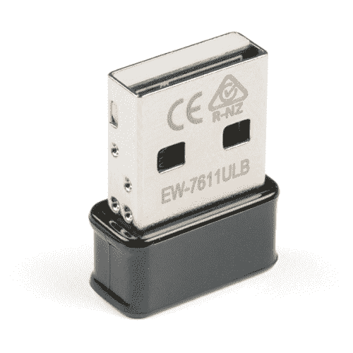
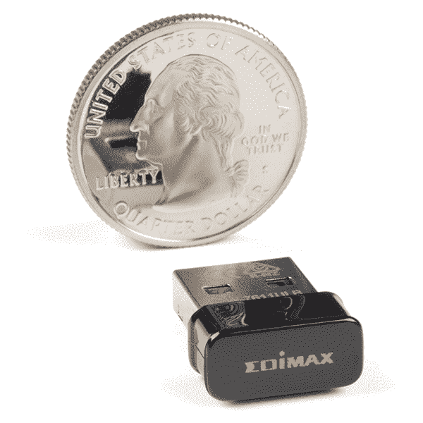

# 将 WiFi 添加到 NVIDIA Jetson

> 原文：<https://learn.sparkfun.com/tutorials/adding-wifi-to-the-nvidia-jetson>

## 介绍

如今，几乎每台电脑都需要互联网连接，越来越多的连接是通过 WiFi 进行的，以避免将东西束缚在路由器交换机或墙上。无线互联网连接对于许多应用程序需要移动的单板计算机尤其有用。NVIDIA Jetson Nano 开发套件也不例外，它尽可能地保持主板的移动性，但仍能访问互联网进行软件更新、网络请求和许多其他应用。不幸的是，它没有内置 WiFi，所以我们需要自己添加。

有许多 WiFi 解决方案可以与 Jetson Nano 配合使用，但我们将专注于我们单独销售的 [Edimax N150 二合一适配器](https://www.sparkfun.com/products/15449)，它包含在我们的 [JetBot AI 套件](https://www.sparkfun.com/products/16390)中。这种适配器体积小，功耗低，相对便宜，但如果你完成了 NVIDIA 提供的 DLI 课程，或者你打算添加 WiFi，那么从全新的操作系统映像安装开始工作确实需要一点点努力。没关系，让我们看看，让你的杰特森纳米在网上！

 

将**添加到您的[购物车](https://www.sparkfun.com/cart)中！**

### [Edimax 二合一 WiFi 和蓝牙 4.0 适配器](https://www.sparkfun.com/products/15449)

[In stock](https://learn.sparkfun.com/static/bubbles/ "in stock") WRL-15449

Edimax 2 合 1 WiFi 和蓝牙 4.0 适配器(EW-7611ULB)是一款支持蓝牙 4.0 的纳米级 USB Wi-Fi 适配器

$21.50[Favorited Favorite](# "Add to favorites") 8[Wish List](# "Add to wish list")** **## 硬件概述和组装

### Edimax N150

我们携带的 Edimax N150 是专门型号为 E-7611ULB 的 USB WiFi /蓝牙组合适配器。

Edimax 2 合 1 WiFi 和蓝牙 4.0 适配器(EW-7611ULB)是一款带有蓝牙 4.0 的纳米级 USB WiFi 适配器，支持高达 150Mbps 的 WiFi，同时允许用户连接到所有最新的蓝牙设备，如手机、平板电脑、鼠标、键盘、打印机等。该适配器支持最新的蓝牙 4.0 版本和蓝牙智能就绪，在传输数据或连接设备时，通过蓝牙低能耗(BLE)提供超低功耗。凭借微小的纳米尺寸设计，您可以轻松插入它，而不会阻塞任何周围的 USB 端口，这使得它非常适合为 NVIDIA Jetson Nano 添加 WiFi 连接

### 硬件装配**