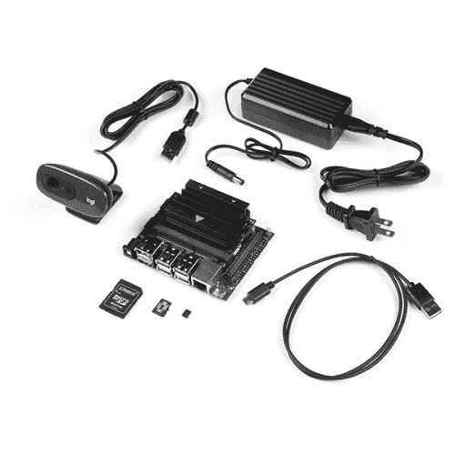

# 通过 jupiter 笔记本电脑在 jetson nano 上与 qwiic 一起工作

> 原文：<https://learn.sparkfun.com/tutorials/working-with-qwiic-on-a-jetson-nano-through-jupyter-notebooks>

## 介绍

老实说...对于希望开始远程计算的人来说，SSH 或 VNC 有时会令人沮丧，并且是入门的障碍。幸运的是，像 [Project Jupyter](https://jupyter.org/) 这样的服务有助于让远程计算变得更容易实现。Jupyter 笔记本已经出现了一段时间，许多人将它们用于各种应用；从数据可视化到计算机科学的教学。

简而言之，您可以将 Jupyter 笔记本视为一个平台中的 IDE 和文档库，可以通过 web 浏览器远程访问。Jupyter 然后授权访问主机的文件目录，这是一个运行 Linux 命令以在其上安装软件以及运行所需命令和进程的终端。“笔记本”是一些文件，通过将 markdown 文档与代码混合在一起，您可以在其中创建交互式 Python 脚本，这样您的笔记本既是一个“笔记本”，也是您最终运行的程序。Jupyter 笔记本的常见应用包括构建数据可视化显示或 GUI 界面。

Jupyter 笔记本通过网络浏览器界面访问。从同一网络上的客户端计算机上，您可以访问笔记本，编辑、运行和/或修改托管的 Python 脚本，以及创建新脚本。就所需的硬件外围设备而言，这使得使用单板计算机更加容易和简洁，但也降低了那些对该主题陌生并感到不知所措的人的入门门槛。

## Jetson Nano 上用于 SparkFun Qwiic 的 Jupyter 笔记本

使用 Jupyter 笔记本作为开发和学习平台的一个很好的例子是 NVIDIA Jetson Nano。

我们有两个工具包:DLI 课程工具包和 T2 JetBot AI 工具包，它们可以使用 Jupyter 笔记本作为一种交付教程内容的方式，让用户轻松启动和运行，并使他们能够使用这些产品走得更远。Jupyter 笔记本特别有助于处理那些耗费脑力且难以理解的主题和项目，如机器学习和计算机视觉。

 

将**添加到您的[购物车](https://www.sparkfun.com/cart)中！**

 **### [捷信纳米的 SparkFun DLI 套件](https://www.sparkfun.com/products/16308)

[19 available](https://learn.sparkfun.com/static/bubbles/ "19 available") KIT-16308

随着 Jetson Nano 开发套件的发布，NVIDIA 使开发人员、研究人员、学生和业余爱好者能够通过

$229.955[Favorited Favorite](# "Add to favorites") 20[Wish List](# "Add to wish list")**** 

### [由杰特森纳米驱动的 SparkFun JetBot AI Kit v2.1】](https://www.sparkfun.com/products/retired/16417)

[Retired](https://learn.sparkfun.com/static/bubbles/ "Retired") KIT-16417

利用这个工具包，把你的杰特森纳米变成一个移动的机器，如物体跟踪，碰撞避免通过…

5 **Retired**[Favorited Favorite](# "Add to favorites") 12[Wish List](# "Add to wish list")** **本教程涵盖了我们为 Python 支持的 Qwiic 板创建的一套 Jupyter 笔记本，以及它们与 NVIDIA Jetson Nano 的使用！

随着 Python 对不断增长的 [SparkFun Qwiic 板](https://www.sparkfun.com/qwiic)目录的支持，我们认为围绕使用 NVIDIA Jetson Nano 的 Qwiic 板构建的 Jupyter 笔记本系列将是一个好主意。我们已经创建了八种不同的笔记本，为您提供了当前支持的每种主板的“Hello World”示例。每个笔记本都将 Python 脚本分解成易于管理的小块，给出正在发生的事情的解释和背景，最终我们会让你获得足够的知识来应对危险！

当你觉得舒服并且想要为一个项目创建你自己的 Python 脚本时，你可以创建你自己的笔记本并且直接从 Jupyter 笔记本执行代码。您甚至可以尝试将一些传感器集成到机器学习项目中，因为所有的 Qwiic 库都将安装在您的 Jetson Nano 上！

本教程将让您使用 SparkFun Qwiic 板在 NVIDIA Jetson Nano 和 Jupyter 笔记本上运行！

## 硬件概述和组装

我们显然需要一个 NVIDIA Jetson Nano(我们建议从 DLI 课程工具包开始)以及一些 Qwiic 硬件。我们建议从用于 Raspberry Pi 的 SparkFun Qwiic 套件开始，但我们有用于许多 Qwiic 板的 Python 包。最新的 Python 支持的 Qwiic 板列表可以在 [Qwiic Py GitHub 库](https://github.com/sparkfun/Qwiic_Py)中找到。

**