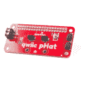
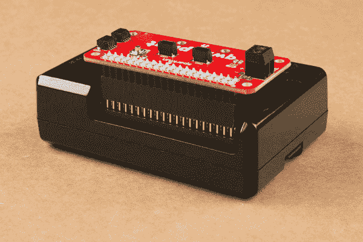

# Raspberry Pi 安全重启和关机按钮

> 原文：<https://learn.sparkfun.com/tutorials/raspberry-pi-safe-reboot-and-shutdown-button>

## 介绍

在你的树莓派安全关闭之前拔掉它的插头...是个坏主意！这可能导致 microSD 卡和文件系统损坏。通常，我们可以使用 GUI 中的菜单栏或在终端窗口中键入命令来安全地关闭 Pi。如果你正在寻找一个更快的解决方案(特别是如果你正在使用一个[无头设置](https://learn.sparkfun.com/tutorials/headless-raspberry-pi-setup)，不要害怕！您可以使用一个通用按钮和一个 Python 脚本安全地重启或关闭您的 Raspberry Pi！

[](https://cdn.sparkfun.com/assets/learn_tutorials/1/1/7/1/Pi_Reboot_Shutdown_Button.jpg)

### 所需材料

要跟随本教程，您将需要以下材料。你可能不需要所有的东西，但这取决于你有什么和你的设置。将它添加到您的购物车，通读指南，并根据需要调整购物车。

[](https://www.sparkfun.com/products/13733) 

将**添加到您的[购物车](https://www.sparkfun.com/cart)中！**

### [【树莓派 LCD - 7】触摸屏](https://www.sparkfun.com/products/13733)

[In stock](https://learn.sparkfun.com/static/bubbles/ "in stock") LCD-13733

这款 7 英寸的 Raspberry Pi 触摸屏液晶显示器让您能够创建一个独立的设备，可以用作一个触摸屏

$60.0051[Favorited Favorite](# "Add to favorites") 150[Wish List](# "Add to wish list")****[](https://www.sparkfun.com/products/15945) 

将**添加到您的[购物车](https://www.sparkfun.com/cart)中！**

### [树莓派的 spark fun Qwiic pHAT v 2.0](https://www.sparkfun.com/products/15945)

[15 available](https://learn.sparkfun.com/static/bubbles/ "15 available") DEV-15945

树莓派的 SparkFun Qwiic pHAT V2 是进入 Qwiic 生态系统和 sti…

$6.952[Favorited Favorite](# "Add to favorites") 32[Wish List](# "Add to wish list")****[](https://www.sparkfun.com/products/14271) 

将**添加到您的[购物车](https://www.sparkfun.com/cart)中！**

### [多媒体无线键盘](https://www.sparkfun.com/products/14271)

[In stock](https://learn.sparkfun.com/static/bubbles/ "in stock") WIG-14271

随着单板计算机(SBC)的兴起，用一种简单的方法与它们接口是一个好主意。在…上操作

$29.954[Favorited Favorite](# "Add to favorites") 26[Wish List](# "Add to wish list")****[](https://www.sparkfun.com/products/16384) 

### [SparkFun 树莓 Pi 4 基础套装- 4GB](https://www.sparkfun.com/products/16384)

[Out of stock](https://learn.sparkfun.com/static/bubbles/ "out of stock") KIT-16384

Raspberry Pi 4 基本套件包括启动和运行 Raspberry Pi 4 4GB 所需的一切。

6[Favorited Favorite](# "Add to favorites") 21[Wish List](# "Add to wish list")****** ******### 推荐阅读

如果你不熟悉下面的教程，我们也建议你看一看。

[](https://learn.sparkfun.com/tutorials/raspberry-pi-4-kit-hookup-guide) [### Raspberry Pi 4 套件连接指南

#### 2020 年 3 月 14 日](https://learn.sparkfun.com/tutorials/raspberry-pi-4-kit-hookup-guide) Guide for hooking up your Raspberry Pi 4 Model B basic, desktop, or hardware starter kit together.[Favorited Favorite](# "Add to favorites") 2[](https://learn.sparkfun.com/tutorials/qwiic-phat-for-raspberry-pi-hookup-guide) [### 覆盆子 Pi 连接指南的 Qwiic pHAT

#### 2019 年 5 月 23 日](https://learn.sparkfun.com/tutorials/qwiic-phat-for-raspberry-pi-hookup-guide) Get started interfacing your Qwiic enabled boards with your Raspberry Pi. The Qwiic pHAT connects the I2C bus (GND, 3.3V, SDA, and SCL) on your Raspberry Pi to an array of Qwiic connectors.[Favorited Favorite](# "Add to favorites") 2[](https://learn.sparkfun.com/tutorials/terminal-basics) [### 串行终端基础知识](https://learn.sparkfun.com/tutorials/terminal-basics) This tutorial will show you how to communicate with your serial devices using a variety of terminal emulator applications.[Favorited Favorite](# "Add to favorites") 46[](https://learn.sparkfun.com/tutorials/raspberry-gpio) [### 树莓 gPIo](https://learn.sparkfun.com/tutorials/raspberry-gpio) How to use either Python or C++ to drive the I/O lines on a Raspberry Pi.[Favorited Favorite](# "Add to favorites") 17[](https://learn.sparkfun.com/tutorials/python-programming-tutorial-getting-started-with-the-raspberry-pi) [### Python 编程教程:Raspberry Pi 入门](https://learn.sparkfun.com/tutorials/python-programming-tutorial-getting-started-with-the-raspberry-pi) This guide will show you how to write programs on your Raspberry Pi using Python to control hardware.[Favorited Favorite](# "Add to favorites") 27[](https://learn.sparkfun.com/tutorials/how-to-run-a-raspberry-pi-program-on-startup) [### 如何在启动时运行 Raspberry Pi 程序](https://learn.sparkfun.com/tutorials/how-to-run-a-raspberry-pi-program-on-startup) In this tutorial, we look at various methods for running a script or program automatically whenever your Raspberry Pi (or other Linux computer) boots up.[Favorited Favorite](# "Add to favorites") 19

## 硬件连接

连接很快。如果您还没有，只需将 Qwiic pHAT v2.0 堆叠在您的 Raspberry Pi 的 GPIO 头上。如果您使用的是机箱，您可能需要[额外的一对可堆叠接头](https://www.sparkfun.com/products/14311)来实现安全连接。下图显示了 pHAT v2.0 在可堆叠式接头的帮助下连接到 Pi 3。

[](https://cdn.sparkfun.com/assets/learn_tutorials/9/0/6/Qwiic_pHAT_V2_0_Stackable_Header_Extension.jpg)

在本教程的范围内，我们将使用带有显示器、键盘和鼠标的桌面设置来轻松配置您的 Raspberry Pi。如果您还没有，请连接必要的外围设备并启动您的 Pi！

## 示例 1:安全关机

对于那些熟悉基于文本的命令行的人，我们可以使用下面的命令关闭 Pi。

```
language:bash
sudo shutdown -h now 
```

以下示例在启动时加载 Python 脚本，并在连接到 GPIO17 的按钮被按下时使用该命令安全关闭 Raspberry Pi。

### 示例代码

在您的 Raspberry Pi 上，按下面的按钮下载 Python 脚本。

[Download "safe_shutdown_Pi.py" Here (PY)](https://cdn.sparkfun.com/assets/learn_tutorials/1/1/7/1/safe_shutdown_Pi.py)

您也可以复制代码并将其粘贴到文本编辑器中。只要确保将这个文件命名为 **safe_shutdown_Pi.py** 并记住文件保存的位置。

```
language:python
# safe_shutdown_Pi.py
#
# -----------------------------------------------------------------------------
#                 Raspberry Pi Safe Shutdown Python Script
# -----------------------------------------------------------------------------
# WRITTEN BY: Ho Yun "Bobby" Chan
# @ SparkFun Electronics
# DATE: 3/31/2020
#
# Based on code from the following blog and tutorials:
#
#    Kevin Godden
#    https://www.ridgesolutions.ie/index.php/2013/02/22/raspberry-pi-restart-shutdown-your-pi-from-python-code/
#
#    Pete Lewis
#    https://learn.sparkfun.com/tutorials/raspberry-pi-stand-alone-programmer#resources-and-going-further
#
#    Shawn Hymel
#    https://learn.sparkfun.com/tutorials/python-programming-tutorial-getting-started-with-the-raspberry-pi/experiment-1-digital-input-and-output
#
# ==================== DESCRIPTION ====================
#
# This python script takes advantage of the Qwiic pHat v2.0's
# built-in general purpose button to safely reboot/shutdown you Pi:
#
#    1.) If you press the button momentarily, the Pi will shutdown.
#
# ========== TUTORIAL ==========
#  For more information on running this script on startup,
#  check out the associated tutorial to adjust your "rc.local" file:
#
#        https://learn.sparkfun.com/tutorials/raspberry-pi-safe-reboot-and-shutdown-button
#
# ========== PRODUCTS THAT USE THIS CODE ==========
#
#   Feel like supporting our work? Buy a board from SparkFun!
#
#        Qwiic pHAT v2.0
#        https://www.sparkfun.com/products/15945
#
#   You can also use any button but you would need to wire it up
#   instead of stacking the pHAT on your Pi.
#
# LICENSE: This code is released under the MIT License (http://opensource.org/licenses/MIT)
#
# Distributed as-is; no warranty is given
#
# -----------------------------------------------------------------------------

import time
import RPi.GPIO as GPIO

# Pin definition
shutdown_pin = 17

# Suppress warnings
GPIO.setwarnings(False)

# Use "GPIO" pin numbering
GPIO.setmode(GPIO.BCM)

# Use built-in internal pullup resistor so the pin is not floating
# if using a momentary push button without a resistor.
#GPIO.setup(shutdown_pin, GPIO.IN, pull_up_down=GPIO.PUD_UP)

# Use Qwiic pHAT's pullup resistor so that the pin is not floating
GPIO.setup(shutdown_pin, GPIO.IN)

# modular function to shutdown Pi
def shut_down():
    print("shutting down")
    command = "/usr/bin/sudo /sbin/shutdown -h now"
    import subprocess
    process = subprocess.Popen(command.split(), stdout=subprocess.PIPE)
    output = process.communicate()[0]
    print(output)

# Check button if we want to shutdown the Pi safely
while True:
    #short delay, otherwise this code will take up a lot of the Pi's processing power
    time.sleep(0.5)

    # For troubleshooting, uncomment this line to output buton status on command line
    #print('GPIO state is = ', GPIO.input(shutdown_pin))
    if GPIO.input(shutdown_pin)== False:
        shut_down() 
```

**Note:** The code is written to use the Qwiic pHAT's pullup resistor. If you are using a momentary pushbutton without a resistor, you can use the built-in internal pullup resistor so the pin is not floating. Simply uncomment the following line by removing the `#` from the following line:

```
#GPIO.setup(shutdown_pin, GPIO.IN, pull_up_down=GPIO.PUD_UP)
```

And add the `#` in front of the following line:

```
GPIO.setup(shutdown_pin, GPIO.IN)
```

It should look like this after adjusting the code:

```
.
.
.
# Use built-in internal pullup resistor so the pin is not floating
# if using a momentary push button without a resistor.
GPIO.setup(shutdown_pin, GPIO.IN, pull_up_down=GPIO.PUD_UP)

# Use Qwiic pHAT's pullup resistor so that the pin is not floating
#GPIO.setup(shutdown_pin, GPIO.IN) 
```

### 设置路径

**Note:** The following directions use the text based terminal to move the Python script since we will be modifying the **rc.config** file. You can also move the file by dragging the file from the **Downloads** folder to the **/home/pi**.

[](https://cdn.sparkfun.com/assets/learn_tutorials/1/1/7/1/Move_Shutdown_Python_Script.jpg)

这将保存在您的**下载**文件夹中。下载完成后，您需要将 Python 脚本移动到 **/home/pi** 。为此，请打开命令行。使用以下命令移动到**下载**文件夹。

```
language:bash
cd Downloads 
```

[](https://cdn.sparkfun.com/assets/learn_tutorials/1/1/7/1/Pi_move_file_python_shutdown_script_terminal_1.jpg)

我们将使用下面的命令使用 [mv Linux 命令](https://www.raspberrypi.org/documentation/linux/usage/commands.md)将文件移动到某个位置(在本例中是 **/home/pi** ):

```
language:bash
mv shutdown_Pi.py /home/pi 
```

[](https://cdn.sparkfun.com/assets/learn_tutorials/1/1/7/1/Pi_move_file_python_shutdown_script_terminal_2.jpg)

为了确保文件移动正确，请使用更改目录命令向上移动一级:

```
language:bash
cd .. 
```

[](https://cdn.sparkfun.com/assets/learn_tutorials/1/1/7/1/Pi_move_file_python_shutdown_script_terminal_3.jpg)

后跟 list 命令，以查看路径中的内容。如果你仔细看上面的图片，它被用来验证在这个位置有什么。您应该注意到位置中的 **shutdown_Pi.py** 文件。

```
language:bash
ls 
```

[](https://cdn.sparkfun.com/assets/learn_tutorials/1/1/7/1/Pi_move_file_python_shutdown_script_terminal_4.png)

### 修改 rc.local

**Note:** If you have not already, we recommend checking out this tutorial on setting up your Raspberry Pi to run a script on startup. We'll be using [method 1 to modify the **rc.local** file](https://learn.sparkfun.com/tutorials/how-to-run-a-raspberry-pi-program-on-startup#method-1-rclocal) for this tutorial.

[](https://learn.sparkfun.com/tutorials/how-to-run-a-raspberry-pi-program-on-startup) [### 如何在启动时运行 Raspberry Pi 程序

#### 2018 年 9 月 18 日](https://learn.sparkfun.com/tutorials/how-to-run-a-raspberry-pi-program-on-startup) In this tutorial, we look at various methods for running a script or program automatically whenever your Raspberry Pi (or other Linux computer) boots up.[Favorited Favorite](# "Add to favorites") 19

在终端仍然打开的情况下，键入以下命令:

```
language:bash
sudo nano /etc/rc.local 
```

[](https://cdn.sparkfun.com/assets/learn_tutorials/1/1/7/1/Pi_initialize_shutdown_script_on_startup_rc_local_terminal.jpg)

使用键盘上的`↓`按钮向下滚动，在`exit 0`行之前，输入以下内容:

```
language:bash
python /home/pi/safe_shutdown_Pi.py & 
```

[](https://cdn.sparkfun.com/assets/learn_tutorials/1/1/7/1/Pi_Terminal_rc_local_initialize_python_shutdown_script.png)

按下键盘上的`CTRL` + `X`，出现提示时按下`y`，然后按下`Enter`，保存并退出。要确保更改生效，请键入以下命令。

```
language:bash
sudo reboot 
```

[](https://cdn.sparkfun.com/assets/learn_tutorials/1/1/7/1/Reboot_Pi_1.jpg)

### 你应该看到什么

重启后，点击 Qwiic pHAT v2.0 上的 GPIO17 按钮。这将关闭 Pi。如果您连接了显示器，您会注意到显示器断开连接，但请确保在关闭电源之前再给它几秒钟时间来完成关闭。当完全关闭时，Pi 上的绿色状态 LED 将停止闪烁。

[](https://cdn.sparkfun.com/assets/learn_tutorials/1/1/7/1/Pi_Shutdown_Button.gif)

您现在可以安全地切断 Pi 的电源。要再次给 Pi 供电，只需将电源连接器插回 Pi 即可。

[](https://cdn.sparkfun.com/assets/learn_tutorials/1/1/7/1/Pi_Removing_Power_After_Safely_Shutting_Down.jpg)

## 示例 2:安全重启和关机

太好了。但是，如果你想通过一个按钮获得更多的功能呢？我们增加一个条件来区分瞬间按键重启和按下一段时间后关机，怎么样？我们可以通过从暂停(`-h`)切换到重启(`-r`)命令来重启 Pi。

```
language:bash
sudo shutdown -r now 
```

以下示例在启动时加载另一个 Python 脚本。Raspberry Pi 将根据我们按下连接到 GPIO17 的按钮的时间安全地重启或关闭。

### 示例代码

在您的 Raspberry Pi 上，点击下面的按钮下载 Python 脚本。

[Download "safe_restart_shutdown_Pi.py" (PY) Here!](https://cdn.sparkfun.com/assets/learn_tutorials/1/1/7/1/safe_restart_shutdown_Pi.py)

您也可以复制代码并将其粘贴到文本编辑器中。只要确保将这个文件命名为**safe _ restart _ shut down _ pi . py**并记住文件保存的位置。

```
language:python
# safe_restart_shutdown_Pi.py
#
# -----------------------------------------------------------------------------
#                 Raspberry Pi Safe Restart and Shutdown Python Script
# -----------------------------------------------------------------------------
# WRITTEN BY: Ho Yun "Bobby" Chan
# @ SparkFun Electronics
# DATE: 3/31/2020
#
# Based on code from the following blog and tutorials:
#
#    Kevin Godden
#    https://www.ridgesolutions.ie/index.php/2013/02/22/raspberry-pi-restart-shutdown-your-pi-from-python-code/
#
#    Pete Lewis
#    https://learn.sparkfun.com/tutorials/raspberry-pi-stand-alone-programmer#resources-and-going-further
#
#    Shawn Hymel
#    https://learn.sparkfun.com/tutorials/python-programming-tutorial-getting-started-with-the-raspberry-pi/experiment-1-digital-input-and-output
#
# ==================== DESCRIPTION ====================
#
# This python script takes advantage of the Qwiic pHat v2.0's
# built-in general purpose button to safely reboot/shutdown you Pi:
#
#    1.) If you press the button momentarily, the Pi will reboot.
#    2.) Holding down the button for about 3 seconds the Pi will shutdown.
#
# ========== TUTORIAL ==========
#  For more information on running this script on startup,
#  check out the associated tutorial to adjust your "rc.local" file:
#
#        https://learn.sparkfun.com/tutorials/raspberry-pi-safe-reboot-and-shutdown-button
#
# ========== PRODUCTS THAT USE THIS CODE ==========
#
#   Feel like supporting our work? Buy a board from SparkFun!
#
#        Qwiic pHAT v2.0
#        https://www.sparkfun.com/products/15945
#
#   You can also use any button but you would need to wire it up
#   instead of stacking the pHAT on your Pi.
#
# LICENSE: This code is released under the MIT License (http://opensource.org/licenses/MIT)
#
# Distributed as-is; no warranty is given
#
# -----------------------------------------------------------------------------

import time
import RPi.GPIO as GPIO

# Pin definition
reset_shutdown_pin = 17

# Suppress warnings
GPIO.setwarnings(False)

# Use "GPIO" pin numbering
GPIO.setmode(GPIO.BCM)

# Use built-in internal pullup resistor so the pin is not floating
# if using a momentary push button without a resistor.
#GPIO.setup(reset_shutdown_pin, GPIO.IN, pull_up_down=GPIO.PUD_UP)

# Use Qwiic pHAT's pullup resistor so that the pin is not floating
GPIO.setup(reset_shutdown_pin, GPIO.IN)

# modular function to restart Pi
def restart():
    print("restarting Pi")
    command = "/usr/bin/sudo /sbin/shutdown -r now"
    import subprocess
    process = subprocess.Popen(command.split(), stdout=subprocess.PIPE)
    output = process.communicate()[0]
    print(output)

# modular function to shutdown Pi
def shut_down():
    print("shutting down")
    command = "/usr/bin/sudo /sbin/shutdown -h now"
    import subprocess
    process = subprocess.Popen(command.split(), stdout=subprocess.PIPE)
    output = process.communicate()[0]
    print(output)

while True:
    #short delay, otherwise this code will take up a lot of the Pi's processing power
    time.sleep(0.5)

    # For troubleshooting, uncomment this line to output button status on command line
    #print('GPIO state is = ", GPIO.input(reset_shutdown_pin))
    if GPIO.input(reset_shutdown_pin) == False:
        counter = 0

        while GPIO.input(reset_shutdown_pin) == False:
            #For troubleshooting, uncomment this line to view the counter. If it reaches a value above 4, we will restart.     
            #print(counter)
            counter += 1
            time.sleep(0.5)

            # long button press
            if counter > 4:
                shut_down()

        #if short button press, restart!
        restart() 
```

**Note:** The code is written to use the Qwiic pHAT's pullup resistor. If you are using a momentary pushbutton without a resistor, you can use the built-in internal pullup resistor so the pin is not floating. Simply uncomment the following line by removing the `#` from the following line:

```
#GPIO.setup(reset_shutdown_pin, GPIO.IN, pull_up_down=GPIO.PUD_UP)
```

And add the `#` in front of the following line:

```
GPIO.setup(reset_shutdown_pin, GPIO.IN)
```

It should look like this after adjusting the code:

```
.
.
.
# Use built-in internal pullup resistor so the pin is not floating
# if using a momentary push button without a resistor.
GPIO.setup(reset_shutdown_pin, GPIO.IN, pull_up_down=GPIO.PUD_UP)

# Use Qwiic pHAT's pullup resistor so that the pin is not floating
#GPIO.setup(reset_shutdown_pin, GPIO.IN) 
```

### 设置路径

**Note:** The following directions use the text based terminal to move the Python script since we will be modifying the **rc.config** file. You can also move the file by dragging the file from the **Downloads** folder to the **/home/pi**.

[](https://cdn.sparkfun.com/assets/learn_tutorials/1/1/7/1/Move_Reboot_Shutdown_Python_Script.jpg)

这将再次保存在您的**下载**文件夹中。下载完成后，您需要将 Python 脚本移动到 **/home/pi** 。为此，请打开命令行。使用以下命令移动到**下载**文件夹。

```
language:bash
cd Downloads 
```

[](https://cdn.sparkfun.com/assets/learn_tutorials/1/1/7/1/Pi_move_file_python_reboot_shutdown_script_terminal_1.jpg)

我们将使用 [`mv` Linux 命令](https://www.raspberrypi.org/documentation/linux/usage/commands.md)通过下面的命令再次移动文件:

```
language:bash
mv safe_restart_shutdown_Pi.py /home/pi 
```

[](https://cdn.sparkfun.com/assets/learn_tutorials/1/1/7/1/Pi_move_file_python_reboot_shutdown_script_terminal_2.jpg)

为了确保文件移动正确，请使用更改目录命令向上移动一级:

```
language:bash
cd .. 
```

[](https://cdn.sparkfun.com/assets/learn_tutorials/1/1/7/1/Pi_move_file_python_reboot_shutdown_script_terminal_3.jpg)

后跟 list 命令:

```
language:bash
ls 
```

[](https://cdn.sparkfun.com/assets/learn_tutorials/1/1/7/1/Pi_move_file_python_reboot_shutdown_script_terminal_4.png)

### 修改 rc.local

**Note:** If you have not already, we recommend checking out this tutorial on setting up your Raspberry Pi to run a script on startup. We'll be using [method 1 to modify the **rc.local** file](https://learn.sparkfun.com/tutorials/how-to-run-a-raspberry-pi-program-on-startup#method-1-rclocal) for this tutorial.

[](https://learn.sparkfun.com/tutorials/how-to-run-a-raspberry-pi-program-on-startup) [### 如何在启动时运行 Raspberry Pi 程序

#### 2018 年 9 月 18 日](https://learn.sparkfun.com/tutorials/how-to-run-a-raspberry-pi-program-on-startup) In this tutorial, we look at various methods for running a script or program automatically whenever your Raspberry Pi (or other Linux computer) boots up.[Favorited Favorite](# "Add to favorites") 19

在终端仍然打开的情况下，再次键入以下命令:

```
language:bash
sudo nano /etc/rc.local 
```

[](https://cdn.sparkfun.com/assets/learn_tutorials/1/1/7/1/Pi_initialize_reboot_shutdown_script_on_startup_rc_local_terminal.jpg)

使用键盘上的`↓`按钮向下滚动，在`exit 0`行之前，调整**safe _ restart _ shut down _ pi . py**的文件名:

```
language:bash
python /home/pi/safe_restart_shutdown_Pi.py & 
```

[](https://cdn.sparkfun.com/assets/learn_tutorials/1/1/7/1/Pi_Terminal_rc_local_initialize_python_reboot_shutdown_script.png)

通过按键盘上的`CTRL` + `X`保存并退出，出现提示时按`y`，然后按`Enter`

要确保更改生效，请键入以下命令。

```
language:bash
sudo reboot 
```

[](https://cdn.sparkfun.com/assets/learn_tutorials/1/1/7/1/Reboot_Pi_2.jpg)

### 你应该看到什么

重启后，在 qwiic pHAT v2.0 上瞬时点击 GPIO17 按钮。这将重启 Pi。

[](https://cdn.sparkfun.com/assets/learn_tutorials/1/1/7/1/Pi_Reboot_Button_Short_Press.gif)

长按 GPIO17 按钮，启动关机命令。你需要几秒钟让 Pi 关闭。你会注意到显示器断开第一，如果你有一个连接。此时，您应该很好地将手指从按钮上移开。同样，您需要观察 Pi 上的绿色状态 LED。当 Pi 完全关闭时，LED 将停止闪烁。您现在可以安全地切断 Pi 的电源。

[](https://cdn.sparkfun.com/assets/learn_tutorials/1/1/7/1/Pi_Shutdown_Button_Long_Press.gif)

## 让它变得更好

总有改进的空间。在撰写本文时，我没有意识到示例代码在与 Pi 3 一起使用时使用了大量资源。虽然示例代码工作正常，但用户报告说代码运行时使用了大量资源。在 Pi 4 上使用`top`命令查看 CPU 使用情况后，代码占用了 Pi 处理能力的 90%-100%！

[](https://cdn.sparkfun.com/assets/learn_tutorials/1/1/7/1/top_process_no_delay_rpi.jpg)

### 可能的解决方案:延迟或中断

在与一位同事核实后，我们一致认为原因在于 while 循环不断检查 pin 的状态。下面是减少 Pi CPU 负载的两种可能的解决方案。

*   添加短暂的延迟
*   使用中断

#### 添加短暂的延迟

一个建议是添加一个小延迟。因为 Raspberry Pi 会尽可能快地运行程序，所以延迟会阻止它在循环中高速轮询 pin。在 while 循环中添加一个简单的`time.sleep(0.5)`将极大地释放 Pi 的 CPU，但仍然允许代码读取重新启动或关闭 Raspberry Pi 的按钮。

```
language:python
.
.
.

while True:
    #short delay, otherwise this code will take up a lot of the Pi's processing power
    time.sleep(0.5)

.
.
. 
```

为了方便起见，本教程的示例代码中已经实现了延迟。如果您已经将这个示例代码添加到应用程序中，只需在 while 循环中添加`time.sleep(0.5)`，保存更改，并重新启动 Pi 以使更改生效。当然，您可以使延迟更小，以便脚本反应更快。请注意，这将增加 CPU 的使用量，因为您要更频繁地检查按钮状态。

#### 使用中断关机

另一个建议是调整代码，只在按钮被按下时使用中断来执行代码。在您的 Raspberry Pi 上，按下面的按钮下载 Python 脚本。

[Download "safe_shutdown_interrupt_Pi.py" Here &lpar;PY&rpar;](https://cdn.sparkfun.com/assets/learn_tutorials/1/1/7/1/safe_shutdown_interrupt_Pi.py)

您也可以复制代码并将其粘贴到文本编辑器中。只要确保将这个文件命名为**safe _ shut down _ interrupt _ pi . py**并记住文件保存的位置。然后按照上述步骤修改 *rc.local* 文件，以便在启动时执行代码。

```
language:python
# safe_shutdown_interrupt_Pi.py
#
# -----------------------------------------------------------------------------
#                 Raspberry Pi Safe Shutdown Python Script
# -----------------------------------------------------------------------------
# WRITTEN BY: Ho Yun "Bobby" Chan
# @ SparkFun Electronics
# MODIFIED: 3/18/2021
# DATE: 3/31/2020
#
# Based on code from the following blog and tutorials:
#
#    Kevin Godden
#    https://www.ridgesolutions.ie/index.php/2013/02/22/raspberry-pi-restart-shutdown-your-pi-from-python-code/
#
#    Pete Lewis
#    https://learn.sparkfun.com/tutorials/raspberry-pi-stand-alone-programmer#resources-and-going-further
#
#    Shawn Hymel
#    https://learn.sparkfun.com/tutorials/python-programming-tutorial-getting-started-with-the-raspberry-pi/experiment-1-digital-input-and-output
#
#    Ben Croston raspberry-gpio-python module
#    https://sourceforge.net/p/raspberry-gpio-python/wiki/Inputs/
#
# ==================== DESCRIPTION ====================
#
# This python script takes advantage of the Qwiic pHat v2.0's
# built-in general purpose button to safely shutdown you Pi:
#
#    1.) If you press the button momentarily, the Pi will shutdown.
#
# This example also takes advantage of interrupts so that it uses a negligible
# amount of CPU. This is more efficient since it isn't taking up all of the Pi's
# processing power.
#
# ========== TUTORIAL ==========
#  For more information on running this script on startup,
#  check out the associated tutorial to adjust your "rc.local" file:
#
#        https://learn.sparkfun.com/tutorials/raspberry-pi-safe-reboot-and-shutdown-button
#
# ========== PRODUCTS THAT USE THIS CODE ==========
#
#   Feel like supporting our work? Buy a board from SparkFun!
#
#        Qwiic pHAT v2.0
#        https://www.sparkfun.com/products/15945
#
#   You can also use any button but you would need to wire it up
#   instead of stacking the pHAT on your Pi.
#
# LICENSE: This code is released under the MIT License (http://opensource.org/licenses/MIT)
#
# Distributed as-is; no warranty is given
#
# -----------------------------------------------------------------------------

import time
import RPi.GPIO as GPIO #Python Package Reference: https://pypi.org/project/RPi.GPIO/

# Pin definition
shutdown_pin = 17

# Suppress warnings
GPIO.setwarnings(False)

# Use "GPIO" pin numbering
GPIO.setmode(GPIO.BCM)

# Use built-in internal pullup resistor so the pin is not floating
# if using a momentary push button without a resistor.
#GPIO.setup(shutdown_pin, GPIO.IN, pull_up_down=GPIO.PUD_UP)

# Use Qwiic pHAT's pullup resistor so that the pin is not floating
GPIO.setup(shutdown_pin, GPIO.IN)

# modular function to shutdown Pi
def shut_down():
    print("shutting down")
    command = "/usr/bin/sudo /sbin/shutdown -h now"
    import subprocess
    process = subprocess.Popen(command.split(), stdout=subprocess.PIPE)
    output = process.communicate()[0]
    print(output)

while True:
    #short delay, otherwise this code will take up a lot of the Pi's processing power
    time.sleep(0.5)

    # wait for a button press with switch debounce on the falling edge so that this script
    # is not taking up too many resources in order to shutdown the Pi safely
    channel = GPIO.wait_for_edge(shutdown_pin, GPIO.FALLING, bouncetime=200)

    if channel is None:
        print('Timeout occurred')
    else:
        print('Edge detected on channel', channel)

        # For troubleshooting, uncomment this line to output button status on command line
        #print('GPIO state is = ', GPIO.input(shutdown_pin))
        shut_down() 
```

通过使用`GPIO.wait_for_edge()`,我们可以释放 CPU，因为代码等待按钮按下的上升或下降沿。这种情况下，我们在引脚 17 上寻找下降沿。如果有按钮按下，我们将使用命令关闭 Pi，就像我们在第一个例子中做的那样。

#### 使用中断重启和关机

正如上一节所解释的，除了使用延迟之外，另一个选项是调整代码以使用中断来仅在按钮被按下时执行代码。在您的 Raspberry Pi 上，按下面的按钮下载 Python 脚本。

[Download "safe_restart_shutdown_interrupt_Pi.py" Here &lpar;PY&rpar;](https://cdn.sparkfun.com/assets/learn_tutorials/1/1/7/1/safe_restart_shutdown_interrupt_Pi.py)

您也可以复制代码并将其粘贴到文本编辑器中。只要确保将这个文件命名为**safe _ restart _ shut down _ interrupt _ pi . py**并记住文件保存的位置。然后按照上述步骤修改 *rc.local* 文件，以便在启动时执行代码。

```
language:python
# safe_restart_shutdown_interrupt_Pi.py
#
# -----------------------------------------------------------------------------
#                 Raspberry Pi Safe Restart and Shutdown Python Script
# -----------------------------------------------------------------------------
# WRITTEN BY: Ho Yun "Bobby" Chan
# @ SparkFun Electronics
# MODIFIED: 3/18/2021
# DATE: 3/31/2020
#
#
# Based on code from the following blog and tutorials:
#
#    Kevin Godden
#    https://www.ridgesolutions.ie/index.php/2013/02/22/raspberry-pi-restart-shutdown-your-pi-from-python-code/
#
#    Pete Lewis
#    https://learn.sparkfun.com/tutorials/raspberry-pi-stand-alone-programmer#resources-and-going-further
#
#    Shawn Hymel
#    https://learn.sparkfun.com/tutorials/python-programming-tutorial-getting-started-with-the-raspberry-pi/experiment-1-digital-input-and-output
#
#    Ben Croston raspberry-gpio-python module
#    https://sourceforge.net/p/raspberry-gpio-python/wiki/Inputs/
#
# ==================== DESCRIPTION ====================
#
# This python script takes advantage of the Qwiic pHat v2.0's
# built-in general purpose button to safely reboot/shutdown you Pi:
#
#    1.) If you press the button momentarily, the Pi will reboot.
#    2.) Holding down the button for about 3 seconds the Pi will shutdown.
#
# This example also takes advantage of interrupts so that it uses a negligible
# amount of CPU. This is more efficient since it isn't taking up all of the Pi's
# processing power.
#
# ========== TUTORIAL ==========
#  For more information on running this script on startup,
#  check out the associated tutorial to adjust your "rc.local" file:
#
#        https://learn.sparkfun.com/tutorials/raspberry-pi-safe-reboot-and-shutdown-button
#
# ========== PRODUCTS THAT USE THIS CODE ==========
#
#   Feel like supporting our work? Buy a board from SparkFun!
#
#        Qwiic pHAT v2.0
#        https://www.sparkfun.com/products/15945
#
#   You can also use any button but you would need to wire it up
#   instead of stacking the pHAT on your Pi.
#
# LICENSE: This code is released under the MIT License (http://opensource.org/licenses/MIT)
#
# Distributed as-is; no warranty is given
#
# -----------------------------------------------------------------------------

import time
import RPi.GPIO as GPIO #Python Package Reference: https://pypi.org/project/RPi.GPIO/

# Pin definition
reset_shutdown_pin = 17

# Suppress warnings
GPIO.setwarnings(False)

# Use "GPIO" pin numbering
GPIO.setmode(GPIO.BCM)

# Use built-in internal pullup resistor so the pin is not floating
# if using a momentary push button without a resistor.
#GPIO.setup(reset_shutdown_pin, GPIO.IN, pull_up_down=GPIO.PUD_UP)

# Use Qwiic pHAT's pullup resistor so that the pin is not floating
GPIO.setup(reset_shutdown_pin, GPIO.IN)

# modular function to restart Pi
def restart():
    print("restarting Pi")
    command = "/usr/bin/sudo /sbin/shutdown -r now"
    import subprocess
    process = subprocess.Popen(command.split(), stdout=subprocess.PIPE)
    output = process.communicate()[0]
    print(output)

# modular function to shutdown Pi
def shut_down():
    print("shutting down")
    command = "/usr/bin/sudo /sbin/shutdown -h now"
    import subprocess
    process = subprocess.Popen(command.split(), stdout=subprocess.PIPE)
    output = process.communicate()[0]
    print(output)

while True:
    #short delay, otherwise this code will take up a lot of the Pi's processing power
    time.sleep(0.5)

    # wait for a button press with switch debounce on the falling edge so that this script
    # is not taking up too many resources in order to shutdown/reboot the Pi safely
    channel = GPIO.wait_for_edge(reset_shutdown_pin, GPIO.FALLING, bouncetime=200)

    if channel is None:
        print('Timeout occurred')
    else:
        print('Edge detected on channel', channel)

        # For troubleshooting, uncomment this line to output button status on command line
        #print('GPIO state is = ', GPIO.input(reset_shutdown_pin))
        counter = 0

        while GPIO.input(reset_shutdown_pin) == False:
            # For troubleshooting, uncomment this line to view the counter. If it reaches a value above 4, we will restart.
            #print(counter)
            counter += 1
            time.sleep(0.5)

            # long button press
            if counter > 4:
                shut_down()

        #if short button press, restart!
        restart() 
```

我们再次使用`GPIO.wait_for_edge()`并寻找引脚 17 上的下降沿。如果有按钮按下，我们将使用命令重启或关闭 Pi，就像我们在第二个例子中做的那样。由于按钮将继续被按下，其状态不会改变。我们将检查按钮被按下的时间。短按按钮，Pi 将重新启动。在计数器达到大于 4 的值后长时间按下，Pi 将关闭。

### 哪种方法更好？

那么，相对于中断，增加一个短暂的延迟有多有效呢？添加一个短暂的延迟将 CPU 使用的处理量显著减少到大约 0.3%。

[](https://cdn.sparkfun.com/assets/learn_tutorials/1/1/7/1/top_process_delay_rpi.jpg)

添加一个中断也大大减少了 CPU 的处理量。脚本一旦到达带有`GPIO.wait_for_edge()`的那一行就停止使用 CPU。在命令行中使用了`top`之后，需要用`L`命令搜索进程，然后输入单词`python`，因为它没有显示在列表的顶部。

[](https://cdn.sparkfun.com/assets/learn_tutorials/1/1/7/1/top_process_interrupt_rpi.jpg)

虽然增加一个短暂的延迟是一个快速的解决方案，但是它的反应很慢，并且由于它不断检查按钮状态而浪费了一些 Pi 的处理。添加中断并不简单，但它反应更快，效率更高，因为它在等待按钮的下降沿时不会浪费 Pi 的任何处理。总的来说，我认为使用中断更好，但是如果你急着写代码，增加一个延迟也是一个选择。

## 资源&更进一步

如需更多资源，请查看以下链接:

*   [GitHub 回购](https://github.com/sparkfun/Raspberry-Pi-Safe-Reboot-and-Shutdown-Button)
    *   [安全 _ 关机 _Pi.py](https://cdn.sparkfun.com/assets/learn_tutorials/1/1/7/1/safe_shutdown_Pi.py)
    *   [安全 _ 重启 _ 关机 _Pi.py](https://cdn.sparkfun.com/assets/learn_tutorials/1/1/7/1/safe_restart_shutdown_Pi.py)
    *   [安全 _ 关机 _ 中断 _Pi.py](https://cdn.sparkfun.com/assets/learn_tutorials/1/1/7/1/safe_shutdown_interrupt_Pi.py)
    *   [安全 _ 重启 _ 关机 _ 中断 _Pi.py](https://cdn.sparkfun.com/assets/learn_tutorials/1/1/7/1/safe_restart_shutdown_interrupt_Pi.py)
*   [eLinux.org 维基:从暂停状态唤醒](https://elinux.org/RPI_safe_mode#Wake_from_Halt.5B1.5D)——对于某些版本，你可以通过短接引脚来唤醒 Pi，而不是断开电源。但是，建议小心，因为这些 GPIO 引脚靠近电源引脚。你可能需要将一个按钮焊接到引脚上，以避免电源引脚意外短路。

你的下一个项目需要一些灵感吗？查看 Pi AVR 编程器！在编程和测试电路板之后，我们实现了一个关机代码。

[](https://learn.sparkfun.com/tutorials/raspberry-pi-stand-alone-programmer) [### Raspberry Pi 独立程序员

#### 2018 年 3 月 8 日](https://learn.sparkfun.com/tutorials/raspberry-pi-stand-alone-programmer) This tutorial will show you how to use a headless Raspberry Pi to flash hex files onto AVR microcontrollers as a stand-alone programmer. It also tells the story about production programming challenges, how SparkFun came to this solution, and all the lessons learned along the way.[Favorited Favorite](# "Add to favorites") 12[](https://learn.sparkfun.com/tutorials/pi-avr-programmer-hat-hookup-guide) [### Pi AVR 程序员帽连接指南

#### 2018 年 7 月 26 日](https://learn.sparkfun.com/tutorials/pi-avr-programmer-hat-hookup-guide) In this tutorial, we will use a Raspberry Pi 3 and the Pi AVR Programmer HAT to program an ATMega328P target. We are going to first program the Arduino bootloader over SPI, and then upload an Arduino sketch over a USB serial COM port.[Favorited Favorite](# "Add to favorites") 3

或者查看一些相关教程:

[](https://learn.sparkfun.com/tutorials/hackers-in-residence-the-sound-visualizer-pt-2) [### 黑客在住宅:声音可视化 Pt。2](https://learn.sparkfun.com/tutorials/hackers-in-residence-the-sound-visualizer-pt-2) An addition to a previous project, this time using a PC and a custom Java app to create your own music visualizer using a RGB LED matrix.[Favorited Favorite](# "Add to favorites") 7[](https://learn.sparkfun.com/tutorials/lumenati-hookup-guide) [### Lumenati Hookup Guide](https://learn.sparkfun.com/tutorials/lumenati-hookup-guide) Lumenati is our line of APA102c-based addressable LED boards. We'll show you how to bring the sparkle to your projects 5[](https://learn.sparkfun.com/tutorials/using-the-psoc-6-pioneer-board-with-the-pioneer-iot-add-on-shield) [### 使用 PSoC 6 先锋板和先锋物联网附加防护板](https://learn.sparkfun.com/tutorials/using-the-psoc-6-pioneer-board-with-the-pioneer-iot-add-on-shield) Cypress's PSoC 6 Pioneer Board is a development tool for the powerful PSoC 6 processor. In this tutorial, we'll show you how to use the PSoC 6 Pioneer Board along with the SparkFun/Digi-Key Pioneer IoT Add-on Shield to send data to a Raspberry Pi via BLE or WiFi.[Favorited Favorite](# "Add to favorites") 0[](https://learn.sparkfun.com/tutorials/raspberry-pi-4-kit-hookup-guide) [### Raspberry Pi 4 套件连接指南](https://learn.sparkfun.com/tutorials/raspberry-pi-4-kit-hookup-guide) Guide for hooking up your Raspberry Pi 4 Model B basic, desktop, or hardware starter kit together.[Favorited Favorite](# "Add to favorites") 2******