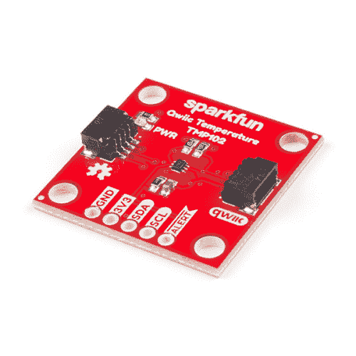

# SparkFun Qwiic 数字温度传感器- TMP102 连接指南

> 原文：<https://learn.sparkfun.com/tutorials/sparkfun-qwiic-digital-temperature-sensor---tmp102-hookup-guide>

## 介绍

我们都想知道温度，对吗？有了 [SparkFun 数字温度传感器- TMP102 (Qwiic)](https://www.sparkfun.com/products/16304) ，我们让这一切变得尽可能简单。在原来的[数字温度传感器分线点 TMP102](https://www.sparkfun.com/products/13314) 的基础上，我们增加了 Qwiic 连接器，将这个坏男孩纳入我们的即插即用 [Qwiic 生态系统](https://www.sparkfun.com/qwiic)，使电路板在 1“x1”处稍微大一点，并增加了地址跳线，而不是断开地址引脚。让我们尽情享受吧！

 

将**添加到您的[购物车](https://www.sparkfun.com/cart)中！**

 **### [【spark fun 数字温度传感器- TMP102 (Qwiic)](https://www.sparkfun.com/products/16304)

[Out of stock](https://learn.sparkfun.com/static/bubbles/ "out of stock") SEN-16304

SparkFun TMP102 Qwiic 是一款易于使用的数字温度传感器，配有几个 Qwiic 连接器，便于 I2…

$6.951[Favorited Favorite](# "Add to favorites") 9[Wish List](# "Add to wish list")** **[https://www.youtube.com/embed/arC_nQO6koM/?autohide=1&border=0&wmode=opaque&enablejsapi=1](https://www.youtube.com/embed/arC_nQO6koM/?autohide=1&border=0&wmode=opaque&enablejsapi=1)

### 所需材料

要跟随本教程，您将需要以下材料。你可能不需要所有的东西，这取决于你拥有什么。将它添加到您的购物车，通读指南，并根据需要调整购物车。**