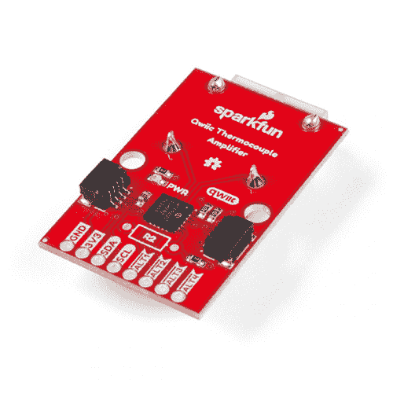
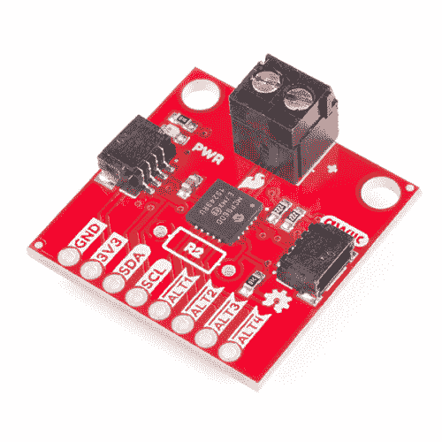

# SparkFun Qwiic 热电偶连接指南

> 原文：<https://learn.sparkfun.com/tutorials/sparkfun-qwiic-thermocouple-hookup-guide>

## 介绍

你问过自己多少次，“自我？我如何既测量环境温度又测量那边的温度，并设置温度限制来触发中断，这样我就不必不断地轮询 I ² C？我怎样才能让它变得尽可能简单？”我们已经得到了你的答案。SparkFun 有 2 个新的热电偶放大器板——[spark fun Qwiic 热电偶- PCC](https://www.sparkfun.com/products/16294) 和 [SparkFun Qwiic 热电偶-螺丝端子](https://www.sparkfun.com/products/16295)；两者均以 0.0625°C 的分辨率和 1.5°C 的精度(最差情况)实现上述所有功能。这些板可以接受 K 型热电偶，其温度范围为-200°C 至 1350°C。此外，MCP9600 具有四个针对这些中断触发器的板载温度警报，并且能够进入备用工作模式以节省功耗。

让我们深入研究一下，看看这一切是如何工作的！

 

将**添加到您的[购物车](https://www.sparkfun.com/cart)中！**

 **### [【spark fun Qwiic 热电偶放大器- MCP9600 (PCC 连接器)](https://www.sparkfun.com/products/16294)

[Out of stock](https://learn.sparkfun.com/static/bubbles/ "out of stock") SEN-16294

MCP9600 分支是一款高精度热电偶放大器，配有 PCC 连接器和 I2C 接口，可通过…

$29.951[Favorited Favorite](# "Add to favorites") 5[Wish List](# "Add to wish list")**** 

将**添加到您的[购物车](https://www.sparkfun.com/cart)中！**

 **### [【spark fun Qwiic 热电偶放大器-MCP 9600](https://www.sparkfun.com/products/16295)

[In stock](https://learn.sparkfun.com/static/bubbles/ "in stock") SEN-16295

MCP9600 Breakout 是一款高精度热电偶放大器，配有螺丝端子和 I2C 接口，可通过…

$22.502[Favorited Favorite](# "Add to favorites") 4[Wish List](# "Add to wish list")**** ****[https://www.youtube.com/embed/gcJprAj3KLA/?autohide=1&border=0&wmode=opaque&enablejsapi=1](https://www.youtube.com/embed/gcJprAj3KLA/?autohide=1&border=0&wmode=opaque&enablejsapi=1)

### 所需材料

要跟随本教程，您将需要以下材料。你可能不需要所有的东西，这取决于你拥有什么。将它添加到您的购物车，通读指南，并根据需要调整购物车。****