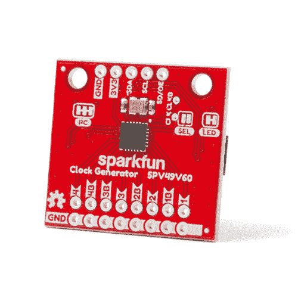

# SparkFun 时钟发生器 5P49V60 (Qwiic)连接指南

> 原文：<https://learn.sparkfun.com/tutorials/sparkfun-clock-generator-5p49v60-qwiic-hookup-guide>

## 介绍

[SparkFun 时钟发生器 5P49V60 分线板](https://www.sparkfun.com/products/15734)使用单个参考时钟在各种不同的信号类型中提供广泛的可定制频率。四路(单输出)时钟输出可以产生 1MHz-200MHz 的频率，八路(差分输出)时钟输出可以产生 1MHz-350MHz 的频率。频率的许多属性可以通过 I ² C 使用 SparkFun Arduino 库在代码中操作。SparkFun 时钟发生器也有*四个*可编程内存库，以便在没有微控制器的情况下在项目中独立运行。该连接指南将介绍 SparkFun 时钟发生器的所有可用功能，并给出该板上确切内容的硬件概要。

 

将**添加到您的[购物车](https://www.sparkfun.com/cart)中！**

 **### 

[Only 4 left!](https://learn.sparkfun.com/static/bubbles/ "only 4 left!") BOB-15734

SparkFun 时钟发生器 5P49V60 分线板提供了广泛的自定义频率和信号类型使用一个单一的…

$29.95[Favorited Favorite](# "Add to favorites") 3[Wish List](# "Add to wish list")** **[https://www.youtube.com/embed/4lshyzbbDG0/?autohide=1&border=0&wmode=opaque&enablejsapi=1](https://www.youtube.com/embed/4lshyzbbDG0/?autohide=1&border=0&wmode=opaque&enablejsapi=1)

### 所需材料

要跟随本教程，您将需要以下材料。你可能不需要所有的东西，这取决于你拥有什么。例如，我选择 RedBoard Qwiic 作为简单的演示，但您可以使用任何微控制器。将它添加到您的购物车，通读指南，并根据需要调整购物车。**