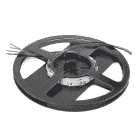
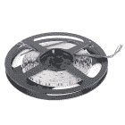
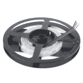
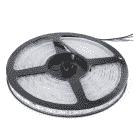

# 不可寻址的 RGB LED 灯条连接指南

> 原文：<https://learn.sparkfun.com/tutorials/non-addressable-rgb-led-strip-hookup-guide>

## 介绍

**Note:** This tutorial is to control the 12V non-addressable RGB LED strips. If you are using an addressable LED strip (i.e. [WS2812](https://learn.sparkfun.com/tutorials/ws2812-breakout-hookup-guide) or [APA102](https://learn.sparkfun.com/tutorials/apa102-addressable-led-hookup-guide)), you will need to use a different power supply and a micrcontroller to control the LEDs.

使用不可寻址的 LED 灯条为您的项目增添色彩！如果你想为你的道具、汽车、鱼缸或者你家橱柜下的照明添加统一的照明，这些是完美的。

 

将**添加到您的[购物车](https://www.sparkfun.com/cart)中！**

### [【LED RGB 光带(1m)](https://www.sparkfun.com/products/12021)

[In stock](https://learn.sparkfun.com/static/bubbles/ "in stock") COM-12021

这些是裸露的不可寻址的 1 米长 RGB LED 条，每米装有 60 个 5060 LEDs。因为这些是裸的…

$10.951[Favorited Favorite](# "Add to favorites") 9[Wish List](# "Add to wish list")**** 

将**添加到您的[购物车](https://www.sparkfun.com/cart)中！**

### [【LED RGB 光带(5m)](https://www.sparkfun.com/products/12022)

[17 available](https://learn.sparkfun.com/static/bubbles/ "17 available") COM-12022

这些是裸露的不可寻址的 5 米长 RGB LED 条，每米装有 60 5060 个 LED，即 300 个 LED。作为…

$53.50 $45.482[Favorited Favorite](# "Add to favorites") 6[Wish List](# "Add to wish list")**** 

### [【LED RGB 条封(1m)](https://www.sparkfun.com/products/retired/12023)

[Retired](https://learn.sparkfun.com/static/bubbles/ "Retired") COM-12023

一去不复返的日子，你必须担心硅耐候分裂和打破你！这些是密封的非…

1 **Retired**[Favorited Favorite](# "Add to favorites") 6[Wish List](# "Add to wish list") 

### [【LED RGB 密封条(5m)](https://www.sparkfun.com/products/retired/12024)

[Retired](https://learn.sparkfun.com/static/bubbles/ "Retired") COM-12024

一去不复返的日子，你必须担心硅防水分裂和打破你！这些是密封的非广告…

1 **Retired**[Favorited Favorite](# "Add to favorites") 4[Wish List](# "Add to wish list")**** ****[https://www.youtube.com/embed/c5QywuljpHc/?autohide=1&border=0&wmode=opaque&enablejsapi=1](https://www.youtube.com/embed/c5QywuljpHc/?autohide=1&border=0&wmode=opaque&enablejsapi=1)

### 所需材料

要跟随本教程，您将需要以下材料。左侧的部分愿望列表是针对 Arduino 的基本连接。它不包括电位计和按钮。右侧的完整愿望列表是针对附加功能的完整电路。你可能不需要所有的东西，这取决于你拥有什么。将它添加到您的购物车，通读指南，并根据需要调整购物车。****