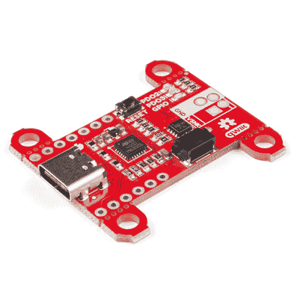

# 配电板- USB-C (Qwiic)连接指南

> 原文：<https://learn.sparkfun.com/tutorials/power-delivery-board---usb-c-qwiic-hookup-guide>

## 介绍

USB Type-C 给 USB 标准带来了两个重大变化。可逆连接器消除了每次都试图以正确的方式插入连接器的问题。第二个主要变化是允许灵活地使用 USB 电源，USB 电压可以在 5V 和 20V 之间的任何地方调节，最高功率为 100W。 [SparkFun 功率传输板](https://www.sparkfun.com/products/15801)利用 STMicroelectronics stusb 4500 的独立控制器，利用功率传输标准。控制器完成了电源协商的所有繁重工作，并提供了一种通过 I ² C 进行配置的简单方法

 

将**添加到您的[购物车](https://www.sparkfun.com/cart)中！**

 **### [【spark fun 电源传输板- USB-C (Qwiic)](https://www.sparkfun.com/products/15801)

[Out of stock](https://learn.sparkfun.com/static/bubbles/ "out of stock") DEV-15801

SparkFun 功率传输板提供 5-20V 输入，产生高达 100W 的功率，因此您可以使用相同的功率和

$26.954[Favorited Favorite](# "Add to favorites") 38[Wish List](# "Add to wish list")** **[https://www.youtube.com/embed/vA1g3bFdDzo/?autohide=1&border=0&wmode=opaque&enablejsapi=1](https://www.youtube.com/embed/vA1g3bFdDzo/?autohide=1&border=0&wmode=opaque&enablejsapi=1)

### 所需材料

要遵循本指南，您需要以下材料。你可能不需要所有的东西，这取决于你有什么。将它添加到您的购物车，通读指南，并根据需要调整购物车。**