# Qwiic Pro 微型 USB-C (ATmega32U4)连接指南

> 原文：<https://learn.sparkfun.com/tutorials/qwiic-pro-micro-usb-c-atmega32u4-hookup-guide>

## 介绍

**Heads up!** This is for the **Qwiic Pro Micro USB-C (ATmega32U4)** version. If you are looking for information about hardware on the *Pro Micros with the micro-b USB connector*, make sure to check out the older [Pro Micro & Fio V3 Hookup Guide](https://learn.sparkfun.com/tutorials/pro-micro--fio-v3-hookup-guide).

SparkFun Qwiic Pro Micro USB C 是一款非常酷的小型开发板。这是一个兼容 Arduino 的微型微控制器，它在一个芯片上实现了老 [Arduino Unos](https://www.sparkfun.com/products/11021) 、 [Duemilanoves](https://www.sparkfun.com/products/retired/666) 和 Diecimeillas 做梦也想不到的功能:*真正的 USB 功能*。在本教程中，我们将检查更新的 Qwiic Pro Micro，并通过几个例子让你开始！

[](https://www.sparkfun.com/products/15795) 

将**添加到您的[购物车](https://www.sparkfun.com/cart)中！**

### [【spark fun Qwiic Pro Micro-USB-C(atmega 32 u 4)](https://www.sparkfun.com/products/15795)

[In stock](https://learn.sparkfun.com/static/bubbles/ "in stock") DEV-15795

SparkFun Qwiic Pro Micro 在小型化的 Arduino bo 上增加了一个重置按钮、Qwiic 连接器、USB-C 和齿形垫…

$21.507[Favorited Favorite](# "Add to favorites") 46[Wish List](# "Add to wish list")** **[https://www.youtube.com/embed/buwOagzAQ5U/?autohide=1&border=0&wmode=opaque&enablejsapi=1](https://www.youtube.com/embed/buwOagzAQ5U/?autohide=1&border=0&wmode=opaque&enablejsapi=1)

### 所需材料

要完成本教程，您至少需要以下材料。你可能不需要所有的东西，这取决于你拥有什么。将它添加到您的购物车，通读指南，并根据需要调整购物车。

[](https://www.sparkfun.com/products/15795) 

将**添加到您的[购物车](https://www.sparkfun.com/cart)中！**

### [【spark fun Qwiic Pro Micro-USB-C(atmega 32 u 4)](https://www.sparkfun.com/products/15795)

[In stock](https://learn.sparkfun.com/static/bubbles/ "in stock") DEV-15795

SparkFun Qwiic Pro Micro 在小型化的 Arduino bo 上增加了一个重置按钮、Qwiic 连接器、USB-C 和齿形垫…

$21.507[Favorited Favorite](# "Add to favorites") 46[Wish List](# "Add to wish list")****[](https://www.sparkfun.com/products/15425) 

将**添加到您的[购物车](https://www.sparkfun.com/cart)中！**

### [可逆 USB A 转 C 线- 0.8m](https://www.sparkfun.com/products/15425)

[15 available](https://learn.sparkfun.com/static/bubbles/ "15 available") CAB-15425

这些 0.8 米电缆稍作修改，允许它们插入其端口，而不管它们在…

$5.502[Favorited Favorite](# "Add to favorites") 5[Wish List](# "Add to wish list")**** ****### 工具

当使用电镀通孔焊盘时，您需要一个烙铁、焊料和[通用焊接附件](https://www.sparkfun.com/categories/49)来实现安全连接。

[](https://www.sparkfun.com/products/14456) 

将**添加到您的[购物车](https://www.sparkfun.com/cart)中！**

### [【烙铁- 60W(可调温度)](https://www.sparkfun.com/products/14456)

[In stock](https://learn.sparkfun.com/static/bubbles/ "in stock") TOL-14456

当你不想倾家荡产，但又需要一个可靠的烙铁时，这个可调节温度的烙铁是一个很好的工具…

$16.5016[Favorited Favorite](# "Add to favorites") 43[Wish List](# "Add to wish list")****[](https://www.sparkfun.com/products/9163) 

将**添加到您的[购物车](https://www.sparkfun.com/cart)中！**

### [无铅焊料- 15 克管](https://www.sparkfun.com/products/9163)

[In stock](https://learn.sparkfun.com/static/bubbles/ "in stock") TOL-09163

这是你的无铅焊料的基本管，带有不干净的水溶性树脂芯。0.031 英寸规格，15 克

$3.954[Favorited Favorite](# "Add to favorites") 14[Wish List](# "Add to wish list")**** ****#### 原型配件

根据您的设置，您可能希望使用 IC 挂钩进行临时连接。但是，您可能需要焊接接头引脚，将器件连接到电镀通孔，以实现安全连接。

[](https://www.sparkfun.com/products/12002) 

将**添加到您的[购物车](https://www.sparkfun.com/cart)中！**

### [【试验板-不干胶(白色)](https://www.sparkfun.com/products/12002)

[In stock](https://learn.sparkfun.com/static/bubbles/ "in stock") PRT-12002

这是你的尝试和真正的白色无焊试验板。它有 2 条电源总线，10 列，30 行，总共 400 个连接…

$5.5048[Favorited Favorite](# "Add to favorites") 93[Wish List](# "Add to wish list")****[](https://www.sparkfun.com/products/116) 

将**添加到您的[购物车](https://www.sparkfun.com/cart)中！**

### [破开头球——直击](https://www.sparkfun.com/products/116)

[In stock](https://learn.sparkfun.com/static/bubbles/ "in stock") PRT-00116

一排标题-打破适应。40 个引脚，可切割成任何尺寸。用于定制 PCB 或通用定制接头。

$1.7520[Favorited Favorite](# "Add to favorites") 133[Wish List](# "Add to wish list")****[](https://www.sparkfun.com/products/9741) 

将**添加到您的[购物车](https://www.sparkfun.com/cart)中！**

### [带猪尾的 IC 钩](https://www.sparkfun.com/products/9741)

[In stock](https://learn.sparkfun.com/static/bubbles/ "in stock") CAB-09741

这些是高质量的 IC 测试钩，带有一根公连接线。这些有两个挂钩，而不是一个挂钩…

$5.5010[Favorited Favorite](# "Add to favorites") 30[Wish List](# "Add to wish list")****[](https://www.sparkfun.com/products/14322) 

将**添加到您的[购物车](https://www.sparkfun.com/cart)中！**

### [光子可堆叠接头- 12 针](https://www.sparkfun.com/products/14322)

[In stock](https://learn.sparkfun.com/static/bubbles/ "in stock") PRT-14322

这些可堆叠的头部可以与粒子光子和光子原盾板一起工作。每个标题增加了一个伟大的数据…

$0.75[Favorited Favorite](# "Add to favorites") 5[Wish List](# "Add to wish list")******** ********对于那些想利用 Qwiic 功能设备的人来说，你需要一根 Qwiic 电缆。

[](https://www.sparkfun.com/products/15081) 

将**添加到您的[购物车](https://www.sparkfun.com/cart)中！**

### [SparkFun Qwiic 线缆套件](https://www.sparkfun.com/products/15081)

[In stock](https://learn.sparkfun.com/static/bubbles/ "in stock") KIT-15081

为了更容易上手，我们用 50 毫米到 500 毫米的各种 Qwiic 电缆组装了 Qwiic 电缆套件…

$8.9516[Favorited Favorite](# "Add to favorites") 58[Wish List](# "Add to wish list")****[](https://www.sparkfun.com/products/14427) 

将**添加到您的[购物车](https://www.sparkfun.com/cart)中！**

### [Qwiic 线缆- 100mm](https://www.sparkfun.com/products/14427)

[In stock](https://learn.sparkfun.com/static/bubbles/ "in stock") PRT-14427

这是一条 100 毫米长的 4 芯电缆，带有 1 毫米 JST 端接。它旨在将支持 Qwiic 的组件连接在一起…

$1.50[Favorited Favorite](# "Add to favorites") 32[Wish List](# "Add to wish list")****[](https://www.sparkfun.com/products/14429) 

将**添加到您的[购物车](https://www.sparkfun.com/cart)中！**

### [Qwiic 线缆- 500mm](https://www.sparkfun.com/products/14429)

[In stock](https://learn.sparkfun.com/static/bubbles/ "in stock") PRT-14429

这是一根 500mm 长的 4 芯电缆，带有 1mm JST 端接。它旨在将支持 Qwiic 的组件连接在一起…

$1.951[Favorited Favorite](# "Add to favorites") 25[Wish List](# "Add to wish list")****[](https://www.sparkfun.com/products/14425) 

将**添加到您的[购物车](https://www.sparkfun.com/cart)中！**

### [Qwiic 电缆-试验板跳线(4 针)](https://www.sparkfun.com/products/14425)

[In stock](https://learn.sparkfun.com/static/bubbles/ "in stock") PRT-14425

这是一根跳线适配器电缆，一端带有一个 Qwiic JST 母接头，另一端带有一个试验板连接…

$1.50[Favorited Favorite](# "Add to favorites") 34[Wish List](# "Add to wish list")******** ********### 推荐阅读

如果您不熟悉 Qwiic 系统，我们建议您阅读此处的[以了解概述](https://www.sparkfun.com/qwiic)，如果您决定利用 Qwiic 连接器。

| [](https://www.sparkfun.com/qwiic) |
| *[Qwiic 连接系统](https://www.sparkfun.com/qwiic)* |

如果你不熟悉下面的教程，我们也建议你看一看。

[](https://learn.sparkfun.com/tutorials/serial-communication) [### 串行通信](https://learn.sparkfun.com/tutorials/serial-communication) Asynchronous serial communication concepts: packets, signal levels, baud rates, UARTs and more 100[](https://learn.sparkfun.com/tutorials/what-is-an-arduino) [### 什么是 Arduino？](https://learn.sparkfun.com/tutorials/what-is-an-arduino) What is this 'Arduino' thing anyway? This tutorials dives into what an Arduino is and along with Arduino projects and widgets.[Favorited Favorite](# "Add to favorites") 50[](https://learn.sparkfun.com/tutorials/installing-arduino-ide) [### 安装 Arduino IDE](https://learn.sparkfun.com/tutorials/installing-arduino-ide) A step-by-step guide to installing and testing the Arduino software on Windows, Mac, and Linux.[Favorited Favorite](# "Add to favorites") 16

## 硬件概述

在我们开始安装和使用 Qwiic Pro Micro 之前，让我们快速查看一下电路板——检查它的输入、输出和其他硬件特性。

### 旧学校到新学校

Qwiic Pro Micro USBC 是原始 Pro Micro 的修订版。总的来说，它在功能上与以前的版本相同。该板与原来的 Pro Micro 尺寸相同，但我们通过缩小板上的一些组件增加了一些附加功能。您将注意到的主板的主要变化包括:

*   复原按钮
*   USB C
*   齿形垫
*   Qwiic 连接器
*   AP2112 3.3V 电压调节器

重置按钮的好处是快速重置主板或将其置于引导模式，而无需取出一根跳线。USB 微型 b 连接器已被 USB C 型连接器取代。通孔焊盘有[堞形边缘](https://learn.sparkfun.com/tutorials/how-to-solder-castellated-mounting-holes/)用于每个引脚，以在您的项目中增加一个较低的轮廓，如果您决定在生产期间将其构建到另一个组件中。最后，在电路板底部安装了一个 Qwiic 连接器，以便轻松添加支持 Qwiic 的 I ² C 器件。

| [](https://www.sparkfun.com/products/12640?_ga=2.255509896.1441134867.1577121511-1728962999.1561997726) | [](https://www.sparkfun.com/products/15795) |
| *旧款 5V/16MHz
Pro Micro* | *更新的 5V/16 MHz
Qwiic Pro Micro USB C* |

你可能没有注意到的一个细微差别是，旧的 Pro Micro 使用了 MIC5219，它能够处理 16VDC 的最大电压输入。新的 Qwiic Pro Micro 使用 AP2112 3.3V 电压调节器，可以处理最大 6V 的**。Qwiic Pro Micro 的输出电流略高，峰值约为 600 毫安。你需要确保使用一个[合适的电压调节器和组件](https://learn.sparkfun.com/tutorials/beginner-parts-kit-identification-guide#voltage-regulators)并将电压降下来。**

如需了解更多有关两种板之间差异的信息，请务必调出两种板的原理图，并阅读下文！

### 引脚排列

Qwiic Pro Micro 的所有 I/O 和电源引脚都被分成两个平行的接头。一些引脚用于电源输入或输出，其他引脚是专用的 I/O 引脚。此外，I/O 引脚可以具有特殊功能，如模拟输入。这是一张地图，显示了哪个引脚在哪里，以及它可能具有哪些特殊的硬件功能:

[](https://cdn.sparkfun.com/assets/learn_tutorials/1/1/1/4/QwiicProMicroUSB-C_ATmega32U4_Graphical_Datasheet.png)*Click on image for a closer view*

### 力量

有多种电源和电源相关的网络连接到连接器和通孔焊盘。每个衬垫具有齿形边缘。主板的背面也有用于供电的 USB 引脚。

| [](https://cdn.sparkfun.com/assets/learn_tutorials/1/1/1/4/Qwiic_Pro_Micro_C-Power.png) | [](https://cdn.sparkfun.com/assets/learn_tutorials/1/1/1/4/Qwiic_Pro_Micro_C_Back_Power.png) |
| *齿形电源和复位引脚* | *USB 电源引脚* |

这些蚊帐包括以下内容:

*   **V** 是 USB 连接器提供的电压。
*   **RAW** 是 Qwiic Pro Micro 的未调节电压输入。如果电路板通过 USB 供电(即 **V** ，此引脚的电压约为 4.8V (USB 的 5V 减去肖特基二极管压降)。另一方面，如果电路板由外部供电，通过此引脚，施加的电压最高可达 **6V** 。
*   **5V** 是供给板载 ATmega32U4 的电压。该电压将取决于您是否将跳线设置为 **5V(默认)**或 **3.3V** 。
    *   当跳线设置为 5V 时，这是施加于 RAW 引脚的电压。如果您将 [5V 设备连接到 I/O](https://learn.sparkfun.com/tutorials/logic-levels) ，我们建议使用干净的 5V 电源。如果电路板通过“RAW”引脚(或 USB)供电，该引脚可用作**输出**，为其他器件提供 5V 电压。
    *   当跳线设置为 3.3V 时，输出为 3.3V。如果电路板通过“RAW”引脚(或 USB)供电，此引脚可用作**输出**，为其他器件提供 3.3V 电压。
*   **RST** 可用于**重启**qw IIC Pro Micro。有一个内置的重置按钮来重置 Pro Micro。但是，如果您需要从外部访问该 pin，则该 pin 已断开。此引脚被一个 10k &欧姆拉高；电路板上的电阻器，并且是**低电平有效**，因此它必须连接到地以启动复位。Qwiic Pro Micro 将保持“关闭”状态，直到 reset 线被拉回到高电平。
*   **GND** 当然是系统的公共地电压(0V 基准电压)。

#### I/O 引脚

Qwiic Pro Micro 将 I/O 引脚连接到电路板边缘的电镀通孔焊盘。每个焊盘也是城堡形的。在背面，有额外的引脚连接到 USB 数据引脚。

| [](https://cdn.sparkfun.com/assets/learn_tutorials/1/1/1/4/Qwiic_Pro_Micro_C-IO_Pins.png) | [](https://cdn.sparkfun.com/assets/learn_tutorials/1/1/1/4/Qwiic_Pro_Micro_C-USB_Pins.jpg) |
| *齿形 I/O PTH 焊盘* | *USB 接口* |

Pro Micro 的 I/O 引脚共有 18 个，具有多种功能。每个引脚都可以用作**数字输入或输出**，用于闪烁 led 或读取按钮按压。Arduino IDE 通过 0 到 21 之间的整数值引用这些引脚。(A0-A3 引脚可以使用其模拟或数字引脚编号进行数字参考)。

九个引脚以[模数转换器(ADC)](https://learn.sparkfun.com/tutorials/analog-to-digital-conversion)为特色，可用作**模拟输入**。这些对于使用`analogRead([pin])`功能读取电位计或其他模拟设备非常有用。

有五个引脚具有[脉冲宽度调制(PWM)](https://learn.sparkfun.com/tutorials/pulse-width-modulation) 功能，这允许使用`analogWrite([pin], [value])`功能的**模拟输出**的形式。这些引脚在板上用方形焊盘周围的一个模糊的白色圆圈表示。

还有硬件 [UART(串行)](https://learn.sparkfun.com/tutorials/serial-communication)、 [I ² C](https://learn.sparkfun.com/tutorials/i2c) 和 [SPI](https://learn.sparkfun.com/tutorials/serial-peripheral-interface-spi) 引脚可用。这些器件可用于与数字器件接口，如串行 LCD、XBees、IMU 和其它串行传感器。

Pro Micro 有五个[外部中断](http://arduino.cc/en/Reference/attachInterrupt)，允许您在引脚变高或变低(或同时变高和变低)时立即触发一个功能。如果将一个中断附加到一个使能中断的引脚，需要知道该引脚触发的具体中断:引脚 3 映射到中断 0 (INT0)，引脚 2 是中断 1 (INT1)，引脚 0 是中断 2 (INT2)，引脚 1 是中断 3 (INT3)，引脚 7 是中断 4 (INT6)。

#### 板载 led

Pro Micro 上有三个 led。一个红色 LED 指示**电源**是否存在。另外两个 led 有助于指示数据何时通过 USB 传输。黄色 LED 表示 USB 数据进入 Pro Micro 的(RX)*，绿色 LED 表示 USB 数据输出(TX)。*

[](https://cdn.sparkfun.com/assets/learn_tutorials/1/1/1/4/Qwiic_Pro_Micro_C-LEDs.png)

### 针织套衫

电路板背面有一个跳线，可以选择系统电压。板的默认电压默认为 5V。通过[切割跳线焊盘](https://learn.sparkfun.com/tutorials/how-to-work-with-jumper-pads-and-pcb-traces#cutting-a-trace-between-jumper-pads)并在中间和右侧跳线焊盘之间添加焊料，系统电压将被设置为 3.3V。

[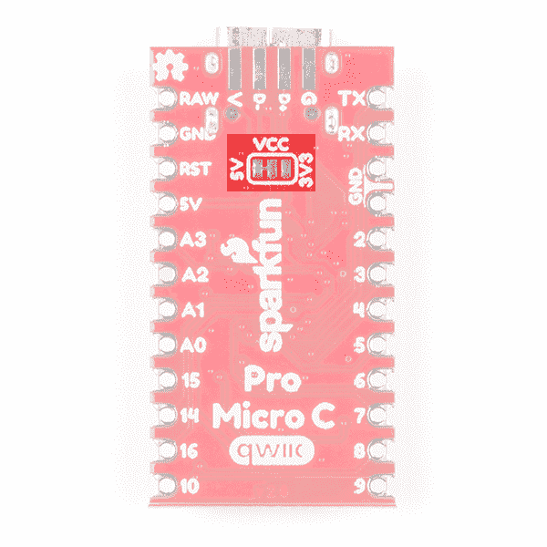](https://cdn.sparkfun.com/assets/learn_tutorials/1/1/1/4/Qwiic_Pro_Micro_C-Jumpers.jpg)

### 电路板尺寸

该板的尺寸为 **1.30 英寸 x 0.70 英寸**。下图中没有包括 PCB 厚度，为 **0.8mm** 。这比大多数用于 SparkFun 原创设计的多氯联苯还要薄。

[](https://cdn.sparkfun.com/assets/learn_tutorials/1/1/1/4/SparkFun_Qwiic_Pro_Micro_C-Board_Dimensions.png)

### 如何为 Qwiic Pro Micro USB C 供电

由于 Pro Micro 的主要特点是其固有的 USB 功能，最常见的供电方式是通过 **USB** 。如果跳线设置为默认 5V，Qwiic Pro Micro 将直接从 USB 总线供电。如果跳线设置为 3.3V，主板会将来自 USB 的 5V 电源下调至 3.3V。USB 电缆的另一端可以连接到计算机、USB 集线器、USB 电池或 USB 墙上适配器，这样(在大多数情况下)可以提供更多电源。

或者，如果你的 Qwiic Pro Micro 生活在野外，USB 电缆够不着，它可以通过' **RAW** 或' **5V** 引脚供电。进入这些引脚的电源将为 Qwiic Pro Micro 提供电源。为了安全起见，它不应该高于 6V。如果跳线设置为 3.3V，电压将下调至 3.3V

确切地说，你如何[为你的项目](https://learn.sparkfun.com/tutorials/how-to-power-a-project)提供动力取决于你和你项目的需求。如果你在做电池供电的东西，你可以用一个 LiPo boost 转换器给电路板提供 5V 的电源。或者你可能想将跳线设置为 3.3V，这可以由一个[脂电池](https://learn.sparkfun.com/tutorials/battery-technologies/lithium-polymer)或几个[碱性电池](https://learn.sparkfun.com/tutorials/battery-technologies/alkaline)供电。请务必查看以下教程以获取更多信息。

[](https://learn.sparkfun.com/tutorials/battery-technologies) [### 电池技术

#### 2013 年 2 月 6 日](https://learn.sparkfun.com/tutorials/battery-technologies) The basics behind the batteries used in portable electronic devices: LiPo, NiMH, coin cells, and alkaline.[Favorited Favorite](# "Add to favorites") 50[](https://learn.sparkfun.com/tutorials/how-to-power-a-project) [### 如何为项目提供动力

#### 2013 年 2 月 7 日](https://learn.sparkfun.com/tutorials/how-to-power-a-project) A tutorial to help figure out the power requirements of your project.[Favorited Favorite](# "Add to favorites") 67

## 硬件连接

Qwiic Pro Micro 没有接头引脚，允许用户灵活地将任何类型的 0.1 英寸接头连接到电路板。对于 I/O 引脚的临时连接，您可以使用 IC 挂钩来测试引脚。然而，你需要[将你选择的接头或电线焊接到电路板](https://learn.sparkfun.com/tutorials/how-to-solder-through-hole-soldering)上，以实现安全连接。对于高级用户来说，你也可以设计一个 PCB，利用[齿形边缘](https://learn.sparkfun.com/tutorials/how-to-solder-castellated-mounting-holes/all#introduction)来降低外形。根据您的个人喜好，这里有几个连接到 pad 的教程。

[](https://learn.sparkfun.com/tutorials/how-to-solder-through-hole-soldering) [### 如何焊接:通孔焊接

#### 2013 年 9 月 19 日](https://learn.sparkfun.com/tutorials/how-to-solder-through-hole-soldering) This tutorial covers everything you need to know about through-hole soldering.[Favorited Favorite](# "Add to favorites") 70[](https://learn.sparkfun.com/tutorials/working-with-wire) [### 使用导线

#### 2013 年 2 月 8 日](https://learn.sparkfun.com/tutorials/working-with-wire) How to strip, crimp, and work with wire.[Favorited Favorite](# "Add to favorites") 50[](https://learn.sparkfun.com/tutorials/how-to-solder-castellated-mounting-holes) [### 如何焊接:堞形安装孔

#### 2015 年 5 月 12 日](https://learn.sparkfun.com/tutorials/how-to-solder-castellated-mounting-holes) Tutorial showing how to solder castellated holes (or castellations). This might come in handy if you need to solder a module or PCB to another PCB. These castellations are becoming popular with integrated WiFi and Bluetooth modules.[Favorited Favorite](# "Add to favorites") 19**Note:** For advanced users taking advantage of the castellated edges, you can design a board with the Qwiic Pro Micro Eagle footprint should you decide to make a keyboard using the [Cherry MX Switch](https://www.sparkfun.com/categories/tags/cherry)!

[GitHub SparkFun Eagle Library: SparkFun-Boards.lbr](https://github.com/sparkfun/SparkFun-Eagle-Libraries)

为了给主板供电和上传，你只需要一根 USB C 线连接到你的电脑上。就本教程的范围而言，您将会看到示例 1。

[](https://cdn.sparkfun.com/assets/learn_tutorials/1/1/1/4/Qwiic-Pro-Micro-C-Atmega32U4-USB-Cable.jpg)

为了利用评估板的 HID，我们建议使用某种输入。模拟操纵杆提供了一些输入来测试示例 2 中的键盘和鼠标。

[](https://cdn.sparkfun.com/assets/learn_tutorials/1/1/1/4/Fritzing_Atmega32U4_Qwiic_Pro_Micro_Example2_Analog_Joystick_bb.jpg)[](https://cdn.sparkfun.com/assets/learn_tutorials/1/1/1/4/Qwiic-Pro-Micro-C-Atmega32U4-Breadboard-HID-Analog-Joystick.jpg)

### 支持 Qwiic 的设备

您也可以轻松地将支持 qw IC 的设备连接到 qw IC 连接器。下面是一个连接到 Qwiic Pro Micro 的距离传感器的示例。如果您的安装打开了 kiosk 的屏幕保护程序，如果有人在 VL53L1X 传感器的特定距离内，您可以使用 Qwiic Pro Micro 通过移动鼠标来唤醒它。

[](https://cdn.sparkfun.com/assets/learn_tutorials/1/1/1/4/Pro-Micro-C-Atmega32U4-Qwiic-Device-Distance-Sensor.jpg)

## 安装驱动程序(Windows)

在您的电脑和 Arduino 环境中设置 Qwiic Pro Micro 可能会很困难。按照本页提供的指导，逐步完成驱动程序安装和 Arduino 启用过程。

### [Windows 驱动安装](#windows_driver)

**Note:** On a Windows 10 OS, the driver should automatically install. You may not need to download the driver for the Atmega-32U4-based Arduino. If that is the case, you can move to [installing the board add-on](https://learn.sparkfun.com/tutorials/pro-micro--fio-v3-hookup-guide#windows_boardaddon) for the Arduino IDE.

#### 步骤 1:下载驱动程序

在插入您的主板之前，先下载驱动程序。检查 [GitHub 库](https://github.com/sparkfun/Arduino_Boards)中的最新文件。相同的驱动程序文件适用于 Pro Micro 和 Fio v3。Fio 和 Pro Micro 的驱动程序都是为 Windows 用户签名的。您可以使用下面的链接直接下载它们。

[Fio and Pro Micro Drivers (ZIP)](https://github.com/sparkfun/Arduino_Boards/archive/master.zip)

解压缩那个压缩文件，不要忘记你把它的内容放在哪里了。在这个 zip 文件中，您应该可以找到**。inf** 和**。cat** 文件，其中包含 Windows 安装 Pro Micro 的驱动程序所需的所有信息。 *sparkfun.inf* 驱动程序和 *sparkfun.cat* 数字签名目录文件将在**中找到...arduino _ Boards-master/spark fun/AVR/signed _ driver**。

#### 第二步:插上 Qwiic Pro Micro

当您最初将**插入**时，任务栏右下角会弹出一个“正在安装设备驱动软件”的气泡通知。当绿点绕着灰框转了几圈后，你可能会看到一个悲伤的泡泡，就像这样:

[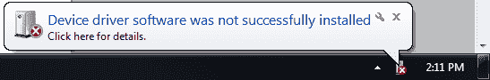](https://cdn.sparkfun.com/assets/a/c/2/9/0/523a2153757b7f407d8b4571.PNG)

不要害怕！Windows 只是不知道在哪里找到我们的驱动程序。

**Note:** Some users have experienced issues when plugging the Pro Micro into a USB 3.0 port. If you experience issues on USB 3.0 ports, try switching to use a USB 2.0 port.

#### 步骤 3:打开设备管理器

从这里开始，安装驱动程序最直接的方法是通过设备管理器。要进入设备管理器，点击**开始**按钮，然后打开**控制面板**。在控制面板中，点击**系统和维护**，然后打开**设备管理器**。

或者，你可以打开**运行提示符** (Windows 键+R)并输入‘devmgmt . MSC’然后点击 OK。

[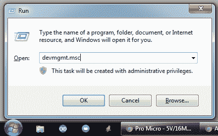](https://cdn.sparkfun.com/assets/3/3/7/7/e/523b1c4f757b7f64208b4567.PNG)

在设备管理器中，展开“其他设备”树，您会发现一个图标上带有黄色警告标志的**“USB IO 板”**。右击“USB IO 板”并选择**更新驱动软件...**。

[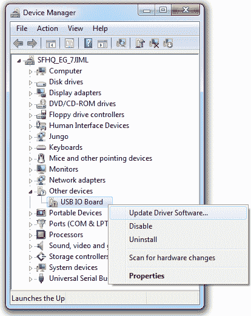](https://cdn.sparkfun.com/assets/b/e/f/1/d/523b1e59757b7f10218b4567.PNG)

这将产生一个“更新驱动软件- USB IO 板”窗口。

#### 步骤 4:查找驱动程序

在弹出的第一个窗口中，点击**‘浏览我的电脑上的驱动软件’**。在下一个窗口中，点击**‘浏览...’**搜索您刚刚下载的驱动程序。它应该是一个名为“ **Arduino_Boards-master** 的文件夹，在步骤 1 中记录的子目录中。选择“驱动程序”文件夹后，点击**确定**，然后选择**下一个**。

[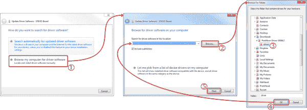](https://cdn.sparkfun.com/assets/3/d/9/4/9/523b286b757b7fed218b4568.PNG)*Click on image for a closer view.*

Windows 将尝试安装驱动程序，但在此之前会抱怨驱动程序未签名。在警告对话框中选择**“仍然安装该驱动程序软件”**是安全的。

看了几次进度条后，你应该会看到一个快乐的“Windows 已经成功更新了你的驱动软件”窗口。并且“设备管理器”应该在“**端口(COM & LPT)** 树下有一个“ **SparkFun Pro Micro (COM ##)** ”的新条目。

[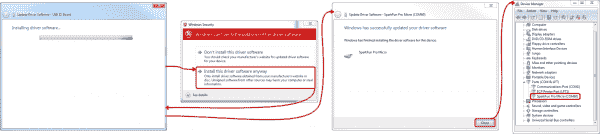](https://cdn.sparkfun.com/assets/6/4/e/5/5/523b286b757b7f03218b4568.PNG)*Click on image for a closer view.*

记下您的 Qwiic Pro Micro 分配了哪个 COM 端口。我们很快就会需要它。

## 安装驱动程序(Mac 和 Linux)

如果您使用的是 Mac 或 Linux，请按照下面的步骤让您的 Pro Micro 准备好在您的电脑上运行。我们不会在这里指名道姓，但在 Mac OS X 和 Linux 上安装 Qwiic Pro Micro 比在其他操作系统上容易得多...

当你最初将 Qwiic Pro Micro 插入 Mac 时，它会弹出一个“键盘设置助理”窗口。这源于 Qwiic Pro Micro 模拟 HID USB 设备(例如键盘和鼠标)的能力 Mac 认为你的 Pro Micro 是一个人类输入设备(它可能是！但还不是)。

[](https://cdn.sparkfun.com/assets/e/8/0/f/2/5240ada8757b7f09578b4567.png)

在这个窗口中没有什么需要配置的，所以只需点击红色的大按钮，' **X** '就可以关闭它。

这就是全部了！Qwiic Pro Micro 的 CDC(通信设备类)部分(处理 USB 到串行转换的部分)应该会自动安装在您的计算机上。

## 设置 Arduino

**Note:** If this is your first time using Arduino, please review our tutorial on [installing the Arduino IDE.](https://learn.sparkfun.com/tutorials/installing-arduino-ide)

我们仍然没有完全准备好 Arduino，但这是最后的挑战。在 Arduino IDE 中使用 Qwiic Pro Micro 之前，您需要安装主板(*。brd)文件，以便 Arduino IDE 知道如何与您的主板通信。跳转到基于您的操作系统的章节，了解如何安装板文件，以便您可以选择 **SparkFun Pro Micro，ATmega32U4 (5V，16MHz)** 。

*   [窗户](https://learn.sparkfun.com/tutorials/qwiic-pro-micro-usb-c-atmega32u4-hookup-guide#windows_boardaddon)
*   [Mac 和 Linux](https://learn.sparkfun.com/tutorials/qwiic-pro-micro-usb-c-atmega32u4-hookup-guide#mac_linux_boardaddon)

### [安装 Arduino 插件](#windows_boardaddon) 窗口

#### 使用纸板管理器

自从 Arduino 1.6.4 发布以来，向 Arduino IDE 添加第三方电路板可以通过电路板管理器轻松实现。如果您运行的是旧版本的 Arduino (v1.6.3 或更早版本)，我们建议您现在升级。和往常一样，你可以从 [arduino.cc](http://www.arduino.cc/en/Main/Software) 下载 Arduino 的最新版本。

[Download the Arduino IDE](https://www.arduino.cc/en/main/software)

首先，您需要将 Arduino IDE 板管理器指向一个自定义 URL。打开 Arduino，然后进入首选项(**文件** > **首选项**)。然后，将此 URL 粘贴到窗口底部的“其他 Board Manager URLs”文本框中:

```
https://raw.githubusercontent.com/sparkfun/Arduino_Boards/main/IDE_Board_Manager/package_sparkfun_index.json 
```

您可以通过单击窗口图标添加多个 URL，并在每行粘贴一个 URL。

[](https://cdn.sparkfun.com/assets/learn_tutorials/1/1/1/4/Installing_Arduino_Boards_Add-Ons.jpg)

单击确定。然后单击工具打开纸板管理器，将鼠标悬停在纸板选择选项卡上，然后单击纸板管理器。

[](https://cdn.sparkfun.com/assets/learn_tutorials/1/1/1/4/Arduino_Board_Manager_Pro_Micro.jpg)

在董事会管理器中搜索' **sparkfun** '。你应该看到 **SparkFun AVR 板**包出现。点击安装，稍等片刻，所有的 ***。您需要的 brd** 文件应该已经安装，由打印在软件包旁边的蓝色“installed”指示。

[](https://cdn.sparkfun.com/assets/learn_tutorials/1/1/1/4/Arduino_Board_Manager_SparkFun_AVR_Boards.jpg)

你现在应该可以上传代码到一些兼容 SparkFun Arduino 的产品，包括 **SparkFun Pro Micro** 。

[](https://cdn.sparkfun.com/assets/learn_tutorials/1/1/1/4/Arduino_Board_Selection_Pro_Micro.jpg)

请注意，Pro Micro 有两个选项:8MHz 和 16MHz。非常重要的是，你要**选择与你的主板的电压和速度**相匹配的 Pro Micro 选项。这个应该列在**工具** > **处理器**下面。对于 Qwiic Pro Micro，您需要确保选择 **ATmega32U4 (5V，16MHz)** 。

[](https://cdn.sparkfun.com/assets/learn_tutorials/1/1/1/4/Arduino_Processor_Selection.jpg)

你还应该在“**>**串口**”菜单下看到你的 Pro Micro 的 **COM 口**。选择它，并前往[示例 1](https://learn.sparkfun.com/tutorials/qwiic-pro-micro-usb-c-atmega32u4-hookup-guide#example-1-blinkies-and-hello-world) 页面，在那里我们将上传我们的第一段代码。**

#### 手动安装*。brd 文件

如果您使用的是旧版本的 Arduino IDE，并且没有访问 Arduino 板管理器的权限，那么您需要安装*。brd 以传统方式归档。

首先， [**下载这个 zip 文件夹**](https://cdn.sparkfun.com/assets/learn_tutorials/1/2/1/SparkFunBoard_Addons_Jan_16.zip) ，并将其内容解压到 Arduino sketchbook 中的**【硬件】目录**。

**Note:** These Arduino addon files only work with **Arduino 1.5** and up. If you're using an earlier version of Arduino, either update (and get some cool new features), or download [the older version of the Addon](https://cdn.sparkfun.com/assets/learn_tutorials/1/2/1/SF32u4_boards-pre-1.6.zip).

你的 Arduino 速写本呢？嗯，默认情况下，它应该在你的**主目录**中的一个“ **Arduino** ”文件夹中，但是为了仔细检查，你可以转到 Arduino 中的**文件** > **首选项**并检查“ *Sketchbook location* ”文本框。完成后，请务必关闭所有 Arduino 窗口。

[](https://cdn.sparkfun.com/assets/9/8/7/9/3/523b2e28757b7f77208b4567.png)

一旦你将该文件夹解压到 Arduino sketchbook 中的“ **hardware** ”文件夹中(你实际上可能需要创建一个硬件文件夹)，你的目录结构应该如下所示:

[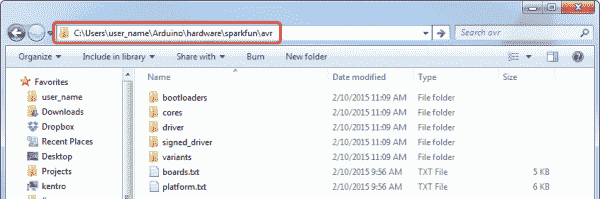](https://cdn.sparkfun.com/assets/learn_tutorials/1/2/1/32u4_windows_directory.png)

这个目录的结构很关键——它应该看起来像“**.../Arduino/hardware/[厂商]/[架构]** ，这里的`[manufacturer]`是“ **sparkfun** ”，`[architecture]`是“ **avr** ”

```
language:bash
.../Arduino/hardware/sparkfun/avr 
```

这个插件有很多功能，但其中一个最重要的文件是' **boards.txt** '，它将为您的'**工具** > **板**'菜单添加一些新条目。

为了再次检查板卡定义是否已经添加到 Arduino 中，**打开 Arduino** ，在“**工具** > **板卡**菜单下检查。“SparkFun Pro Micro”、“SparkFun FioV3”、“Qduino Mini”和其他基于 32U4 的主板应该有一些新的条目。

[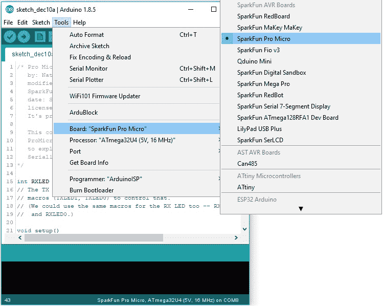](https://cdn.sparkfun.com/assets/learn_tutorials/1/2/1/SparkFun_Atmega32u4__Arduino_Board_Selection.jpg)

请注意，Pro Micro 有两个选项:8MHz 和 16MHz。非常重要的是，你要**选择与你的主板的电压和速度**相匹配的 Pro Micro 选项。这个应该列在**工具** > **处理器**下面。对于 Qwiic Pro Micro，您需要确保选择 **ATmega32U4 (5V，16MHz)** 。

[](https://cdn.sparkfun.com/assets/learn_tutorials/1/2/1/SparkFun_Atmega32u4__Arduino_Processor_Selection.jpg)

你还应该在“**>**串口**”菜单下看到你的 Pro Micro 的 **COM 口**。选择它，并前往[示例 1](https://learn.sparkfun.com/tutorials/qwiic-pro-micro-usb-c-atmega32u4-hookup-guide#example-1-blinkies-and-hello-world) 页面，在那里我们将上传我们的第一段代码。**

### [安装 Arduino 插件](#mac_linux_boardaddon) Mac 和 Linux

遵循这些指示对于在 Arduino 环境中支持 Pro Micro 至关重要！

#### 使用纸板管理器

自从 Arduino v1.6.4 发布以来，向 Arduino IDE 添加第三方电路板可以通过电路板管理器轻松实现。如果您运行的是旧版本的 Arduino (v1.6.3 或更早版本)，我们建议您现在升级。和往常一样，你可以从 [arduino.cc](http://www.arduino.cc/en/Main/Software) 下载 Arduino 的最新版本。

[Download the Arduino IDE](https://www.arduino.cc/en/main/software)

首先，您需要将 Arduino IDE 板管理器指向一个自定义 URL。打开 Arduino，然后进入首选项(**文件** > **首选项**)。然后，将此 URL 粘贴到窗口底部的“其他 Board Manager URLs”文本框中:

```
https://raw.githubusercontent.com/sparkfun/Arduino_Boards/main/IDE_Board_Manager/package_sparkfun_index.json 
```

您可以通过单击窗口图标添加多个 URL，并在每行粘贴一个 URL。

[](https://cdn.sparkfun.com/assets/learn_tutorials/3/6/5/arduino-board-manager-link.png)

单击确定。然后单击工具打开纸板管理器，将鼠标悬停在纸板选择选项卡上，然后单击纸板管理器。

[](https://cdn.sparkfun.com/assets/learn_tutorials/1/2/1/boardManager.png)

在董事会管理器中搜索' **sparkfun** '。你应该看到 **SparkFun AVR 板**包出现。单击安装，稍等片刻，所有的*。应该已经安装了您需要的 brd 文件，由打印在软件包旁边的蓝色“installed”表示。

[](https://cdn.sparkfun.com/assets/learn_tutorials/1/2/1/SFEAVR.png)

你现在应该可以上传代码到一些兼容 SparkFun Arduino 的产品，包括 Pro Micro。

[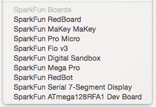](https://cdn.sparkfun.com/assets/learn_tutorials/1/2/1/SFEBoards.png)

#### 手动安装*。brd 文件

如果您使用的是旧版本的 Arduino IDE，并且没有访问 Arduino 板管理器的权限，那么您需要安装*。brd 以传统方式归档。

为了在 Arduino IDE 中使用 Pro Micro，您需要向它添加一些电路板定义文件。这就是我们在这一部分要做的事情。从 [**开始下载 Pro 微插件文件**](https://cdn.sparkfun.com/assets/learn_tutorials/1/2/1/SparkFunBoard_Addons_Jan_16.zip) 。

**Note:** These Arduino addon files only work with **Arduino 1.5** and up. If you're using an earlier version of Arduino, either update (and get some cool new features), or download [the older version of the Addon](https://cdn.sparkfun.com/assets/learn_tutorials/1/2/1/SF32u4_boards-pre-1.6.zip).

下载后，按照以下步骤在 Arduino 环境中启用 Pro Micro:

1.  附加文件是在一个 zip 文件夹中提供的，所以你需要先把文件解压出来。
2.  找到你的 **Arduino sketchbook 文件夹**。如果您不知道它在哪里，您可以通过查看 Arduino IDE 中的首选项对话框来找到您的 sketchbook。
3.  如果还没有，在你的 sketchbook 中创建一个名为“ **hardware** ”的文件夹。
4.  将在第一步中解压缩的“sparkfun”文件夹复制到“ **hardware** ”文件夹中。
    *   您的目录结构应该类似于"**.../Arduino/hardware/spark fun/AVR**。”
5.  重启 Arduino，在**工具** > **板**菜单下查看。您应该会看到一些新的选项，包括 SparkFun Pro Micro、SparkFun Fio V3 和 Qduino Mini。

如果主板可见，请选择与您的主板匹配的选项。如果你有 Pro Micro，**确保你在**工具** > **处理器**下选择了正确的运行速度和电压**！此时，选择 Pro Micro 枚举的 COM 端口。然后前往下一页，我们将上传我们的第一张草图！

## 例 1: Blinkies 和 Hello World！

Arduino 标准闪烁草图在 Pro Micro -上不会有任何可见的效果**在第 13 针**上没有 LED。事实上，板上仅有的指示灯是电源指示灯和 RX/TX 指示灯。不过，与其他 Arduino 板不同，我们可以在草图中控制 RX/TX led。所以让我们开始眨眼吧！

### 上传 RX/TX Blinky，Hello World 草图

将下面的代码复制并粘贴到 Arduino IDE 中。在**工具**中，确保选择**板卡**>**spark fun Pro Micro**和**处理器** > **ATmega32U4 (5V，16MHz)** 。另外，不要忘记选择您的主板枚举的 COM 端口。最后上传^([【1】](https://learn.sparkfun.com/tutorials/qwiic-pro-micro-usb-c-atmega32u4-hookup-guide#footnote1))到你的 Qwiic Pro Micro USB-C。

```
language:c
/* Pro Micro Test Code
   by: Nathan Seidle
   modified by: Jim Lindblom
   SparkFun Electronics
   date: September 16, 2013
   license: Public Domain - please use this code however you'd like.
   It's provided as a learning tool.

   This code is provided to show how to control the SparkFun
   ProMicro's TX and RX LEDs within a sketch. It also serves
   to explain the difference between Serial.print() and
   Serial1.print().
*/

int RXLED = 17;  // The RX LED has a defined Arduino pin
// Note: The TX LED was not so lucky, we'll need to use pre-defined
// macros (TXLED1, TXLED0) to control that.
// (We could use the same macros for the RX LED too -- RXLED1,
//  and RXLED0.)

void setup()
{
  pinMode(RXLED, OUTPUT);  // Set RX LED as an output
  // TX LED is set as an output behind the scenes

  Serial.begin(9600); //This pipes to the serial monitor
  Serial.println("Initialize Serial Monitor");

  Serial1.begin(9600); //This is the UART, pipes to sensors attached to board
  Serial1.println("Initialize Serial Hardware UART Pins");
}

void loop()
{
  Serial.println("Hello world!");  // Print "Hello World" to the Serial Monitor
  Serial1.println("Hello! Can anybody hear me?");  // Print "Hello!" over hardware UART

  digitalWrite(RXLED, LOW);   // set the RX LED ON
  TXLED0; //TX LED is not tied to a normally controlled pin so a macro is needed, turn LED OFF
  delay(1000);              // wait for a second

  digitalWrite(RXLED, HIGH);    // set the RX LED OFF
  TXLED1; //TX LED macro to turn LED ON
  delay(1000);              // wait for a second
} 
```

上传代码后，您应该看到 RX 和 TX LEDs 每秒轮流闪烁。

[](https://cdn.sparkfun.com/assets/learn_tutorials/1/1/1/4/Qwiic-Pro-Micro-C-Atmega32U4-LED-Blink.gif)

你还可以打开 [Arduino IDE 的串口监视器](https://learn.sparkfun.com/tutorials/terminal-basics/arduino-serial-monitor-windows-mac-linux)(设置为 **9600 bps** )，看到每个程序员[最喜欢的两个字短语](http://en.wikipedia.org/wiki/Hello_world_program)。

[](https://cdn.sparkfun.com/assets/learn_tutorials/1/1/1/4/Arduino_Serial_Monitor_Hello_World_ATmega32U4_Qwiic_Pro_Micro.jpg)

#### 理解草图

**RX LED**

RX LED 与 Arduino 的引脚 17 相连。您可以像控制任何其他数字 pin 一样控制它。设置为`OUTPUT`，`digitalWrite([pin], [level])`为`HIGH`关闭 LED 或`LOW`打开 LED。下面是突出显示的部分代码。

```
language:c
int RXLED = 17;  // The RX LED has a defined Arduino pin
void setup(){
  pinMode(RXLED, OUTPUT);  // Set RX LED as an output
}
.
.
.
  digitalWrite(RXLED, LOW);   // set the RX LED ON
  digitalWrite(RXLED, HIGH);    // set the RX LED OFF 
```

**TX LED**

不幸的是，TX LED 没有作为 Arduino 定义的引脚提供，所以您必须使用一对宏来控制它。`TXLED1`打开 LED，`TXLED0`关闭 LED。我们也可以对 RX LED 使用相同的宏- `RXLED1`和`RXLED0`。下面是突出显示的部分代码。

```
language:c
TXLED0; //TX LED is not tied to a normally controlled pin so a macro is needed, turn LED OFF
TXLED1; //TX LED macro to turn LED ON 
```

**串行监视器(`Serial` ) vs 硬件串行 UART ( `Serial1` )**

在该草图中，您还会注意到一对**序列**初始化语句:

```
language:c
  Serial.begin(9600); //This pipes to the serial monitor
  Serial.println("Initialize Serial Monitor");

  Serial1.begin(9600); //This is the UART, pipes to sensors attached to board
  Serial1.println("Initialize Serial Hardware UART Pins"); 
```

那个“`1`”造成了巨大的差异。想象一下 Qwiic Pro Micro 有两个独立的串行端口。不带的*`1`用于通过 USB 与电脑进行通信；这是串行监视器中可见的内容。`Serial1`端口是真正的**硬件 UART** ，你的 Qwiic Pro Micro 可以在这里与任何支持串行的硬件进行对话。*

如果你打开**串行监视器**，你应该只看到打印的`Hello world!`。`Hello! Can anybody hear me?`'正在通过硬件 UART 发送出去，这里大概没有什么在监听。这回避了一个古老的问题:“如果 Qwiic Pro Micro 在说‘你好！’通过硬件串口，没有任何东西可以听到，Qwiic Pro Micro 真的说了什么吗？"

### 为什么我的主板会重新枚举每次上传？

为了进行串行通信，Qwiic Pro Micro 模拟了一个**虚拟串行端口**。实际上，它模拟了两个不同的串行端口——一个用于引导程序，一个用于草图。因为引导加载程序和 sketch 是单独运行的。任何时候都只能看到其中一个串行端口。

当你点击 Arduino IDE 中的“上传”时，Qwiic Pro Micro 会自动重置并启动其**引导加载程序**。(bootloader 是 Pro Micro 上的一个低级程序，可以通过串行接口进行自我编程。)对于我们的操作系统来说，bootloader 看起来就像一个完全不同的设备，所以它有自己的串行端口号。在对 Qwiic Pro Micro 进行编程时，bootloader 串行端口将会打开。当草图上传完成后，bootloader 将退出，该串口将关闭，常规的 Qwiic Pro Micro 串口将打开。

归根结底，你必须对 Pro Micros 有耐心。每次你上传一个新的草图，你的操作系统都需要在你打开 COM 端口之前运行它的驱动程序。代码完成上传后，这可能需要几秒钟的时间。

* * *

[【1】](https://learn.sparkfun.com/tutorials/qwiic-pro-micro-usb-c-atmega32u4-hookup-guide#footnote1)**Windows 用户注意事项**:第一次上传草图，可能会失败，给你一个错误。最重要的是，Windows 会弹出熟悉的“*设备驱动软件未成功安装*”通知。不要让这件事太让你担心。如果出现错误，请等待大约一分钟，然后再次尝试上传。

希望第二次上传会成功，但是如果继续失败，请查看常见问题的[如何进入引导加载程序](https://learn.sparkfun.com/tutorials/pro-micro--fio-v3-hookup-guide/troubleshooting-and-faq#ts-reset)部分。Windows 需要安装我们已经为 Qwiic Pro Micro 的引导加载程序安装的相同驱动程序，但它无法在引导加载程序退出之前完成所有设置。

## 示例 2: HID 鼠标和键盘

当 Pro Micro 发布时，最具革命性的功能(就 Arduinos 而言)是其真正的 USB 功能。Pro Micro 可以被编程来模拟你能想象到的任何 USB 设备。你甚至可以对它进行编程，让它像鼠标、键盘或其他 HID 类 USB 设备一样工作。

### 什么是 **HID** ？

它是众多已定义的 USB [设备类别](http://en.wikipedia.org/wiki/USB#Device_classes)中的一种。每个 USB 设备都被分配了一个类，这个类定义了它的一般用途。这里有很多类——打印机、集线器、扬声器和网络摄像头等等，但是在这个例子中，我们将模拟 HID - **人机界面设备**。ATmega32U4 解决了 USB 硬件障碍，但我们仍然需要清除固件障碍。是时候使用一些示例代码了！我们将 HID 示例分成两部分。

*   [示例 2a:简单的 USB 键盘](https://learn.sparkfun.com/tutorials/qwiic-pro-micro-usb-c-atmega32u4-hookup-guide#keyboard)
*   [示例 2b: USB 鼠标功能](https://learn.sparkfun.com/tutorials/qwiic-pro-micro-usb-c-atmega32u4-hookup-guide#mouse)

### [例 2a:简易 USB 键盘](#keyboard)

为了模拟 USB 键盘，我们将使用`Keyboard`类。以下是该类提供的一些函数:

*   **`Keyboard.write(char)`** -该功能将通过 USB 发送单个字符。传递的字符可以是任何标准的、可打印的、ASCII 定义的字符:0-9、a-z、A-Z、空格、符号等。下面是一行示例代码:

    ```
    Keyboard.write('z') // This will send a single 'z' character to your computer.
    ```

*   **`Keyboard.print(string)`**——如果你需要执行一系列的`Keyboard.write()`，考虑只使用一个`Keyboard.print()`。这类似于`Serial.print()`——给它一串字符，它将通过 USB 发送字符流。 **`Keyboard.println(string)`** 也有定义，如果你想换行符/换行来结束你的字符串。一个例子:

    ```
    Keyboard.print("Hello, world"); // This'll send your computer an 'H', followed by 'e', followed by...
    ```

*   **`Keyboard.press(byte)`** 和 **`Keyboard.release(byte)`** 让您更精确地控制按键。他们做的正是你所期望的。一个按下按钮，另一个松开按钮。确保你释放了所有你按下的按钮，否则你会在你的电脑上遇到一些 wiggyness。

就是这样。您不需要包含任何库或任何东西，只需调用这些函数中的任何一个。这里有一个**示例草图**来尝试一下:

```
language:c
/* HID KeyBoard Example
   by: Jim Lindblom
   date: 1/12/2012
   license: MIT License - Feel free to use this code for any purpose.
   No restrictions. Just keep this license if you go on to use this
   code in your future endeavors! Reuse and share.

   This is very simplistic code that allows you to send a 'z' with
   a momentary pushbutton.
*/

#include <Keyboard.h>
int buttonPin = 9;  // Set a button to any pin

void setup()
{
  pinMode(buttonPin, INPUT);  // Set the button as an input
  digitalWrite(buttonPin, HIGH);  // Pull the button high

  Keyboard.begin(); //Init keyboard emulation
}

void loop()
{
  if (digitalRead(buttonPin) == 0)  // if the button goes low
  {
    Keyboard.write('z');  // send a 'z' to the computer via Keyboard HID
    delay(1000);  // delay so there aren't a kajillion z's
  }
} 
```

在这张草图中，**将 9 号插脚接地**会让 Qwiic Pro Micro 吐出一个“`z`”字。如果你手边有一个简单的**瞬时按钮**，将一端系在 9 号针上，另一端接地。否则，就用电线把 9 短接到 GND。

Qwiic Pro Micro 执行完`Keyboard.write()`或`Keyboard.print()`功能后，您的电脑将决定如何处理它。你的计算机如何处理这个字符或字符串，完全取决于它当时运行的程序。如果您有文本编辑器(记事本、Word、文本编辑等)。)打开并激活，它会在那里打印出来。或者您可以尝试使用下面的文本框进行测试。

 <textarea class="form-control" rows="5" id="comment">SparkFun Electronics Start Something! SparkFun Qwiic Pro Micro USB C Testing Area</textarea> **Warning!** Any text written in this textbox will be erased when you refresh this webpage!

### [例 2b: USB 鼠标功能](#mouse)

这涵盖了大约一半的 USB HID 库。我们现在加一个鼠标怎么样？实现一个 USB HID 鼠标需要更多的功能，但是仍然非常简单。Arduino 的 HID 类提供了五个可用于实现鼠标的函数:

*   **`Mouse.move(x, y, wheel)`** 告诉计算机将鼠标沿 x、y 和/或轮轴移动一定数量的像素。每个变量可以是在`-128`和`+127`之间的任何值，负数表示向下/向左移动光标，正数表示向右/向上移动光标。

*   **`Mouse.press(b)`** 发送一个或多个按钮的向下点击。按钮将保持“按下”状态，直到您调用 **`Mouse.release(b)`** 。`b`变量是一个字节，它的每一位代表一个不同的按钮。您可以将其设置为等于以下任意一项，或者将它们或(|)在一起，以同时单击多个按钮:

    *   `MOUSE_LEFT` -鼠标左键

    *   `MOUSE_RIGHT` -鼠标右键

    *   `MOUSE_MIDDLE` -鼠标中键

    *   `MOUSE_ALL` -全部三个鼠标键

*   **`Mouse.click(b)`** 在按钮`b`上发送向下点击(按下)然后立即向上点击(释放)。例如，要同时单击左右按钮，可以试试这个:

    ```
    Mouse.click(MOUSE_LEFT | MOUSE_RIGHT); // Press and release the left and right mouse buttons
    ```

这里有一些**示例代码**来展示这些功能:

```
language:c
/* HID Joystick Mouse Example
   by: Jim Lindblom
   date: 1/12/2012
   license: MIT License - Feel free to use this code for any purpose.
   No restrictions. Just keep this license if you go on to use this
   code in your future endeavors! Reuse and share.

   This is very simplistic code that allows you to turn the
   SparkFun Thumb Joystick (http://www.sparkfun.com/products/9032)
   into an HID Mouse. The select button on the joystick is set up
   as the mouse left click.
*/
#include <Mouse.h>
int horzPin = A0;  // Analog output of horizontal joystick pin
int vertPin = A1;  // Analog output of vertical joystick pin
int selPin = 9;  // select button pin of joystick

int vertZero, horzZero;  // Stores the initial value of each axis, usually around 512
int vertValue, horzValue;  // Stores current analog output of each axis
const int sensitivity = 200;  // Higher sensitivity value = slower mouse, should be <= about 500
int mouseClickFlag = 0;

//int invertMouse = 1;        //Invert joystick based on orientation
int invertMouse = -1;         //Noninverted joystick based on orientation

void setup()
{
  pinMode(horzPin, INPUT);  // Set both analog pins as inputs
  pinMode(vertPin, INPUT);
  pinMode(selPin, INPUT);  // set button select pin as input
  digitalWrite(selPin, HIGH);  // Pull button select pin high
  delay(1000);  // short delay to let outputs settle
  vertZero = analogRead(vertPin);  // get the initial values
  horzZero = analogRead(horzPin);  // Joystick should be in neutral position when reading these

  Mouse.begin(); //Init mouse emulation
}

void loop()
{
  vertValue = analogRead(vertPin) - vertZero;  // read vertical offset
  horzValue = analogRead(horzPin) - horzZero;  // read horizontal offset

  if (vertValue != 0)
    Mouse.move(0, (invertMouse * (vertValue / sensitivity)), 0); // move mouse on y axis
  if (horzValue != 0)
    Mouse.move((invertMouse * (horzValue / sensitivity)), 0, 0); // move mouse on x axis

  if ((digitalRead(selPin) == 0) && (!mouseClickFlag))  // if the joystick button is pressed
  {
    mouseClickFlag = 1;
    Mouse.press(MOUSE_LEFT);  // click the left button down
  }
  else if ((digitalRead(selPin)) && (mouseClickFlag)) // if the joystick button is not pressed
  {
    mouseClickFlag = 0;
    Mouse.release(MOUSE_LEFT);  // release the left button
  }
} 
```

这个草图是这样设置的，一个连接到模拟引脚 A0 和 A1 的[模拟操纵杆](http://www.sparkfun.com/products/9032)可以用来移动鼠标光标。

该代码的`loop()`持续监控操纵杆的水平和垂直模拟值，并根据其读数发送`Mouse.move()`命令。它会根据灵敏度变量的设置逐步移动鼠标。灵敏度设置为 2 时，光标将以 1 或 2 个像素步长移动。根据操纵杆的方向，还可以通过调整`invertMouse`来根据“V”的指向反转鼠标。

操纵杆上的选择开关用于控制鼠标左键点击。注意这段代码使用了`Mouse.press()`和`Mouse.release()`，而不是仅仅调用一个`Mouse.click()`。这需要更多的编码，但是它允许你做像拖放、双击等事情。

* * *

如需更多 HID 示例代码，请查看 Arduino 提供的示例，位于**文件下** > **示例** > **09。USB** 菜单。或者查看 USB 下 Arduino 的参考语言了解更多信息。

[Arduino Language Reference > USB](https://www.arduino.cc/reference/en/#functions)

## 示例 3:支持 Qwiic 的 HID 鼠标和键盘

**Note:** If you have not previously installed an Arduino library, please check out our [installation guide.](https://learn.sparkfun.com/tutorials/installing-an-arduino-library)

作为另一种选择，您可以尝试使用 Qwiic 设备来利用 HID 类。我们将 Qwiic HID 示例分成三个部分。根据您的应用和个人喜好，您可以使用不同的 Qwiic 设备。

*   [示例 3a:带 Qwiic 操纵杆的 HID 鼠标](https://learn.sparkfun.com/tutorials/qwiic-pro-micro-usb-c-atmega32u4-hookup-guide#hid_mouse_qwiic)
*   [示例 3b:带 Qwiic 小键盘的 HID 键盘](https://learn.sparkfun.com/tutorials/qwiic-pro-micro-usb-c-atmega32u4-hookup-guide#hid_keyboard_qwiic)
*   [例 3c: Qwiic HID 鼠标键盘组合](https://learn.sparkfun.com/tutorials/qwiic-pro-micro-usb-c-atmega32u4-hookup-guide#hid_mouse_keyboard_qwiic)

### [例 3a:带 Qwiic 操纵杆的 HID 鼠标](#hid_mouse_qwiic)

对于本教程示例的范围，我们将使用 Qwiic 操纵杆，这样我们就不需要焊接任何引脚。在继续下面的例子之前，请务必查看 [Qwiic 操纵杆连接指南](https://learn.sparkfun.com/tutorials/qwiic-joystick-hookup-guide)。

[](https://learn.sparkfun.com/tutorials/qwiic-joystick-hookup-guide) [### Qwiic 操纵杆连接指南

#### 2019 年 2 月 21 日](https://learn.sparkfun.com/tutorials/qwiic-joystick-hookup-guide) Looking for an easy way to implement a joystick to your next Arduino or Raspberry Pi project? This hookup guide will walk you through using the Qwiic Joystick with the Arduino IDE on a RedBoard Qwiic and in Python on a Raspberry Pi.[Favorited Favorite](# "Add to favorites") 4

将下面的代码复制并粘贴到 Arduino IDE 中。确保选择正确的板和 COM 端口，您各自的板枚举到。

```
language:c
/******************************************************************************
  Example_3a_Qwiic_Joystick_HID_Mouse.ino
  Written by: Ho Yun "Bobby" Chan
  Date: January 13, 2020
  Development Environment Specifics:
    Arduino IDE 1.8.9

  Description:
    Based on the Jim's Pro Micro "HID Mouse" and Wes' Qwiic Joystick "basic reading"
    examples, this example moves your computer's mouse based on the joystick's
    position. Pressing down on the joystick's will enable a mouse's left click.
    The left click will relese as soon as you stop pressing down on the joystick.

  Libraries:
    Mouse.h (included with Arduino IDE)
    Wire.h (included with Arduino IDE)
    SparkFun_Qwiic_Joystick_Arduino_Library.h (included in the src folder) http://librarymanager/All#SparkFun_joystick

  License:
    This code is released under the MIT License (http://opensource.org/licenses/MIT)

  ******************************************************************************/

#include <Mouse.h>
#include <Wire.h>

#include "SparkFun_Qwiic_Joystick_Arduino_Library.h" //Click here to get the library: http://librarymanager/All#SparkFun_joystick
JOYSTICK joystick;                                   //Create instance of this object

int vertZero, horzZero;       // Stores the initial value of each axis, usually around 512
int vertValue, horzValue;     // Stores current analog output of each axis
const int sensitivity = 200;  // Higher sensitivity value = slower mouse, should be <= about 500
int mouseClickFlag = 0;

//int invertMouse = 1;        //Invert joystick based on orientation
int invertMouse = -1;         //Noninverted joystick based on orientation

//Debug mode, comment one of these lines out using a syntax
//for a single line comment ("//"):
#define DEBUG 0       //0 = HID only
//#define DEBUG 1     //1 = HID with serial output

void setup() {
#if DEBUG
  Serial.begin(9600);
  Serial.println("Example 3: HID Mouse w/ Qwiic Joystick");
#endif

  if (joystick.begin() == false)
  {
#if DEBUG
    Serial.println("Joystick does not appear to be connected. Please check wiring. Freezing...");
#endif
    while (1);
  }

  delay(1000);  // short delay to let outputs settle
  vertZero = joystick.getVertical();  // get the initial values
  horzZero = joystick.getHorizontal();  // Joystick should be in neutral position when reading these

  Mouse.begin(); //Init mouse emulation
}

void loop() {
#if DEBUG
  Serial.print("X: ");
  Serial.print(joystick.getHorizontal());

  Serial.print(" Y: ");
  Serial.print(joystick.getVertical());

  Serial.print(" Button: ");
  Serial.println(joystick.getButton());
#endif

  vertValue = joystick.getVertical() - vertZero; // read vertical offset
  horzValue = joystick.getHorizontal() - horzZero;  // read horizontal offset

  if (vertValue != 0)
    Mouse.move(0, (invertMouse * (vertValue / sensitivity)), 0); // move mouse on y axis
  if (horzValue != 0)
    Mouse.move((invertMouse * (horzValue / sensitivity)), 0, 0); // move mouse on x axis

  if ((joystick.getButton() == 0) && (!mouseClickFlag))  // if the joystick button is pressed
  {
    mouseClickFlag = 1;
    Mouse.press(MOUSE_LEFT);  // click the left button down
  }
  else if ((joystick.getButton()) && (mouseClickFlag)) // if the joystick button is not pressed
  {
    mouseClickFlag = 0;
    Mouse.release(MOUSE_LEFT);  // release the left button
  }

  //delay(200); //remove "//" on this line if you need a small delay
} 
```

移动 Qwiic 操纵杆将会在屏幕上移动鼠标。按下按钮将导致鼠标左键点击。一旦你停止按下操纵杆，它将释放鼠标左键。根据垂直方向的不同，您可以在示例代码的开头使用`invertMouse`变量来反转鼠标的移动。

### [例 3b:带 Qwiic 小键盘的 HID 键盘](#hid_keyboard_qwiic)

在本教程示例的范围内，我们将使用 Qwiic 键盘，因此我们不需要焊接任何引脚。在继续下面的示例之前，请务必查看 [Qwiic 键盘连接指南](https://learn.sparkfun.com/tutorials/qwiic-keypad-hookup-guide)。

[](https://learn.sparkfun.com/tutorials/qwiic-keypad-hookup-guide) [### Qwiic 键盘连接指南

#### 2019 年 4 月 25 日](https://learn.sparkfun.com/tutorials/qwiic-keypad-hookup-guide) If you are tired of taking up GPIO pins, wiring a bunch of pull up resistors, and using firmware that scans the keys taking up valuable processing time... check out the new Qwiic Keypad.[Favorited Favorite](# "Add to favorites") 0

将下面的代码复制并粘贴到 Arduino IDE 中。确保选择正确的板和 COM 端口，您各自的板枚举到。

```
language:c
/******************************************************************************
  Example_3b_Qwiic_Keypad_HID_Keyboard.ino
  Written by: Ho Yun "Bobby" Chan
  Date: February 6, 2020
  Development Environment Specifics:
    Arduino IDE 1.8.9

  Description:
    Based on the Jim's Pro Micro "HID Mouse" and Pete' Qwiic Keypad "read button"
    examples, this example outputs keyboard presses associated with the keypad.

  Libraries:
   Keyboard.h (included with Arduino IDE)
   Wire.h (included with Arduino IDE)
   SparkFun_Qwiic_Keypad_Arduino_Library.h (included in the src folder) http://librarymanager/All#SparkFun_keypad

  License:
    This code is released under the MIT License (http://opensource.org/licenses/MIT)

******************************************************************************/

#include <Keyboard.h>
#include <Wire.h>
#include "SparkFun_Qwiic_Keypad_Arduino_Library.h" //Click here to get the library: http://librarymanager/All#SparkFun_keypad
KEYPAD keypad1;                                    //Create instance of this object

void setup() {
  Serial.begin(9600);
  Serial.println("Qwiic KeyPad Example");

  if (keypad1.begin() == false)   // Note, using begin() like this will use default I2C address, 0x4B.
    // You can pass begin() a different address like so: keypad1.begin(Wire, 0x4A).
  {
    Serial.println("Keypad does not appear to be connected. Please check wiring. Freezing...");
    while (1);
  }
  Serial.print("Initialized. Firmware Version: ");
  Serial.println(keypad1.getVersion());
  Serial.println("Press a button: * to do a space. # to go to next line.");

  Keyboard.begin(); //Init keyboard emulation
}

void loop() {
  keypad1.updateFIFO();  // necessary for keypad to pull button from stack to readable register
  char button = keypad1.getButton();

  if (button == -1)
  {
    Serial.println("No keypad detected");
    delay(1000);
  }
  else if (button != 0)
  {
    if (button == '0') {//note that this is a keypad '0' not the button press itself
      Keyboard.write('0');
    }
    else if (button == '1') {
      Keyboard.write('1');
    }
    else if (button == '2') {
      Keyboard.write('2');
    }
    else if (button == '3') {
      Keyboard.write('3');
    }
    else if (button == '4') {
      Keyboard.write('4');
    }
    else if (button == '5') {
      Keyboard.write('5');
    }
    else if (button == '6') {
      Keyboard.write('6');
    }
    else if (button == '7') {
      Keyboard.write('7');
    }
    else if (button == '8') {
      Keyboard.write('8');
    }
    else if (button == '9') {
      Keyboard.write('9');
    }
    else if (button == '#') {
      Keyboard.write('#');
    }
    else if (button == '*') {
      Keyboard.write('*');
    }
  }

  //Do something else. Don't call your Keypad a ton otherwise you'll tie up the I2C bus
  delay(25); //25 is good, more is better
} 
```

如果您有文本编辑器(记事本、Word、文本编辑等)。)打开并激活从示例 2 开始，按下 Qwiic 键盘上的一个按钮。或者您可以尝试使用下面的文本框进行测试。输出应与 Qwiic 键盘按钮的每次按下相关联。

 <textarea class="form-control" rows="5" id="comment2">SparkFun Electronics Start Something! SparkFun Qwiic Pro Micro USB C Testing Area</textarea> **Warning!** Any text written in this textbox will be erased when you refresh this webpage!

### [例 3c: Qwiic HID 鼠标键盘组合](#hid_mouse_keyboard_qwiic)

此示例将 3a 和 3b 合并到一个草图中。将下面的代码复制并粘贴到 Arduino IDE 中。确保选择正确的板和 COM 端口，您各自的板枚举到。

```
language:c
/******************************************************************************
  Example_3c_Qwiic_HID_Mouse_Keyboard_Combined.ino
  Written by: Ho Yun "Bobby" Chan
  Date: February 6, 2020
  Development Environment Specifics:
    Arduino IDE 1.8.9

  Description:
    Based on the following examples:
      - Jim's Pro Micro "HID Mouse/Keyboard"
      - Wes' Qwiic Joystick "basic reading"
      - Pete's Qwiic Keypad "read button"

    This example controls the mouse with the Qwiic Joystick
    and keyboard presses associated with the Qwiic Keypad.
    The serial output is turned off so that Qwiic Pro Micro
    can respond faster.

  Libraries:
   Mouse.h (included with Arduino IDE)
   Keyboard.h (included with Arduino IDE)
   Wire.h (included with Arduino IDE)
   SparkFun_Qwiic_Joystick_Arduino_Library.h (included in the src folder) http://librarymanager/All#SparkFun_joystick
   SparkFun_Qwiic_Keypad_Arduino_Library.h (included in the src folder) http://librarymanager/All#SparkFun_keypad

  License:
    This code is released under the MIT License (http://opensource.org/licenses/MIT)

******************************************************************************/

#include <Mouse.h>
#include <Keyboard.h>
#include <Wire.h>

#include "SparkFun_Qwiic_Joystick_Arduino_Library.h" //Click here to get the library: http://librarymanager/All#SparkFun_joystick
JOYSTICK joystick;                                   //Create instance of this object

#include "SparkFun_Qwiic_Keypad_Arduino_Library.h" //Click here to get the library: http://librarymanager/All#SparkFun_keypad
KEYPAD keypad1;                                    //Create instance of this object

int vertZero, horzZero;       // Stores the initial value of each axis, usually around 512
int vertValue, horzValue;     // Stores current analog output of each axis
const int sensitivity = 150;  // Higher sensitivity value = slower mouse, should be <= about 500
int mouseClickFlag = 0;

//int invertMouse = 1;        //Invert joystick based on orientation
int invertMouse = -1;         //Noninverted joystick based on orientation

//Debug mode, comment one of these lines out using a syntax
//for a single line comment ("//"):
#define DEBUG 0       //0 = HID only
//#define DEBUG 1     //1 = HID with serial output

void setup() {
#if DEBUG
  Serial.begin(9600);
  Serial.println("Qwiic KeyPad Example");
#endif

  if (joystick.begin() == false) {
#if DEBUG
    Serial.println("Joystick does not appear to be connected. Please check wiring. Freezing...");
#endif
    while (1);
  }
  if (keypad1.begin() == false) {  // Note, using begin() like this will use default I2C address, 0x4B.
    // You can pass begin() a different address like so: keypad1.begin(Wire, 0x4A).
#if DEBUG
    Serial.println("Keypad does not appear to be connected. Please check wiring. Freezing...");
#endif
    while (1);
  }

  delay(1000);  // short delay to let outputs settle
  vertZero = joystick.getVertical();  // get the initial values
  horzZero = joystick.getHorizontal();  // Joystick should be in neutral position when reading these

#if DEBUG
  Serial.print("Initialized. Firmware Version: ");
  Serial.println(keypad1.getVersion());
  Serial.println("Press a button: * to do a space. # to go to next line.");
#endif

  Mouse.begin(); //Init mouse emulation
  Keyboard.begin(); //Init keyboard emulation

}//end setup

void loop() {
  keypad1.updateFIFO();  // necessary for keypad to pull button from stack to readable register
  char button = keypad1.getButton();

#if DEBUG
  Serial.print("X: ");
  Serial.print(joystick.getHorizontal());

  Serial.print(" Y: ");
  Serial.print(joystick.getVertical());

  Serial.print(" Button: ");
  Serial.println(joystick.getButton());
#endif

  vertValue = joystick.getVertical() - vertZero; // read vertical offset
  horzValue = joystick.getHorizontal() - horzZero;  // read horizontal offset

  if (vertValue != 0)
    Mouse.move(0, (invertMouse * (vertValue / sensitivity)), 0); // move mouse on y axis
  if (horzValue != 0)
    Mouse.move((invertMouse * (horzValue / sensitivity)), 0, 0); // move mouse on x axis

  if ((joystick.getButton() == 0) && (!mouseClickFlag))  // if the joystick button is pressed
  {
    mouseClickFlag = 1;
    Mouse.press(MOUSE_LEFT);  // click the left button down
  }
  else if ((joystick.getButton()) && (mouseClickFlag)) // if the joystick button is not pressed
  {
    mouseClickFlag = 0;
    Mouse.release(MOUSE_LEFT);  // release the left button
  }

  if (button == -1) {
#if DEBUG
    Serial.println("No keypad detected");
#endif
    delay(1000);
  }

  else if (button != 0) {
#if DEBUG
    Serial.print("Qwiic Keypad Button:  ");
    Serial.println(button);
#endif
    if (button == '0') {//note that this is a keypad '0' not the button press itself
      Keyboard.write('0');
    }
    else if (button == '1') {
      Keyboard.write('1');
    }
    else if (button == '2') {
      Keyboard.write('2');
    }
    else if (button == '3') {
      Keyboard.write('3');
    }
    else if (button == '4') {
      Keyboard.write('4');
    }
    else if (button == '5') {
      Keyboard.write('5');
    }
    else if (button == '6') {
      Keyboard.write('6');
    }
    else if (button == '7') {
      Keyboard.write('7');
    }
    else if (button == '8') {
      Keyboard.write('8');
    }
    else if (button == '9') {
      Keyboard.write('9');
    }
    else if (button == '#') {
      Keyboard.write('#');
    }
    else if (button == '*') {
      Keyboard.write('*');
    }
  }

  //Do something else. Don't call your Keypad a ton otherwise you'll tie up the I2C bus
  //Uncomment this if necessary but since we check the Qwiic Joystick it does not
  // appear to be an issue
  //delay(25); //25 is good, more is better

}//end loop 
```

移动操纵杆或按键盘上的键时，功能应该是相同的。关闭串行输出，以便 Qwiic Pro Micro 可以更快地响应。

## 故障排除和常见问题

在本页上，您可以找到故障排除提示和常见问题。这里有一个涵盖主题的目录:

*   **故障排除**
    *   [串口没有出现在“工具>板”菜单](#ts-serial)
    *   [如何重置引导程序](#ts-reset)
    *   [如何让一个被“封杀”的专业微](#ts-revive)
    *   [代码在上传时运行，但在电源循环后无法启动](#ts-brownout)
*   **常见问题解答**
    *   什么是 vid 和 PID？
    *   如何更改 ATmega32U4 上的 VID 和 PID？
    *   [为什么我的 ATmega32U4 板在设备管理器中出现了两次？](#faq-twice)
    *   [IDE 如何知道使用哪个 COM 端口？](#faq-which)
    *   如何重新安装引导程序？

* * *

### [“工具>板”菜单中没有显示串口](#ts-serial)

Qwiic Pro Micro 可能是一个非常挑剔的小东西。有一些事件会导致其串行端口从 Arduino IDE 的串行端口选择菜单中删除。如果您看不到 Pro Micro 的串行端口，请尝试以下步骤:

1.  关闭所有的 Arduino 窗口。(别忘了保存！)
2.  从计算机上拔下 Qwiic Pro Micro。
3.  等待几秒钟，等待设备被分离。
4.  插上 Qwiic Pro Micro 电源。
5.  打开 Arduino back up，再次检查串行端口菜单。

### [重置为引导程序](#ts-reset)

我们在 Qwiic Pro Micro 上安装了一个经过修改的版本的 Arduino Leonardo 引导程序，其中有一个重要的改进。当 Leonardo(或任何使用“stock”引导程序的设备)从外部复位时，它会回到引导程序中...并在开始运行草图之前等待 8 秒钟。对于一些嵌入式项目，在程序运行前等待 8 秒是不可接受的，所以我们修改了引导装载程序的运行时间。

| [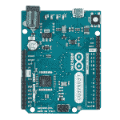](https://cdn.sparkfun.com/assets/learn_tutorials/1/1/1/4/11286-04a_Arduino_Leonardo_ATmega32U4.jpg) | [](https://cdn.sparkfun.com/assets/a/c/5/3/f/523b7868757b7fbc468b4567.png) |
| Arduino Leonardo | *Leonardo bootloader 开启
重置功能。* |

当 Qwiic Pro Micro 从外部复位时(通过拉低 RST 引脚)，它只会短暂地(<750ms) start the bootloader before continuing on to the sketch. If you need the bootloader to run longer, **快速复位两次**将使 Pro Micro 进入引导加载程序模式八秒钟。

| [](https://cdn.sparkfun.com/assets/learn_tutorials/1/1/1/4/15795-Atmega32U4_Pro_Micro_C-04.jpg) | [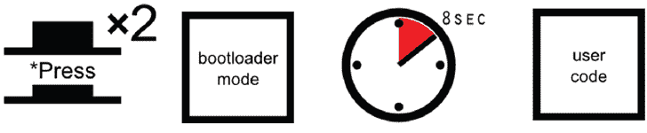](https://cdn.sparkfun.com/assets/9/d/0/d/3/523b7867757b7f7b468b4569.png) |
| *Qwiic Pro Micro* | *Qwiic Pro 微复位功能。快速按下 reset 两次，进入引导模式。* |

重置 Qwiic Pro Micro 现在更容易通过内置的重置按钮进行重置。只需按两次 Qwiic 连接器旁边的重置按钮。您也可以将 RST 引脚接地来启动复位。这可以用一小段电线或外部连接的按钮来完成。

[](https://cdn.sparkfun.com/assets/learn_tutorials/1/1/1/4/15795-Atmega32U4_Pro_Micro_C-Atmega32U4_Reset.jpg)

为什么你首先需要进入引导模式。很高兴你问了...

### [如何起死回生一个“被砖砸”的亲微](#ts-revive)

将所有 USB 任务集成在一个芯片上是一个了不起的功能，使 Pro Micro 和类似的主板真正独一无二。但这也给单个芯片带来了更大的压力，如果芯片出现任何问题，电路板就几乎无法使用。Qwiic Pro Micro 变得“砖头”和不可编程并不罕见。但是，在大多数情况下，砌砖是可逆的！

*Qwiic Pro Micro 最常见的“阻塞”来源是使用**错误设置的板**向其上传代码(例如，将板设置为 8MHz/3.3V，对 16MHz/5V Pro Micro 编程)。此外，确保您的草图不会与 ATmega32U4 的 PLLCSR 寄存器或任何其他在 ATmega32U4 上设置 USB 功能的寄存器混淆。Pro Micro 实际上会接受为错误的运行速度编译的代码，但当它试图重新枚举时，您会收到如下通知:*

*[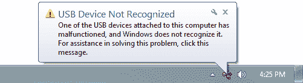](https://cdn.sparkfun.com/assets/a/7/2/d/3/523b7a11757b7fd5468b4567.png)

要恢复 Pro Micro，您需要找到一种方法来上传草图，并正确设置纸板选项。我们可以在引导装载程序的帮助下做到这一点。

首先，你需要**设置引导程序**的串口。但该端口仅在主板处于引导加载程序模式时可见，因此按下重置按钮或将重置线快速拉低两次，以调用上面讨论的引导加载程序重置功能。**当 Pro Micro 在 bootloader** 中时，将“**工具** > **串口**”菜单更改为 bootloader COM 端口。快！你只有八秒钟。在 Windows 上，引导加载程序的 COM 端口号通常比 Qwiic Pro Micro 的常规端口号高一个数字。

设置好串口后，我们就可以重新上传草图了。但是首先，**再次检查板子是否正确设置**。然后**再次复位到 bootloader】，快速上传你的草图。再说一次，你必须要快...你只有八秒钟。重置后立即按下上传键绑定- `CTRL` + `U` / `CMD` + `U` -可能会有所帮助。**

可能需要几次尝试才能掌握好时机。因为代码必须首先编译，所以先点击上传然后重置可能会有所帮助。

还没找到合适的时间吗？

我们的一个客户(大声喊到 ***RichardDL*** )提出了一个漂亮的解决方案(仅适用于 Windows)，通过创建一个批处理文件来自动化引导加载程序过程和对主板进行编程。详情请看[的论坛帖子](https://forum.sparkfun.com/viewtopic.php?f=96&t=53770)！

### [代码上传后运行，但重启后无法启动](#ts-brownout)

我们发现，当[向升压转换器](https://learn.sparkfun.com/tutorials/single-supply-logic-level-converter-hookup-guide#example-code)输出功率时，ATmega32U4(像 Pro Micro 3.3V/8MHz)可能会掉电。虽然代码可以在上传后运行，但从初始电流汲取到升压转换器的电源周期足以导致 Pro Micro 掉电。从而导致草图无法运行。这要求用户在上电周期后切换复位按钮。

* * *

### 常见问题

如果您在使用 Qwiic Pro Micro 时遇到技术问题，请查看这些常见问题的答案是否有所帮助。如果没有，请联系我们的[技术支持团队](https://www.sparkfun.com/static/technical_assistance)。

#### [VID 和 PID 是什么？](#faq-vid)

VID 是“供应商标识”的缩写，PID 是“零件标识”的缩写。换句话说，这对 id 定义了设备。这就是你的计算机如何知道你插入了什么，使用什么驱动程序，分配给它什么 COM 端口，等等。所有本机 USB 设备都有一个 VID/PID。

所有 SparkFun ATmega32U4 板卡共用同一个 VID - 0x1B4F，并且都有唯一的 PID。5V Pro Micros lay 声明 PIDs 0x9205 和 0x9206(一个用于 bootloader，一个用于 sketch)。对于 bootloader 和 sketch，3.3V Pro Micros 将分别显示为 0x9203 和 0x9204。Fio v3 有 0xF100 和 0xF101。

#### [如何更改 ATMega32U4 板上的 VID 和 PID？](#faq-change-pid)

每次上传代码时，VID 和 PID 都会上传到设备。这些值位于' **boards.txt** '文件中，因此将由您选择的电路板决定。请记住，如果您选择了错误的板，您将得到错误的 VID/PID 上传，这意味着计算机无法识别，并编程板。引导加载程序的 VID/PID 是引导加载程序文件的一部分。要改变这一点，你需要用新的 VID/PID 重新编译引导程序，并上传它。

#### [为什么我的 ATMega32U4 板卡在设备管理器中出现两次？](#faq-twice)

引导程序和草图都有自己的 VID/PID。当你插入一个板，引导程序开始运行几秒钟，你会看到板显示在设备管理器基于这些 VID/PID。几秒钟后，草图将开始运行，您将看到设备管理器断开与引导加载程序的连接，并连接到草图。

#### [IDE 如何知道使用哪个 COM 口？](#faq-which)

当 IDE 重置主板时，COM 端口将与计算机断开连接。然后，IDE 会寻找新的 COM 端口。这是它使用的端口。这是 Arduino 为了让芯片工作而做的奇怪的事情之一。

#### [如何重装 Bootloader？](#faq-reinstall)

检查或[重新安装引导程序教程](https://www.sparkfun.com/tutorials/247)，它应该对 ATMega32U4 和 ATMega328 板都有效。如果你有[工具](https://www.sparkfun.com/categories/7)这样做，重新安装引导程序通常比试图留在引导程序中更容易。由于重新安装引导程序会将主板恢复到出厂设置，这将重置 VID/PID 号，使您的主板再次工作。

## 资源和更进一步

感谢您查看我们的 Qwiic Pro 微型连接指南！如果您正在寻找与这些主板相关的更多资源，以下是一些链接:

*   [示意图(PDF)](https://cdn.sparkfun.com/assets/4/4/f/2/a/Qwiic_Pro_Micro_V2_0_USB_C_Schematic.pdf)
*   [老鹰文件(ZIP)](https://cdn.sparkfun.com/assets/4/4/b/6/a/SparkFun_Pro_Micro_V2_0_USB-C_Eagle_Files.zip)
*   [电路板尺寸](https://cdn.sparkfun.com/assets/learn_tutorials/1/1/1/4/SparkFun_Qwiic_Pro_Micro_C-Board_Dimensions.png)
*   [图形数据表(PDF)](https://cdn.sparkfun.com/assets/learn_tutorials/1/1/1/4/QwiicProMicroUSB-C.pdf)
*   [ATmega32U4 固件说明(PDF)](https://cdn.sparkfun.com/datasheets/Dev/Arduino/Boards/32U4Note.pdf)
*   [ATmega32U4 数据表(PDF)](http://cdn.sparkfun.com/datasheets/Dev/Arduino/Boards/ATMega32U4.pdf)
*   GitHub 回购
    *   [Arduino 插件板](https://github.com/sparkfun/Arduino_Boards)
    *   [硬件回购](https://github.com/sparkfun/Pro_Micro)
    *   [Qwiic 键盘浏览器示例代码](https://github.com/sparkfunX/Qwiic_Keyboard_Explorer/tree/master/Software) - Arduino 使用 14x Cherry MX 按键开关的示例
*   [SFE 产品展示区](https://youtu.be/buwOagzAQ5U)

感谢您阅读我们的 Qwiic Pro 微型连接指南！希望现在你已经完全准备好在自己的项目中使用 Pro Micro。当你继续深入兔子洞的时候，这里有一些值得一试的教程:

[](https://learn.sparkfun.com/tutorials/connecting-arduino-to-processing) [### 将 Arduino 连接到处理](https://learn.sparkfun.com/tutorials/connecting-arduino-to-processing) Send serial data from Arduino to Processing and back - even at the same time 35[](https://learn.sparkfun.com/tutorials/cherry-mx-switch-breakout-hookup-guide) [### Cherry MX 交换机转接连接指南](https://learn.sparkfun.com/tutorials/cherry-mx-switch-breakout-hookup-guide) How to assemble and use the Cherry MX Switch Breakout, allowing you to turn a matrix of mechanical switches into a full-size keyboard 18[](https://learn.sparkfun.com/tutorials/lilypad-protosnap-plus-hookup-guide) [### LilyPad ProtoSnap Plus 连接指南](https://learn.sparkfun.com/tutorials/lilypad-protosnap-plus-hookup-guide) The LilyPad ProtoSnap Plus is a sewable electronics prototyping board that you can use to learn circuits and programming with Arduino, then break apart to make an interactive fabric or wearable project.[Favorited Favorite](# "Add to favorites") 2[](https://learn.sparkfun.com/tutorials/tech-prank-hardware-mouse-jiggler) [### 技术恶作剧:硬件鼠标抖动器](https://learn.sparkfun.com/tutorials/tech-prank-hardware-mouse-jiggler) Create an innocuous-looking USB stick with an Arduino Pro Micro and a 3D printed case that moves your mouse pointer randomly every few seconds. Sure to anger your coworkers and friends 8

感觉野心勃勃？尝试制作您自己的定制键盘！使用 Pro Micros 和 Cherry MX 开关查看来自 Martin Knobel 的自定义键盘构建:

*   [没有像家一样的空间](https://noties.space/)

或者看看这些博客文章，寻找灵感。

[](https://www.sparkfun.com/news/804 "February 13, 2012: Check out this tutorial about turning your Pro Micro into a USB Keyboard or Mouse!") [### 将 Pro Micro 变成键盘

February 13, 2012](https://www.sparkfun.com/news/804 "February 13, 2012: Check out this tutorial about turning your Pro Micro into a USB Keyboard or Mouse!")[Favorited Favorite](# "Add to favorites") 0[](https://www.sparkfun.com/news/2412 "June 15, 2017: A Cherry MX keyboard for Eagle shortcut keys") [### 按下我们的按钮

June 15, 2017](https://www.sparkfun.com/news/2412 "June 15, 2017: A Cherry MX keyboard for Eagle shortcut keys")[Favorited Favorite](# "Add to favorites") 3[](https://www.sparkfun.com/news/3191 "February 11, 2020: Revising and upgrading my split keyboard project with the new Qwiic Pro Micro C.") [### DIY 键盘的 Qwiic 升级

February 11, 2020](https://www.sparkfun.com/news/3191 "February 11, 2020: Revising and upgrading my split keyboard project with the new Qwiic Pro Micro C.")[Favorited Favorite](# "Add to favorites") 2*******************************