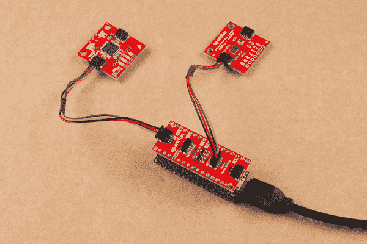

# Arduino Nano 连接指南的 SparkFun Qwiic 盾

> 原文：<https://learn.sparkfun.com/tutorials/sparkfun-qwiic-shield-for-arduino-nano-hookup-guide>

## 介绍

用于 Arduino Nano 的[spark fun Qwiic Shield](https://www.sparkfun.com/products/16789)允许您将 [SparkFun Qwiic 生态系统](https://www.sparkfun.com/qwiic)添加到开发板，这些开发板在一个易于组装的屏蔽中使用 Arduino Nano 足迹。它将 Arduino Nano 上的 I ² C 总线(GND、3.3V、SDA 和 SCL)连接到四个 SparkFun Qwiic 连接器。Qwiic 生态系统允许轻松的菊花链，因此，只要您的设备位于不同的地址，您就可以连接任意数量的 Qwiic 设备。

 

将**添加到您的[购物车](https://www.sparkfun.com/cart)中！**

 **### [Arduino Nano的 SparkFun Qwiic 盾](https://www.sparkfun.com/products/16789)

[Only 14 left!](https://learn.sparkfun.com/static/bubbles/ "only 14 left!") DEV-16789

用于 Arduino Nano 的 SparkFun Qwiic Shield 使您可以将 SparkFun 的 Qwiic connect 生态系统与开发板一起使用…

$4.95[Favorited Favorite](# "Add to favorites") 12[Wish List](# "Add to wish list")** **### 所需材料

要遵循本指南，您将需要一个具有 Nano 足迹的 Arduino。这包括 Arduino Nano 的所有变体和许多其他 Arduino Nano 兼容板！这里只是一些兼容的板。

 

将**添加到您的[购物车](https://www.sparkfun.com/cart)中！**

 **### [Arduino 纳米每](https://www.sparkfun.com/products/15590)

[32 available](https://learn.sparkfun.com/static/bubbles/ "32 available") DEV-15590

Arduino Nano Every 是一款小巧、坚固、功能强大的主板，具有相同的经典 Nano 尺寸。

$16.951[Favorited Favorite](# "Add to favorites") 15[Wish List](# "Add to wish list")**** 

将**添加到您的[购物车](https://www.sparkfun.com/cart)中！**

 **### [Arduino Nano 33 BLE](https://www.sparkfun.com/products/15588)

[Only 8 left!](https://learn.sparkfun.com/static/bubbles/ "only 8 left!") DEV-15588

专为短距离蓝牙交互和节能项目而设计。这种紧凑而可靠的纳米板是围绕…

$32.95[Favorited Favorite](# "Add to favorites") 8[Wish List](# "Add to wish list")**** 

将**添加到您的[购物车](https://www.sparkfun.com/cart)中！**

 **### [Arduino Nano 33 物联网带头](https://www.sparkfun.com/products/15589)

[Only 7 left!](https://learn.sparkfun.com/static/bubbles/ "only 7 left!") DEV-15589

纳米板的易用性，增加了安全的物联网和蓝牙连接。

$31.95[Favorited Favorite](# "Add to favorites") 6[Wish List](# "Add to wish list")**** 

### [Arduino Nano 33 BLE 感](https://www.sparkfun.com/products/15580)

[Out of stock](https://learn.sparkfun.com/static/bubbles/ "out of stock") DEV-15580

Arduino Nano 33 BLE Sense 围绕 NINA B306 模块构建，用于 BLE 和蓝牙 5 通信。

[Favorited Favorite](# "Add to favorites") 9[Wish List](# "Add to wish list")****** ******屏蔽附带一组可堆叠的接头，但是，如果您更喜欢使用其他接头或另一组可堆叠的接头，这里有几个选项:

 

将**添加到您的[购物车](https://www.sparkfun.com/cart)中！**

 **### [破开头球——直击](https://www.sparkfun.com/products/116)

[In stock](https://learn.sparkfun.com/static/bubbles/ "in stock") PRT-00116

一排标题-打破适应。40 个引脚，可切割成任何尺寸。用于定制 PCB 或通用定制接头。

$1.7520[Favorited Favorite](# "Add to favorites") 133[Wish List](# "Add to wish list")**** 

将**添加到您的[购物车](https://www.sparkfun.com/cart)中！**

 **### [Arduino Nano 可堆叠头部套件](https://www.sparkfun.com/products/16279)

[In stock](https://learn.sparkfun.com/static/bubbles/ "in stock") PRT-16279

这组可堆叠插座包括两个 15 针插座；引脚间距为 0.1 英寸。

$1.75[Favorited Favorite](# "Add to favorites") 5[Wish List](# "Add to wish list")**** 

将**添加到您的[购物车](https://www.sparkfun.com/cart)中！**

 **### [女标题](https://www.sparkfun.com/products/115)

[In stock](https://learn.sparkfun.com/static/bubbles/ "in stock") PRT-00115

单排 40 孔，内螺纹接头。可以用一把钢丝钳切割成合适的尺寸。标准 0.1 英寸间距。我们广泛使用它们…

$1.758[Favorited Favorite](# "Add to favorites") 71[Wish List](# "Add to wish list")**** 

将**添加到您的[购物车](https://www.sparkfun.com/cart)中！**

 **### [断后头——龙](https://www.sparkfun.com/products/10158)

[In stock](https://learn.sparkfun.com/static/bubbles/ "in stock") PRT-10158

这些是我们【标准】的加长版(http://www . spark fun . com/commerce/product _ info . PHP？products_id=116)挣脱他…

$3.253[Favorited Favorite](# "Add to favorites") 14[Wish List](# "Add to wish list")******** ********如果你没有任何 Qwiic 产品可以使用，你可能不会想要 Arudino Nano 的 Qwiic Shield，对吗？好吧，如果你没有任何 Qwiic 产品，以下可能是一个不错的开始。

 

将**添加到您的[购物车](https://www.sparkfun.com/cart)中！**

 **### [【spark fun GPS Breakout-NEO-M9N，U.FL (Qwiic)](https://www.sparkfun.com/products/15712)

[In stock](https://learn.sparkfun.com/static/bubbles/ "in stock") GPS-15712

SparkFun NEO-M9N GPS Breakout 是一款高质量的 GPS 板，具有同样令人印象深刻的配置选项。

$69.954[Favorited Favorite](# "Add to favorites") 12[Wish List](# "Add to wish list")**** 

将**添加到您的[购物车](https://www.sparkfun.com/cart)中！**

 **### [【spark fun 高精度温度传感器- TMP117 (Qwiic)](https://www.sparkfun.com/products/15805)

[In stock](https://learn.sparkfun.com/static/bubbles/ "in stock") SEN-15805

SparkFun Qwiic TMP117 Breakout 是一款配有 I2C 接口的高精度温度传感器。

$14.954[Favorited Favorite](# "Add to favorites") 29[Wish List](# "Add to wish list")**** 

将**添加到您的[购物车](https://www.sparkfun.com/cart)中！**

 **### [SparkFun Qwiic 电机驱动器](https://www.sparkfun.com/products/15451)

[In stock](https://learn.sparkfun.com/static/bubbles/ "in stock") ROB-15451

SparkFun Qwiic 电机驱动器采用了串行控制电机驱动器的所有功能，并将其小型化，增加了 Qw…

$19.501[Favorited Favorite](# "Add to favorites") 28[Wish List](# "Add to wish list")**** 

将**添加到您的[购物车](https://www.sparkfun.com/cart)中！**

 **### [SparkFun Qwiic 键盘- 12 键](https://www.sparkfun.com/products/15290)

[In stock](https://learn.sparkfun.com/static/bubbles/ "in stock") COM-15290

SparkFun Qwiic 键盘完全组装，使添加 12 按钮键盘的开发过程变得简单。

$11.509[Favorited Favorite](# "Add to favorites") 45[Wish List](# "Add to wish list")******** ********您将需要一些我们的 Qwiic 电缆来连接您的设备和屏蔽。以下是几个选项:

 

将**添加到您的[购物车](https://www.sparkfun.com/cart)中！**

 **### [Qwiic 线缆- 100mm](https://www.sparkfun.com/products/14427)

[In stock](https://learn.sparkfun.com/static/bubbles/ "in stock") PRT-14427

这是一条 100 毫米长的 4 芯电缆，带有 1 毫米 JST 端接。它旨在将支持 Qwiic 的组件连接在一起…

$1.50[Favorited Favorite](# "Add to favorites") 32[Wish List](# "Add to wish list")**** 

将**添加到您的[购物车](https://www.sparkfun.com/cart)中！**

 **### [Qwiic 线缆- 500mm](https://www.sparkfun.com/products/14429)

[In stock](https://learn.sparkfun.com/static/bubbles/ "in stock") PRT-14429

这是一根 500mm 长的 4 芯电缆，带有 1mm JST 端接。它旨在将支持 Qwiic 的组件连接在一起…

$1.951[Favorited Favorite](# "Add to favorites") 25[Wish List](# "Add to wish list")**** 

将**添加到您的[购物车](https://www.sparkfun.com/cart)中！**

 **### [Qwiic 线缆- 50mm](https://www.sparkfun.com/products/14426)

[In stock](https://learn.sparkfun.com/static/bubbles/ "in stock") PRT-14426

这是一根 50 毫米长的 4 芯电缆，带有 1 毫米 JST 端接。它旨在将支持 Qwiic 的组件连接在一起…

$0.95[Favorited Favorite](# "Add to favorites") 29[Wish List](# "Add to wish list")**** 

### [Qwiic 线缆- 200mm](https://www.sparkfun.com/products/14428)

[Out of stock](https://learn.sparkfun.com/static/bubbles/ "out of stock") PRT-14428

这是一根 200 毫米长的 4 芯电缆，带有 1 毫米 JST 端接。它旨在将支持 Qwiic 的组件连接在一起…

[Favorited Favorite](# "Add to favorites") 21[Wish List](# "Add to wish list")****** ******最后，如果您想使用非 Qwiic I ² C 设备，这些适配器有助于将其转换为 Qwiic 连接器:

 

将**添加到您的[购物车](https://www.sparkfun.com/cart)中！**

 **### [SparkFun Qwiic 适配器](https://www.sparkfun.com/products/14495)

[In stock](https://learn.sparkfun.com/static/bubbles/ "in stock") DEV-14495

SparkFun Qwiic 适配器提供了将任何旧 I ² C 板改造成支持 Qwiic 的板的完美方法。

$1.601[Favorited Favorite](# "Add to favorites") 53[Wish List](# "Add to wish list")**** 

将**添加到您的[购物车](https://www.sparkfun.com/cart)中！**

 **### [Qwiic 电缆-试验板跳线(4 针)](https://www.sparkfun.com/products/14425)

[In stock](https://learn.sparkfun.com/static/bubbles/ "in stock") PRT-14425

这是一根跳线适配器电缆，一端带有一个 Qwiic JST 母接头，另一端带有一个试验板连接…

$1.50[Favorited Favorite](# "Add to favorites") 34[Wish List](# "Add to wish list")**** 

### [Qwiic 线缆-母跳线(4 针)](https://www.sparkfun.com/products/retired/14988)

[Retired](https://learn.sparkfun.com/static/bubbles/ "Retired") CAB-14988

这是一种跳线适配器电缆，一端预端接一个母 Qwiic JST 连接器，另一端预端接一个母连接器

**Retired**[Favorited Favorite](# "Add to favorites") 10[Wish List](# "Add to wish list")**** ****### 所需工具

您将需要一个[烙铁](https://www.sparkfun.com/categories/49)、焊料和通用焊接附件来将接头引脚焊接到 Qwiic 屏蔽上。

 

将**添加到您的[购物车](https://www.sparkfun.com/cart)中！**

 **### [无铅焊料- 15 克管](https://www.sparkfun.com/products/9163)

[In stock](https://learn.sparkfun.com/static/bubbles/ "in stock") TOL-09163

这是你的无铅焊料的基本管，带有不干净的水溶性树脂芯。0.031 英寸规格，15 克

$3.954[Favorited Favorite](# "Add to favorites") 14[Wish List](# "Add to wish list")**** 

将**添加到您的[购物车](https://www.sparkfun.com/cart)中！**

 **### [烙铁- 30W(美国，110V)](https://www.sparkfun.com/products/9507)

[33 available](https://learn.sparkfun.com/static/bubbles/ "33 available") TOL-09507

这是一个非常简单的固定温度，快速加热，30W 110/120 VAC 烙铁。我们真的很喜欢使用更贵的 iro…

$10.957[Favorited Favorite](# "Add to favorites") 21[Wish List](# "Add to wish list")**** ****### 推荐阅读

如果您不熟悉 Qwiic 生态系统，我们建议您阅读此处的概述:

|  |
| *[Qwiic 连接系统](https://www.sparkfun.com/qwiic)* |

如果您不熟悉以下教程，我们也建议您看一看:

 [### 如何焊接:通孔焊接](https://learn.sparkfun.com/tutorials/how-to-solder-through-hole-soldering) This tutorial covers everything you need to know about through-hole soldering.[Favorited Favorite](# "Add to favorites") 70 [### I2C](https://learn.sparkfun.com/tutorials/i2c) An introduction to I2C, one of the main embedded communications protocols in use today.[Favorited Favorite](# "Add to favorites") 128 [### Arduino Shields v2](https://learn.sparkfun.com/tutorials/arduino-shields-v2) An update to our classic Arduino Shields Tutorial! All things Arduino shields. What they are and how to assemble them.[Favorited Favorite](# "Add to favorites") 5

## 硬件概述

Arduino Nano 的 Qwiic 屏蔽是非常直接的屏蔽，但我们将在本节中介绍一些额外的内容。

### Qwiic 连接器

就像我们的其他 Qwiic 适配器板一样，Arduino Nano 的 Qwiic Shield 附带了几个 Qwiic 连接器。电路板边缘有两个水平 Qwiic 连接器，中间有两个垂直连接器。

### 逻辑移位电路和 IOREF 跳线

Arduino Nano 的 Qwiic Shield 具有可配置的逻辑转换电路，具体取决于 Arduino Nano 运行的电压。屏蔽层上有一个跳线，用于设置逻辑移位电路的 IOREF 电压。跳线默认为 **3.3V** ，这对于像 [Arduino 33 Nano BLE](https://www.sparkfun.com/products/15588) 这样的 33 Nano 来说很好，但对于像 [Arduino Nano 每](https://www.sparkfun.com/products/15590)运行在 **5V** 的 Arduino Nano，您需要将跳线切换到 **5V** 。

Never worked with solder jumpers before just need some tips or a quick refresher? Check out our [How to Work with Jumpers and PCB Traces](https://learn.sparkfun.com/tutorials/how-to-work-with-jumper-pads-and-pcb-traces) tutorial.

 [### 如何使用跳线焊盘和 PCB 走线

#### 2018 年 4 月 2 日](https://learn.sparkfun.com/tutorials/how-to-work-with-jumper-pads-and-pcb-traces) Handling PCB jumper pads and traces is an essential skill. Learn how to cut a PCB trace, add a solder jumper between pads to reroute connections, and repair a trace with the green wire method if a trace is damaged.[Favorited Favorite](# "Add to favorites") 11

### I ² C 跳线

I ² C 跳线通过 **4.7K** 电阻将 Qwiic SDA 和 SCL 线拉高至 **3.3V** 。IOREF 跳线设置的基准电压对上拉电阻的电压没有影响。如果 I ² C 总线上有许多器件，可以通过切断焊盘之间的走线来禁用它们。

### 电路板尺寸

防护罩的尺寸为 1.7 英寸 x 0.7 英寸(43.18 毫米 x 17.78mm 毫米)，有四个直径为 0.07 英寸的安装孔，与 Nano 上的安装孔相匹配。

## 硬件装配

要开始使用 Arduino Nano 的 Qwiic 屏蔽，只需将附带的可堆叠接头套件或您选择的接头[焊接到屏蔽上，如有必要，还可焊接到您的 Arduino Nano 上。如果你以前从未使用过 Arduino 盾牌，或者需要一些提示，我们的](https://learn.sparkfun.com/tutorials/how-to-solder-through-hole-soldering) [Arduino 盾牌教程](https://learn.sparkfun.com/tutorials/arduino-shields-v2#installing-headers-preparation)提供了关于如何组装和使用它们的详细说明。注意将 Qwiic 屏蔽上的标记与 Nano 上的相应引脚匹配，以避免任何东西短路并可能损坏您的 Nano。此外，一些 Nano 的变体，如 [Nano 33 BLE Sense](https://www.sparkfun.com/products/15580) 的传感器或天线可能会受到 Qwiic Shield 放置在顶部的影响，因此您可能需要考虑将 Qwiic Shield 放置在 Arduino Nano 的下方。

一旦你把接头焊接到你的屏蔽上，并把它连接到你的 Nano 上，就该开始连接一些 Qwiic 设备了！在下面，你可以看到 Qwiic 防护罩连接到一个 Arduino Nano 上，每隔使用一些母头和公头，连接几个 Qwiic 设备。

## 资源和更进一步

要了解更多信息，请看下面的参考资料。

*   [示意图(PDF)](https://cdn.sparkfun.com/assets/b/b/8/5/6/Qwiic_Shield_Arduino_Nano.pdf)
*   [老鹰文件(ZIP)](https://cdn.sparkfun.com/assets/d/9/f/a/d/Qwiic_Shield_Arduino_Nano.zip)
*   [电路板尺寸](https://cdn.sparkfun.com/r/600-600/assets/learn_tutorials/1/1/0/6/Qwiic_Shield_Nano_Dimensions.png)
*   [GitHub 库](https://github.com/sparkfun/Qwiic_Shield_for_Arduino_Nano)
*   [Qwiic 系统登陆页面](https://www.sparkfun.com/qwiic)

如果您在使用新组装的 Qwiic Shield 连接 Qwiic 设备时遇到问题，您可能想看看这些教程，以帮助排除故障和返工您的 Shield。

*   [故障排除提示-硬件检查](https://learn.sparkfun.com/tutorials/sparkfun-troubleshooting-tips#hardware-checks)
*   [Arduino 盾牌教程](https://learn.sparkfun.com/tutorials/arduino-shields-v2)

既然您已经准备好了 Qwiic Shield，是时候看看一些支持 qw IC 的产品了。下面是几个开始。

 

将**添加到您的[购物车](https://www.sparkfun.com/cart)中！**

 **### [SparkFun 树莓 Pi 4 基础套装- 2GB](https://www.sparkfun.com/products/16383)

[Out of stock](https://learn.sparkfun.com/static/bubbles/ "out of stock") KIT-16383

Raspberry Pi 4 基本套件包括启动和运行 Raspberry Pi 4 2GB 所需的一切。

$84.951[Favorited Favorite](# "Add to favorites") 9[Wish List](# "Add to wish list")**** 

将**添加到您的[购物车](https://www.sparkfun.com/cart)中！**

 **### [Zio Qwiic 有机发光二极管显示器(0.91 英寸，128x32)](https://www.sparkfun.com/products/16774)

[In stock](https://learn.sparkfun.com/static/bubbles/ "in stock") LCD-16774

Zio 的这款有机发光二极管显示器最多可以显示 3 行文本，比 LCD 更薄、耗电更少，并采用快速折射技术

$9.95 $5.252[Favorited Favorite](# "Add to favorites") 8[Wish List](# "Add to wish list")**** 

将**添加到您的[购物车](https://www.sparkfun.com/cart)中！**

 **### [Alchitry Au+ FPGA 开发板(Xilinx Artix 7)](https://www.sparkfun.com/products/17514)

[In stock](https://learn.sparkfun.com/static/bubbles/ "in stock") DEV-17514

Alchitry Au+是 FPGA 开发板的黄金标准，可能是同类开发板中最强的一种

$324.951[Favorited Favorite](# "Add to favorites") 12[Wish List](# "Add to wish list")**** 

将**添加到您的[购物车](https://www.sparkfun.com/cart)中！**

 **### [SparkFun Qwiic LED 棒-APA 102 c](https://www.sparkfun.com/products/18354)

[In stock](https://learn.sparkfun.com/static/bubbles/ "in stock") COM-18354

SparkFun Qwiic LED 棒具有 10 个可寻址的 APA102 LEDs，使用 I2C 可以轻松添加全色 LED 控制。

$10.954[Favorited Favorite](# "Add to favorites") 11[Wish List](# "Add to wish list")******** ********在您离开之前，这里有一些使用 Qwiic Connect 系统的其他教程，您可能想浏览一下:

 [### Pi 伺服 pHAT (v2)连接指南](https://learn.sparkfun.com/tutorials/pi-servo-phat-v2-hookup-guide) This hookup guide will get you started with connecting and using the Pi Servo pHAT on a Raspberry Pi.[Favorited Favorite](# "Add to favorites") 4 [### SparkFun 光电探测器(MAX30101)连接指南](https://learn.sparkfun.com/tutorials/sparkfun-photodetector-max30101-hookup-guide) The SparkFun Photodetector - MAX30101 (Qwiic) is the successor to the MAX30105 particle sensor, a highly sensitive optical sensor. This tutorial will get you started on retrieving the raw data from the MAX30101 sensor.[Favorited Favorite](# "Add to favorites") 0 [### RFID 初学者教程](https://learn.sparkfun.com/tutorials/rfid-beginners-tutorial) In this tutorial we'll revisit some RFID basics and practice by making a remote work logger using an RFID reader and a GPS module. You'll scan a card and get ID, location, and time. All the perfect data to punch in and punch out from the middle of Nowhere 12 [### Artemis 开发套件入门](https://learn.sparkfun.com/tutorials/getting-started-with-the-artemis-development-kit) This guide covers the general design of the board, the installation of the recommended software used to program the Artemis DK, and some basic examples. For more advanced functionalities, we have separate software development guides for the AmbiqSDK, Arm® Mbed™ OS, and the Arduino IDE platforms that users can reference.[Favorited Favorite](# "Add to favorites") 2**********************************************