# SparkFun GPS NEO-M9N 连接指南

> 原文：<https://learn.sparkfun.com/tutorials/sparkfun-gps-neo-m9n-hookup-guide>

## 介绍

SparkFun GPS NEO-M9N 是 u-blox GPS 产品的下一代产品！我们开发了三种类型的电路板:一种带有小型芯片天线、u.FL 连接器和 SMA 连接器，以便您可以选择自己喜欢的天线。

[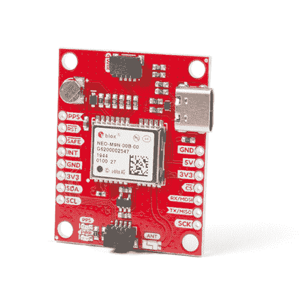](https://www.sparkfun.com/products/15733) 

将**添加到您的[购物车](https://www.sparkfun.com/cart)中！**

 **### [【spark fun GPS Breakout-NEO-M9N，芯片天线(Qwiic)](https://www.sparkfun.com/products/15733)

[In stock](https://learn.sparkfun.com/static/bubbles/ "in stock") GPS-15733

SparkFun NEO-M9N GPS Breakout 带有板载芯片天线，是一款高质量的 GPS 板，具有同样令人印象深刻的配置…

$74.952[Favorited Favorite](# "Add to favorites") 11[Wish List](# "Add to wish list")****[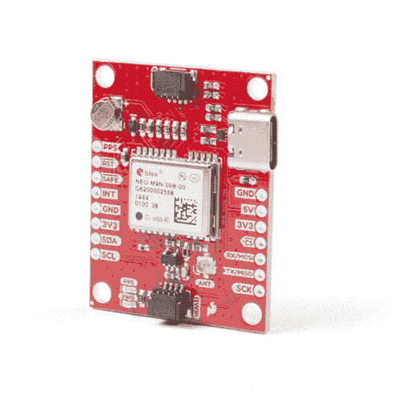](https://www.sparkfun.com/products/15712) 

将**添加到您的[购物车](https://www.sparkfun.com/cart)中！**

 **### [【spark fun GPS Breakout-NEO-M9N，U.FL (Qwiic)](https://www.sparkfun.com/products/15712)

[In stock](https://learn.sparkfun.com/static/bubbles/ "in stock") GPS-15712

SparkFun NEO-M9N GPS Breakout 是一款高质量的 GPS 板，具有同样令人印象深刻的配置选项。

$69.954[Favorited Favorite](# "Add to favorites") 12[Wish List](# "Add to wish list")****[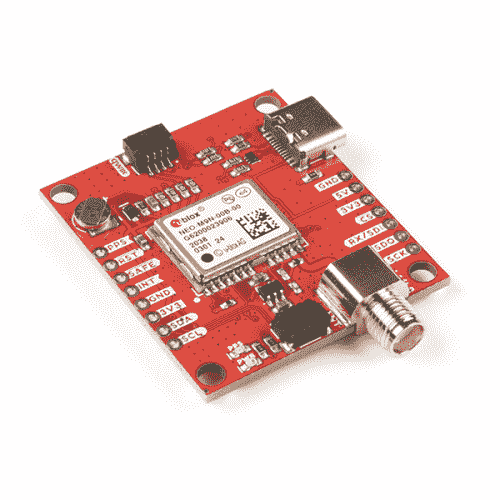](https://www.sparkfun.com/products/17285) 

将**添加到您的[购物车](https://www.sparkfun.com/cart)中！**

 **### [【spark fun GPS Breakout-NEO-M9N，SMA (Qwiic)](https://www.sparkfun.com/products/17285)

[In stock](https://learn.sparkfun.com/static/bubbles/ "in stock") GPS-17285

SparkFun NEO-M9N GPS Breakout 是一款高质量的 GPS 板，具有同样令人印象深刻的配置选项，现在包括 SM…

$74.957[Favorited Favorite](# "Add to favorites") 9[Wish List](# "Add to wish list")****** ******[https://www.youtube.com/embed/JwfEUatEebY/?autohide=1&border=0&wmode=opaque&enablejsapi=1](https://www.youtube.com/embed/JwfEUatEebY/?autohide=1&border=0&wmode=opaque&enablejsapi=1)

### 所需材料

要跟随本教程，您将需要以下材料。你可能不需要所有的东西，这取决于你拥有什么。将它添加到您的购物车，通读指南，并根据需要调整购物车。

[](https://www.sparkfun.com/products/15123) 

将**添加到您的[购物车](https://www.sparkfun.com/cart)中！**

 **### [spark fun RedBoard Qwiic](https://www.sparkfun.com/products/15123)

[In stock](https://learn.sparkfun.com/static/bubbles/ "in stock") DEV-15123

SparkFun RedBoard Qwiic 是一款 Arduino 兼容开发板，内置 Qwiic 连接器，无需…

$21.5014[Favorited Favorite](# "Add to favorites") 49[Wish List](# "Add to wish list")****[](https://www.sparkfun.com/products/10215) 

将**添加到您的[购物车](https://www.sparkfun.com/cart)中！**

 **### [USB micro-B 线- 6 脚](https://www.sparkfun.com/products/10215)

[In stock](https://learn.sparkfun.com/static/bubbles/ "in stock") CAB-10215

USB 2.0 型到微型 USB 5 针。这是一种新的、更小的 USB 设备连接器。微型 USB 连接器大约是…

$5.5014[Favorited Favorite](# "Add to favorites") 21[Wish List](# "Add to wish list")****[](https://www.sparkfun.com/products/14427) 

将**添加到您的[购物车](https://www.sparkfun.com/cart)中！**

 **### [Qwiic 线缆- 100mm](https://www.sparkfun.com/products/14427)

[In stock](https://learn.sparkfun.com/static/bubbles/ "in stock") PRT-14427

这是一条 100 毫米长的 4 芯电缆，带有 1 毫米 JST 端接。它旨在将支持 Qwiic 的组件连接在一起…

$1.50[Favorited Favorite](# "Add to favorites") 32[Wish List](# "Add to wish list")****** ******#### 附加 GPS 天线选项

以下是一些其他的 GPS 天线选项。如果您决定使用带有 u.FL 连接器的电缆，请确保使用 u.FL 转 SMA 电缆。链接在下面的 GPS 附件中。

[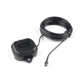](https://www.sparkfun.com/products/15192) 

将**添加到您的[购物车](https://www.sparkfun.com/cart)中！**

 **### [](https://www.sparkfun.com/products/15192)

[In stock](https://learn.sparkfun.com/static/bubbles/ "in stock") GPS-15192

ANN-MB-00 GNSS 多波段天线与其他 GNSS/GPS 天线相比极为独特，因为它设计用于接收…

$72.951[Favorited Favorite](# "Add to favorites") 26[Wish List](# "Add to wish list")****[](https://www.sparkfun.com/products/14986) 

将**添加到您的[购物车](https://www.sparkfun.com/cart)中！**

 **### [【GPS/GNSS 磁悬挂天线- 3m (SMA)](https://www.sparkfun.com/products/14986)

[In stock](https://learn.sparkfun.com/static/bubbles/ "in stock") GPS-14986

这款出色的 GPS/GNSS 天线专为 GPS 和 GLONASS 接收而设计。

$13.953[Favorited Favorite](# "Add to favorites") 7[Wish List](# "Add to wish list")****[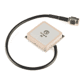](https://www.sparkfun.com/products/177) 

将**添加到您的[购物车](https://www.sparkfun.com/cart)中！**

 **### [GPS 嵌入式天线 SMA](https://www.sparkfun.com/products/177)

[Out of stock](https://learn.sparkfun.com/static/bubbles/ "out of stock") GPS-00177

适合小型移动应用的嵌入式天线。带 LNA 的基本无包装天线。5 英寸电缆端接标准公…

$12.95[Favorited Favorite](# "Add to favorites") 10[Wish List](# "Add to wish list")****[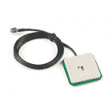](https://www.sparkfun.com/products/14987) 

将**添加到您的[购物车](https://www.sparkfun.com/cart)中！**

 **### [](https://www.sparkfun.com/products/14987)

[33 available](https://learn.sparkfun.com/static/bubbles/ "33 available") GPS-14987

这款三频 GNSS 天线非常适合 GPS L1、GLONASS L1 和北斗 B2 接收。

$64.50[Favorited Favorite](# "Add to favorites") 3[Wish List](# "Add to wish list")******** ********#### GPS 天线附件

[](https://www.sparkfun.com/products/9145) 

将**添加到您的[购物车](https://www.sparkfun.com/cart)中！**

 **### [接口电缆 SMA 到 U . FL](https://www.sparkfun.com/products/9145)

[Out of stock](https://learn.sparkfun.com/static/bubbles/ "out of stock") WRL-09145

这是一条 4 英寸的连接器电缆，可将 U.FL 射频连接器连接到常规 SMA 连接器。这种电缆通常用于连接…

$5.503[Favorited Favorite](# "Add to favorites") 19[Wish List](# "Add to wish list")****[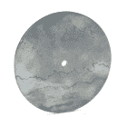](https://www.sparkfun.com/products/retired/15004) 

### [GPS 天线接地板](https://www.sparkfun.com/products/retired/15004)

[Retired](https://learn.sparkfun.com/static/bubbles/ "Retired") GPS-15004

想要将您的 GPS 天线多路径收敛时间性能提高到接近测量级 GNSS 水平吗？只是用这个 sim…

**Retired**[Favorited Favorite](# "Add to favorites") 4[Wish List](# "Add to wish list")** **#### 其他 Qwiic 电缆附件

[](https://www.sparkfun.com/products/15081) 

将**添加到您的[购物车](https://www.sparkfun.com/cart)中！**

 **### [SparkFun Qwiic 线缆套件](https://www.sparkfun.com/products/15081)

[In stock](https://learn.sparkfun.com/static/bubbles/ "in stock") KIT-15081

为了更容易上手，我们用 50 毫米到 500 毫米的各种 Qwiic 电缆组装了 Qwiic 电缆套件…

$8.9516[Favorited Favorite](# "Add to favorites") 58[Wish List](# "Add to wish list")****[](https://www.sparkfun.com/products/14427) 

将**添加到您的[购物车](https://www.sparkfun.com/cart)中！**

 **### [Qwiic 线缆- 100mm](https://www.sparkfun.com/products/14427)

[In stock](https://learn.sparkfun.com/static/bubbles/ "in stock") PRT-14427

这是一条 100 毫米长的 4 芯电缆，带有 1 毫米 JST 端接。它旨在将支持 Qwiic 的组件连接在一起…

$1.50[Favorited Favorite](# "Add to favorites") 32[Wish List](# "Add to wish list")****[](https://www.sparkfun.com/products/14426) 

将**添加到您的[购物车](https://www.sparkfun.com/cart)中！**

 **### [Qwiic 线缆- 50mm](https://www.sparkfun.com/products/14426)

[In stock](https://learn.sparkfun.com/static/bubbles/ "in stock") PRT-14426

这是一根 50 毫米长的 4 芯电缆，带有 1 毫米 JST 端接。它旨在将支持 Qwiic 的组件连接在一起…

$0.95[Favorited Favorite](# "Add to favorites") 29[Wish List](# "Add to wish list")****[](https://www.sparkfun.com/products/14428) 

### [Qwiic 线缆- 200mm](https://www.sparkfun.com/products/14428)

[Out of stock](https://learn.sparkfun.com/static/bubbles/ "out of stock") PRT-14428

这是一根 200 毫米长的 4 芯电缆，带有 1 毫米 JST 端接。它旨在将支持 Qwiic 的组件连接在一起…

[Favorited Favorite](# "Add to favorites") 21[Wish List](# "Add to wish list")**************Heads up!** If you are using the [RedBoard **without** a Qwiic connector](https://www.sparkfun.com/products/13975), we recommend getting the Qwiic Shield for Arduino.

[](https://www.sparkfun.com/products/14352) 

将**添加到您的[购物车](https://www.sparkfun.com/cart)中！**

 **### [ArduinoT3 的 SparkFun Qwiic 盾](https://www.sparkfun.com/products/14352)

[In stock](https://learn.sparkfun.com/static/bubbles/ "in stock") DEV-14352

SparkFun Qwiic Shield 是一种易于组装的板，它提供了一种简单的方法来将 Qwiic Connect 系统与

$7.508[Favorited Favorite](# "Add to favorites") 39[Wish List](# "Add to wish list")** **### 推荐阅读

如果你不熟悉 Qwiic 系统，我们推荐你在这里阅读[以获得一个概述](https://www.sparkfun.com/qwiic)。

| [](https://www.sparkfun.com/qwiic) |
| *[Qwiic 连接系统](https://www.sparkfun.com/qwiic)* |

如果你不熟悉下面的教程，我们也建议你看一看。

[](https://learn.sparkfun.com/tutorials/gps-basics) [### GPS 基础知识](https://learn.sparkfun.com/tutorials/gps-basics) The Global Positioning System (GPS) is an engineering marvel that we all have access to for a relatively low cost and no subscription fee. With the correct hardware and minimal effort, you can determine your position and time almost anywhere on the globe.[Favorited Favorite](# "Add to favorites") 31[](https://learn.sparkfun.com/tutorials/serial-peripheral-interface-spi) [### 串行外设接口(SPI)](https://learn.sparkfun.com/tutorials/serial-peripheral-interface-spi) SPI is commonly used to connect microcontrollers to peripherals such as sensors, shift registers, and SD cards.[Favorited Favorite](# "Add to favorites") 91[](https://learn.sparkfun.com/tutorials/i2c) [### I2C](https://learn.sparkfun.com/tutorials/i2c) An introduction to I2C, one of the main embedded communications protocols in use today.[Favorited Favorite](# "Add to favorites") 128[](https://learn.sparkfun.com/tutorials/how-to-work-with-jumper-pads-and-pcb-traces) [### 如何使用跳线焊盘和 PCB 走线](https://learn.sparkfun.com/tutorials/how-to-work-with-jumper-pads-and-pcb-traces) Handling PCB jumper pads and traces is an essential skill. Learn how to cut a PCB trace, add a solder jumper between pads to reroute connections, and repair a trace with the green wire method if a trace is damaged.[Favorited Favorite](# "Add to favorites") 11[](https://learn.sparkfun.com/tutorials/getting-started-with-u-center-for-u-blox) [### u-blox 的 U-Center 入门](https://learn.sparkfun.com/tutorials/getting-started-with-u-center-for-u-blox) Learn the tips and tricks to use the u-blox software tool to configure your GPS receiver.[Favorited Favorite](# "Add to favorites") 2[](https://learn.sparkfun.com/tutorials/three-quick-tips-about-using-ufl) [### 关于使用 U.FL 的三个快速提示](https://learn.sparkfun.com/tutorials/three-quick-tips-about-using-ufl) Quick tips regarding how to connect, protect, and disconnect U.FL connectors.[Favorited Favorite](# "Add to favorites") 14

## 硬件概述

### 力量

该主板的电源为 **3.3V** ，我们提供了多种电源选项。这第一个也是最明显的是 **USB-C 连接器**。其次， **Qwiic 连接器**是否在电路板的顶部和底部。第三，在 PTH 接头上有一个 **5V 引脚**，沿着板的侧面向下调整到 **3.3V** 。确保提供给该引脚的电源不超过 6 伏。最后，5V 引脚的正下方是一个 **3.3V** 引脚，应该只提供一个干净的 3.3V 电源信号。

[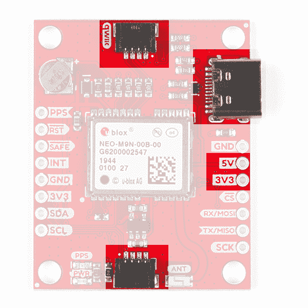](https://cdn.sparkfun.com/assets/learn_tutorials/1/1/0/2/Power_Options.jpg)

### 电池

左上角的小金属盘是小锂电池。这种电池不像 3.3V 系统那样向 IC 供电，而是向 IC 内部的相关系统*供电，从而允许快速重新连接到卫星。第一次定位时间大约为 **~29 秒**，但是当它锁定后，电池将允许有**两秒**的时间进行第一次定位。这称为**热启动**，在主板断电后持续四个小时。电池为备用系统提供超过一年的电力，当主板通电时充电缓慢。要充满电，请将模块插上电源 48 小时。*

[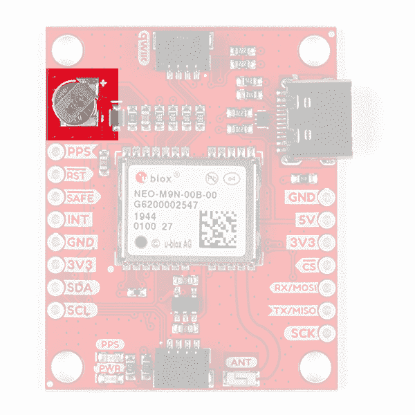](https://cdn.sparkfun.com/assets/learn_tutorials/1/1/0/2/Battery.jpg)

### 发光二极管

底部 Qwiic 连接器的左侧靠近主板边缘处有一个红色电源 LED，用于指示主板已通电。在标有`PPS`的电源 LED 正上方有另一个 LED，它连接到每秒*脉冲*线上。当连接到卫星时，这条线路产生一个与 GPS 或 UTC 时间网格同步的脉冲。默认情况下，你会看到每秒一个脉冲。

[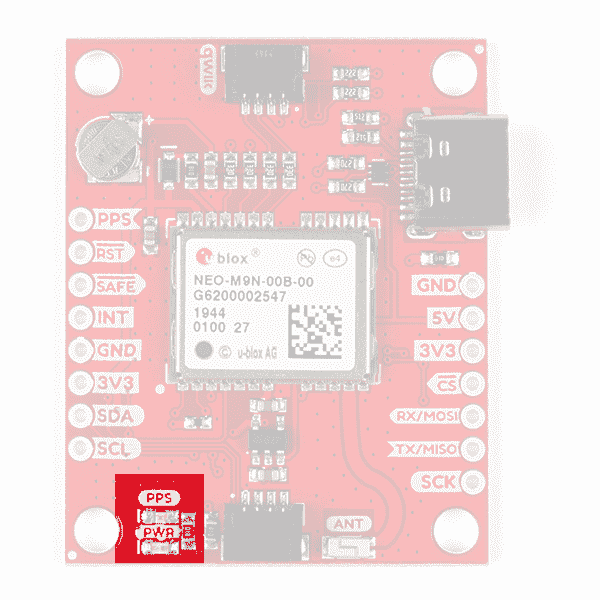](https://cdn.sparkfun.com/assets/learn_tutorials/1/1/0/2/LEDs.jpg)

### 针织套衫

产品下面有四个跳线，每个都标有其功能。在图片的右上角是一个标记为`I²C`的三路跳线，它将两个上拉电阻连接到 I ² C 数据线。如果你的 I ² C 数据线上有很多器件，那么你可以考虑砍掉这些。在电路板的左侧是一个标有`PWR`的跳线。如果你切断这条线，它将断开**电源** LED。正下方是`PPS`跳线，切割时会断开 **PPS** LED。最后，有一个标记为`SPI`的跳线使能 SPI 数据总线，从而禁用这些线路上的 UART 功能。欲了解更多信息，请查看我们关于使用跳线焊盘和 PCB 走线的[教程](https://learn.sparkfun.com/tutorials/how-to-work-with-jumper-pads-and-pcb-traces)。

[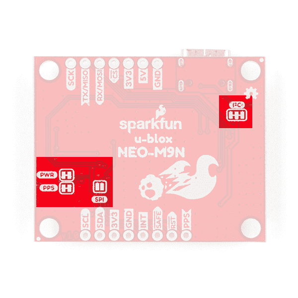](https://cdn.sparkfun.com/assets/learn_tutorials/1/1/0/2/Jumpers.jpg)

### 芯片天线、U.FL 或 SMA

带芯片天线的 SparkFun GPS NEO-M9N 在其左侧 Qwiic 连接器附近有一个 GNSS 天线，而其兄弟姐妹有一个 U.FL 和 SMA 连接器，您可以在其中连接贴片天线。

| [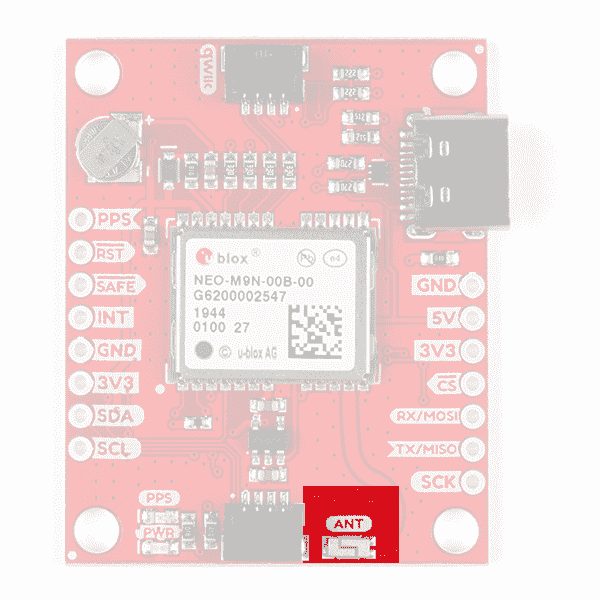](https://cdn.sparkfun.com/assets/learn_tutorials/1/1/0/2/Antenna.jpg) | [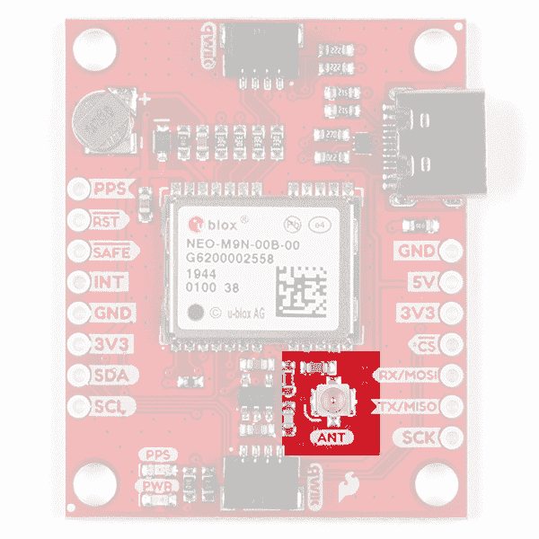](https://cdn.sparkfun.com/assets/learn_tutorials/1/1/0/2/UFL.jpg) | [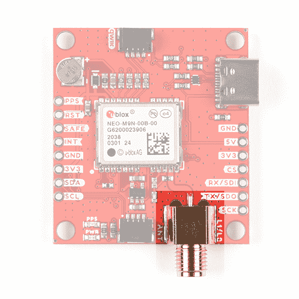](https://cdn.sparkfun.com/assets/learn_tutorials/1/1/0/2/SMA.jpg) |
| **芯片天线** | **U.FL** | **SMA** |

### Qwiic 和 I ² C

有两个标记为`SDA`和`SCL`的引脚，表示 I ² C 数据线。同样，您可以使用任何一个 Qwiic 连接器来提供电源并利用 I²c。[Qwiic 生态系统](https://www.sparkfun.com/qwiic)通过消除焊接需求来实现快速原型制作。您只需将 qw IC 电缆插入 qw IC 连接器，瞧！

[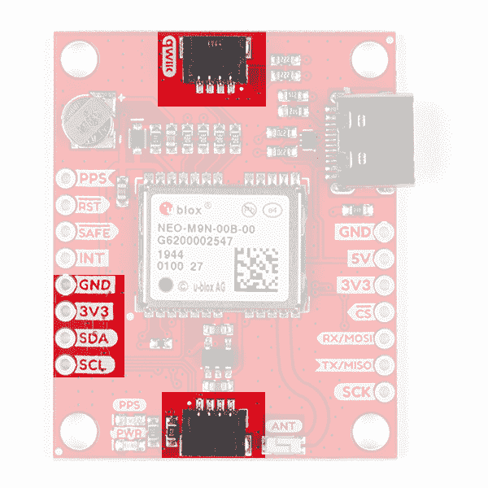](https://cdn.sparkfun.com/assets/learn_tutorials/1/1/0/2/Qwiic_I2C_Header.jpg)The only I²C address for this and all u-Blox GPS products is **0x42**, though each can have their address changed through software.

### 精力

最右侧的接头上有四个引脚，标有相应的 SPI 功能。如跳线部分所述，您需要关闭底部的`SPI`跳线来启用 SPI。

[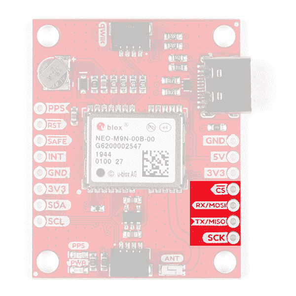](https://cdn.sparkfun.com/assets/learn_tutorials/1/1/0/2/SPI.jpg)

### 通用非同步收发传输器(Universal Asynchronous Receiver/Transmitter)

最右边的接头上有两个引脚，标记为 UART 功能。

[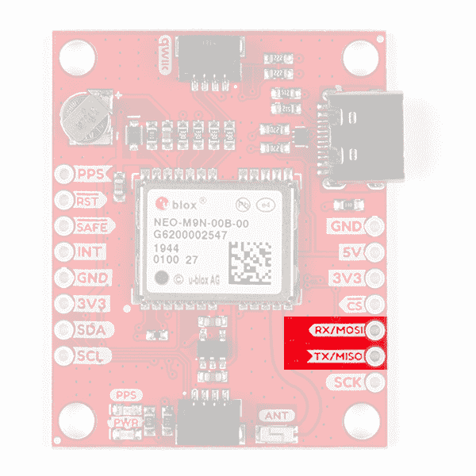](https://cdn.sparkfun.com/assets/learn_tutorials/1/1/0/2/UART.jpg)

### 折断的针脚

还有另外四个引脚:每秒脉冲(`PPS`)、复位(`RST`)、安全引导(`SAFE`)，最后是中断引脚(`INT`)。第一个引脚`PPS`，输出与 GPS 或 UTC 时间网格同步的脉冲序列。信号默认为每秒一次，但可以在很大范围内配置。阅读[参考资料中的 **u-blox 接收器协议规范**并进一步阅读](https://learn.sparkfun.com/tutorials/sparkfun-gps-neo-m9n-hookup-guide#resources-and-going-further)选项卡以了解更多信息。reset 引脚复位芯片。下一个引脚`SAFE`用于在安全引导模式下启动 IC，如果您设法破坏了模块的闪存，这可能会很有用。最后一个引脚`INT`可用于将芯片从省电模式中唤醒。

[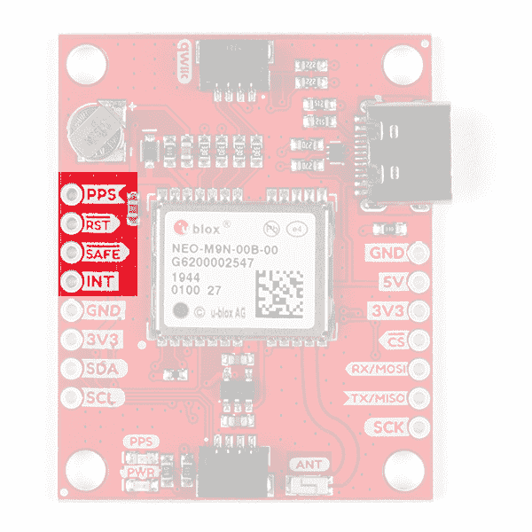](https://cdn.sparkfun.com/assets/learn_tutorials/1/1/0/2/Broken_Out_Pins.jpg)

### 电路板尺寸

总的来说，这些主板的尺寸为 1.30 英寸 x1.60 英寸。除了 SMD 芯片天线和 u.FL 连接器之外，大多数组件的位置是相同的。

| [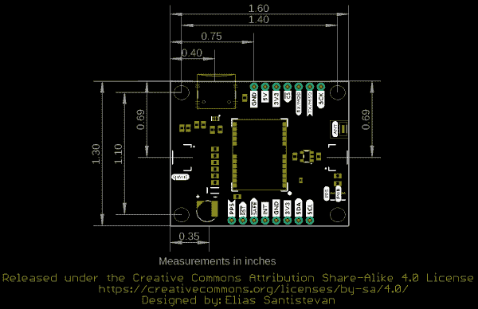](https://cdn.sparkfun.com/assets/1/f/a/5/c/SparkFun_GPS_NEO_M9N_Chip_Antenna_Board_Dimensions.png) | [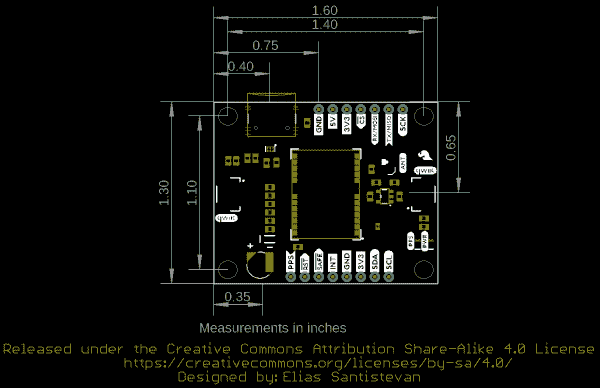](https://cdn.sparkfun.com/assets/e/9/0/b/b/SparkFun_GPS_NEO_M9N_uFL_Board_Dimensions.png) | [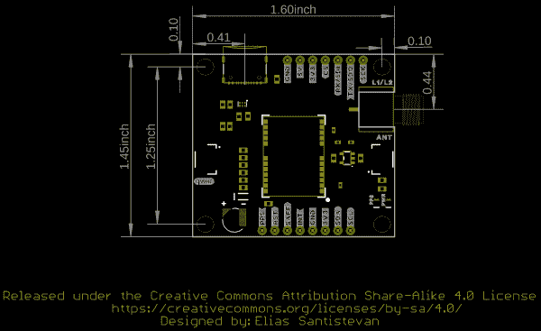](https://cdn.sparkfun.com/assets/9/d/b/0/9/SparkFun_GPS_NEO_M9N_SMA_Board_Dimensions.png) |
| *芯片天线版本* | *u.FL 版本* | *SMA 版本* |

*Click on image for a closer view.*

### GPS 功能

SparkFun NEO-M9N 能够同时连接多达四个不同的 GNSS 星座，使其大小非常准确。下面列出了 GPS 单元在连接到多个 GNSS 星座和单个 T2 星座时的能力。

| 星座 |  | GPS+GLO+GAL+BDS | GPS+GLONASS+GAL | GPS+GLO | GPS+BDS | GPS+GAL |
| **水平位置精度** |  | 2m | 2m | 2m | 2m | 2m |
| **最大导航更新率** | PVT | 25Hz | 25Hz | 25Hz | 25Hz | 25Hz |
| **首次定位时间** | 冷启动 | 24s | 25s | 26s | 28s | 29 岁 |
|  | 热起动 | 2s | 2s | 2s | 2s | 2s |
| **灵敏度** | 跟踪和导航 | -167dBm | -167dBm | -167dBm | -1667dBm | -166dBm |
|  | 重新获得 | -160dBm | -160dBm | -160dBm | -160dBm | -160dBm |
|  | 冷启动 | -148dBm | -148dBm | -148dBm | -148dBm | -148dBm |
|  | 热起动 | -159dBm | -159dBm | -159dBm | -159dBm | -159dBm |
| **速度精度** |  | 0.05 米/秒 | 0.05 米/秒 | 0.05 米/秒 | 0.05 米/秒 | 0.05 米/秒 |
| **航向精度** |  | 0.3 摄氏度 | 0.3 摄氏度 | 0.3 摄氏度 | 0.3 摄氏度 | 0.3 摄氏度 |

使用**单 GNSS 星座**时:

| 星座 |  | 全球（卫星）定位系统 | GLONASS | 北斗 | “伽利略”号 |
| **水平位置精度** |  | 2m | 4m | 3m | 3m |
| **最大导航更新率** | PVT | 25Hz | 25Hz | 25Hz | 25Hz |
| **首次定位时间** | 冷启动 | 29 岁 | 27s | 32s | 42s |
|  | 热起动 | 2s | 2s | 2s | 2s |
| **灵敏度** | 跟踪和导航 | -166dBm | -164dBm | -160dBm | -159dBm |
|  | 重新获得 | -160dBm | -155dBm | -157dBm | -154dBm |
|  | 冷启动 | -148dBm | -145dBm | -145dBm | -140dBm |
|  | 热起动 | -159dBm | -156dBm | -159dBm | -154dBm |
| **速度精度** |  | 0.05 米/秒 | 0.05 米/秒 | 0.05 米/秒 | 0.05 米/秒 |
| **航向精度** |  | 0.3 摄氏度 | 0.3 摄氏度 | 0.3 摄氏度 | 0.3 摄氏度 |

## 硬件装配

对于这个例子，我使用了一个支持 Qwiic 的[红板](https://www.sparkfun.com/products/15123)和[相关的 USB 电缆](https://www.sparkfun.com/products/10215)。用 Qwiic 电缆连接电路板，组装非常简单。在 RedBoard 和带芯片天线的 SparkFun NEO-M9N 之间插一根 Qwiic 线缆就行了！同样容易的是，我可以使用带有 U.FL 连接器的版本，并将我们的一个贴片天线插入 GPS 板。如果你需要插入 U.FL 连接器的技巧，那么看看我们的 [U.FL 教程](https://learn.sparkfun.com/tutorials/three-quick-tips-about-using-ufl)。如果您要将焊接到 I ² C 功能的通孔引脚，那么只需将线连接到电源、地线，并将 I ² C 数据线连接到您选择的微控制器。

[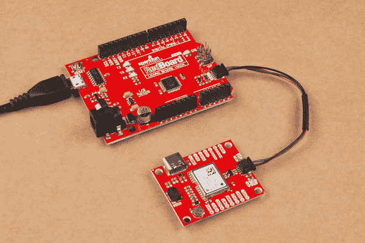](https://cdn.sparkfun.com/assets/learn_tutorials/1/1/0/2/Hookup_Guide.jpg)

对于与外部天线的安全连接，我们建议使用 SMA 版本。

[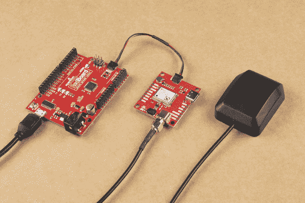](https://cdn.sparkfun.com/assets/learn_tutorials/1/1/0/2/NEO-M9N_SMA.jpg)

## SparkFun u-blox Arduino 图书馆

**Note:** This example assumes you are using the latest version of the Arduino IDE on your desktop. If this is your first time using Arduino, please review our tutorial on [installing the Arduino IDE.](https://learn.sparkfun.com/tutorials/installing-arduino-ide) If you have not previously installed an Arduino library, please check out our [installation guide.](https://learn.sparkfun.com/tutorials/installing-an-arduino-library)

我们所有的基于 u-blox 的 GPS 板共享同一个库:这两个板，它们的[前置](https://learn.sparkfun.com/tutorials/sparkfun-gps-breakout-zoe-m8q-and-sam-m8q-hookup-guide)和更高的[精度](https://www.sparkfun.com/products/15005) [u-blox 表兄弟](https://www.sparkfun.com/products/15136)。SparkFun u-blox Arduino 库可以通过搜索' **SparkFun u-blox GNSS** '使用 Arduino 库管理器下载，或者您可以从 [GitHub 库](https://github.com/sparkfun/SparkFun_u-blox_GNSS_Arduino_Library)中抓取 zip 文件来手动安装。：

[SparkFun U-blox Arduino Library (ZIP)](https://github.com/sparkfun/SparkFun_u-blox_GNSS_Arduino_Library/archive/main.zip)

这里提供了 13 个例子来帮助你从太空中接收信息。我们将在本教程中复习一个例子。

**Note:** Example 2 uses the '**MicroNMEA**' library by **Steve Marple**. Make sure to install the library as well by searching for it in the Arduino library manager. You could also grab the zip here from the [GitHub repository](https://github.com/stevemarple/MicroNMEA) to manually install.

[MicroNMEA Arduino Library (ZIP)](https://github.com/stevemarple/MicroNMEA/archive/master.zip)

## 示例代码

我们只看示例二(即“ **Example2_NMEAParsing.ino** ”)，在我看来，它清楚地表明了这些 GPS 接收机的神奇之处。也就是说，与卫星对话，找出你在世界上的什么地方。

```
language:c
#include <Wire.h> //Needed for I2C to GPS

#include "SparkFun_u-blox_GNSS_Arduino_Library.h" //Click here to get the library: http://librarymanager/All#SparkFun_u-blox_GNSS
SFE_UBLOX_GNSS myGNSS;

void setup()
{
  Serial.begin(115200);
  Serial.println("SparkFun u-blox Example");

  Wire.begin();

  if (myGNSS.begin() == false)
  {
    Serial.println(F("u-blox GNSS module not detected at default I2C address. Please check wiring. Freezing."));
    while (1);
  }

  //This will pipe all NMEA sentences to the serial port so we can see them
  myGNSS.setNMEAOutputPort(Serial);
}

void loop()
{
  myGNSS.checkUblox(); //See if new data is available. Process bytes as they come in.

  delay(250); //Don't pound too hard on the I2C bus
} 
```

当你上传这段代码时，你需要等待 29 秒才能锁定任何卫星。在第一次锁定之后，板上的备用电池将为一些内部系统提供电力，这将允许下次打开板时进行**热启动**。**热启动**只持续四个小时，但允许你在一秒钟内锁定。锁定后，[串行终端](https://learn.sparkfun.com/tutorials/terminal-basics/arduino-serial-monitor-windows-mac-linux)将开始列出经度和纬度坐标，如下图所示。确保将串行监视器设置为 **115200 波特**。

[](https://cdn.sparkfun.com/assets/learn_tutorials/8/6/9/nmeaCapture-ublox2.jpg)*These are the coordinates for SparkFun HQ*

## 资源和更进一步

既然您已经成功地安装并运行了 GPS 接收器，那么是时候将它整合到您自己的项目中了！有关更多信息，请查看以下资源:

*   **带芯片天线的 spark fun u-Blox NEO-M9N**
    *   [示意图(PDF)](https://cdn.sparkfun.com/assets/learn_tutorials/1/1/0/2/SparkFun_GPS_NEO_M9N_ANT_Schematic.pdf)
    *   [老鹰文件(ZIP)](https://cdn.sparkfun.com/assets/learn_tutorials/1/1/0/2/SparkFun_GPS_Chip_Antenna_Eagle_FIles.zip)
    *   [电路板尺寸](https://cdn.sparkfun.com/assets/1/f/a/5/c/SparkFun_GPS_NEO_M9N_Chip_Antenna_Board_Dimensions.png)
*   **带 U.FL 连接器的 spark fun U-Blox NEO-M9N**
    *   [示意图(PDF)](https://cdn.sparkfun.com/assets/learn_tutorials/1/1/0/2/SparkFun_GPS_NEO_M9N_uFL_Schematic.pdf)
    *   [老鹰文件(ZIP)](https://cdn.sparkfun.com/assets/learn_tutorials/1/1/0/2/SparkFun_GPS_NEO_M9N_uFL.zip)
    *   [电路板尺寸](https://cdn.sparkfun.com/assets/e/9/0/b/b/SparkFun_GPS_NEO_M9N_uFL_Board_Dimensions.png)
*   **带 SMA 连接器的 spark fun u-Blox NEO-M9N**
    *   [示意图](https://cdn.sparkfun.com/assets/d/5/7/2/2/SparkFun_GPS_NEO-M9N_SMA_Schematic.pdf)
    *   [老鹰档案](https://cdn.sparkfun.com/assets/b/0/a/6/4/SparkFun_GPS_NEO_M9N_SMA.zip)
    *   [电路板尺寸](https://cdn.sparkfun.com/assets/9/d/b/0/9/SparkFun_GPS_NEO_M9N_SMA_Board_Dimensions.png)
*   **u-blox 模块文档**
    *   [NEO-M9N 数据表(PDF)](https://cdn.sparkfun.com/assets/learn_tutorials/1/1/0/2/NEO-M9N_DataSheet__UBX-19014285_.pdf)
    *   [方案摘要(PDF)](https://cdn.sparkfun.com/assets/a/7/8/6/d/NEO-M9N_ProductSummary__UBX-19027207_.pdf)
    *   [集成手册(PDF)](https://cdn.sparkfun.com/assets/5/d/7/8/3/NEO-M9N_Integrationmanual__UBX-19014286_.pdf)
    *   [u-blox 协议规范(PDF)](https://cdn.sparkfun.com/assets/learn_tutorials/8/6/9/u-blox8-M8_ReceiverDescrProtSpec__UBX-13003221__Public.pdf)
    *   [优信软件](https://www.u-blox.com/en/product/u-center)
*   **GitHub**
    *   [产品回购](https://github.com/sparkfun/SparkFun_u-Blox_NEO_M9N)
    *   [SparkFun u-blox GNSS Arduino 库](https://github.com/sparkfun/SparkFun_u-blox_GNSS_Arduino_Library)
    *   [SFE 产品展示区](https://www.youtube.com/watch?v=JwfEUatEebY)

你正在寻找一个具有*疯狂*10 毫米 3D 精度的 GPS 接收器吗，那么看看下面左边的 SparkFun 的另外两个基于 u-Blox 的 GPS 板(ZED-F9P 和 NEO-M8P-2)。需要一个更小更紧凑的 GPS 单元，但不需要那么高的刷新率，看看右边的 ZOE-M8Q 和 SAM-M8Q。

[](https://www.sparkfun.com/products/15136) 

将**添加到您的[购物车](https://www.sparkfun.com/cart)中！**

 **### [【spark fun GPS-RTK 2 Board-ZED-F9P(Qwiic)](https://www.sparkfun.com/products/15136)

[In stock](https://learn.sparkfun.com/static/bubbles/ "in stock") GPS-15136

SparkFun GPS-RTK2 是 ZED-F9P 模块的一个强大突破。ZED-F9P 是 GNSS 和 GPS 系统的顶级模块

$274.9521[Favorited Favorite](# "Add to favorites") 61[Wish List](# "Add to wish list")****[](https://www.sparkfun.com/products/15005) 

将**添加到您的[购物车](https://www.sparkfun.com/cart)中！**

 **### [【spark fun GPS-RTK 板- NEO-M8P-2 (Qwiic)](https://www.sparkfun.com/products/15005)

[In stock](https://learn.sparkfun.com/static/bubbles/ "in stock") GPS-15005

SparkFun GPS-RTK 板是 u-blox NEO-M8P-2 模块的一个强大突破。NEO-M8P-2 是一款顶级的移动…

$264.956[Favorited Favorite](# "Add to favorites") 22[Wish List](# "Add to wish list")****[](https://www.sparkfun.com/products/15210) 

将**添加到您的[购物车](https://www.sparkfun.com/cart)中！**

 **### [【spark fun】GPS 分线芯片天线，SAM-M8Q (Qwiic)](https://www.sparkfun.com/products/15210)

[In stock](https://learn.sparkfun.com/static/bubbles/ "in stock") GPS-15210

SparkFun SAM-M8Q GPS Breakout 是一款高质量的 GPS 板，具有同样令人印象深刻的配置选项。

$42.954[Favorited Favorite](# "Add to favorites") 17[Wish List](# "Add to wish list")****[](https://www.sparkfun.com/products/15193) 

将**添加到您的[购物车](https://www.sparkfun.com/cart)中！**

 **### [【spark fun GPS Breakout-ZOE-M8Q(Qwiic)](https://www.sparkfun.com/products/15193)

[In stock](https://learn.sparkfun.com/static/bubbles/ "in stock") GPS-15193

SparkFun ZOE-M8Q GPS Breakout 是一款高精度、小型化的 GPS 板，非常适合不支持

$49.957[Favorited Favorite](# "Add to favorites") 8[Wish List](# "Add to wish list")******** ********你的下一个项目需要一些灵感吗？查看一些相关教程:

[](https://learn.sparkfun.com/tutorials/arduino-weather-shield-hookup-guide-v12) [### Arduino 天气防护罩连接指南 V12](https://learn.sparkfun.com/tutorials/arduino-weather-shield-hookup-guide-v12) Read humidity, pressure and luminosity quickly and easily. Add wind speed, direction and rain gauge for full weather station capabilities.[Favorited Favorite](# "Add to favorites") 13[](https://learn.sparkfun.com/tutorials/gps-rtk-hookup-guide) [### GPS-RTK 连接指南](https://learn.sparkfun.com/tutorials/gps-rtk-hookup-guide) Find out where you are! Use this easy hook-up guide to get up and running with the SparkFun high precision GPS-RTK NEO-M8P-2 breakout board.[Favorited Favorite](# "Add to favorites") 5[](https://learn.sparkfun.com/tutorials/lte-cat-m1nb-iot-shield-hookup-guide) [### LTE 卡特彼勒 M1/NB-IoT 屏蔽连接指南](https://learn.sparkfun.com/tutorials/lte-cat-m1nb-iot-shield-hookup-guide) The SparkFun LTE CAT M1/NB-IoT Shield equips your Arduino or Arduino-compatible microcontroller with access to data networks across the globe. This shield adds wireless, high-bandwidth cellular functionality to your IoT project 3[](https://learn.sparkfun.com/tutorials/sparkfun-rtk-surveyor-hookup-guide) [### SparkFun RTK 测量员连接指南](https://learn.sparkfun.com/tutorials/sparkfun-rtk-surveyor-hookup-guide) Learn how to use the enclosed RTK Surveyor product to achieve millimeter level geospatial coordinates.[Favorited Favorite](# "Add to favorites") 9**************************************