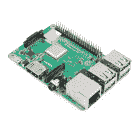
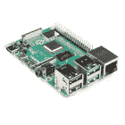
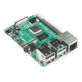
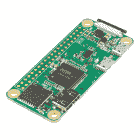
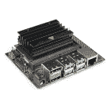
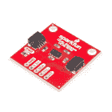
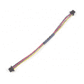

# 用于 Raspberry Pi 连接指南的 Qwiic 垫片

> 原文：<https://learn.sparkfun.com/tutorials/qwiic-shim-for-raspberry-pi-hookup-guide>

## 介绍

用于 Raspberry Pi 的 SparkFun Qwiic 垫片是一个小型的、易于拆卸的突破，可以为您的 Raspberry Pi 添加 Qwiic 连接器。垫片(中间推挤硬件的缩写)设计允许您直接插入 Pi 的 I ² C 总线，无需焊接，薄 PCB 设计允许它与其他帽子一起夹在您的 Pi GPIO 上。当你不需要 [Qwiic pHAT for Raspberry Pi](https://www.sparkfun.com/products/15351) 的全部功能时，或者如果你想给你的 Pi 添加一个 Qwiic 连接器，但没有空间容纳另一个帽子时，Qwiic SHIM 非常有用。

[](https://www.sparkfun.com/products/15794) 

将**添加到您的[购物车](https://www.sparkfun.com/cart)中！**

 **### [树莓派的 SparkFun Qwiic 垫片](https://www.sparkfun.com/products/15794)

[In stock](https://learn.sparkfun.com/static/bubbles/ "in stock") DEV-15794

spark fun Qwiic SHIM for Raspberry Pi 是一个小型、易于拆卸的突破，可以轻松地将 qw IIC 连接器添加到您的 Ras…

$1.0512[Favorited Favorite](# "Add to favorites") 18[Wish List](# "Add to wish list")** **[https://www.youtube.com/embed/6Td8FWDbB64/?autohide=1&border=0&wmode=opaque&enablejsapi=1](https://www.youtube.com/embed/6Td8FWDbB64/?autohide=1&border=0&wmode=opaque&enablejsapi=1)

### 所需材料

要跟随本教程，您将需要以下材料。你可能不需要所有的东西，这取决于你拥有什么。将它添加到您的购物车，通读指南，并根据需要调整购物车。

#### 单板计算机

你需要安装有 2x20 外螺纹接头的树莓皮。

[](https://www.sparkfun.com/products/14643) 

### [树莓派 3 B+](https://www.sparkfun.com/products/14643)

[Out of stock](https://learn.sparkfun.com/static/bubbles/ "out of stock") DEV-14643

Raspberry Pi 3 B+在这里为您提供与以前相同的 Pi，但现在具有千兆位和 PoE 能力的以太网！

35[Favorited Favorite](# "Add to favorites") 75[Wish List](# "Add to wish list")[](https://www.sparkfun.com/products/15446) 

### [【树莓派 4 型号 B (2 GB)](https://www.sparkfun.com/products/15446)

[Out of stock](https://learn.sparkfun.com/static/bubbles/ "out of stock") DEV-15446

2 GB Raspberry Pi 4 具有运行两个 4k 分辨率显示器的能力，以运行真正的千兆位以太网操作，所有…

4[Favorited Favorite](# "Add to favorites") 119[Wish List](# "Add to wish list")[](https://www.sparkfun.com/products/15447) 

### [树莓派 4 型号 B (4 GB)](https://www.sparkfun.com/products/15447)

[Out of stock](https://learn.sparkfun.com/static/bubbles/ "out of stock") DEV-15447

4 GB Raspberry Pi 4 具有运行两个 4k 分辨率显示器的能力，以运行真正的千兆以太网操作，所有…

17[Favorited Favorite](# "Add to favorites") 173[Wish List](# "Add to wish list")

Pi Zero W 也可以，但是你需要确保[焊接](https://learn.sparkfun.com/tutorials/how-to-solder-through-hole-soldering)一些[插头](https://www.sparkfun.com/products/14275)到上面。

[](https://www.sparkfun.com/products/14275) 

将**添加到您的[购物车](https://www.sparkfun.com/cart)中！**

 **### [树莓 Pi GPIO 公头- 2x20](https://www.sparkfun.com/products/14275)

[In stock](https://learn.sparkfun.com/static/bubbles/ "in stock") PRT-14275

这种 2x20 公接头具有与树莓派相同的引脚数量和间距，但最好在与

$1.05[Favorited Favorite](# "Add to favorites") 18[Wish List](# "Add to wish list")****[](https://www.sparkfun.com/products/14277) 

### [树莓派零 W](https://www.sparkfun.com/products/14277)

[Out of stock](https://learn.sparkfun.com/static/bubbles/ "out of stock") DEV-14277

Raspberry Pi Zero W 仍然是你所知道和喜爱的 Pi，但尺寸大大缩小，只有 65 毫米长，30 毫米宽，而且…

44[Favorited Favorite](# "Add to favorites") 111[Wish List](# "Add to wish list")** **或者，您可以将其连接到任何采用 40 引脚 Raspberry Pi GPIO 接头的单板计算机(如 NVIDIA Jetson Nano)。

[](https://www.sparkfun.com/products/retired/15297) 

### [NVIDIA Jetson Nano 开发者套件](https://www.sparkfun.com/products/retired/15297)

[Retired](https://learn.sparkfun.com/static/bubbles/ "Retired") DEV-15297

NVIDIA Jetson Nano 开发套件以小尺寸、低功耗提供运行现代人工智能工作负载的性能…

13 **Retired**[Favorited Favorite](# "Add to favorites") 24[Wish List](# "Add to wish list") 

### 谷歌珊瑚开发委员会

[Retired](https://learn.sparkfun.com/static/bubbles/ "Retired") DEV-15318

谷歌的机器学习开发板。

2 **Retired**

#### Qwiic 板

如果你没有任何 Qwiic 产品与之配合使用，你可能不会购买 Qwiic SHIM，对吗？如果你没有任何 Qwiic 产品，以下可能是一个不错的开始。

[](https://www.sparkfun.com/products/15440) 

将**添加到您的[购物车](https://www.sparkfun.com/cart)中！**

 **### [【spark fun 大气传感器 Breakout - BME280 (Qwiic)](https://www.sparkfun.com/products/15440)

[In stock](https://learn.sparkfun.com/static/bubbles/ "in stock") SEN-15440

SparkFun BME280 大气传感器 Breakout 是一种测量大气压力、湿度和温度读数的简单方法…

$16.502[Favorited Favorite](# "Add to favorites") 26[Wish List](# "Add to wish list")****[](https://www.sparkfun.com/products/14532) 

将**添加到您的[购物车](https://www.sparkfun.com/cart)中！**

 **### [【spark fun 微有机发光二极管突围(Qwiic)](https://www.sparkfun.com/products/14532)

[In stock](https://learn.sparkfun.com/static/bubbles/ "in stock") LCD-14532

SparkFun Qwiic 微型有机发光二极管突破是 Qwiic 启用版本的流行微视图和微型有机发光二极管显示器！

$18.506[Favorited Favorite](# "Add to favorites") 45[Wish List](# "Add to wish list")****[](https://www.sparkfun.com/products/15177) 

将**添加到您的[购物车](https://www.sparkfun.com/cart)中！**

 **### [【spark fun 接近传感器分线点- 20cm，VCNL4040 (Qwiic)](https://www.sparkfun.com/products/15177)

[In stock](https://learn.sparkfun.com/static/bubbles/ "in stock") SEN-15177

SparkFun 接近传感器分线点是一个简单的红外存在和环境光传感器，利用 VCNL4040。

$7.501[Favorited Favorite](# "Add to favorites") 18[Wish List](# "Add to wish list")****[](https://www.sparkfun.com/products/15290) 

将**添加到您的[购物车](https://www.sparkfun.com/cart)中！**

 **### [SparkFun Qwiic 键盘- 12 键](https://www.sparkfun.com/products/15290)

[In stock](https://learn.sparkfun.com/static/bubbles/ "in stock") COM-15290

SparkFun Qwiic 键盘完全组装，使添加 12 按钮键盘的开发过程变得简单。

$11.509[Favorited Favorite](# "Add to favorites") 45[Wish List](# "Add to wish list")******** ********最后，您将需要我们方便的 qw IC 电缆来轻松地将传感器连接到 qw IC 垫片。以下是几个选项。

[](https://www.sparkfun.com/products/14427) 

将**添加到您的[购物车](https://www.sparkfun.com/cart)中！**

 **### [Qwiic 线缆- 100mm](https://www.sparkfun.com/products/14427)

[In stock](https://learn.sparkfun.com/static/bubbles/ "in stock") PRT-14427

这是一条 100 毫米长的 4 芯电缆，带有 1 毫米 JST 端接。它旨在将支持 Qwiic 的组件连接在一起…

$1.50[Favorited Favorite](# "Add to favorites") 32[Wish List](# "Add to wish list")****[](https://www.sparkfun.com/products/14429) 

将**添加到您的[购物车](https://www.sparkfun.com/cart)中！**

 **### [Qwiic 线缆- 500mm](https://www.sparkfun.com/products/14429)

[In stock](https://learn.sparkfun.com/static/bubbles/ "in stock") PRT-14429

这是一根 500mm 长的 4 芯电缆，带有 1mm JST 端接。它旨在将支持 Qwiic 的组件连接在一起…

$1.951[Favorited Favorite](# "Add to favorites") 25[Wish List](# "Add to wish list")****[](https://www.sparkfun.com/products/14426) 

将**添加到您的[购物车](https://www.sparkfun.com/cart)中！**

 **### [Qwiic 线缆- 50mm](https://www.sparkfun.com/products/14426)

[In stock](https://learn.sparkfun.com/static/bubbles/ "in stock") PRT-14426

这是一根 50 毫米长的 4 芯电缆，带有 1 毫米 JST 端接。它旨在将支持 Qwiic 的组件连接在一起…

$0.95[Favorited Favorite](# "Add to favorites") 29[Wish List](# "Add to wish list")****[](https://www.sparkfun.com/products/14428) 

### [Qwiic 线缆- 200mm](https://www.sparkfun.com/products/14428)

[Out of stock](https://learn.sparkfun.com/static/bubbles/ "out of stock") PRT-14428

这是一根 200 毫米长的 4 芯电缆，带有 1 毫米 JST 端接。它旨在将支持 Qwiic 的组件连接在一起…

[Favorited Favorite](# "Add to favorites") 21[Wish List](# "Add to wish list")****** ******### 必需的设置工具

如果您将 Pi(或其他单板计算机)用作台式机，则需要以下外围设备:

*   USB 鼠标
*   USB 键盘
*   HDMI 监视器/电视
*   [5V 电源](https://www.sparkfun.com/products/13831)

### 推荐阅读

如果您不熟悉 Qwiic 系统，我们建议您阅读此处，了解 Qwiic 的所有内容:

| [](https://www.sparkfun.com/qwiic) |
| *[Qwiic 连接系统](https://www.sparkfun.com/qwiic)* |

如果你不熟悉以下教程中的内容，我们也建议你看一看。

[](https://learn.sparkfun.com/tutorials/i2c) [### I2C](https://learn.sparkfun.com/tutorials/i2c) An introduction to I2C, one of the main embedded communications protocols in use today.[Favorited Favorite](# "Add to favorites") 128[](https://learn.sparkfun.com/tutorials/terminal-basics) [### 串行终端基础知识](https://learn.sparkfun.com/tutorials/terminal-basics) This tutorial will show you how to communicate with your serial devices using a variety of terminal emulator applications.[Favorited Favorite](# "Add to favorites") 46[](https://learn.sparkfun.com/tutorials/raspberry-pi-3-starter-kit-hookup-guide) [### 树莓 Pi 3 入门套件连接指南](https://learn.sparkfun.com/tutorials/raspberry-pi-3-starter-kit-hookup-guide) Guide for getting going with the Raspberry Pi 3 Model B and Raspberry Pi 3 Model B+ starter kit.[Favorited Favorite](# "Add to favorites") 13[](https://learn.sparkfun.com/tutorials/getting-started-with-the-raspberry-pi-zero-wireless) [### Raspberry Pi Zero Wireless 入门](https://learn.sparkfun.com/tutorials/getting-started-with-the-raspberry-pi-zero-wireless) Learn how to setup, configure and use the smallest Raspberry Pi yet, the Raspberry Pi Zero - Wireless.[Favorited Favorite](# "Add to favorites") 17

## 硬件概述

Qwiic 垫片使用一种独特的基于摩擦的连接器，它可以楔入 GPIO 接头，实现安全、无焊连接。正如您所料，它有一个 Qwiic 连接器，连接到您的 Pi 的 I ² C 总线(SDA、SCL、5V 和地)。该垫片还具有一个 3.3V 调节器，因此它将与所有 Qwiic 设备一起工作。

[](https://cdn.sparkfun.com/assets/learn_tutorials/1/0/6/5/15794-SparkFun_Qwiic_SHIM_for_Raspberry_Pi-02.jpg)*Top View Photo of Qwiic SHIM*

### 压配接头

Qwiic 垫片上的压配合接头使您可以轻松地将 Qwiic 垫片放在 Pi(或其他带有 Pi GPIO 的单板计算机)上，将 Qwiic 垫片上的方形引脚与 GPIO 的引脚 1 对齐。GPIO 上的引脚 1 可以通过丝网印刷上的方形引脚或斜角来识别。我们将在硬件连接部分更详细地讨论这一点。

[](https://cdn.sparkfun.com/assets/learn_tutorials/1/0/6/5/15794-SparkFun_Qwiic_SHIM_for_Raspberry_Pi-PressFitHeader.jpg)*Press Fit Header*

### 稳压器

对于那些精明的读者来说，你可能想知道为什么不直接连接到 Pi GPIO 上的 3.3V 供电轨？一个简单的答案是，Pi 的 5V 轨能够提供比 3.3V 轨更多的电流，因此调节器允许您将更多的器件连接到 I ² C 总线，而无需担心 Pi 过载。片上 AP2112K 3.3V 稳压器为所有连接的 Qwiic 器件提供干净的 3.3V 输出，可提供高达 600mA@3.3V 的电流，因此 Qwiic 项目应有充足的可用电流。

[](https://cdn.sparkfun.com/assets/learn_tutorials/1/0/6/5/15794-SparkFun_Qwiic_SHIM_Raspberry_Pi-VoltageRegulator.jpg)*Voltage Regulator*

### 电路板尺寸

[](https://cdn.sparkfun.com/assets/learn_tutorials/1/0/6/5/Qwiic_SHIM_Dimensions.png)*Eagle File Photo with dimensions*

## 硬件连接

开始使用 Qwiic SHIM 是一件轻而易举的事情(实际上，它更像是一种推动，但你会明白的)。确保将 Qwiic 垫片的引脚 1 与 Pi 的 GPIO 接头上的引脚 1 对齐，将 Qwiic 垫片向下压到接头上。Qwiic 垫片和 Pi GPIO 上的引脚 1 将标有方形引脚。Pi GPIO 头上还有一个斜角，指示从 Pi 顶部开始的引脚 1。就是这样！有了垫片，你现在可以把所有的 Qwiic 设备连接到你的 Pi 上，并为其他 Pi 帽子留出空间。

⚡ **Warning!** When connecting the Qwiic SHIM to your GPIO header, make sure to align it properly with Pin 1\. If the Qwiic SHIM is not aligned properly (either if it is upside down or not aligned on the correct pins) you can short your 5V rail to Ground!
[](https://cdn.sparkfun.com/assets/learn_tutorials/4/2/4/highlight.jpg)*GPIO Configuration for old and new model Raspberry Pi from the [Raspberry Pi GPIO Tutorial](https://learn.sparkfun.com/tutorials/raspberry-gpio/#gpio-pinout).*

将 Qwiic 垫片安装在 Pi 上后，它看起来应该是这样的:

| [](https://cdn.sparkfun.com/assets/learn_tutorials/1/0/6/5/Qwiic_SHIM_Raspberry_Pi_MountedWithCable_Pi4.jpg) | [](https://cdn.sparkfun.com/assets/learn_tutorials/1/0/6/5/Qwiic_SHIM_Raspberry_Pi_Mounted_PiZero.jpg) |
| 安装在桥墩 4 上的 Qwiic 垫片。 | *安装在 Pi Zero W 上的 Qwiic 垫片* |

有了 Qwiic 垫片，你就可以把所有你想要的帽子叠放在上面了。垫片顶部有一个帽，压配合接头将实现更好的连接，薄 PCB 允许任何帽仍然完全连接到 GPIO 接头。

[](https://cdn.sparkfun.com/assets/learn_tutorials/1/0/6/5/Qwiic_SHIM_Raspberry_Pi4_PulsedRadar.jpg)*The Qwiic SHIM is seen here nicely wedged by the [SparkFun Pulsed Radar Breakout](https://www.sparkfun.com/products/15577)*[](https://cdn.sparkfun.com/assets/learn_tutorials/1/0/6/5/Qwiic_SHIM_Raspberry_PiZeroW_ServoShield.jpg)*And here you can see it shoved in the middle with the [SparkFun Pi Servo HAT](https://www.sparkfun.com/products/14328).***Note:** The Qwiic SHIM can also be connected in the same way with single board computers (like the [NVIDIA Jetson Nano](https://www.sparkfun.com/products/15297) or the [Google Coral](https://www.sparkfun.com/products/15318)) that utilize the 40-pin Raspberry Pi header footprint. Just remember to make sure you are aligning it properly!

## 获得操作系统

我们建议查看 Raspberry Pi 4 连接指南，以[安装操作系统](https://learn.sparkfun.com/tutorials/raspberry-pi-4-kit-hookup-guide#getting-an-os)并将图像刷新到您的 microSD 卡，以获得详细说明。

[](https://learn.sparkfun.com/tutorials/raspberry-pi-4-kit-hookup-guide) [### Raspberry Pi 4 套件连接指南

#### 2020 年 3 月 14 日](https://learn.sparkfun.com/tutorials/raspberry-pi-4-kit-hookup-guide) Guide for hooking up your Raspberry Pi 4 Model B basic, desktop, or hardware starter kit together.[Favorited Favorite](# "Add to favorites") 2

如果你从一张空白的 microSD 卡开始，你需要安装 Raspbian。如果您已经有了一个可以工作的 Raspbian 系统，请跳到下一节。请耐心等待——根据 microSD 卡的速度，每个步骤都可能需要一段时间。

1.  **下载映像** —下载您最喜欢的 Linux 发行版。对于初学者，我们建议获取 [NOOBS](https://www.raspberrypi.org/downloads/noobs/) 图像。
2.  **闪烁图像** —按照 [Raspberry Pi 4 套件连接指南的说明闪烁您的 microSD 卡](https://learn.sparkfun.com/tutorials/raspberry-pi-4-kit-hookup-guide/getting-an-os)。你也可以按照官方的树莓派[安装说明](https://www.raspberrypi.org/documentation/installation/)进行操作。

## 配置 Pi

默认情况下，外设不开启。对于那些使用支持 Qwiic 的设备的用户，您需要启用 I2C 端口。有两种方法可以调整设置。这在我们的[树莓派 I2C 教程](https://learn.sparkfun.com/tutorials/raspberry-pi-spi-and-i2c-tutorial)中有所概述。

[](https://learn.sparkfun.com/tutorials/raspberry-pi-spi-and-i2c-tutorial) [### 树莓派 SPI 和 I2C 教程

#### 2015 . 10 . 29](https://learn.sparkfun.com/tutorials/raspberry-pi-spi-and-i2c-tutorial) Learn how to use serial I2C and SPI buses on your Raspberry Pi using the wiringPi I/O library for C/C++ and spidev/smbus for Python.[Favorited Favorite](# "Add to favorites") 24

我们已经包含了教程中的以下说明。要启用它，请按照以下步骤操作。

#### 通过桌面 GUI 进行 Raspberry Pi 配置

 您可以通过进入 **Pi 开始菜单** > **偏好设置** > **树莓 Pi 配置**来使用桌面 GUI。

[](https://cdn.sparkfun.com/assets/learn_tutorials/4/4/9/Raspberry-Pi-Configuration-User-Settings-GUI.png)*Click on image for a closer view.*

将弹出一个带有不同选项卡的窗口来调整设置。我们感兴趣的是**界面**标签。点击选项卡，为 **I2C** 选择**使能**。此时，您可以根据项目需要启用其他接口。点击**确定**按钮，同样如此。

[](https://cdn.sparkfun.com/assets/learn_tutorials/4/4/9/Raspberry-Pi-Configuration-Enable-Interfaces.png)*Click on image for a closer view.*

我们建议重新启动您的 Pi 以确保更改生效。点击 **Pi 开始菜单** > **首选项** > **关机**。因为我们只需要重启，所以点击**重启**按钮。

|  | [](https://cdn.sparkfun.com/assets/learn_tutorials/4/4/9/Raspberry-Pi-Menu-Shutdown.png) |
| *关机* | *关机、重启、注销* |

*Click on images for a closer view.*

#### raspi-配置工具通过终端

同样，我们可以使用`raspi-config`来启用它。

1.  运行`sudo raspi-config`。
2.  使用向下箭头选择`5 Interfacing Options`
3.  向下箭头指向`P5 I2C`。
4.  当它要求您启用 I2C 时，选择`yes`
5.  如果询问是否自动加载内核模块，也选择`yes`。
6.  使用向右箭头选择`<Finish>`按钮。
7.  当它要求重启时，选择`yes`。

[](https://cdn.sparkfun.com/assets/learn_tutorials/4/4/9/i2c-menu2.png)*Raspi-config for I2C*

系统将重新启动。当它重新启动时，登录并输入以下命令

```
language:bash
ls /dev/*i2c* 
```

Pi 应该响应

```
language:bash
/dev/i2c-1 
```

它表示用户模式的 I2C 界面。

## 扫描 I2C 设备

如果你正在使用 Raspberry Pi 快速连接到 I ² C 设备，最好的开始是扫描总线上的 I ² C 设备。

### 公用事业

有一组命令行实用程序可以帮助 I2C 界面工作。你可以通过 apt 包管理器得到它们。

```
language:bash
sudo apt-get install -y i2c-tools 
```

特别是，`i2cdetect`程序将探测总线上的所有地址，并报告是否存在任何设备。在命令行中输入以下命令。`-y`标志将禁用交互模式，这样您就不必等待确认。`1`表示我们正在扫描 I ² C 总线 1 上的 I ² C 设备(如 i2c-1)。

```
language:bash
i2cdetect -y 1 
```

您将从您的 Raspberry Pi 获得类似于下面的输出。

```
language:bash
pi@raspberrypi:~/$ i2cdetect -y 1
     0  1  2  3  4  5  6  7  8  9  a  b  c  d  e  f
00:          -- -- -- -- -- -- -- -- -- -- -- -- --
10: -- -- -- -- -- -- -- -- -- -- -- -- -- -- -- --
20: -- -- -- -- -- -- -- -- -- -- -- -- -- -- -- --
30: -- -- -- -- -- -- -- -- -- -- -- -- -- -- -- --
40: -- -- -- -- -- -- -- -- -- -- -- -- -- -- -- --
50: -- -- -- -- -- -- -- -- -- -- -- -- -- -- -- --
60: 60 -- -- -- -- -- -- -- -- -- -- -- -- -- -- --
70: -- -- -- -- -- -- -- -- 
```

该图表明在地址 **0x60** 有一个外设。根据 I ² C 总线上连接的设备，您的地址可能会有所不同。对于高级用户，您可以尝试使用`i2cget`、`i2cset`和`i2cdump`命令来读写其寄存器。

### Qwiic 复制驱动程序

现在您已经在 Pi 上设置了 I ² C，您可以开始在您的 Pi 上编程您的 Qwiic 设备，或者如果您想从一些示例开始，我们在下面链接的 GitHub 资源库中提供了大量用于 Qwiic 的 Python 驱动程序。你可以在[这篇博文](https://www.sparkfun.com/news/2958)中阅读更多关于 Python for spark fun Qwiic 系统的内容。

[SparkFun Qwiic Py GitHub Repo](https://github.com/sparkfun/Qwiic_Py)

## 资源和更进一步

有关更多信息，请查看以下资源:

*   [示意图(PDF)](https://cdn.sparkfun.com/assets/8/b/0/f/0/Qwiic_Pi_SHIM_Schematic.pdf)
*   [老鹰文件(ZIP)](https://cdn.sparkfun.com/assets/e/b/f/8/6/Qwiic_Pi_SHIM_EagleFiles.zip)
*   [板尺寸(PNG)](https://cdn.sparkfun.com/assets/learn_tutorials/1/0/6/5/Qwiic_SHIM_Dimensions.png)
*   [GitHub 回购](https://github.com/sparkfun/Qwiic_Pi_SHIM)
*   [SFE 产品展示区](https://youtu.be/6Td8FWDbB64)

既然您已经准备好了 Qwiic SHIM，是时候看看一些支持 Qwiic 的产品了。

[](https://www.sparkfun.com/products/14844) 

将**添加到您的[购物车](https://www.sparkfun.com/cart)中！**

 **### [【spark fun 红外阵列突破- 55 度 FOV，MLX90640 (Qwiic)](https://www.sparkfun.com/products/14844)

[In stock](https://learn.sparkfun.com/static/bubbles/ "in stock") SEN-14844

mlx 90640 spark fun IR Array Breakout 配备了一个 55 FOV、32x24 阵列的热电堆传感器，创建了一个低分辨率…

$74.954[Favorited Favorite](# "Add to favorites") 14[Wish List](# "Add to wish list")****[](https://www.sparkfun.com/products/15712) 

将**添加到您的[购物车](https://www.sparkfun.com/cart)中！**

 **### [【spark fun GPS Breakout-NEO-M9N，U.FL (Qwiic)](https://www.sparkfun.com/products/15712)

[In stock](https://learn.sparkfun.com/static/bubbles/ "in stock") GPS-15712

SparkFun NEO-M9N GPS Breakout 是一款高质量的 GPS 板，具有同样令人印象深刻的配置选项。

$69.954[Favorited Favorite](# "Add to favorites") 12[Wish List](# "Add to wish list")****[](https://www.sparkfun.com/products/16988) 

将**添加到您的[购物车](https://www.sparkfun.com/cart)中！**

 **### [spark fun QwiicBus-EndPoint](https://www.sparkfun.com/products/16988)

[In stock](https://learn.sparkfun.com/static/bubbles/ "in stock") COM-16988

SparkFun QwiicBus 端点是扩展 I2C 通信总线范围的最快和最简单的方法。

$11.953[Favorited Favorite](# "Add to favorites") 11[Wish List](# "Add to wish list")****[](https://www.sparkfun.com/products/17273) 

将**添加到您的[购物车](https://www.sparkfun.com/cart)中！**

 **### [spark fun quick logic Thing Plus-EOS S3](https://www.sparkfun.com/products/17273)

[In stock](https://learn.sparkfun.com/static/bubbles/ "in stock") DEV-17273

spark fun quick logic Thing Plus EOS S3 是一款小型系统，非常适合实现下一代低功耗…

$49.50[Favorited Favorite](# "Add to favorites") 11[Wish List](# "Add to wish list")******** ********如果你不确定从哪种 Qwiic 设备开始，请查看带有 9DoF 和 SerLCD 的[Qwiic SHIM Kit hook up Guide for Raspberry Pi](https://learn.sparkfun.com/tutorials/qwiic-shim-kit-hookup-guide-for-raspberry-pi)了解更多信息。

[](https://learn.sparkfun.com/tutorials/qwiic-shim-kit-for-raspberry-pi-hookup-guide) [### 用于 Raspberry Pi 连接指南的 Qwiic 垫片套件

#### 2021 年 2 月 16 日](https://learn.sparkfun.com/tutorials/qwiic-shim-kit-for-raspberry-pi-hookup-guide) Get started with the Serial LCD with RGB backlight and 9DoF IMU (ICM-20948) via I2C using the Qwiic system and Python on a Raspberry Pi! Take sensor readings and display them in the serial terminal or SerLCD.[Favorited Favorite](# "Add to favorites") 0

### 但是我已经有传感器了！

如果你已经有一把 SparkFun 传感器和零件？多年来，SparkFun 一直在我们所有的 I2C 板上安装我们的标准 GND/VCC/SDA/SCL 引脚排列。这使得它可以连接一个 Qwiic 适配器，将您的 SparkFun I ² C 传感器或执行器安装到 Qwiic 系统上。

以下是具有标准 I ² C 引脚排列并将与 [Qwiic 适配板](https://www.sparkfun.com/products/14495)配合使用的主板列表:

*   [9DoF Stick IMU - LSM9DS1](https://www.sparkfun.com/products/13944)
*   [9 自由度 IMU - MPU-9250](https://www.sparkfun.com/products/13762)
*   [6 自由度 IMU - LSM303C](https://www.sparkfun.com/products/13303)
*   [6 自由度 IMU - LSM6DS3](https://www.sparkfun.com/products/13339)
*   [三轴加速度计- LIS3DH](https://www.sparkfun.com/products/13963)
*   [三轴磁力仪- MAG3110](https://www.sparkfun.com/products/12670)
*   [三轴磁力仪- MLX90393](https://www.sparkfun.com/products/14160)
*   [罗盘模块- HMC6343](https://www.sparkfun.com/products/12916)
*   [大气传感器- BME280](https://www.sparkfun.com/products/13676)
*   [气压传感器- MS5803-14BA](https://www.sparkfun.com/products/12909)
*   [气压传感器- T5403](https://www.sparkfun.com/products/12039)
*   [湿度和温度传感器- Si7021](https://www.sparkfun.com/products/13763)
*   [数字温度传感器- TMP102](https://www.sparkfun.com/products/13314)
*   [粒子传感器- MAX30105](https://www.sparkfun.com/products/14045)
*   [空气质量传感器- CCS811](https://www.sparkfun.com/products/14181)
*   [ToF 测距仪- VL6180](https://www.sparkfun.com/products/12785)
*   [触觉电机驱动器- DRV2605L](https://www.sparkfun.com/products/14031)
*   [微型有机发光二极管显示器](https://www.sparkfun.com/products/13003)
*   [RGB 和手势传感器- APDS-9960](https://www.sparkfun.com/products/12787)
*   [RGB 光传感器- ISL29125](https://www.sparkfun.com/products/12829)
*   [LED 驱动器- LP55231](https://www.sparkfun.com/products/14031)
*   [DAC 分线点- MCP4725](https://www.sparkfun.com/products/12918)
*   [16 输出 I/O 扩展器- SX1509](https://www.sparkfun.com/products/13601)
*   [电池保姆- BQ24075](https://www.sparkfun.com/products/13777)

查看相关教程:

[](https://learn.sparkfun.com/tutorials/raspberry-pi-spi-and-i2c-tutorial) [### 树莓派 SPI 和 I2C 教程

#### 2015 . 10 . 29](https://learn.sparkfun.com/tutorials/raspberry-pi-spi-and-i2c-tutorial) Learn how to use serial I2C and SPI buses on your Raspberry Pi using the wiringPi I/O library for C/C++ and spidev/smbus for Python.[Favorited Favorite](# "Add to favorites") 24**************************