# RED-V 开发指南

> 原文：<https://learn.sparkfun.com/tutorials/red-v-development-guide>

## 介绍

本指南将帮助您将 RED-V RedBoard 或 Thing Plus 安装并运行到排气口。根据个人喜好，有几种环境可以开始使用这些板。所有联队报告...我们要全速前进。

[](https://cdn.sparkfun.com/assets/learn_tutorials/1/1/0/1/targeting_recticle_close.gif)**Warning:** Do **NOT** attempt to reprogram the NXP K22 ARM Cortex-M4\. It has proprietary Segger firmware flashed onto the chip, which allows it to upload programs to the SiFive Freedom E310 core. **Reprogramming the NXP K22 ARM Cortex-M4 will overwrite the firmware and you will no longer be able to reprogram the board**. To replace the firmware, you will need to purchase a license from Segger along with one of their programmers.

### 所需软件

安装了 [Freedom Studio](https://www.sifive.com/boards) 的计算机或者安装了[泽法 RTOS 构建环境](https://docs.zephyrproject.org/latest/getting_started/index.html)的计算机——这就是我们如何对开发板进行编程并与之接口。

### 推荐阅读

如果您不熟悉 RED-V 硬件，我们建议您在继续之前查看这些教程。

[](https://learn.sparkfun.com/tutorials/red-v-redboard-hookup-guide) [### RED-V RedBoard 连接指南

#### 2019 年 11 月 22 日](https://learn.sparkfun.com/tutorials/red-v-redboard-hookup-guide) This guide will go over the hardware of the RED-V RedBoard.[Favorited Favorite](# "Add to favorites") 1[](https://learn.sparkfun.com/tutorials/red-v-thing-plus-hookup-guide) [### 红色-V 的东西加上连接指南

#### 2019 年 11 月 22 日](https://learn.sparkfun.com/tutorials/red-v-thing-plus-hookup-guide) This guide will go over the hardware of the RED-V Thing Plus.[Favorited Favorite](# "Add to favorites") 2

## 什么是 RISC-V？

RISC-V(读作“risk-five”)是由加州大学伯克利分校计算机科学分部开发的一种免费开放的指令集架构。RISC-V ISA 旨在为*提供“一种新水平的自由、可扩展的软件和硬件架构自由”*根据 [RISC-V 基金会](https://riscv.org/why-risc-v/)的说法，RISC-V 的主要优势是:

*   ***软件架构师/固件工程师/软件开发人员***
    *   RISC-V 不仅仅是一个开放的 ISA，它还是一个冻结的 ISA。基本指令被冻结，已批准的可选扩展也被冻结。由于 ISA 的稳定性，软件开发可以放心地应用于 RISC-V，因为您的投资将得到保护。为 RISC-V 编写的软件将永远在所有类似的 RISC-V 内核上运行。冻结的 ISA 提供了一个坚实的基础，软件经理可以依靠它来保护他们的软件投资。因为 RISC-V ISA 是开放的，这意味着硬件工程师在处理器实现上有更大的灵活性。有了这种力量，软件架构师可以在最终的硬件实现中变得更有影响力。他们可以为硬件设计人员提供输入，使 RISC-V 内核更加以软件为中心。
*   ***CTO/芯片设计师/系统架构师***
    *   创新是 RISC-V 的关键推动因素。因为 ISA 是开放的，所以它相当于每个人都有一个微架构许可证。人们可以优化设计以降低功耗、性能、安全性等。同时保持与其他设计的完全兼容性。因为对硬件实现有了更多的控制，所以体系结构的所有技术接受者可以在比以前更早的时候提出建议。结果是一个折衷方案大大减少。RISC-V 还支持定制指令，用于需要特殊加速或特殊功能的设计。
*   ***棋盘设计者***
    *   除了冻结 ISA 的好处之外，RISC-V 的开放 ISA 还可以提供几个额外的好处。例如，如果工程师在 FPGA 中实现软 RISC-V 内核，通常可以获得 RTL 源代码。由于 RISC-V 是免版税的，这为将基于 RISC-V 的设计从 FPGA 移植到 ASIC 或另一个 FPGA 创造了极大的灵活性，而无需任何软件修改。从信任的角度关注安全性的设计人员也会喜欢 RISC-V。当 RTL 源代码可用时，这可以实现深度检查。有了检查 RTL 的能力，就可以建立信任。"

有关 RISC-V 的更多信息，请访问 RISC-V 基金会网站。

[RISC-V Foundation](https://riscv.org/)

## 软件安装(自由工作室)

**Troubleshooting Tip:** The Freedom Studio and E SDK has been tested to work with **Windows 10, 64-bit**. You are free to follow the open source guides to use the OS of your choice, but our technical knowledge is limited to the content of this tutorial.

[Freedom Studio User Manual](https://cdn.sparkfun.com/assets/learn_tutorials/1/1/0/1/freedom-studio-manual-4.7.2-2019-08-2.pdf)

在本节中，我们将了解如何在 SparkFun RED-V 开发板上开始开发。有少数开发环境与 RED-V 兼容，但我们将检查自由工作室和泽法 RTOS。这两种开发环境都有不错的示例代码汇编，可以帮助您开始学习 RISC-V。

### 安装 Freedom Studio

开始编程 RED-V 的最快方法是通过 SiFive 基于 Eclipse 的 Freedom Studio。如果你还没有，去 SiFive 的网站为你的操作系统下载 Freedom Studio 并解压文件。

[SiFive Freedom Studio](https://www.sifive.com/boards/#software)**Heads up!** When unzipping the Freedom Studio software, make sure that there are no spaces in the file paths.

你需要向下滚动到显示 Freedom Studio 的部分，然后点击你各自的操作系统。

[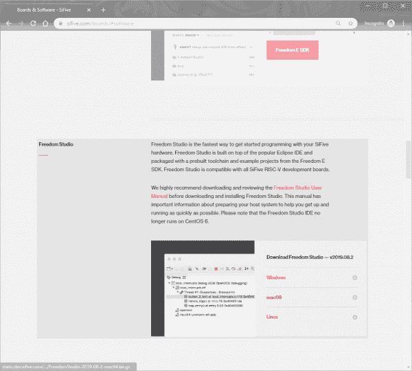](https://cdn.sparkfun.com/assets/learn_tutorials/1/0/3/2/Download_SiFive_Freedom_Studio.jpg)*Click on image for a closer view.***Note:** For advanced users using command line, we also have a GitHub branch of the Freedom E SDK with the RED-V and RED-V Thing board support package (BSP). This has been tested to enable/disable I/O pins with the [**sparkfun-welcome.c**](https://github.com/sparkfun/freedom-e-sdk/blob/v201908-branch/software/sparkfun-welcome/sparkfun-welcome.c) example.

[GitHub Branch > freedom-e-sdk](https://github.com/sparkfun/freedom-e-sdk)
This is useful if you were to compile code for the boards using command line. To [build and upload an example using the branched SDK](https://github.com/sparkfun/freedom-e-sdk#building-an-example), the target boards are `sparkfun-redv` and `sparkfun-redv-thing`. The command below is for the RED-V board:

```
make PROGRAM=sparkfun-welcome TARGET=sparkfun-redv CONFIGURATION=release upload
```

The example below is for the RED-V Thing board:

```
make PROGRAM=sparkfun-welcome TARGET=sparkfun-redv-thing CONFIGURATION=release upload
```

For the scope of this tutorial, we will focus on the Freedom Studio software.

Freedom Studio 包在我们的系统中包含了一些非常长的路径，这偶尔会在 Windows 系统的解压缩过程中造成问题。因此，启用长路径以及解压到像 **C:/FreedomStudio/** 这样的位置以保持路径尽可能短是很重要的。要启用长路径，只需下载并双击下面的注册表文件。这仅在 Windows 机器上是必要的。按照提示安装路径。

[Enable Long Paths for Windows (REG)](https://cdn.sparkfun.com/assets/learn_tutorials/1/0/3/2/EnableLongPaths.reg)

## 司机(自由工作室)

安装软件后，您需要确保为您的计算机安装了驱动程序。如果您使用的是 Windows 操作系统，您需要安装驱动程序，以便上传代码或向 FE310 发送串行数据。

### Windows 操作系统

要安装驱动程序，请转到 Freedom Studio 程序的驱动程序文件夹。驱动程序应位于以下路径下:

```
language:bash
C:\FreedomStudio\SiFive\jlink-6.52.5-2019.08.0\USBDriver 
```

驱动程序取决于您使用的操作系统。对于基于 64 位的操作系统，你需要点击文件夹名称中带有 **x64** 的 Windows 版本。对于基于 32 位的操作系统，你需要点击文件夹名中带有 **x86** 的那个。我们将使用基于 Windows 10 的 64 位操作系统，因此我们将点击名为 **x64** 的文件夹，然后点击 **dpinst_x64.exe**

[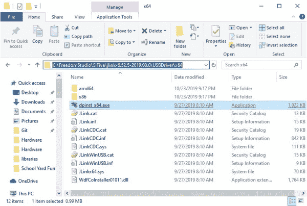](https://cdn.sparkfun.com/assets/learn_tutorials/1/1/0/1/USB-to-JTAG_Drivers.jpg)*Click on image for a closer view.*

单击驱动程序可执行文件后，按照提示为您的 Windows 安装驱动程序。

## 示例(自由工作室)

### 例如:Hello World！

一旦所有东西都被解压，你只需要运行“**FreedomStudio.exe**”来安装应用程序。打开 Freedom Studio 后，我们将希望从我们的一个示例模板中创建一个新项目。为此，请转到**文件** > **新建** > **自由 E SDK 软件项目**。

[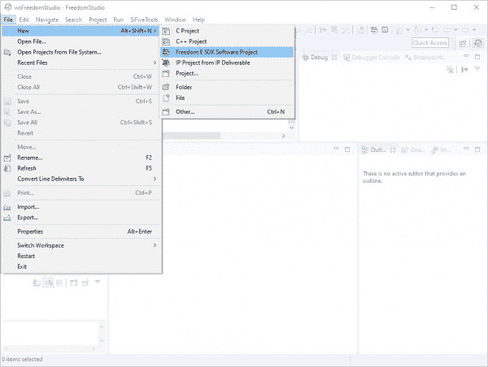](https://cdn.sparkfun.com/assets/learn_tutorials/1/1/0/1/Freedom_Studio_Start_New_Project.jpg)*Click on image for a closer view.*

SparkFun 的 RED-V RedBoard 和 Thing Plus 与 [SiFive 的 HiFive1 RevB](https://www.sifive.com/boards/hifive1-rev-b) 非常相似，因此我们将选择 hifi ve 1 RevB(**si five-hifi ve-RevB**)作为我们的目标板选择。

[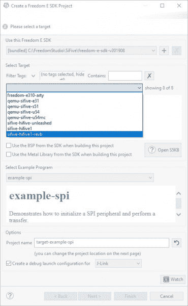](https://cdn.sparkfun.com/assets/learn_tutorials/1/1/0/1/Freedom_Studio_Target_Board_Selection.jpg)*Click on image for a closer view.*

首先，让我们简单地将“Hello World”示例显示到我们的 RED-V 中，并查看一些串行输出。

[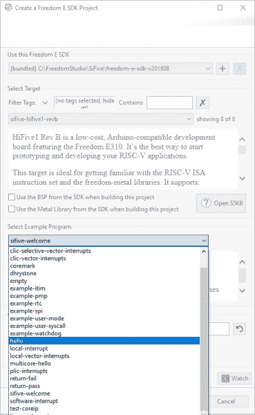](https://cdn.sparkfun.com/assets/learn_tutorials/1/1/0/1/Freedom_Studio_Example_Project_Hello.jpg)*Click on image for a closer view.*

从下拉菜单中选择 **hello** 。点击**完成**以加载示例。随着示例项目的构建，您需要等待一段时间。

[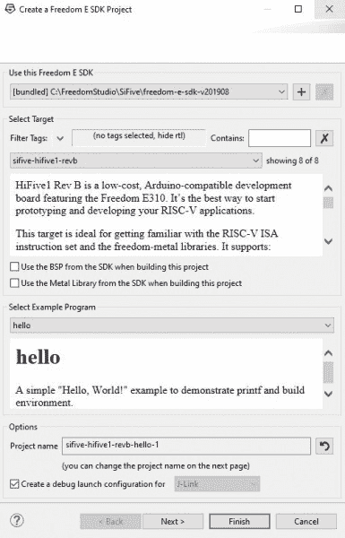](https://cdn.sparkfun.com/assets/learn_tutorials/1/0/3/2/freedomsdk.JPG)*Click on image for a closer view.*

#### 奔跑

**Heads up!** Make sure to give the USB-to-JTAG converter some time to enumerate on your computer before uploading the example to your board.

构建草图后，将会打开一个窗口来编辑调试配置。现在，点击**关闭**按钮。既然已经构建了示例，点击 run 按钮上传并执行 RED-V 上的代码。如果您保存了多个项目，只需点击 run 按钮旁边的下拉菜单，选择要编译并运行的项目。

[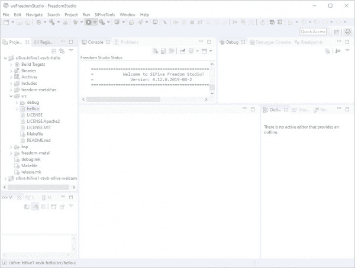](https://cdn.sparkfun.com/assets/learn_tutorials/1/1/0/1/Freedom_Studio_Run.jpg)*Click on the image for a closer view.*

Freedom Studio 将尝试刷新并运行草图。但是，您的 GDB 服务器可能配置不正确，无法通过 Freedom Studio 刷新代码。要解决这个问题，请转到**运行**->-**运行配置...**从菜单中。

[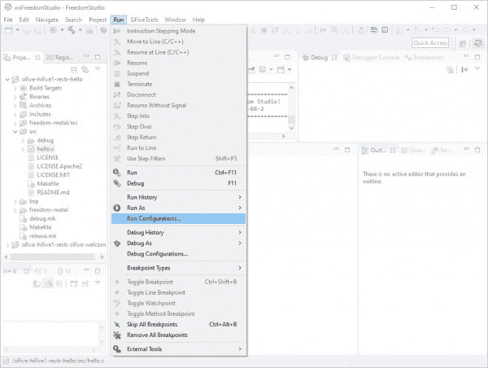](https://cdn.sparkfun.com/assets/learn_tutorials/1/1/0/1/Freedom_Studio_Run_Configurations.jpg)*Click on the image for a closer view.*

打开窗口左侧的 **SiFive GDB 赛格尔 J-Link 调试**树，选择您的项目，点击**运行**按钮。这将通过 USB 刷新代码，并开始运行您的代码。

[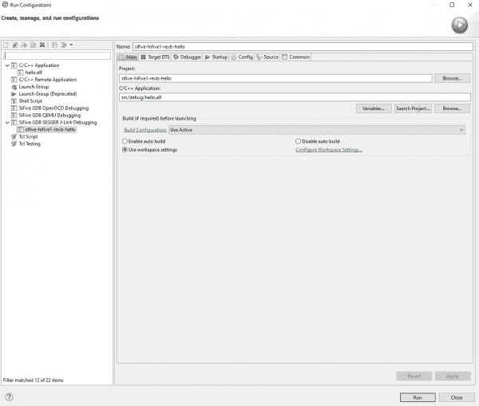](https://cdn.sparkfun.com/assets/learn_tutorials/1/0/3/2/runconfig.JPG)*Click on the image for a closer view.*

#### 拖放

flash 的另一种方式是使用快捷键`CTRL` + `B`构建所有文件；这将在项目浏览器中的**src**->debug->hello . hex 下生成一个`*.hex`文件。

[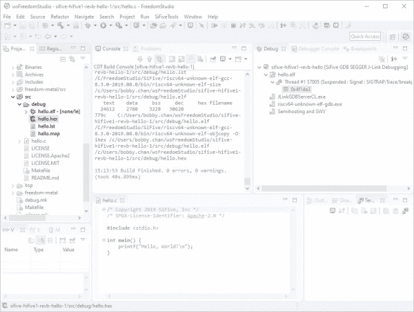](https://cdn.sparkfun.com/assets/learn_tutorials/1/1/0/1/Freedom_Studio_Drag_Drop_Hello_World_HEX.jpg)*Click on the image for a closer view.*

您可能已经注意到，当您将 RED-V 插入电脑时，它会显示为闪存盘。打开驱动器窗口，将`*.hex`直接拖放到该驱动器上，对 RED-V 进行编程。

[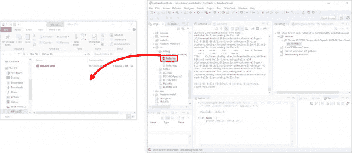](https://cdn.sparkfun.com/assets/learn_tutorials/1/1/0/1/Red-V_Drag_Drop.jpg)*Click on the image for a closer view.*

#### 你应该看到什么

一旦代码上传到 RED-V RedBoard，程序将开始运行。要查看串行输出，您需要一个[串行终端](https://learn.sparkfun.com/tutorials/terminal-basics/serial-terminal-overview)。虽然您可以使用您最喜欢的串行终端进行连接，但我们将使用 Freedom Studio 内置的终端。在 Freedom Studio 软件中，你会注意到在软件的右下角有一个窗口。点击标签为**终端**的标签，然后点击带有监视器的图标。

[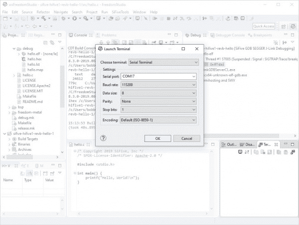](https://cdn.sparkfun.com/assets/learn_tutorials/1/1/0/1/Freedom_Studio_Serial_Terminal.jpg)*Click on the image for a closer view.*

将弹出一个新窗口，要求您选择串行终端和设置。点击**选择终端:**菜单，选择**串行终端**。该板将在您的计算机上显示为两个 COM 端口:一个用于引导程序，另一个用于示例程序。最有可能的是，COM 端口将显示为编号第二高的端口。示例项目的默认波特率设置为 **115200** 波特率(8 个数据位，无奇偶校验，1 个停止位，默认编码)。设置正确后，点击 **OK** 按钮进行连接。示例代码将打印“`Hello World!`”一次，因此我们需要按一下板上的 reset 按钮。

当 RED-V 启动时，您会看到一些串行输出。一旦它进入示例程序，RED-V RedBoard 将输出所有程序员都知道并喜欢的熟悉消息:`Hello, World!`

```
language:bash
Bench Clock Reset Complete

ATE0--> Send Flag error: #255 #255 #255 #255 AT+BLEINIT=0--> Send Flag error: #255 #255 #255 #255 AT+CWMODE=0--> Send Flag error: #255 #255 #255 #255 
Hello, World! 
```

[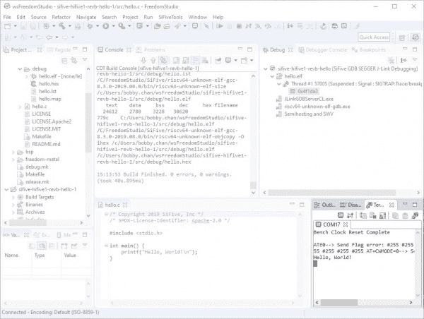](https://cdn.sparkfun.com/assets/learn_tutorials/1/1/0/1/Freedom_Studio_RED-V_Serial_Output.jpg)*Click on the image for a closer view.***Heads up!** If you do not see the output, it's possible that you selected the wrong COM port. Try closing the terminal window and reopening a new session with a different COM port.

### 示例:眨眼

**Heads up!** When defining pins for the RED-V, you'll need to reference the GPIO pin of the FE310 as opposed to the silkscreen on the board. Also, make sure to start the index for the GPIO at `0`. In order to properly use a pin as an output, make sure to also follow the sequence to disable and enable the I/O pin in the code.

现在我们已经将一些串行输出到终端窗口，让我们试着使红色 v 上的 LED 闪烁，让我们使用已经在 Freedom Studio 中打开的示例项目。将下面的例子复制并粘贴到文本编辑器中。

```
language:c
/******************************************************************************
    RED-V_blink.c

    WRITTEN BY: Ho Yun "Bobby" Chan and "Tron Monroe"
    @ SparkFun Electronics
    DATE:  11/21/2019

    DEVELOPMENT ENVIRONMENT SPECIFICS:
      Firmware developed using Freedom Studio v4.12.0.2019-08-2
      on Windows 10

    ========== RESOURCES ==========
    Freedom E SDK

    ========== DESCRIPTION ==========
    Using the built-in LED. To test with different pin,
    simply modify the reference pin and connect a standard LED
    and 100?O resistor between the respective pin and GND.

    LICENSE: This code is released under the MIT License (http://opensource.org/licenses/MIT)
  ******************************************************************************/

#include <stdio.h>      //include Serial Library
#include <time.h>       //include Time library
#include <metal/gpio.h> //include GPIO library, https://sifive.github.io/freedom-metal-docs/apiref/gpio.html

//custom write delay function since we do not have one like an Arduino
void delay(int number_of_microseconds){ //not actually number of seconds

// Converting time into multiples of a hundred nS
int hundred_ns = 10 * number_of_microseconds;

// Storing start time
clock_t start_time = clock();

// looping till required time is not achieved
while (clock() < start_time + hundred_ns);

}

int main (void) {
  printf("RED-V Example: Blink\n");

  struct metal_gpio *led0; //make instance of GPIO

  //Note: The sequence of these commands matter!

  //Get gpio device handle, i.e.) define IC pin here where IC's GPIO = 5, pin silkscreen = 13
  //this is the GPIO device index that is referenced from 0, make sure to check the schematic
  led0 = metal_gpio_get_device(0);

  // quick check to see if we set the metal_gpio up correctly, this was based on the "sifive-welcome.c" example code
  if (led0 == NULL) {
    printf("LED is null.\n");
    return 1;
  }
  //Pins are set when initialized so we must disable it when we use it as an input/output
  metal_gpio_disable_input(led0, 5);

  //Set as gpio as output
  metal_gpio_enable_output(led0, 5);

  //Pins have more than one function, make sure we disconnect anything connected...
  metal_gpio_disable_pinmux(led0, 5);

  //Turn ON pin
  metal_gpio_set_pin(led0, 5, 1);

  while (1) {//loop through, sort of like an Arduino loop()

      //Turn OFF pin
      metal_gpio_set_pin(led0, 5, 0);
      //Use custom "delay" function
      delay(2000000); //2000000 "micro-seconds" ~ 1 second, through experimentation...
      //Turn ON pin
      metal_gpio_set_pin(led0, 5, 1);
      //Use custom "delay" function
      delay(2000000);

  }

  // return
  return 0;
} 
```

准备就绪后，点击运行按钮进行编译和上传。也可以编译拖动 ***。六角**进入驱动器。

### 你应该看到什么

终端窗口上会有一个输出，表明我们正在使用闪烁代码。我们更感兴趣的是 LED 是否打开和关闭。检查您的主板，您应该看到内置的 LED 开始每秒闪烁一次！请确保查看示例代码中的注释。切换 LED 不像控制 Arduino 上的 LED 那样直观和直接。

## 软件安装(泽法 RTOS)

**Troubleshooting Tip:** The Zephyr RTOS has been tested to work with **Linux (Ubuntu v18.04.3, 64-bit)** . You are free to follow the open source guides to use the OS of your choice, but our technical knowledge is limited to the content of this tutorial.

[Zephyr Project Documentation](https://docs.zephyrproject.org/latest/)

同样，有少数开发环境与 RED-V 兼容，但在本教程的范围内，我们将检查自由工作室和泽法 RTOS。这两种开发环境都有不错的示例代码汇编，可以帮助你开始学习 RISC-V。让我们来看看泽法·RTOS 软件。

### 安装 Python

下一个开始的方法是使用泽法 RTOS。我们在基于 Linux 的操作系统上使用泽法非常幸运，所以我们推荐使用您最喜欢的 Linux 发行版。从那里，我们要确保我们已经安装了 Python 3 和 pip，所以运行下面的命令。

```
language:bash
sudo apt-get install python3
sudo apt-get install python3-dev python python3-pip
sudo pip3 install ipython
sudo pip3 install numpy
sudo pip3 install pyelftools 
```

### 安装 CMake 和 Ninja

我们需要相当多的东西来编译，比如 **CMake** 和 **Ninja** ，所以运行下面的代码来设置所有的依赖项。

```
language:bash
sudo apt-get install --no-install-recommends git cmake ninja-build gperf \
ccache dfu-util device-tree-compiler wget \
python3-pip python3-setuptools python3-tk python3-wheel xz-utils file \
make gcc gcc-multilib 
```

我们还需要更新我们系统上的 CMake，在这里下载包[。我们在编写本教程时使用了 *Ubuntu v18.04.3* 上的**3 . 15 . 4**版本。](https://github.com/Kitware/CMake/releases/download/v3.15.4/cmake-3.15.4.tar.gz)

[Download CMake v3.15.4 Release (TAR)](https://github.com/Kitware/CMake/releases/download/v3.15.4/cmake-3.15.4.tar.gz)

运行下面的命令来提取、制作和安装它。

```
language:bash
cd ~/Downloads
tar xvzf cmake-3.15.4.tar.gz
cd cmake-3.15.4
./configure
make
sudo make install 
```

### 安装韦斯特和泽法 RTOS

泽法使用一个名为 **west** 的工具来为 RED-V 构建代码并进行刷新，我们希望以 root 用户身份安装它，以避免任何权限问题。我们在编写本教程时使用了 *Ubuntu v18.04.3* 上的 **0.6.3** 版本。

```
language:bash
sudo pip3 install west 
```

**Note:** When using `west init zephyrproject`, make sure to avoid using `sudo`. Otherwise, you may get an [error during compiling](https://github.com/zephyrproject-rtos/zephyr/issues/17559). The GitHub issue linked uses a different board but you may run into the same issue.

然后，我们想要创建并初始化我们的 **west** 项目，为此，运行以下代码。

```
language:bash
west init zephyrproject
cd zephyrproject
west update
sudo pip3 install -r zephyr/scripts/requirements.txt 
```

我们将需要泽法 SDK，这也是我们所有工具链捆绑的地方。从 GitHub 中获取并安装到您的主目录中。如果你想安装一个不同版本的 SDK，只需在它出现的地方更改版本号。

```
language:bash
cd ~/
wget https://github.com/zephyrproject-rtos/sdk-ng/releases/download/v0.10.3/zephyr-sdk-0.10.3-setup.run
chmod +x zephyr-sdk-0.10.3-setup.run
./zephyr-sdk-0.10.3-setup.run -- -d ~/zephyr-sdk-0.10.3
export ZEPHYR_TOOLCHAIN_VARIANT=zephyr
export ZEPHYR_SDK_INSTALL_DIR=$HOME/zephyr-sdk-0.10.3 
```

我们还需要更新我们的设备树编译器，点击下面的[链接找到合适的下载。](https://packages.ubuntu.com/cosmic/amd64/device-tree-compiler/download)

[Download Linux Device Tree Compiler](https://packages.ubuntu.com/cosmic/amd64/device-tree-compiler/download)

运行以下命令安装新的 DTC。

```
language:bash
cd ~/Downloads
sudo apt install ./device-tree-compiler_1.4.7-1_amd64.deb 
```

## 司机(泽法·RTOS)

**Note:** If you are using a Windows or MacOS, there are also drivers available on the Download page. Simply click on the executable or package to install the drivers on the respective operating system.

我们需要一些 J-Link 软件，这样我们就可以与 RED-V 上的 Segger J-Link OB 进行通信。前往 Segger 下载“**J-Link Software and Documentation pack for Linux，DEB installer，64 位**”下的软件接受条款前通读许可协议，并点击“**下载软件**按钮。我们在写这个教程的时候用的是**版本 6.56a** 在 *Ubuntu v18.04.3* 上。

[Download Segger Software Package](https://www.segger.com/downloads/flasher/)

我们应该还在`Downloads`文件夹中，所以安装软件就像运行下面的命令一样简单。根据软件包的不同，您可能需要更新版本名称。

```
language:bash
sudo apt install ./JLink_Linux_V646a_x86_64.deb 
```

## 例子(泽法·RTOS)

### 例子:Hello World

唷，都做完了。现在我们可以移动到之前运行`west init zephyrproject`时创建的目录，并构建一个项目。

```
language:bash
cd ..
cd zephyrproject/zephyr
west build -b hifive1_revb samples/hello_world 
```

我们现在可以检查以确保我们的红色 V 已连接。当您运行`lsusb`时，您应该会看到一个 SEGGER 设备弹出。如果已连接，继续运行`west flash`。请注意，这可能需要几次尝试，有时轻点或两下“重置”按钮并重试会有所帮助。

```
language:bash
west flash 
```

#### 你应该看到什么

上传后，尝试打开一个串行终端连接到 RED-V。让我们使用 GNU 屏幕。如果您还没有安装它，请在命令行中键入以下内容。

```
language:bash
sudo apt-get install screen 
```

插入 USB 端口时，RED-V 列举了两个串行端口。键入以下命令查看连接的串行端口。

```
language:bash
dmesg | grep tty 
```

拔下 RED-V 插头，然后重新插入 USB 端口，并再次键入命令。多次出现的消息将是红色的 v。在这种情况下，它应该是 **ttyACM0** 或 **ttyACM1** 。

[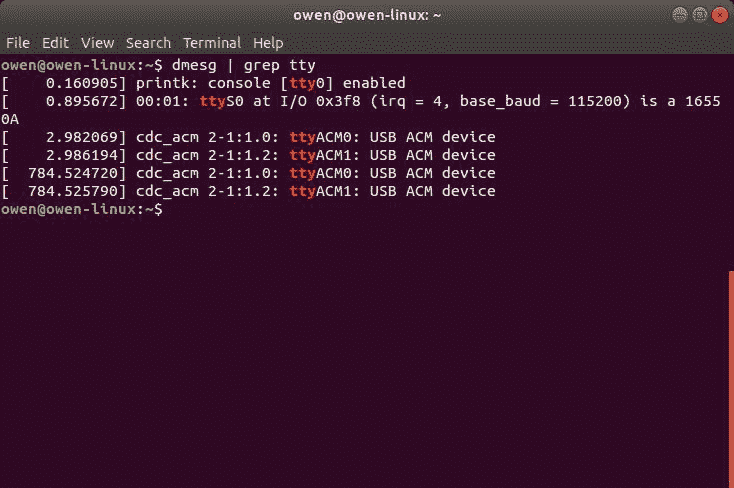](https://cdn.sparkfun.com/assets/learn_tutorials/1/1/0/1/RED-V_Available_Serial_Ports.jpg)

使用以下设置为 **115200** 波特的命令连接到其中一个端口。

```
language:bash
screen /dev/ttyACM0 115200 
```

由于示例代码只打印一次消息，我们需要在红色的 v 上点击一次 reset 按钮。

```
language:bash
Bench Clock Reset Complete

ATE0--> Send Flag error: #255 #255 #255 #255 AT+BLEINIT=0--> Send Flag error: #255 #255 #255 #255 AT+CWMODE=0--> Send Flag error: #255 #255 #255 #255 
***** Booting Zephyr OS build v2.1.0-rc1-259-g77006e896ba0 *****
Hello, World! hifive1_revb 
```

[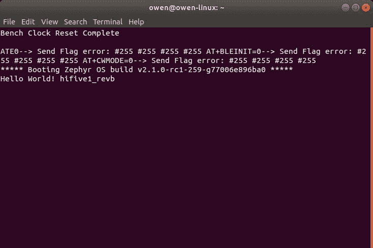](https://cdn.sparkfun.com/assets/learn_tutorials/1/1/0/1/RED-V_Hello_World_Serial_Linux.jpg)**Note:** If you do not see the following message, try connecting to the other serial port by adjusting the port number. Make sure to terminate the session using the following instructions listed below.

断开`CTRL` + `A`，然后断开`\`。应用程序会询问您是否要退出。键入`y`和`ENTER`退出会话。

如果您想要构建一个不同的项目，只需使用下面的命令删除目录`build`来删除该文件夹。然后为您的另一个项目再次运行`west build`。

```
language:bash
rm -rv build/ 
```

对于那些喜欢图形用户界面的人来说，只需进入文件夹并手动删除即可。

[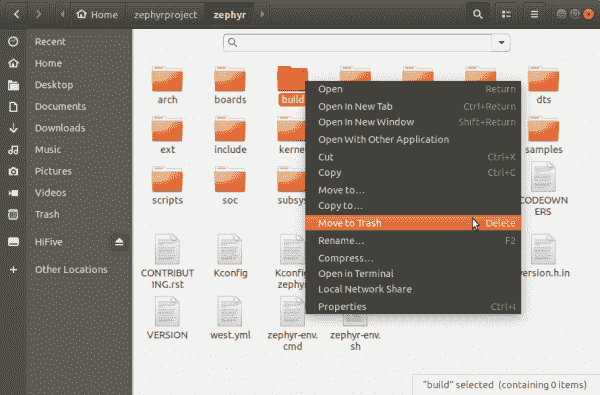](https://cdn.sparkfun.com/assets/learn_tutorials/1/1/0/1/Zephyr_Project_RED-V_Delete_Build.png)

### 例子:Blinky

让我们尝试控制红色 v 头上的内置 LED，以闪烁为例，并针对 GPIO 引脚 5 进行修改。

```
language:bash
cd ~/zephyrproject/zephyr/samples/basic/blinky/src
gedit main.c 
```

您还可以使用 GUI 导航到该示例，以打开 blink 示例。

[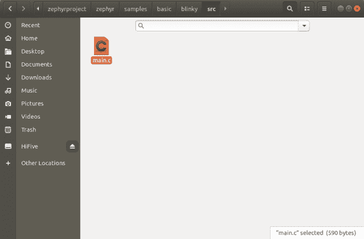](https://cdn.sparkfun.com/assets/learn_tutorials/1/1/0/1/Zephyr_Project_RED-V_Blinky_edit.png)

一旦 **modified.c** 文件打开，将`LED`的定义从`DT_ALIAS_LED0_GPIOS_PIN`更改为`5`。我们需要使用 FE310 的 GPIO 引脚参考，而不是 RED-V 上的丝印标签。您也可以将以下内容复制并粘贴到文件中。

```
language:c
/*
 * Copyright (c) 2016 Intel Corporation
 *
 * SPDX-License-Identifier: Apache-2.0
 */

#include <zephyr.h>
#include <device.h>
#include <drivers/gpio.h>

#define LED_PORT    DT_ALIAS_LED0_GPIOS_CONTROLLER
#define LED     5

/* 1000 msec = 1 sec */
#define SLEEP_TIME  1000

void main(void)
{
    u32_t cnt = 0;
    struct device *dev;

    dev = device_get_binding(LED_PORT);
    /* Set LED pin as output */
    gpio_pin_configure(dev, LED, GPIO_DIR_OUT);

    while (1) {
        /* Set pin to HIGH/LOW every 1 second */
        gpio_pin_write(dev, LED, cnt % 2);
        cnt++;
        k_sleep(SLEEP_TIME);
    }
} 
```

更改后，保存更改并在终端窗口中点击`CTRL` + `C`。回到 **zephyr** 文件夹，删除 **build** 文件夹，如果你还没有的话。然后重新编译 blink 示例，并将其闪存到您的 RED-V 板上。

```
language:bash
cd ~/zephyrproject/zephyr/
rm -rv build/
west build -b hifive1_revb samples/basic/blinky
west flash 
```

#### 你应该看到什么

检查红色 V 板上的内置 LED。您应该会看到内置 LED 每秒闪烁一次！

## 解决纷争

### 自由工作室

以下是在 Freedom Studio 中使用 RED-V 时可能会遇到的问题。

#### 再次上传到红色 V 的问题

如果你上传代码有问题，有几个原因。如果您最近上传了代码，并且开发板仍然连接到您的计算机，您需要确保在再次上传之前点击终止(即看起来像红色方块的按钮)。这是因为 Freedom Studio 仍然以调试模式连接到主板。

[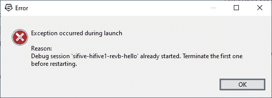](https://cdn.sparkfun.com/assets/learn_tutorials/1/1/0/1/Freedom_Studio_Error_Uploading.jpg)

如果您多次上传到板上，并且在单击终止按钮后上传有问题，请尝试从 USB 端口断开 RED-V。然后重新插回主板。

* * *

### 泽法·RTOS

下面是你在泽弗里 into 使用红色 V 时可能会遇到的一个问题。

#### 问题编译

如果您在编译时遇到问题，您可能在为 Zephry RTOS 安装软件时遗漏了一个步骤。尝试再次浏览命令行，以确保软件和工具安装正确。您可能还需要再运行几次`west build`命令来编译。

## 资源和更进一步

既然您已经成功地启动并运行了您的 RED-V，那么是时候将它整合到您自己的项目中了！有关更多信息，请查看以下资源:

*   自由工作室
    *   [自由工作室软件下载量](https://www.sifive.com/boards/#software)
    *   [自由工作室用户手册(PDF)](https://cdn.sparkfun.com/assets/learn_tutorials/1/1/0/1/freedom-studio-manual-4.7.2-2019-08-2.pdf)
    *   [为 Windows 启用长路径(REG)](https://cdn.sparkfun.com/assets/learn_tutorials/1/0/3/2/EnableLongPaths.reg)
*   泽法
    *   [泽法·RTOS 入门](https://docs.zephyrproject.org/latest/getting_started/index.html#)
    *   [CMake 释放](https://github.com/Kitware/CMake/releases/)
    *   [Ubuntu 设备树编译器](https://packages.ubuntu.com/cosmic/amd64/device-tree-compiler/download)
    *   [赛格软件包](https://www.segger.com/downloads/flasher/)

或者查看来自 Western Digital 的 Martin Fink 使用 PlatformIO IDE 编写的 RISC-V 汇编和 C 编程教程。开发板 HiFive1 类似于 RED-V 开发板。您可能需要调整这些值，以便代码适用于 RED-V 的 FE310-002 上的 GPIO 引脚。

*   [YouTube: RISC-V ASM 教程系列](https://www.youtube.com/watch?v=KLybwrpfQ3I&list=PL6noQ0vZDAdh_aGvqKvxd0brXImHXMuLY)

或者看看这篇博客文章。

[](https://www.sparkfun.com/news/3334 "July 15, 2020: Let's explore a Real-Time Operating System for RISC-V.") [### 在 SparkFun RED-V 上用 RISC-V 实现 FreeRTOS

July 15, 2020](https://www.sparkfun.com/news/3334 "July 15, 2020: Let's explore a Real-Time Operating System for RISC-V.")[Favorited Favorite](# "Add to favorites") 0