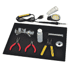
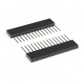
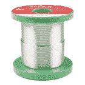

# 红色-V 的东西加上连接指南

> 原文：<https://learn.sparkfun.com/tutorials/red-v-thing-plus-hookup-guide>

## 介绍

SparkFun 很高兴地欢迎其全新的指令集架构(ISA)加入其家族，RISC-V ISA ( *读作“risk-five”*)，并随之推出 [RED-V Thing Plus](https://www.sparkfun.com/products/15594) ( *读作“RED-five”*)。在本教程中，我们将重点关注硬件。

 

将**添加到您的[购物车](https://www.sparkfun.com/cart)中！**

 **### [spark fun RED-V Thing Plus-SiFive RISC-V Fe 310 SoC](https://www.sparkfun.com/products/15799)

[21 available](https://learn.sparkfun.com/static/bubbles/ "21 available") DEV-15799

SparkFun 的 RED-V Thing Plus 是一款低成本、兼容 Arduino 的开发板，采用 Freedom E310，可带来…

$32.50[Favorited Favorite](# "Add to favorites") 10[Wish List](# "Add to wish list")** **[https://www.youtube.com/embed/JnCYY3x26wo/?autohide=1&border=0&wmode=opaque&enablejsapi=1](https://www.youtube.com/embed/JnCYY3x26wo/?autohide=1&border=0&wmode=opaque&enablejsapi=1)

*"The force is strong with this one." (Star Wars: A New Hope, 1977)*

RISC-V ISA 与其他产品的不同之处在于它是完全开源的；包括[指令集架构](https://en.wikipedia.org/wiki/Instruction_set_architecture) (ISA)。这意味着任何人都可以充分利用微控制器，而不需要版税、许可证或保密协议(NDA)。RED-V 采用熟悉的 SparkFun Thing Plus 外形，包括 SiFive Freedom E310 内核、32MB QSPI 闪存、用于 USB 连接和作为 JTAG 接口操作的恩智浦 K22 ARM Cortex-M4 以及 Qwiic 连接器。

### 所需材料

要跟随本教程，您将需要以下材料和软件。你可能不需要所有的东西，这取决于你拥有什么。将它添加到您的购物车，通读指南，并根据需要调整购物车。以下是您需要开始的内容:

 

将**添加到您的[购物车](https://www.sparkfun.com/cart)中！**

 **### [spark fun RED-V Thing Plus-SiFive RISC-V Fe 310 SoC](https://www.sparkfun.com/products/15799)

[21 available](https://learn.sparkfun.com/static/bubbles/ "21 available") DEV-15799

SparkFun 的 RED-V Thing Plus 是一款低成本、兼容 Arduino 的开发板，采用 Freedom E310，可带来…

$32.50[Favorited Favorite](# "Add to favorites") 10[Wish List](# "Add to wish list")**** 

将**添加到您的[购物车](https://www.sparkfun.com/cart)中！**

 **### [USB 3.1 线 A 到 C - 3 脚](https://www.sparkfun.com/products/14743)

[In stock](https://learn.sparkfun.com/static/bubbles/ "in stock") CAB-14743

USB C 棒极了。但是，在我们将所有的集线器、充电器和端口转换为 USB C 之前，这是您要使用的电缆…

$5.504[Favorited Favorite](# "Add to favorites") 9[Wish List](# "Add to wish list")**** *****   [红色-V 的东西加上](https://www.sparkfun.com/products/15799) -你肯定会需要这个；否则，你很可能在错误的教程页面(*眨眼*)。
*   [USB 3.1 电缆 A 至 C - 3 脚](https://www.sparkfun.com/products/14743)-USB 接口有两个用途:它为电路板供电，并允许您向电路板上传程序。(*你的抽屉里可能会有一些这样的东西！*)

#### 你还需要

要利用开发板的所有功能，您可能需要以下工具和附件。

[**跳线修改**](#Jumper_Materials) [**表头&附件**](#Headers)

***Click the buttons** above to toggle the **additional materials** based on the tasks you
wish to perform. Feel free to modify the items in your cart to fit your needs.*

#### 跳线修改

如果您想修改板上的跳线，您将需要[焊接设备](https://www.sparkfun.com/categories/49)。

 

### [威勒 WLC100 焊台](https://www.sparkfun.com/products/14228)

[Out of stock](https://learn.sparkfun.com/static/bubbles/ "out of stock") TOL-14228

Weller 的 WLC100 是一款多功能的 5 瓦至 40 瓦焊台，非常适合业余爱好者、DIY 爱好者和学生。…

2[Favorited Favorite](# "Add to favorites") 17[Wish List](# "Add to wish list") 

将**添加到您的[购物车](https://www.sparkfun.com/cart)中！**

 **### [无铅焊料- 100 克线轴](https://www.sparkfun.com/products/9325)

[In stock](https://learn.sparkfun.com/static/bubbles/ "in stock") TOL-09325

这是带有水溶性树脂芯的无铅焊料的基本线轴。0.031 英寸规格，100 克。这是一个好主意…

$9.957[Favorited Favorite](# "Add to favorites") 33[Wish List](# "Add to wish list")**** 

将**添加到您的[购物车](https://www.sparkfun.com/cart)中！**

 **### [芯片快克免清洗助焊剂笔- 10mL](https://www.sparkfun.com/products/14579)

[In stock](https://learn.sparkfun.com/static/bubbles/ "in stock") TOL-14579

这款来自 Chip Quik 的 10 毫升免清洗助焊剂笔非常适合您的所有焊接、脱焊、返工和回流目的！

$8.954[Favorited Favorite](# "Add to favorites") 36[Wish List](# "Add to wish list")**** ****#### Qwiic 示例

如果你想按照下面的例子与现实世界互动，你还需要以下物品:

 

将**添加到您的[购物车](https://www.sparkfun.com/cart)中！**

 **### [【spark fun Qwiic 12 位 ADC - 4 通道(ADS1015)](https://www.sparkfun.com/products/15334)

[In stock](https://learn.sparkfun.com/static/bubbles/ "in stock") DEV-15334

SparkFun Qwiic 12 位 ADC 可为您的 Qwiic 启用项目提供四个通道的 I ² C 控制 ADC 输入。

$11.501[Favorited Favorite](# "Add to favorites") 22[Wish List](# "Add to wish list")**** 

将**添加到您的[购物车](https://www.sparkfun.com/cart)中！**

 **### [Qwiic 线缆- 100mm](https://www.sparkfun.com/products/14427)

[In stock](https://learn.sparkfun.com/static/bubbles/ "in stock") PRT-14427

这是一条 100 毫米长的 4 芯电缆，带有 1 毫米 JST 端接。它旨在将支持 Qwiic 的组件连接在一起…

$1.50[Favorited Favorite](# "Add to favorites") 32[Wish List](# "Add to wish list")**** 

### [磁性螺丝刀套装(20 件)](https://www.sparkfun.com/products/retired/15003)

[Retired](https://learn.sparkfun.com/static/bubbles/ "Retired") TOL-15003

这是一个 20 件螺丝刀组，磁性保持每个未使用的位固定在一个薄的情况下，很容易…

1 **Retired**[Favorited Favorite](# "Add to favorites") 12[Wish List](# "Add to wish list")**** ****#### 标题和附件

如果您想在您的板上添加标题，请查看以下项目:

 

将**添加到您的[购物车](https://www.sparkfun.com/cart)中！**

 **### [破开头球——直击](https://www.sparkfun.com/products/116)

[In stock](https://learn.sparkfun.com/static/bubbles/ "in stock") PRT-00116

一排标题-打破适应。40 个引脚，可切割成任何尺寸。用于定制 PCB 或通用定制接头。

$1.7520[Favorited Favorite](# "Add to favorites") 133[Wish List](# "Add to wish list")**** 

将**添加到您的[购物车](https://www.sparkfun.com/cart)中！**

 **### [SparkFun 初学者工具包](https://www.sparkfun.com/products/14681)

[Out of stock](https://learn.sparkfun.com/static/bubbles/ "out of stock") TOL-14681

这些工具非常适合那些需要一套坚实的工具来启动工作台的人！

$62.50[Favorited Favorite](# "Add to favorites") 14[Wish List](# "Add to wish list")**** 

将**添加到您的[购物车](https://www.sparkfun.com/cart)中！**

 **### [羽毛可堆叠头套](https://www.sparkfun.com/products/15187)

[In stock](https://learn.sparkfun.com/static/bubbles/ "in stock") PRT-15187

这些可堆叠的接头可与[spark fun ESP32 Thing Plus](https://www . spark fun . com/products/14689)配合使用，以控制

$1.75[Favorited Favorite](# "Add to favorites") 4[Wish List](# "Add to wish list")****** ******以下是我们目录中其他接头和焊接工具的样本。如需完整选择我们可用的 [**接头**](https://www.sparkfun.com/categories/381) 或 [**焊接工具**](https://www.sparkfun.com/categories/49) ，请点击相关链接。

 

将**添加到您的[购物车](https://www.sparkfun.com/cart)中！**

 **### [破开头球——直击](https://www.sparkfun.com/products/116)

[In stock](https://learn.sparkfun.com/static/bubbles/ "in stock") PRT-00116

一排标题-打破适应。40 个引脚，可切割成任何尺寸。用于定制 PCB 或通用定制接头。

$1.7520[Favorited Favorite](# "Add to favorites") 133[Wish List](# "Add to wish list")**** 

将**添加到您的[购物车](https://www.sparkfun.com/cart)中！**

 **### [可堆叠接头- 2x23 引脚母](https://www.sparkfun.com/products/12790)

[In stock](https://learn.sparkfun.com/static/bubbles/ "in stock") PRT-12790

这是一个 2x23 引脚的凹形 PTH 接头，具有超长的引脚，非常适合堆叠。这一块是在共同的配置…

$3.251[Favorited Favorite](# "Add to favorites") 15[Wish List](# "Add to wish list")**** 

将**添加到您的[购物车](https://www.sparkfun.com/cart)中！**

 **### [Arduino Nano 可堆叠头部套件](https://www.sparkfun.com/products/16279)

[In stock](https://learn.sparkfun.com/static/bubbles/ "in stock") PRT-16279

这组可堆叠插座包括两个 15 针插座；引脚间距为 0.1 英寸。

$1.75[Favorited Favorite](# "Add to favorites") 5[Wish List](# "Add to wish list")**** 

将**添加到您的[购物车](https://www.sparkfun.com/cart)中！**

 **### [扩展 GPIO 母头- 2x20 引脚(13.5 毫米/9.80 毫米)](https://www.sparkfun.com/products/16764)

[In stock](https://learn.sparkfun.com/static/bubbles/ "in stock") PRT-16764

这种 2x20 引脚母接头旨在允许您扩展任何具有标准 2x20 GPIO 引脚尺寸的电路板。

$2.25[Favorited Favorite](# "Add to favorites") 7[Wish List](# "Add to wish list")**************** 

将**添加到您的[购物车](https://www.sparkfun.com/cart)中！**

 **### [绝缘硅胶焊垫](https://www.sparkfun.com/products/14672)

[In stock](https://learn.sparkfun.com/static/bubbles/ "in stock") TOL-14672

有了这种绝缘硅胶焊接垫，您将能够保护您的桌面、焊接站或…

$10.959[Favorited Favorite](# "Add to favorites") 93[Wish List](# "Add to wish list")**** 

将**添加到您的[购物车](https://www.sparkfun.com/cart)中！**

 **### [威勒 WE1010 焊台](https://www.sparkfun.com/products/14734)

[Only 1 left!](https://learn.sparkfun.com/static/bubbles/ "only 1 left!") TOL-14734

韦勒的 WE1010 是一个强大的 70 瓦焊接站，是热情的爱好者，DIY 者和任何人的完美选择。

$138.504[Favorited Favorite](# "Add to favorites") 26[Wish List](# "Add to wish list")**** 

将**添加到您的[购物车](https://www.sparkfun.com/cart)中！**

 **### [Solder-1/4 磅短管(0.020”)特殊混合](https://www.sparkfun.com/products/10242)

[In stock](https://learn.sparkfun.com/static/bubbles/ "in stock") TOL-10242

我们不想炒作这种焊料太多，但这可能是世界上最好的焊料。好了，我们已经说过了。这…

$32.5014[Favorited Favorite](# "Add to favorites") 17[Wish List](# "Add to wish list")**** 

### [威勒 WLC100 焊台](https://www.sparkfun.com/products/14228)

[Out of stock](https://learn.sparkfun.com/static/bubbles/ "out of stock") TOL-14228

Weller 的 WLC100 是一款多功能的 5 瓦至 40 瓦焊台，非常适合业余爱好者、DIY 爱好者和学生。…

2[Favorited Favorite](# "Add to favorites") 17[Wish List](# "Add to wish list")************** ************#### 赛格程序员

如果你想自己调试或刷新你的处理器，这里有一些我们的程序员。根据您使用的编程器，您可能需要结合使用绕线和 IC 挂钩来连接。

 

将**添加到您的[购物车](https://www.sparkfun.com/cart)中！**

 **### [J-Link BASE 紧凑型编程器](https://www.sparkfun.com/products/15347)

[Only 4 left!](https://learn.sparkfun.com/static/bubbles/ "only 4 left!") PGM-15347

紧凑型 J-Link 编程器，用于对任何 ARM 微控制器进行编程。

$525.95[Favorited Favorite](# "Add to favorites") 4[Wish List](# "Add to wish list")**** 

### [J-Link EDU 迷你程序员](https://www.sparkfun.com/products/retired/15345)

[Retired](https://learn.sparkfun.com/static/bubbles/ "Retired") PGM-15345

微型 J-Link 编程器，用于对任何 ARM 微控制器进行编程。附带教育/非商业许可证。

1 **Retired**[Favorited Favorite](# "Add to favorites") 9[Wish List](# "Add to wish list") 

### [J-Link EDU 基地程序员](https://www.sparkfun.com/products/retired/15346)

[Retired](https://learn.sparkfun.com/static/bubbles/ "Retired") PGM-15346

J-Link 编程器，用于对任何 ARM 微控制器进行编程。附带教育/非商业许可证。

2 **Retired**[Favorited Favorite](# "Add to favorites") 3[Wish List](# "Add to wish list")** **### 推荐阅读

在继续本教程之前，如果您不熟悉这些主题，您可能需要熟悉它们。

 [### 如何焊接:通孔焊接](https://learn.sparkfun.com/tutorials/how-to-solder-through-hole-soldering) This tutorial covers everything you need to know about through-hole soldering.[Favorited Favorite](# "Add to favorites") 70 [### 逻辑电平](https://learn.sparkfun.com/tutorials/logic-levels) Learn the difference between 3.3V and 5V devices and logic levels.[Favorited Favorite](# "Add to favorites") 82

## 硬件概述

### 电源和编程

有几种不同的方法为 SparkFun RED-V Thing Plus 供电:

*   USB-C
*   JST 连接器(电池电源)
*   主板边缘的电源针脚断裂

最简单的方法(也允许您对您的板进行编程)是简单地通过 USB-C 将其插入您的计算机。这将为板提供 5V 电压，并允许您访问超级酷的 USB 到 JTAG 接口进行编程。然而，一旦你对你的 RED-V 进行了编程，你可能想让它使用不同的电源。如果您在 USB-C 连接器上使用壁式电源插座，请确保它输出经过调节的 **5V DC** 。您也可以使用黑色 JST 连接器从 LiPo 电池提供电池电源。有一个车载脂肪充电器，其**电流速率设置为 500mA** 。充电时，确保使用容量大于 500 毫安时的 LiPo 电池。如果您决定通过`VUSB`或`VBAT`引脚给电路板供电，请确保不要超过 *6.5V* ，因为这是 3.3V 电压调节器的绝对最大值。或者，您可以通过电路板边缘的分线引脚为电路板供电。如果您正在使用`3V3`和`GND`，请确保在向引脚供电时调节您的电压。

#### 永远在线的核心

FE310 包含一个始终开启(AON)模块，可以轻松控制 FE310 的电源。它包括自己的实时时钟，也连接到板上的`WAKE`按钮。这允许您将 FE310 置于睡眠状态，并在时间或用户产生中断时将其唤醒。

### 小跟班

红色 V 有两个按钮:一个`RESET`按钮和一个`WAKE`按钮。`RESET`按钮非常简单，用于重置 FE310。点击`RESET`按钮将运行加载到 Fe 310 QSPI 闪存上的代码。快速双击将使 FE310 进入安全引导模式，这将允许您将新代码刷新到 RED-V，如果您真的把事情搞砸了(例如，糟糕，我让内核进入睡眠状态，忘记添加唤醒它的方法)。引脚也在电路板边缘断开。在此引脚和 GND 之间添加一条跳线也会重置电路板。

RED-V 还配备了一个常通或 AON 内核(如上所述),可以通过编程关闭 FE310 的主内核，并在按钮产生或用户产生中断时将其唤醒。可以在软件中配置`WAKE`按钮，将 FE310 从深度睡眠中唤醒。

### 针织套衫

FE310 也有一些跳线，默认情况下都是打开的。位于`I2C`标签旁边的两个跳线用于 I ² C 上拉电阻。默认情况下不连接这些电阻，因为所有 SparkFun Qwiic 从机上都有 I ² C 上拉电阻。如果你使用 3 ^(rd) party board，你可能需要[闭合 Qwiic 连接器](https://learn.sparkfun.com/tutorials/how-to-work-with-jumper-pads-and-pcb-traces#adding-a-solder-jumper)旁边的这些跳线，以将上拉电阻连接到 I ² C 总线。USB-C 连接器旁边的跳线(靠近 Segger 徽标)用于绕过 0.5A PTC 保险丝。这是用于需要大量电流的特殊情况。如果需要将 NC 引脚连接到 GND，也可以在焊盘上添加一个跳线。大多数情况下，您可以让旁路和 NC 跳线保持打开。

### 规模

RED-V Thing Plus 的尺寸为 2.3“x 0.90”。

## 硬件连接

就本教程而言，您将使用 USB C 电缆供电、上传代码并向电路板发送串行信号。只需连接计算机的 USB 端口和 RED-V Thing Plus。该板使用标准的东西加上足迹。

**Note:** While the board uses the standard Thing Plus footprint, keep in mind the board uses [3.3V logic levels](https://learn.sparkfun.com/tutorials/logic-levels/all). Additionally, Thing Plus shields might have been only developed for a certain architecture and programming language. You may need to put in a little bit more effort to write a library in order to get it working depending on the FE310 and your preferred programming language.

电路板上没有接头，用户可以灵活地将任何类型的 0.1 英寸接头连接到电路板上。对于 I/O 引脚的临时连接，您可以使用 IC 挂钩来测试引脚。然而，你需要[将你选择的接头或电线焊接到电路板](https://learn.sparkfun.com/tutorials/how-to-solder-through-hole-soldering)上，以实现安全连接。根据您的个人喜好，这里有一些连接到 PTH 焊盘的教程。

 [### 如何焊接:通孔焊接

#### 2013 年 9 月 19 日](https://learn.sparkfun.com/tutorials/how-to-solder-through-hole-soldering) This tutorial covers everything you need to know about through-hole soldering.[Favorited Favorite](# "Add to favorites") 70 [### 使用导线

#### 2013 年 2 月 8 日](https://learn.sparkfun.com/tutorials/working-with-wire) How to strip, crimp, and work with wire.[Favorited Favorite](# "Add to favorites") 50

## 软件开发指南

有几个环境可以开始使用 RED-V。有关编程 RED-V Thing Plus 的信息，请查看以下教程。

 [### RED-V 开发指南

#### 2019 年 11 月 27 日](https://learn.sparkfun.com/tutorials/red-v-development-guide) This guide will help you get the RED-V RedBoard or Thing Plus up and running for the exhaust port. Depending on personal preference, there are a few environments to get started with the boards. All wings report in... we're going in full-throttle.[Favorited Favorite](# "Add to favorites") 3

## 资源和更进一步

现在你已经成功地开始使用你的 RED-V Thing Plus，是时候把它合并到你自己的项目中了！有关更多信息，请查看以下资源:

*   [示意图(PDF)](https://cdn.sparkfun.com/assets/a/c/3/e/4/RedVThingPlus.pdf)
*   [老鹰文件(ZIP)](https://cdn.sparkfun.com/assets/c/1/5/6/d/SparkFun_REDV_Thing_Plus.zip)
*   [尺寸](https://cdn.sparkfun.com/assets/learn_tutorials/1/0/9/9/SparkFun_RED-V_Thing_Plus_Dimensions.png)
*   [Qwiic 登陆页面](https://www.sparkfun.com/qwiic)
*   [RISC-V](https://riscv.org/)
    *   [规格](https://riscv.org/specifications/)
    *   [软件状态](https://riscv.org/software-status/)
    *   [内核](https://riscv.org/risc-v-cores/)
*   [四五](https://www.sifive.com/)
    *   [E310-G002](https://www.sifive.com/documentation)
        *   [数据表(PDF)](https://cdn.sparkfun.com/assets/5/b/e/6/2/fe310-g002-ds.pdf)
        *   [手册(PDF)](https://cdn.sparkfun.com/assets/7/f/0/2/7/fe310-g002-manual-v19p05.pdf)
    *   [自由工作室和 E SDK](https://www.sifive.com/boards/#software)
    *   [自由工作室用户手册(PDF)](https://cdn.sparkfun.com/assets/learn_tutorials/1/1/0/1/freedom-studio-manual-4.7.2-2019-08-2.pdf)
*   [GitHub 硬件回购](https://github.com/sparkfun/SparkFun_Red-V_Thing_Plus)
*   [SFE 产品展示区](https://youtu.be/JnCYY3x26wo)**********************************