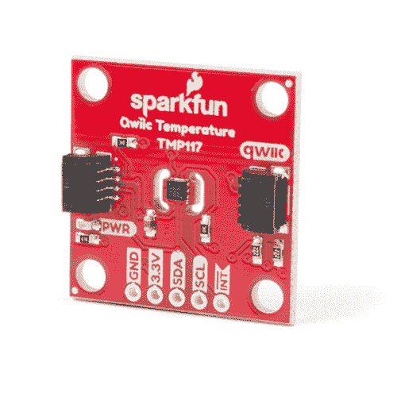

# Qwiic TMP117 高精度数字温度传感器连接指南

> 原文：<https://learn.sparkfun.com/tutorials/qwiic-tmp117-high-precision-digital-temperature-sensor-hookup-guide>

## 介绍

[TMP117](https://www.sparkfun.com/products/15805) 是一款高精度数字温度传感器。TMP117 的突出之处在于它能够精确到 0.1°C(从-20°C 到 50°C)。测量的分辨率也可以达到 0.0078°C！这对于需要更稳定温度读数的项目来说非常好。TMP117 还具有其他特性。其中一些功能包括温度偏移、进入低功耗模式和平均读数。

 

将**添加到您的[购物车](https://www.sparkfun.com/cart)中！**

 **### [【spark fun 高精度温度传感器- TMP117 (Qwiic)](https://www.sparkfun.com/products/15805)

[In stock](https://learn.sparkfun.com/static/bubbles/ "in stock") SEN-15805

SparkFun Qwiic TMP117 Breakout 是一款配有 I2C 接口的高精度温度传感器。

$14.954[Favorited Favorite](# "Add to favorites") 29[Wish List](# "Add to wish list")** **[https://www.youtube.com/embed/ZqE4EhQ8vQw/?autohide=1&border=0&wmode=opaque&enablejsapi=1](https://www.youtube.com/embed/ZqE4EhQ8vQw/?autohide=1&border=0&wmode=opaque&enablejsapi=1)

### 所需材料

要跟随本教程，您将需要以下材料。你可能不需要所有的东西，这取决于你拥有什么。将它添加到您的购物车，通读指南，并根据需要调整购物车。**