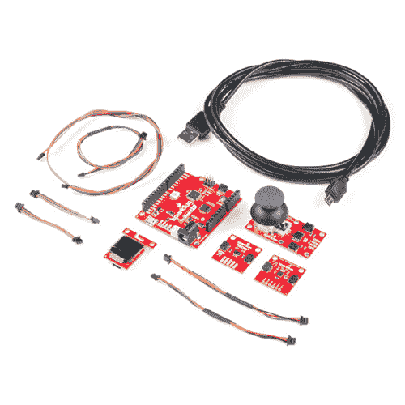
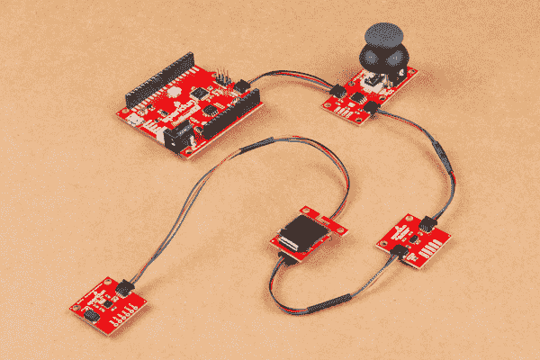
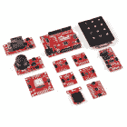
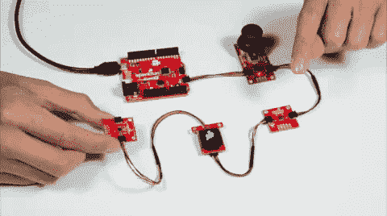

# Qwiic Pro 套件项目指南

> 原文：<https://learn.sparkfun.com/tutorials/qwiic-pro-kit-project-guide>

## 介绍

**Note:** Unfortunately, the accelerometer (MMA8452Q) included in this kit went EOL. If you are looking for the latest version of this kit and tutorial, head over to the [MicroMod Qwiic Pro Kit Project Guide](https://learn.sparkfun.com/tutorials/micromod-qwiic-pro-kit-project-guide)!

Qwiic Pro 套件旨在允许用户在不需要焊接或试验板的情况下开始使用 Arduino。我们包括三个输入(操纵杆、加速度计和接近传感器)和一个显示器，可以通过菊花链连接到您的 Arduino。使用 Qwiic 系统，将一些输入和输出连接到 Arduino 从未如此简单！

[](https://www.sparkfun.com/products/15349) 

### [SparkFun Qwiic Pro 套件](https://www.sparkfun.com/products/15349)

[Out of stock](https://learn.sparkfun.com/static/bubbles/ "out of stock") KIT-15349

该套件为您提供了一个 RedBoard Turbo、两个传感器、一个操纵杆和一个有机发光二极管屏幕以及您需要的所有电缆

[Favorited Favorite](# "Add to favorites") 10[Wish List](# "Add to wish list")

[https://www.youtube.com/embed/j1QfLVg2atQ/?autohide=1&border=0&wmode=opaque&enablejsapi=1](https://www.youtube.com/embed/j1QfLVg2atQ/?autohide=1&border=0&wmode=opaque&enablejsapi=1)

### 推荐阅读

如果你不熟悉 Qwiic 系统，我们推荐你在这里阅读[以获得一个概述](https://www.sparkfun.com/qwiic)。

| [](https://www.sparkfun.com/qwiic) |
| *[Qwiic 连接系统](https://www.sparkfun.com/qwiic)* |

我们也建议看一下下面的教程来设置 RedBoard Turbo，并感受一下每个 Qwiic 组件。

[](https://learn.sparkfun.com/tutorials/redboard-turbo-hookup-guide) [### RedBoard Turbo 连接指南

#### 2019 年 1 月 24 日](https://learn.sparkfun.com/tutorials/redboard-turbo-hookup-guide) An introduction to the RedBoard Turbo. Level up your Arduino-skills with the powerful SAMD21 ARM Cortex M0+ processor 2[](https://learn.sparkfun.com/tutorials/qwiic-micro-oled-hookup-guide) [### Qwiic 微型有机发光二极管连接指南](https://learn.sparkfun.com/tutorials/qwiic-micro-oled-hookup-guide) Get started displaying things with the Qwiic Micro OLED.[Favorited Favorite](# "Add to favorites") 7[](https://learn.sparkfun.com/tutorials/qwiic-accelerometer-mma8452q-hookup-guide) [### Qwiic 加速度计(MMA8452Q)连接指南](https://learn.sparkfun.com/tutorials/qwiic-accelerometer-mma8452q-hookup-guide) Freescale’s MMA8452Q is a smart, low-power, three-axis, capacitive micro-machined accelerometer with 12-bits of resolution. It’s perfect for any project that needs to sense orientation or motion. We’ve taken that accelerometer and stuck it on a Qwiic-Enabled breakout board to make interfacing with the tiny, QFN package a bit easier.[Favorited Favorite](# "Add to favorites") 4[](https://learn.sparkfun.com/tutorials/qwiic-joystick-hookup-guide) [### Qwiic 操纵杆连接指南](https://learn.sparkfun.com/tutorials/qwiic-joystick-hookup-guide) Looking for an easy way to implement a joystick to your next Arduino or Raspberry Pi project? This hookup guide will walk you through using the Qwiic Joystick with the Arduino IDE on a RedBoard Qwiic and in Python on a Raspberry Pi.[Favorited Favorite](# "Add to favorites") 4[](https://learn.sparkfun.com/tutorials/qwiic-proximity-sensor-vcnl4040-hookup-guide) [### Qwiic 接近传感器(VCNL4040)连接指南](https://learn.sparkfun.com/tutorials/qwiic-proximity-sensor-vcnl4040-hookup-guide) The SparkFun Qwiic Proximity Sensor is a great, qualitative proximity (up to 20 cm) and light sensor. This hookup guide covers a few examples to retrieve basic sensor readings.[Favorited Favorite](# "Add to favorites") 2

## 套件内容

你可以在工具箱中找到以下零件。

[](https://cdn.sparkfun.com/assets/learn_tutorials/9/0/3/15349-Qwiic_Starter_Kit_Parts_Arduino.jpg)

*   1x [RedBoard Turbo (SAMD21)开发板](https://www.sparkfun.com/products/14812)
*   1x [可逆 USB A 转可逆 Micro-B 电缆-0.8 米](https://www.sparkfun.com/products/15428)
*   输入
    *   1x [Qwiic 操纵杆](https://www.sparkfun.com/products/15168)
    *   1x [Qwiic 三轴加速度计(MMA8452Q)](https://www.sparkfun.com/products/14587)
    *   1x [Qwiic 接近传感器(VCNL4040)](https://www.sparkfun.com/products/15177)
*   输出
    *   1x [Qwiic 微型有机发光二极管显示器](https://www.sparkfun.com/products/14532)
*   Qwiic 电缆
    *   2x[50 毫米](https://www.sparkfun.com/products/14426)
    *   2x[100 毫米](https://www.sparkfun.com/products/14427)
    *   1x[200 毫米](https://www.sparkfun.com/products/14428)
    *   1x [500mm](https://www.sparkfun.com/products/14429)

## 硬件连接

Qwiic 连接系统可轻松将电路板连接在一起。只需拿起您选择的 Qwiic 线缆进行连接。如果你使用本教程中的演示代码来玩 micro pong，你需要将所有的板连接在一起。我们建议使用 Qwiic 板控制每个桨的用户使用较长的电缆，并将它们放置在微型有机发光二极管的相对两侧。我们还发现，在菊花链末端添加加速度计更容易，因为电路板需要移动。此外，上传示例代码后，您需要调整微型有机发光二极管的方向，使桨板位于玩家的 Qwiic 板一侧。

[](https://cdn.sparkfun.com/assets/learn_tutorials/9/0/3/Qwiic_Starter_Kit_Daisy_Chained_I2C.jpg)**Warning!** You will need to connect all of the boards together when using the demo code in this tutorial. Otherwise, you will need to comment out lines of code for the Qwiic board that is not connected to the daisy chain.[**Note:**](#redboard-qwiic) The code used in this tutorial is also compatible with Atmega328P-based Arduinos like the RedBoard Qwiic! If you purchased the components separately or Qwiic Ideation Kit, the setup is the same. Instead of the RedBoard Turbo, you would be using the RedBoard Qwiic. Check the [note below for more information](https://learn.sparkfun.com/tutorials/qwiic-pro-kit-project-guide#atmega328p) when compiling for the Atmega328P-based microcontrollers!

[](https://www.sparkfun.com/products/15123) 

将**添加到您的[购物车](https://www.sparkfun.com/cart)中！**

### [spark fun RedBoard Qwiic](https://www.sparkfun.com/products/15123)

[In stock](https://learn.sparkfun.com/static/bubbles/ "in stock") DEV-15123

SparkFun RedBoard Qwiic 是一款 Arduino 兼容开发板，内置 Qwiic 连接器，无需…

$21.5014[Favorited Favorite](# "Add to favorites") 49[Wish List](# "Add to wish list")****[](https://www.sparkfun.com/products/retired/16262) 

### [SparkFun Qwiic 构思套件](https://www.sparkfun.com/products/retired/16262)

[Retired](https://learn.sparkfun.com/static/bubbles/ "Retired") KIT-16262

SparkFun Qwiic Ideation Kit 是我们最好和最受欢迎的 Qwiic 板的大杂烩，让您可以将任何专业的

**Retired**[Favorited Favorite](# "Add to favorites") 11[Wish List](# "Add to wish list")** **## 安装主板插件和驱动程序

**Note:** This code/library has been written and tested on Arduino IDE version v1.8.8\. Otherwise, make sure you are using the latest stable version of the Arduino IDE on your desktop. If this is your first time using Arduino, please review our tutorial on [installing the Arduino IDE.](https://learn.sparkfun.com/tutorials/installing-arduino-ide)

在将代码上传到 RedBoard Turbo 之前，需要安装一些插件。如果您还没有安装 SAMD21 和 SparkFun 插件板，请务必查看 RedBoard Turbo 的连接指南。

[Installing the SAMD and SparkFun Board Add-Ons](https://learn.sparkfun.com/tutorials/redboard-turbo-hookup-guide#setting-up-arduino)

### 司机

**Heads up!** Please be aware that the RedBoard Turbo is **NOT currently supported on Windows 8** due to a lack of support drivers for those specific OS's.

RedBoard Turbo 现在比以往任何时候都更容易编程，这要感谢 [UF2 引导加载程序](https://learn.sparkfun.com/tutorials/redboard-turbo-hookup-guide#uf2-bootloader)。有了这个引导程序，RedBoard Turbo 就可以作为 USB 存储设备**出现在你的电脑上，而无需为 Windows 10、Mac 和 Linux 安装驱动程序**！

但是，如果您使用的是 Windows 7 操作系统，您将需要安装 SAMD 驱动程序。有关为 Windows 7 安装驱动程序的更多信息，请访问 RedBoard Turbo 的连接指南。

## 安装库

**Note:**If you have not previously installed an Arduino library, please check out our [installation guide.](https://learn.sparkfun.com/tutorials/installing-an-arduino-library)

SparkFun 为支持 Qwiic 的操纵杆、三轴加速度计(MMA8452Q)、接近传感器(VCNL4040)和 64x48 微型有机发光二极管编写了一个库。您可以通过 Arduino 库管理器获得这些库。搜索下列术语以自动安装每个库的最新版本。如果您在编译时遇到问题，您可能需要下载下面列出的相应库版本。

*   [SparkFun 操纵杆](https://github.com/sparkfun/SparkFun_Qwiic_Joystick_Arduino_Library) (v1.0.4)
*   SparkFun MMA8452Q (v1.4.0)
*   【vcnl4040 的踢板 (v1.0.2)
*   [SparkFun 微型有机发光二极管](https://github.com/sparkfun/SparkFun_Micro_OLED_Arduino_Library) (v1.2.5)

如果您喜欢手动下载这些库，您可以从各自的 GitHub 库中获取它们。

[SparkFun Qwiic Joystick Arduino Library (ZIP)](https://github.com/sparkfun/SparkFun_Qwiic_Joystick_Arduino_Library/archive/master.zip)[SparkFun MMA8452Q Arduino Library (ZIP)](https://github.com/sparkfun/SparkFun_MMA8452Q_Arduino_Library/archive/master.zip)[SparkFun VCNL4040 Arduino Library (ZIP)](https://github.com/sparkfun/SparkFun_VCNL4040_Arduino_Library/archive/master.zip)[SparkFun Micro OLED Arduino Library (ZIP)](https://github.com/sparkfun/SparkFun_Micro_OLED_Arduino_Library/archive/master.zip)

## 示例代码

我们建议从 GitHub 库获取代码。否则，您可以从下面的链接下载压缩文件。

[Download the Qwiic Pro Kit Code (ZIP)](https://github.com/sparkfun/Qwiic-Pro-Kit-Code/archive/master.zip)

下载完成后，解压文件，打开 *QwiicStarterExample.ino* 草图。它应该位于下载文件夹中，路径如下:**.../Firmware/Arduino/qwiicstarter example/qwiicstarter example . ino**。在 Arduino IDE 中打开代码，选择板卡(即 **SparkFun RedBoard Turbo** )，以及板卡枚举的 COM 端口。然后点击上传按钮。

[**Note:**](https://learn.sparkfun.com/tutorials/qwiic-pro-kit-project-guide#atmega328p) To get the code working for an Atmega328P-based Arduino, simply comment out the line at the top by adding `//` in [front of the following line](https://github.com/sparkfun/Qwiic-Pro-Kit-Code/blob/master/Firmware/Arduino/QwiicStarterExample/QwiicStarterExample.ino#L37):

```
#define Serial SerialUSB                            // Uncomment for RedBoard Turbo, this reroutes all Serial commands to SerialUSB
```

You'll also want to select the **Arduino/Genuino Uno** as the board before uploading and ensure that the [CH340 drivers are installed](https://learn.sparkfun.com/tutorials/how-to-install-ch340-drivers) for the RedBoard Qwiic.

和一个朋友一起，试着沿着 x 轴来回摇动加速度计，或者在接近传感器上方移动你的手来控制每个挡板。您需要调整微型有机发光二极管的方向，使桨位于玩家的 Qwiic 板一侧。只要球碰到球拍并弹到另一边，游戏就会继续。当一方未能将球弹回对方时，另一方将赢得一轮比赛。下一场比赛前会短暂显示当前比分。努力获得比对手更多的分数！

[](https://cdn.sparkfun.com/assets/learn_tutorials/9/0/3/Qwiic_Accelerometer_Proximity_Sensor_Starter__Kit_Arduino_Demo.gif)**Heads up!** As with any distance sensor, there is a minimum distance at which the sensor can detect an object accurately. If your hand or finger is too close to the sensor, the readings for the distance can jump to a higher value causing the paddle to move off the screen. Make sure to be within the range to successfully hit the ball or try adjusting the code to include a minimum and maximum range for the paddle.

默认代码使用加速度计作为玩家 1，使用接近传感器作为玩家 2。尝试通过添加和删除单行注释来调整代码，以便为其中一个玩家使用游戏杆。操纵杆将沿着“垂直”y 轴控制桨。每个棋盘只能分配一名玩家。看看能否尝试从菊花链中移除未使用的 Qwiic 板，并注释掉相关板的每个实例。

## 资源和更进一步

现在您已经成功地安装并运行了 Qwiic 初学者工具包，您还将构建什么呢？有关更多信息，请查看以下资源:

*   Arduino 图书馆
    *   [踢腿操纵杆](https://github.com/sparkfun/SparkFun_Qwiic_Joystick_Arduino_Library)
    *   [踢腿 mm8452q](https://github.com/sparkfun/SparkFun_MMA8452Q_Arduino_Library)
    *   [踢腿 VCNL4040](https://github.com/sparkfun/SparkFun_VCNL4040_Arduino_Library)
    *   [SparkFun 微型有机发光二极管](https://github.com/sparkfun/SparkFun_Micro_OLED_Arduino_Library)
*   [Qwiic Pro 套件代码](https://github.com/sparkfun/Qwiic-Pro-Kit-Code)
*   [SFE 产品展示区](https://www.youtube.com/watch?v=j1QfLVg2atQ)

你的下一个项目需要一些灵感吗？查看一些相关教程:

[](https://learn.sparkfun.com/tutorials/hookup-guide-for-the-sparkfun-redboard-artemis) [### SparkFun RedBoard Artemis 的连接指南](https://learn.sparkfun.com/tutorials/hookup-guide-for-the-sparkfun-redboard-artemis) Get started with the RedBoard Artemis - all the functionality of the SparkFun Artemis module wrapped in the familiar Uno R3 footprint[Favorited Favorite](# "Add to favorites") 4[](https://learn.sparkfun.com/tutorials/sparkfun-top-phat-hookup-guide) [### SparkFun Top pHAT 连接指南](https://learn.sparkfun.com/tutorials/sparkfun-top-phat-hookup-guide) The pHAT to sit above your other HATs. Does that make it the "king" of the pHATs? This guide will help you get started using the Top pHAT with the Raspberry Pi.[Favorited Favorite](# "Add to favorites") 2[](https://learn.sparkfun.com/tutorials/micromod-esp32-processor-board-hookup-guide) [### MicroMod ESP32 处理器板连接指南](https://learn.sparkfun.com/tutorials/micromod-esp32-processor-board-hookup-guide) A short hookup guide to get started with the SparkFun MicroMod ESP32 Processor Board.[Favorited Favorite](# "Add to favorites") 1[](https://learn.sparkfun.com/tutorials/qwiic-digital-desk-sign-with-micromod) [### Qwiic 带微型模块的数字桌面标牌](https://learn.sparkfun.com/tutorials/qwiic-digital-desk-sign-with-micromod) Make a Qwiic-enabled digital desk sign with a MicroMod SAMD51 Processor Board's USB Host and a USB keyboard 2**