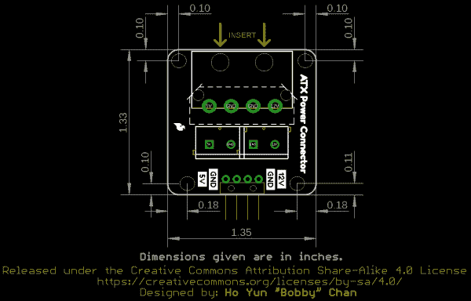
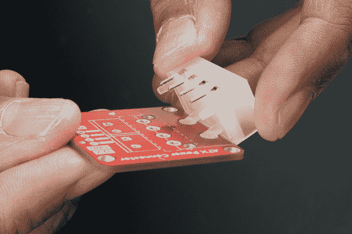
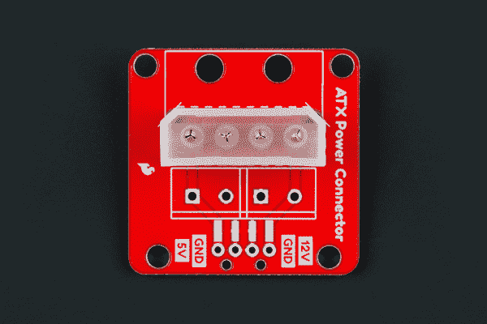
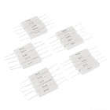

# ATX 电源连接器(4 针)分线连接指南

> 原文：<https://learn.sparkfun.com/tutorials/atx-power-connector-4-pin-breakout-hookup-guide>

## 介绍

您是否需要用一个墙壁适配器为一个项目提供 12V 和 5V 的电源？ATX 电源连接器打破了 12V 和 5V 设备的标准 4 针计算机外设端口！

 

将**添加到您的[购物车](https://www.sparkfun.com/cart)中！**

 **### [SparkFun ATX 电源连接器转接板](https://www.sparkfun.com/products/15035)

[In stock](https://learn.sparkfun.com/static/bubbles/ "in stock") BOB-15035

ATX 电源连接器从一个墙壁适配器上为您的 12V 和 5V 设备断开标准的 4 针计算机外围设备端口…

$2.10[Favorited Favorite](# "Add to favorites") 6[Wish List](# "Add to wish list")**** 

将**添加到您的[购物车](https://www.sparkfun.com/cart)中！**

 **### [【spark fun ATX 电源连接器转接套件- 12V/5V (4 针)](https://www.sparkfun.com/products/15701)

[Only 11 left!](https://learn.sparkfun.com/static/bubbles/ "only 11 left!") KIT-15701

ATX 电源连接器从一个墙壁适配器上为您的 12V 和 5V 设备断开标准的 4 针计算机外围设备端口…

$19.504[Favorited Favorite](# "Add to favorites") 16[Wish List](# "Add to wish list")**** ****[https://www.youtube.com/embed/P9UmLojy_DM/?autohide=1&border=0&wmode=opaque&enablejsapi=1](https://www.youtube.com/embed/P9UmLojy_DM/?autohide=1&border=0&wmode=opaque&enablejsapi=1)

### 所需材料

为了完成本教程，您需要工具包中包含的以下材料。如果您决定将接头引脚或导线直接焊接到电路板上，可以单独订购这些元件。你可能不需要所有的东西，这取决于你拥有什么。将它添加到您的购物车，通读指南，并根据需要调整购物车。

 

将**添加到您的[购物车](https://www.sparkfun.com/cart)中！**

 **### [【spark fun ATX 电源连接器转接套件- 12V/5V (4 针)](https://www.sparkfun.com/products/15701)

[Only 11 left!](https://learn.sparkfun.com/static/bubbles/ "only 11 left!") KIT-15701

ATX 电源连接器从一个墙壁适配器上为您的 12V 和 5V 设备断开标准的 4 针计算机外围设备端口…

$19.504[Favorited Favorite](# "Add to favorites") 16[Wish List](# "Add to wish list")** **### 工具

你需要一个烙铁、焊料和一般的焊接附件。

 

将**添加到您的[购物车](https://www.sparkfun.com/cart)中！**

 **### [袖珍螺丝刀套装](https://www.sparkfun.com/products/12891)

[In stock](https://learn.sparkfun.com/static/bubbles/ "in stock") TOL-12891

每个黑客都应该拥有什么？没错，一把螺丝刀(你必须以某种方式进入那些箱子)。什么…

$4.505[Favorited Favorite](# "Add to favorites") 24[Wish List](# "Add to wish list")**** 

将**添加到您的[购物车](https://www.sparkfun.com/cart)中！**

 **### [【烙铁- 60W(可调温度)](https://www.sparkfun.com/products/14456)

[In stock](https://learn.sparkfun.com/static/bubbles/ "in stock") TOL-14456

当你不想倾家荡产，但又需要一个可靠的烙铁时，这个可调节温度的烙铁是一个很好的工具…

$16.5016[Favorited Favorite](# "Add to favorites") 43[Wish List](# "Add to wish list")**** 

将**添加到您的[购物车](https://www.sparkfun.com/cart)中！**

 **### [无铅焊料- 15 克管](https://www.sparkfun.com/products/9163)

[In stock](https://learn.sparkfun.com/static/bubbles/ "in stock") TOL-09163

这是你的无铅焊料的基本管，带有不干净的水溶性树脂芯。0.031 英寸规格，15 克

$3.954[Favorited Favorite](# "Add to favorites") 14[Wish List](# "Add to wish list")****** ******### 推荐阅读

如果您不熟悉以下概念，我们建议您在继续之前查看这些教程。

 [### 如何焊接:通孔焊接](https://learn.sparkfun.com/tutorials/how-to-solder-through-hole-soldering) This tutorial covers everything you need to know about through-hole soldering.[Favorited Favorite](# "Add to favorites") 70 [### 连接器基础](https://learn.sparkfun.com/tutorials/connector-basics) Connectors are a major source of confusion for people just beginning electronics. The number of different options, terms, and names of connectors can make selecting one, or finding the one you need, daunting. This article will help you get a jump on the world of connectors.[Favorited Favorite](# "Add to favorites") 62 [### 什么是电路？](https://learn.sparkfun.com/tutorials/what-is-a-circuit) Every electrical project starts with a circuit. Don't know what a circuit is? We're here to help.[Favorited Favorite](# "Add to favorites") 82 [### 电力](https://learn.sparkfun.com/tutorials/electric-power) An overview of electric power, the rate of energy transfer. We'll talk definition of power, watts, equations, and power ratings. 1.21 gigawatts of tutorial fun 54 [### 极性](https://learn.sparkfun.com/tutorials/polarity) An introduction to polarity in electronic components. Discover what polarity is, which parts have it, and how to identify it.[Favorited Favorite](# "Add to favorites") 52 [### 12V/5V 电源连接指南](https://learn.sparkfun.com/tutorials/12v5v-power-supply-hookup-guide) In this tutorial, we will replace the 12V/5V (2A) power supply's molex connector with two male barrel jacks adapters.[Favorited Favorite](# "Add to favorites") 5

## 硬件概述

### ATX 连接器侧

该板可以选择焊接一个 4 引脚直角 ATX 电源连接器。

根据您的应用，您可能需要添加一个垂直连接器。不要害怕！PTH 焊盘经过调整，可以增加一个 4 针垂直连接器。只要按照虚线丝网轮廓的连接器周边。

### 5 毫米螺丝端子

在分线点的输出侧，有一个用于两个 2 针 5 毫米螺丝端子的点。

### 试验板兼容引脚

如果需要将分线点连接到试验板或跳线，还可以选择添加垂直或 SMD 直角接头引脚。请记住，接头能够处理的电流量小于螺丝端子。

### 电路板尺寸

该板的尺寸为 1.33 英寸 x 1.35in 英寸，包括四个安装孔，用于将板固定在面板或机箱上。

## 硬件装配

你需要将你选择的连接器焊接到分接头上。如果你以前没有焊接过，看看我们下面的教程吧！

 [### 如何焊接:通孔焊接

#### 2013 年 9 月 19 日](https://learn.sparkfun.com/tutorials/how-to-solder-through-hole-soldering) This tutorial covers everything you need to know about through-hole soldering.[Favorited Favorite](# "Add to favorites") 70

### 焊接输入连接器

你需要决定在分线板上焊接一个 ATX 连接器。该板兼容直角和垂直连接器。我们将使用直角连接器，因为该板可在 SparkFun 的目录中找到。插入直角连接器时，确保在将引脚插入通孔垫之前先插入支撑腿。

|  |  |
| *将支撑腿插入分接头* | *将插销滑入分接头* |

一旦你选择了你所选择的 ATX 连接器，焊接每个引脚到分线点。

对于直角连接器，您的板应该看起来类似于左边的图像。如果您碰巧有一个来自不同分销商的垂直连接器，您的电路板看起来应该与右图相似。

|  |  |
| *直角连接器焊接* | *焊接的垂直连接器* |

### 焊接输出连接器

根据您的应用，您可以将螺丝端子或头部引脚焊接到分接头上。使用螺丝端子，您可以轻松固定叉形连接器或电线。如果您选择螺钉端子路线，您可能需要在拧紧每个相应引脚的螺钉之前[剥去电线](https://learn.sparkfun.com/tutorials/working-with-wire#how-to-strip-a-wire)。如果您决定焊接直头引脚，您可以将电路板插入试验板或原型板。根据您的应用，还可以选择将[直角 SMD 接头](https://www.sparkfun.com/products/12638)焊接到电路板上。根据您选择的连接器和接头，以下是一些配置。请记住，SparkFun 目录只有直角连接器可用。

## 电源选项

以下是您可能会遇到的 4 针连接器的选项。

### ATX 电源

[ATX 电源](https://en.wikipedia.org/wiki/ATX#Main_changes_from_AT_and_LPX_designs)通常有许多电源连接器可为台式电脑的组件供电。下图中感兴趣的连接器是从右边数第二个连接器。这个 [4 针电源连接器](https://en.wikipedia.org/wiki/Molex_connector#Disk_drive)用于给 12V 和 5V 的电脑外设(如磁盘驱动器)供电。根据电源制造商的不同，每个连接器的数量会有所不同。如果您想从这种类型的电源为您的项目获取一些电力，您需要将分线板连接到此端口。

*Image Courtesy of [User "Smial" on Wikipedia](https://en.wikipedia.org/wiki/ATX#Main_changes_from_AT_and_LPX_designs)***Heads up!** Depending on your power supply (especially older ones), the voltage may become unstable or turn off unless there is a minimum "dummy" load. If you are using only one side of the voltage, make sure to check the datasheet and ensure that you are meeting the minimum load requirement. For more information, check out this article below.

*   [制作:项目-计算机电源到工作台电源适配器](https://makezine.com/projects/computer-power-supply-to-bench-power-supply-adapter/)
*   [指令:将计算机电源转换为可变台式实验室电源](https://www.instructables.com/id/Convert-A-Computer-Power-supply-to-a-Bench-Top-Lab/)

In most cases, a minimum of about [10&ohm; 10Watt power resistor](https://www.sparkfun.com/products/13053) is needed. Otherwise, just use [Ohm's Law](https://learn.sparkfun.com/tutorials/voltage-current-resistance-and-ohms-law#ohms-law) and [calculate the amount of power](https://learn.sparkfun.com/tutorials/electric-power#calculating-power) that the power resistor will absorbing to ensure that it can handle the current. Depending on your power supply, the power resistor can become hot so make sure to use a heat sink and enough air flow to dissipate the heat. You can also add a few of power resistors in parallel.

 

将**添加到您的[购物车](https://www.sparkfun.com/cart)中！**

 **### [电源电阻套件- 10W (25 个装)](https://www.sparkfun.com/products/13053)

[In stock](https://learn.sparkfun.com/static/bubbles/ "in stock") KIT-13053

神圣的瓦特，蝙蝠侠！这款电源电阻套件包含 5 种不同的 10 瓦电阻值，包括 1 欧姆、2 欧姆…

$6.502[Favorited Favorite](# "Add to favorites") 16[Wish List](# "Add to wish list")** **### 12V/5V (2A)电源

某些墙壁适配器也利用这种标准的 4 针端口，如目录中的 12V/5V (2A)电源。如果您的项目需要 12V 或 5V 电源，您也可以将分线板连接到该电源。

**Heads up!** If you are using only one of the voltages from the 12V/5V power supply, the other side may become unstable if there is not a minimum load (10mA) just like the note in the ATX power supply above. Depending on your project, you may need to add load in order for the voltage to become stable for long term installations. When testing it out with a multimeter without a load on both sides, the voltages appeared to be stable.

A minimum of about [10&ohm; 10Watt power resistor](https://www.sparkfun.com/products/13053) is needed if you are seeing this instability. In most cases, a minimum of about [10&ohm; 10Watt power resistor](https://www.sparkfun.com/products/13053) is needed. Otherwise, just use [Ohm's Law](https://learn.sparkfun.com/tutorials/voltage-current-resistance-and-ohms-law#ohms-law) and [calculate the amount of power](https://learn.sparkfun.com/tutorials/electric-power#calculating-power) that the resistor will absorbing to ensure that it can handle the current. Depending on your power supply, the power resistor can become hot so make sure to use a heat sink and enough air flow to dissipate the heat. You can also add a few of power resistors in parallel.

 

将**添加到您的[购物车](https://www.sparkfun.com/cart)中！**

 **### [电源电阻套件- 10W (25 个装)](https://www.sparkfun.com/products/13053)

[In stock](https://learn.sparkfun.com/static/bubbles/ "in stock") KIT-13053

神圣的瓦特，蝙蝠侠！这款电源电阻套件包含 5 种不同的 10 瓦电阻值，包括 1 欧姆、2 欧姆…

$6.502[Favorited Favorite](# "Add to favorites") 16[Wish List](# "Add to wish list")** **## 例子

一旦你选择了你的 ATX 电源，你就可以为你的项目注入活力了！根据您的应用，您可以使用该板从任意一侧为您的微控制器和 led 供电。查看以下教程，了解使用 12V/5V 电源的示例。

 [### RGB 面板连接指南](https://learn.sparkfun.com/tutorials/rgb-panel-hookup-guide) Make bright, colorful displays using the 32x16, 32x32, and 32x64 RGB LED matrix panels. This hookup guide shows how to hook up these panels and control them with an Arduino.[Favorited Favorite](# "Add to favorites") 11 [### 触摸电位计连接指南](https://learn.sparkfun.com/tutorials/touch-potentiometer-hookup-guide) Learn how to use the SparkFun Touch Potentiometer to control lighting, volume or other inputs in your daily life.[Favorited Favorite](# "Add to favorites") 7 [### 大数字驱动器连接指南](https://learn.sparkfun.com/tutorials/large-digit-driver-hookup-guide) Getting started guide for the Large Digit display driver board. This tutorial explains how to solder the module (backpack) onto the back of the large 7-segment LED display and run example code from an Arduino.[Favorited Favorite](# "Add to favorites") 11 [### 建造一个安全的破解机器人](https://learn.sparkfun.com/tutorials/building-a-safe-cracking-robot) How to crack an unknown safe in under an hour.[Favorited Favorite](# "Add to favorites") 21

## 资源和更进一步

有关更多信息，请查看以下资源:

*   [示意图(PDF)](https://cdn.sparkfun.com/assets/e/b/6/d/4/SparkFun_ATX_Power_Connector_Breakout_Schematic.pdf)
*   [老鹰文件(ZIP)](https://cdn.sparkfun.com/assets/3/1/6/b/a/SparkFun_ATX_Power_Connector_Breakout_4-pin.zip)
*   [电路板尺寸](https://cdn.sparkfun.com/assets/learn_tutorials/9/6/7/SparkFun_ATX_Power_Connect_Board_Dimension.png)
*   [电源数据表(PDF)](https://cdn.sparkfun.com/assets/6/9/3/a/2/12V2A_5V2A.pdf)
*   教程
    *   [制作:项目-计算机电源到工作台电源适配器](https://makezine.com/projects/computer-power-supply-to-bench-power-supply-adapter/)
    *   [指令:将计算机电源转换为可变台式实验室电源](https://www.instructables.com/id/Convert-A-Computer-Power-supply-to-a-Bench-Top-Lab/)
*   [GitHub](https://github.com/sparkfun/ATX_Power_Connector_Breakout)
*   [SFE 产品展示区](https://youtu.be/P9UmLojy_DM)

你的下一个项目需要更多的灵感吗？查看一些使用 12V/5V (2A)电源的相关教程。

 [### 如何建立一个远程断路开关](https://learn.sparkfun.com/tutorials/how-to-build-a-remote-kill-switch) Learn how to build a wireless controller to kill power when things go... sentient.[Favorited Favorite](# "Add to favorites") 18 [### 12V/5V 电源连接指南](https://learn.sparkfun.com/tutorials/12v5v-power-supply-hookup-guide) In this tutorial, we will replace the 12V/5V (2A) power supply's molex connector with two male barrel jacks adapters.[Favorited Favorite](# "Add to favorites") 5

或者看看这些关于电源的博客帖子。

 [### 电源保护

January 13, 2009](https://www.sparkfun.com/news/220 "January 13, 2009: What is the best way to protect electronics against reverse polarization?")[Favorited Favorite](# "Add to favorites") 0 [### Enginursday:补给！

December 10, 2015](https://www.sparkfun.com/news/1986 "December 10, 2015: A look inside some common power supplies.")[Favorited Favorite](# "Add to favorites") 7 [### 周五产品帖子:一切都好，这意味着一切都好

March 24, 2017](https://www.sparkfun.com/news/2339 "March 24, 2017: A whole slew of new power supplies to help bring your next project to life!")[Favorited Favorite](# "Add to favorites") 0 [### Enginursday: 60 个 USB 充电器并联

May 25, 2017](https://www.sparkfun.com/news/2394 "May 25, 2017: Here I've got 60 USB charger power supplies wired in parallel, just to see what happens. ")[Favorited Favorite](# "Add to favorites") 0 [### enginursday:60 个 USB 电源带来更多乐趣

July 6, 2017](https://www.sparkfun.com/news/2425 "July 6, 2017: Now I'll use these 60 USB supplies to see if I can weld!")[Favorited Favorite](# "Add to favorites") 0****************