# APA102 可寻址 LED 连接指南

> 原文：<https://learn.sparkfun.com/tutorials/apa102-addressable-led-hookup-guide>

## 介绍

[APA102C 可寻址发光二极管](https://www.sparkfun.com/products/14863)采用由时钟和数据线组成的双线通信协议。虽然这比标准 WS2812 可寻址 led 多需要一根导线，但其优势是与 led 的通信具有更快的数据和刷新率(非常适合视觉暂留(又名 POV)项目)。与 WS2812 相比，它们对时间的要求没有那么严格。

[](https://www.sparkfun.com/products/14863) 

将**添加到您的[购物车](https://www.sparkfun.com/cart)中！**

 **### [](https://www.sparkfun.com/products/14863)

[In stock](https://learn.sparkfun.com/static/bubbles/ "in stock") COM-14863

这款 APA102C 是常规的 5050 尺寸 SMD LED 版本。由于嵌入了控制电路，APA102C-5050 的亮度非常高

$4.50[Favorited Favorite](# "Add to favorites") 4[Wish List](# "Add to wish list")****[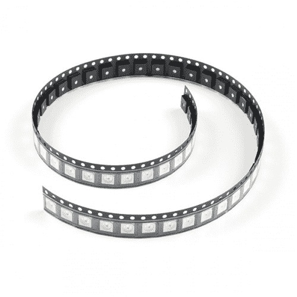](https://www.sparkfun.com/products/16345) 

将**添加到您的[购物车](https://www.sparkfun.com/cart)中！**

 **### [](https://www.sparkfun.com/products/16345)

[In stock](https://learn.sparkfun.com/static/bubbles/ "in stock") COM-16345

这款 APA102C 是常规的 5050 尺寸 SMD LED 版本。由于嵌入了控制电路，APA102C-5050 的亮度非常高

$20.50[Favorited Favorite](# "Add to favorites") 3[Wish List](# "Add to wish list")**** ****### LED 灯条

[LED](https://www.sparkfun.com/leds) 灯条有密封型和非密封型两种。SparkFun 目录中有 APA102 在 [1M 裸带](https://www.sparkfun.com/products/14015)和 [5M 裸带](https://www.sparkfun.com/products/14016)中。

[](https://www.sparkfun.com/products/14015) 

将**添加到您的[购物车](https://www.sparkfun.com/cart)中！**

 **### [LED RGB 条可寻址，1m (APA102)](https://www.sparkfun.com/products/14015)

[In stock](https://learn.sparkfun.com/static/bubbles/ "in stock") COM-14015

这些是可寻址的 1 米长 5V RGB LED 灯条，包装有 60 个 APA102Cs。APA102 LEDs 与 WS281 非常相似…

$17.502[Favorited Favorite](# "Add to favorites") 15[Wish List](# "Add to wish list")****[](https://www.sparkfun.com/products/14016) 

将**添加到您的[购物车](https://www.sparkfun.com/cart)中！**

 **### [【LED RGB 条寻址，5m (APA102)](https://www.sparkfun.com/products/14016)

[In stock](https://learn.sparkfun.com/static/bubbles/ "in stock") COM-14016

这些是可寻址的 5 米长 5V RGB LED 灯条，包装有 300 个 APA102Cs。APA102 LEDs 与 WS28 非常相似…

$96.502[Favorited Favorite](# "Add to favorites") 14[Wish List](# "Add to wish list")**** ****### 矩阵、环、棒、盾

根据项目的不同，它们也可以以矩阵、环或棒的形式安装在 PCB 上。这对于制作字幕或向项目添加独特的动画非常有用！有不同尺寸的 APA102。

[](https://www.sparkfun.com/products/15047) 

将**添加到您的[购物车](https://www.sparkfun.com/cart)中！**

 **### [](https://www.sparkfun.com/products/15047)

[Out of stock](https://learn.sparkfun.com/static/bubbles/ "out of stock") COM-15047

8x8 SparkFun LuMini LED 矩阵，包含 64 个可单独寻址的 LEDS，每个能够产生 1600 万种颜色…

$27.951[Favorited Favorite](# "Add to favorites") 11[Wish List](# "Add to wish list")****[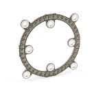](https://www.sparkfun.com/products/14966) 

将**添加到您的[购物车](https://www.sparkfun.com/cart)中！**

 **### [SparkFun LuMini LED 戒指- 2 寸(40 x APA 102-2020)](https://www.sparkfun.com/products/14966)

[In stock](https://learn.sparkfun.com/static/bubbles/ "in stock") COM-14966

SparkFun LuMini LED 戒指的两英寸版本，装有 40 个可单独寻址的 LEDS，每个都能产生…

$18.50[Favorited Favorite](# "Add to favorites") 9[Wish List](# "Add to wish list")****[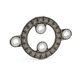](https://www.sparkfun.com/products/14967) 

将**添加到您的[购物车](https://www.sparkfun.com/cart)中！**

 **### [SparkFun LuMini LED 戒指- 1 寸(20 x APA 102-2020)](https://www.sparkfun.com/products/14967)

[Out of stock](https://learn.sparkfun.com/static/bubbles/ "out of stock") COM-14967

SparkFun LuMini LED 戒指的一英寸版本，装有 20 个可单独寻址的 LEDS，每个都能产生…

$11.50[Favorited Favorite](# "Add to favorites") 14[Wish List](# "Add to wish list")****[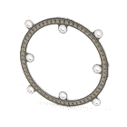](https://www.sparkfun.com/products/14965) 

将**添加到您的[购物车](https://www.sparkfun.com/cart)中！**

 **### [SparkFun LuMini LED 戒指- 3 寸(60 x APA 102-2020)](https://www.sparkfun.com/products/14965)

[Out of stock](https://learn.sparkfun.com/static/bubbles/ "out of stock") COM-14965

三英寸版本的闪光发光二极管戒指，装有 60 个可单独寻址的 LEDS，每个能够产生…

$29.505[Favorited Favorite](# "Add to favorites") 11[Wish List](# "Add to wish list")****************[](https://www.sparkfun.com/products/14359) 

将**添加到您的[购物车](https://www.sparkfun.com/cart)中！**

 **### [spark fun Lumenati 8-stick](https://www.sparkfun.com/products/14359)

[In stock](https://learn.sparkfun.com/static/bubbles/ "in stock") COM-14359

SparkFun Lumenati 8-stick 是一个小型电路板，配备了八个连续的 APA102C LEDs 和两个安装位置。

$9.503[Favorited Favorite](# "Add to favorites") 13[Wish List](# "Add to wish list")****[](https://www.sparkfun.com/products/retired/14357) 

### [【spar fun luminati 8-pack】](https://www.sparkfun.com/products/retired/14357)

[Retired](https://learn.sparkfun.com/static/bubbles/ "Retired") COM-14357

SparkFun Lumenati 8-pack 是一个硬币大小的电路板，配有七个 APA102C LEDs，围绕电路板的外缘，…

**Retired**[Favorited Favorite](# "Add to favorites") 6[Wish List](# "Add to wish list")[](https://www.sparkfun.com/products/retired/14038) 

### [皮莫罗尼 Blinkt！](https://www.sparkfun.com/products/retired/14038)

[Retired](https://learn.sparkfun.com/static/bubbles/ "Retired") DEV-14038

皮莫尔尼薄饼店！是 Raspberry Pi 的“挡箭牌”,配备了八个超亮且可寻址的 RGB LEDs，使……

2 **Retired**[Favorited Favorite](# "Add to favorites") 14[Wish List](# "Add to wish list")[](https://www.sparkfun.com/products/14452) 

将**添加到您的[购物车](https://www.sparkfun.com/cart)中！**

 **### [【火星塞 90L](https://www.sparkfun.com/products/14452)

[In stock](https://learn.sparkfun.com/static/bubbles/ "in stock") COM-14452

SparkFun Lumenati 90L 是一个小的四分之一圆板，配有三个 APA102C LEDs 和一个安装位置。

$5.25[Favorited Favorite](# "Add to favorites") 4[Wish List](# "Add to wish list")****[](https://www.sparkfun.com/products/14358) 

将**添加到您的[购物车](https://www.sparkfun.com/cart)中！**

 **### [【火星塞 90R](https://www.sparkfun.com/products/14358)

[31 available](https://learn.sparkfun.com/static/bubbles/ "31 available") COM-14358

SparkFun Lumenati 90R 是一个小的四分之一圆板，配有三个 APA102C LEDs 和一个安装位置。

$5.25 $2.36[Favorited Favorite](# "Add to favorites") 6[Wish List](# "Add to wish list")****[](https://www.sparkfun.com/products/retired/14360) 

### [【spar fun luminati 3x 3】](https://www.sparkfun.com/products/retired/14360)

[Retired](https://learn.sparkfun.com/static/bubbles/ "Retired") COM-14360

SparkFun Lumenati 3x3 是一个小型的矩形电路板，配有九个排列成 3x3 阵列的 APA102C LEDs。

1 **Retired**[Favorited Favorite](# "Add to favorites") 5[Wish List](# "Add to wish list")[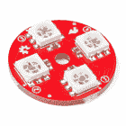](https://www.sparkfun.com/products/retired/14353) 

### [火星塞 4-pack](https://www.sparkfun.com/products/retired/14353)

[Retired](https://learn.sparkfun.com/static/bubbles/ "Retired") COM-14353

SparkFun Lumenati 4-pack 是一个硬币大小的电路板，外部边缘装有四个 APA102C LEDs。

**Retired**[Favorited Favorite](# "Add to favorites") 9[Wish List](# "Add to wish list")****** ******### 所需材料

要跟随本教程，您将需要以下材料。你可能不需要所有的东西，这取决于你拥有什么。将它添加到您的购物车，通读指南，并根据需要调整购物车。

#### 基于 APA102 的 LED 板或带

陈述显而易见的事实:你需要一个基于 APA102 的板或带。越多越开心！在示例连接中，我们将使用 1 米长的 LED 灯条，但该示例应适用于其他基于 APA102 的产品。无论你有多少，只要你认为你的项目需要，就去拿，这是不够的。

#### 单片机还是单板电脑？

首先，你需要一台微控制器或单板计算机。可以发送一系列 1 和 0 来控制发光二极管的东西。我们的首选是配有 ATmega328P 的经典 Arduino Uno，但任何配有库的 Arduino 板都可以使用。一个 [Teensy，ESP8266，ESP32，](https://github.com/FastLED/FastLED#supported-platforms)或 [Raspberry Pi](https://learn.sparkfun.com/tutorials/lumenati-hookup-guide#example-using-a-raspberry-pi-3) 也可以工作，但在本教程的范围内，我们将使用一个 5V 的 Arduino 填充 ATmega328P，SparkFun RedBoard Qwiic。

[](https://www.sparkfun.com/products/11113) 

将**添加到您的[购物车](https://www.sparkfun.com/cart)中！**

 **### [Arduino Pro Mini 328-5V/16 MHz](https://www.sparkfun.com/products/11113)

[In stock](https://learn.sparkfun.com/static/bubbles/ "in stock") DEV-11113

SparkFun 对 Arduino 的极简设计方法。这是一个 5V Arduino 运行 16MHz 引导加载程序。

$10.95137[Favorited Favorite](# "Add to favorites") 166[Wish List](# "Add to wish list")****[](https://www.sparkfun.com/products/15123) 

将**添加到您的[购物车](https://www.sparkfun.com/cart)中！**

 **### [spark fun RedBoard Qwiic](https://www.sparkfun.com/products/15123)

[In stock](https://learn.sparkfun.com/static/bubbles/ "in stock") DEV-15123

SparkFun RedBoard Qwiic 是一款 Arduino 兼容开发板，内置 Qwiic 连接器，无需…

$21.5014[Favorited Favorite](# "Add to favorites") 49[Wish List](# "Add to wish list")****[](https://www.sparkfun.com/products/13664) 

将**添加到您的[购物车](https://www.sparkfun.com/cart)中！**

 **### [SparkFun SAMD21 迷你突围](https://www.sparkfun.com/products/13664)

[In stock](https://learn.sparkfun.com/static/bubbles/ "in stock") DEV-13664

如果您准备从旧的 8 位/16MHz 微控制器升级您的 Arduino 游戏，SparkFun SAMD21 Mini Breakout 是…

$22.5018[Favorited Favorite](# "Add to favorites") 36[Wish List](# "Add to wish list")****** ******#### 逻辑电平

[APA102C 可寻址 led](https://www.sparkfun.com/products/14863)本身采用 5V 逻辑工作，因此选择一个可以提供 0-5V 电压的控制器将会省去您的麻烦，但通过使用电平转换器，它可以采用 3.3V 逻辑工作。如果您使用的是 5V 微控制器，则不需要以下内容。

[](https://www.sparkfun.com/products/12009) 

将**添加到您的[购物车](https://www.sparkfun.com/cart)中！**

 **### [SparkFun 逻辑电平转换器-双向](https://www.sparkfun.com/products/12009)

[In stock](https://learn.sparkfun.com/static/bubbles/ "in stock") BOB-12009

SparkFun 双向逻辑电平转换器是一个小型设备，可以安全地将 5V 信号降压至 3.3V，并升压 3。…

$3.50116[Favorited Favorite](# "Add to favorites") 146[Wish List](# "Add to wish list")****[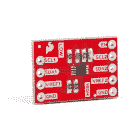](https://www.sparkfun.com/products/15439) 

将**添加到您的[购物车](https://www.sparkfun.com/cart)中！**

 **### [SparkFun 关卡翻译器分会场- PCA9306](https://www.sparkfun.com/products/15439)

[In stock](https://learn.sparkfun.com/static/bubbles/ "in stock") BOB-15439

不同的部分有时使用不同的电压电平进行通信。这款 PCA9306 电平转换器是制作…

$4.951[Favorited Favorite](# "Add to favorites") 22[Wish List](# "Add to wish list")**** ****#### 电源

你还需要一个 5V 的电源来运行你的控制器和新的灯。当红色、绿色和蓝色都满负荷时，每个 APA102C 可以消耗多达 60mA 的电流，所以你会想要一个稍微结实的东西。出于测试目的(假设您没有完全打开所有 led)，您可以使用计算机的 USB 端口和电缆。如果您要将 2.5A 的墙壁适配器安装在一个装置中，它应该足以满足我们的演示。如果你有一个更大的项目，看看平均井 5V/20A 电源。

[](https://www.sparkfun.com/products/13831) 

将**添加到您的[购物车](https://www.sparkfun.com/cart)中！**

 **### [壁式适配器电源- 5.1V DC 2.5A (USB Micro-B)](https://www.sparkfun.com/products/13831)

[In stock](https://learn.sparkfun.com/static/bubbles/ "in stock") TOL-13831

这是一个高品质的开关“壁式”交流到 DC 5.1V 2500ma USB 微型 B 壁式电源，专为…

$8.9521[Favorited Favorite](# "Add to favorites") 47[Wish List](# "Add to wish list")****[](https://www.sparkfun.com/products/retired/12889) 

### [壁式适配器电源- 5V DC 2A(桶形插孔)](https://www.sparkfun.com/products/retired/12889)

[Retired](https://learn.sparkfun.com/static/bubbles/ "Retired") TOL-12889

这是一个高品质的开关“壁式电源”交流到 DC 5V 2000 毫安桶形插座壁式电源，专为…

16 **Retired**[Favorited Favorite](# "Add to favorites") 19[Wish List](# "Add to wish list")[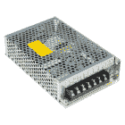](https://www.sparkfun.com/products/retired/14098) 

### [指井开关电源-5v 直流，20A](https://www.sparkfun.com/products/retired/14098)

[Retired](https://learn.sparkfun.com/static/bubbles/ "Retired") TOL-14098

这是一款来自 Mean Well 的 100W 单输出开关电源。这种电源非常可靠，能够输出很高的电压

**Retired**[Favorited Favorite](# "Add to favorites") 19[Wish List](# "Add to wish list")** **#### 电线

你还需要一些**方法来连接**电路板和 Arduino。如果您使用分线板或 LED 灯条，您可以使用跳线(如 [M/M](https://www.sparkfun.com/products/8431) 或 [M/F](https://www.sparkfun.com/products/9140) )和试验板([无焊](https://www.sparkfun.com/products/11317)或[可焊](https://www.sparkfun.com/products/12070))的组合。或者你可以只带几根[连接线](https://www.sparkfun.com/products/11375)或 [4 针 JST-SM 引线连接器](https://www.sparkfun.com/products/14576)。

[](https://www.sparkfun.com/products/12070) 

将**添加到您的[购物车](https://www.sparkfun.com/cart)中！**

 **### [SparkFun 可焊电路板](https://www.sparkfun.com/products/12070)

[In stock](https://learn.sparkfun.com/static/bubbles/ "in stock") PRT-12070

这是 SparkFun 可焊接试验板。一个裸露的 PCB，尺寸与我们的常规试验板完全相同，连接方式相同…

$5.5017[Favorited Favorite](# "Add to favorites") 58[Wish List](# "Add to wish list")****[](https://www.sparkfun.com/products/9140) 

将**添加到您的[购物车](https://www.sparkfun.com/cart)中！**

 **### [跳线高级 6" M/F 装 10 根](https://www.sparkfun.com/products/9140)

[In stock](https://learn.sparkfun.com/static/bubbles/ "in stock") PRT-09140

这是一个 SparkFun 独家！这些都是 155 毫米长，26 美国线规跳线终止作为男性到女性。用这些来跳离…

$4.501[Favorited Favorite](# "Add to favorites") 16[Wish List](# "Add to wish list")****[](https://www.sparkfun.com/products/14576) 

将**添加到您的[购物车](https://www.sparkfun.com/cart)中！**

 **### [LED 条形尾纤连接器(4 针)](https://www.sparkfun.com/products/14576)

[In stock](https://learn.sparkfun.com/static/bubbles/ "in stock") CAB-14576

这些 4 针 JST-SM 尾纤连接器与 LED 灯条和其他只需要两条线路和一根引线的应用完美匹配

$1.60[Favorited Favorite](# "Add to favorites") 9[Wish List](# "Add to wish list")****[](https://www.sparkfun.com/products/11317) 

将**添加到您的[购物车](https://www.sparkfun.com/cart)中！**

 **### [【试验板】半透明不干胶(红色)](https://www.sparkfun.com/products/11317)

[In stock](https://learn.sparkfun.com/static/bubbles/ "in stock") PRT-11317

**描述* *:任何人都无法在透明塑料试验板上进行改进。我是说，那很甜蜜，对吧？如果它是…

$5.501[Favorited Favorite](# "Add to favorites") 20[Wish List](# "Add to wish list")******** ********### 工具

最后，你需要一些工具。如果您要修改 LED 灯条或连接到分线板，可以使用烙铁、一些焊料、[通用焊接附件](https://learn.sparkfun.com/tutorials/how-to-solder-through-hole-soldering)、电线和剥线器。

[](https://www.sparkfun.com/products/11375) 

将**添加到您的[购物车](https://www.sparkfun.com/cart)中！**

 **### [](https://www.sparkfun.com/products/11375)

[In stock](https://learn.sparkfun.com/static/bubbles/ "in stock") PRT-11375

各种颜色的电线:你知道这是一个美丽的东西。六种不同颜色的绞线装在一个纸板盒里…

$22.5019[Favorited Favorite](# "Add to favorites") 46[Wish List](# "Add to wish list")****[](https://www.sparkfun.com/products/14456) 

将**添加到您的[购物车](https://www.sparkfun.com/cart)中！**

 **### [【烙铁- 60W(可调温度)](https://www.sparkfun.com/products/14456)

[In stock](https://learn.sparkfun.com/static/bubbles/ "in stock") TOL-14456

当你不想倾家荡产，但又需要一个可靠的烙铁时，这个可调节温度的烙铁是一个很好的工具…

$16.5016[Favorited Favorite](# "Add to favorites") 43[Wish List](# "Add to wish list")****[](https://www.sparkfun.com/products/9163) 

将**添加到您的[购物车](https://www.sparkfun.com/cart)中！**

 **### [无铅焊料- 15 克管](https://www.sparkfun.com/products/9163)

[In stock](https://learn.sparkfun.com/static/bubbles/ "in stock") TOL-09163

这是你的无铅焊料的基本管，带有不干净的水溶性树脂芯。0.031 英寸规格，15 克

$3.954[Favorited Favorite](# "Add to favorites") 14[Wish List](# "Add to wish list")****[](https://www.sparkfun.com/products/retired/14762) 

### [剥线钳- 22-30AWG](https://www.sparkfun.com/products/retired/14762)

[Retired](https://learn.sparkfun.com/static/bubbles/ "Retired") TOL-14762

这些是你的基本的，普通的剥线钳从 Techni-Tool 与舒适的抓地力，使他们成为一个负担得起的选择…

4 **Retired**[Favorited Favorite](# "Add to favorites") 8[Wish List](# "Add to wish list")****** ******### 推荐阅读

我们试图使这个连接指南尽可能简单，但你可能缺乏一些基本信息，可以帮助你理解我们前进。更多信息，请查看这些教程。

[](https://learn.sparkfun.com/tutorials/how-to-solder-through-hole-soldering) [### 如何焊接:通孔焊接](https://learn.sparkfun.com/tutorials/how-to-solder-through-hole-soldering) This tutorial covers everything you need to know about through-hole soldering.[Favorited Favorite](# "Add to favorites") 70[](https://learn.sparkfun.com/tutorials/installing-an-arduino-library) [### 安装 Arduino 库](https://learn.sparkfun.com/tutorials/installing-an-arduino-library) How do I install a custom Arduino library? It's easy! This tutorial will go over how to install an Arduino library using the Arduino Library Manager. For libraries not linked with the Arduino IDE, we will also go over manually installing an Arduino library.[Favorited Favorite](# "Add to favorites") 22[](https://learn.sparkfun.com/tutorials/binary) [### 二进制的](https://learn.sparkfun.com/tutorials/binary) Binary is the numeral system of electronics and programming...so it must be important to learn. But, what is binary? How does it translate to other numeral systems like decimal?[Favorited Favorite](# "Add to favorites") 51[](https://learn.sparkfun.com/tutorials/how-to-power-a-project) [### 如何为项目提供动力](https://learn.sparkfun.com/tutorials/how-to-power-a-project) A tutorial to help figure out the power requirements of your project.[Favorited Favorite](# "Add to favorites") 67[](https://learn.sparkfun.com/tutorials/logic-levels) [### 逻辑电平](https://learn.sparkfun.com/tutorials/logic-levels) Learn the difference between 3.3V and 5V devices and logic levels.[Favorited Favorite](# "Add to favorites") 82

## APA102 硬件概述

基于 APA102 的 LED 比看上去要多得多。它可能看起来像一个普通的 5050 大小(5x5mm)的 LED，但实际上也有一个集成电路嵌入其中。如果你真的仔细看，你可以看到隐藏在那里的微小黑色芯片，以及连接芯片和 LED 的微小金线。下面是 APA102 的特写。

[](https://cdn.sparkfun.com//assets/parts/1/3/1/3/8/14863-SMD_LED_-_RGB_APA102C-5050__Pack_of_10_-02.jpg)

*Pretty nifty view at the guts of the APA102.*

### 数据传输接口

**Note:** This stuff is ugly, and not critical to understand if you just want to use the APA102\. (That's what libraries are for, right?!) It's interesting to talk about.

微控制器和 APA102 之间的通信接口没有 WS2812 的时序严格，因为它使用双线通信协议，由时钟和数据线组成。基本上是一个简化的 SPI 接口，没有从机引脚。

[](https://cdn.sparkfun.com/assets/learn_tutorials/1/0/0/1/APA102C_clock_data.jpg)*APA102 Timing Diagram from the Datasheet*

数据帧由起始帧、led 数据字段和结束帧组成。数据字段包含一个框架，用于连接到线束的每个 LED。每个 LED 帧以三个 1 开始，5 位表示亮度，8 位表示蓝色，8 位表示绿色，8 位表示红色。特定颜色的值越大，就越亮。如果每种颜色都设置为 0，LED 将关闭。如果每种颜色都设置为 max-255-LED 将尽可能亮和白。

[](https://cdn.sparkfun.com/assets/learn_tutorials/1/0/0/1/APA102C_data_format_protocol.jpg)*APA102 Data Frame from the Datasheet***Note:** For more on the specifics, check out this post from Tim where he investigates the frame using a logic analyzer.

[Tim's Blog: Undertstanding the APA102 "Superled"](https://cpldcpu.wordpress.com/2014/11/30/understanding-the-apa102-superled/)

通过添加时钟线，您可以将它与实时处理器(即 Arduino)和微处理器(即 Raspberry Pi)一起使用。您只需确保为 3.3V 系统使用逻辑电平转换器，并确保您的架构支持 APA102。

## 卢梅纳蒂

Lumenati 是 APA102C 的分线板。根据电路板的不同，它们可以有齿形边缘、焊盘或通孔来连接。它们可以组装在一起，形成精致的设计和形状。

| [](https://learn.sparkfun.com/tutorials/lumenati-hookup-guide#hardware-overview) | [](https://learn.sparkfun.com/tutorials/lumenati-hookup-guide#hardware-overview) | [](https://learn.sparkfun.com/tutorials/lumenati-hookup-guide#hardware-overview) |
| *齿形边缘* | *背部衬垫* | *电镀通孔* |

有关更多信息，请查看另一个教程。

[](https://learn.sparkfun.com/tutorials/lumenati-hookup-guide) [### Lumenati Hookup Guide

#### 2017 年 10 月 12 日](https://learn.sparkfun.com/tutorials/lumenati-hookup-guide) Lumenati is our line of APA102c-based addressable LED boards. We'll show you how to bring the sparkle to your projects 5

## 卢米妮

LuMini 是 Lumenati LEDs 的缩小版。LuMini 使用 APA102-2020 尺寸，以获得紧凑的像素密度。虽然它们有更高的分辨率，但代价是它们的亮度有限。由于小封装的散热能力，高亮度会导致[损坏 LED 和 PCB。](https://learn.sparkfun.com/tutorials/lumini-8x8-matrix-hookup-guide#heat_dissipation)

|  |  |
| *LuMini Ring - 2 寸版* | *LuMini Matrix* |

有关更多信息，请查看以下教程开始学习。

[](https://learn.sparkfun.com/tutorials/lumini-ring-hookup-guide) [### LuMini 环连接指南

#### 2019 年 1 月 17 日](https://learn.sparkfun.com/tutorials/lumini-ring-hookup-guide) The LuMini Rings (APA102-2020) are the highest resolution LED rings available.[Favorited Favorite](# "Add to favorites") 6[](https://learn.sparkfun.com/tutorials/lumini-8x8-matrix-hookup-guide) [### LuMini 8x8 矩阵连接指南

#### 2019 年 1 月 24 日](https://learn.sparkfun.com/tutorials/lumini-8x8-matrix-hookup-guide) The LuMini 8x8 Matrix (APA102-2020) are the highest resolution LED matrix available.[Favorited Favorite](# "Add to favorites") 6

## 可寻址 LED 灯条

如果你需要大量的 WS2812 leds，这些可寻址的 LED 灯条可能适合你。

[](https://cdn.sparkfun.com//assets/parts/1/1/8/0/8/14015-01.jpg)

APA102 可寻址 LED 灯条有几种风格，因尺寸和密封剂而异。你可以买到 1 米或 5 米长的，或者高密度的。对于每段长度的条带，它们可以被防水密封剂覆盖，也可以裸露在外。

### 连接到条带

**Heads up!** Depending on the manufacturer, the color wires can vary. Additionally, the female housing may be connected to the output side and vice versa. Just make sure to follow the wires to the LED strip's pad to ensure that they are properly connected.

LED 灯条的每一端都由一组四种颜色的电线终结:红色、蓝色、绿色和黄色。两根线用于电源，一根线用于时钟，另一根线将数据传输到带内或带外:

| 电线颜色 | 功能 | APA 102 的注释 |
| 红色 | Vcc | APA102 电源。应该是一个**稳压的**电源**在 5V 和 5.5V** 之间。 |
| 蓝色 | 时钟 | 时钟 |
| 格林（姓氏）；绿色的 | 数据输入/输出 | 串行数据输入/输出。看纸条上的箭头和标签，检查是哪一个。 |
| 黄色 | GND | 地面。0V。 |

每个引线都由一个四针 JST SM 连接器端接，您可以用它将**串条连接在一起**。通常，可寻址 led 使用极化 JST SM 连接器，其公外壳插座(母插脚插座)连接到 DI 侧，如图中左侧的连接器所示。母外壳插座(带公插头)连接到 DO 侧，如图所示，连接器位于图像右侧。

[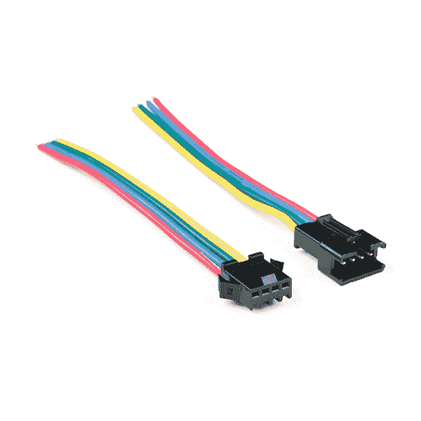](https://cdn.sparkfun.com//assets/parts/1/2/7/2/1/14576-LED_Pigtail_connector_4_Pin_-01.jpg)

对于一个串中的第一个条，您可以连接到一个匹配的连接器，或者剪切并剥去电线，然后将它们连接到您的控制设备。要重复使用剩余的 LED 灯带，请检查 LED 灯带引线连接器，以便轻松连接切割的灯带:

[](https://www.sparkfun.com/products/14576) 

将**添加到您的[购物车](https://www.sparkfun.com/cart)中！**

 **### [LED 条形尾纤连接器(4 针)](https://www.sparkfun.com/products/14576)

[In stock](https://learn.sparkfun.com/static/bubbles/ "in stock") CAB-14576

这些 4 针 JST-SM 尾纤连接器与 LED 灯条和其他只需要两条线路和一根引线的应用完美匹配

$1.60[Favorited Favorite](# "Add to favorites") 9[Wish List](# "Add to wish list")** **## 硬件连接

这些发光二极管的优点是它们非常容易连接在一起。另外，只需要微控制器的两个引脚就可以控制一整排 led。在本例中，我们将控制一个 1M 的 LED 灯条，但您应该可以安全地将其增加十倍甚至更多。

### 焊接/接线什么的

这些产品的第一个组装步骤是在 LED 和控制板之间建立可靠的电气连接。为了实现安全连接，如果您决定将尾纤导线放入一个有大量移动的项目中，或者如果您将它们切割成线束，则需要将它们焊接到原型板/屏蔽上进行连接。你也可以剥开并拼接一些连接线来连接 LED 灯带。

[](https://learn.sparkfun.com/tutorials/how-to-solder-through-hole-soldering) [### 如何焊接:通孔焊接

#### 2013 年 9 月 19 日](https://learn.sparkfun.com/tutorials/how-to-solder-through-hole-soldering) This tutorial covers everything you need to know about through-hole soldering.[Favorited Favorite](# "Add to favorites") 70[](https://learn.sparkfun.com/tutorials/working-with-wire) [### 使用导线

#### 2013 年 2 月 8 日](https://learn.sparkfun.com/tutorials/working-with-wire) How to strip, crimp, and work with wire.[Favorited Favorite](# "Add to favorites") 50

### 连接到 Arduino

这种连接相当简单。您可以使用 USB 电源和 Arduino 的 **5V** 和 **GND** 引脚为分线板供电。然后你所需要的就是发送数据和时钟信号给 LED。让我们分别使用销 **11** 和 **13** 。为了获得最佳性能，我们建议您的微控制器使用硬件引脚。只需将四根 M/F 跳线连接到 RedBoard Qwiic。

[](https://cdn.sparkfun.com/assets/learn_tutorials/1/0/0/1/Arduino_APA102_RGB_LED_Fritzing_bb.jpg)

### 保护你的 APA102！

除了上述连接之外，我们建议在尽可能靠近 WS2812 等可寻址 led 的位置添加一个电容，以帮助您充分利用基于 APA102 的设备来实现长条状。下面是一个可寻址 LED 灯条和通过筒状插孔连接器的独立电源的示例。请阅读以下内容，了解有关建议值的更多信息！

[](https://cdn.sparkfun.com/assets/learn_tutorials/1/0/0/1/Arduino_APA102_RGB_LED_Capacitor_Fritzing_bb.jpg)

#### 添加一个大的平滑电容器

在将 APA102 连接到电源之前，在电源和地之间连接一个大电容。一个在 [100 F](https://www.sparkfun.com/products/96) 和 [1000 F](https://www.sparkfun.com/products/8982) 之间的瓶盖应该是好的。

[](https://www.sparkfun.com/products/8982)

这个帽子将有助于平滑你的电源。APA102 的电流消耗变化很大，随着电流消耗的增加和减少，它将由你的电源来补偿。这个盖子将作为一个“能量水库”来储存能量，以防供应下降。

通过将此电容**与 Vcc 和 GND 引脚平行放置，尽量靠近 APA 102**。

#### 保持电线短！

电线不完全导电。它们将不可避免地引起一些电压损失，特别是当它们很长的时候。尽量使电源、Arduino 和 APA102 之间的电线尽可能短，以尽量减少这种损耗。

## Arduino 库概述

**注意:**此示例假设您在桌面上使用的是最新版本的 Arduino IDE。如果这是你第一次使用 Arduino，请回顾我们关于[安装 Arduino IDE 的教程。](https://learn.sparkfun.com/tutorials/installing-arduino-ide)如果您之前没有安装 Arduino 库，请查看我们的[安装指南。](https://learn.sparkfun.com/tutorials/installing-an-arduino-library)

在本教程中，我们将使用 FastLED 库。该库将帮助您控制 APA102，并提供示例代码以充分利用您的项目。你可以通过 Arduino 库管理器搜索 **FastLED** 来获得这些库。该库还[支持其他 LED 芯片组](https://github.com/FastLED/FastLED/wiki/Chipset-reference)。第二种选择是从 GitHub 库下载下面的 ZIP 文件，手动安装。

[FastLED Arduino Library (ZIP)](https://github.com/FastLED/FastLED/archive/master.zip)

### 因素

当使用快速 LED 库时，[某些参数](https://github.com/FastLED/FastLED/wiki/Basic-usage)至少需要调整以与芯片组兼容。根据不同的例子，`DATA_PIN`可以被称为`LED_PIN`。你可能需要定义一下`CLOCK_PIN`或者也可以简称为`CLK_PIN`。为了获得最佳性能，我们建议使用专用硬件 SPI。但是，如果您决定使用不同的引脚，库[可以重新配置为位碰撞引脚](https://github.com/FastLED/FastLED/wiki/SPI-Hardware-or-Bit-banging)。`LED_TYPE`将被定义为`APA102`芯片组。每个 LED 灯带有 60 个 LED，因此`NUM_LEDs`需要设置为`60`。`COLOR_ORDER`就是`BGR`。

一旦设置了这些参数，您将需要使用`setup()`功能中的`.addLEDs<>()`来初始化 LED 灯条配置。根据动画的亮度和复杂性，有几种方法可以调整项目的质量和外观，如色温、抖动模式、刷新率、FPS 或颜色校正。下面是我们将在本教程中使用的为 APA102 配置设置 LED 灯条的两种方法。

```
language:c
FastLED.addLeds<APA102, DATA_PIN, CLOCK_PIN, BGR>(leds, NUM_LEDS);
FastLED.addLeds<LED_TYPE,DATA_PIN,CLK_PIN,COLOR_ORDER>(leds, NUM_LEDS).setCorrection(TypicalLEDStrip); 
```

**Warning:** There is also a setting to adjust the global brightness using the FastLED Library. If you are using the smaller APA102-2020 package, we recommend setting the brightness using the `FastLED.setBrightness()` function to `32` in the `setup()` to avoid damaging the LEDs.

### 微控制器

该库在多种 Arduino 兼容平台上受支持。有关支持的 AVR 或 ARM 微控制器的列表，请查看库的 **README.md** 上的列表。

[FastLED Library Supported Architectures](https://github.com/FastLED/FastLED#supported-platforms)

## Arduino 示例

FastLED 库包括一些可寻址 LED 芯片组的入门示例。以下示例将演示如何修改示例以用于 APA102 芯片组。更多信息，请查看图书馆的 wiki。

[FastLED Library Wiki: Chipset Reference](https://github.com/FastLED/FastLED/wiki/Chipset-reference#other-stuff)

### 快速闪烁修改

为简单起见，让我们按照下面列出的步骤，使用 FastLED 的 **Blink.ino** 示例，使 APA102 LED 灯带中的一个 LED 闪烁。安装完库后，头转向**文件** > **示例**>**FastLED**>**Blink**打开 Arduino 中的示例。

*   首先，将发光二极管(`NUM_LEDs`)的数量调整为`60`。
*   将`DATA_PIN`改为`11`销。
*   将`CLOCK_PIN`改为`13`。
*   在`setup()`中，
    *   通过在`FastLED.addLeds<NEOPIXEL, DATA_PIN>(leds, NUM_LEDS);`前添加`//`来注释掉一行。
    *   移除`FastLED.addLeds<APA102, DATA_PIN, CLOCK_PIN, RGB>(leds, NUM_LEDS);`前的`//`，取消`APA102`芯片组的 LED 排列。
*   通过将`RGB`更改为`BGR`来修改颜色顺序。

调整代码后，选择您的主板和 COM 端口。然后上传代码，使第一个 LED 灯闪烁！上传后，您应该会看到第一个 LED 闪烁红色。

现在你有了闪烁的红色 LED，试着复制并粘贴两次`loop()`函数中的代码，看看你是否能闪烁绿色和蓝色。这有助于在混合颜色之前测试您的 APA102 是否输出了正确的颜色。

或者将修改后的示例复制并粘贴到 Arduino 草图中。选择 COM 端口和板，并点击上传按钮。

```
language:c
#include <FastLED.h>

// How many leds in your strip?
#define NUM_LEDS 60

// For led chips like Neopixels, which have a data line, ground, and power, you just
// need to define DATA_PIN.  For led chipsets that are SPI based (four wires - data, clock,
// ground, and power), like the LPD8806 define both DATA_PIN and CLOCK_PIN
#define DATA_PIN 11
#define CLOCK_PIN 13

// Define the array of leds
CRGB leds[NUM_LEDS];

void setup() {
  // Uncomment/edit one of the following lines for your leds arrangement.
  // FastLED.addLeds<TM1803, DATA_PIN, RGB>(leds, NUM_LEDS);
  // FastLED.addLeds<TM1804, DATA_PIN, RGB>(leds, NUM_LEDS);
  // FastLED.addLeds<TM1809, DATA_PIN, RGB>(leds, NUM_LEDS);
  // FastLED.addLeds<WS2811, DATA_PIN, RGB>(leds, NUM_LEDS);
  // FastLED.addLeds<WS2812, DATA_PIN, RGB>(leds, NUM_LEDS);
  // FastLED.addLeds<WS2812B, DATA_PIN, RGB>(leds, NUM_LEDS);
  // FastLED.addLeds<NEOPIXEL, DATA_PIN>(leds, NUM_LEDS);
  // FastLED.addLeds<APA104, DATA_PIN, RGB>(leds, NUM_LEDS);
  // FastLED.addLeds<UCS1903, DATA_PIN, RGB>(leds, NUM_LEDS);
  // FastLED.addLeds<UCS1903B, DATA_PIN, RGB>(leds, NUM_LEDS);
  // FastLED.addLeds<GW6205, DATA_PIN, RGB>(leds, NUM_LEDS);
  // FastLED.addLeds<GW6205_400, DATA_PIN, RGB>(leds, NUM_LEDS);

  // FastLED.addLeds<WS2801, RGB>(leds, NUM_LEDS);
  // FastLED.addLeds<SM16716, RGB>(leds, NUM_LEDS);
  // FastLED.addLeds<LPD8806, RGB>(leds, NUM_LEDS);
  // FastLED.addLeds<P9813, RGB>(leds, NUM_LEDS);
  // FastLED.addLeds<APA102, RGB>(leds, NUM_LEDS);
  // FastLED.addLeds<DOTSTAR, RGB>(leds, NUM_LEDS);

  // FastLED.addLeds<WS2801, DATA_PIN, CLOCK_PIN, RGB>(leds, NUM_LEDS);
  // FastLED.addLeds<SM16716, DATA_PIN, CLOCK_PIN, RGB>(leds, NUM_LEDS);
  // FastLED.addLeds<LPD8806, DATA_PIN, CLOCK_PIN, RGB>(leds, NUM_LEDS);
  // FastLED.addLeds<P9813, DATA_PIN, CLOCK_PIN, RGB>(leds, NUM_LEDS);
  FastLED.addLeds<APA102, DATA_PIN, CLOCK_PIN, BGR>(leds, NUM_LEDS);
  // FastLED.addLeds<DOTSTAR, DATA_PIN, CLOCK_PIN, RGB>(leds, NUM_LEDS);
}

void loop() {
  // Turn the LED on, then pause
  leds[0] = CRGB::Red;
  FastLED.show();
  delay(500);
  // Now turn the LED off, then pause
  leds[0] = CRGB::Black;
  FastLED.show();
  delay(500);

  // Turn the LED on, then pause
  leds[0] = CRGB::Green;
  FastLED.show();
  delay(500);
  // Now turn the LED off, then pause
  leds[0] = CRGB::Black;
  FastLED.show();
  delay(500);

  // Turn the LED on, then pause
  leds[0] = CRGB::Blue;
  FastLED.show();
  delay(500);
  // Now turn the LED off, then pause
  leds[0] = CRGB::Black;
  FastLED.show();
  delay(500);
} 
```

FastLED 库中有多种预定义的颜色可供您使用。试试看 **keywords.txt** 试出[不同的颜色](https://github.com/FastLED/FastLED/wiki/Pixel-reference#predefined-colors-list)。然后尝试调整阵列编号，以打开条上不同的 led。

[FastLED Library: keywords.txt](https://github.com/FastLED/FastLED/blob/master/keywords.txt#L147)

### 调色板修改

图书馆里有一些不同动画的演示。让我们试着看看调色板演示。调色板用几个不同的调色板来循环 LED 条。第一种是彩虹，彩虹条纹，紫色和绿色条纹，随机，白色条纹，云状颜色，以及红色/白色/蓝色条纹。根据您的偏好和项目，可以选择混合调色板的 LED 动画。头到**文件** > **示例**>**FastLED**>**color palette**打开 Arduino 中的示例。

*   首先，通过在`#define LED_PIN 5`前面添加`//`来注释掉一行。
*   我们将通过添加下面的行`#define DATA_PIN 11`来定义这个管脚。
*   我们将通过添加下面的行`#define CLK_PIN 13`为时钟添加一个额外的引脚。
*   调整发光二极管(`NUM_LEDS`)到`60`的数量。
*   将`LED_TYPE`改为`APA102`销。
*   通过将`GRB`更改为`BGR`来修改颜色顺序。
*   在`setup()`中，
    *   通过在`FastLED.addLeds<LED_TYPE, LED_PIN, COLOR_ORDER>(leds, NUM_LEDS).setCorrection( TypicalLEDStrip );`前添加`//`来注释掉一行。
    *   通过添加以下行`FastLED.addLeds<LED_TYPE,DATA_PIN,CLK_PIN,COLOR_ORDER>(leds, NUM_LEDS).setCorrection(TypicalLEDStrip);`为`APA102`芯片组添加 LED 排列。

或者将修改后的示例复制并粘贴到 Arduino 草图中。或者将修改后的示例复制并粘贴到 Arduino 草图中。选择 COM 端口和板，并点击上传按钮。

```
language:c
   #include <FastLED.h>

//#define LED_PIN     5 // redefined in the next line
#define DATA_PIN     11
#define CLK_PIN     13
#define NUM_LEDS    60
#define BRIGHTNESS  64
#define LED_TYPE    APA102
#define COLOR_ORDER BGR
CRGB leds[NUM_LEDS];

#define UPDATES_PER_SECOND 100

// This example shows several ways to set up and use 'palettes' of colors
// with FastLED.
//
// These compact palettes provide an easy way to re-colorize your
// animation on the fly, quickly, easily, and with low overhead.
//
// USING palettes is MUCH simpler in practice than in theory, so first just
// run this sketch, and watch the pretty lights as you then read through
// the code.  Although this sketch has eight (or more) different color schemes,
// the entire sketch compiles down to about 6.5K on AVR.
//
// FastLED provides a few pre-configured color palettes, and makes it
// extremely easy to make up your own color schemes with palettes.
//
// Some notes on the more abstract 'theory and practice' of
// FastLED compact palettes are at the bottom of this file.

CRGBPalette16 currentPalette;
TBlendType    currentBlending;

extern CRGBPalette16 myRedWhiteBluePalette;
extern const TProgmemPalette16 myRedWhiteBluePalette_p PROGMEM;

void setup() {
    delay( 3000 ); // power-up safety delay
    //FastLED.addLeds<LED_TYPE, LED_PIN, COLOR_ORDER>(leds, NUM_LEDS).setCorrection( TypicalLEDStrip );
    FastLED.addLeds<LED_TYPE,DATA_PIN,CLK_PIN,COLOR_ORDER>(leds, NUM_LEDS).setCorrection(TypicalLEDStrip);
    FastLED.setBrightness(  BRIGHTNESS );

    currentPalette = RainbowColors_p;
    currentBlending = LINEARBLEND;
}

void loop()
{
    ChangePalettePeriodically();

    static uint8_t startIndex = 0;
    startIndex = startIndex + 1; /* motion speed */

    FillLEDsFromPaletteColors( startIndex);

    FastLED.show();
    FastLED.delay(1000 / UPDATES_PER_SECOND);
}

void FillLEDsFromPaletteColors( uint8_t colorIndex)
{
    uint8_t brightness = 255;

    for( int i = 0; i < NUM_LEDS; i++) {
        leds[i] = ColorFromPalette( currentPalette, colorIndex, brightness, currentBlending);
        colorIndex += 3;
    }
}

// There are several different palettes of colors demonstrated here.
//
// FastLED provides several 'preset' palettes: RainbowColors_p, RainbowStripeColors_p,
// OceanColors_p, CloudColors_p, LavaColors_p, ForestColors_p, and PartyColors_p.
//
// Additionally, you can manually define your own color palettes, or you can write
// code that creates color palettes on the fly.  All are shown here.

void ChangePalettePeriodically()
{
    uint8_t secondHand = (millis() / 1000) % 60;
    static uint8_t lastSecond = 99;

    if( lastSecond != secondHand) {
        lastSecond = secondHand;
        if( secondHand ==  0)  { currentPalette = RainbowColors_p;         currentBlending = LINEARBLEND; }
        if( secondHand == 10)  { currentPalette = RainbowStripeColors_p;   currentBlending = NOBLEND;  }
        if( secondHand == 15)  { currentPalette = RainbowStripeColors_p;   currentBlending = LINEARBLEND; }
        if( secondHand == 20)  { SetupPurpleAndGreenPalette();             currentBlending = LINEARBLEND; }
        if( secondHand == 25)  { SetupTotallyRandomPalette();              currentBlending = LINEARBLEND; }
        if( secondHand == 30)  { SetupBlackAndWhiteStripedPalette();       currentBlending = NOBLEND; }
        if( secondHand == 35)  { SetupBlackAndWhiteStripedPalette();       currentBlending = LINEARBLEND; }
        if( secondHand == 40)  { currentPalette = CloudColors_p;           currentBlending = LINEARBLEND; }
        if( secondHand == 45)  { currentPalette = PartyColors_p;           currentBlending = LINEARBLEND; }
        if( secondHand == 50)  { currentPalette = myRedWhiteBluePalette_p; currentBlending = NOBLEND;  }
        if( secondHand == 55)  { currentPalette = myRedWhiteBluePalette_p; currentBlending = LINEARBLEND; }
    }
}

// This function fills the palette with totally random colors.
void SetupTotallyRandomPalette()
{
    for( int i = 0; i < 16; i++) {
        currentPalette[i] = CHSV( random8(), 255, random8());
    }
}

// This function sets up a palette of black and white stripes,
// using code.  Since the palette is effectively an array of
// sixteen CRGB colors, the various fill_* functions can be used
// to set them up.
void SetupBlackAndWhiteStripedPalette()
{
    // 'black out' all 16 palette entries...
    fill_solid( currentPalette, 16, CRGB::Black);
    // and set every fourth one to white.
    currentPalette[0] = CRGB::White;
    currentPalette[4] = CRGB::White;
    currentPalette[8] = CRGB::White;
    currentPalette[12] = CRGB::White;

}

// This function sets up a palette of purple and green stripes.
void SetupPurpleAndGreenPalette()
{
    CRGB purple = CHSV( HUE_PURPLE, 255, 255);
    CRGB green  = CHSV( HUE_GREEN, 255, 255);
    CRGB black  = CRGB::Black;

    currentPalette = CRGBPalette16(
                                   green,  green,  black,  black,
                                   purple, purple, black,  black,
                                   green,  green,  black,  black,
                                   purple, purple, black,  black );
}

// This example shows how to set up a static color palette
// which is stored in PROGMEM (flash), which is almost always more
// plentiful than RAM.  A static PROGMEM palette like this
// takes up 64 bytes of flash.
const TProgmemPalette16 myRedWhiteBluePalette_p PROGMEM =
{
    CRGB::Red,
    CRGB::Gray, // 'white' is too bright compared to red and blue
    CRGB::Blue,
    CRGB::Black,

    CRGB::Red,
    CRGB::Gray,
    CRGB::Blue,
    CRGB::Black,

    CRGB::Red,
    CRGB::Red,
    CRGB::Gray,
    CRGB::Gray,
    CRGB::Blue,
    CRGB::Blue,
    CRGB::Black,
    CRGB::Black
};

// Additional notes on FastLED compact palettes:
//
// Normally, in computer graphics, the palette (or "color lookup table")
// has 256 entries, each containing a specific 24-bit RGB color.  You can then
// index into the color palette using a simple 8-bit (one byte) value.
// A 256-entry color palette takes up 768 bytes of RAM, which on Arduino
// is quite possibly "too many" bytes.
//
// FastLED does offer traditional 256-element palettes, for setups that
// can afford the 768-byte cost in RAM.
//
// However, FastLED also offers a compact alternative.  FastLED offers
// palettes that store 16 distinct entries, but can be accessed AS IF
// they actually have 256 entries; this is accomplished by interpolating
// between the 16 explicit entries to create fifteen intermediate palette
// entries between each pair.
//
// So for example, if you set the first two explicit entries of a compact 
// palette to Green (0,255,0) and Blue (0,0,255), and then retrieved 
// the first sixteen entries from the virtual palette (of 256), you'd get
// Green, followed by a smooth gradient from green-to-blue, and then Blue. 
```

您应该会看到颜色序列沿着条纹移动。库中还定义了一些您可以使用的“预设”调色板。尝试查看 **colorpalettes.cpp** 了解更多信息，并将`ChangePalettePeriodically()`的`currentPalette`值替换为您选择的预设值。您也可以根据自己的项目，基于 **keywords.txt** 中预先定义的颜色，手动定义自己选择的调色板，类似于`loop()`功能后定义的颜色。

[FastLED Library: colorpalettes.cpp](https://github.com/FastLED/FastLED/blob/master/colorpalettes.cpp)

### 演示卷轴修改

我们要看的另一个例子是演示卷。头到**文件** > **示例**>**fasled**>**demo rele 100**打开 Arduino 中的示例。

*   首先，将`DATA_PIN`调整到销`11`上。
*   通过移除`//`并将其定义为引脚`13`，取消对`CLK_PIN`的注释。
*   将`LED_TYPE`改为`APA102`销。
*   通过将`GRB`更改为`BGR`来修改颜色顺序(`COLOR_ORDER`)。
*   将发光二极管(`NUM_LEDS`)的数量调整到 60 个。
*   在`setup()`中，
    *   通过在`FastLED.addLeds<LED_TYPE,DATA_PIN,COLOR_ORDER>(leds, NUM_LEDS).setCorrection(TypicalLEDStrip);`前添加`//`来注释掉一行。
    *   通过移除`FastLED.addLeds<LED_TYPE,DATA_PIN,CLK_PIN,COLOR_ORDER>(leds, NUM_LEDS).setCorrection(TypicalLEDStrip);`前面的`//`来添加`APA102`芯片组的 LED 排列。

或者将修改后的示例复制并粘贴到 Arduino 草图中。选择 COM 端口和板，并点击上传按钮。

```
language:c
#include <FastLED.h>

FASTLED_USING_NAMESPACE

// FastLED "100-lines-of-code" demo reel, showing just a few 
// of the kinds of animation patterns you can quickly and easily 
// compose using FastLED.  
//
// This example also shows one easy way to define multiple 
// animations patterns and have them automatically rotate.
//
// -Mark Kriegsman, December 2014

#if defined(FASTLED_VERSION) && (FASTLED_VERSION < 3001000)
#warning "Requires FastLED 3.1 or later; check github for latest code."
#endif

#define DATA_PIN    11
#define CLK_PIN     13
#define LED_TYPE    APA102
#define COLOR_ORDER BGR
#define NUM_LEDS    60
CRGB leds[NUM_LEDS];

#define BRIGHTNESS          96
#define FRAMES_PER_SECOND  120

void setup() {
  delay(3000); // 3 second delay for recovery

  // tell FastLED about the LED strip configuration
  //FastLED.addLeds<LED_TYPE,DATA_PIN,COLOR_ORDER>(leds, NUM_LEDS).setCorrection(TypicalLEDStrip);
  FastLED.addLeds<LED_TYPE,DATA_PIN,CLK_PIN,COLOR_ORDER>(leds, NUM_LEDS).setCorrection(TypicalLEDStrip);

  // set master brightness control
  FastLED.setBrightness(BRIGHTNESS);
}

// List of patterns to cycle through.  Each is defined as a separate function below.
typedef void (*SimplePatternList[])();
SimplePatternList gPatterns = { rainbow, rainbowWithGlitter, confetti, sinelon, juggle, bpm };

uint8_t gCurrentPatternNumber = 0; // Index number of which pattern is current
uint8_t gHue = 0; // rotating "base color" used by many of the patterns

void loop()
{
  // Call the current pattern function once, updating the 'leds' array
  gPatterns[gCurrentPatternNumber]();

  // send the 'leds' array out to the actual LED strip
  FastLED.show();  
  // insert a delay to keep the framerate modest
  FastLED.delay(1000/FRAMES_PER_SECOND); 

  // do some periodic updates
  EVERY_N_MILLISECONDS( 20 ) { gHue++; } // slowly cycle the "base color" through the rainbow
  EVERY_N_SECONDS( 10 ) { nextPattern(); } // change patterns periodically
}

#define ARRAY_SIZE(A) (sizeof(A) / sizeof((A)[0]))

void nextPattern()
{
  // add one to the current pattern number, and wrap around at the end
  gCurrentPatternNumber = (gCurrentPatternNumber + 1) % ARRAY_SIZE( gPatterns);
}

void rainbow() 
{
  // FastLED's built-in rainbow generator
  fill_rainbow( leds, NUM_LEDS, gHue, 7);
}

void rainbowWithGlitter() 
{
  // built-in FastLED rainbow, plus some random sparkly glitter
  rainbow();
  addGlitter(80);
}

void addGlitter( fract8 chanceOfGlitter) 
{
  if( random8() < chanceOfGlitter) {
    leds[ random16(NUM_LEDS) ] += CRGB::White;
  }
}

void confetti() 
{
  // random colored speckles that blink in and fade smoothly
  fadeToBlackBy( leds, NUM_LEDS, 10);
  int pos = random16(NUM_LEDS);
  leds[pos] += CHSV( gHue + random8(64), 200, 255);
}

void sinelon()
{
  // a colored dot sweeping back and forth, with fading trails
  fadeToBlackBy( leds, NUM_LEDS, 20);
  int pos = beatsin16( 13, 0, NUM_LEDS-1 );
  leds[pos] += CHSV( gHue, 255, 192);
}

void bpm()
{
  // colored stripes pulsing at a defined Beats-Per-Minute (BPM)
  uint8_t BeatsPerMinute = 62;
  CRGBPalette16 palette = PartyColors_p;
  uint8_t beat = beatsin8( BeatsPerMinute, 64, 255);
  for( int i = 0; i < NUM_LEDS; i++) { //9948
    leds[i] = ColorFromPalette(palette, gHue+(i*2), beat-gHue+(i*10));
  }
}

void juggle() {
  // eight colored dots, weaving in and out of sync with each other
  fadeToBlackBy( leds, NUM_LEDS, 20);
  byte dothue = 0;
  for( int i = 0; i < 8; i++) {
    leds[beatsin16( i+7, 0, NUM_LEDS-1 )] |= CHSV(dothue, 200, 255);
    dothue += 32;
  }
} 
```

led 将根据演示中定义的功能开始播放动画。通读示例代码，看看它们是如何编写的，或者沉浸在动画的光芒中。

### 更多例子！

现在我们已经有了一些使用三个例子的经验，试着修改和测试包含在 FastLED 库中的其他代码！

[FastLED > Examples](https://github.com/FastLED/FastLED/tree/master/examples)

或者您可以查看使用 FastLED 库的 [Lumenati](https://learn.sparkfun.com/tutorials/lumenati-hookup-guide#example-using-a-samd21-mini-breakout) 、 [LuMini ring](https://learn.sparkfun.com/tutorials/lumini-ring-hookup-guide#light-it-up) 和 [LuMini matrix](https://learn.sparkfun.com/tutorials/lumini-8x8-matrix-hookup-guide#light-it-up) 指南。

[](https://learn.sparkfun.com/tutorials/lumenati-hookup-guide) [### Lumenati Hookup Guide](https://learn.sparkfun.com/tutorials/lumenati-hookup-guide) Lumenati is our line of APA102c-based addressable LED boards. We'll show you how to bring the sparkle to your projects 5[](https://learn.sparkfun.com/tutorials/lumini-ring-hookup-guide) [### LuMini 环连接指南](https://learn.sparkfun.com/tutorials/lumini-ring-hookup-guide) The LuMini Rings (APA102-2020) are the highest resolution LED rings available.[Favorited Favorite](# "Add to favorites") 6[](https://learn.sparkfun.com/tutorials/lumini-8x8-matrix-hookup-guide) [### LuMini 8x8 矩阵连接指南](https://learn.sparkfun.com/tutorials/lumini-8x8-matrix-hookup-guide) The LuMini 8x8 Matrix (APA102-2020) are the highest resolution LED matrix available.[Favorited Favorite](# "Add to favorites") 6

## 快速文档和常见问题

FastLED 是一个相当大而复杂的库。特色还挺多的。除了查看代码的注释之外，查看一些 FastLED 的文档和 FAQ 以获得更多信息。

[FastLED > Documentation: Frequently Asked Questions](https://github.com/FastLED/FastLED/wiki/Frequently-Asked-Questions)

## Python 示例

如果你想用不同的语言来控制 led，试着看看下面的教程，用 Python 来控制 APA。您可以通过使用 LumiDrive 的微控制器或使用 Raspberry Pi 的单板计算机来控制它们。查看以下教程了解更多信息。

[](https://learn.sparkfun.com/tutorials/lumidrive-hookup-guide) [### LumiDrive 连接指南

#### 2019 年 1 月 17 日](https://learn.sparkfun.com/tutorials/lumidrive-hookup-guide) The LumiDrive LED Driver is SparkFun’s foray into all things Python on micro-controllers. With the SparkFun LumiDrive you will be able to control and personalize a whole strand of APA102s directly from the board itself.[Favorited Favorite](# "Add to favorites") 5[](https://learn.sparkfun.com/tutorials/lumenati-hookup-guide) [### Lumenati Hookup Guide

#### 2017 年 10 月 12 日](https://learn.sparkfun.com/tutorials/lumenati-hookup-guide) Lumenati is our line of APA102c-based addressable LED boards. We'll show you how to bring the sparkle to your projects 5

## 资源和更进一步

### 配件

尝试编写一些额外的代码并添加更多功能，以便使用[电位计或按钮](https://www.sparkfun.com/categories/145)改变 APA102 的亮度或模式。或者尝试[增加一个传感器](https://www.sparkfun.com/categories/23?page=all)来触发基于声音的动画，对音乐的节拍做出反应！

[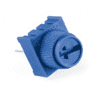](https://www.sparkfun.com/products/9806) 

将**添加到您的[购物车](https://www.sparkfun.com/cart)中！**

 **### [用旋钮微调 10K 欧姆](https://www.sparkfun.com/products/9806)

[In stock](https://learn.sparkfun.com/static/bubbles/ "in stock") COM-09806

这款 10K 可调电位器有一个内置的小旋钮，它是一款友好的实验板。

$1.056[Favorited Favorite](# "Add to favorites") 54[Wish List](# "Add to wish list")****[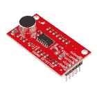](https://www.sparkfun.com/products/14262) 

将**添加到您的[购物车](https://www.sparkfun.com/cart)中！**

 **### [【spark fun 声音探测器(带表头)](https://www.sparkfun.com/products/14262)

[In stock](https://learn.sparkfun.com/static/bubbles/ "in stock") SEN-14262

SparkFun 声音检测器是一个非常简单易用的小型音频检测板，有三种不同的输出。声音检测…

$13.256[Favorited Favorite](# "Add to favorites") 11[Wish List](# "Add to wish list")****[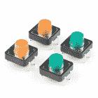](https://www.sparkfun.com/products/14460) 

将**添加到您的[购物车](https://www.sparkfun.com/cart)中！**

 **### [多色纽扣 4 片装](https://www.sparkfun.com/products/14460)

[In stock](https://learn.sparkfun.com/static/bubbles/ "in stock") PRT-14460

这是一个简单的 4 包瞬间多色按钮，非常适合各种项目！与 mult 的先前迭代不同…

$1.75[Favorited Favorite](# "Add to favorites") 19[Wish List](# "Add to wish list")****[](https://www.sparkfun.com/products/15344) 

将**添加到您的[购物车](https://www.sparkfun.com/cart)中！**

 **### [【spark fun 电容式触摸滑盖- CAP1203 (Qwiic)](https://www.sparkfun.com/products/15344)

[In stock](https://learn.sparkfun.com/static/bubbles/ "in stock") SEN-15344

使用 Qwiic 将电容式触摸添加到您的下一个项目中，这样您就可以开始将触摸功能作为三种独特的触摸方式来玩了

$6.50[Favorited Favorite](# "Add to favorites") 26[Wish List](# "Add to wish list")******** ********根据设计，APA102 的分线引脚有一些屏蔽。请务必检查接线，确保它与 LED 灯条的连接相匹配。

[](https://www.sparkfun.com/products/13996) 

将**添加到您的[购物车](https://www.sparkfun.com/cart)中！**

 **### [少女道具盾 LC](https://www.sparkfun.com/products/13996)

[In stock](https://learn.sparkfun.com/static/bubbles/ "in stock") DEV-13996

这种低成本(LC)的小道具盾牌是用来制作小型、手持道具和可穿戴服装上的灯光和声音效果的

$8.95[Favorited Favorite](# "Add to favorites") 10[Wish List](# "Add to wish list")****[](https://www.sparkfun.com/products/retired/13995) 

### [少女道具盾](https://www.sparkfun.com/products/retired/13995)

[Retired](https://learn.sparkfun.com/static/bubbles/ "Retired") DEV-13995

Teensy 道具盾是用来在小型手持道具和可穿戴服装上制作互动的灯光和声音效果的…

1 **Retired**[Favorited Favorite](# "Add to favorites") 13[Wish List](# "Add to wish list")[](https://www.sparkfun.com/products/retired/15046) 

### [聪明盾 V4 给少年 3](https://www.sparkfun.com/products/retired/15046)

[Retired](https://learn.sparkfun.com/static/bubbles/ "Retired") DEV-15046

SmartLED Shield V4 是 SmartMatrix Shield 的下一个版本，为您的青少年和您的……

1 **Retired**[Favorited Favorite](# "Add to favorites") 3[Wish List](# "Add to wish list")** *** * *

有关 APA102 的更多信息，请查看以下资源:

*   数据表
    *   [APA102C LED](https://cdn.sparkfun.com/datasheets/Components/LED/APA102C.pdf)
    *   [APA102-2020-256-6](https://cdn.sparkfun.com/assets/d/c/a/4/2/APA_102-2020-256-6.pdf)
    *   [APA102-2020-256-8](https://cdn.sparkfun.com/assets/0/1/5/c/3/_20181120__APA_102-2020-256-8.pdf)
    *   [LED 灯条](https://cdn.sparkfun.com/datasheets/Components/LED/S60102.pdf)
*   [了解 APA102“超级 led”](https://cpldcpu.wordpress.com/2014/11/30/understanding-the-apa102-superled/)
*   [FastLED 库 GitHub Repo](https://github.com/FastLED/FastLED)
    *   [文档和常见问题解答](https://github.com/FastLED/FastLED/wiki/Frequently-Asked-Questions)

现在你已经掌握了 APA102 的要点，你将如何在项目中使用它？需要一些灵感吗？查看这些教程，了解扩散或菊花链长带的想法:

[](https://learn.sparkfun.com/tutorials/building-large-led-installations) [### 建造大型 LED 装置](https://learn.sparkfun.com/tutorials/building-large-led-installations) Learn what it takes to build large LED installations from planning to power requirements to execution.[Favorited Favorite](# "Add to favorites") 20[](https://learn.sparkfun.com/tutorials/led-cloud-connected-cloud) [### LED 云-连接云](https://learn.sparkfun.com/tutorials/led-cloud-connected-cloud) Make an RGB colored cloud light! You can also control it from your phone, or hook up to the weather 31[](https://learn.sparkfun.com/tutorials/mean-well-led-switching-power-supply-hookup-guide) [### 平均良好的 LED 开关电源连接指南](https://learn.sparkfun.com/tutorials/mean-well-led-switching-power-supply-hookup-guide) In this tutorial, we will be connecting a Mean Well LED switching power supply to an addressable LED strip controlled by an Arduino.[Favorited Favorite](# "Add to favorites") 3[](https://learn.sparkfun.com/tutorials/sparkfun-esp32-dmx-to-led-shield) [### SparkFun ESP32 DMX 至 LED 盾](https://learn.sparkfun.com/tutorials/sparkfun-esp32-dmx-to-led-shield) Learn how to utilize your DMX to LED Shield in a variety of different ways.[Favorited Favorite](# "Add to favorites") 12

或者看看下面的一些博客帖子来寻找灵感:

[](https://www.sparkfun.com/news/2497 "October 10, 2017: If the spooky messages you’re getting from beyond the grave seem vague and disjointed to you, maybe some blinky lights can help to accent the important parts. #funkydemonspeak") [### 用一个发光的会说话的头骨刺穿万圣节的面纱

October 10, 2017](https://www.sparkfun.com/news/2497 "October 10, 2017: If the spooky messages you’re getting from beyond the grave seem vague and disjointed to you, maybe some blinky lights can help to accent the important parts. #funkydemonspeak")[Favorited Favorite](# "Add to favorites") 1[](https://www.sparkfun.com/news/2646 "March 26, 2018: Waking up is the worst. Let's try and make it a little easier on ourselves.") [### DIY 日出闹钟

March 26, 2018](https://www.sparkfun.com/news/2646 "March 26, 2018: Waking up is the worst. Let's try and make it a little easier on ourselves.")[Favorited Favorite](# "Add to favorites") 4[](https://www.sparkfun.com/news/2693 "May 23, 2018: Let's figure out just how fast we can push data through APA102 pixels. Then let's look at what we can do with super fast lights.") [### Wedginursday:帧速率和时髦的颜色

May 23, 2018](https://www.sparkfun.com/news/2693 "May 23, 2018: Let's figure out just how fast we can push data through APA102 pixels. Then let's look at what we can do with super fast lights.")[Favorited Favorite](# "Add to favorites") 3[](https://www.sparkfun.com/news/2711 "June 18, 2018: You'd normally run them in series. But can you run them in parallel?") [### APA102C 的扇出能力

June 18, 2018](https://www.sparkfun.com/news/2711 "June 18, 2018: You'd normally run them in series. But can you run them in parallel?")[Favorited Favorite](# "Add to favorites") 1[](https://www.sparkfun.com/news/2723 "July 2, 2018: We tend to over-simplify the act of dropping an LED into a circuit. But do you know what all of those specs in the data sheet mean?") [### ATP:led 电路设计

July 2, 2018](https://www.sparkfun.com/news/2723 "July 2, 2018: We tend to over-simplify the act of dropping an LED into a circuit. But do you know what all of those specs in the data sheet mean?")[Favorited Favorite](# "Add to favorites") 0[](https://www.sparkfun.com/news/2762 "September 6, 2018: Details of a silly problem with a silly solution: How to not overwrite your outgoing SPI data buffer when using the Arduino core libraries") [### 节省你的缓冲

September 6, 2018](https://www.sparkfun.com/news/2762 "September 6, 2018: Details of a silly problem with a silly solution: How to not overwrite your outgoing SPI data buffer when using the Arduino core libraries")[Favorited Favorite](# "Add to favorites") 4[](https://www.sparkfun.com/news/2841 "December 19, 2018: Are you crystal, gem or mineral collector? Display them in style with an underlit display.") [### 背光液晶显示器

December 19, 2018](https://www.sparkfun.com/news/2841 "December 19, 2018: Are you crystal, gem or mineral collector? Display them in style with an underlit display.")[Favorited Favorite](# "Add to favorites") 6[](https://www.sparkfun.com/news/2857 "January 22, 2019: If you're looking to try coding in Python, especially as it translates to the world of physical computing, the SparkFun LumiDrive is a great way to get started. ") [### Python 和 SparkFun LumiDrive

January 22, 2019](https://www.sparkfun.com/news/2857 "January 22, 2019: If you're looking to try coding in Python, especially as it translates to the world of physical computing, the SparkFun LumiDrive is a great way to get started. ")[Favorited Favorite](# "Add to favorites") 1[](https://www.sparkfun.com/news/2868 "February 5, 2019: Taking what I've learned about LED color mixing and Python, along with our LumiDrive LED Driver and LuMini LED Ring, I set out to create a light ring for macro photography that surpasses all others.") [### DIY 相机镜头灯圈

February 5, 2019](https://www.sparkfun.com/news/2868 "February 5, 2019: Taking what I've learned about LED color mixing and Python, along with our LumiDrive LED Driver and LuMini LED Ring, I set out to create a light ring for macro photography that surpasses all others.")[Favorited Favorite](# "Add to favorites") 3[](https://www.sparkfun.com/news/2939 "June 6, 2019: How the night was won!") [### Enginursday: DIY 电容式触摸小夜灯

June 6, 2019](https://www.sparkfun.com/news/2939 "June 6, 2019: How the night was won!")[Favorited Favorite](# "Add to favorites") 5[](https://www.sparkfun.com/news/3101 "October 10, 2019: We collected over two hundred retired testbeds and turned them into art! Join us as we highlight this project and tell some of the stories behind these dusty old circuit boards.") [### 今日英语:十年的试验台

October 10, 2019](https://www.sparkfun.com/news/3101 "October 10, 2019: We collected over two hundred retired testbeds and turned them into art! Join us as we highlight this project and tell some of the stories behind these dusty old circuit boards.")[Favorited Favorite](# "Add to favorites") 1[](https://www.sparkfun.com/news/3137 "December 12, 2019: Details from a project upgrading an old incandescent lamp to utilize addressable LEDs") [### 今日英语:旧灯学新花样

December 12, 2019](https://www.sparkfun.com/news/3137 "December 12, 2019: Details from a project upgrading an old incandescent lamp to utilize addressable LEDs")[Favorited Favorite](# "Add to favorites") 5************************************************************