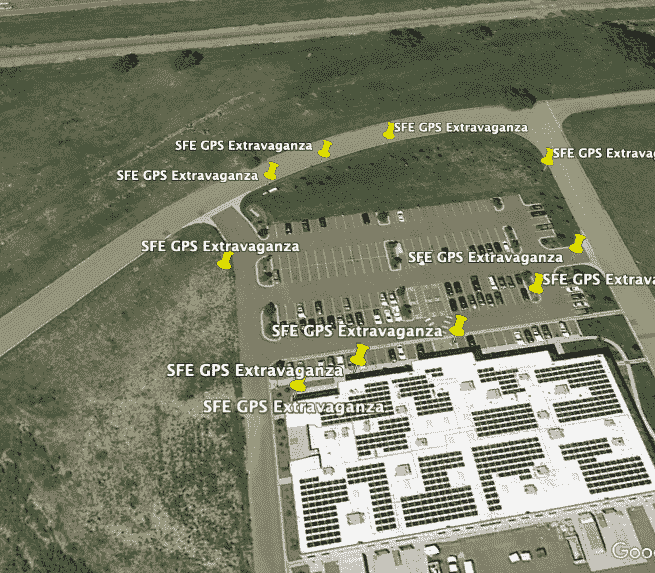

# 只需按下按钮，就能进行 GPS 地理测绘

> 原文：<https://learn.sparkfun.com/tutorials/gps-geo-mapping-at-the-push-of-a-button>

## 介绍

如果你需要一个中级 GPS 项目来满足你的幻想，我们已经准备好了。在之前的教程中，我们把几块板放在一起，在有机发光二极管屏幕上看到我们的 GPS 位置。这是一次很棒的学习经历，但我们需要更多。今天我们将做一些更好的“ol board slappin”，我们将在 KML 文件中保存多个坐标，并接管世界！好吧，不是接管，但我们可以很容易地用谷歌地球看到世界各地的坐标集合。

### 所需材料