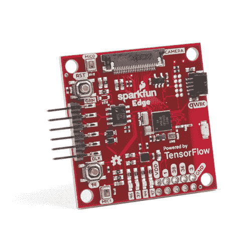

# SparkFun Edge 连接指南

> 原文：<https://learn.sparkfun.com/tutorials/sparkfun-edge-hookup-guide>

## 介绍

有了 [SparkFun Edge 开发板](https://www.sparkfun.com/products/15170)，边缘计算就在眼前！你可能听说过这个最新的科技术语，比如“物联网”、“LoRa”和“云”，但它的优势是什么，为什么重要？云令人印象深刻的强大，但所有时间的连接需要电力和连接可能不可用。边缘计算处理离散任务，例如确定是否有人说“启动洗衣机”并做出相应的响应。音频分析是在“边缘”完成的，而不是在网络上。这大大降低了成本和复杂性，同时限制了潜在的数据隐私泄露。

 

将**添加到您的[购物车](https://www.sparkfun.com/cart)中！**

### [SparkFun Edge 开发板-阿波罗 3 蓝](https://www.sparkfun.com/products/15170)

[In stock](https://learn.sparkfun.com/static/bubbles/ "in stock") DEV-15170

由 TensorFlow 驱动的 SparkFun Edge 开发板非常适合开始使用语音识别，而不依赖于服务器

$16.5020[Favorited Favorite](# "Add to favorites") 45[Wish List](# "Add to wish list")** **既然你已经踏上了通往边缘的旅程，那就让我们花点时间开好头吧。在这个连接指南中，我们将熟悉可用的硬件以及如何连接到您的计算机，然后我们将为您指出正确的方向，开始使用机器学习编写出色的应用程序！

### 所需材料

要跟随本教程，您将需要以下材料。你可能不需要所有的东西，这取决于你拥有什么。将它添加到您的购物车，通读指南，并根据需要调整购物车。**