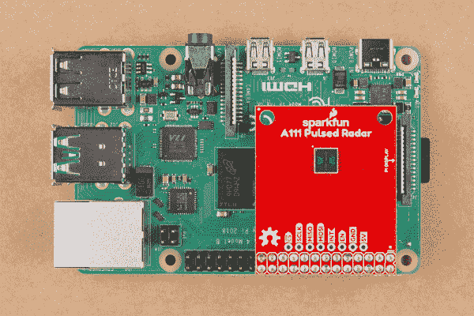
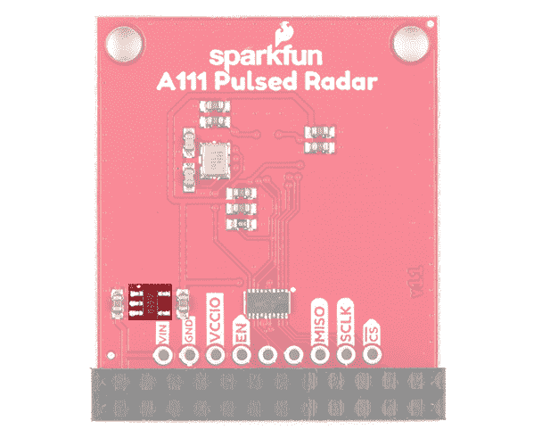

# A111 脉冲雷达传感器入门

> 原文：<https://learn.sparkfun.com/tutorials/getting-started-with-the-a111-pulsed-radar-sensor>

## 介绍

**Heads up!** If you are looking for the hookup guide for the SparkX version of the A111, you can check out the retired tutorial: [Using the A111 Pulsed Radar Sensor with a Raspberry Pi](https://learn.sparkfun.com/tutorials/using-the-a111-pulsed-radar-sensor-with-a-raspberry-pi). However, the older tutorial is outdated due to the SDK version used in the previous guide.

您的项目需要高精度、尖端的距离、速度、运动和/或手势检测吗？我们这里说的不是超声波，甚至不是红外线，而是 60GHz 雷达！向我们小巧的脉冲雷达朋友 A111 问好！

[](https://www.sparkfun.com/products/16826) 

将**添加到您的[购物车](https://www.sparkfun.com/cart)中！**

 **### [SparkFun 脉冲雷达突围- A111](https://www.sparkfun.com/products/16826)

[In stock](https://learn.sparkfun.com/static/bubbles/ "in stock") SEN-16826

SparkFun 脉冲雷达突破为您提供一个高精度的距离测量单位，具有可靠的速度，运动，o…

$59.952[Favorited Favorite](# "Add to favorites") 15[Wish List](# "Add to wish list")****[](https://www.sparkfun.com/products/retired/15577) 

### [SparkFun 脉冲雷达突围- A111](https://www.sparkfun.com/products/retired/15577)

[Retired](https://learn.sparkfun.com/static/bubbles/ "Retired") SEN-15577

SparkFun 脉冲雷达突破为您提供一个高精度的距离测量单位，具有可靠的速度，运动，o…

4 **Retired**[Favorited Favorite](# "Add to favorites") 19[Wish List](# "Add to wish list")** **[https://www.youtube.com/embed/HyEwj6Sbl2M/?autohide=1&border=0&wmode=opaque&enablejsapi=1](https://www.youtube.com/embed/HyEwj6Sbl2M/?autohide=1&border=0&wmode=opaque&enablejsapi=1)

[https://www.youtube.com/embed/PMPekqiOtF4/?autohide=1&border=0&wmode=opaque&enablejsapi=1](https://www.youtube.com/embed/PMPekqiOtF4/?autohide=1&border=0&wmode=opaque&enablejsapi=1)

A111 是用于脉冲相干雷达(PCR)的单芯片解决方案，配有天线和 SPI 接口，速度最高可达 50MHz。PCR 的应用包括距离感测、手势、运动和速度检测。该传感器可以监测一个或多个两米远的物体。

我们的 A111 分线板包括 1.8V 调节器、电压电平转换，它将脉冲雷达传感器的所有引脚分接到 0.1 英寸和 Raspberry Pi 友好型接头。

### 所需材料

**Heads up!** The A111 was designed to work with an ARMv7 to work at a minimum. We were able to get the sensor working on the Raspberry Pi 3, 3B+, and 4\.

要使用 A111，您需要 ARMv7 或 ARM Cortex-M4——闭源 SDK 目前仅支持这些架构。本教程将解释如何将雷达传感器与 **Raspberry Pi** 一起使用，Raspberry Pi 是一个基于 A111 的 SDK 支持的架构的平台。

A111 分线点**包括一个 20 针、2x10 的母接头**，它应该可以与任何一代的树莓派相匹配。如果你宁愿手动将 A111 连接到你的树莓派，大约 9 倍的公母线应该可以做到这一点。

[](https://www.sparkfun.com/products/16826) 

将**添加到您的[购物车](https://www.sparkfun.com/cart)中！**

 **### [SparkFun 脉冲雷达突围- A111](https://www.sparkfun.com/products/16826)

[In stock](https://learn.sparkfun.com/static/bubbles/ "in stock") SEN-16826

SparkFun 脉冲雷达突破为您提供一个高精度的距离测量单位，具有可靠的速度，运动，o…

$59.952[Favorited Favorite](# "Add to favorites") 15[Wish List](# "Add to wish list")****[](https://www.sparkfun.com/products/9385) 

将**添加到您的[购物车](https://www.sparkfun.com/cart)中！**

 **### [跳线高级 12" M/F 装 10 根](https://www.sparkfun.com/products/9385)

[In stock](https://learn.sparkfun.com/static/bubbles/ "in stock") PRT-09385

这是一个 SparkFun 独家！这些是 12 英寸长、26 AWG 跳线，端接为公母连接。用这些从…上跳下来

$4.951[Favorited Favorite](# "Add to favorites") 11[Wish List](# "Add to wish list")****[](https://www.sparkfun.com/products/15361) 

### [树莓派 3 B+入门套件](https://www.sparkfun.com/products/15361)

[Out of stock](https://learn.sparkfun.com/static/bubbles/ "out of stock") KIT-15361

Raspberry Pi 3 B+初学者工具包是一个很好的方式来获得对小型信用卡大小的计算机的可靠介绍。

2[Favorited Favorite](# "Add to favorites") 17[Wish List](# "Add to wish list")**** ****#### 可选材料

当涉及到使用树莓派时，您有几种选择。最常见的是，Pi 用作独立的计算机，需要显示器、键盘和鼠标(如下所列)。为了节省成本，Pi 还可以用作 [*无头*电脑](https://learn.sparkfun.com/tutorials/headless-raspberry-pi-setup/all)(没有显示器、键盘和鼠标)。这种设置有一个稍微难一点的学习曲线，因为你需要从另一台计算机上使用*命令行界面* (CLI)。但是，您也可以使用带有 VNC 的[远程桌面连接连接到无头 Pi，也可以在配置设置后从另一台计算机连接。](https://learn.sparkfun.com/tutorials/795)

[](https://www.sparkfun.com/products/13733) 

将**添加到您的[购物车](https://www.sparkfun.com/cart)中！**

 **### [【树莓派 LCD - 7】触摸屏](https://www.sparkfun.com/products/13733)

[In stock](https://learn.sparkfun.com/static/bubbles/ "in stock") LCD-13733

这款 7 英寸的 Raspberry Pi 触摸屏液晶显示器让您能够创建一个独立的设备，可以用作一个触摸屏

$60.0051[Favorited Favorite](# "Add to favorites") 150[Wish List](# "Add to wish list")****[](https://www.sparkfun.com/products/16300) 

将**添加到您的[购物车](https://www.sparkfun.com/cart)中！**

 **### [罗技 K400 Plus 无线触摸键盘](https://www.sparkfun.com/products/16300)

[In stock](https://learn.sparkfun.com/static/bubbles/ "in stock") WIG-16300

罗技 K400 Plus 无线触摸键盘是一个紧凑的键盘，带有集成的触摸板，将您所有的控制…

$42.95[Favorited Favorite](# "Add to favorites") 5[Wish List](# "Add to wish list")**** ****### 推荐阅读

如果你以前没有设置过树莓派，我们建议你看看下面的教程来开始。总的来说，无论您使用什么版本，设置都是一样的。

[](https://learn.sparkfun.com/tutorials/raspberry-pi-4-kit-hookup-guide) [### Raspberry Pi 4 套件连接指南

#### 2020 年 3 月 14 日](https://learn.sparkfun.com/tutorials/raspberry-pi-4-kit-hookup-guide) Guide for hooking up your Raspberry Pi 4 Model B basic, desktop, or hardware starter kit together.[Favorited Favorite](# "Add to favorites") 2[](https://learn.sparkfun.com/tutorials/raspberry-pi-3-starter-kit-hookup-guide) [### 树莓 Pi 3 入门套件连接指南

#### 2016 年 4 月 11 日](https://learn.sparkfun.com/tutorials/raspberry-pi-3-starter-kit-hookup-guide) Guide for getting going with the Raspberry Pi 3 Model B and Raspberry Pi 3 Model B+ starter kit.[Favorited Favorite](# "Add to favorites") 13

如果您不熟悉以下概念，我们建议您在继续之前查看这些教程。在使用 Pi 开发应用程序时，将 Pi 用作无头设置或与 VNC 一起使用会很有用。

[](https://learn.sparkfun.com/tutorials/raspberry-pi-spi-and-i2c-tutorial) [### 树莓派 SPI 和 I2C 教程](https://learn.sparkfun.com/tutorials/raspberry-pi-spi-and-i2c-tutorial) Learn how to use serial I2C and SPI buses on your Raspberry Pi using the wiringPi I/O library for C/C++ and spidev/smbus for Python.[Favorited Favorite](# "Add to favorites") 24[](https://learn.sparkfun.com/tutorials/headless-raspberry-pi-setup) [### 无头 Raspberry Pi 设置](https://learn.sparkfun.com/tutorials/headless-raspberry-pi-setup) Configure a Raspberry Pi without a keyboard, mouse, or monitor.[Favorited Favorite](# "Add to favorites") 16[](https://learn.sparkfun.com/tutorials/how-to-use-remote-desktop-on-the-raspberry-pi-with-vnc) [### 如何用 VNC 在树莓 Pi 上使用远程桌面](https://learn.sparkfun.com/tutorials/how-to-use-remote-desktop-on-the-raspberry-pi-with-vnc) Use RealVNC to connect to your Raspberry Pi to control the graphical desktop remotely across the network.[Favorited Favorite](# "Add to favorites") 8

## 硬件概述

**Revision Changes:** Overall, the functionality between v1.0 for v1.1 is the same. Minor changes in v1.1 include:

*   PTH for VCCIO
*   旁路跳线将 VCCIO 设置为 VIN
*   输入电压的丝网名称变化(5V => VIN)
*   改善了 Raspberry Pi 端的逻辑电平转换

本节概述两种版本的电路板的硬件。要查看您使用的主板版本，您可以查看主板背面靠近 CS 引脚的位置。您还会注意到 1.1 版中额外的旁路跳线，这是 1.0 版中没有的。

| [](https://cdn.sparkfun.com/assets/learn_tutorials/1/0/0/4/16826-SparkFun_Pulsed_Radar_Breakout_A111_v1_1.jpg) | [](https://cdn.sparkfun.com/assets/learn_tutorials/1/0/0/4/15577-SparkFun_Pulsed_Radar_Breakout_-_A111-v1_0.jpg) |
| 1.1 版和 1.0 版主板背面的版本号 |

### 传感器和晶体

分线板装有 A111 IC 和一个外部 26MHz 晶体振荡器。该 IC 带有两个天线，使用毫米波无线电通过雷达脉冲感应物体。

| [](https://cdn.sparkfun.com/assets/learn_tutorials/1/0/0/4/16826-SparkFun_Pulsed_Radar_Breakout_A111_v1_1_Sensor.jpg) | [](https://cdn.sparkfun.com/assets/learn_tutorials/1/0/0/4/Pulsed_Radar_Breakout_A111.jpg) |
| *A111 填充在 v1.1 和 v1.0 顶部* |

您可以在电路板背面找到外部晶体振荡器。两个版本的电路板上的位置是相同的。

| [](https://cdn.sparkfun.com/assets/learn_tutorials/1/0/0/4/16826-SparkFun_Pulsed_Radar_Breakout_A111_v1_1_Crystal_Oscillator.jpg) | [](https://cdn.sparkfun.com/assets/learn_tutorials/1/0/0/4/Pulsed_Radar_Breakout_A111_Crystal_Oscillator.jpg) |
| *安装在背面 v1.1 和 v1.0 上的晶体振荡器* |

### 2x13 母接头

为了保持电路板的尺寸较小，电路板上焊接了一个 2x13 母接头，以便轻松与 [Raspberry Pi 的标准接头](https://learn.sparkfun.com/tutorials/raspberry-gpio#gpio-pinout)配合。

| [](https://cdn.sparkfun.com/assets/learn_tutorials/1/0/0/4/16826-SparkFun_Pulsed_Radar_Breakout_A111_v1_1_Pi_HAT_Standard_Header.jpg) | [](https://cdn.sparkfun.com/assets/learn_tutorials/1/0/0/4/Pulsed_Radar_Breakout_A111_Pi_26-Pin_Header.jpg) |
| *带阴连接器 v1.1 和 v1.0 的帽子标准接头* |

这应该只覆盖 Pi 上 2x20 外螺纹接头的一部分。不管版本号是多少，帽子都会堆在显示器端口的带状电缆连接器附近。

| [](https://cdn.sparkfun.com/assets/learn_tutorials/1/0/0/4/Raspberry-Pi-A111-v1_1_Pulsed-Radar-HAT-_Stacked.jpg) | [](https://cdn.sparkfun.com/assets/learn_tutorials/1/0/0/4/Raspberry-Pi-A111-Pulsed-Radar-HAT-_Stacked.jpg) |
| *A111 帽子 v1.1 和 v1.0 叠在树莓皮上* |

### 额外的针脚和跳线断开

在 26 引脚接头的正上方，还有额外的 SPI、中断、使能和电源引脚，如果您需要使用这些引脚的话。请注意，在 1.1 版中，输入电压标记为`VIN`，而 1.0 版将引脚标记为`5V`。两个引脚都连接到 Raspberry Pi 的 HAT 标准引脚排列的 5V。对于 1.1 版，VCCIO 的附加 PTH 包括在使能和 GND 引脚之间。对于 1.1 版，额外的引脚被移动并与 2x13 接头对齐。

| [](https://cdn.sparkfun.com/assets/learn_tutorials/1/0/0/4/16826-SparkFun_Pulsed_Radar_Breakout_A111_v1_1_PTH.jpg) | [](https://cdn.sparkfun.com/assets/learn_tutorials/1/0/0/4/Pulsed_Radar_Breakout_A111_Additional_Pins.jpg) |
| *v 1.1 和 v1.0 上的针脚断开* |

对于 1.1 版，您还会注意到一个旁路跳线(标记为`BYP`)。[在电路板上添加一个跳线](https://learn.sparkfun.com/tutorials/how-to-work-with-jumper-pads-and-pcb-traces/all#adding-a-solder-jumper)会将`VCCIO`设置为`VIN`。

[](https://cdn.sparkfun.com/assets/learn_tutorials/1/0/0/4/16826-SparkFun_Pulsed_Radar_Breakout_A111_v1_1_Jumper.jpg)**Note:** Adding a solder jumper to the v1.1's `BYP` pin will set VCCIO to VIN. If you are stacking the HAT on a Raspberry Pi, this will set the logic level on the Raspberry Pi's side to 5V.We recommend leaving this jumper alone when stacking the board on a Pi.

A111 IC 要求输入电压为 **1.8V** ，因此电压调节器安装在背面。

| [](https://cdn.sparkfun.com/assets/learn_tutorials/1/0/0/4/16826-SparkFun_Pulsed_Radar_Breakout_A111_v1_1_Voltage_Regulator.jpg) | [](https://cdn.sparkfun.com/assets/learn_tutorials/1/0/0/4/Pulsed_Radar_Breakout_A111_Voltage_Regulator.jpg) |
| *v 1.1 和 v1.0 上的电压调节器* |

此外，A111 上的 [I/O 逻辑电平](https://learn.sparkfun.com/tutorials/logic-levels)为 **1.8V** ，因此包含一个逻辑转换器来转换树莓 Pi 之间的信号。

| [](https://cdn.sparkfun.com/assets/learn_tutorials/1/0/0/4/16826-SparkFun_Pulsed_Radar_Breakout_A111_v1_1_Logic_Level_Translator.jpg) | [](https://cdn.sparkfun.com/assets/learn_tutorials/1/0/0/4/Pulsed_Radar_Breakout_A111-Logic_Level_Converter.jpg) |
| *v 1.1 和 v1.0 上的逻辑电平转换器* |

### 电路板尺寸

主板的整体尺寸为 1.30 英寸 x 1.55in 英寸。主板边缘有两个额外的安装孔，间距为 0.10 英寸。

| [](v1.1 Board Dimensions) | [](https://cdn.sparkfun.com/assets/learn_tutorials/1/0/0/4/SparkFun_A111_Pulsed_Radar_Sensor_Board_Dimensions.png) |
| 【v1.1 和 v1.0 的板尺寸 |

## 硬件装配

A111 脉冲雷达分线点被设计成直接位于树莓派的顶部。同样，它不能跨越 Raspberry Pi B+(或更高版本)的所有 40 (2x20)引脚，但 26 引脚(2x13)接头应该与任何 Pi 兼容。

将屏蔽连接到 Raspberry Pi，确保分线点上的" **Pi 显示**"文本与 Pi 上的显示标题匹配。插入传感器后，传感器应该朝上。

| [](https://cdn.sparkfun.com/assets/learn_tutorials/1/0/0/4/Raspberry-Pi-A111-v1_1_Pulsed-Radar-HAT-_Stacked.jpg) | [](https://cdn.sparkfun.com/assets/learn_tutorials/1/0/0/4/Raspberry-Pi-A111-Pulsed-Radar-HAT-_Stacked.jpg) |
| *A111 帽子 v1.1 和 v1.0 叠在树莓皮上* |

或者，如果您想手动将分线点连接到[树莓派的标准引脚](https://learn.sparkfun.com/tutorials/raspberry-gpio/all#gpio-pinout)，这里是我们将在本教程的其余部分使用的引脚。如 1.1 版硬件概述中所述，输入电压标记为`VIN`，而 1.0 版将引脚标记为`5V`。两个引脚都连接到 Raspberry Pi 的 HAT 标准引脚排列的 5V。对于 1.1 版，VCCIO 的附加 PTH 包括在使能和 GND 引脚之间。

| v1.1 分线销 | v1.0 分线销 | Raspberry Pi 引脚名称 | RasPi 硬件 Pin 号 |
| 特许测量员 | 特许测量员 | SPI0 CS0 | Twenty-four |
| SCLK | SCLK | SPI0 SCLK | Twenty-three |
| 军事情报部门组织(Military Intelligence Service Organization) | 军事情报部门组织(Military Intelligence Service Organization) | SPI0 MISO | Twenty-one |
| MOSI | MOSI | SPI0 MOSI | Nineteen |
| （同 Internationalorganizations）国际组织 | （同 Internationalorganizations）国际组织 | GPIO25 | Twenty-two |
| 在中 | 在中 | GPIO27 | Thirteen |
| VCCIO |  | **3.3V** | 1, 17 |
| GND | GND | GND | 6、14、20 等。 |
| 车辆识别号码 | 5V | **5V** | 2, 4 |

⚡ **Input Voltage and Logic Levels:** "5V" should power the sensor, which can consume ~80mA.

When connecting to the additional pins broken out next to the Raspberry Pi's I/O, make sure to not accidentally connect anything higher than 3.3V since it is only 3.3V tolerant.

## 配置您的 Pi

**拉斯比安和 SPI**

本教程假设您已经用 Raspbian 设置了一个树莓 Pi。要在你的 Pi 上安装基于 Debian 的操作系统，请查看 Raspberrypi.org 的文档。或者——更好！-查看我们的[无头树莓 Pi 设置教程](https://learn.sparkfun.com/tutorials/headless-raspberry-pi-setup)。

您还需要在您的 PI 上**启用 SPI** 。要获得帮助，请查看我们的[Pi SPI 教程](https://learn.sparkfun.com/tutorials/raspberry-pi-spi-and-i2c-tutorial#spi-on-pi)。

我们假设你已经有了一个 Raspbian 运行的 Raspberry Pi。我们还假设它连接到互联网。如果没有，请查看我们的初学者工具包和设置树莓 Pi 的教程。我们建议看下面的教程来开始。总的来说，无论您使用什么版本，设置都是一样的。

[](https://learn.sparkfun.com/tutorials/raspberry-pi-4-kit-hookup-guide) [### Raspberry Pi 4 套件连接指南

#### 2020 年 3 月 14 日](https://learn.sparkfun.com/tutorials/raspberry-pi-4-kit-hookup-guide) Guide for hooking up your Raspberry Pi 4 Model B basic, desktop, or hardware starter kit together.[Favorited Favorite](# "Add to favorites") 2[](https://learn.sparkfun.com/tutorials/raspberry-pi-3-starter-kit-hookup-guide) [### 树莓 Pi 3 入门套件连接指南

#### 2016 年 4 月 11 日](https://learn.sparkfun.com/tutorials/raspberry-pi-3-starter-kit-hookup-guide) Guide for getting going with the Raspberry Pi 3 Model B and Raspberry Pi 3 Model B+ starter kit.[Favorited Favorite](# "Add to favorites") 13

请确保更新图像，以便我们有最新的发行版。在[命令行](https://learn.sparkfun.com/tutorials/terminal-basics/command-line-windows-mac-linux)中分别输入以下命令来更新您的图像。

```
language:bash
sudo apt-get update
sudo apt-get dist-upgrade 
```

**Note:** sudo stands for "Super User Do", it is a way to give you superuser powers from the command line. Be careful whenever using `sudo`.

### 用户配置设置

一旦你设置好了，我强烈建议你更改默认的登录名和密码:(**用户名** : pi，**密码** : raspberry)。Raspberry Pi 配置工具是更改密码以及设置网络、语言、键盘等的快捷方式。有两种方法可以调整设置。您可以通过进入 **Pi 开始菜单** > **首选项** > **树莓 Pi 配置** > **界面**来使用 GUI。对于老校长，您也可以使用 [**raspi-config** 工具](https://learn.sparkfun.com/tutorials/raspberry-pi-3-starter-kit-hookup-guide/all#configuring-the-pi)，通过使用[命令行](https://learn.sparkfun.com/tutorials/terminal-basics/command-line-windows-mac-linux)键入以下命令，然后浏览菜单来更新您的信息。

```
language:bash
sudo raspi-config 
```

您需要使用工具来启用 SPI 引脚，以便用 SPI 读取传感器。如果您正在使用图形用户界面，只需选择**启用**并点击确定按钮。如果您正在使用 **raspi-config** ，请按照提示完成 spi 设置。欲了解更多信息，请查看我们的[教程，在 Pi](https://learn.sparkfun.com/tutorials/raspberry-pi-spi-and-i2c-tutorial#spi-on-pi) 上设置 SPI 引脚。

| [](https://cdn.sparkfun.com/assets/learn_tutorials/4/4/9/Raspberry-Pi-Configuration-Enable-Interfaces.png) | [](https://cdn.sparkfun.com/assets/learn_tutorials/4/4/9/spi-menu2.png) |
| *通过桌面 GUI 启用 SPI* | *终端中 spi 的 raspi-config 工具* |

您需要重新启动您的 Pi 以使更改生效。

## 获取 SDK

**Heads up!** The following instructions are listed for SDK v2.1\. Acconeer provides frequent software updates to the SDK packages to fix bugs and provide the latest features. The steps may not apply for higher SDK versions. You may need to adjust the path names depending on the changes. for higher versions.

不幸的是，A111 的软件开发套件(SDK)被锁定在一个封闭的源代码 blob 后面，该 blob 目前仅支持 Cortex-M4 和 ARMv7 平台。然而，Acconeer 的人已经同意使用他们网站上我们的示例代码来托管他们 SDK 的最新版本。要从 Acconeer 下载最新的 SDK，请在您的 Raspberry Pi 浏览器上访问 [Acconeer 的“开发者”页面](https://developer.acconeer.com/)。

[Visit Acconeer's "Developer" for the SDK](https://developer.acconeer.com/)

你需要一个帐户才能访问这些文件。单击页面底部的链接创建一个或登录。或者点击下面的快捷方式。

[Sign Up with Acconeer](https://developer.acconeer.com/register/) [Log In with Acconeer](https://developer.acconeer.com/log-in/)

登录后，“**软件下载**选项卡将包含下载 SDK 的附加链接。将网页向下滚动到 **SPARKFUN** 部分。Acconeer 不断更新和改进软件。我们在编写本教程时使用了该软件的 **v2.1** ，因此该版本可能与您下载的版本不同。点击**下载**按钮获取最新版本。在这种情况下，它是 v2.1。

[](https://cdn.sparkfun.com/assets/learn_tutorials/1/0/0/4/Acconeer-A111-SDK_Downloads_Update.png)*Download the SDK from Acconeer.*

通读许可协议，同意并点击软件的**下载 acconeer_rpi_sparkfun** 按钮。根据您的浏览器，您可能需要刷新页面并重复指示，按钮才会被激活。

下载完成后，转到您下载 ZIP 文件的目录。您可以使用 GUI 或者使用[终端](https://learn.sparkfun.com/tutorials/terminal-basics)使用以下命令解压缩 SDK(包括安装 unzip 的命令)。请确保使用您下载的版本更新文件名。假设您在**下载**文件夹中，您将在终端中使用以下命令。

```
language:bash
unzip acconeer_rpi_sparkfun_v2_1_0.zip 
```

**Note:** Make sure you replace the acconeer ZIP file name with that of your downloaded SDK version.

然后`cd`到“ **rpi_sparkfun** 目录准备构建示例软件。根据您下载的版本，路径可能会略有不同。如果您在浏览目录时遇到问题，请确保使用`ls`来验证解压缩后的 **a111** 文件夹的内容。

### SDK 概述

A111 SDK 包括使用 A111 脉冲雷达传感器的源代码、存档库、包含文件和文档。以下是 SDK 包含的内容的快速概述:

*   **doc** — Doxygen 为 A111 API 和源代码生成的文档。
*   **包含** —头文件和 API 文件，描述如何与预编译的 A111 库交互。
*   **lib** —预编译的 A111 静态档案。这些文件的 API 在“include”目录中提供。
*   **out** —编译后的板卡和实例对象以及可执行文件。
*   **规则** —纸板和示例文件的递归 Makefile 规则。
*   **source** —定制板和示例应用的 C 源文件。
*   **makefile** —顶层 makefile。递归调用“规则”目录中的文件来构建示例和纸板文件。

## 构建并运行测试草图

在终端中，执行 make 文件——以及它的递归依赖项——应该可以构建所有您可能会在 **A111** 中使用的示例。要构建所有的电路板和示例文件，导航到 SDK 的顶层目录(在这种情况下，它应该类似于**...在你的 **makefile** 所在的位置下载/rpi_sparkfun** ，并在终端中键入`make`或`make all`命令。您应该会看到类似下面的输出。

[](https://cdn.sparkfun.com/assets/learn_tutorials/1/0/0/4/A111_make_terminal-update.png)

#### 解决纷争

如果您在构建电路板和示例文件时遇到任何问题，请确保您已经安装了 gcc 和 make 包。(如`apt-get install make gcc`)

### 运行示例应用程序

编译后，您就可以运行示例应用程序了。导航到**.../out 终端窗口中带有`cd`的**文件夹。您可以通过单击可执行文件或键入以下命令来运行该示例。我们建议在终端中键入命令来查看数据。如果您选择单击可执行文件，一些应用程序会在获取传感器数据后自动关闭窗口。

```
language:bash
./example_detector_distance_basic_rpi_sparkfun_a111_r2c 
```

一旦你输入(或者在终端中粘贴)了命令，点击键盘上的`Enter`来执行命令。

[](https://cdn.sparkfun.com/assets/learn_tutorials/1/0/0/4/A111_Raspberry_Pi_Terminal_Distance_Basic_Sensor-update.png)

这将运行我们修改过的距离检测器示例应用程序。为简单起见，它将显示天线前方物体的距离。

[](https://cdn.sparkfun.com/assets/learn_tutorials/1/0/0/4/A111_Raspberry_Pi_Distance_Sensing_Basic-update.png)

通过在传感器前面放置一个物体，距离应该根据 A111 可以检测到的内容而变化。应用程序将继续在终端窗口中运行，直到循环结束。在这种情况下，该示例抽取了 10 个样本。尝试调整代码以获得更多样本！

| [](https://cdn.sparkfun.com/assets/learn_tutorials/1/0/0/4/Raspberry-Pi-A111_v1_1-Pulsed-Radar-Sensing-Object-Distance.jpg) | [](https://cdn.sparkfun.com/assets/learn_tutorials/1/0/0/4/Raspberry-Pi-A111-Pulsed-Radar-Sensing-Object-Distance.jpg) |
| *手放在 A111 v1.1 和 v1.0 前面，Pi 通过 VNC 远程连接。* |

### 运行其他示例

除了基本的距离检测器，SDK 还包括一些额外的例子。要执行这些文件，从 **out** 目录运行它们:

*   **example _ detector _ presence _ rpi _ spark fun _ a111 _ r2c**—如果传感器前方有物体移动，会输出 true。否则，输出为假。
*   **示例 _ 探测器 _ 障碍物 _rpi_sparkfun_a111_r2c** —检查是否有物体挡路。
*   **example _ service _ IQ _ rpi _ spark fun _ a111 _ r2c**—包络服务的高级版本，包括距离微小变化的相位信息。输出将采用极坐标。
*   **example _ service _ power _ bins _ rpi _ spark fun _ a111 _ r2c**—演示如何使用 A111“电源箱”，这对我们来说仍然是一个谜...
*   **example _ detector _ distance _ peak _ rpi _ spark fun _ a111 _ r2c**—该应用程序将从计算原始峰值距离开始，最多十次反射。该示例将简要估计最小和最大阈值。

在为 A111 编写您自己的定制代码之前，请务必通读代码中的注释(位于 **source** 文件夹中)、数据表、用户指南和 Acconeer 的相关文档以获取更多信息。

## 解决纷争

为了获得最佳支持，我们建议查看常见问题解答或向 Acconeer 提交支持票，因为他们处理软件 SDK 包。

[Acconeeer > FAQ and SDK Support](https://developer.acconeer.com/)

## 资源和更进一步

现在，您已经成功启动并运行了 A111 脉冲雷达传感器，是时候将它集成到您自己的项目中了！有关更多信息，请查看以下资源:

*   v1.1
    *   [示意图(PDF)](https://cdn.sparkfun.com/assets/4/a/8/a/b/SparkFun_A111_Pulsed_Radar_Sensor_Breakout_Schematic_V1_1.pdf)
    *   [老鹰文件(ZIP)](https://cdn.sparkfun.com/assets/b/0/4/b/7/SparkFun_A111_Pulsed_Radar_Sensor_Breakout_v1_1.zip)
    *   [板尺寸(PNG)](https://cdn.sparkfun.com/assets/3/7/2/1/b/SparkFun_A111_Pulsed_Radar_Breakout_Board_Dimensions_v1_1.png)
    *   [SFE 展示区](https://youtu.be/HyEwj6Sbl2M)
*   1.0 版
    *   [示意图(PDF)](https://cdn.sparkfun.com/assets/7/2/2/5/f/SparkFun_A111_Pulsed_Radar_Sensor_Schematic.pdf)
    *   [老鹰文件(ZIP)](https://cdn.sparkfun.com/assets/8/4/b/3/3/SparkFun_A111_Pulsed_Radar_Breakout.zip)
    *   [板尺寸(PNG)](https://cdn.sparkfun.com/assets/learn_tutorials/1/0/0/4/SparkFun_A111_Pulsed_Radar_Sensor_Board_Dimensions.png)
    *   [SFE 展示区](https://youtu.be/PMPekqiOtF4)
*   会计
    *   [开发者](https://developer.acconeer.com/) -软件下载、数据表、用户指南、常见问题解答
    *   [阅读文档:设置您的 Raspberry PI EVK](https://acconeer-python-exploration.readthedocs.io/en/latest/evk_setup/raspberry.html)——Python 示例的文档，可能有助于可视化 A111 示例的数据。
*   吉卜赛人休息
    *   [根据示例代码](https://github.com/acconeer)
    *   *[SparkFun 示例代码](https://github.com/sparkfun/SparkFun_Pulsed_Radar_A111_Example_Code)(已存档)*
    *   [硬件回购](https://github.com/sparkfun/SparkFun_Pulsed_Radar_Breakout_A111)

你的下一个项目需要一些灵感吗？查看一些相关教程:

[](https://learn.sparkfun.com/tutorials/getting-started-with-walabot) [### Walabot 入门](https://learn.sparkfun.com/tutorials/getting-started-with-walabot) See through walls, track objects, monitor breathing patterns, and more using the power of radio frequency with the Walabot! In this tutorial, we will explore Walabot’s features using the Software Demo Kit (SDK) on Windows and the Application Programming Interface (API) on Linux-based distributions for embedded projects.[Favorited Favorite](# "Add to favorites") 4**********