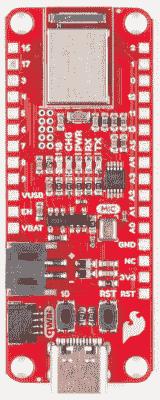
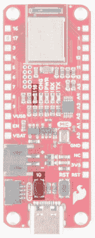

# SparkFun Artemis 的连接指南

> 原文：<https://learn.sparkfun.com/tutorials/hookup-guide-for-the-sparkfun-artemis-thing-plus>

## 介绍

如果没有兼容羽毛的 [SparkFun Artemis Thing Plus](https://www.sparkfun.com/products/15574) ，我们的 Artemis 系列就不完整。有 21 个 GPIO 引脚-所有 PWM 和中断功能-有 2 个 I ² C 总线可用，以及 SPI 和 UART。我们已经包括数字 MEMS 麦克风，允许通过 TensorFlow 和机器学习始终在线的语音命令，并且 [Qwiic](https://www.sparkfun.com/qwiic) 连接器使使用我们的 Qwiic 传感器像即插即用一样简单！

 

将**添加到您的[购物车](https://www.sparkfun.com/cart)中！**

 **### [火花趣事 Plus——阿尔忒弥斯](https://www.sparkfun.com/products/15574)

[25 available](https://learn.sparkfun.com/static/bubbles/ "25 available") WRL-15574

SparkFun Artemis Thing Plus 采用了我们流行的羽毛足迹，并添加了强大的 Artemis 模块，以实现终极功能

$22.50[Favorited Favorite](# "Add to favorites") 28[Wish List](# "Add to wish list")** **[https://www.youtube.com/embed/uJnQyoB7oSw/?autohide=1&border=0&wmode=opaque&enablejsapi=1](https://www.youtube.com/embed/uJnQyoB7oSw/?autohide=1&border=0&wmode=opaque&enablejsapi=1)

### 所需材料

你需要阿耳特弥斯增强版和一根 USB C 线。任何 USB C 线都可以，包括你手机充电器附带的那根。

 

将**添加到您的[购物车](https://www.sparkfun.com/cart)中！**

 **### [火花趣事 Plus——阿尔忒弥斯](https://www.sparkfun.com/products/15574)

[25 available](https://learn.sparkfun.com/static/bubbles/ "25 available") WRL-15574

SparkFun Artemis Thing Plus 采用了我们流行的羽毛足迹，并添加了强大的 Artemis 模块，以实现终极功能

$22.50[Favorited Favorite](# "Add to favorites") 28[Wish List](# "Add to wish list")**** 

### [USB 2.0 线 A 到 C - 3 脚](https://www.sparkfun.com/products/retired/15092)

[Retired](https://learn.sparkfun.com/static/bubbles/ "Retired") CAB-15092

USB C 棒极了。但是，在我们将所有的集线器、充电器和端口转换为 USB C 之前，这是您要使用的电缆…

**Retired**[Favorited Favorite](# "Add to favorites") 8[Wish List](# "Add to wish list")** **### 推荐阅读

如果你不熟悉 Qwiic 系统，我们推荐你在这里阅读[以获得一个概述](https://www.sparkfun.com/qwiic)。

|  |
| *[Qwiic 连接系统](https://www.sparkfun.com/qwiic)* |

我们还建议在继续之前查看这些教程:

 [### I2C](https://learn.sparkfun.com/tutorials/i2c) An introduction to I2C, one of the main embedded communications protocols in use today.[Favorited Favorite](# "Add to favorites") 128 [### 用 SparkFun Artemis 设计](https://learn.sparkfun.com/tutorials/designing-with-the-sparkfun-artemis) Let's chat about layout and design considerations when using the Artemis module.[Favorited Favorite](# "Add to favorites") 4 [### 用 Arduino 开发 Artemis](https://learn.sparkfun.com/tutorials/artemis-development-with-arduino) Get our powerful Artemis based boards (Artemis Nano, BlackBoard Artemis, and BlackBoard Artemis ATP) blinking in less than 5 minutes using the SparkFun Artemis Arduino Core 6

## 硬件概述

Artemis Thing Plus 有很大范围的功能要打通，我们来看看吧？

### 特点:

*   1M 闪存/ 384k 内存
*   提供 48MHz / 96MHz turbo
*   21 个 GPIO 引脚-全部支持中断
*   21 个 PWM 通道
*   内置 BLE 电台
*   8 个 14 位精度 ADC 通道
*   2 I ² C 总线
*   1 SPI bus
*   2 个 UARTs
*   PDM 数字麦克风
*   I ² S 接口
*   Qwiic 连接器

⚡ **Warning:** All pins are **3.3V**. DO NOT expose the pins to 5V.

The ADC on the Artemis is **0-2V**. Exposing an ADC pin to 3.3V will not harm the device but the ADC will saturate returning 16,383 (14-bit) for voltages greater than 2V.

### 串行和 JTAG 编程

RedBoard Artemis Thing Plus 有两种编程方法。最常见的是 USB C 连接器，作为 USB 到串行桥。只需按下 Arduino IDE 中的“上传”或 SDK 中的“启动加载”, Artemis 上的固件就会更新。

*Click the image for a closer look*

我们在 RedBoard Artemis Thing Plus 上使用 CH340E。该驱动程序应该会自动安装在大多数操作系统上。然而，有各种各样的操作系统。第一次将芯片连接到计算机的 USB 端口时，或者有操作系统更新时，您可能需要安装驱动程序。更多信息，请查看我们的[如何安装 CH340 驱动教程](https://www.sparkfun.com/ch340)。

 [### 如何安装 CH340 驱动程序

#### 2019 年 8 月 6 日](https://learn.sparkfun.com/tutorials/how-to-install-ch340-drivers) How to install CH340 drivers (if you need them) on Windows, Mac OS X, and Linux.[Favorited Favorite](# "Add to favorites") 9

第二种方法是 JTAG 编程。需要断点级别调试的高级用户可以使用未填充的 JTAG 足迹。我们建议检查我们的 [JTAG 部分](https://www.sparkfun.com/categories/tags/jtag)的兼容公头和兼容的 JTAG 编程器和调试器。

*Click the image for a closer look*

### GPIO

Artemis Thing Plus 在电路板的两侧有 21 个可用的 GPIO 引脚。此外，用户按钮和 LED 还有单独的 IO。LED 引脚支持 PWM，但按钮的引脚不支持。Artemis Thing Plus 原理图可以为您提供更多关于 Thing Plus 使用了哪些 Apollo3 焊盘的信息。您也可以将此与[阿波罗 3 号衬垫图](https://cdn.sparkfun.com/assets/learn_tutorials/9/2/8/Apollo3_Pad_Mapping.pdf)进行交叉参考。

|  |  |
| *GPIO 引脚轨* | *用户按钮和 LED* |

*Click on either image for a closer look*

### Qwiic 和 I ² C

Artemis Thing Plus 上的 I ² C 引脚在电路板背面标有 SDA 和 SCL。它们在 Arduino IDE 中使用`Wire.begin()`、`Wire.read()`等进行控制。虽然引脚 16/17 使用 Wire1，但 Qwiic 连接器使用 Wire，因此您可以使用 SparkFun 的 [Qwiic 生态系统](https://www.sparkfun.com/qwiic)(每周有 50 多块电路板甚至更多！).

|  |  |
| *前视图:Qwiic 连接器和 I ² C 插脚 16 和 17* | *后视图:引脚 16/SDA1 和 17/SCL1* |

*Click on either image for a closer look*

### Mic 和 RTC

Artemis 擅长低功耗语音识别。为此，我们在板上集成了一个 PDM MEMS 麦克风。此外，Artemis 模块可以在给定外部 32kHz 晶振的情况下操作 RTC，因此我们已经包括了这一点。

*Click the image for a closer look*

### 电路板尺寸

所有纸板尺寸都以英寸为单位。总的来说，pcb 尺寸为 2.3x.9 英寸，从 USB-C 连接器略微伸出。

## 软件设置

Artemis Thing Plus 能够运行 Arduino 和更高级的 Ambiq HAL/SDK。检查这些教程，让你在 5 分钟内起床并眨眼！

 [### 用 Arduino 开发 Artemis

#### 2019 年 6 月 20 日](https://learn.sparkfun.com/tutorials/artemis-development-with-arduino) Get our powerful Artemis based boards (Artemis Nano, BlackBoard Artemis, and BlackBoard Artemis ATP) blinking in less than 5 minutes using the SparkFun Artemis Arduino Core 6 [### 将 SparkFun Edge 板与 Ambiq Apollo3 SDK 配合使用

#### 2019 年 3 月 28 日](https://learn.sparkfun.com/tutorials/using-sparkfun-edge-board-with-ambiq-apollo3-sdk) We will demonstrate how to get started with your SparkFun Edge Board by setting up the toolchain on your computer, examining an example program, and using the serial uploader tool to flash the chip.[Favorited Favorite](# "Add to favorites") 7

## 解决纷争

**Need help?**

If your product is not working as you expected or you need technical assistance or information, head on over to the [SparkFun Technical Assistance](https://www.sparkfun.com/technical_assistance) page for some initial troubleshooting.

If you don't find what you need there, the [SparkFun Forums](https://forum.sparkfun.com/index.php) are a great place to find and ask for help. If this is your first visit, you'll need to [create a Forum Account](https://forum.sparkfun.com/ucp.php?mode=register) to search product forums and post questions.

[**SparkFun Artemis Forums**](https://forum.sparkfun.com/viewforum.php?f=167)

## 资源和更进一步

你知道你可以使用 SparkFun Artemis Thing Plus 作为你自己的 Artemis 产品的起点吗？从我们的 repo [这里](https://github.com/sparkfun/Artemis_Thing_Plus)获取设计文件，并使用 Eagle PCB 编辑它们！

有关 RedBoard Artemis 和 Artemis 模块本身的更多信息，请查看以下链接:

*   [示意图(PDF)](https://cdn.sparkfun.com/assets/6/f/0/5/9/ArtemisThingPlusSchematic.pdf)
*   [老鹰文件(ZIP)](https://cdn.sparkfun.com/assets/d/b/5/6/4/Artemis_Thing_Plus_Eagle_Files.zip)
*   [Artemis 模块图形数据表(PDF)](https://github.com/sparkfun/Graphical_Datasheets/blob/master/Datasheets/Artemis/Artemis%20Module/ArtemisModulev2.pdf)
*   [Arduino 核心 GitHub](https://github.com/sparkfun/Arduino_Apollo3)
*   [蒿属植物信息页](https://www.sparkfun.com/artemis)
*   [GitHub 硬件回购](https://github.com/sparkfun/Artemis_Thing_Plus)
*   [阿波罗 3 数据表(PDF)](https://cdn.sparkfun.com/assets/1/5/c/6/7/Apollo3-Blue-MCU-Datasheet_v0_15_0.pdf)
*   [Ambiq](https://ambiq.com/)
*   [阿波罗 3 衬垫图](https://cdn.sparkfun.com/assets/learn_tutorials/9/2/8/Apollo3_Pad_Mapping.pdf)
*   [CH340E USB 转串行 IC 驱动器](https://learn.sparkfun.com/tutorials/sparkfun-serial-basic-ch340c-hookup-guide/all#drivers-if-you-need-them)
*   [阿耳忒弥斯东西加木板尺寸](https://cdn.sparkfun.com/assets/learn_tutorials/9/2/8/Artemis_Thing_Plus_Dimensions.png)

你现在已经探索了棋盘，让我们开始用 Arduino 闪烁吧！或者您可能想了解更多关于 Artemis 模块本身的信息。查看这些教程！

 [### 用 SparkFun Artemis 设计](https://learn.sparkfun.com/tutorials/designing-with-the-sparkfun-artemis) Let's chat about layout and design considerations when using the Artemis module.[Favorited Favorite](# "Add to favorites") 4 [### 用 Arduino 开发 Artemis](https://learn.sparkfun.com/tutorials/artemis-development-with-arduino) Get our powerful Artemis based boards (Artemis Nano, BlackBoard Artemis, and BlackBoard Artemis ATP) blinking in less than 5 minutes using the SparkFun Artemis Arduino Core 6

你知道 Artemis 和我们的 Qwiic 系列兼容吗？检查这些产品，只需插入和工作！

 

将**添加到您的[购物车](https://www.sparkfun.com/cart)中！**

 **### [【spark fun 紫外线传感器分线点- VEML6075 (Qwiic)](https://www.sparkfun.com/products/15089)

[In stock](https://learn.sparkfun.com/static/bubbles/ "in stock") SEN-15089

VEML6075 紫外线传感器突破是 SparkFun 的最新紫外线传感解决方案。

$7.50[Favorited Favorite](# "Add to favorites") 18[Wish List](# "Add to wish list")**** 

将**添加到您的[购物车](https://www.sparkfun.com/cart)中！**

 **### [SparkFun Edge 开发板-阿波罗 3 蓝](https://www.sparkfun.com/products/15170)

[In stock](https://learn.sparkfun.com/static/bubbles/ "in stock") DEV-15170

由 TensorFlow 驱动的 SparkFun Edge 开发板非常适合开始使用语音识别，而不依赖于服务器

$16.5020[Favorited Favorite](# "Add to favorites") 45[Wish List](# "Add to wish list")**** 

将**添加到您的[购物车](https://www.sparkfun.com/cart)中！**

 **### [SparkFun MicroMod Qwiic 载板-单个](https://www.sparkfun.com/products/17723)

[30 available](https://learn.sparkfun.com/static/bubbles/ "30 available") DEV-17723

单个 MicroMod Qwiic 载板可用于快速制作其他 qw IC 器件的原型。

$9.95[Favorited Favorite](# "Add to favorites") 3[Wish List](# "Add to wish list")**** 

将**添加到您的[购物车](https://www.sparkfun.com/cart)中！**

 **### [SparkFun Qwiic 多星星座饰品](https://www.sparkfun.com/products/21277)

[In stock](https://learn.sparkfun.com/static/bubbles/ "in stock") WIG-21277

Qwiic MultiStar 为 I2C 总线上只有一个 Qwiic 端口的板增加了五个额外的端口，也可以添加到其他板上

$4.95[Favorited Favorite](# "Add to favorites") 2[Wish List](# "Add to wish list")************