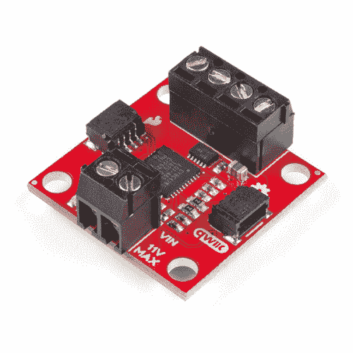

# Qwiic 电机驱动器的连接指南

> 原文：<https://learn.sparkfun.com/tutorials/hookup-guide-for-the-qwiic-motor-driver>

## 介绍

[Qwiic 电机驱动器](https://www.sparkfun.com/products/15451)采用了串行控制电机驱动器的所有强大功能，并对其进行了小型化，增加了用于即插即用功能的 [Qwiic](https://www.sparkfun.com/qwiic) 端口。拥有相同的 PSOC 和双通道电机端口，QWIIC 电机驱动器设计为通过 I ² C 进行通信，但 UART 也可用。

 

将**添加到您的[购物车](https://www.sparkfun.com/cart)中！**

 **### [SparkFun Qwiic 电机驱动器](https://www.sparkfun.com/products/15451)

[In stock](https://learn.sparkfun.com/static/bubbles/ "in stock") ROB-15451

SparkFun Qwiic 电机驱动器采用了串行控制电机驱动器的所有功能，并将其小型化，增加了 Qw…

$19.501[Favorited Favorite](# "Add to favorites") 28[Wish List](# "Add to wish list")** **[https://www.youtube.com/embed/4lf7R9ZqNQM/?autohide=1&border=0&wmode=opaque&enablejsapi=1](https://www.youtube.com/embed/4lf7R9ZqNQM/?autohide=1&border=0&wmode=opaque&enablejsapi=1)

### 所需材料

要跟随本教程，您将需要以下材料。你可能不需要所有的东西，这取决于你拥有什么。将它添加到您的购物车，通读指南，并根据需要调整购物车。**