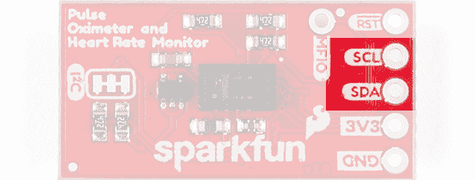

# SparkFun 脉搏血氧仪和心率监测器连接指南

> 原文：<https://learn.sparkfun.com/tutorials/sparkfun-pulse-oximeter-and-heart-rate-monitor-hookup-guide>

## 介绍

[SparkFun 脉搏血氧仪和心率监测器](https://www.sparkfun.com/products/15219)是一种基于 I C 的[生物传感器](https://en.wikipedia.org/wiki/Biometrics)。SparkFun 脉搏血氧仪和心率监测器采用 Maxim Integrated 的两个芯片，具有 MAX30101 生物传感器和 MAX32664 生物识别集线器。前者负责所有的检测，而后者是一个非常小而快速的 Cortex M4 处理器，处理所有的算法计算、数字滤波、压力/位置补偿、高级 R 波检测和自动增益控制。我们将它们结合起来，编写了一个 Arduino 库，其中包含演示基本到高级功能的示例代码，以帮助您开始在下一个项目中使用 SparkFun 脉搏血氧仪和心率监护仪。或者，如果你想将这些 IC 应用到最终产品中，Maxim 已经提供了一些功能来获得 FDA 的批准。我们开始吧！

[](https://www.sparkfun.com/products/15219) 

将**添加到您的[购物车](https://www.sparkfun.com/cart)中！**

 **### [【spark fun 脉搏血氧仪和心率传感器——max 30101&max 32664(Qwiic)](https://www.sparkfun.com/products/15219)

[In stock](https://learn.sparkfun.com/static/bubbles/ "in stock") SEN-15219

SparkFun 脉搏血氧仪和心率传感器是一款非常小巧的 I2C qw IIC 生物识别传感器。

$42.958[Favorited Favorite](# "Add to favorites") 46[Wish List](# "Add to wish list")** **[https://www.youtube.com/embed/FVOD5SdEAFA/?autohide=1&border=0&wmode=opaque&enablejsapi=1](https://www.youtube.com/embed/FVOD5SdEAFA/?autohide=1&border=0&wmode=opaque&enablejsapi=1)

**NOTE: This device is not intended to diagnose or treat any conditions.**

### 所需材料

为了理解本教程中使用的示例代码，您还需要以下材料。你可能不需要所有的东西，这取决于你拥有什么。将它添加到您的购物车，通读指南，并根据需要调整购物车。

[](https://www.sparkfun.com/products/15123) 

将**添加到您的[购物车](https://www.sparkfun.com/cart)中！**

 **### [spark fun RedBoard Qwiic](https://www.sparkfun.com/products/15123)

[In stock](https://learn.sparkfun.com/static/bubbles/ "in stock") DEV-15123

SparkFun RedBoard Qwiic 是一款 Arduino 兼容开发板，内置 Qwiic 连接器，无需…

$21.5014[Favorited Favorite](# "Add to favorites") 49[Wish List](# "Add to wish list")****[](https://www.sparkfun.com/products/10215) 

将**添加到您的[购物车](https://www.sparkfun.com/cart)中！**

 **### [USB micro-B 线- 6 脚](https://www.sparkfun.com/products/10215)

[In stock](https://learn.sparkfun.com/static/bubbles/ "in stock") CAB-10215

USB 2.0 型到微型 USB 5 针。这是一种新的、更小的 USB 设备连接器。微型 USB 连接器大约是…

$5.5014[Favorited Favorite](# "Add to favorites") 21[Wish List](# "Add to wish list")****[](https://www.sparkfun.com/products/14427) 

将**添加到您的[购物车](https://www.sparkfun.com/cart)中！**

 **### [Qwiic 线缆- 100mm](https://www.sparkfun.com/products/14427)

[In stock](https://learn.sparkfun.com/static/bubbles/ "in stock") PRT-14427

这是一条 100 毫米长的 4 芯电缆，带有 1 毫米 JST 端接。它旨在将支持 Qwiic 的组件连接在一起…

$1.50[Favorited Favorite](# "Add to favorites") 32[Wish List](# "Add to wish list")****[](https://www.sparkfun.com/products/9741) 

将**添加到您的[购物车](https://www.sparkfun.com/cart)中！**

 **### [带猪尾的 IC 钩](https://www.sparkfun.com/products/9741)

[In stock](https://learn.sparkfun.com/static/bubbles/ "in stock") CAB-09741

这些是高质量的 IC 测试钩，带有一根公连接线。这些有两个挂钩，而不是一个挂钩…

$5.5010[Favorited Favorite](# "Add to favorites") 30[Wish List](# "Add to wish list")******** ********如果您需要不同尺寸的 Qwiic 电缆，我们提供包含多种尺寸的套件，但我们也可以单独携带。确保使用足够长的 Qwiic 电缆，以便灵活使用。像 50 毫米 Qwiic 电缆这样的短电缆可能更难获得传感器读数。

[](https://www.sparkfun.com/products/15081) 

将**添加到您的[购物车](https://www.sparkfun.com/cart)中！**

 **### [SparkFun Qwiic 线缆套件](https://www.sparkfun.com/products/15081)

[In stock](https://learn.sparkfun.com/static/bubbles/ "in stock") KIT-15081

为了更容易上手，我们用 50 毫米到 500 毫米的各种 Qwiic 电缆组装了 Qwiic 电缆套件…

$8.9516[Favorited Favorite](# "Add to favorites") 58[Wish List](# "Add to wish list")****[](https://www.sparkfun.com/products/14427) 

将**添加到您的[购物车](https://www.sparkfun.com/cart)中！**

 **### [Qwiic 线缆- 100mm](https://www.sparkfun.com/products/14427)

[In stock](https://learn.sparkfun.com/static/bubbles/ "in stock") PRT-14427

这是一条 100 毫米长的 4 芯电缆，带有 1 毫米 JST 端接。它旨在将支持 Qwiic 的组件连接在一起…

$1.50[Favorited Favorite](# "Add to favorites") 32[Wish List](# "Add to wish list")****[](https://www.sparkfun.com/products/14429) 

将**添加到您的[购物车](https://www.sparkfun.com/cart)中！**

 **### [Qwiic 线缆- 500mm](https://www.sparkfun.com/products/14429)

[In stock](https://learn.sparkfun.com/static/bubbles/ "in stock") PRT-14429

这是一根 500mm 长的 4 芯电缆，带有 1mm JST 端接。它旨在将支持 Qwiic 的组件连接在一起…

$1.951[Favorited Favorite](# "Add to favorites") 25[Wish List](# "Add to wish list")****[](https://www.sparkfun.com/products/14425) 

将**添加到您的[购物车](https://www.sparkfun.com/cart)中！**

 **### [Qwiic 电缆-试验板跳线(4 针)](https://www.sparkfun.com/products/14425)

[In stock](https://learn.sparkfun.com/static/bubbles/ "in stock") PRT-14425

这是一根跳线适配器电缆，一端带有一个 Qwiic JST 母接头，另一端带有一个试验板连接…

$1.50[Favorited Favorite](# "Add to favorites") 34[Wish List](# "Add to wish list")******** ********### 推荐阅读

我们的 Qwiic 生态系统随着一系列支持 Qwiic 的新型微控制器和传感器不断发展壮大，点击[查看概述](https://www.sparkfun.com/qwiic)。

| [](https://www.sparkfun.com/qwiic) |

如果你不熟悉下面的教程，我们也建议你看一看。

[](https://learn.sparkfun.com/tutorials/i2c) [### I2C](https://learn.sparkfun.com/tutorials/i2c) An introduction to I2C, one of the main embedded communications protocols in use today.[Favorited Favorite](# "Add to favorites") 128[](https://learn.sparkfun.com/tutorials/terminal-basics) [### 串行终端基础知识](https://learn.sparkfun.com/tutorials/terminal-basics) This tutorial will show you how to communicate with your serial devices using a variety of terminal emulator applications.[Favorited Favorite](# "Add to favorites") 46[](https://learn.sparkfun.com/tutorials/how-to-work-with-jumper-pads-and-pcb-traces) [### 如何使用跳线焊盘和 PCB 走线](https://learn.sparkfun.com/tutorials/how-to-work-with-jumper-pads-and-pcb-traces) Handling PCB jumper pads and traces is an essential skill. Learn how to cut a PCB trace, add a solder jumper between pads to reroute connections, and repair a trace with the green wire method if a trace is damaged.[Favorited Favorite](# "Add to favorites") 11[](https://learn.sparkfun.com/tutorials/redboard-qwiic-hookup-guide) [### RedBoard Qwiic 连接指南](https://learn.sparkfun.com/tutorials/redboard-qwiic-hookup-guide) This tutorial covers the basic functionality of the RedBoard Qwiic. This tutorial also covers how to get started blinking an LED and using the Qwiic system.[Favorited Favorite](# "Add to favorites") 5

## 硬件概述

### 力量

您可以通过板卡的“ *MAX32664 Side* ”上的 Qwiic 连接器或者通过通孔接头上的`3V3`和`GND`标记引脚提供 **3.3V** 。

| [](https://cdn.sparkfun.com/assets/learn_tutorials/9/2/2/MAX30101_SIDE_-_Power_new.jpg) | [](https://cdn.sparkfun.com/assets/learn_tutorials/9/2/2/MAX32664_SIDE-Qwiic-Power.jpg) |
| **MAX30101 侧** | **MAX32664 侧** |

### Qwiic 连接器或 I ² C 引脚

板上有两个 Qwiic 连接器，可通过 ic 轻松获取传感器数据。另一种选择是将[焊接](https://learn.sparkfun.com/tutorials/how-to-solder-through-hole-soldering)到板侧的 I C 电镀通孔。不幸的是，该板需要额外的引脚才能工作，参见下面的章节**额外需要的引脚**。

| [](https://cdn.sparkfun.com/assets/learn_tutorials/9/2/2/MAX30101_SIDE_-_I2C_Pins.jpg) | [](https://cdn.sparkfun.com/assets/learn_tutorials/9/2/2/MAX32664_SIDE-I2C_options.jpg) |
| **MAX30101 侧** | **MAX32664 侧** |

我们有许多 qw IC 传感器和支持 qw IC 的微控制器。查看我们的 [Qwiic 生态系统](https://www.sparkfun.com/qwiic)页面，看看我们还能提供什么。

### 额外需要的引脚

该板的头部有两个额外的引脚:引脚`RESET`和`MFIO`。这些引脚是电路板正常工作所必需的，因为它们决定电路板是否进入数据采集模式。下面的**硬件连接**部分将带你了解如何正确连接该板。

| [](https://cdn.sparkfun.com/assets/learn_tutorials/9/2/2/MAX30101_SIDE_-_Additional_Pins.jpg) | [](https://cdn.sparkfun.com/assets/learn_tutorials/9/2/2/MAX32664_SIDE-Additional_pins.jpg) |
| **MAX30101 侧** | **MAX32664 侧** |

### MAX30101 -脉搏血氧仪和心率监护仪

MAX30101 通过[光电容积描记](https://en.wikipedia.org/wiki/Photoplethysmogram)的过程获得你的心率(BPM)和血氧水平(SpO [2] )，也就是用光获得前述生物特征数据的过程。SparkFun 脉搏血氧仪的工作原理是将你的手指*轻轻地*放在传感器上，它会发出红光、红外线，有时还会发出绿光穿过你的皮肤。你皮肤下充满血液的毛细血管会吸收或不吸收这种光，MAX30101 传感器会读取哪种光回来。这种*光*数据然后将被发送回生物传感器中枢，它处理所有的计算，以确定心率和血氧水平。简单吧？！

[](https://cdn.sparkfun.com/assets/learn_tutorials/9/2/2/MAX30101_SIDE_-_IC.jpg)

### MAX32664 -生物传感器集线器

MAX32664 生物识别传感器集线器是一个非常小的皮质 M4 微控制器，专用于接收从 MAX30101 接收的数据，并运行计算以确定心率和血氧。当您与 SparkFun 脉搏血氧计和心率监测器进行交互时，您实际上是在与这个神奇的快速微控制器进行交互。通过我们为其编写的 Arduino 库，有许多设置可以根据您要监控的人来定制传感器。查看下面的 Arduino 示例了解更多信息！

[](https://cdn.sparkfun.com/assets/learn_tutorials/9/2/2/MAX32664_SIDE-Qwiic-IC.jpg)

### 针织套衫

本产品的 MAX30101 侧(非 Qwiic 连接器侧)有一组跳线。这个标有`I2C`的三跳线将上拉电阻连接到 I C 数据线。如果你用菊花链将许多 I C 设备连接在一起，你可能需要考虑[切断这些线路](https://learn.sparkfun.com/tutorials/how-to-work-with-jumper-pads-and-pcb-traces)。

[](https://cdn.sparkfun.com/assets/learn_tutorials/9/2/2/MAX30101_SIDE_-_Jumpers.jpg)

### 规模

这款主板非常小，尺寸为 1.00 英寸 x 0.5in 英寸(25.4 毫米 x 12.7mm 毫米)，这意味着它可以很好地放在你的手指上，而不会太大。

[](https://cdn.sparkfun.com/assets/learn_tutorials/9/2/2/SparkFun_Pulse_Oximeter_Heart_Rate_Sensor_Dimensions.png)

## 硬件连接

⚡ **Warning!** Remember, the Pulse Oximeter and Heart Rate Monitor is a **3.3V sensor**. We highly recommend using a 3.3V Arduino. In this case, we [set the I/O jumper](https://learn.sparkfun.com/tutorials/how-to-work-with-jumper-pads-and-pcb-traces/all) to 3.3V on the RedBoard Qwiic before connecting `MFIO` and `RESET`.

该板是基于 I C 的板，因此我们包括一个 Qwiic 连接器。然而，它不是一个“纯粹的”Qwiic 板，因为它需要连接两个额外的引脚才能工作。然而，如果你有一些我们的带尾纤的 IC 钩，你仍然不需要焊接，事实上我将在下面的例子中使用。首先，让我们将 Qwiic 连接器电缆插入 SparkFun 脉搏血氧仪和心率监护仪上的 Qwiic 连接器。

接下来，我们将 IC 挂钩插入 Redboard Qwiic 的引脚`5`和`4`。

[](https://cdn.sparkfun.com/assets/learn_tutorials/9/2/2/IC_hook_redboard.jpg)

然后，我们将连接 IC 挂钩的爪侧，第一个插入引脚`5`到`MFIO`，第二个插入引脚`4`到`RESET`。

[](https://cdn.sparkfun.com/assets/learn_tutorials/9/2/2/Clamping_IC_Hook.jpg)

当我们开始感测您的脉搏和血氧水平时，重要的是当您将手指放在传感器上时，要轻轻放置并保持一致的压力。您可以尝试在没有任何支持的情况下做到这一点，但我发现橡皮筋是一个很好的起点。

[](https://cdn.sparkfun.com/assets/learn_tutorials/9/2/2/Using_rubberband_for_pressure.jpg)

## SparkFun 生物传感器 Arduino 库

**Note:** This example below assumes you are using the latest version of the Arduino IDE on your desktop. If this is your first time using Arduino, please review our tutorial on [installing the Arduino IDE.](https://learn.sparkfun.com/tutorials/installing-arduino-ide) If you have not previously installed an Arduino library, please check out our [installation guide.](https://learn.sparkfun.com/tutorials/installing-an-arduino-library)

If you're using the RedBoard Qwiic and have never connected a CH340 device to your computer before, you may need to install drivers for the USB-to-serial converter. Check out our section on [How to Install CH340 Drivers](https://www.sparkfun.com/ch340) for help with the installation

我们编写了一个 Arduino 库，使 SparkFun 脉搏血氧仪和心率监测器更容易上手。该库将为您提供传感器的全部功能，并提供示例代码以充分利用您的项目。您可以通过 Arduino 库管理器搜索 **SparkFun 生物传感器 Arduino 库**来获取这些库。第二个选择是从它的 [GitHub 库](https://github.com/sparkfun/SparkFun_Bio_Sensor_Hub_Library)下载下面的 ZIP 文件来手动安装。

[SparkFun Bio Sensor Hub Arduino Library (ZIP)](https://github.com/sparkfun/SparkFun_Bio_Sensor_Hub_Library/archive/master.zip)

## 参考表和传感器设置

本节以清晰的表格显示了传感器的一些设置，因此您不必查阅数据手册进行参考。它还将有助于扩展 SparkFun 生物传感器中心库的一些独特特征。请随意跳过此部分，跳到下面的**示例部分**，直到此信息与其中一个示例相关。

### 生物数据信息

正如您将在下面看到的，该库使用的是 SparkFun 脉搏血氧仪和心率监测仪独有的*型*。这种*型*的名字是`bioData`，有了它，我们将能够获取电路板上的生物特征数据。下面的表格显示了这个神秘的新容器中存储的所有可能的数据，在下面的表格和下面的例子中，它被命名为 **body** 。

| bioData 成员 | 提供的信息 |
| 身体.心率 | 心率 |
| 身体.氧气 | 血氧水平 |
| 身体.自信 | 传感器对报告数据的信任度。 |
| 身体.状态 | 手指检测 |
| body.irLed | 红外 LED 样本数量 |
| body.redLED | 红色 LED 样本的数量 |

One last thing! Not all of this data is available all the time. It will depend on if you configure the sensor for retrieving *just* **biometric** data, **sensor** data, or **both**!

### 生物数据模式 2

除了上述信息，模式 2 还提供了以下两个数据点。

| bioData 成员 | 提供的信息 |
| body.rValue | Sp02 r 值 |
| body.extStatus | 扩展指针状态消息 |

### 手指状态

下面是一个`body.status`成员的参考表，它告诉你传感器是否检测到一个手指或其他不是手指的物体。它用四个数字来传递这个信息:0-3。

| 状态号 | 描述 |
| Zero | 未检测到对象 |
| one | 检测到物体 |
| Two | 检测到手指以外的物体 |
| three | 检测到手指 |

下面是`body.exStatus`成员的参考表，它是第一个手指状态消息的扩展。这在模式 2 中启用，包含 8 个不同的值。

| 状态号 | 描述 |
| Zero | 成功 |
| one | 非准备好 |
| -1 | 检测到物体 |
| -2 | 传感器设备过度运动 |
| -3 | 未检测到对象 |
| -4 | 压力太大 |
| -5 | 检测到手指以外的物体 |
| -6 | 手指过度运动 |

### 脉冲宽度与样本收集的关系

在更高的分辨率(即更长的脉冲宽度)和每秒可以收集的样本数量之间存在权衡。下表显示了分辨率和采样速率是如何相互影响的。

| 每秒样本数 | 脉冲宽度(美国) |
|  | sixty-nine | One hundred and eighteen | Two hundred and fifteen | Four hundred and eleven |
| Fifty | O | O | O | O |
| One hundred | O | O | O | O |
| Two hundred | O | O | O | O |
| four hundred | O | O | O | O |
| eight hundred | O | O | O |  |
| One thousand | O | O |  |  |
| One thousand six hundred | O |  |  |  |
| 分辨率(比特) | Fifteen | Sixteen | Seventeen | Eighteen |

## 示例 1:配置 BPM 模式 1

在第一个例子中，我们将读取被监测者的心率和血氧水平。我们还将了解 SparkFun 脉搏血氧仪和心率监测器提供的其他两个重要值，以便您可以确定心率是否准确以及手指是否被检测到。打开示例，进入**文件** > **示例** > **SparkFun 生物传感器中枢库** > **示例 1_config_BPM_Mode1.ino** 。

让我们从**示例 1 的顶部开始:配置 BPM 模式 1** 。这里需要注意的是，当我们创建一个名为`bioHub`的库实例时，我们提供了 SparkFun 脉搏血氧仪的地址，还提供了在 Arduino 上使用的 pin 码，其中`RESET`和`MFIO`分别连接到 pin 码`4`和`5`。这些引脚对于主板的功能是必需的，所以请确保它们包含在这里，并且按照正确的顺序排列:`RESET`引脚，然后是`MFIO`引脚。

```
language:c
#include <SparkFun_Bio_Sensor_Hub_Library.h>
#include <Wire.h>

// No other Address options.
#define DEF_ADDR 0x55

// Reset pin, MFIO pin
const int resPin = 4;
const int mfioPin = 5;

// Takes address, reset pin, and MFIO pin.
SparkFun_Bio_Sensor_Hub bioHub(resPin, mfioPin); 

bioData body; 
```

就在上面你会看到这个时髦的*型*叫做`bioData`。这是一个*型*，是 SparkFun 脉搏血氧仪和心率监测器独有的，它保存传感器的所有生物数据:心率、置信度、血氧水平、手指检测、led 数据等。我在上面提供了一个表格，描述了它保存的所有可用信息(参见**参考表和传感器设置**)。在这个例子的后面，我们将看到它是如何使用的。

接下来让我们看看设置。有两个作用需要指出。首先，`bioHub.begin()`函数调用确保我们可以与传感器通信。其次，同样重要的是`bioHub.configBPM(MODE_ONE)`，配置 SparkFun 脉搏血氧仪的设置，并启用传感器内所有必要的算法来开始收集数据。收集哪些数据取决于传感器的配置。你可以用`bioHub.configBPM()`获得生物数据，你可以用`bioHub.configSensor()`获得 LED 数据，或者你可以用`bioHub.configSensorBPM()`获得所有数据。一旦调用此函数，传感器将开始收集数据。然而，当传感器开始感测数据并实际将数据提供给用户时，它会滞后几秒钟。我在设置的最后加了一个**4**秒的延迟，给数据一些时间来跟上。

```
language:c
void setup(){

  Serial.begin(115200);

  Wire.begin();
  int result = bioHub.begin();
  if (!result)
    Serial.println("Sensor started!");
  else
    Serial.println("Could not communicate with the sensor!!!");

  Serial.println("Configuring Sensor...."); 
  int error = bioHub.configBpm(MODE_ONE); // Configuring just the BPM settings. 
  if(!error){
    Serial.println("Sensor configured.");
  }
  else {
    Serial.println("Error configuring sensor.");
    Serial.print("Error: "); 
    Serial.println(error); 
  }
  // Data lags a bit behind the sensor, if you're finger is on the sensor when
  // it's being configured this delay will give some time for the data to catch
  // up. 
  delay(4000); 

} 
```

在主循环中，通过功能`bioHub.readBpm()`从 SparkFun 脉搏血氧仪和心率监测器收集生物特征数据，并将其保存到`body`。现在为了获得这些信息，我们调用`body.heartrate`、`body.oxygen`等。轻松点。

```
language:c
void loop(){

    // Information from the readBpm function will be saved to our "body"
    // variable.  
    body = bioHub.readBpm();
    Serial.print("Heartrate: ");
    Serial.println(body.heartRate); 
    Serial.print("Confidence: ");
    Serial.println(body.confidence); 
    Serial.print("Oxygen: ");
    Serial.println(body.oxygen); 
    Serial.print("Status: ");
    Serial.println(body.status); 
    delay(250); // Slowing it down, we don't need to break our necks here.
} 
```

关于`body.confidence`和`body.status`的说明。置信度是传感器对所报告的心率的置信度。状态是传感器是否检测到手指。有关四种可能的状态编号及其含义，请参见上表。

## 示例 2:配置 BPM 模式 2

与示例 1 相反，在示例 2 的设置中，我们给出参数`MODE_TWO`到`bioHub.configBPM()`以从 SparkFun 脉搏血氧仪和心率监护仪获得更多信息。具体来说，我们将获得一个*扩展*手指状态和血氧数据的 R 值。

```
language:c
Serial.println("Configuring Sensor...."); 
int error = bioHub.configBpm(MODE_TWO); // Configuring just the BPM settings. 
if(!error){
    Serial.println("Sensor configured.");
}
else {
    Serial.println("Error configuring sensor.");
    Serial.print("Error: "); 
    Serial.println(error); 
} 
```

简单吧？除了当我们提取数据时，我们现在可以访问更多的数据:`body.extStatus`和`body.rValue`之外，其他都没有改变。

```
language:c
void loop(){

    // Information from the readBpm function will be saved to our "body"
    // variable.  
    body = bioHub.readBpm();
    Serial.print("Heartrate: ");
    Serial.println(body.heartRate); 
    Serial.print("Confidence: ");
    Serial.println(body.confidence); 
    Serial.print("Oxygen: ");
    Serial.println(body.oxygen); 
    Serial.print("Status: ");
    Serial.println(body.status); 
    Serial.print("Extended Status: ");
    Serial.println(body.extStatus); 
    Serial.print("Blood Oxygen R value: ");
    Serial.println(body.rValue); 
    delay(250); // Slowing it down, we don't need to break our necks here.
} 
```

查看上面*手指状态*下的[参考表](https://learn.sparkfun.com/tutorials/sparkfun-pulse-oximeter-and-heart-rate-monitor-hookup-guide#reference-tables-and-sensor-settings)了解每个数字含义的更多信息，共有八个。R 值指的是一个[相关系数](https://en.wikipedia.org/wiki/Correlation_coefficient)，用于确定两个变量之间的统计关系:血氧和放置在传感器上的光学板。这并不是指*传感器上的*玻璃屏蔽，而是指如果您决定在最终产品中实现这一功能，将放置在传感器上的屏蔽。换句话说，制造这种 IC 的 Maxim Integrated 公司为用户提供了一种在最终产品中使用这种 IC 时更快获得 FDA 批准的方法。你可以在这里阅读更多关于那个[的内容。对于我们这些仅仅修补一个项目的人来说，它没有真正的价值。明白了吗？](https://www.maximintegrated.com/en/app-notes/index.mvp/id/6845)

## 示例 3: AGC 设置

我不会分解这个示例代码，因为您已经有了开始使用 SparkFun 脉搏血氧仪和心率监护仪的所有必要工具。然而，还有一些设置可以微调 MAX32664 传感器用来动态自动调整 MAX30101 的**自动增益控制(AGC)** 算法。第一个例子中使用了这个特殊的算法，因为它是通过调用`configBPM()`函数自动打开的。将传感器配置为提供传感器和生物特征数据(`configSensorBpm()`)不会启用该算法，因此依赖于 MAX30101 传感器的默认设置，当然，除非您自己配置了脉冲宽度和样本收集。在示例 4 中，我们讨论了如何修改这些值。

## 示例 4:调整 LED 值

第四个示例将向您展示如何调整 SparkFun 脉搏血氧仪和心率监护仪的精度。我们将通过调整 MAX30101 脉冲内部的 led 的时间长度来实现这一点，这也将影响我们一次可以获得多少样本。所以我们将讨论这两个设置以及它们是如何相互对抗的。打开示例，进入**文件** > **示例** > **SparkFun 生物传感器中枢库** > **示例 4_config_LEDs_BPM.ino** 。

从顶部开始，我们将 reset 和 mfio 引脚分别分配给引脚`4`和`5`。下面我们有两个变量来存储脉冲宽度和采样率:`width`和`samples`。在确定有多少光被吸收之前，更长的脉冲宽度会改变传感器的 led 照射到手指上的时间。这导致更高分辨率的数据，因为手指在收集数据之前被完全照亮。然而，代价是传感器收集样本的时间减少了。对于每一个增加的脉冲宽度设置，可以收集的样本量都会减少。查看上表中**脉冲宽度与样本收集**的关系，查看所有可能的相互作用。

```
language:c
const int resPin = 4;
const int mfioPin = 5;

// Possible widths: 69, 118, 215, 411us
int width = 411; 
// Possible samples: 50, 100, 200, 400, 800, 1000, 1600, 3200 samples/second
// Not every sample amount is possible with every width; check out our hookup
// guide for more information.
int samples = 400; 
int pulseWidthVal;
int sampleVal;

// Takes address, reset pin, and MFIO pin.
SparkFun_Bio_Sensor_Hub bioHub(resPin, mfioPin); 

bioData body; 
```

我将重申第一个例子中的内容。就在上面你会看到这个时髦的*型*叫做`bioData`。这是一款*型*，是 SparkFun 脉搏血氧仪和心率监测器独有的，它保存传感器的所有生物数据:心率、置信度、血氧水平、手指检测、led 数据等。在**参考表和传感器设置**下有一个表格，显示了`bioData`中可用的信息。

与我们的第一个例子不同，在这个例子中，我们调用`bioHub.configSensorBpm(MODE_ONE)`，它告诉 MAX32664 向我们提供 LED 数据和生物特征数据，并将其加载到`bioData`。我们将在下面的`loop`中看到这一点。

```
language:c
int error = bioHub.configSensorBpm(MODE_ONE); // Configure Sensor and BPM mode 
if(!error){
    Serial.println("Sensor configured.");
}
else {
    Serial.println("Error configuring sensor.");
    Serial.print("Error: "); 
    Serial.println(error); 
} 
```

为了设置脉冲宽度，有一个对`bioHub.setPulseWidth(width)`的调用，给它一个我们上面定义的变量`width`，该变量保存值 **411 S** 。然后我们用`bioHub.setSampleRate(samples)`设置采样率，再次使用上面定义的变量。如果您设置的采样速率高于特定脉冲宽度下的允许值，传感器会自动将其设置为该速率下的最高可能值。配置完这两个设置后，通过调用`bioHub.readPulseWidth()`和`bioHub.readSampleRate()`读取这两个值。

```
language:c
error = bioHub.setPulseWidth(width);
if (!error){
    Serial.println("Pulse Width Set.");
}
else {
    Serial.println("Could not set Pulse Width.");
    Serial.print("Error: "); 
    Serial.println(error); 
}

// Check that the pulse width was set. 
pulseWidthVal = bioHub.readPulseWidth();
Serial.print("Pulse Width: ");
Serial.println(pulseWidthVal);

// Set sample rate per second. Remember that not every sample rate is
// available with every pulse width. Check hookup guide for more information.  
error = bioHub.setSampleRate(samples);
if (!error){
    Serial.println("Sample Rate Set.");
}
else {
    Serial.println("Could not set Sample Rate!");
    Serial.print("Error: "); 
    Serial.println(error); 
}

// Check sample rate.
sampleVal = bioHub.readSampleRate();
Serial.print("Sample rate is set to: ");
Serial.println(sampleVal); 

// Some time to read your settings.
delay(2000); 
```

在这个循环中，我们将比第一个例子中更多的信息打印到串行监视器上。具体来说，有`body.irLed`和`body.redLed`数据点，它们为我们提供了传感器为各个 led 采集的光样本数量。

```
language:c
void loop(){

    // Information from the readSensor function will be saved to our "body"
    // variable.  
    body = bioHub.readSensorBpm();
    Serial.print("Infrared LED counts: ");
    Serial.println(body.irLed); 
    Serial.print("Red LED counts: ");
    Serial.println(body.redLed); 
    Serial.print("Heartrate: ");
    Serial.println(body.heartRate); 
    Serial.print("Confidence: ");
    Serial.println(body.confidence); 
    Serial.print("Blood Oxygen: ");
    Serial.println(body.oxygen); 
    Serial.print("Status: ");
    Serial.println(body.status); 
    delay(500); // Slowing it down, we don't need to break our necks here.
} 
```

## 解决纷争

### 心率是不存在的！

再重申也不为过，传感器需要轻但一致的压力在传感器的全板上。我还发现，从温暖的手里得到读数要比从冰冷的手里容易得多。如果问题仍然存在，请检查手指状态和延伸手指状态，以获得传感器正在观察的内容的提示。检查[参考表](https://learn.sparkfun.com/tutorials/sparkfun-pulse-oximeter-and-heart-rate-monitor-hookup-guide#reference-tables-and-sensor-settings)并向下滚动到**手指状态**，查看这些状态信息给出的所有各种错误信息。

### 配置传感器时出错

首先，该产品不是“纯”Qwiic，因为它需要将`reset`和`mfio`引脚连接到您的微控制器。查看上面的[硬件连接](https://learn.sparkfun.com/tutorials/sparkfun-pulse-oximeter-and-heart-rate-monitor-hookup-guide#hardware-hookup)部分，了解如何操作的详细说明。

### 误差表

如果在检查传感器连接是否正确后，配置传感器仍有问题，那么错误消息可能会帮助您缩小范围。下表列出了数据手册中的大部分误差值。**不正确的参数**的最终错误消息在库中实现，以传达不正确的参数被用于任何特定的函数。

| 错误 | 描述 |
| 0x01 | 错误不可用命令 |
| 0x02 | 错误不可用功能 |
| 0x03 | 错误数据格式 |
| 0x04 | 错误输入值 |
| 0x05 | 错误请重试 |
| 0xFF (255) | 未知错误 |
| 0xEE (238) | 参数不正确 |

## 资源和更进一步

有关 AS3935 的更多信息，请查看以下链接:

*   [示意图(PDF)](https://cdn.sparkfun.com/assets/learn_tutorials/9/2/2/SparkFun_Pulse_Oximeter_Heart-Rate_Sensor.pdf)
*   [老鹰文件(ZIP)](https://github.com/sparkfun/SparkFun_Pulse_Oximeter_Heart_Rate_Sensor/archive/master.zip)
*   [板尺寸(PNG)](https://cdn.sparkfun.com/assets/learn_tutorials/9/2/2/SparkFun_Pulse_Oximeter_Heart_Rate_Sensor_Dimensions.png)
*   数据表(PDF)
    *   [MAX30101 (PDF)](https://cdn.sparkfun.com/assets/f/e/9/4/1/MAX30101.pdf)
    *   [MAX32664 (PDF)](https://cdn.sparkfun.com/assets/4/3/c/2/b/MAX32664.pdf)
*   [MAX32664 用户指南(PDF)](https://cdn.sparkfun.com/assets/2/e/2/1/9/AN6806.pdf)
*   开源代码库
    *   [Arduino 库](https://github.com/sparkfun/SparkFun_Bio_Sensor_Hub_Library)
    *   [产品报告](https://github.com/sparkfun/SparkFun_Pulse_Oximeter_Heart_Rate_Sensor) -设计文件和更多数据表！
*   [SFE 产品展示区](https://www.youtube.com/watch?v=FVOD5SdEAFA)

您的项目需要一些其他的[传感器来测量生物特征](https://www.sparkfun.com/categories/146)？看看下面列出的一些。

[](https://www.sparkfun.com/products/21210) 

将**添加到您的[购物车](https://www.sparkfun.com/cart)中！**

 **### [指纹传感器(GT-nucl 1633)](https://www.sparkfun.com/products/21210)

[Out of stock](https://learn.sparkfun.com/static/bubbles/ "out of stock") SEN-21210

GT-NUCL1633K1 是最新的微型指纹传感器，在功耗和用户灵活性方面有着广泛的增强

$29.95[Favorited Favorite](# "Add to favorites") 2[Wish List](# "Add to wish list")****[](https://www.sparkfun.com/products/15219) 

将**添加到您的[购物车](https://www.sparkfun.com/cart)中！**

 **### [【spark fun 脉搏血氧仪和心率传感器——max 30101&max 32664(Qwiic)](https://www.sparkfun.com/products/15219)

[In stock](https://learn.sparkfun.com/static/bubbles/ "in stock") SEN-15219

SparkFun 脉搏血氧仪和心率传感器是一款非常小巧的 I2C qw IIC 生物识别传感器。

$42.958[Favorited Favorite](# "Add to favorites") 46[Wish List](# "Add to wish list")****[](https://www.sparkfun.com/products/14585) 

将**添加到您的[购物车](https://www.sparkfun.com/cart)中！**

 **### [【指纹扫描仪- TTL (GT-521F52)](https://www.sparkfun.com/products/14585)

[In stock](https://learn.sparkfun.com/static/bubbles/ "in stock") SEN-14585

这款来自 ADH-Tech 的 GT-521F52 指纹模块通过 TTL 串行通信，因此您可以轻松地将其嵌入到您的下一个…

$58.953[Favorited Favorite](# "Add to favorites") 39[Wish List](# "Add to wish list")****[](https://www.sparkfun.com/products/20844) 

将**添加到您的[购物车](https://www.sparkfun.com/cart)中！**

 **### [spark fun 室内空气质量传感器-ENS160(Qwiic)](https://www.sparkfun.com/products/20844)

[In stock](https://learn.sparkfun.com/static/bubbles/ "in stock") SEN-20844

ENS160 是一种数字多气体传感器解决方案，有四个传感器元件，可用于各种空气质量和环境

$19.95[Favorited Favorite](# "Add to favorites") 8[Wish List](# "Add to wish list")******** ********你的下一个项目需要一些灵感吗？查看一些相关的教程来感受你的环境！

[](https://learn.sparkfun.com/tutorials/teardown-misfit-shine) [### 拆卸:Misfit Shine 活动跟踪器](https://learn.sparkfun.com/tutorials/teardown-misfit-shine) A quick tear down of the popular fitness tracking device, the Misfit Shine.[Favorited Favorite](# "Add to favorites") 3[](https://learn.sparkfun.com/tutorials/myoware-muscle-sensor-kit) [### MyoWare 肌肉传感器套件](https://learn.sparkfun.com/tutorials/myoware-muscle-sensor-kit) Line of products to work with the MyoWare muscle sensor from Advancer Technologies.[Favorited Favorite](# "Add to favorites") 3[](https://learn.sparkfun.com/tutorials/sparkfun-gatorparticle-hookup-guide) [### SparkFun gator:粒子连接指南](https://learn.sparkfun.com/tutorials/sparkfun-gatorparticle-hookup-guide) The gator:particle is an I2C heart-rate monitor and pulse oximeter that can be used as a particle sensor. This tutorial will get you started using the gator:particle with the micro:bit platform.[Favorited Favorite](# "Add to favorites") 0[](https://learn.sparkfun.com/tutorials/sparkfun-photodetector-max30101-hookup-guide) [### SparkFun 光电探测器(MAX30101)连接指南](https://learn.sparkfun.com/tutorials/sparkfun-photodetector-max30101-hookup-guide) The SparkFun Photodetector - MAX30101 (Qwiic) is the successor to the MAX30105 particle sensor, a highly sensitive optical sensor. This tutorial will get you started on retrieving the raw data from the MAX30101 sensor.[Favorited Favorite](# "Add to favorites") 0**************************