# ESP32 中继 Web 服务器

> 原文：<https://learn.sparkfun.com/tutorials/esp32-relay-web-server>

## 介绍

这个项目的目标是有一个网站托管在一个 ESP32 控制任何继电器控制设备连接到一个本地网络，并保持这些设备的动态更新状态。网站必须看起来很好，但更重要的是，要有反应。本*教程*的目标是在与构成项目的每个组件相关的主题中具有指导意义。显然，它将概述项目启动和运行的步骤，但它也将深入研究每个概念，给你更多关于**这个项目如何**工作的信息；为了不让你，读者，睡着。在本教程中,“设备”与“继电器”同义，因为继电器将控制设备。

这是自动开关灯的红外绊网和 ESP32 网络服务器博客的延续。实现上述主要目标后，将添加另一部分，介绍如何将 IR 绊网集成为控制继电器的“用户”。让我们看一下项目的每个部分是什么样子的。

### 如何- **ESP32** 和 **SPIFFS**

使用 ESP32 或 ESP8266 并利用 [SPIFFS 文件系统](https://arduino-esp8266.readthedocs.io/en/latest/filesystem.html) (SPI 闪存文件系统)库，ESP 模块突然拥有了一个文件系统！这带来了许多可能性，因为我们现在可以存储和打开网页文件、小图像和用于跟踪设备状态的文件。本教程使用 ESP32 代替 ESP8266，因为它的内存容量更大。更多的内存增加了我们的文件大小的能力，并给予微控制器更长的寿命，因为我们没有对接其最大存储容量。

### 响应性- **ESPAsync** 和 **Websockets**

[ESPAsync](https://github.com/me-no-dev/ESPAsyncWebServer) 库包括示例代码，为教程的源代码提供了基础。顾名思义，ESPAsync 库管理**异步** web 请求。这很重要；网站需要处理两个人同时在网页上的情况，或者当有人在网页上时，有人触动了红外绊网。因为网站被设计为*异步*，这意味着它将在后台排队请求，而无需 Arduino 草图中的显式代码，并且可以根据请求改变中继和网站指示器的状态。

### “状态机”——**ArduinoJson**和 **JSON** 文件

每个设备的状态将保存在 SPIFFS 文件系统中的一个 JSON 文件中。JSON 文件将非常简单:

```
{
    "relay_states": [0,0,0,0]
    "host_name":"SSID":,
    "password" : "password"

} 
```

或者，一个简单的文本文件也可以做同样的事情。那么为什么是 JSON 文件呢？JSON 是一种标记语言，旨在将数据组织成可解析的**对象**，这使得与 JSON 文件的交互更加直观。此外，WiFi 网络名称和密码也可以保存在其他文件中，无需修改 Arduino 草图。为了解析 JSON 文件，我们将利用写得非常好、文档非常丰富的 [ArduinoJson 库](https://arduinojson.org/)。

### Feel - **BootStrap** 、 **CSS** 和 **Javascript**

网页的主题及其从桌面到手机的可扩展性将通过 [Bootstrap](https://getbootstrap.com/) 成为可能，Bootstrap 是一个 HTML、JS 和 CSS 的工具包。本教程将概述如何保持文件较小，并充分利用 Bootstrap toolkit 的简单性。

## 下一步是什么？

你可以回来看看接下来会有什么更新，这将随着教程的发展而更新。如果你有任何问题或建议，请写在下面的评论里。

### 去做

1。添加 Bootstrap fies 部分: **bootstrap.min.CSS** 和 **bootstrap.min.JS** 。他们是什么，他们做什么？
2。添加关于 ESP32 文件结构和文件所在位置的部分。
3。添加关于 JSON 文件和 Arduino JSON 的部分，以存储与 WiFi 设置和每个单独中继的状态相关的数据。
4。添加关于 AJAX 请求和 Websockets 的部分来代替直接的 GET 请求。
5。根据我们的要求增加继电器控制功能。
6。增加 ESP32 和继电器的硬件部分。
7。将故障排除部分添加到教程中。
8。使用红外绊网 Arduino 草图更新教程，并填写硬件连接的详细信息。

This is an ongoing project and so expect this to build over time as more posts have been added. You can expect two week gaps between each update. Last update was **8/20/2020** which added an explanation of Serialization and better clarification throughout.

## Arduino 软件

### 库安装

这个项目需要下载和安装大量的库和工具。如果你以前没有安装过一个库，那么看看这个有用的教程[这里](https://learn.sparkfun.com/tutorials/installing-an-arduino-library/all#using-the-arduino-library-manager)。除了 ArduinoJSON 库之外，其他都必须手动安装，也就是说，假设你使用的是 Windows，将文件夹放到你的 Arduino 的**库**文件夹下。所有的链接也在项目的 Github repo [这里](https://github.com/santised/ESP32_Relay_Light_Server_and_IR_Client)并且链接在源代码( **home.ino** ) Arduino 草图中。我还在[参考资料和后续](https://learn.sparkfun.com/tutorials/esp32-thing-plus-bootstrap-spiffs-and-espasync#resources-and-going-further)中包含了本教程中所有信息的链接，包括下面的库。

1.  【ESP32 的异步 TCP 库(Github 链接) -下面是 ESPAsync 的依赖关系
2.  [用于 ESP8266 和 ESP32 的 ESPAsync Web 服务器(Github 链接)](https://github.com/me-no-dev/ESPAsyncWebServer) -异步 Web 请求库
3.  [SPIFFS (Github Link)](https://github.com/pellepl/spiffs) -允许用户使用 ESP32 的内存进行文件存储。
4.  [ESP32 文件上传工具(Github 链接)](https://github.com/me-no-dev/arduino-esp32fs-plugin) -用于将文件上传到和 ESP32 的工具
5.  [Arduino JSON 库(网站)](https://arduinojson.org/v6/doc/installation/) -用于序列化和反序列化信息。

安装第四个项目 **ESP32 文件上传工具**时要特别小心。此工具不是安装在正常位置的库，因为它是特定于 ESP32 硬件的工具。因此，它被安装在 ESP32 硬件文件的**工具**目录中。仔细遵循上面链接中概述的说明。

## 源文件

### 下载源文件

在安装了上面详述的库之后，你现在可以在这里下载源文件[或者点击下面的按钮。在这里，您可以修改 **home.json** 文件中的 wifi 凭证，然后进入硬件部分。然而，让我们看看 zip 文件中的整体文件结构。](https://github.com/santised/ESP32_Relay_Light_Server_and_IR_Client)

[ESP32 Asynchronous Relay Server (zip)](https://github.com/santised/ESP32_Relay_Light_Server_and_IR_Client/archive/master.zip)

### 源文件里面有什么？

[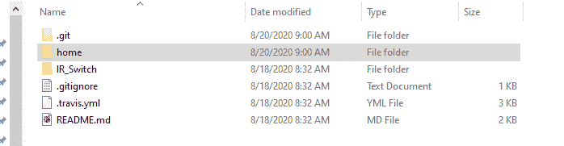](https://cdn.sparkfun.com/assets/learn_tutorials/1/0/0/0/file_structure2.png)Screenshot of the Source Files

在顶部你可以看到 **Home** 目录。这个目录包含控制主网页的脚本、图像和样式表。下面是**红外开关目录**，里面有控制红外绊网的草图。让我们看看主目录。

[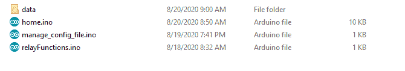](https://cdn.sparkfun.com/assets/learn_tutorials/1/0/0/0/home_directory.png)Inside the home directory

在这里 *home.ino* 得到了另外两个**的支持。ino** 脚本。如果你在 Arduino 中打开 *home.ino* ，你会看到几个包含另外两个 Arduino 草图的标签: *manage_config_file.ino* 和 *relayFunctions.ino* 。为了更好的组织，草图被分成了不同的文件，因为 home.ino 太长了，不容易浏览。当您将这些上传到 ESP32 时，所有三个草图将作为一个单独的草图上传。这里的**数据**文件夹保存将使用 ESP32 上传工具上传到 ESP32 模块的文件。这与上传草图不同。

[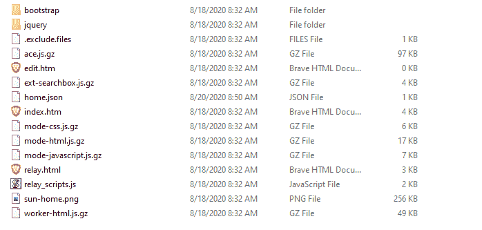](https://cdn.sparkfun.com/assets/learn_tutorials/1/0/0/0/data_directory.png)ESP32 SPIFFS upload in the "data" Directory

文件夹的名称被特别命名为 **data** ，因为 ESP32 上传工具在当前打开的草图的主目录中寻找一个“data”文件夹: *home.ino* 。**数据**的内容作为一个文件系统放在 ESP32 上，允许我们在网页上访问它们。这里的许多页面只是网页的支持角色成员——在下面的网页文件的[解释中有更多，除了 *home.json* 有 wifi 凭证和中继状态。](https://learn.sparkfun.com/tutorials/esp32-relay-web-server#explanation-of-webpage-files)

## 安装源文件

这很简单，只要一切都在正确的位置。在 Arduino IDE 中打开 *home.ino* sketch，您首先需要使用 ESP32 文件上传工具将*文件*上传到 ESP32，而不是草图。假设你已经把它放到了上传工具 [Github repo](https://github.com/me-no-dev/arduino-esp32fs-plugin) 上的正确位置，在**工具**下你会看到 *ESP32 草图数据上传*。

[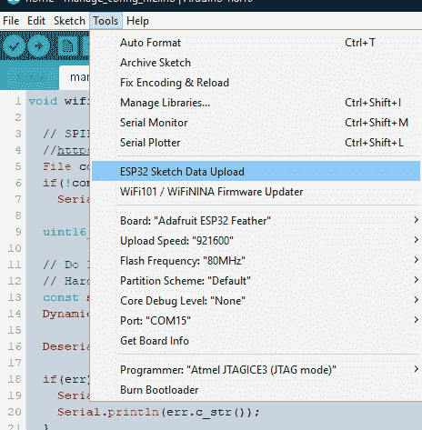](https://cdn.sparkfun.com/assets/learn_tutorials/1/0/0/0/Upload_Tool.png)ESP32 Upload Tool

这将获取**数据**文件夹，并将其中的所有内容放到 ESP32 上。上传文件前不要忘记修改 wifi 凭证，以免再次上传文件。接下来你将像往常一样上传草图，记住虽然这个文件夹里有三个*文件，但它们都将作为一个单独的草图上传。*

[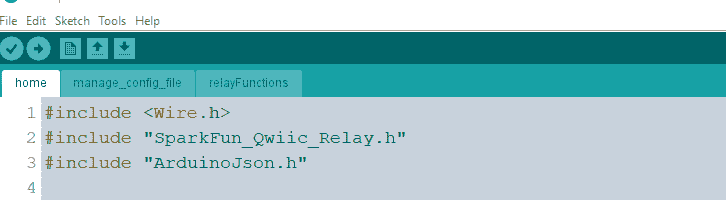](https://cdn.sparkfun.com/assets/learn_tutorials/1/0/0/0/Sketch_upload.png)Notice the three tabs at the top - they comprise one sketch.

## 网页文件说明

### 关于 CSS、JS 和 HTML 文件的简要说明

HTML 实际上构成了任何网站的主干。这是一种[标记语言](https://en.wikipedia.org/wiki/Markup_language)(像 JSON 一样)，意思是它的目的是在网站的许多部分提供信息！例如:

```
<h1>Press Me!</h1> 
```

文本“按我！”的“*属性*是 **h1** ，是一定大小的表头。其他的头还有 **h2** 、 **h3** 等，只是大小不同而已。为了让一个网站的外观和感觉只使用 HTML，额外的属性必须被添加到文本中，以定义颜色、大小或字体。

```
<h1><font color="red"> Press Me! </font></h1> 
```

除了标题**属性**之外，请注意“*字体颜色*”**属性**。现在想象一下定义其他东西，比如大小，或者不同的字体，然后想象一下你的网站已经完成了，但是你已经决定所有的标题都应该是绿色的。不得不管理是一件越来越痛苦的事情。进入**层叠样式表**。CSS 文件独立于 HTML 文件，可以在一行代码中决定每个*头文件应该是什么样子。不需要在 HTML 文件中为每个标题分配属性！只需将其导入到 HTML 文件的顶部即可！*

简单，现在让我们简要讨论一下 Javascript。Javacript 是[编程语言](https://en.wikipedia.org/wiki/Programming_language)，它决定了当网站上的一个按钮被按下时会发生什么。在这个项目中，当按钮被按下时，Javascript 将改变按钮上的文本，然后向 ESP32 发送**请求**以触发继电器。同样，在 HTML 文件的顶部导入这个 JS 文件。

### 进入引导程序

Bootstrap 是一个工具包，提供预先编写的 CSS 和 JS 文件，重点是使网站可伸缩，以适应大小屏幕。所有的网页文件都已经包含在源文件中，但是如果你想检查源文件并了解更多，那么下面的链接会把你带到引导下载网页。尽管如此，我们还是要讨论下面的下载中保留了哪些文件以及为什么。

[Bootstrap Download Page](https://getbootstrap.com/docs/4.4/getting-started/download/)

下载完 Bootstrap 源文件并解压后，有两个文件夹，一个标签为 **CSS** (层叠样式表)，另一个标签为 **JS** (Javascript)。忽略名称中带有以下修饰符的任何文件:

*   **网格**
*   **重启**
*   **地图**
*   **捆绑**

.....找到标签为 **bootstrap.min.js** 和 **bootstrap.min.css** 的文件。这些文件是在同一文件夹中找到的 CSS 或 JS 文件的“缩小”版本，但是删除了所有空格以减小文件大小。多少钱？

[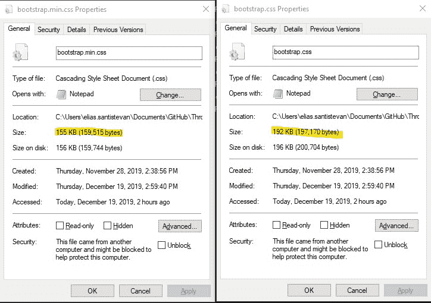](https://cdn.sparkfun.com/assets/learn_tutorials/1/0/0/0/file_size_comparison.jpg)"Minified" CSS vs. regular CSS[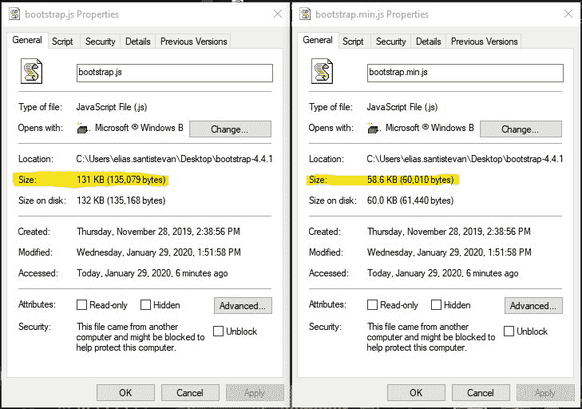](https://cdn.sparkfun.com/assets/learn_tutorials/1/0/0/0/js_file_size_comparison_update.jpg)"Minified" JS vs. regular JS

每个文件节省超过 40KB - 70KB *将对 ESP32 的大小产生巨大影响。对于这个项目，这些文件的其余部分可以忽略。下面的按钮链接到一个提供不同主题颜色的引导 CSS 文件的网站。例如，下图是“[太阳能](https://bootswatch.com/solar/)”主题(基于流行的文本编辑器[着色方案](https://en.wikipedia.org/wiki/Solarized_(color_scheme)))——大约在网页中间。只需点击**下载**即可获得 **bootstrap.min.css** 文件，该文件可以/将会替换从 bootstrap 网页下载的 css 源文件。*

[Bootswatch CSS Files](https://bootswatch.com/)[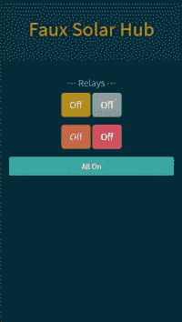](https://cdn.sparkfun.com/assets/learn_tutorials/1/0/0/0/Webpage_Medium.JPG)Solar Theme

为了帮助给出这个项目的上下文，这里是上图网站的 HTML，它包括在顶部的 Bootstrap JS 和 CSS 文件的导入，按钮创建的行，以及顶部的标题栏。

```
<!DOCTYPE html>
<html lang="en">
    <head>

        <!-- Required meta tags -->
        <meta charset="utf-8">
        <meta name="viewport" content="width=device-width, initial-scale=1, shrink-to-fit=no">

        <!-- Bootstrap CSS -->
        <link rel="stylesheet" href="bootstrap/bootstrap.min.css" media="screen"> 

        <script src="jquery/jquery.min.js"></script>
        <script src="bootstrap/bootstrap.min.js"></script>
        <script src="relay_scripts.js"></script>

    </head>

  <body>

    <div class="jumbotron jumbotron-fluid" style="text-align:center">
      <h1 class="text-primary">Faux Solar Hub</h1>
    </div>

    <!-- Buttons ================================================== -->
    <div class="container" style="text-align:center">
        <h5>---  Relays  ---</h5>
        <div class="btn-group-lg " role="group" aria-label="Relay Buttons">
            <button type="button btn-lg" class="btn btn-primary btn-lg" id="relay1" data-toggle="buttons">Off</button>
            <button type="button btn-lg" class="btn btn-secondary btn-lg" data-toggle="buttons" id="relay2">Off</button>
        </div>
        <p>
        <div class="btn-group-lg" role="group" aria-label="Relay Buttons">
            <button type="button btn-lg" class="btn btn-warning btn-lg" data-toggle="buttons" id="relay3">Off</button>
            <button type="button btn-lg" class="btn btn-danger btn-lg" data-toggle="buttons"  id="relay4">Off</button>
        </div>
    </div>

    <div class="container" style="text-align:center">
      <p>
        <p>
        <button type="button btn-lg" class="btn btn-success btn-block" data-toggle="buttons" id="totalControl">All On</button>
        </p>
      </p>
    </div>

  </body>
</html> 
```

## 状态机-解串/串行化数据

如上所述，我们将使用 ArduinoJSON 不仅存储继电器的“开”或“关”状态，还存储 Wifi 凭证。

#### 反序列化

Arduino JSON 网站上的教程相当精彩，所以这不会是他们那里的信息的回流，但我会检查这个项目的相关组件。

简而言之，反序列化就是我们如何读取 ESP32 上的 JSON 文档( *home.json* )以获取加载我们的 wifi 设置所需的信息。让我们再次看看我们在*数据*文件夹中的 JSON 文件，它是使用 ESP32 文件上传工具上传到 ESP32 的。

```
{
  "SSID" : "Wifi name",
  "Password": "password",
  "relay_states" : [0,0,0,0] 
} 
```

暂时忽略**“中继状态”**，我们看到这是一个相当简单的文档。为了获得这些信息，我们在 *manage_config_file.ino* 草图中做了两件主要的事情。第一个是打开 JSON 文件以获得 wifi 凭证并检查错误。

```
 File configFile = SPIFFS.open(configPath, "r");
  if(!configFile)
    Serial.println("Could not open file."); 
```

Opening the config file.

这很简单，我们需要文件的绝对路径:`configPath`，也就是`/home.json`。这在主 *home.ino* 草图中定义。下一件主要的事情是获取 JSON 文件中的 wifi 凭证并保存它们，以便它们可以用来连接 WiFi。这个过程并不像看起来那么简单，但是非常值得努力。

```
 const size_t capacity = JSON_ARRAY_SIZE(4) + JSON_OBJECT_SIZE(3) + 100;
  DynamicJsonDocument doc(capacity); 

  DeserializationError err = deserializeJson(doc, configFile);

  if(err) {
    Serial.print("Deserialization error:");
    Serial.println(err.c_str());
  }

  doc["SSID"].as<String>().toCharArray(ssid, 30);
  doc["Password"].as<String>().toCharArray(password, 30);

  configFile.close();

} 
```

Deserializing the JSON file.

首先，您必须确定要反序列化的信息的大小。在 ArduinoJSON 网站上，他们包括如何手动计算尺寸，但更好的是他们[提供了一个自动计算尺寸的工具](https://arduinojson.org/v6/assistant/)。注意，您想要的是*反序列化*和**所需的大小，而不是**序列化所需的大小。我相信现有的大小应该足够 90%的人的 WiFi 网络名称和密码，但如果你得到一个“名词记忆”错误，这是修改的地方。

接下来，创建一个具有给定大小的“doc”对象(这将保存来自 JSON 文件的信息)，并与`configFile`一起传递给`deserializeJson`。如果有错误，它将被打印到串行终端，但如果没有，我们将获取该信息并将其保存到`ssid`和`password`。这看起来有点古怪。为了清楚起见，让我们将这两行反序列化代码分解一下。

```
 doc["SSID"].as<String>().toCharArray(ssid, 30);
  doc["Password"].as<String>().toCharArray(password, 30); 
```

我可以(也尝试过)这样做:

```
const char* ssid = doc["SSID"]; 
```

这是正确的，因为 doc 返回一个`const char`指针。然而，由于我们是从一个文件中读取，这个文件稍后会被关闭，所以这个指针不会指向任何东西。所以我们不想保存指向我们信息的指针，我们宁愿保存信息本身。因此，我们使用一些内置的 C++魔法来获取被指向的 wifi 凭证，并将它们保存为一个字符数组。如果这超出了你的理解范围，不要担心，就让它保持原样，一切都正常。

#### 连载

**即将推出！**

## 硬件组件- ESP32 Web 服务器和四继电器

#### web 服务器的硬件:

我在这个项目的这一部分使用的零件如下(没有列出的是灯)。

[](https://www.sparkfun.com/products/15663) 

将**添加到您的[购物车](https://www.sparkfun.com/cart)中！**

### [【spark fun Thing Plus-ESP32 WROOM(微-B)](https://www.sparkfun.com/products/15663)

[Out of stock](https://learn.sparkfun.com/static/bubbles/ "out of stock") WRL-15663

SparkFun ESP32 Thing Plus 是开始使用 Espressif 物联网概念的下一步，同时还可以享受所有的便利设施

$22.5010[Favorited Favorite](# "Add to favorites") 48[Wish List](# "Add to wish list")****[](https://www.sparkfun.com/products/14428) 

### [Qwiic 线缆- 200mm](https://www.sparkfun.com/products/14428)

[Out of stock](https://learn.sparkfun.com/static/bubbles/ "out of stock") PRT-14428

这是一根 200 毫米长的 4 芯电缆，带有 1 毫米 JST 端接。它旨在将支持 Qwiic 的组件连接在一起…

[Favorited Favorite](# "Add to favorites") 21[Wish List](# "Add to wish list")[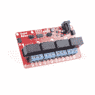](https://www.sparkfun.com/products/16566) 

将**添加到您的[购物车](https://www.sparkfun.com/cart)中！**

### [SparkFun Qwiic 四重接力](https://www.sparkfun.com/products/16566)

[Out of stock](https://learn.sparkfun.com/static/bubbles/ "out of stock") COM-16566

SparkFun Qwiic 四路继电器是一种独特的电源附件板，用于从您的 Arduino……

$32.506[Favorited Favorite](# "Add to favorites") 18[Wish List](# "Add to wish list")**** ****#### 硬件连接

这里我们可以作弊一下，因为我们使用的是支持 [Qwiic](https://www.sparkfun.com/qwiic) 的主板。需要向 ESP32、Qwiic 四路继电器上的继电器、Qwiic 四路继电器上的 ic 供电，并且还需要进行 I2C 连接。壁灯为 Qwiic 四路继电器上的继电器和下图中的 ESP32 供电。然后，为了供电并通过 I2C 在 Qwiic Quad Relay 和 ESP32 之间建立连接，需要使用 Qwiic 电缆。不需要焊接，非常非常好。

[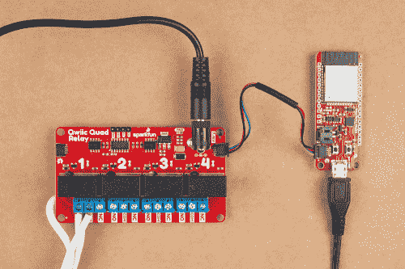](https://cdn.sparkfun.com/assets/home_page_posts/3/1/4/9/hardware.jpg)

没有列出从继电器到灯的连接。首先，简单回顾一下接力赛。

#### 继电器是如何工作的？

简单来说，继电器就是**开关**。然而，它们是**开关**，利用电的[磁性](https://en.wikipedia.org/wiki/Electromagnetism)，使开关与翻转它的东西分离。这是它们如此特别的根本原因——利用低压系统(在这种情况下是 3.3V ),一个人可以控制从墙壁出来的电，并控制像灯这样的设备！继电器的区别在于需要多少电压来翻转开关，以及当开关翻转时有多少功率可以通过开关(电压和电流的某种组合)。Qwiic 四路继电器上的继电器可以在 250 伏交流电压下处理 5 安培的电流，并且至少需要 3.3 伏来切换开关。

#### 灯连接

⚡ **Warning!** Make sure the lamp is **not** plugged into the wall as you cut into the wire in the following section.

为了将灯连接到 Qwiic 四路继电器，必须断开灯的一个连接，以便在我们打开灯时继电器可以关闭它。为此，切断电缆的一侧，然后剥去电缆，露出下面受保护的电线。

[](https://cdn.sparkfun.com/assets/learn_tutorials/8/3/9/cutting_wires.jpg)

现在剥开电线[剥去两端](https://learn.sparkfun.com/tutorials/working-with-wire#stranded-vs-solid)。

[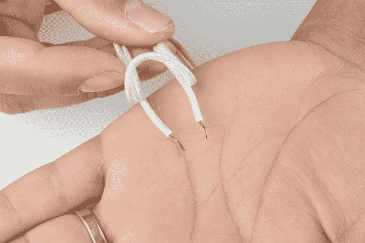](https://cdn.sparkfun.com/assets/learn_tutorials/8/3/9/cut_wires.jpg)

将一端放入螺丝端子的**公共(COM)** 输入，另一端放入**常开(NO)** 输入。**公共**输入是我们开关的中心，**常开**输入是开关的末端，当开关翻转时**将闭合**。下图应该有助于澄清任何困惑。

[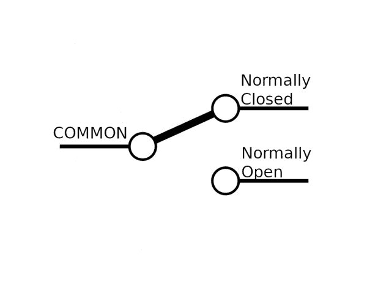](https://cdn.sparkfun.com/assets/learn_tutorials/8/3/9/single_pole_double_throw_with_text.jpg)

就是这样！

## 硬件组件-红外绊线

#### 红外绊网的硬件:

[](https://www.sparkfun.com/products/10969) 

将**添加到您的[购物车](https://www.sparkfun.com/cart)中！**

### [【电阻器套件- 1/4W(共 500)](https://www.sparkfun.com/products/10969)

[Out of stock](https://learn.sparkfun.com/static/bubbles/ "out of stock") COM-10969

电阻是个好东西，事实上，在许多电路设计中，电阻是至关重要的。唯一的问题似乎是…

$8.95180[Favorited Favorite](# "Add to favorites") 185[Wish List](# "Add to wish list")****[](https://www.sparkfun.com/products/12795) 

将**添加到您的[购物车](https://www.sparkfun.com/cart)中！**

### [【跳线-连接 6”(米/米，20 个装)](https://www.sparkfun.com/products/12795)

[In stock](https://learn.sparkfun.com/static/bubbles/ "in stock") PRT-12795

这些是 6 英寸长的跳线，两端都有公接头。使用这些从任何板上的任何母接头跳线到…

$2.102[Favorited Favorite](# "Add to favorites") 28[Wish List](# "Add to wish list")****[](https://www.sparkfun.com/products/13711) 

将**添加到您的[购物车](https://www.sparkfun.com/cart)中！**

### [SparkFun ESP8266 东西开发板](https://www.sparkfun.com/products/13711)

[In stock](https://learn.sparkfun.com/static/bubbles/ "in stock") WRL-13711

SparkFun ESP8266 Thing Dev Board 是一款开发板，专门围绕 ESP8266 设计，集成了一个

$18.5070[Favorited Favorite](# "Add to favorites") 58[Wish List](# "Add to wish list")****[](https://www.sparkfun.com/products/13689) 

将**添加到您的[购物车](https://www.sparkfun.com/cart)中！**

### [晶体管- NPN，50V 800mA (BC337)](https://www.sparkfun.com/products/13689)

[In stock](https://learn.sparkfun.com/static/bubbles/ "in stock") COM-13689

这是 BC337，一种 NPN 硅 BJT(双极结型晶体管)。这个小晶体管可以帮助你的项目…

$0.55[Favorited Favorite](# "Add to favorites") 20[Wish List](# "Add to wish list")****[](https://www.sparkfun.com/products/10266) 

将**添加到您的[购物车](https://www.sparkfun.com/cart)中！**

### [红外接收二极管- TSOP38238](https://www.sparkfun.com/products/10266)

[In stock](https://learn.sparkfun.com/static/bubbles/ "in stock") SEN-10266

使用这个简单的红外接收器对你的下一个项目进行红外遥控。具有低功耗和易于使用的 p…

$2.10[Favorited Favorite](# "Add to favorites") 19[Wish List](# "Add to wish list")****[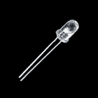](https://www.sparkfun.com/products/9349) 

将**添加到您的[购物车](https://www.sparkfun.com/cart)中！**

### [LED -红外 950nm](https://www.sparkfun.com/products/9349)

[In stock](https://learn.sparkfun.com/static/bubbles/ "in stock") COM-09349

这是一个非常简单、清晰的红外 LED。这些器件工作在 940-950 纳米之间，适用于通用红外系统，包括

$1.052[Favorited Favorite](# "Add to favorites") 17[Wish List](# "Add to wish list")************************[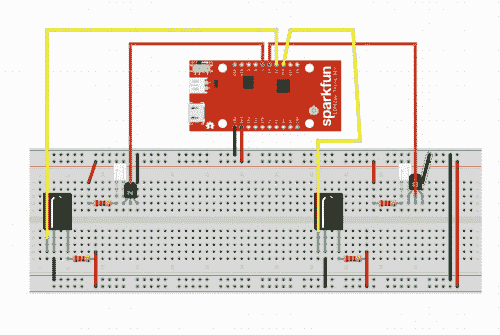](https://cdn.sparkfun.com/assets/home_page_posts/2/8/9/7/infrared_circuit.JPG)

## 资源和更进一步

*   **[ESPAsync 库](https://github.com/me-no-dev/ESPAsyncWebServer)** - Web 服务器库
*   **[AsycTCP](https://github.com/me-no-dev/AsyncTCP)**-ESPAsync 库的依赖库
*   **[SPIFFS](https://github.com/pellepl/spiffs)** - SPI Flash 文件系统
*   **[ESP32 文件上传工具](https://github.com/me-no-dev/arduino-esp32fs-plugin)** -将网页文件上传到 ESP32 的工具
*   **[node . js](https://nodejs.org/en/)**-HTML 文件的包管理器
*   **[Bootstrap page](https://getbootstrap.com/)**——制作动态流畅网页的工具包。****************